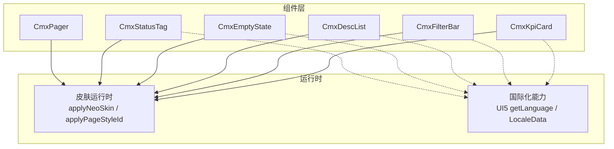
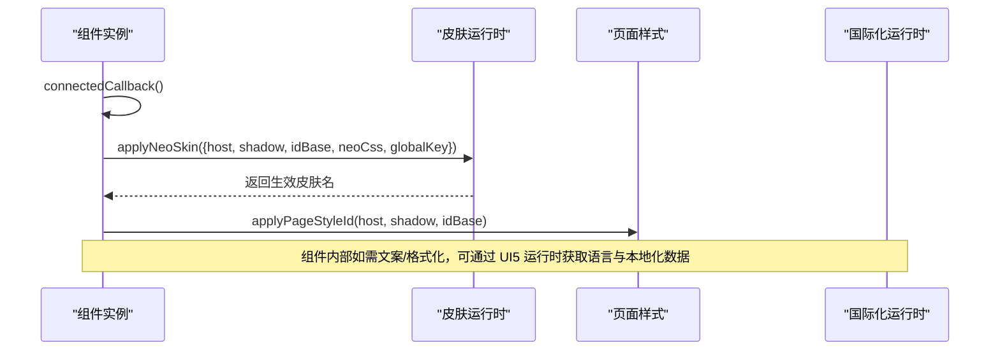
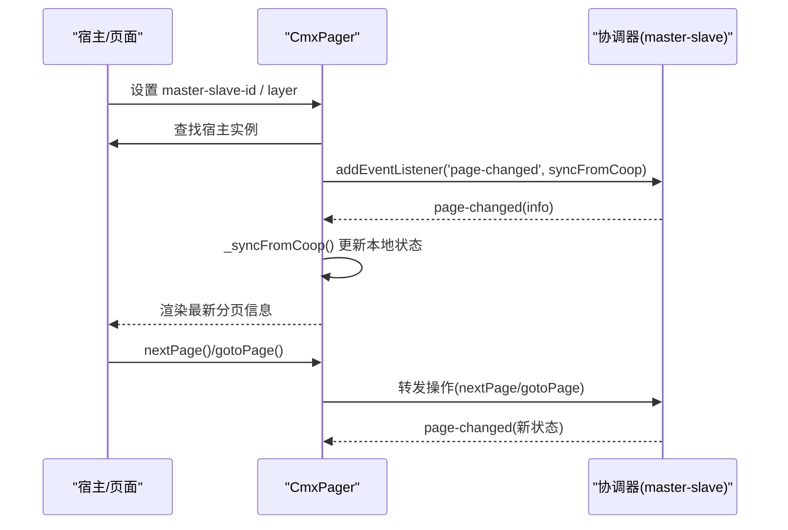
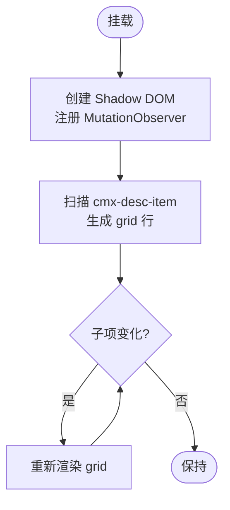
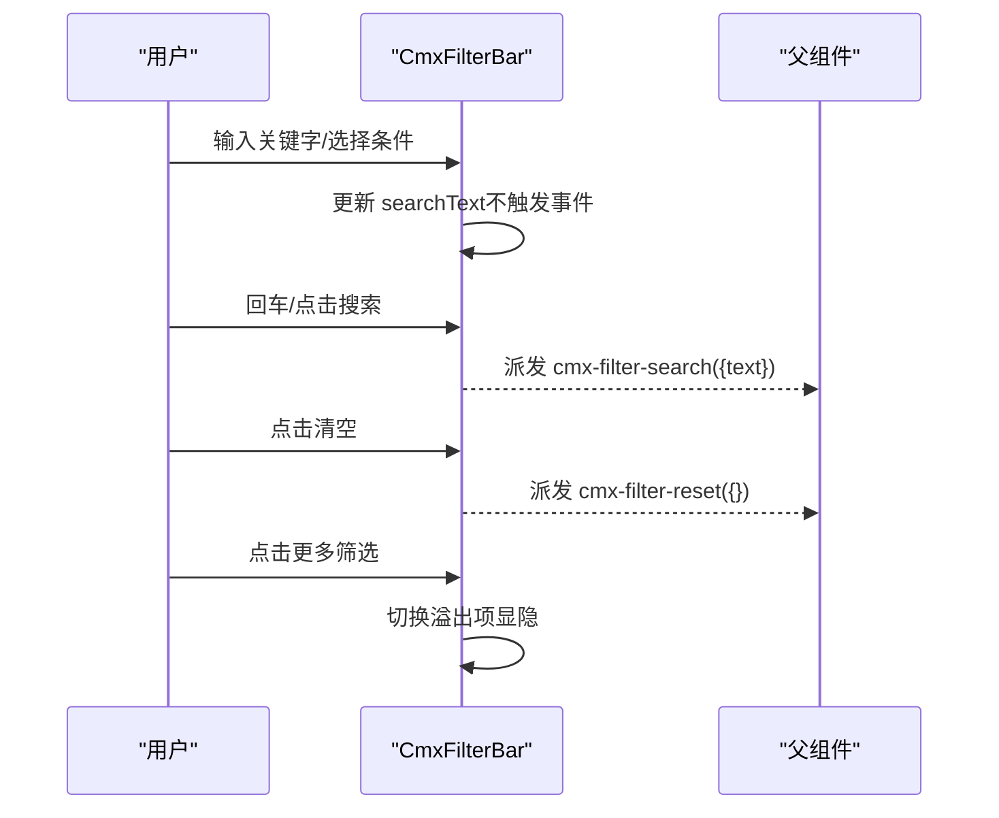
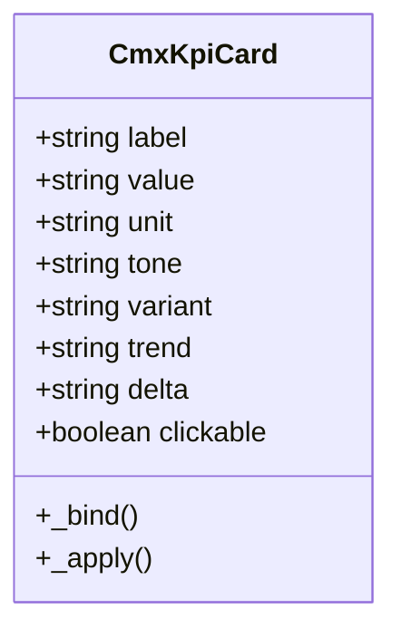
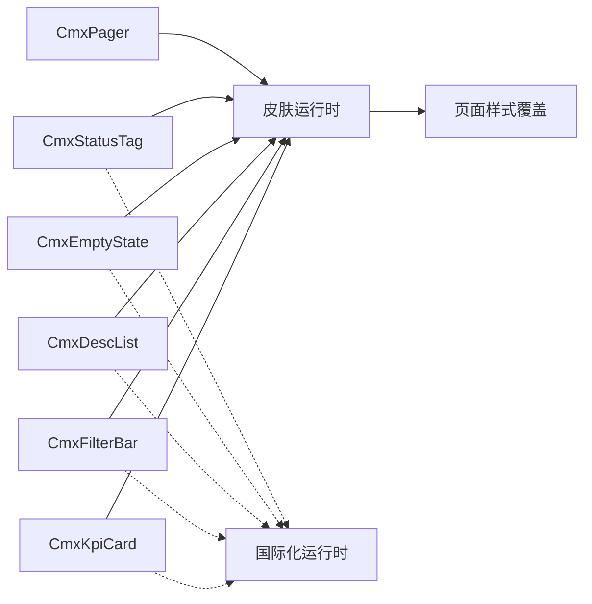

# 实用工具组件

<cite>
**本文引用的文件**
- [cmx-pager.js](file://packages/cmx-data-comp/src/components/cmx-pager.js)
- [cmx-status-tag.js](file://packages/cmx-data-comp/src/components/cmx-status-tag.js)
- [cmx-empty-state.js](file://packages/cmx-data-comp/src/components/cmx-empty-state.js)
- [cmx-desc-list.js](file://packages/cmx-data-comp/src/components/cmx-desc-list.js)
- [cmx-filter-bar.js](file://packages/cmx-data-comp/src/components/cmx-filter-bar.js)
- [cmx-kpi-card.js](file://packages/cmx-data-comp/src/components/cmx-kpi-card.js)
- [display-components.md](file://.agents/skills/cmx-components-guide/references/display-components.md)
- [cmx-skin-runtime.js](file://packages/cmx-data-comp/src/lib/cmx-skin-runtime.js)
- [page-style-guide.md](file://.agents/skills/cmx-components-guide/references/page-style-guide.md)
- [cmx-field-meta.js](file://packages/cmx-data-comp/src/lib/cmx-field-meta.js)
- [portal-ui5-locale-data-whitelist.js](file://CMXPortalManager/src/lib/portal-ui5-locale-data-whitelist.js)
- [locale-data-whitelist.js](file://packages/cmx-ui5-runtime/src/locale-data-whitelist.js)
</cite>

## 目录
1. [简介](#简介)
2. [项目结构](#项目结构)
3. [核心组件](#核心组件)
4. [架构总览](#架构总览)
5. [详细组件分析](#详细组件分析)
6. [依赖关系分析](#依赖关系分析)
7. [性能考虑](#性能考虑)
8. [故障排查指南](#故障排查指南)
9. [结论](#结论)
10. [附录](#附录)

## 简介
本章节面向 CMX 平台中的“实用工具组件”，聚焦以下六个通用辅助组件：分页器（CmxPager）、状态标签（CmxStatusTag）、空状态（CmxEmptyState）、描述列表（CmxDescList）、筛选栏（CmxFilterBar）与 KPI 卡片（CmxKpiCard）。文档从配置选项、样式定制、事件处理、业务组合模式、可访问性、国际化适配与性能优化等维度进行系统化说明，并提供最佳实践建议。

## 项目结构
这些组件统一位于 cmx-data-comp 包中，遵循“组件 + 皮肤运行时”的解耦设计：
- 组件实现：各组件以 Web Components 形式提供，使用 Shadow DOM 隔离样式与行为。
- 皮肤系统：通过统一的 applyNeoSkin 机制注入 neo 皮肤 CSS，并支持页面级样式覆盖。
- 国际化：基于 UI5 运行时语言能力，结合本地化数据白名单，确保文本与数字格式在多语言下正确显示。

图表来源
- [cmx-skin-runtime.js:83-113](file://packages/cmx-data-comp/src/lib/cmx-skin-runtime.js#L83-L113)
- [cmx-field-meta.js:1-30](file://packages/cmx-data-comp/src/lib/cmx-field-meta.js#L1-L30)
- [portal-ui5-locale-data-whitelist.js:1-30](file://CMXPortalManager/src/lib/portal-ui5-locale-data-whitelist.js#L1-L30)
- [locale-data-whitelist.js:1-19](file://packages/cmx-ui5-runtime/src/locale-data-whitelist.js#L1-L19)

章节来源
- [display-components.md:1-290](file://.agents/skills/cmx-components-guide/references/display-components.md#L1-L290)

## 核心组件
本节概述各组件的职责、关键属性、事件与典型用法要点，便于快速定位与选型。

- CmxPager（分页器）
  - 职责：提供页码切换、每页条数选择、协作模式（与 master-slave 协调器联动）。
  - 关键属性：page、pageSize、pageSizes、total、compact、master-slave-id、layer。
  - 事件：page-change（独立模式），协作模式下由协调器派发 page-changed。
  - 命令式 API：nextPage/prevPage/firstPage/lastPage/gotoPage/setPageSize/getPagingInfo。
  - 典型场景：表格/列表分页；与协调器配合时自动同步页码与页大小。

- CmxStatusTag（状态标签）
  - 职责：语义色 + 填充风格的状态徽章，收敛大量手搓 chip/badge。
  - 关键属性：tone、variant、dot、size、data-cmx-skin。
  - 典型场景：单据状态、审核结果、类型标识等。

- CmxEmptyState（空状态）
  - 职责：图标 + 标题 + 副标题 + 动作区的空态占位。
  - 关键属性：icon、title、description、size、data-cmx-skin、data-cmx-skin-tone。
  - Slot：icon/title/description/默认动作区。
  - 典型场景：无数据、无权限、初始化加载完成但无结果。

- CmxDescList（描述列表）
  - 职责：label:value 两列只读清单，响应式网格布局。
  - 关键属性：columns、label-width、border、tone、data-cmx-skin、data-cmx-skin-tone。
  - 子元素：cmx-desc-item（label 属性 + slot 值）。
  - 典型场景：详情面板、基本信息展示。

- CmxFilterBar（筛选栏）
  - 职责：内置搜索框 + slot 自定义条件 + 搜索/清空事件。
  - 关键属性：collapsible、collapsed、search-text、search-placeholder、show-search、collapse-overflow、tone、data-cmx-skin、data-cmx-skin-tone。
  - 事件：cmx-filter-search、cmx-filter-reset。
  - 典型场景：列表查询条件区，支持溢出折叠与可折叠收起。

- CmxKpiCard（KPI 卡片）
  - 职责：统计卡/KPI 指标卡，统一两种视觉风格与语义色调。
  - 关键属性：label、value、unit、tone、variant、trend、delta、clickable、data-cmx-skin、data-cmx-skin-tone。
  - 事件：cmx-kpi-click（clickable 时）。
  - 典型场景：看板指标、财务指标、趋势展示。

章节来源
- [cmx-pager.js:1-577](file://packages/cmx-data-comp/src/components/cmx-pager.js#L1-L577)
- [cmx-status-tag.js:1-113](file://packages/cmx-data-comp/src/components/cmx-status-tag.js#L1-L113)
- [cmx-empty-state.js:1-140](file://packages/cmx-data-comp/src/components/cmx-empty-state.js#L1-L140)
- [cmx-desc-list.js:1-168](file://packages/cmx-data-comp/src/components/cmx-desc-list.js#L1-L168)
- [cmx-filter-bar.js:1-341](file://packages/cmx-data-comp/src/components/cmx-filter-bar.js#L1-L341)
- [cmx-kpi-card.js:1-200](file://packages/cmx-data-comp/src/components/cmx-kpi-card.js#L1-L200)
- [display-components.md:90-290](file://.agents/skills/cmx-components-guide/references/display-components.md#L90-L290)

## 架构总览
组件采用“轻量宿主 + 皮肤运行时”的统一架构：
- 每个组件在 connectedCallback 中创建 Shadow DOM，并通过 applyNeoSkin 注入 neo 皮肤 CSS，同时应用页面级样式覆盖。
- 皮肤运行时负责解析 data-cmx-skin、全局默认开关与 tone 变体，保证主题一致性与可替换性。
- 国际化通过 UI5 运行时读取当前语言，并结合 locale data 白名单，确保多语言环境下的正确渲染。

图表来源
- [cmx-skin-runtime.js:83-113](file://packages/cmx-data-comp/src/lib/cmx-skin-runtime.js#L83-L113)
- [cmx-field-meta.js:1-30](file://packages/cmx-data-comp/src/lib/cmx-field-meta.js#L1-L30)
- [portal-ui5-locale-data-whitelist.js:1-30](file://CMXPortalManager/src/lib/portal-ui5-locale-data-whitelist.js#L1-L30)
- [locale-data-whitelist.js:1-19](file://packages/cmx-ui5-runtime/src/locale-data-whitelist.js#L1-L19)

## 详细组件分析

### CmxPager（分页器）
- 双模式
  - 独立模式：自管 page/pageSize/total，派发 page-change 事件，外部监听后拉取数据并回填 total。
  - 协作模式：设置 master-slave-id + layer，操作转发到协调器，状态从协调器 page-changed 反向同步。
- 关键属性与 API
  - 属性：page、pageSize、pageSizes、total、compact、master-slave-id、layer。
  - 方法：nextPage/prevPage/firstPage/lastPage/gotoPage/setPageSize/getPagingInfo。
- 事件
  - page-change：独立模式下发，detail 包含 page、pageSize、total、totalPages、offset、reason。
- 协作连接流程
  - 挂载时尝试查找宿主上的协调器实例，绑定 page-changed 监听；若未就绪则轮询等待。
  - 协调器就绪后镜像其分页信息到本地状态，避免循环回写。

图表来源
- [cmx-pager.js:414-487](file://packages/cmx-data-comp/src/components/cmx-pager.js#L414-L487)
- [cmx-pager.js:367-404](file://packages/cmx-data-comp/src/components/cmx-pager.js#L367-L404)

章节来源
- [cmx-pager.js:1-577](file://packages/cmx-data-comp/src/components/cmx-pager.js#L1-L577)

### CmxStatusTag（状态标签）
- 配置选项
  - tone：success/warning/danger/info/neutral。
  - variant：solid/subtle/outline。
  - dot：前缀发光圆点。
  - size：sm/md。
  - data-cmx-skin：neo/none。
- 样式定制
  - 通过 applyNeoSkin 注入 neo 皮肤，flat 模式使用 SAP token 兜底。
- 事件
  - 无内置事件，点击由父级或外层按钮处理。

章节来源
- [cmx-status-tag.js:1-113](file://packages/cmx-data-comp/src/components/cmx-status-tag.js#L1-L113)
- [display-components.md:90-114](file://.agents/skills/cmx-components-guide/references/display-components.md#L90-L114)

### CmxEmptyState（空状态）
- 配置选项
  - icon、title、description、size、data-cmx-skin、data-cmx-skin-tone。
- Slot
  - icon/title/description/默认动作区，均可覆盖。
- 样式定制
  - 基础布局居中，图标圆形容器，标题与描述层级清晰；neo 皮肤接管配色。

章节来源
- [cmx-empty-state.js:1-140](file://packages/cmx-data-comp/src/components/cmx-empty-state.js#L1-L140)
- [display-components.md:117-143](file://.agents/skills/cmx-components-guide/references/display-components.md#L117-L143)

### CmxDescList（描述列表）
- 配置选项
  - columns、label-width、border、tone、data-cmx-skin、data-cmx-skin-tone。
- 子元素
  - cmx-desc-item：label 属性 + slot 值；增删与 label 变化由 MutationObserver 自动重渲染。
- 样式定制
  - 通过 CSS 变量驱动列数与标签宽度；neo 皮肤统一边框与背景。

图表来源
- [cmx-desc-list.js:50-67](file://packages/cmx-data-comp/src/components/cmx-desc-list.js#L50-L67)
- [cmx-desc-list.js:126-137](file://packages/cmx-data-comp/src/components/cmx-desc-list.js#L126-L137)

章节来源
- [cmx-desc-list.js:1-168](file://packages/cmx-data-comp/src/components/cmx-desc-list.js#L1-L168)
- [display-components.md:147-176](file://.agents/skills/cmx-components-guide/references/display-components.md#L147-L176)

### CmxFilterBar（筛选栏）
- 配置选项
  - collapsible、collapsed、search-text、search-placeholder、show-search、collapse-overflow、tone、data-cmx-skin、data-cmx-skin-tone。
- 事件
  - cmx-filter-search：搜索/回车触发，detail.text。
  - cmx-filter-reset：清空触发，detail 为空对象。
- 溢出折叠
  - collapse-overflow：首行放不下时隐藏多余条件控件，显示“更多筛选(n)”；展开态维持展开。
- 双向绑定
  - search-text 与输入框双向同步，避免每次按键都触发搜索。

图表来源
- [cmx-filter-bar.js:145-182](file://packages/cmx-data-comp/src/components/cmx-filter-bar.js#L145-L182)
- [cmx-filter-bar.js:198-249](file://packages/cmx-data-comp/src/components/cmx-filter-bar.js#L198-L249)

章节来源
- [cmx-filter-bar.js:1-341](file://packages/cmx-data-comp/src/components/cmx-filter-bar.js#L1-L341)
- [display-components.md:180-235](file://.agents/skills/cmx-components-guide/references/display-components.md#L180-L235)

### CmxKpiCard（KPI 卡片）
- 配置选项
  - label、value、unit、tone、variant、trend、delta、clickable、data-cmx-skin、data-cmx-skin-tone。
- 事件
  - cmx-kpi-click：clickable 时点击派发，detail 包含 label/value。
- 可访问性
  - clickable 时设置 role="link" 与 tabindex="0"，支持键盘 Enter/Space 触发。
- 趋势展示
  - trend up/down/flat，配合 delta 显示趋势数值。

图表来源
- [cmx-kpi-card.js:25-126](file://packages/cmx-data-comp/src/components/cmx-kpi-card.js#L25-L126)
- [cmx-kpi-card.js:140-166](file://packages/cmx-data-comp/src/components/cmx-kpi-card.js#L140-L166)

章节来源
- [cmx-kpi-card.js:1-200](file://packages/cmx-data-comp/src/components/cmx-kpi-card.js#L1-L200)
- [display-components.md:239-276](file://.agents/skills/cmx-components-guide/references/display-components.md#L239-L276)

## 依赖关系分析
- 组件与皮肤运行时
  - 所有组件通过 applyNeoSkin 注入 neo 皮肤，支持 data-cmx-skin 与 data-cmx-skin-tone 控制。
  - 页面级样式覆盖通过 applyPageStyleId 实现，优先级最高。
- 组件与国际化
  - 通过 UI5 运行时读取当前语言，结合 locale data 白名单（zh_CN/zh_TW/en）确保本地化数据可用。
- 组件间协作
  - CmxPager 可与 master-slave 协调器协作，实现跨组件分页状态同步。

图表来源
- [cmx-skin-runtime.js:83-113](file://packages/cmx-data-comp/src/lib/cmx-skin-runtime.js#L83-L113)
- [cmx-field-meta.js:1-30](file://packages/cmx-data-comp/src/lib/cmx-field-meta.js#L1-L30)
- [portal-ui5-locale-data-whitelist.js:1-30](file://CMXPortalManager/src/lib/portal-ui5-locale-data-whitelist.js#L1-L30)
- [locale-data-whitelist.js:1-19](file://packages/cmx-ui5-runtime/src/locale-data-whitelist.js#L1-L19)

章节来源
- [page-style-guide.md:226-416](file://.agents/skills/cmx-components-guide/references/page-style-guide.md#L226-L416)

## 性能考虑
- 分页器
  - 协作模式下避免循环回写：仅镜像协调器状态，不触发 setAttribute 回写。
  - 按钮 disabled 规则在 total 未知时不禁用 next/last，减少无效交互。
- 筛选栏
  - 溢出折叠使用 rAF 防抖与 ResizeObserver，避免频繁重排。
  - 搜索输入双向绑定但不触发事件，降低查询频率。
- 描述列表
  - 使用 MutationObserver 监听子项变化，自动重建渲染，避免手动刷新。
- 皮肤与样式
  - 通过 CSS 变量驱动布局（如列数、标签宽），减少 JS 计算。
  - 皮肤注入仅在属性变化时执行，避免重复开销。

[本节为通用指导，不直接分析具体文件]

## 故障排查指南
- 分页器协作模式未生效
  - 检查是否设置了 master-slave-id 且宿主存在对应协调器实例。
  - 确认协调器已启用分页并暴露 getPagingInfo 与 addEventListener。
  - 观察占位提示：协调器版本过低或未启用分页时会显示提示信息。
- 筛选栏溢出折叠异常
  - 确认 collapse-overflow 已设置；slot 内条件控件需为可见元素。
  - 窗口尺寸变化或 UI5 组件异步注册可能导致布局抖动，组件已通过 rAF 与 ResizeObserver 缓解。
- 皮肤未生效
  - 检查 data-cmx-skin 与 data-cmx-skin-tone 是否正确设置。
  - 页面级样式覆盖需通过 data-cmx-style-id 引用同页 style/template。
- 国际化显示异常
  - 确认 UI5 运行时已就绪并可调用 getLanguage。
  - 检查 locale data 白名单是否包含所需语言（zh_CN/zh_TW/en）。

章节来源
- [cmx-pager.js:414-504](file://packages/cmx-data-comp/src/components/cmx-pager.js#L414-L504)
- [cmx-filter-bar.js:188-249](file://packages/cmx-data-comp/src/components/cmx-filter-bar.js#L188-L249)
- [cmx-skin-runtime.js:83-113](file://packages/cmx-data-comp/src/lib/cmx-skin-runtime.js#L83-L113)
- [cmx-field-meta.js:1-30](file://packages/cmx-data-comp/src/lib/cmx-field-meta.js#L1-L30)
- [portal-ui5-locale-data-whitelist.js:1-30](file://CMXPortalManager/src/lib/portal-ui5-locale-data-whitelist.js#L1-L30)
- [locale-data-whitelist.js:1-19](file://packages/cmx-ui5-runtime/src/locale-data-whitelist.js#L1-L19)

## 结论
CMX 实用工具组件以统一的皮肤运行时与国际化能力为基础，提供了分页、状态、空态、描述列表、筛选与 KPI 展示等高频场景的标准化解决方案。通过属性、Slot、事件与命令式 API 的组合，开发者可在不同业务场景中灵活复用与扩展。建议在复杂页面中优先采用协作模式（分页器）与溢出折叠（筛选栏）以提升用户体验与性能。

[本节为总结，不直接分析具体文件]

## 附录
- 常用组合模式
  - 列表页：CmxFilterBar + CmxPager + CmxEmptyState（无数据时）+ CmxDescList（详情面板）。
  - 看板页：多个 CmxKpiCard 展示关键指标，配合 CmxStatusTag 标注状态。
- 最佳实践
  - 使用 data-cmx-skin 与 data-cmx-skin-tone 控制主题与强调色，避免硬编码颜色。
  - 在协作模式下，优先通过协调器管理分页状态，避免多处状态不一致。
  - 对长列表与复杂筛选，合理使用溢出折叠与防抖策略，提升交互流畅度。

[本节为补充内容，不直接分析具体文件]