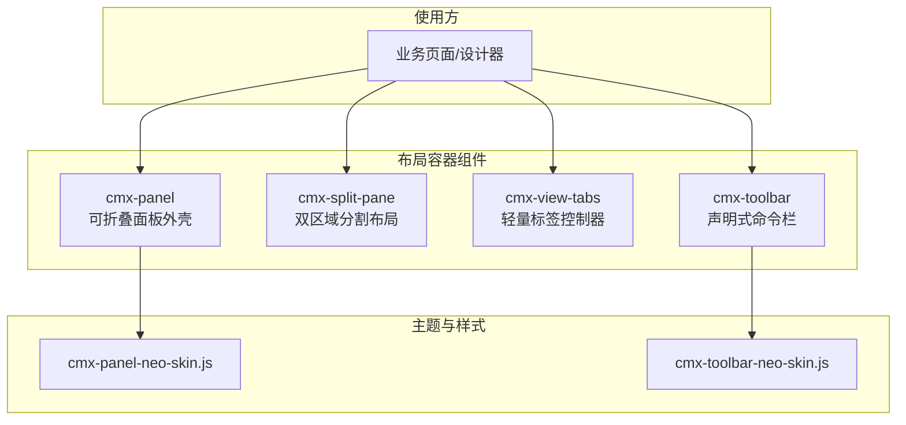
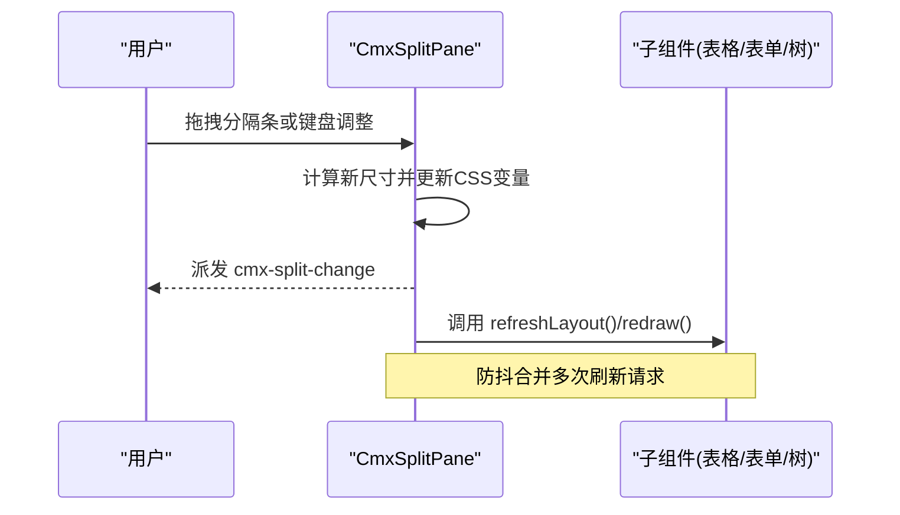
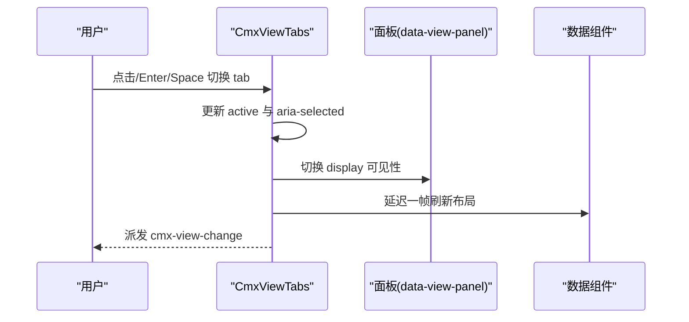
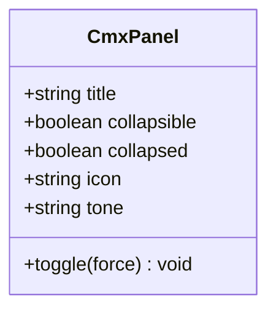
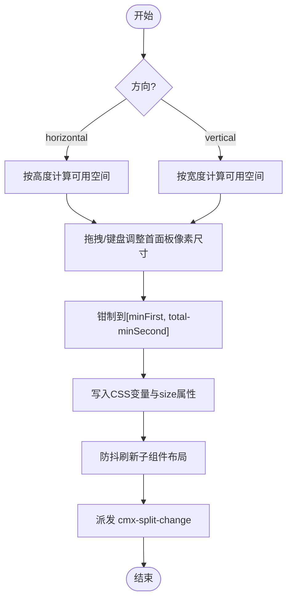
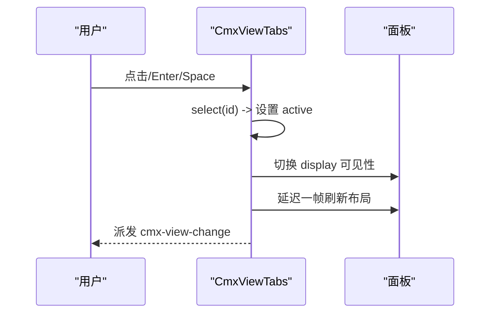
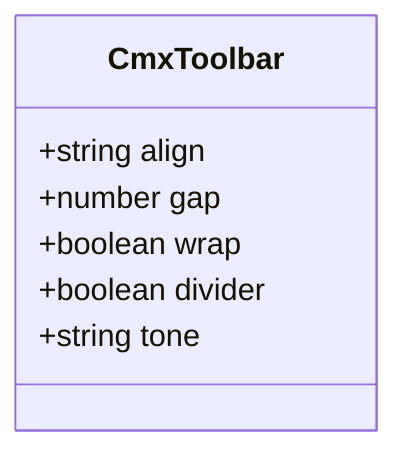
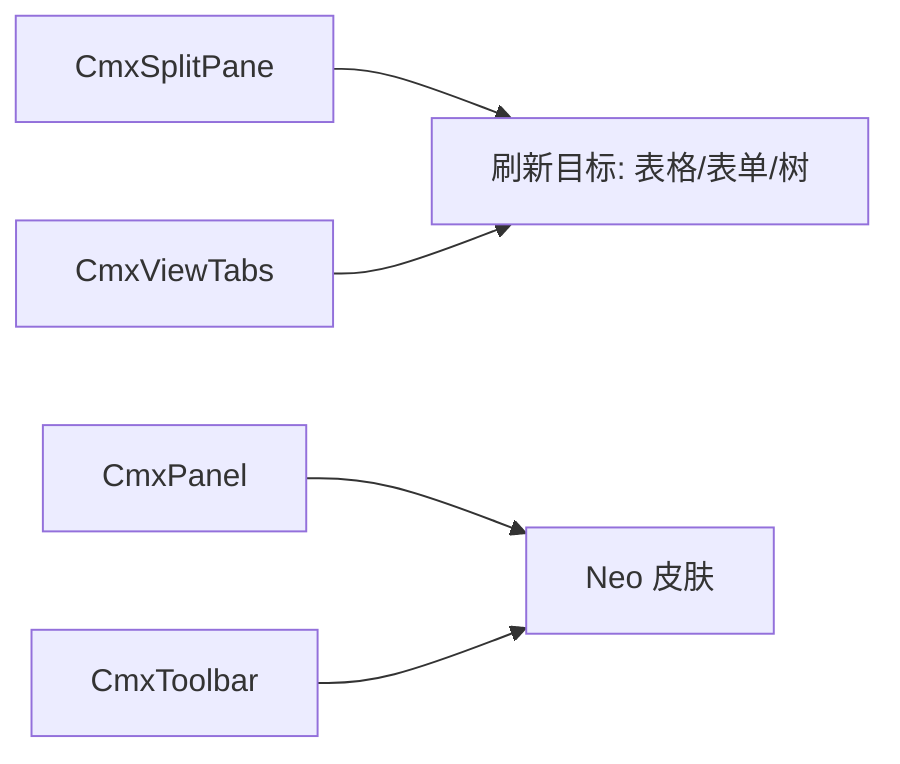

# 布局容器组件

<cite>
**本文引用的文件**
- [cmx-panel.js](file://packages/cmx-data-comp/src/components/cmx-panel.js)
- [cmx-split-pane.js](file://packages/cmx-data-comp/src/components/cmx-split-pane.js)
- [cmx-view-tabs.js](file://packages/cmx-data-comp/src/components/cmx-view-tabs.js)
- [cmx-toolbar.js](file://packages/cmx-data-comp/src/components/cmx-toolbar.js)
- [cmx-panel-neo-skin.js](file://packages/cmx-data-comp/src/lib/cmx-panel-neo-skin.js)
- [cmx-toolbar-neo-skin.js](file://packages/cmx-data-comp/src/lib/cmx-toolbar-neo-skin.js)
- [layout-containers.md](file://.agents/skills/cmx-components-guide/references/layout-containers.md)
</cite>

## 目录
1. [简介](#简介)
2. [项目结构](#项目结构)
3. [核心组件](#核心组件)
4. [架构总览](#架构总览)
5. [详细组件分析](#详细组件分析)
6. [依赖关系分析](#依赖关系分析)
7. [性能与可访问性](#性能与可访问性)
8. [故障排查指南](#故障排查指南)
9. [结论](#结论)
10. [附录：复杂页面布局示例与设计模式](#附录复杂页面布局示例与设计模式)

## 简介
本文件面向 CMX 布局容器组件，系统性说明面板（CmxPanel）、分割面板（CmxSplitPane）、标签页（CmxViewTabs）和工具栏（CmxToolbar）的使用方法、配置项、嵌套结构与响应式行为。文档还涵盖组件间通信、状态管理、事件传递机制，以及布局持久化、主题定制与可访问性支持，并提供构建复杂页面布局的参考模式与实践建议。

## 项目结构
CMX 布局容器组件位于统一的数据组件包中，采用 Web Components 实现，通过 slot 透传内容，使用 CSS 变量与皮肤模块进行主题定制，并通过自定义事件在组件之间解耦通信。

图表来源
- [cmx-panel.js:30-158](file://packages/cmx-data-comp/src/components/cmx-panel.js#L30-L158)
- [cmx-toolbar.js:21-95](file://packages/cmx-data-comp/src/components/cmx-toolbar.js#L21-L95)
- [cmx-panel-neo-skin.js:11-91](file://packages/cmx-data-comp/src/lib/cmx-panel-neo-skin.js#L11-L91)
- [cmx-toolbar-neo-skin.js:5-46](file://packages/cmx-data-comp/src/lib/cmx-toolbar-neo-skin.js#L5-L46)

章节来源
- [cmx-panel.js:30-158](file://packages/cmx-data-comp/src/components/cmx-panel.js#L30-L158)
- [cmx-split-pane.js:48-197](file://packages/cmx-data-comp/src/components/cmx-split-pane.js#L48-L197)
- [cmx-view-tabs.js:14-124](file://packages/cmx-data-comp/src/components/cmx-view-tabs.js#L14-L124)
- [cmx-toolbar.js:21-127](file://packages/cmx-data-comp/src/components/cmx-toolbar.js#L21-L127)

## 核心组件
- 面板（CmxPanel）：提供标题栏、内容区与可选折叠态；支持 neo 主题色调与无障碍属性。
- 分割面板（CmxSplitPane）：支持水平/垂直方向的可拖拽双区域布局，自动刷新子组件布局。
- 标签页（CmxViewTabs）：基于 data-view 与 data-view-panel 的轻量 tab 切换，自动刷新激活面板内的数据组件。
- 工具栏（CmxToolbar）：左右分区命令条，支持对齐、间距、换行、分隔线与 neo 主题色调。

章节来源
- [layout-containers.md:6-101](file://.agents/skills/cmx-components-guide/references/layout-containers.md#L6-L101)
- [cmx-panel.js:30-186](file://packages/cmx-data-comp/src/components/cmx-panel.js#L30-L186)
- [cmx-split-pane.js:48-197](file://packages/cmx-data-comp/src/components/cmx-split-pane.js#L48-L197)
- [cmx-view-tabs.js:14-124](file://packages/cmx-data-comp/src/components/cmx-view-tabs.js#L14-L124)
- [cmx-toolbar.js:21-127](file://packages/cmx-data-comp/src/components/cmx-toolbar.js#L21-L127)

## 架构总览
布局容器以“容器 + 插槽”的方式组织 UI，通过属性驱动渲染、事件驱动通信，并使用 CSS 变量与皮肤模块实现主题定制。分割面板与标签页在交互后主动刷新内部数据组件布局，保证尺寸变化后的正确显示。

图表来源
- [cmx-split-pane.js:101-197](file://packages/cmx-data-comp/src/components/cmx-split-pane.js#L101-L197)

图表来源
- [cmx-view-tabs.js:22-99](file://packages/cmx-data-comp/src/components/cmx-view-tabs.js#L22-L99)

## 详细组件分析

### 面板（CmxPanel）
- 功能要点
  - 标题栏、图标、操作区与内容区；支持折叠态与摘要槽位。
  - 可折叠时提供键盘交互（Enter/Space）与无障碍属性（role、aria-expanded、tabindex）。
  - 支持 neo 主题色调与页面级样式注入。
- 关键属性与方法
  - 属性：title、collapsible、collapsed、icon、tone、data-cmx-skin、data-cmx-skin-tone。
  - 方法：toggle(force)。
- 事件
  - cmx-panel-collapse：detail 包含 collapsed 布尔值。
- 主题与可访问性
  - 通过 skin 运行时将 tone 同步到 data-cmx-skin-tone，匹配 neo 皮肤选择器。
  - 可折叠头部 role=button，非折叠为 heading；折叠箭头随状态旋转。

图表来源
- [cmx-panel.js:30-186](file://packages/cmx-data-comp/src/components/cmx-panel.js#L30-L186)
- [cmx-panel-neo-skin.js:11-91](file://packages/cmx-data-comp/src/lib/cmx-panel-neo-skin.js#L11-L91)

章节来源
- [cmx-panel.js:30-186](file://packages/cmx-data-comp/src/components/cmx-panel.js#L30-L186)
- [cmx-panel-neo-skin.js:11-91](file://packages/cmx-data-comp/src/lib/cmx-panel-neo-skin.js#L11-L91)

### 分割面板（CmxSplitPane）
- 功能要点
  - 支持 horizontal（上下）与 vertical（左右）两种方向。
  - 拖拽分隔条或使用方向键微调首面板尺寸，受最小尺寸约束。
  - 拖拽结束与键盘调整后递归刷新子组件布局（表格/表单/树等）。
- 关键属性与方法
  - 属性：orientation、size、min-first、min-second、splitter-size。
  - 方法：setSize(value)、refresh()。
- 事件
  - cmx-split-change：detail 包含 size。
- 交互细节
  - 指针捕获提升拖拽体验；Shift 加速步长；ARIA 属性（role、aria-orientation、aria-valuenow）。

图表来源
- [cmx-split-pane.js:101-197](file://packages/cmx-data-comp/src/components/cmx-split-pane.js#L101-L197)

章节来源
- [cmx-split-pane.js:48-197](file://packages/cmx-data-comp/src/components/cmx-split-pane.js#L48-L197)

### 标签页（CmxViewTabs）
- 功能要点
  - 通过 slot="tabs" 放置带 data-view 的按钮，默认 slot 放置带 data-view-panel 的面板。
  - 无 active 时自动取首个 tab 的 id；切换后自动刷新激活面板内数据组件布局。
  - 支持 data-cmx-fill 撑满父容器。
- 关键属性与方法
  - 属性：active。
  - 方法：select(id)。
- 事件
  - cmx-view-change：detail 包含 view。
- 可访问性
  - 为每个 tab 设置 tabindex 与 aria-selected。

图表来源
- [cmx-view-tabs.js:22-99](file://packages/cmx-data-comp/src/components/cmx-view-tabs.js#L22-L99)

章节来源
- [cmx-view-tabs.js:14-124](file://packages/cmx-data-comp/src/components/cmx-view-tabs.js#L14-L124)

### 工具栏（CmxToolbar）
- 功能要点
  - 主操作区与右侧次要操作区；支持对齐、间距、换行与分隔线。
  - 通过 slot 透传 UI5 控件，保持声明式简洁。
  - 支持 neo 主题色调与页面级样式注入。
- 关键属性与方法
  - 属性：align、gap、wrap、divider、tone、data-cmx-skin、data-cmx-skin-tone。
- 主题
  - 通过 skin 运行时将 tone 同步到 data-cmx-skin-tone，匹配 neo 皮肤选择器。

图表来源
- [cmx-toolbar.js:21-127](file://packages/cmx-data-comp/src/components/cmx-toolbar.js#L21-L127)
- [cmx-toolbar-neo-skin.js:5-46](file://packages/cmx-data-comp/src/lib/cmx-toolbar-neo-skin.js#L5-L46)

章节来源
- [cmx-toolbar.js:21-127](file://packages/cmx-data-comp/src/components/cmx-toolbar.js#L21-L127)
- [cmx-toolbar-neo-skin.js:5-46](file://packages/cmx-data-comp/src/lib/cmx-toolbar-neo-skin.js#L5-L46)

## 依赖关系分析
- 组件耦合
  - CmxSplitPane 与 CmxViewTabs 均会查找并刷新子组件布局（表格/表单/树），形成松耦合的“约定式刷新”。
  - CmxPanel 与 CmxToolbar 通过 skin 运行时与 CSS 变量进行主题绑定，避免硬编码样式。
- 外部依赖
  - UI5 Icon 用于面板图标渲染。
  - Neo 皮肤模块提供统一的视觉风格与色调变体。
- 潜在循环依赖
  - 组件之间无直接 import 依赖，仅通过 DOM 查询与事件通信，降低耦合度。

图表来源
- [cmx-split-pane.js:34-46](file://packages/cmx-data-comp/src/components/cmx-split-pane.js#L34-L46)
- [cmx-view-tabs.js:90-99](file://packages/cmx-data-comp/src/components/cmx-view-tabs.js#L90-L99)
- [cmx-panel.js:143-158](file://packages/cmx-data-comp/src/components/cmx-panel.js#L143-L158)
- [cmx-toolbar.js:83-95](file://packages/cmx-data-comp/src/components/cmx-toolbar.js#L83-L95)

章节来源
- [cmx-split-pane.js:34-46](file://packages/cmx-data-comp/src/components/cmx-split-pane.js#L34-L46)
- [cmx-view-tabs.js:90-99](file://packages/cmx-data-comp/src/components/cmx-view-tabs.js#L90-L99)
- [cmx-panel.js:143-158](file://packages/cmx-data-comp/src/components/cmx-panel.js#L143-L158)
- [cmx-toolbar.js:83-95](file://packages/cmx-data-comp/src/components/cmx-toolbar.js#L83-L95)

## 性能与可访问性
- 性能优化
  - 分割面板在拖拽过程中对子组件刷新进行防抖（30ms 内合并），减少重排重绘。
  - 标签页在切换后延迟一帧刷新，确保 display:none 切回可见后再计算布局。
  - 拖拽使用指针捕获，避免频繁事件冒泡带来的开销。
- 可访问性
  - 分割面板分隔条具备 role="separator"、aria-orientation、aria-valuenow，支持键盘方向键调整。
  - 面板可折叠头部具备 role、aria-expanded、tabindex，支持 Enter/Space 触发。
  - 标签页为每个 tab 设置 tabindex 与 aria-selected，符合键盘导航与屏幕阅读器期望。

章节来源
- [cmx-split-pane.js:101-197](file://packages/cmx-data-comp/src/components/cmx-split-pane.js#L101-L197)
- [cmx-view-tabs.js:22-99](file://packages/cmx-data-comp/src/components/cmx-view-tabs.js#L22-L99)
- [cmx-panel.js:127-186](file://packages/cmx-data-comp/src/components/cmx-panel.js#L127-L186)

## 故障排查指南
- 分割面板无法调整大小
  - 检查是否设置了 min-first/min-second 导致区间无效。
  - 确认父容器具有明确宽高，否则 getBoundingClientRect 可能返回异常值。
  - 查看是否被其他元素覆盖导致 pointer 事件未命中分隔条。
- 标签页切换后布局错乱
  - 确认面板内数据组件实现了 refreshLayout/redraw 接口。
  - 检查是否在切换后立即读取尺寸，应等待一帧后再计算。
- 面板折叠状态不生效
  - 确认已设置 collapsible；折叠态由 collapsed 属性控制。
  - 若使用 neo 皮肤，确保 data-cmx-skin="neo" 且 tone 有效。
- 工具栏主题不生效
  - 确认已设置 data-cmx-skin="neo" 与有效的 tone。
  - 检查页面是否加载了皮肤模块与全局样式注入逻辑。

章节来源
- [cmx-split-pane.js:155-197](file://packages/cmx-data-comp/src/components/cmx-split-pane.js#L155-L197)
- [cmx-view-tabs.js:80-99](file://packages/cmx-data-comp/src/components/cmx-view-tabs.js#L80-L99)
- [cmx-panel.js:117-186](file://packages/cmx-data-comp/src/components/cmx-panel.js#L117-L186)
- [cmx-toolbar.js:83-107](file://packages/cmx-data-comp/src/components/cmx-toolbar.js#L83-L107)

## 结论
CMX 布局容器组件以 Web Components 为基础，通过 slot、属性与事件实现高内聚、低耦合的布局能力。分割面板与标签页在交互后自动刷新子组件布局，保障响应式表现；面板与工具栏通过皮肤系统提供一致的视觉风格与主题定制。结合可访问性与性能优化，这些组件能够支撑复杂的企业级页面布局需求。

## 附录：复杂页面布局示例与设计模式
- 典型组合
  - 左侧树 + 右侧网格：使用 cmx-split-pane 将 cmx-web-treeview 与 cmx-revo-grid 分栏展示。
  - 多视图表单：使用 cmx-view-tabs 将不同模型绑定的 cmx-ui5-form 放入不同面板，按需刷新。
  - 顶部命令栏：使用 cmx-toolbar 放置主要操作与导出等次要操作，支持对齐与分隔线。
  - 可折叠区块：使用 cmx-panel 包裹复杂表单或详情，支持摘要与折叠态。
- 嵌套与响应式
  - 分割面板可嵌套，形成多级分栏；配合 CSS 变量与 flex 布局自适应。
  - 标签页面板内可再嵌入分割面板，实现“列表+详情”或“图表+明细”的组合。
- 状态管理与事件传递
  - 组件间通过自定义事件（如 cmx-split-change、cmx-view-change、cmx-panel-collapse）进行解耦通信。
  - 上层应用监听事件并维护状态，必要时通过属性或 API 反向驱动子组件。
- 布局持久化
  - 分割面板尺寸可通过 size 属性持久化（例如存储到本地或后端），在页面初始化时恢复。
  - 标签页当前激活视图可通过 active 属性持久化，恢复上次浏览位置。
  - 面板折叠态可通过 collapsed 属性持久化，保持用户偏好。
- 主题定制
  - 使用 data-cmx-skin="neo" 与 tone 快速切换主题色调。
  - 通过 CSS 变量与页面级样式覆盖，实现品牌化定制。
- 可访问性最佳实践
  - 为所有可交互元素提供合适的 role、aria-* 与键盘支持。
  - 确保焦点顺序合理，屏幕阅读器能正确朗读状态变化。

章节来源
- [layout-containers.md:6-101](file://.agents/skills/cmx-components-guide/references/layout-containers.md#L6-L101)
- [cmx-split-pane.js:48-197](file://packages/cmx-data-comp/src/components/cmx-split-pane.js#L48-L197)
- [cmx-view-tabs.js:14-124](file://packages/cmx-data-comp/src/components/cmx-view-tabs.js#L14-L124)
- [cmx-panel.js:30-186](file://packages/cmx-data-comp/src/components/cmx-panel.js#L30-L186)
- [cmx-toolbar.js:21-127](file://packages/cmx-data-comp/src/components/cmx-toolbar.js#L21-L127)