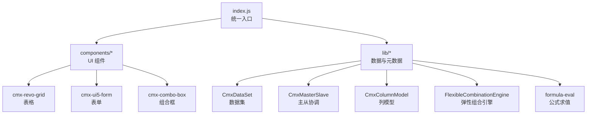
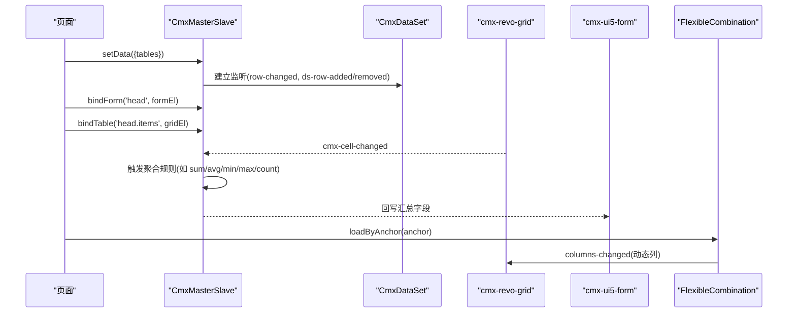
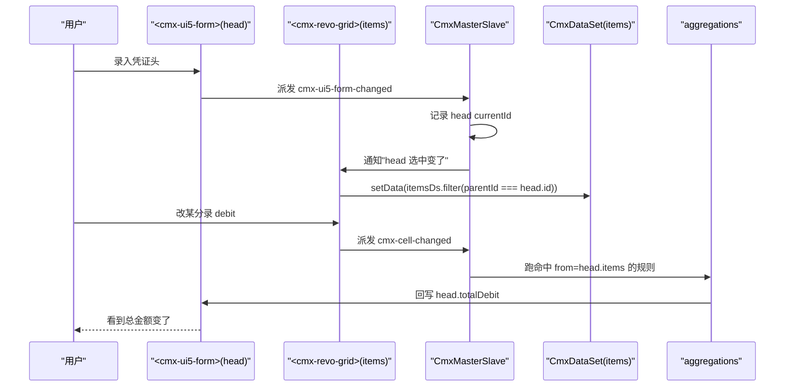
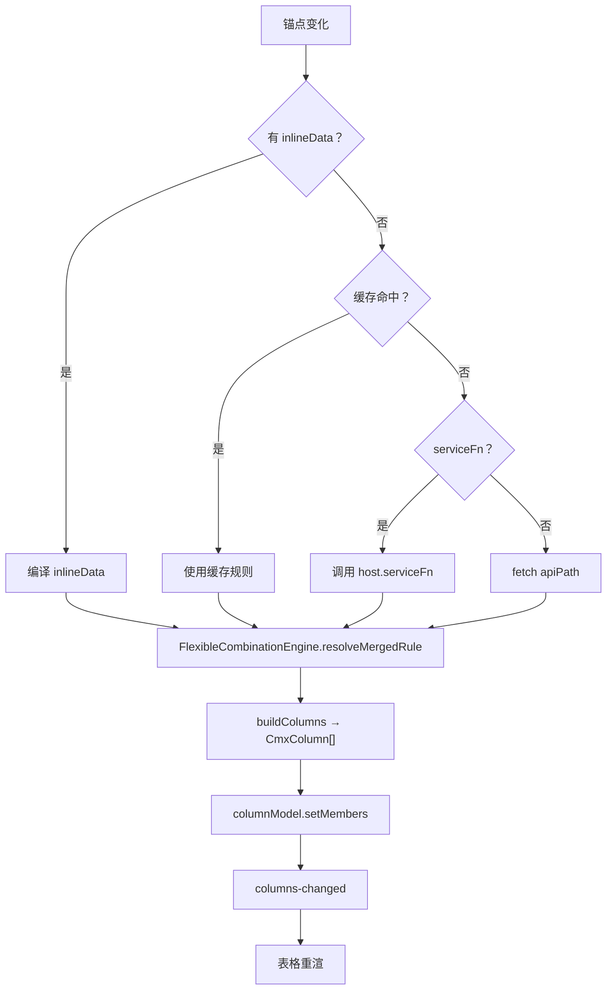
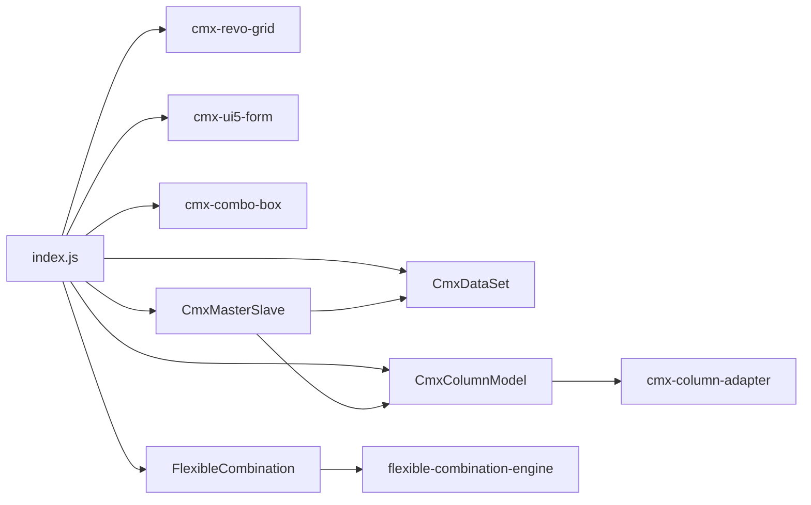

# 数据组件库 (cmx-data-comp)

<cite>
**本文引用的文件**
- [packages/cmx-data-comp/src/index.js](file://packages/cmx-data-comp/src/index.js)
- [packages/cmx-data-comp/README.md](file://packages/cmx-data-comp/README.md)
- [packages/cmx-data-comp/src/lib/cmx-master-slave.js](file://packages/cmx-data-comp/src/lib/cmx-master-slave.js)
- [packages/cmx-data-comp/src/lib/cmx-column-model.js](file://packages/cmx-data-comp/src/lib/cmx-column-model.js)
- [packages/cmx-data-comp/src/lib/cmx-data-set.js](file://packages/cmx-data-comp/src/lib/cmx-data-set.js)
- [packages/cmx-data-comp/src/components/cmx-revo-grid.js](file://packages/cmx-data-comp/src/components/cmx-revo-grid.js)
- [packages/cmx-data-comp/src/components/cmx-ui5-form.js](file://packages/cmx-data-comp/src/components/cmx-ui5-form.js)
- [packages/cmx-data-comp/src/components/cmx-combo-box.js](file://packages/cmx-data-comp/src/components/cmx-combo-box.js)
- [packages/cmx-data-comp/src/lib/cmx-flexible-combination.js](file://packages/cmx-data-comp/src/lib/cmx-flexible-combination.js)
- [packages/cmx-data-comp/src/lib/flexible-combination-engine.js](file://packages/cmx-data-comp/src/lib/flexible-combination-engine.js)
- [packages/cmx-data-comp/src/lib/formula-eval.js](file://packages/cmx-data-comp/src/lib/formula-eval.js)
- [packages/cmx-data-comp/src/lib/cmx-doc-meta-loader.js](file://packages/cmx-data-comp/src/lib/cmx-doc-meta-loader.js)
- [packages/cmx-data-comp/src/lib/init-page-models.js](file://packages/cmx-data-comp/src/lib/init-page-models.js)
- [packages/cmx-data-comp/src/lib/cmx-field-uicontrol.js](file://packages/cmx-data-comp/src/lib/cmx-field-uicontrol.js)
- [packages/cmx-data-comp/src/lib/cmx-builtin-field-types.js](file://packages/cmx-data-comp/src/lib/cmx-builtin-field-types.js)
- [CMXHTMLDesigner/src/components/designer-page-data/models-event-script-hints.js](file://CMXHTMLDesigner/src/components/designer-page-data/models-event-script-hints.js)
- [docs/CMXPortalManager+CMXHTMLDesigner-模型体系文档/08-列模型-CmxColumnModel.md](file://docs/CMXPortalManager+CMXHTMLDesigner-模型体系文档/08-列模型-CmxColumnModel.md)
- [docs/CMXPortalManager+CMXHTMLDesigner-模型体系文档/09-主从协调器-CmxMasterSlave.md](file://docs/CMXPortalManager+CMXHTMLDesigner-模型体系文档/09-主从协调器-CmxMasterSlave.md)
- [docs/CMXPortalManager+CMXHTMLDesigner-模型体系文档/10-弹性组合-FlexibleCombination.md](file://docs/CMXPortalManager+CMXHTMLDesigner-模型体系文档/10-弹性组合-FlexibleCombination.md)
</cite>

## 目录
1. [简介](#简介)
2. [项目结构](#项目结构)
3. [核心组件](#核心组件)
4. [架构总览](#架构总览)
5. [详细组件分析](#详细组件分析)
6. [依赖关系分析](#依赖关系分析)
7. [性能考量](#性能考量)
8. [故障排查指南](#故障排查指南)
9. [结论](#结论)
10. [附录](#附录)

## 简介
本文件为 CMX 数据组件库（cmx-data-comp）的权威技术文档，聚焦以下目标：
- 深入解释主从协调（CmxMasterSlave）、列模型（CmxColumnModel）、数据集（CmxDataSet）等核心组件的实现原理与使用方法。
- 详细说明表单、表格、组合框等 UI 组件的配置选项与事件处理。
- 阐述数据绑定机制、验证规则、格式化显示与国际化支持。
- 提供组件组合模式、自定义扩展与性能优化建议，并给出实际应用场景与代码片段路径。

该库以源码 ESM 形式被 monorepo 内应用引用，不在此包内打包生成 dist；消费方负责 UI5/Vite 打包与运行时环境装配。

**章节来源**
- [packages/cmx-data-comp/README.md:1-31](file://packages/cmx-data-comp/README.md#L1-L31)

## 项目结构
cmx-data-comp 采用“组件 + 数据层”分层组织：
- components：Web Components（表格、表单、组合框、分页、面板等）。
- lib：数据与元数据核心（数据集、主从协调、列模型、弹性组合、公式引擎、字典缓存等）。
- index.js：统一入口，按需注册组件与导出公共 API。

**图表来源**
- [packages/cmx-data-comp/src/index.js:1-120](file://packages/cmx-data-comp/src/index.js#L1-L120)

**章节来源**
- [packages/cmx-data-comp/src/index.js:1-120](file://packages/cmx-data-comp/src/index.js#L1-L120)

## 核心组件
- CmxDataSet：多级数据集容器，维护行集合、索引、游标与变更事件，支持树形子数据集挂载。
- CmxColumnModel：列元数据模型，管理列与列组，输出通用描述符供渲染适配器使用。
- CmxMasterSlave：主从多表协调器，持有递归主从数据树，按 path 绑定视图，维护选中联动与聚合回写。
- CmxRevoGrid / CmxUi5Form / CmxComboBox：表格、表单、组合框等 UI 组件，通过数据模型与事件与数据层协同。

**章节来源**
- [packages/cmx-data-comp/src/lib/cmx-data-set.js:1-200](file://packages/cmx-data-comp/src/lib/cmx-data-set.js#L1-L200)
- [packages/cmx-data-comp/src/lib/cmx-column-model.js:1-200](file://packages/cmx-data-comp/src/lib/cmx-column-model.js#L1-L200)
- [packages/cmx-data-comp/src/lib/cmx-master-slave.js:1-200](file://packages/cmx-data-comp/src/lib/cmx-master-slave.js#L1-L200)
- [packages/cmx-data-comp/src/components/cmx-revo-grid.js:1-200](file://packages/cmx-data-comp/src/components/cmx-revo-grid.js#L1-L200)

## 架构总览
数据流与控制流围绕“模型驱动 + 事件总线”展开：
- 页面通过 CmxMasterSlave 编排多张表的数据树与视图绑定。
- CmxDataSet 作为数据源，派发行级变更事件。
- CmxColumnModel 定义列展示与编辑行为，并通过事件通知 UI 重绘。
- UI 组件（表格/表单/组合框）监听模型事件，完成双向绑定与交互。
- 弹性组合根据上下文动态改写列模型，实现“上下文驱动的动态列”。

**图表来源**
- [packages/cmx-data-comp/src/lib/cmx-master-slave.js:1-200](file://packages/cmx-data-comp/src/lib/cmx-master-slave.js#L1-L200)
- [packages/cmx-data-comp/src/lib/cmx-data-set.js:1-200](file://packages/cmx-data-comp/src/lib/cmx-data-set.js#L1-L200)
- [packages/cmx-data-comp/src/components/cmx-revo-grid.js:1-200](file://packages/cmx-data-comp/src/components/cmx-revo-grid.js#L1-L200)
- [docs/CMXPortalManager+CMXHTMLDesigner-模型体系文档/10-弹性组合-FlexibleCombination.md:29-55](file://docs/CMXPortalManager+CMXHTMLDesigner-模型体系文档/10-弹性组合-FlexibleCombination.md#L29-L55)

## 详细组件分析

### CmxMasterSlave（主从协调器）
职责与能力：
- 持有递归主从数据树（每个 row 可挂 _children: { tableId: CmxDataSet }）。
- 按 path 绑定表单/表格视图，维护当前选中行，实现上级选中变化时下级自动刷新。
- 监听单元格/行变更事件，运行命中规则的聚合并回写目标字段。
- 支持 setData（树形）与 setFlatData（平铺+外键）两种数据装载方式。
- 支持分页状态管理与 destroy 资源释放。

关键流程（凭证录入场景）：

配置要点：
- schema：路径树，定义表与父子关系。
- aggregations：聚合规则，from/to/toField/agg 等。
- relations：平铺数据时的主外键关系。
- columnModels：关联列模型，用于 calcFormula 执行。
- dataSources：数据源注册，供视图按需取数。

事件清单：
- change：字段值变化。
- select：行选中变化。
- aggregate：聚合规则触发。

**图表来源**
- [docs/CMXPortalManager+CMXHTMLDesigner-模型体系文档/09-主从协调器-CmxMasterSlave.md:182-204](file://docs/CMXPortalManager+CMXHTMLDesigner-模型体系文档/09-主从协调器-CmxMasterSlave.md#L182-L204)

**章节来源**
- [packages/cmx-data-comp/src/lib/cmx-master-slave.js:1-200](file://packages/cmx-data-comp/src/lib/cmx-master-slave.js#L1-L200)
- [docs/CMXPortalManager+CMXHTMLDesigner-模型体系文档/09-主从协调器-CmxMasterSlave.md:1-318](file://docs/CMXPortalManager+CMXHTMLDesigner-模型体系文档/09-主从协调器-CmxMasterSlave.md#L1-L318)
- [CMXHTMLDesigner/src/components/designer-page-data/models-event-script-hints.js:1-20](file://CMXHTMLDesigner/src/components/designer-page-data/models-event-script-hints.js#L1-L20)

### CmxColumnModel（列模型）
职责与能力：
- 管理列与列组，支持添加/移除/整体替换成员。
- 从元数据（DCT/DOC）构建列，自动补全 edit/display/refDict 等属性。
- 输出通用描述符（toDescriptors），由适配器转换为具体网格列定义。
- 支持 title/icon 列配置，便于列表标题与图标展示。

典型用法：
- 声明式：data-cmx-model-id 绑定到表格。
- 命令式：grid.setColumnModel(model)。

运行时改写：
- FlexibleCombination 通过 setMembers 动态更新列，触发 columns-changed，表格重渲。

**章节来源**
- [packages/cmx-data-comp/src/lib/cmx-column-model.js:1-200](file://packages/cmx-data-comp/src/lib/cmx-column-model.js#L1-L200)
- [docs/CMXPortalManager+CMXHTMLDesigner-模型体系文档/08-列模型-CmxColumnModel.md:1-249](file://docs/CMXPortalManager+CMXHTMLDesigner-模型体系文档/08-列模型-CmxColumnModel.md#L1-L249)

### CmxDataSet（数据集）
职责与能力：
- 行集合管理：addRow/setRows/removeRow/getRow 等。
- 游标管理：moveTo/moveFirst/moveLast/moveNext/movePrev 及 cursor-changed 事件。
- 变更通知：row-changed/ds-row-added/ds-row-removed/cursor-changed。
- 树形结构：每行可挂子 CmxDataSet，形成无限深的主从数据树。

常用 API（pageFn 中）：
- addRow/removeRow/setCell/setRows/addEventListener('ds-row-added') 等。

**章节来源**
- [packages/cmx-data-comp/src/lib/cmx-data-set.js:1-200](file://packages/cmx-data-comp/src/lib/cmx-data-set.js#L1-L200)
- [docs/CMXPortalManager+CMXHTMLDesigner-模型体系文档/10-弹性组合-FlexibleCombination.md:175-199](file://docs/CMXPortalManager+CMXHTMLDesigner-模型体系文档/10-弹性组合-FlexibleCombination.md#L175-L199)

### 表格组件（cmx-revo-grid）
- 基于 RevoGrid 封装，支持虚拟滚动、选择、合计行、主题与皮肤、文本选择、工具提示等。
- 列定义只能通过 CmxColumnModel；运行时 setColumnModel(model) 注入。
- 事件：cmx-row-selected、cmx-row-selection-change、cmx-cell-changed、cmx-row-added/removed。
- 默认 Neo 皮肤，支持强调色与样式覆盖。

配置要点（节选）：
- selectionMode/range/viewHeight/fillHeight/virtualScroll/stretch/resize。
- editable/readonly/editTrigger/showTotals/totals。
- theme/showRowIndex/alternateRowColor/cellTooltip/allowTextSelect。

**章节来源**
- [packages/cmx-data-comp/src/components/cmx-revo-grid.js:1-200](file://packages/cmx-data-comp/src/components/cmx-revo-grid.js#L1-L200)

### 表单组件（cmx-ui5-form）
- 与 CmxMasterSlave 配合，通过 bindForm(path, formEl) 绑定到 schema 路径。
- 支持数据源提供者注入，便于下拉/参考等控件按需加载数据。
- 事件：cmx-ui5-form-changed，用于主从联动与聚合触发。

**章节来源**
- [packages/cmx-data-comp/src/lib/cmx-master-slave.js:117-139](file://packages/cmx-data-comp/src/lib/cmx-master-slave.js#L117-L139)

### 组合框组件（cmx-combo-box）
- 提供组合选择能力，可与字典/服务数据源集成。
- 在 barrel 中注册，便于全局使用。

**章节来源**
- [packages/cmx-data-comp/src/index.js:16-19](file://packages/cmx-data-comp/src/index.js#L16-L19)

### 弹性组合（FlexibleCombination）
- 根据上下文（锚点维度）动态生成列，驱动 CmxColumnModel.setMembers，触发 columns-changed。
- 数据来源：inlineData（开页生效）、serviceFn（推荐，动态取数）、setCombination（运行时 JSON 直设）。
- DAM 三段定位（domain/app/module）+ scenario 标识后端规则位置。
- 匹配评分与合并语义：精确 > 属性 > 兜底；同分按定义顺序。
- 公式与校验：白名单求值（+ - * / ( ) + ROUND/ABS/MIN/MAX/IF），dependsOn 拓扑重算。

**图表来源**
- [docs/CMXPortalManager+CMXHTMLDesigner-模型体系文档/10-弹性组合-FlexibleCombination.md:29-55](file://docs/CMXPortalManager+CMXHTMLDesigner-模型体系文档/10-弹性组合-FlexibleCombination.md#L29-L55)

**章节来源**
- [docs/CMXPortalManager+CMXHTMLDesigner-模型体系文档/10-弹性组合-FlexibleCombination.md:1-470](file://docs/CMXPortalManager+CMXHTMLDesigner-模型体系文档/10-弹性组合-FlexibleCombination.md#L1-L470)
- [packages/cmx-data-comp/src/lib/cmx-flexible-combination.js:1-200](file://packages/cmx-data-comp/src/lib/cmx-flexible-combination.js#L1-L200)
- [packages/cmx-data-comp/src/lib/flexible-combination-engine.js:1-200](file://packages/cmx-data-comp/src/lib/flexible-combination-engine.js#L1-L200)

### 数据绑定机制
- 主从协调：CmxMasterSlave.bindForm/bindTable 将视图与 schema path 绑定，维护 currentId 联动。
- 数据集事件：CmxDataSet 派发行级变更事件，协调器订阅后触发聚合或视图刷新。
- 列模型事件：CmxColumnModel 派发 columns-changed，表格组件订阅并重渲。
- 数据源：视图可通过 _setDataSourceProvider 获取数据源，实现下拉/参考等异步加载。

**章节来源**
- [packages/cmx-data-comp/src/lib/cmx-master-slave.js:117-139](file://packages/cmx-data-comp/src/lib/cmx-master-slave.js#L117-L139)
- [packages/cmx-data-comp/src/lib/cmx-data-set.js:1-200](file://packages/cmx-data-comp/src/lib/cmx-data-set.js#L1-L200)
- [packages/cmx-data-comp/src/lib/cmx-column-model.js:31-72](file://packages/cmx-data-comp/src/lib/cmx-column-model.js#L31-L72)

### 验证规则与计算
- 列模型支持 edit.validate、validateFormula、calcFormula、dependsOn。
- 公式引擎使用白名单运算符与函数，避免裸 eval；支持字段引用与链式重算。
- 设计期保存时执行 validations + 必填检查。

**章节来源**
- [docs/CMXPortalManager+CMXHTMLDesigner-模型体系文档/08-列模型-CmxColumnModel.md:39-68](file://docs/CMXPortalManager+CMXHTMLDesigner-模型体系文档/08-列模型-CmxColumnModel.md#L39-L68)
- [docs/CMXPortalManager+CMXHTMLDesigner-模型体系文档/10-弹性组合-FlexibleCombination.md:283-315](file://docs/CMXPortalManager+CMXHTMLDesigner-模型体系文档/10-弹性组合-FlexibleCombination.md#L283-L315)
- [packages/cmx-data-comp/src/lib/formula-eval.js:1-200](file://packages/cmx-data-comp/src/lib/formula-eval.js#L1-L200)

### 格式化显示与国际化
- 列 display 支持 number/date/badge/icon/link/cellStyle 等模式，decimalDigits/thousandSeparator/displayMask 控制格式。
- caption 支持多语言对象（zh_CN/en...），fieldCaption/fieldDisplayName 提供国际化辅助。
- 主题与皮肤：表格支持 auto/default/darkMaterial 等主题，Neo 皮肤强调色可选。

**章节来源**
- [docs/CMXPortalManager+CMXHTMLDesigner-模型体系文档/08-列模型-CmxColumnModel.md:43-68](file://docs/CMXPortalManager+CMXHTMLDesigner-模型体系文档/08-列模型-CmxColumnModel.md#L43-L68)
- [packages/cmx-data-comp/src/index.js:147-156](file://packages/cmx-data-comp/src/index.js#L147-L156)
- [packages/cmx-data-comp/src/components/cmx-revo-grid.js:115-155](file://packages/cmx-data-comp/src/components/cmx-revo-grid.js#L115-L155)

### 组件组合模式与自定义扩展
- 组合模式：CmxMasterSlave 编排 CmxDataSet/CmxColumnModel/UI 组件，实现“头-明细-税项”等多层级界面。
- 自定义字段类型：通过 registerFieldType 注册新的编辑器（form/grid 两端），零代码扩展。
- 预设列：registerColumnPreset/listColumnPresets/invokePreset 提供列模板复用。
- 元数据驱动：fromMeta 从 CmxDCTMeta/CmxDOCMeta 构建列，自动补全 refDict 坐标与业务属性。

**章节来源**
- [docs/CMXPortalManager+CMXHTMLDesigner-模型体系文档/08-列模型-CmxColumnModel.md:206-222](file://docs/CMXPortalManager+CMXHTMLDesigner-模型体系文档/08-列模型-CmxColumnModel.md#L206-L222)
- [packages/cmx-data-comp/src/index.js:124-139](file://packages/cmx-data-comp/src/index.js#L124-L139)
- [packages/cmx-data-comp/src/lib/cmx-column-model.js:74-158](file://packages/cmx-data-comp/src/lib/cmx-column-model.js#L74-L158)

## 依赖关系分析
- 入口 index.js 统一注册 UI 组件与导出核心类，确保副作用（customElements 定义）在首次 import 时执行。
- 组件与 lib 解耦：UI 组件通过 CmxColumnModel/CmxDataSet/CmxMasterSlave 进行数据绑定，不直接耦合业务逻辑。
- 弹性组合与公式引擎为独立模块，降低循环依赖风险。

**图表来源**
- [packages/cmx-data-comp/src/index.js:1-120](file://packages/cmx-data-comp/src/index.js#L1-L120)

**章节来源**
- [packages/cmx-data-comp/src/index.js:1-120](file://packages/cmx-data-comp/src/index.js#L1-L120)

## 性能考量
- 虚拟滚动：表格默认启用 virtualScroll，适合大数据量。
- 懒加载：Spreadsheet 相关组件通过 MutationObserver 懒注册，避免首屏体积污染。
- 事件最小化：CmxDataSetView 零拷贝投影，仅引用主集行，减少内存占用。
- 聚合优化：CmxMasterSlave 按 from-path 反向索引规则，仅对命中规则重算。
- 分页：支持根层 total 与分页状态，减少不必要的全量渲染。

**章节来源**
- [packages/cmx-data-comp/src/components/cmx-revo-grid.js:82-101](file://packages/cmx-data-comp/src/components/cmx-revo-grid.js#L82-L101)
- [packages/cmx-data-comp/src/index.js:28-57](file://packages/cmx-data-comp/src/index.js#L28-L57)
- [packages/cmx-data-comp/src/lib/cmx-master-slave.js:1-31](file://packages/cmx-data-comp/src/lib/cmx-master-slave.js#L1-L31)

## 故障排查指南
常见问题与对策：
- 路径错误：schema 中重复 path 或 unknown path → 检查 path 是否完整且唯一。
- 聚合目标不存在：aggregations.to 指向未知 path → 确认 schema 与 to 一致。
- 未绑视图：setCurrentId 但无绑定 → 先 bindForm/bindTable 再设置选中。
- 弹性组合无效：columnModelId 写错或 inlineData 无 rule/rules → 检查实例名与 JSON 形态。
- 内存泄漏：SPA 切换未销毁协调器 → 调用 destroy() 解绑事件与监听。

**章节来源**
- [docs/CMXPortalManager+CMXHTMLDesigner-模型体系文档/09-主从协调器-CmxMasterSlave.md:294-304](file://docs/CMXPortalManager+CMXHTMLDesigner-模型体系文档/09-主从协调器-CmxMasterSlave.md#L294-L304)
- [docs/CMXPortalManager+CMXHTMLDesigner-模型体系文档/10-弹性组合-FlexibleCombination.md:444-453](file://docs/CMXPortalManager+CMXHTMLDesigner-模型体系文档/10-弹性组合-FlexibleCombination.md#L444-L453)
- [packages/cmx-data-comp/src/lib/cmx-master-slave.js:141-167](file://packages/cmx-data-comp/src/lib/cmx-master-slave.js#L141-L167)

## 结论
cmx-data-comp 通过“数据模型 + 事件驱动 + 元数据驱动”的方式，提供了强大的主从协调、列模型与数据集管理能力，结合表单、表格、组合框等 UI 组件，实现了高内聚、低耦合的企业级数据界面开发范式。弹性组合与公式引擎进一步增强了动态性与灵活性，满足复杂业务场景需求。遵循本文档的最佳实践与性能建议，可在保证用户体验的同时提升开发与维护效率。

## 附录
- 常用 API 速查（pageFn 中）：
  - 数据集：addRow/removeRow/setCell/setRows/addEventListener('ds-row-added')
  - 主从协调：setData/setFlatData/bindForm/bindTable/setColumnModel
  - 弹性组合：loadByAnchor/setCombination/setRule/clear/invalidateCache
- 参考示例路径：
  - 列模型最小定义与三态说明：[docs/.../08-列模型-CmxColumnModel.md:72-152](file://docs/CMXPortalManager+CMXHTMLDesigner-模型体系文档/08-列模型-CmxColumnModel.md#L72-L152)
  - 主从协调完整流程与实战：[docs/.../09-主从协调器-CmxMasterSlave.md:182-290](file://docs/CMXPortalManager+CMXHTMLDesigner-模型体系文档/09-主从协调器-CmxMasterSlave.md#L182-L290)
  - 弹性组合三种数据来源与实战：[docs/.../10-弹性组合-FlexibleCombination.md:97-187](file://docs/CMXPortalManager+CMXHTMLDesigner-模型体系文档/10-弹性组合-FlexibleCombination.md#L97-L187)