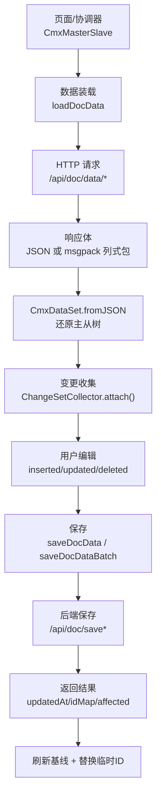
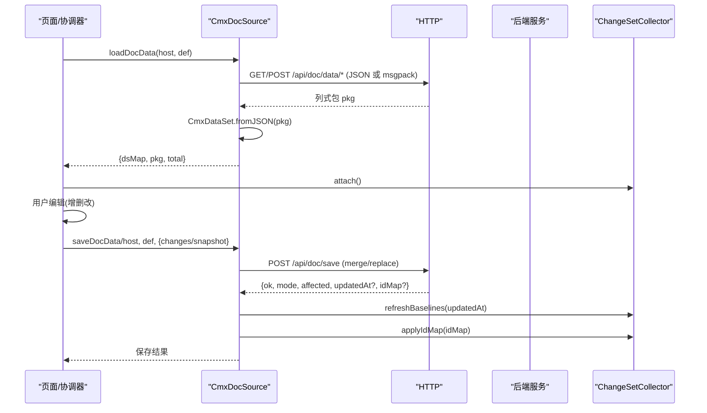
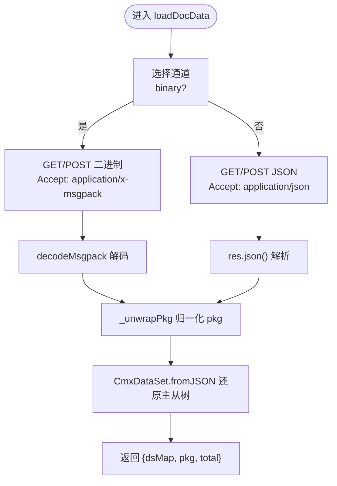
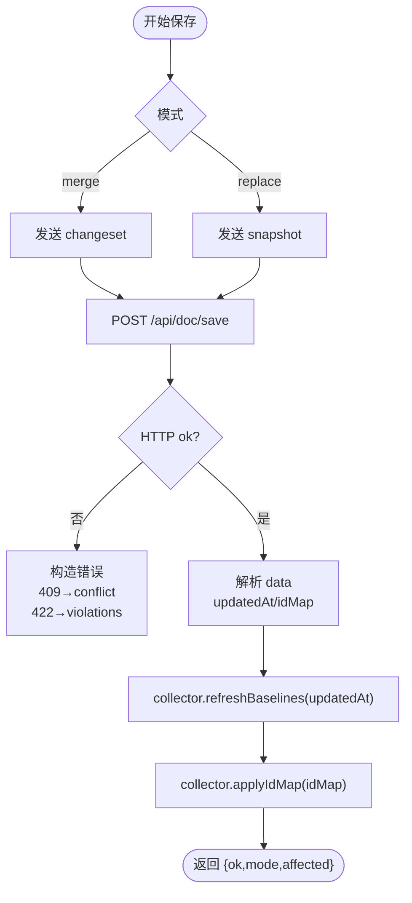
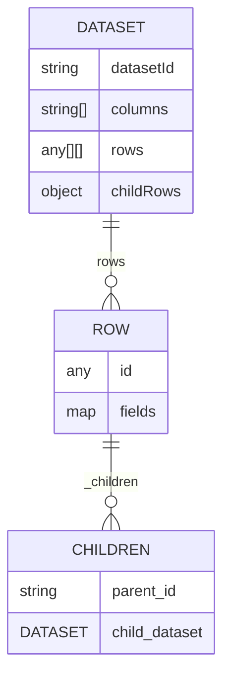
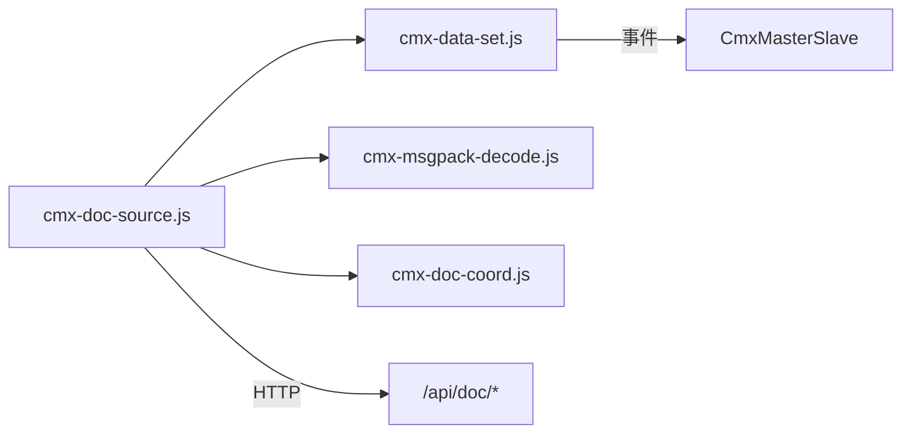

# 业务单据数据源

<cite>
**本文引用的文件**
- [cmx-doc-source.js](file://packages/cmx-data-comp/src/lib/cmx-doc-source.js)
- [cmx-data-set.js](file://packages/cmx-data-comp/src/lib/cmx-data-set.js)
- [cmx-msgpack-decode.js](file://packages/cmx-data-comp/src/lib/cmx-msgpack-decode.js)
- [cmx-doc-source.test.js](file://packages/cmx-data-comp/src/lib/__tests__/cmx-doc-source.test.js)
- [cmx-msgpack-decode.test.js](file://packages/cmx-data-comp/src/lib/__tests__/cmx-msgpack-decode.test.js)
</cite>

## 目录
1. [简介](#简介)
2. [项目结构](#项目结构)
3. [核心组件](#核心组件)
4. [架构总览](#架构总览)
5. [详细组件分析](#详细组件分析)
6. [依赖关系分析](#依赖关系分析)
7. [性能考量](#性能考量)
8. [故障排查指南](#故障排查指南)
9. [结论](#结论)
10. [附录：API 使用示例与最佳实践](#附录api-使用示例与最佳实践)

## 简介
本技术文档聚焦 CMX 业务单据数据源的前端实现，围绕 CmxDocSource（即 cmx-doc-source 模块）展开，系统性说明以下能力：
- 数据装载：loadDocData 的 URL 拼接、二进制/JSON 双通道、列式包结构与 fromJSON 还原。
- 变更收集：ChangeSetCollector 对插入、更新、删除的追踪逻辑，乐观锁基线管理，临时 ID 到真实 ID 映射处理。
- 保存策略：saveDocData 与 saveDocDataBatch 的 merge/replace 模式、批量事务语义、冲突检测与重试建议。
- API 使用与错误处理：端到端调用流程、常见异常与回退策略。

## 项目结构
该功能位于前端数据组件库 packages/cmx-data-comp 中，核心文件如下：
- 数据装载/回存适配层：cmx-doc-source.js
- 数据集模型与列式包解析：cmx-data-set.js
- 二进制解码器：cmx-msgpack-decode.js
- 单元测试覆盖：cmx-doc-source.test.js、cmx-msgpack-decode.test.js



图表来源
- [cmx-doc-source.js:47-83](file://packages/cmx-data-comp/src/lib/cmx-doc-source.js#L47-L83)
- [cmx-data-set.js:372-410](file://packages/cmx-data-comp/src/lib/cmx-data-set.js#L372-L410)
- [cmx-doc-source.js:224-282](file://packages/cmx-data-comp/src/lib/cmx-doc-source.js#L224-L282)
- [cmx-doc-source.js:312-345](file://packages/cmx-data-comp/src/lib/cmx-doc-source.js#L312-L345)

章节来源
- [cmx-doc-source.js:1-25](file://packages/cmx-data-comp/src/lib/cmx-doc-source.js#L1-L25)
- [cmx-data-set.js:350-410](file://packages/cmx-data-comp/src/lib/cmx-data-set.js#L350-L410)
- [cmx-msgpack-decode.js:1-25](file://packages/cmx-data-comp/src/lib/cmx-msgpack-decode.js#L1-L25)

## 核心组件
- loadDocData：根据 def.binary 选择 JSON 或 msgpack 通道，统一通过 CmxDataSet.fromJSON 还原为 { rootId: CmxDataSet } 树，并返回 dsMap/pkg/total。
- ChangeSetCollector：订阅协调器各层 CmxDataSet 事件，累积 changeset；支持导出最小变更集、乐观锁基线刷新、临时 ID 映射应用。
- saveDocData：单单据保存，支持 merge/replace 两种模式，兼容原始信封与门户拆信封两种响应形态，处理校验失败与并发冲突。
- saveDocDataBatch：多单据批量保存，支持原子/非原子事务语义，逐单刷新基线。

章节来源
- [cmx-doc-source.js:47-83](file://packages/cmx-data-comp/src/lib/cmx-doc-source.js#L47-L83)
- [cmx-doc-source.js:224-282](file://packages/cmx-data-comp/src/lib/cmx-doc-source.js#L224-L282)
- [cmx-doc-source.js:312-345](file://packages/cmx-data-comp/src/lib/cmx-doc-source.js#L312-L345)
- [cmx-doc-source.js:367-591](file://packages/cmx-data-comp/src/lib/cmx-doc-source.js#L367-L591)
- [cmx-data-set.js:372-410](file://packages/cmx-data-comp/src/lib/cmx-data-set.js#L372-L410)

## 架构总览
- 传输格式：
  - JSON：默认路径 /api/doc/data/sqlx-dataset-json，Accept: application/json。
  - 二进制：/api/doc/data/tokio-zmc-msgpack，Accept: application/x-msgpack，使用 @msgpack/msgpack 解码，得到与 JSON 同构的列式包。
- 列式包结构：{ datasetId, columns, rows:[[...]], childRows:{父id:{子层datasetId,...}} }，由 CmxDataSet.fromJSON 递归还原为主从树。
- 变更收集：基于 CmxMasterSlave 下各层 CmxDataSet 的事件（新增行、删除行、字段变更），按层聚合 inserted/updated/deleted。
- 保存策略：merge（增量变更）与 replace（整树快照）；批量接口支持 atomic=true（全成全败）或 false（逐单独立事务）。
- 乐观锁：更新行携带 baseline（装载时的 update_time），后端在根层做并发冲突检测；成功时回传 updatedAt 刷新前端基线。
- 临时 ID 映射：后端 idMap 将前端临时 id 替换为真实雪花 id，并重路由 upper_id 与 collector.inserted 的 key。



图表来源
- [cmx-doc-source.js:47-83](file://packages/cmx-data-comp/src/lib/cmx-doc-source.js#L47-L83)
- [cmx-doc-source.js:224-282](file://packages/cmx-data-comp/src/lib/cmx-doc-source.js#L224-L282)
- [cmx-doc-source.js:312-345](file://packages/cmx-data-comp/src/lib/cmx-doc-source.js#L312-L345)
- [cmx-data-set.js:372-410](file://packages/cmx-data-comp/src/lib/cmx-data-set.js#L372-L410)

## 详细组件分析

### 数据装载：loadDocData
- 参数与端点：
  - def.binary=true 走二进制通道，否则走 JSON 通道。
  - 自动拼接 domain/application/module/file/dbId 等查询参数；可选 filter/limit/depth/query。
- 响应处理：
  - 二进制：arrayBuffer → decodeMsgpack → 列式包对象。
  - JSON：res.json() → 列式包对象。
  - _unwrapPkg 兼容 ApiResp 信封与门户已拆信封的裸 pkg；HTTP 失败优先抛错。
- 数据还原：
  - CmxDataSet.fromJSON 将列式包还原为嵌套主从树；childRows 递归挂载至父行 _children。
  - 支持 total 字段用于分页展示。



图表来源
- [cmx-doc-source.js:47-83](file://packages/cmx-data-comp/src/lib/cmx-doc-source.js#L47-L83)
- [cmx-doc-source.js:103-119](file://packages/cmx-data-comp/src/lib/cmx-doc-source.js#L103-L119)
- [cmx-data-set.js:372-410](file://packages/cmx-data-comp/src/lib/cmx-data-set.js#L372-L410)

章节来源
- [cmx-doc-source.js:47-83](file://packages/cmx-data-comp/src/lib/cmx-doc-source.js#L47-L83)
- [cmx-doc-source.js:103-119](file://packages/cmx-data-comp/src/lib/cmx-doc-source.js#L103-L119)
- [cmx-data-set.js:372-410](file://packages/cmx-data-comp/src/lib/cmx-data-set.js#L372-L410)
- [cmx-msgpack-decode.js:1-25](file://packages/cmx-data-comp/src/lib/cmx-msgpack-decode.js#L1-L25)

### 变更收集：ChangeSetCollector
- 事件订阅：
  - 监听每层 CmxDataSet 的 ds-row-added、ds-row-removed、row-changed。
  - 递归绑定子层数据集，确保动态新增行的子层也能被监听。
- 变更聚合：
  - inserted：新增行（若随后删除则抵消，净零不回后端）。
  - updated：字段级变更（空 key 通知不登记，避免 fields:{} 假对账冲突）。
  - deleted：删除已有行（若之前是新增则从 inserted 移除）。
- 导出 changeset：
  - 按 path 分组，包含 inserted/updated/deleted。
  - updated 行附带 baseline（装载时的 update_time），用于后端乐观锁比对。
- 乐观锁基线管理：
  - refreshBaselines：用后端回传的 updatedAt 刷新行 update_time，避免连续保存误报冲突。
- 临时 ID 映射：
  - applyIdMap：将前端临时 id 替换为真实雪花 id，重路由 upper_id，同步 collector.inserted 的 key。

```mermaid
classDiagram
class ChangeSetCollector {
-_coord
-_byPath : Map<path, {inserted,updated,deleted}>
-_bound : Map<ds, {path,listeners}>
+attach()
+detach()
+export() Record<string,LayerChanges>
+refreshBaselines(updatedAt)
+applyIdMap(idMap)
+reset()
+isDirty() bool
}
```

图表来源
- [cmx-doc-source.js:367-591](file://packages/cmx-data-comp/src/lib/cmx-doc-source.js#L367-L591)

章节来源
- [cmx-doc-source.js:367-591](file://packages/cmx-data-comp/src/lib/cmx-doc-source.js#L367-L591)
- [cmx-doc-source.test.js:49-247](file://packages/cmx-data-comp/src/lib/__tests__/cmx-doc-source.test.js#L49-L247)

### 保存策略：saveDocData 与 saveDocDataBatch
- saveDocData：
  - 支持 merge（changeset）与 replace（snapshot）两种模式。
  - 兼容两种响应形态：原始信封 {code,msg,data} 与门户拆信封裸结果 {ok,mode,affected}。
  - 冲突处理：HTTP 409 标记 err.conflict=true，供 UI 提示“已被他人修改”。
  - 校验失败：422 可能以 HTTP 200 + code=422 返回，提取 violations 结构化抛出。
  - 成功后：调用 collector.refreshBaselines(updatedAt) 与 applyIdMap(idMap)。
- saveDocDataBatch：
  - 批量保存多单，atomic=true 表示一个大事务全成全败；false 表示逐单独立事务。
  - 逐单刷新基线（results[].updatedAt）。
  - 冲突同样以 HTTP 409 标记 err.conflict=true。



图表来源
- [cmx-doc-source.js:224-282](file://packages/cmx-data-comp/src/lib/cmx-doc-source.js#L224-L282)
- [cmx-doc-source.js:312-345](file://packages/cmx-data-comp/src/lib/cmx-doc-source.js#L312-L345)

章节来源
- [cmx-doc-source.js:224-282](file://packages/cmx-data-comp/src/lib/cmx-doc-source.js#L224-L282)
- [cmx-doc-source.js:312-345](file://packages/cmx-data-comp/src/lib/cmx-doc-source.js#L312-L345)
- [cmx-doc-source.test.js:249-355](file://packages/cmx-data-comp/src/lib/__tests__/cmx-doc-source.test.js#L249-L355)

### 列式包结构与解析
- 结构定义：
  - datasetId：当前层标识。
  - columns：列名数组。
  - rows：二维数组，每行对应 columns 顺序的值。
  - childRows：父 id → 子层 datasetId 的映射，递归描述主从关系。
- 解析过程：
  - CmxDataSet.fromJSON 构建行对象，建立 _index（键统一为 String(id) 以兼容 BIGINT）。
  - 递归挂载 childRows 到父行的 _children。
  - 支持 total 字段用于分页计数。



图表来源
- [cmx-data-set.js:350-410](file://packages/cmx-data-comp/src/lib/cmx-data-set.js#L350-L410)
- [cmx-doc-source.test.js:9-47](file://packages/cmx-data-comp/src/lib/__tests__/cmx-doc-source.test.js#L9-L47)

章节来源
- [cmx-data-set.js:350-410](file://packages/cmx-data-comp/src/lib/cmx-data-set.js#L350-L410)
- [cmx-doc-source.test.js:9-47](file://packages/cmx-data-comp/src/lib/__tests__/cmx-doc-source.test.js#L9-L47)

## 依赖关系分析
- 模块耦合：
  - cmx-doc-source 依赖 CmxDataSet（数据结构）、cmx-msgpack-decode（二进制解码）、cmx-doc-coord（坐标与查询参数）。
  - ChangeSetCollector 依赖 CmxMasterSlave 暴露的各层 CmxDataSet 事件。
- 外部依赖：
  - @msgpack/msgpack 提供高性能 MessagePack 解码。
- 潜在循环依赖：
  - 无直接循环；数据流单向：装载 → 变更收集 → 保存。
- 集成点：
  - HTTP 端点：/api/doc/data/*、/api/doc/save、/api/doc/save/batch。
  - 门户拦截器：可能将业务错误映射为非 2xx + {error,msg}，需兼容处理。



图表来源
- [cmx-doc-source.js:13-15](file://packages/cmx-data-comp/src/lib/cmx-doc-source.js#L13-L15)
- [cmx-doc-source.js:47-83](file://packages/cmx-data-comp/src/lib/cmx-doc-source.js#L47-L83)
- [cmx-doc-source.js:224-282](file://packages/cmx-data-comp/src/lib/cmx-doc-source.js#L224-L282)
- [cmx-doc-source.js:312-345](file://packages/cmx-data-comp/src/lib/cmx-doc-source.js#L312-L345)

章节来源
- [cmx-doc-source.js:13-15](file://packages/cmx-data-comp/src/lib/cmx-doc-source.js#L13-L15)
- [cmx-doc-source.js:47-83](file://packages/cmx-data-comp/src/lib/cmx-doc-source.js#L47-L83)
- [cmx-doc-source.js:224-282](file://packages/cmx-data-comp/src/lib/cmx-doc-source.js#L224-L282)
- [cmx-doc-source.js:312-345](file://packages/cmx-data-comp/src/lib/cmx-doc-source.js#L312-L345)

## 性能考量
- 二进制通道优势：
  - msgpack 解码比 JSON 更快，适合大数据量场景（如 10 万行×50 列）。
  - 列式包结构减少冗余，降低网络与内存占用。
- 快速路径：
  - CmxDataSet.fromJSON 采用批量快路径，跳过逐行事件与列扫描，提升加载性能。
  - 索引键统一为 String(id)，避免 BIGINT 数字键导致的查找失败。
- 变更收集优化：
  - 仅记录变更字段（updated 行带 fields），避免全量回传。
  - 空 key 通知过滤，防止无效更新导致对账失败。
- 批量保存：
  - atomic=true 可保证一致性；false 提高容错性（部分失败不影响其他单）。

[本节为通用性能讨论，无需具体文件引用]

## 故障排查指南
- 装载失败：
  - HTTP 非 2xx：读取 body.error/msg 或 statusText，统一错误文案。
  - 信封 code!==0：优先读 msg/error，再降级为状态码。
  - msgpack 解码异常：safeDecode 捕获并返回 null，上层抛统一错误。
- 保存失败：
  - 409 冲突：err.conflict=true，提示“单据已被他人修改，请刷新后重试”。
  - 422 校验失败：提取 violations，格式化多行中文提示，便于定位问题列与原因。
  - 门户拦截器映射错误：兼容 {error,msg} 与 HTTP 状态组合。
- 变更收集异常：
  - 空 key 通知：不会登记更新行，避免 fields:{} 假对账冲突。
  - 行丢失：导出时跳过空字段更新行，并输出警告日志。
- 临时 ID 映射：
  - 未正确应用 idMap 会导致父子引用断链；确保保存成功后调用 applyIdMap。

章节来源
- [cmx-doc-source.js:86-119](file://packages/cmx-data-comp/src/lib/cmx-doc-source.js#L86-L119)
- [cmx-doc-source.js:246-282](file://packages/cmx-data-comp/src/lib/cmx-doc-source.js#L246-L282)
- [cmx-doc-source.js:289-297](file://packages/cmx-data-comp/src/lib/cmx-doc-source.js#L289-L297)
- [cmx-doc-source.test.js:403-435](file://packages/cmx-data-comp/src/lib/__tests__/cmx-doc-source.test.js#L403-L435)

## 结论
CMX 业务单据数据源通过统一的列式包契约与前后端协同，实现了高效的数据装载与精准的回存。CmxDocSource 提供双通道传输、变更收集、乐观锁与临时 ID 映射等关键能力，配合批量保存与结构化错误处理，满足企业级单据的高性能与高可用需求。建议在大数据量场景启用二进制通道，并在保存失败时结合 violations 进行用户友好提示。

[本节为总结性内容，无需具体文件引用]

## 附录：API 使用示例与最佳实践

### 数据装载示例
- 基本装载（JSON）：
  - 调用 loadDocData(host, {domain, application, module, file, limit})。
  - 接收 {dsMap, pkg, total}，将 dsMap 设置到协调器。
- 二进制装载：
  - 设置 def.binary=true，自动切换至 msgpack 通道。
  - 注意 Accept 头与解码器兼容性。
- 懒下钻子树：
  - 使用 loadChildren 按需加载某层的子树，提升交互性能。

章节来源
- [cmx-doc-source.js:47-83](file://packages/cmx-data-comp/src/lib/cmx-doc-source.js#L47-L83)
- [cmx-doc-source.js:129-146](file://packages/cmx-data-comp/src/lib/cmx-doc-source.js#L129-L146)

### 变更收集与保存示例
- 创建收集器并附加：
  - new ChangeSetCollector(ms).attach()。
- 用户编辑后导出 changeset：
  - const changes = cs.export()。
- 保存（merge 模式）：
  - await saveDocData(host, def, {saveMode:'merge', changes, collector})。
- 保存（replace 模式）：
  - await saveDocData(host, def, {saveMode:'replace', snapshot, collector})。
- 批量保存：
  - await saveDocDataBatch(host, {atomic:true, docs:[...], collector})。

章节来源
- [cmx-doc-source.js:224-282](file://packages/cmx-data-comp/src/lib/cmx-doc-source.js#L224-L282)
- [cmx-doc-source.js:312-345](file://packages/cmx-data-comp/src/lib/cmx-doc-source.js#L312-L345)
- [cmx-doc-source.test.js:249-355](file://packages/cmx-data-comp/src/lib/__tests__/cmx-doc-source.test.js#L249-L355)

### 错误处理最佳实践
- 装载阶段：
  - 统一使用 readHttpErrorMessage 获取错误文案。
  - 兼容门户拦截器的 {error,msg} 与 HTTP 状态组合。
- 保存阶段：
  - 捕获 409 冲突，提示用户刷新后重试。
  - 解析 422 校验失败，展示多行中文明细。
- 变更收集：
  - 忽略空 key 通知，避免无效更新。
  - 保存成功后调用 reset() 清空累积。

章节来源
- [cmx-doc-source.js:86-119](file://packages/cmx-data-comp/src/lib/cmx-doc-source.js#L86-L119)
- [cmx-doc-source.js:246-282](file://packages/cmx-data-comp/src/lib/cmx-doc-source.js#L246-L282)
- [cmx-doc-source.js:289-297](file://packages/cmx-data-comp/src/lib/cmx-doc-source.js#L289-L297)
- [cmx-doc-source.test.js:403-435](file://packages/cmx-data-comp/src/lib/__tests__/cmx-doc-source.test.js#L403-L435)