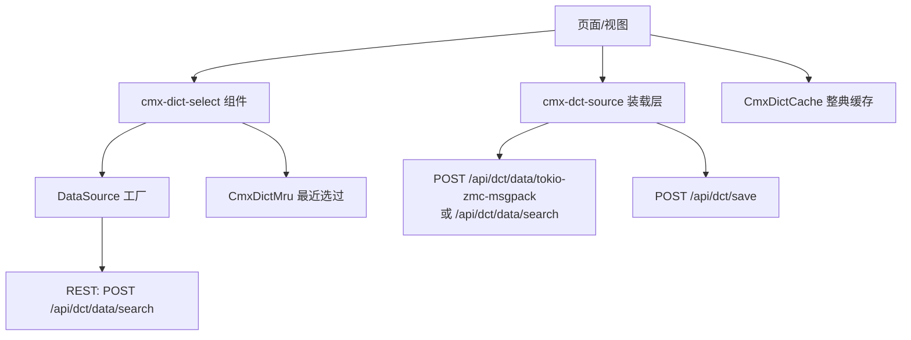
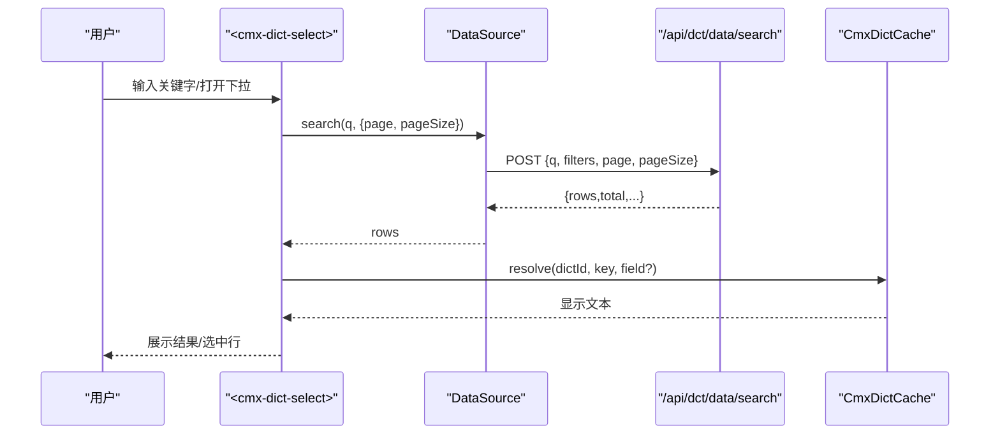
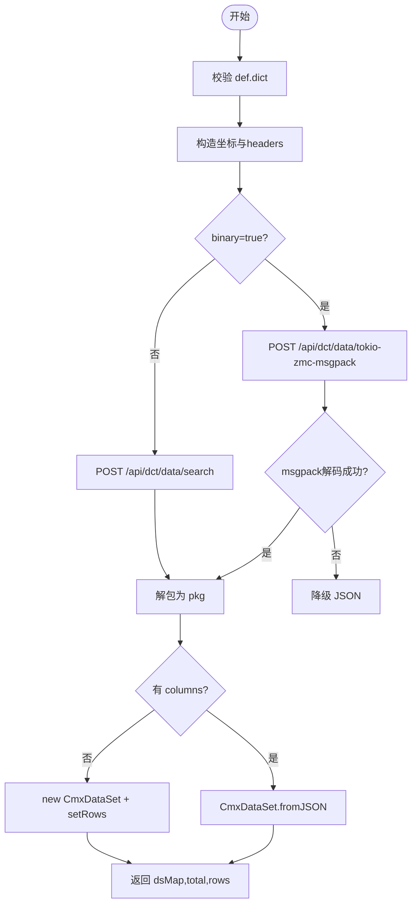
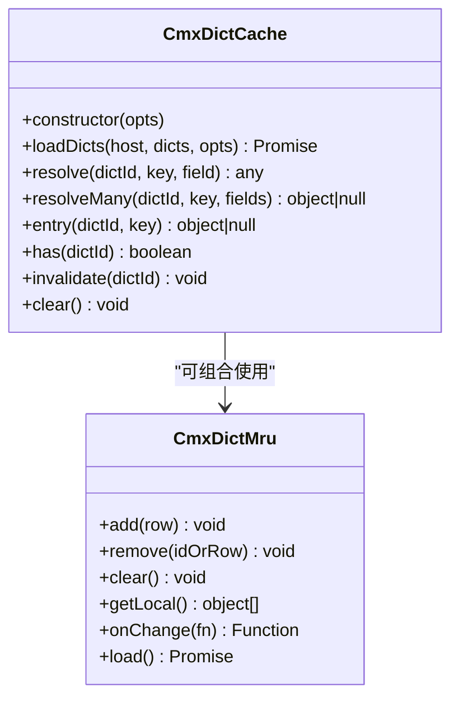
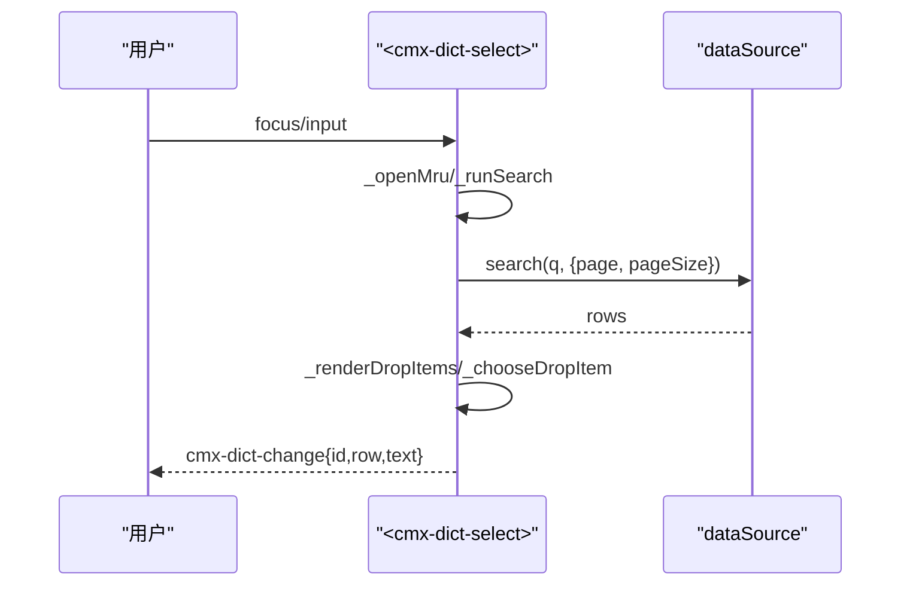
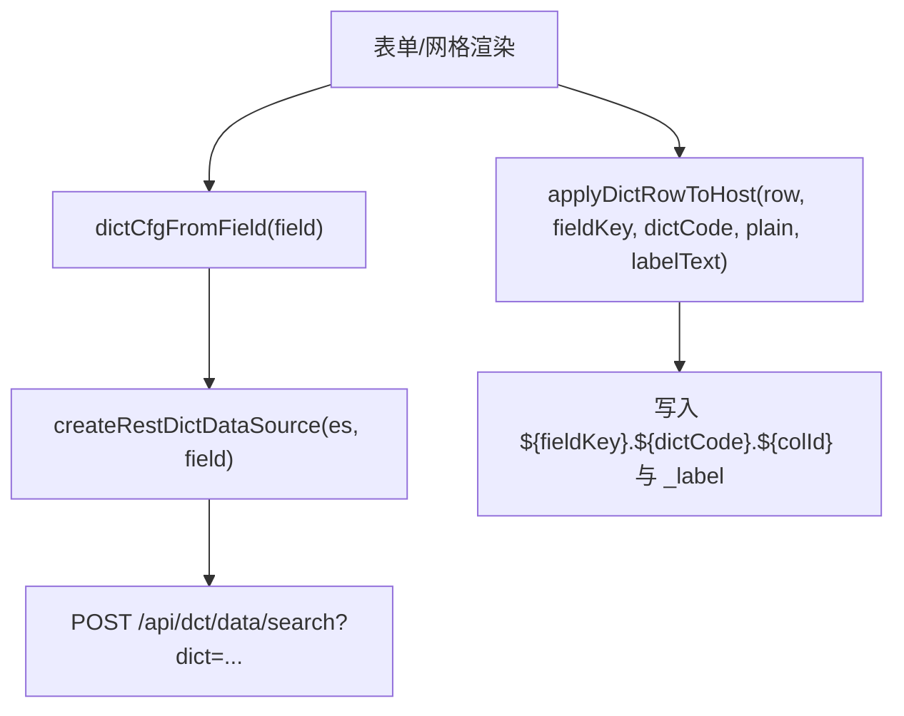
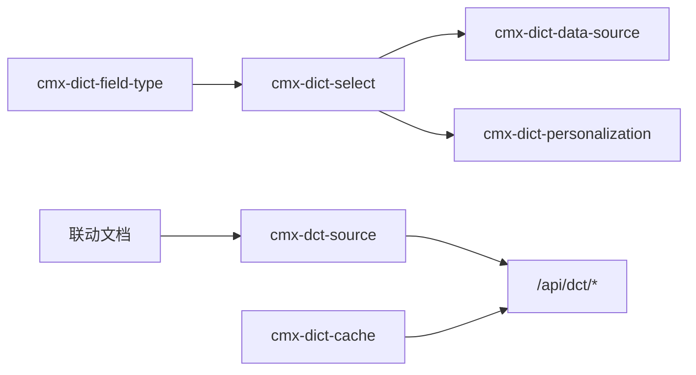

# 字典数据源

<cite>
**本文引用的文件**
- [cmx-dct-source.js](file://packages/cmx-data-comp/src/lib/cmx-dct-source.js)
- [cmx-dict-cache.js](file://packages/cmx-data-comp/src/lib/cmx-dict-cache.js)
- [cmx-dict-select.js](file://packages/cmx-data-comp/src/components/cmx-dict-select.js)
- [cmx-dict-data-source.js](file://packages/cmx-data-comp/src/lib/cmx-dict-data-source.js)
- [cmx-dict-field-type.js](file://packages/cmx-data-comp/src/lib/cmx-dict-field-type.js)
- [cmx-dict-personalization.js](file://packages/cmx-data-comp/src/lib/cmx-dict-personalization.js)
- [20260721_dicttree-ws_四区联动与字典加载逻辑.md](file://docs/20260721_dicttree-ws_四区联动与字典加载逻辑.md)
</cite>

## 目录
1. [简介](#简介)
2. [项目结构](#项目结构)
3. [核心组件](#核心组件)
4. [架构总览](#架构总览)
5. [详细组件分析](#详细组件分析)
6. [依赖关系分析](#依赖关系分析)
7. [性能考量](#性能考量)
8. [故障排查指南](#故障排查指南)
9. [结论](#结论)
10. [附录](#附录)

## 简介
本技术文档围绕 CMX 字典数据源，系统性说明：
- 字典定义文件的解析与装载机制（含二进制 msgpack 优先、JSON 兜底）
- 字典数据的缓存策略（整典 L0 缓存、MRU 最近选过）
- 层级字典的树形结构与懒下钻构建
- 查询接口能力（按编码查找、模糊搜索、条件过滤）
- 实时更新机制（保存回写、变更集清洗、基线刷新）
- 与表单/网格组件的集成方式（下拉选择、级联选择、动态选项生成）
- 配置最佳实践与性能优化建议

## 项目结构
CMX 字典数据源位于 packages/cmx-data-comp 中，由“数据装载层 + 缓存层 + 组件层 + 字段类型注册”构成。关键文件职责如下：
- cmx-dct-source.js：字典数据装载/回存的前端适配层，对接 /api/dct/* 端点
- cmx-dict-cache.js：整典 L0 缓存，id→entry 映射，支持批量装载与失效
- cmx-dict-select.js：<cmx-dict-select> 组件，实现 MRU、边输边搜、help 三布局
- cmx-dict-data-source.js：通用 DataSource 工厂，抽象 search/loadByKeys 协议
- cmx-dict-field-type.js：将 dict-select 注册为字段类型，桥接表单/网格
- cmx-dict-personalization.js：MRU 个性化存储（本地 localStorage + 可选后端）
- docs 中的联动文档：描述四区联动与懒下钻时序

图表来源
- [cmx-dict-select.js:1-120](file://packages/cmx-data-comp/src/components/cmx-dict-select.js#L1-L120)
- [cmx-dict-data-source.js:1-155](file://packages/cmx-data-comp/src/lib/cmx-dict-data-source.js#L1-L155)
- [cmx-dct-source.js:1-123](file://packages/cmx-data-comp/src/lib/cmx-dct-source.js#L1-L123)
- [cmx-dict-cache.js:1-147](file://packages/cmx-data-comp/src/lib/cmx-dict-cache.js#L1-L147)
- [cmx-dict-personalization.js:1-166](file://packages/cmx-data-comp/src/lib/cmx-dict-personalization.js#L1-L166)

章节来源
- [cmx-dct-source.js:1-123](file://packages/cmx-data-comp/src/lib/cmx-dct-source.js#L1-L123)
- [cmx-dict-cache.js:1-147](file://packages/cmx-data-comp/src/lib/cmx-dict-cache.js#L1-L147)
- [cmx-dict-select.js:1-120](file://packages/cmx-data-comp/src/components/cmx-dict-select.js#L1-L120)
- [cmx-dict-data-source.js:1-155](file://packages/cmx-data-comp/src/lib/cmx-dict-data-source.js#L1-L155)
- [cmx-dict-field-type.js:1-120](file://packages/cmx-data-comp/src/lib/cmx-dict-field-type.js#L1-L120)
- [cmx-dict-personalization.js:1-166](file://packages/cmx-data-comp/src/lib/cmx-dict-personalization.js#L1-L166)

## 核心组件
- 字典装载层（cmx-dct-source.js）
  - 提供 loadDictData、loadDictChildren、saveDictData、upsertDictEntries、deleteDictEntry
  - 优先走二进制 msgpack 端点，失败自动降级 JSON；统一封装列压缩包到 CmxDataSet
  - 对 changeset 进行 UI-only 字段清洗，避免写入数据库
- 整典缓存（cmx-dict-cache.js）
  - 收集 refDict，并发拉取全量条目，建立 key→entry 映射，O(1) 解析显示值
  - 支持 per-dict 覆盖 keyField/labelField，支持失效与清空
- 字典选择组件（cmx-dict-select.js）
  - 支持 MRU 最近选过、边输边搜、help 三布局（classify/group/grid）
  - 通过 dataSource 协议解耦后端，支持 hierarchical 树形字典
- 字段类型注册（cmx-dict-field-type.js）
  - 将 dict-select 注入表单/网格编辑器，自动处理值回写、显示模式、writeBack 映射
- 通用 DataSource（cmx-dict-data-source.js）
  - 抽象 search/loadByKeys，适配不同 host.service 实现
- MRU 个性化（cmx-dict-personalization.js）
  - 本地 localStorage + 可选后端服务，异步合并，不阻塞交互

章节来源
- [cmx-dct-source.js:1-429](file://packages/cmx-data-comp/src/lib/cmx-dct-source.js#L1-L429)
- [cmx-dict-cache.js:1-192](file://packages/cmx-data-comp/src/lib/cmx-dict-cache.js#L1-L192)
- [cmx-dict-select.js:1-800](file://packages/cmx-data-comp/src/components/cmx-dict-select.js#L1-L800)
- [cmx-dict-field-type.js:1-464](file://packages/cmx-data-comp/src/lib/cmx-dict-field-type.js#L1-L464)
- [cmx-dict-data-source.js:1-155](file://packages/cmx-data-comp/src/lib/cmx-dict-data-source.js#L1-L155)
- [cmx-dict-personalization.js:1-189](file://packages/cmx-data-comp/src/lib/cmx-dict-personalization.js#L1-L189)

## 架构总览
字典数据源采用“装载层 + 缓存层 + 组件层”的分层设计：
- 装载层负责与后端 /api/dct/* 通信，统一响应格式，并转换为 CmxDataSet
- 缓存层在渲染前预加载整典，减少重复请求，提升 id→name 解析性能
- 组件层提供用户交互入口，结合 MRU 与搜索，降低输入成本
- 字段类型注册将字典能力无缝接入表单/网格编辑场景

图表来源
- [cmx-dict-select.js:630-694](file://packages/cmx-data-comp/src/components/cmx-dict-select.js#L630-L694)
- [cmx-dict-data-source.js:96-121](file://packages/cmx-data-comp/src/lib/cmx-dict-data-source.js#L96-L121)
- [cmx-dict-cache.js:105-139](file://packages/cmx-data-comp/src/lib/cmx-dict-cache.js#L105-L139)

## 详细组件分析

### 字典装载层（cmx-dct-source.js）
- 装载流程
  - 校验 def.dict 必填
  - 构造坐标参数与 headers（Accept 根据 binary 切换 msgpack/json）
  - 调用 _fetch(host, url, opts)，优先二进制 msgpack，失败降级 JSON
  - 统一解包 _unwrapDictPkg，兼容信封与裸包
  - 若返回包含 datasetId+columns，则走 CmxDataSet.fromJSON；否则以 rows 直建
- 子节点懒下钻
  - loadDictChildren 复用 loadDictData，传入 parentId/pageSize
- 保存与回写
  - saveDictData 发送 changeset，自动 sanitizeChangeSet 剔除 UI-only/只读字段
  - 支持 merge/replace 模式，异常分类（冲突 409、校验 422/violations）
  - upsertDictEntries/deleteDictEntry 提供单行操作
- 行归一化
  - normalizeDictRow 补全 displayValue、hasChildren、full_path、level_no 等 UI 字段

图表来源
- [cmx-dct-source.js:67-123](file://packages/cmx-data-comp/src/lib/cmx-dct-source.js#L67-L123)
- [cmx-dct-source.js:366-379](file://packages/cmx-data-comp/src/lib/cmx-dct-source.js#L366-L379)

章节来源
- [cmx-dct-source.js:67-123](file://packages/cmx-data-comp/src/lib/cmx-dct-source.js#L67-L123)
- [cmx-dct-source.js:134-144](file://packages/cmx-data-comp/src/lib/cmx-dct-source.js#L134-L144)
- [cmx-dct-source.js:165-206](file://packages/cmx-data-comp/src/lib/cmx-dct-source.js#L165-L206)
- [cmx-dct-source.js:215-251](file://packages/cmx-data-comp/src/lib/cmx-dct-source.js#L215-L251)
- [cmx-dct-source.js:266-336](file://packages/cmx-data-comp/src/lib/cmx-dct-source.js#L266-L336)

### 整典缓存（cmx-dict-cache.js）
- 目标：单据列存字典 id/code，界面需显示 name 或其他属性；L0 策略为整典缓存
- 行为
  - collectRefDicts 从 DocMeta 或字段数组收集所有 refDict
  - loadDicts 并发拉取每个字典的全量条目（pageSize=5000），构建 byKey Map
  - resolve/resolveMany/entry 提供 O(1) 解析
  - invalidate/clear 支持版本升级后的失效与清空
- 错误处理
  - HTTP 失败或结构异常时不写缓存，保留重试机会，并输出警告日志

图表来源
- [cmx-dict-cache.js:25-147](file://packages/cmx-data-comp/src/lib/cmx-dict-cache.js#L25-L147)
- [cmx-dict-personalization.js:41-166](file://packages/cmx-data-comp/src/lib/cmx-dict-personalization.js#L41-L166)

章节来源
- [cmx-dict-cache.js:1-192](file://packages/cmx-data-comp/src/lib/cmx-dict-cache.js#L1-L192)

### 字典选择组件（cmx-dict-select.js）
- 功能要点
  - 标签属性与 configure 配置项一致，支持 dictCode、hierarchical、helpLayout 等
  - 输入框聚焦打开 MRU，输入触发防抖搜索，支持键盘导航与选择
  - help 对话框支持 classify/group/grid 三种布局，左侧树+右侧 grid
  - 通过 dataSource.search/loadByKeys 解耦后端，支持分页与过滤
- 事件与状态
  - cmx-dict-change 派发选中结果（id、row、text）
  - 内部维护 _innerDs、_value、_dropItems、_activeIdx 等状态

图表来源
- [cmx-dict-select.js:630-694](file://packages/cmx-data-comp/src/components/cmx-dict-select.js#L630-L694)
- [cmx-dict-select.js:169-218](file://packages/cmx-data-comp/src/components/cmx-dict-select.js#L169-L218)

章节来源
- [cmx-dict-select.js:1-800](file://packages/cmx-data-comp/src/components/cmx-dict-select.js#L1-L800)

### 字段类型注册与集成（cmx-dict-field-type.js）
- 将 dict-select 注册为字段类型，供表单/网格使用
- 自动从 field.editSettings 推导配置（dictCode、hierarchical、helpLayout、columns 等）
- 值回写策略
  - 默认将选中字典行的业务列写回宿主行，键名形如 ${fieldKey}.${dictCode}.${colId}
  - 支持 writeBack 映射到任意宿主字段，支持 exclude/include 白名单
- 显示模式
  - 支持 value/code/label/code-label/auto/field 多种显示模式
  - 未命中时回退到列上的 display.resolve（来自 CmxDictCache）

图表来源
- [cmx-dict-field-type.js:166-228](file://packages/cmx-data-comp/src/lib/cmx-dict-field-type.js#L166-L228)
- [cmx-dict-field-type.js:285-337](file://packages/cmx-data-comp/src/lib/cmx-dict-field-type.js#L285-L337)

章节来源
- [cmx-dict-field-type.js:1-464](file://packages/cmx-data-comp/src/lib/cmx-dict-field-type.js#L1-L464)

### 通用 DataSource（cmx-dict-data-source.js）
- 抽象协议
  - search(query, opts) → rows
  - loadByKeys(keys, opts) → rows
- 灵活适配
  - 支持 extraParams/responsePath/transform 等扩展点
  - createLocalDictDataSource 用于本地枚举/静态选项
- 与组件解耦
  - 组件仅依赖 dataSource 接口，便于替换后端实现

章节来源
- [cmx-dict-data-source.js:1-155](file://packages/cmx-data-comp/src/lib/cmx-dict-data-source.js#L1-L155)

### MRU 个性化（cmx-dict-personalization.js）
- 两层存储：本地 localStorage（立即可用）+ 可选后端服务（异步合并）
- 行为
  - add/remove/clear 立即落本地，后端 best-effort 保存
  - load 异步合并后端顺序优先，本地补充，去重截断
  - onChange 订阅变化，驱动 UI 刷新

章节来源
- [cmx-dict-personalization.js:1-189](file://packages/cmx-data-comp/src/lib/cmx-dict-personalization.js#L1-L189)

## 依赖关系分析
- 组件依赖
  - <cmx-dict-select> 依赖 DataSource 协议，不关心具体后端实现
  - 字段类型注册依赖 cmx-dict-select，并将配置透传至组件
- 装载层依赖
  - cmx-dct-source 依赖 CmxDataSet、msgpack 解码、docCoordQuery
  - 与后端 /api/dct/* 强耦合，但通过 host.fetch 可替换
- 缓存依赖
  - CmxDictCache 依赖 /api/dct/data/search，并发拉取，构建 Map
- 联动文档
  - 四区联动与懒下钻时序描述了 tree→grid→form 的数据流与事件广播

图表来源
- [cmx-dict-select.js:1-120](file://packages/cmx-data-comp/src/components/cmx-dict-select.js#L1-L120)
- [cmx-dict-data-source.js:1-155](file://packages/cmx-data-comp/src/lib/cmx-dict-data-source.js#L1-L155)
- [cmx-dict-personalization.js:1-166](file://packages/cmx-data-comp/src/lib/cmx-dict-personalization.js#L1-L166)
- [cmx-dct-source.js:1-123](file://packages/cmx-data-comp/src/lib/cmx-dct-source.js#L1-L123)
- [cmx-dict-cache.js:1-147](file://packages/cmx-data-comp/src/lib/cmx-dict-cache.js#L1-L147)
- [20260721_dicttree-ws_四区联动与字典加载逻辑.md:233-318](file://docs/20260721_dicttree-ws_四区联动与字典加载逻辑.md#L233-L318)

章节来源
- [20260721_dicttree-ws_四区联动与字典加载逻辑.md:233-318](file://docs/20260721_dicttree-ws_四区联动与字典加载逻辑.md#L233-L318)

## 性能考量
- 二进制优先与降级
  - 优先 msgpack 零拷贝传输，失败自动降级 JSON，兼顾兼容性
- 整典缓存
  - 并发拉取全量字典条目，构建 Map，O(1) 解析显示值，减少重复请求
- 懒下钻
  - 层级字典按需加载子节点，避免一次性加载整树
- MRU 本地优先
  - 打开下拉即展示本地 MRU，异步合并后端，提升首屏体验
- 列压缩包
  - 当后端返回 columns 时，直接 CmxDataSet.fromJSON，减少前端列建模开销
- 变更集清洗
  - 保存前剔除 UI-only/只读字段，减少无效传输与校验失败

[本节为通用性能建议，无需特定文件引用]

## 故障排查指南
- 装载失败无提示
  - 现象：HTTP 失败被误当作空数据集，表格空白且无提示
  - 原因：_unwrapDictPkg 对非 2xx 必须抛错，避免静默降级
  - 处理：检查后端返回结构，确保拦截器正确抛出业务错误
- 字典缓存未命中
  - 现象：id 无法解析为名称
  - 原因：loadDicts 失败未写缓存，需重试；或 coord/dbId 配置不正确
  - 处理：查看控制台警告，确认 URL 与 headers.db_id
- 保存校验失败
  - 现象：422 或 violations 非空
  - 原因：changeset 中包含 UI-only/只读字段或业务校验未通过
  - 处理：使用 sanitizeChangeSet 清洗，查看 formatDictViolations 输出定位问题
- 组件下拉不更新
  - 现象：输入后无搜索结果
  - 原因：dataSource.search 未实现或返回结构不符
  - 处理：确认 pickRows 能提取 rows/items/data，或自定义 responsePath/transform

章节来源
- [cmx-dct-source.js:366-379](file://packages/cmx-data-comp/src/lib/cmx-dct-source.js#L366-L379)
- [cmx-dict-cache.js:68-91](file://packages/cmx-data-comp/src/lib/cmx-dict-cache.js#L68-L91)
- [cmx-dict-data-source.js:16-25](file://packages/cmx-data-comp/src/lib/cmx-dict-data-source.js#L16-L25)

## 结论
CMX 字典数据源通过分层设计与协议抽象，实现了：
- 高效装载：二进制优先、列压缩包、懒下钻
- 高性能渲染：整典 L0 缓存、MRU 本地优先
- 易集成：字段类型注册、DataSource 协议解耦
- 可维护：变更集清洗、错误分类、失效策略
建议在项目中优先启用二进制装载与整典缓存，合理配置 pageSize 与过滤条件，利用 writeBack 与 displayMode 满足多样化展示需求。

[本节为总结性内容，无需特定文件引用]

## 附录

### 字典数据与表单组件集成要点
- 表单字段 type:'dict-select'
  - 通过 editSettings 配置 dictCode、hierarchical、helpLayout、columns 等
  - 值回写：默认写入 ${fieldKey}.${dictCode}.${colId}，支持 writeBack 映射
  - 显示模式：value/code/label/code-label/auto/field
- 网格编辑器
  - 在 revo-grid v4 中，单元格编辑器挂载 <cmx-dict-select>，选中后立即保存并关闭编辑器
  - 支持 cellTemplate 显示字典名称或编码-名称

章节来源
- [cmx-dict-field-type.js:376-464](file://packages/cmx-data-comp/src/lib/cmx-dict-field-type.js#L376-L464)

### 层级字典树形结构构建
- selfHierarchy=true 的字典通过 parent_id 自引用成树
- 懒下钻：loadDictChildren 按 parentId 拉取直接子层
- 行归一化：normalizeDictRow 补全 hasChildren/full_path/level_no/displayValue
- 四区联动：树节点选择触发 gridfilter 与 data 事件，同步 grid/form

章节来源
- [cmx-dct-source.js:134-144](file://packages/cmx-data-comp/src/lib/cmx-dct-source.js#L134-L144)
- [cmx-dct-source.js:266-290](file://packages/cmx-data-comp/src/lib/cmx-dct-source.js#L266-L290)
- [20260721_dicttree-ws_四区联动与字典加载逻辑.md:272-318](file://docs/20260721_dicttree-ws_四区联动与字典加载逻辑.md#L272-L318)

### 查询接口能力
- 按编码查找：loadByKeys(keys) 批量获取字典行
- 模糊搜索：search(q) 支持 q 与 filters 组合
- 条件过滤：filtersParam 指定过滤键，extraParams 注入额外参数
- 分页：page/pageSize 控制每页大小

章节来源
- [cmx-dict-data-source.js:96-121](file://packages/cmx-data-comp/src/lib/cmx-dict-data-source.js#L96-L121)
- [cmx-dict-field-type.js:189-227](file://packages/cmx-data-comp/src/lib/cmx-dict-field-type.js#L189-L227)

### 实时更新机制
- 保存回写：saveDictData 发送 changeset，支持 merge/replace
- 变更集清洗：sanitizeChangeSet 剔除 UI-only/只读字段
- 基线刷新：collector.refreshBaselines(updatedAt) 用后端回传时间刷新
- 增量更新：loadDictChildren 按需加载子节点，避免全量刷新

章节来源
- [cmx-dct-source.js:165-206](file://packages/cmx-data-comp/src/lib/cmx-dct-source.js#L165-L206)
- [cmx-dct-source.js:299-336](file://packages/cmx-data-comp/src/lib/cmx-dct-source.js#L299-L336)