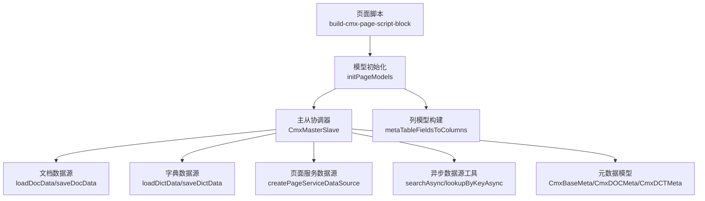
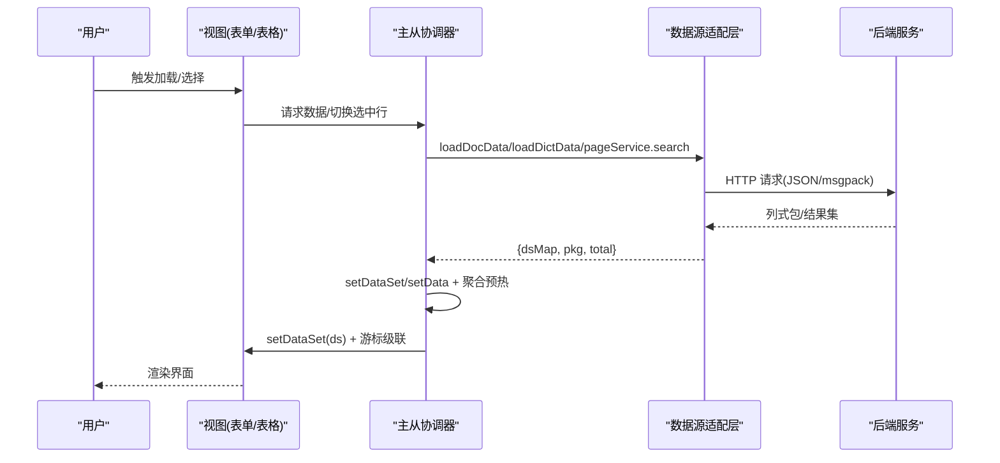
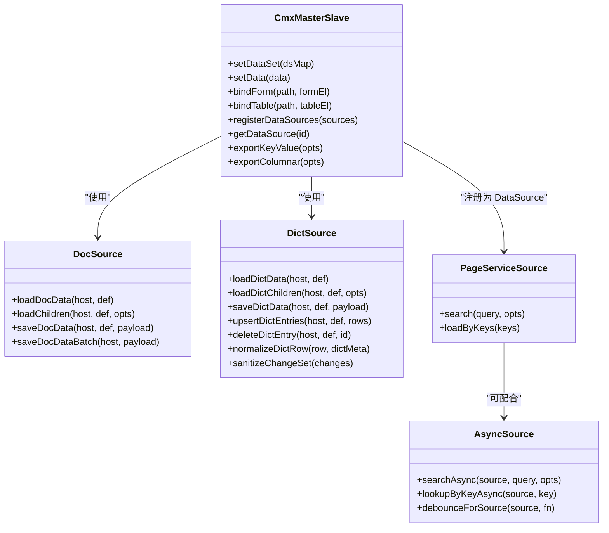
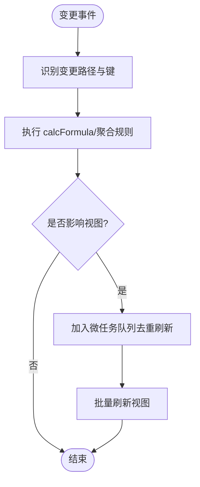
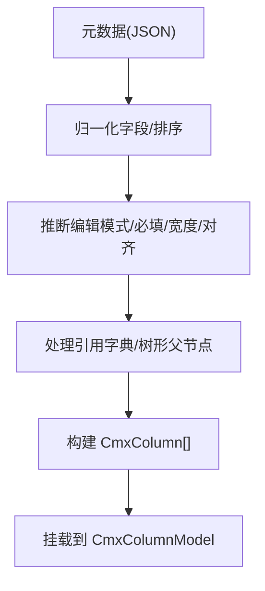
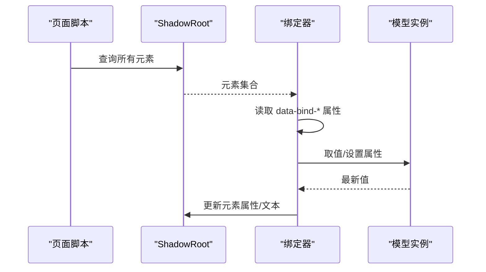
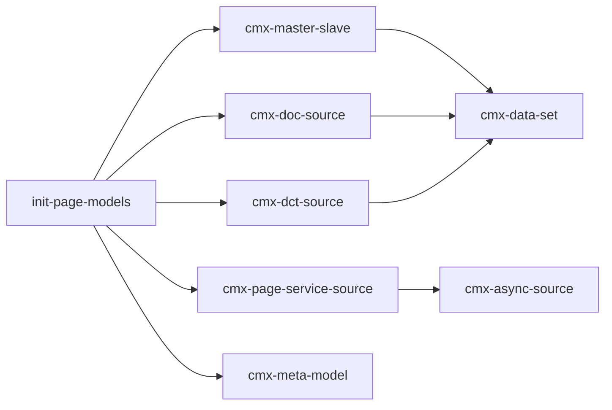

# 数据绑定机制

<cite>
**本文引用的文件**
- [packages/cmx-data-comp/src/lib/init-page-models.js](file://packages/cmx-data-comp/src/lib/init-page-models.js)
- [packages/cmx-data-comp/src/lib/cmx-master-slave.js](file://packages/cmx-data-comp/src/lib/cmx-master-slave.js)
- [packages/cmx-data-comp/src/lib/cmx-doc-source.js](file://packages/cmx-data-comp/src/lib/cmx-doc-source.js)
- [packages/cmx-data-comp/src/lib/cmx-dct-source.js](file://packages/cmx-data-comp/src/lib/cmx-dct-source.js)
- [packages/cmx-data-comp/src/lib/cmx-page-service-source.js](file://packages/cmx-data-comp/src/lib/cmx-page-service-source.js)
- [packages/cmx-data-comp/src/lib/cmx-async-source.js](file://packages/cmx-data-comp/src/lib/cmx-async-source.js)
- [packages/cmx-data-comp/src/lib/cmx-meta-model.js](file://packages/cmx-data-comp/src/lib/cmx-meta-model.js)
- [packages/cmx-data-comp/src/lib/cmx-doc-meta-loader.js](file://packages/cmx-data-comp/src/lib/cmx-doc-meta-loader.js)
- [CMXHTMLDesigner/src/utils/build-cmx-page-script-block.js](file://CMXHTMLDesigner/src/utils/build-cmx-page-script-block.js)
</cite>

## 目录
1. [简介](#简介)
2. [项目结构](#项目结构)
3. [核心组件](#核心组件)
4. [架构总览](#架构总览)
5. [详细组件分析](#详细组件分析)
6. [依赖关系分析](#依赖关系分析)
7. [性能考量](#性能考量)
8. [故障排查指南](#故障排查指南)
9. [结论](#结论)
10. [附录](#附录)

## 简介
本技术文档围绕 CMX 的数据绑定机制，系统性阐述数据源抽象层的设计与实现，覆盖文档数据源、字典数据源、页面服务数据源和本地数据源的加载策略、缓存机制、增量更新与冲突解决；并解释双向绑定的工作原理、变更检测与性能优化。同时给出异步数据流处理、错误处理与重试建议，以及复杂场景的实现示例与调试技巧。

## 项目结构
CMX 数据绑定由“模型初始化 → 主从协调器 → 数据源适配层 → 视图绑定”构成：
- 模型初始化：根据设计期 models 配置创建 CmxMasterSlave、CmxColumnModel、CmxDataSet 等实例，并扫描 Shadow DOM 完成视图绑定。
- 主从协调器：维护递归主从数据树、当前选中行、聚合规则、视图绑定与事件联动。
- 数据源适配层：提供文档（DOC）、字典（DCT）、页面服务（pageService）与通用异步（async）数据源统一接口。
- 视图绑定：通过 data-bind-* 属性或组件 API 将模型数据映射到 UI 元素。

图表来源
- [CMXHTMLDesigner/src/utils/build-cmx-page-script-block.js:111-144](file://CMXHTMLDesigner/src/utils/build-cmx-page-script-block.js#L111-L144)
- [packages/cmx-data-comp/src/lib/init-page-models.js:717-800](file://packages/cmx-data-comp/src/lib/init-page-models.js#L717-L800)
- [packages/cmx-data-comp/src/lib/cmx-master-slave.js:41-85](file://packages/cmx-data-comp/src/lib/cmx-master-slave.js#L41-L85)
- [packages/cmx-data-comp/src/lib/cmx-doc-source.js:47-83](file://packages/cmx-data-comp/src/lib/cmx-doc-source.js#L47-L83)
- [packages/cmx-data-comp/src/lib/cmx-dct-source.js:67-123](file://packages/cmx-data-comp/src/lib/cmx-dct-source.js#L67-L123)
- [packages/cmx-data-comp/src/lib/cmx-page-service-source.js:53-125](file://packages/cmx-data-comp/src/lib/cmx-page-service-source.js#L53-L125)
- [packages/cmx-data-comp/src/lib/cmx-async-source.js:37-81](file://packages/cmx-data-comp/src/lib/cmx-async-source.js#L37-L81)
- [packages/cmx-data-comp/src/lib/cmx-meta-model.js:347-445](file://packages/cmx-data-comp/src/lib/cmx-meta-model.js#L347-L445)

章节来源
- [CMXHTMLDesigner/src/utils/build-cmx-page-script-block.js:111-144](file://CMXHTMLDesigner/src/utils/build-cmx-page-script-block.js#L111-L144)
- [packages/cmx-data-comp/src/lib/init-page-models.js:717-800](file://packages/cmx-data-comp/src/lib/init-page-models.js#L717-L800)

## 核心组件
- 主从协调器（CmxMasterSlave）：管理多表主从关系、当前选中行、聚合计算、视图绑定与级联刷新。
- 数据源适配层：
  - 文档数据源（cmx-doc-source）：支持二进制 msgpack 装载、懒下钻、合并/替换保存、变更集收集与乐观锁基线刷新。
  - 字典数据源（cmx-dct-source）：单表装载、层级子节点懒加载、UI 字段过滤、保存校验与冲突处理。
  - 页面服务数据源（cmx-page-service-source）：将 pageService 包装为 DataSource，支持分页、去抖、缓存与响应路径解析。
  - 异步数据源工具（cmx-async-source）：LRU 缓存、请求去抖、AbortController 取消旧请求。
- 元数据模型（CmxBaseMeta/CmxDOCMeta/CmxDCTMeta）：批量加载、字段集合并、表/字段访问、后端路径回填。
- 列模型构建：基于元数据生成 CmxColumnModel，自动推断编辑模式、必填、宽度、对齐与显示格式。

章节来源
- [packages/cmx-data-comp/src/lib/cmx-master-slave.js:41-85](file://packages/cmx-data-comp/src/lib/cmx-master-slave.js#L41-L85)
- [packages/cmx-data-comp/src/lib/cmx-doc-source.js:47-83](file://packages/cmx-data-comp/src/lib/cmx-doc-source.js#L47-L83)
- [packages/cmx-data-comp/src/lib/cmx-dct-source.js:67-123](file://packages/cmx-data-comp/src/lib/cmx-dct-source.js#L67-L123)
- [packages/cmx-data-comp/src/lib/cmx-page-service-source.js:53-125](file://packages/cmx-data-comp/src/lib/cmx-page-service-source.js#L53-L125)
- [packages/cmx-data-comp/src/lib/cmx-async-source.js:37-81](file://packages/cmx-data-comp/src/lib/cmx-async-source.js#L37-L81)
- [packages/cmx-data-comp/src/lib/cmx-meta-model.js:347-445](file://packages/cmx-data-comp/src/lib/cmx-meta-model.js#L347-L445)
- [packages/cmx-data-comp/src/lib/init-page-models.js:392-566](file://packages/cmx-data-comp/src/lib/init-page-models.js#L392-L566)

## 架构总览
数据绑定从页面脚本开始，按模型声明创建实例，再根据 data-cmx-model-id / data-cmx-dataset-id 将视图与模型绑定。数据通过数据源适配层加载，经主从协调器组织为树形数据集，最终驱动表单/表格渲染。

图表来源
- [packages/cmx-data-comp/src/lib/cmx-master-slave.js:317-335](file://packages/cmx-data-comp/src/lib/cmx-master-slave.js#L317-L335)
- [packages/cmx-data-comp/src/lib/cmx-doc-source.js:47-83](file://packages/cmx-data-comp/src/lib/cmx-doc-source.js#L47-L83)
- [packages/cmx-data-comp/src/lib/cmx-dct-source.js:67-123](file://packages/cmx-data-comp/src/lib/cmx-dct-source.js#L67-L123)
- [packages/cmx-data-comp/src/lib/cmx-page-service-source.js:90-125](file://packages/cmx-data-comp/src/lib/cmx-page-service-source.js#L90-L125)

## 详细组件分析

### 数据源抽象层
- 文档数据源（cmx-doc-source）
  - 装载：支持 JSON 与二进制 msgpack，统一走 CmxDataSet.fromJSON，返回 dsMap/pkg/total。
  - 懒下钻：loadChildren 按父 id 拉取子层，支持 query/depth/exit。
  - 保存：merge/replace 双模式，支持批量保存；409 冲突标记 conflict=true；422/校验失败结构化抛出 violations。
  - 变更集：ChangeSetCollector 订阅各层 row-changed/ds-row-added/ds-row-removed，导出最小 changeset；支持 applyIdMap 与 refreshBaselines。
- 字典数据源（cmx-dct-source）
  - 装载：优先二进制 msgpack，回退 JSON search；统一 datasetId；支持 parentId/page/pageSize 便捷参数。
  - 子节点：loadDictChildren 用于层级字典懒加载。
  - 保存：sanitizeChangeSet 剔除 UI-only 与只读字段；formatDictViolations 格式化校验错误。
  - 行归一化：normalizeDictRow 补全 displayValue/hasChildren/full_path/level_no 等 UI 字段。
- 页面服务数据源（cmx-page-service-source）
  - 将 host[service] 包装为 DataSource，支持 keyField/labelField/queryParam/keysParam/pageParam/pageSizeParam/responsePath/totalPath/transform/extraParams/debounceMs/cacheSize。
  - search/loadByKeys 内部自动提取 items/total，支持 transform 自定义变换。
- 异步数据源工具（cmx-async-source）
  - LRU 缓存（queryCache/keyCache），debounce 控制搜索频率，AbortController 取消旧请求，lookupByKeyAsync 优先本地查找。

图表来源
- [packages/cmx-data-comp/src/lib/cmx-master-slave.js:41-85](file://packages/cmx-data-comp/src/lib/cmx-master-slave.js#L41-L85)
- [packages/cmx-data-comp/src/lib/cmx-doc-source.js:47-83](file://packages/cmx-data-comp/src/lib/cmx-doc-source.js#L47-L83)
- [packages/cmx-data-comp/src/lib/cmx-dct-source.js:67-123](file://packages/cmx-data-comp/src/lib/cmx-dct-source.js#L67-L123)
- [packages/cmx-data-comp/src/lib/cmx-page-service-source.js:53-125](file://packages/cmx-data-comp/src/lib/cmx-page-service-source.js#L53-L125)
- [packages/cmx-data-comp/src/lib/cmx-async-source.js:37-81](file://packages/cmx-data-comp/src/lib/cmx-async-source.js#L37-L81)

章节来源
- [packages/cmx-data-comp/src/lib/cmx-doc-source.js:47-83](file://packages/cmx-data-comp/src/lib/cmx-doc-source.js#L47-L83)
- [packages/cmx-data-comp/src/lib/cmx-dct-source.js:67-123](file://packages/cmx-data-comp/src/lib/cmx-dct-source.js#L67-L123)
- [packages/cmx-data-comp/src/lib/cmx-page-service-source.js:53-125](file://packages/cmx-data-comp/src/lib/cmx-page-service-source.js#L53-L125)
- [packages/cmx-data-comp/src/lib/cmx-async-source.js:37-81](file://packages/cmx-data-comp/src/lib/cmx-async-source.js#L37-L81)

### 主从协调器与双向绑定
- 视图绑定：bindForm/bindTable 将组件与 schema path 关联，支持 _setDataSourceProvider 注入数据源。
- 双向绑定：
  - 表单/表格变化事件（row-changed、ds-row-added/removed）被协调器监听，执行 calcFormula 与聚合规则，并通过 _notifyCellChanged 派发 change。
  - 游标变化（cursor-changed）级联刷新子层视图，保持父子同步。
- 聚合与公式：
  - 支持 sum/avg/min/max/count 等内置聚合函数，按 from/to 作用域计算。
  - 列模型中的 calcFormula 在 row-changed 时调用 invokePreset 执行。
- 批处理刷新：
  - 规则执行后通过 queueMicrotask 合并受影响视图的刷新，减少重绘次数。

图表来源
- [packages/cmx-data-comp/src/lib/cmx-master-slave.js:357-417](file://packages/cmx-data-comp/src/lib/cmx-master-slave.js#L357-L417)
- [packages/cmx-data-comp/src/lib/cmx-master-slave.js:755-786](file://packages/cmx-data-comp/src/lib/cmx-master-slave.js#L755-L786)

章节来源
- [packages/cmx-data-comp/src/lib/cmx-master-slave.js:317-335](file://packages/cmx-data-comp/src/lib/cmx-master-slave.js#L317-L335)
- [packages/cmx-data-comp/src/lib/cmx-master-slave.js:357-417](file://packages/cmx-data-comp/src/lib/cmx-master-slave.js#L357-L417)
- [packages/cmx-data-comp/src/lib/cmx-master-slave.js:755-786](file://packages/cmx-data-comp/src/lib/cmx-master-slave.js#L755-L786)

### 元数据与列模型构建
- 元数据模型：
  - CmxBaseMeta 支持批量加载（loadMetaBatch/loadMetaModelsBatch），就地应用批次结果（applyBatchItem），合并 base 字段集。
  - CmxMetaTable 负责字段集引用与顺序（fieldSetOrder），内联字段遮蔽同 id 引用字段。
- 列模型构建：
  - metaTableFieldsToColumns 将元数据字段转换为 CmxColumn[]，自动推断 edit.mode、required、width、align、display 等。
  - 支持 refDict/cm x-dict-select 字典选择弹窗、树形父节点 hierarchical 模式。
  - backfillColumnCoord 用全局坐标补全列的字典坐标，避免请求缺参。

图表来源
- [packages/cmx-data-comp/src/lib/cmx-meta-model.js:347-445](file://packages/cmx-data-comp/src/lib/cmx-meta-model.js#L347-L445)
- [packages/cmx-data-comp/src/lib/init-page-models.js:392-566](file://packages/cmx-data-comp/src/lib/init-page-models.js#L392-L566)
- [packages/cmx-data-comp/src/lib/init-page-models.js:581-611](file://packages/cmx-data-comp/src/lib/init-page-models.js#L581-L611)

章节来源
- [packages/cmx-data-comp/src/lib/cmx-meta-model.js:347-445](file://packages/cmx-data-comp/src/lib/cmx-meta-model.js#L347-L445)
- [packages/cmx-data-comp/src/lib/init-page-models.js:392-566](file://packages/cmx-data-comp/src/lib/init-page-models.js#L392-L566)
- [packages/cmx-data-comp/src/lib/init-page-models.js:581-611](file://packages/cmx-data-comp/src/lib/init-page-models.js#L581-L611)

### 页面脚本与视图绑定
- build-cmx-page-script-block 生成运行时脚本块，遍历 Shadow DOM 中 data-bind-* 属性，将值写入目标元素的属性或文本内容。
- initPageModels 扫描 models 数组创建实例，并按 data-cmx-model-id/data-cmx-dataset-id 将视图与模型绑定。

图表来源
- [CMXHTMLDesigner/src/utils/build-cmx-page-script-block.js:111-144](file://CMXHTMLDesigner/src/utils/build-cmx-page-script-block.js#L111-L144)
- [packages/cmx-data-comp/src/lib/init-page-models.js:717-800](file://packages/cmx-data-comp/src/lib/init-page-models.js#L717-L800)

章节来源
- [CMXHTMLDesigner/src/utils/build-cmx-page-script-block.js:111-144](file://CMXHTMLDesigner/src/utils/build-cmx-page-script-block.js#L111-L144)
- [packages/cmx-data-comp/src/lib/init-page-models.js:717-800](file://packages/cmx-data-comp/src/lib/init-page-models.js#L717-L800)

## 依赖关系分析
- 模块耦合：
  - initPageModels 依赖 CmxMasterSlave、CmxColumnModel、CmxDataSet、CmxDOCMeta/CmxDCTMeta。
  - 数据源适配层依赖 CmxDataSet、消息解码、坐标归一化与 HTTP 封装。
  - 主从协调器依赖 CmxDataSet 事件与列模型以执行公式与聚合。
- 外部依赖：
  - fetch 网络请求（可被 host.fetch 替换）。
  - msgpack 解码（二进制通道）。
  - 后端 API：/api/doc/*、/api/dct/*、/api/definitions/*。

图表来源
- [packages/cmx-data-comp/src/lib/init-page-models.js:19-31](file://packages/cmx-data-comp/src/lib/init-page-models.js#L19-L31)
- [packages/cmx-data-comp/src/lib/cmx-doc-source.js:13-16](file://packages/cmx-data-comp/src/lib/cmx-doc-source.js#L13-L16)
- [packages/cmx-data-comp/src/lib/cmx-dct-source.js:19-23](file://packages/cmx-data-comp/src/lib/cmx-dct-source.js#L19-L23)
- [packages/cmx-data-comp/src/lib/cmx-page-service-source.js:1-22](file://packages/cmx-data-comp/src/lib/cmx-page-service-source.js#L1-L22)
- [packages/cmx-data-comp/src/lib/cmx-async-source.js:1-8](file://packages/cmx-data-comp/src/lib/cmx-async-source.js#L1-L8)
- [packages/cmx-data-comp/src/lib/cmx-meta-model.js:1-8](file://packages/cmx-data-comp/src/lib/cmx-meta-model.js#L1-L8)

章节来源
- [packages/cmx-data-comp/src/lib/init-page-models.js:19-31](file://packages/cmx-data-comp/src/lib/init-page-models.js#L19-L31)
- [packages/cmx-data-comp/src/lib/cmx-doc-source.js:13-16](file://packages/cmx-data-comp/src/lib/cmx-doc-source.js#L13-L16)
- [packages/cmx-data-comp/src/lib/cmx-dct-source.js:19-23](file://packages/cmx-data-comp/src/lib/cmx-dct-source.js#L19-L23)
- [packages/cmx-data-comp/src/lib/cmx-page-service-source.js:1-22](file://packages/cmx-data-comp/src/lib/cmx-page-service-source.js#L1-L22)
- [packages/cmx-data-comp/src/lib/cmx-async-source.js:1-8](file://packages/cmx-data-comp/src/lib/cmx-async-source.js#L1-L8)
- [packages/cmx-data-comp/src/lib/cmx-meta-model.js:1-8](file://packages/cmx-data-comp/src/lib/cmx-meta-model.js#L1-L8)

## 性能考量
- 二进制传输：文档/字典数据源默认使用 msgpack 二进制通道，显著降低序列化开销与内存拷贝。
- 懒下钻：按需加载子层数据，避免一次性加载整棵树。
- 聚合批处理：通过 queueMicrotask 合并视图刷新，减少重复渲染。
- 缓存与去抖：
  - 异步数据源工具提供 LRU 缓存与 debounce，降低重复请求。
  - 页面服务数据源支持 cacheSize/debounceMs/pageSize。
- 列宽与对齐推断：减少手动配置，提升渲染效率与一致性。

[本节为通用指导，不直接分析具体文件]

## 故障排查指南
- 装载失败：
  - 文档/字典数据源统一通过 readHttpErrorMessage/_unwrapPkg 提取后端 error/msg，抛错包含 HTTP 状态与业务文案。
  - 校验失败（422）会结构化抛出 violations，便于前端展示多行中文提示。
- 保存冲突：
  - 409 冲突标记 err.conflict=true，供 UI 提示“单据已被他人修改，请刷新”。
- 乐观锁基线：
  - 保存成功后通过 collector.refreshBaselines 更新 update_time，避免连续保存误报冲突。
- 临时 ID 重路由：
  - 保存成功后通过 collector.applyIdMap 将前端临时 id 替换为真实雪花 id，并重写 upper_id，防止数据断链。
- 调试技巧：
  - 使用 showCmxToast 轻提示模型初始化错误，避免打断其余模型初始化。
  - 通过 model event 编译 sourceURL 定位事件脚本错误位置。

章节来源
- [packages/cmx-data-comp/src/lib/cmx-doc-source.js:86-119](file://packages/cmx-data-comp/src/lib/cmx-doc-source.js#L86-L119)
- [packages/cmx-data-comp/src/lib/cmx-doc-source.js:224-282](file://packages/cmx-data-comp/src/lib/cmx-doc-source.js#L224-L282)
- [packages/cmx-data-comp/src/lib/cmx-dct-source.js:165-206](file://packages/cmx-data-comp/src/lib/cmx-dct-source.js#L165-L206)
- [packages/cmx-data-comp/src/lib/cmx-doc-source.js:521-576](file://packages/cmx-data-comp/src/lib/cmx-doc-source.js#L521-L576)
- [packages/cmx-data-comp/src/lib/init-page-models.js:37-41](file://packages/cmx-data-comp/src/lib/init-page-models.js#L37-L41)
- [packages/cmx-data-comp/src/lib/init-page-models.js:678-703](file://packages/cmx-data-comp/src/lib/init-page-models.js#L678-L703)

## 结论
CMX 的数据绑定机制通过“模型初始化 → 主从协调器 → 数据源适配层 → 视图绑定”的分层设计，实现了文档、字典、页面服务与本地数据的统一接入。其核心优势包括：
- 统一的数据源抽象与二进制传输，提升性能与兼容性。
- 主从协调器的强事件驱动与聚合能力，保障复杂主从关系的正确性与实时性。
- 完善的增量更新与冲突解决机制，支持乐观锁与变更集最小化提交。
- 灵活的元数据驱动与列模型推断，降低配置成本并提升一致性。
在实际使用中，建议结合懒下钻、缓存与去抖策略优化性能，并利用结构化错误与轻提示进行高效调试。

[本节为总结，不直接分析具体文件]

## 附录
- 复杂数据绑定场景示例
  - 多级主从单据：通过 buildMasterSlaveSchema 构建 N 层 schema，使用 loadDocData 装载列式包，再由 CmxMasterSlave.setDataSet 驱动各级视图。
  - 层级字典：使用 loadDictData 装载根节点，loadDictChildren 懒加载子节点，normalizeDictRow 补全 UI 字段，editSettings.hierarchical 启用树形选择。
  - 页面服务下拉：createPageServiceDataSource 包装 host[service]，配置 responsePath/totalPath/transform，配合 searchAsync 实现去抖与缓存。
- 调试技巧
  - 在模型事件中插入 debugger（由 initPageModels 自动注入），利用 sourceURL 定位问题。
  - 通过 ChangeSetCollector.isDirty/export 检查未保存变更，结合 formatViolations 展示校验失败详情。
  - 使用 backfillColumnCoord 确保字典列具备完整坐标，避免后端 400 错误。

[本节为补充说明，不直接分析具体文件]