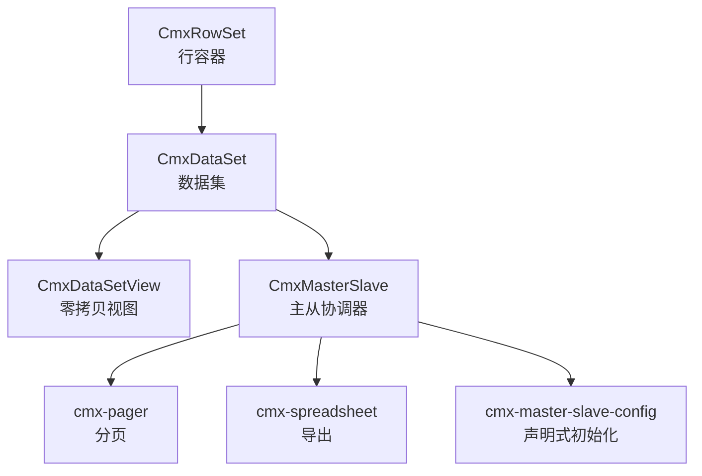
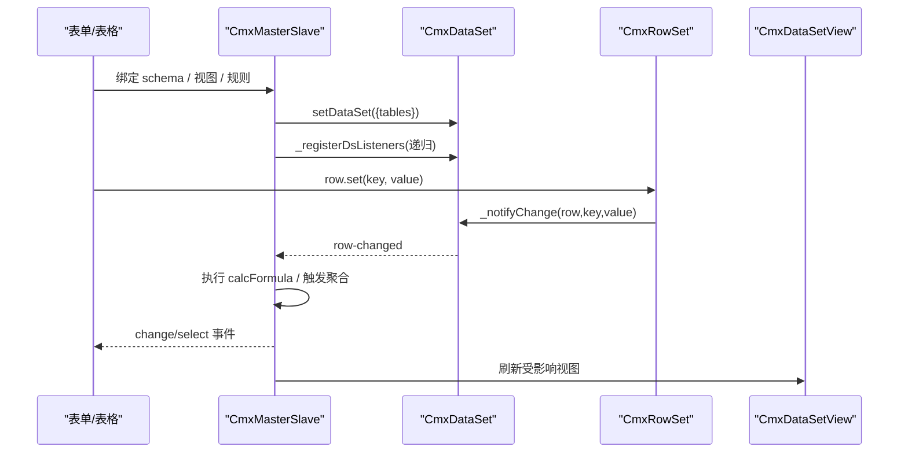
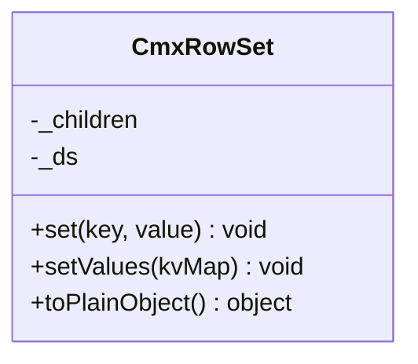
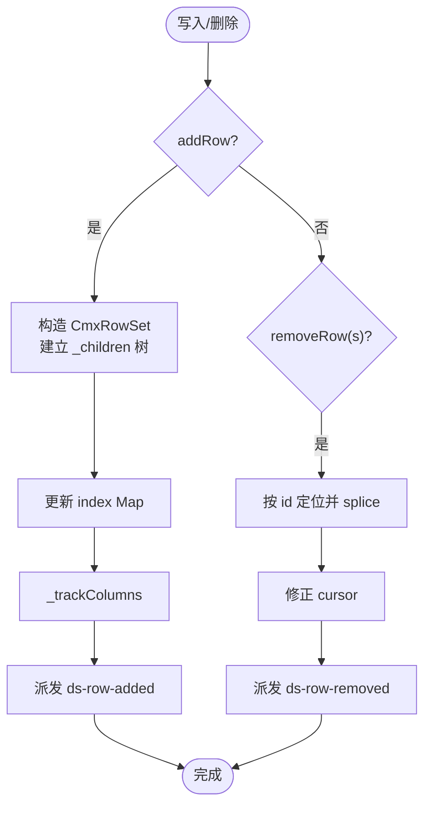
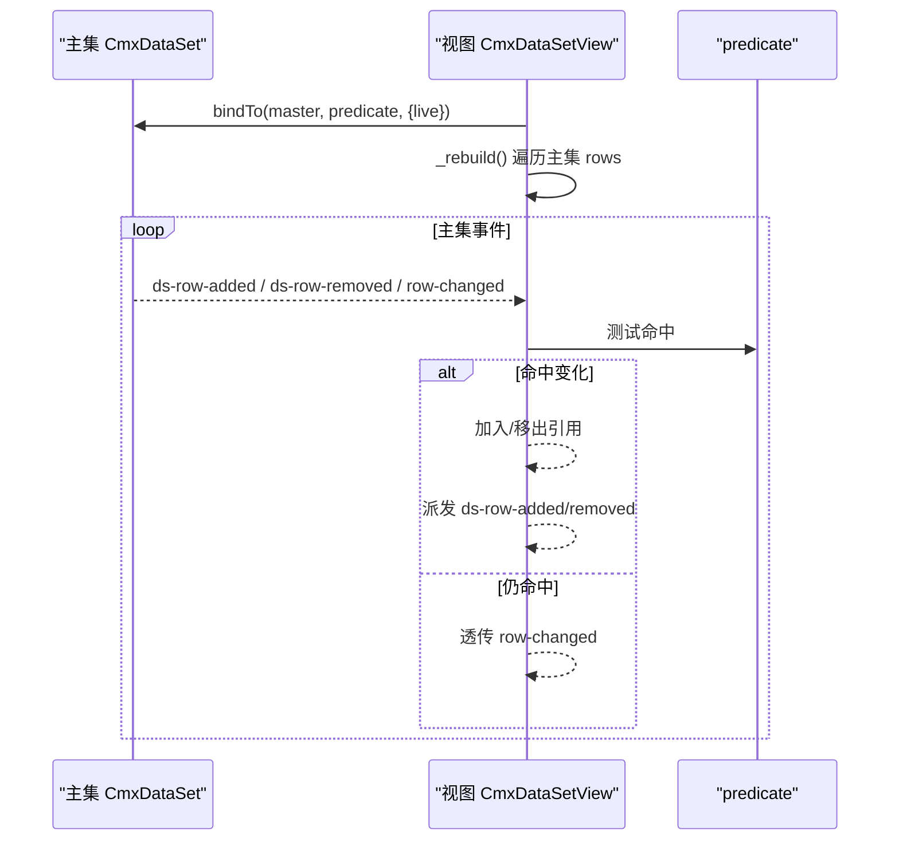
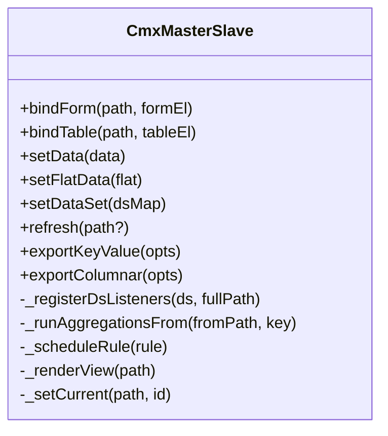
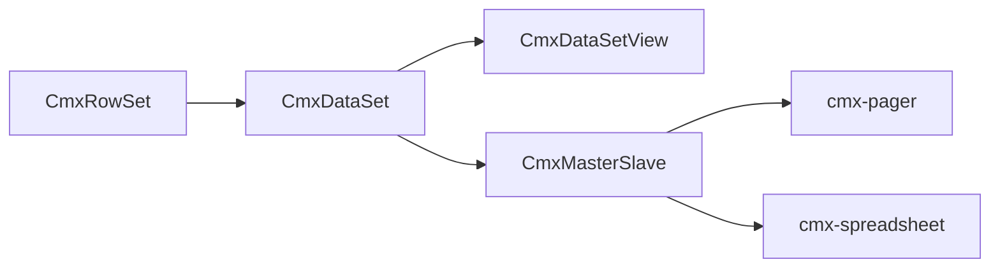

# 本地数据源

<cite>
**本文引用的文件**
- [cmx-data-set.js](file://packages/cmx-data-comp/src/lib/cmx-data-set.js)
- [cmx-row-set.js](file://packages/cmx-data-comp/src/lib/cmx-row-set.js)
- [cmx-data-set-view.js](file://packages/cmx-data-comp/src/lib/cmx-data-set-view.js)
- [cmx-master-slave.js](file://packages/cmx-data-comp/src/lib/cmx-master-slave.js)
- [cmx-master-slave-config.js](file://packages/cmx-data-comp/src/components/cmx-master-slave-config.js)
- [cmx-pager.js](file://packages/cmx-data-comp/src/components/cmx-pager.js)
- [cmx-spreadsheet.js](file://packages/cmx-data-comp/src/components/ignite/cmx-spreadsheet.js)
- [cmx-mega-sheet index.html](file://cmx-mega-sheet/demo/index.html)
- [08-列模型-CmxColumnModel.md](file://docs/CMXPortalManager+CMXHTMLDesigner-模型体系文档/08-列模型-CmxColumnModel.md)
- [09-主从协调器-CmxMasterSlave.md](file://docs/CMXPortalManager+CMXHTMLDesigner-模型体系文档/09-主从协调器-CmxMasterSlave.md)
</cite>

## 目录
1. [简介](#简介)
2. [项目结构](#项目结构)
3. [核心组件](#核心组件)
4. [架构总览](#架构总览)
5. [详细组件分析](#详细组件分析)
6. [依赖关系分析](#依赖关系分析)
7. [性能与内存优化](#性能与内存优化)
8. [故障排查指南](#故障排查指南)
9. [结论](#结论)
10. [附录](#附录)

## 简介
本技术文档围绕 CMX 的本地数据源能力，聚焦 CmxDataSet 的核心架构与使用方式，系统阐述行模型、列模型、索引机制、事件系统、增删改查（含批量）、事务与验证、数据绑定（双向绑定、脏检查、性能优化）、数据视图与过滤（虚拟滚动、分页、排序、分组）、导入导出（JSON/CSV/Excel），以及复杂场景（主从关系、父子数据、动态列）的解决方案与最佳实践。

## 项目结构
CMX 前端数据层以“轻量不可变行 + 可观察数据集 + 零拷贝视图 + 主从协调器”的分层组织：
- 行容器：CmxRowSet 提供无 Proxy 的高性能行对象，字段直接作为实例属性存储。
- 数据集：CmxDataSet 维护行数组、id→行的 Map 索引、游标、列提示、序列化与子树挂载。
- 视图：CmxDataSetView 是零拷贝的过滤视图，持有主集行引用，支持 live 同步与声明式条件。
- 协调器：CmxMasterSlave 负责多表主从关系、当前选中级联、聚合计算、视图渲染联动。
- 辅助：分页器 cmx-pager、电子表格导出 cmx-spreadsheet、配置自启动元素 cmx-master-slave-config。

图表来源
- [cmx-row-set.js:10-53](file://packages/cmx-data-comp/src/lib/cmx-row-set.js#L10-L53)
- [cmx-data-set.js:37-416](file://packages/cmx-data-comp/src/lib/cmx-data-set.js#L37-L416)
- [cmx-data-set-view.js:92-248](file://packages/cmx-data-comp/src/lib/cmx-data-set-view.js#L92-L248)
- [cmx-master-slave.js:41-800](file://packages/cmx-data-comp/src/lib/cmx-master-slave.js#L41-L800)

章节来源
- [cmx-data-set.js:37-416](file://packages/cmx-data-comp/src/lib/cmx-data-set.js#L37-L416)
- [cmx-row-set.js:10-53](file://packages/cmx-data-comp/src/lib/cmx-row-set.js#L10-L53)
- [cmx-data-set-view.js:92-248](file://packages/cmx-data-comp/src/lib/cmx-data-set-view.js#L92-L248)
- [cmx-master-slave.js:41-800](file://packages/cmx-data-comp/src/lib/cmx-master-slave.js#L41-L800)

## 核心组件
- CmxRowSet：行容器，字段直接赋值，修改通过 set/setValues 统一入口并向上通知所属数据集。
- CmxDataSet：多级数据集，维护 rows、index、cursor、columnKeys、total；提供 addRow/setRows/removeRow/getRow/moveToId 等 API；支持 JSON/列式序列化与反序列化；支持 createView/fillView 创建零拷贝视图。
- CmxDataSetView：基于 predicate 的过滤视图，零拷贝持有主集行引用；live 模式下订阅主集事件自动重过滤；写操作委托主集。
- CmxMasterSlave：主从协调器，注册 schema/aggregations/relation/columnModels/dataSources；管理 currentIds 级联；监听 row-changed/cursor-changed 驱动聚合与视图刷新；提供 setData/setFlatData/setDataSet 等多形态装载。

章节来源
- [cmx-row-set.js:10-53](file://packages/cmx-data-comp/src/lib/cmx-row-set.js#L10-L53)
- [cmx-data-set.js:37-416](file://packages/cmx-data-comp/src/lib/cmx-data-set.js#L37-L416)
- [cmx-data-set-view.js:92-248](file://packages/cmx-data-comp/src/lib/cmx-data-set-view.js#L92-L248)
- [cmx-master-slave.js:41-800](file://packages/cmx-data-comp/src/lib/cmx-master-slave.js#L41-L800)

## 架构总览
下图展示数据从加载到视图渲染、再到变更回写的整体流程，包括主从协调、事件冒泡、聚合计算与视图刷新。

图表来源
- [cmx-master-slave.js:317-417](file://packages/cmx-data-comp/src/lib/cmx-master-slave.js#L317-L417)
- [cmx-data-set.js:203-207](file://packages/cmx-data-comp/src/lib/cmx-data-set.js#L203-L207)
- [cmx-row-set.js:30-43](file://packages/cmx-data-comp/src/lib/cmx-row-set.js#L30-L43)

## 详细组件分析

### CmxRowSet 行模型
- 设计要点：无 Proxy，字段即属性，V8 可完整优化；_children 挂子数据集形成树；set/setValues 统一入口，避免遗漏通知。
- 复杂度：set 为 O(1)，toPlainObject 为 O(k)（k 为字段数）。
- 错误处理：未设置 _ds 时不派发事件，避免孤儿行。

图表来源
- [cmx-row-set.js:10-53](file://packages/cmx-data-comp/src/lib/cmx-row-set.js#L10-L53)

章节来源
- [cmx-row-set.js:10-53](file://packages/cmx-data-comp/src/lib/cmx-row-set.js#L10-L53)

### CmxDataSet 数据集与索引
- 数据结构：rows[] 存储行；index Map<string, CmxRowSet> 实现 O(1) 查找；columns 记录列提示；cursor 维护当前行；total 用于分页。
- 写入路径：addRow/setRows 构建行与子树，更新 index 与 columns，派发 ds-row-added；removeRow/removeRows 维护 cursor 与 index，派发 ds-row-removed。
- 读取与导航：getRow/moveToId/moveFirst/moveLast/moveNext/movePrev；currentRow/isFirst/isLast/hasCursor。
- 事件：row-changed（由行修改触发）、ds-row-added/ds-row-removed、cursor-changed。
- 序列化：toJSON/exportKeyValue/exportColumnar/fromJSON 支持嵌套 childRows 与 total 透传。

图表来源
- [cmx-data-set.js:82-148](file://packages/cmx-data-comp/src/lib/cmx-data-set.js#L82-L148)
- [cmx-data-set.js:150-193](file://packages/cmx-data-comp/src/lib/cmx-data-set.js#L150-L193)

章节来源
- [cmx-data-set.js:37-416](file://packages/cmx-data-comp/src/lib/cmx-data-set.js#L37-L416)

### CmxDataSetView 零拷贝视图与过滤
- 零拷贝：视图 rows 仅保存主集 CmxRowSet 引用，内存开销近似指针数量。
- 过滤：buildPredicate 支持函数或声明式条件（eq/ne/gt/ge/lt/le/in/nin/contains/startsWith/endsWith/between/empty/notEmpty/expr）。
- Live 同步：订阅主集的 ds-row-added/ds-row-removed/row-changed，根据命中变化加入/移出/透传 row-changed。
- 写操作委托：addRow/removeRow 委托主集，保证数据所有权唯一。

图表来源
- [cmx-data-set-view.js:31-77](file://packages/cmx-data-comp/src/lib/cmx-data-set-view.js#L31-L77)
- [cmx-data-set-view.js:120-201](file://packages/cmx-data-comp/src/lib/cmx-data-set-view.js#L120-L201)

章节来源
- [cmx-data-set-view.js:92-248](file://packages/cmx-data-comp/src/lib/cmx-data-set-view.js#L92-L248)

### CmxMasterSlave 主从协调器
- 职责：维护 schema 路径树、当前选中（currentIds）、聚合规则、视图绑定与刷新、数据装载（setData/setFlatData/setDataSet）。
- 事件流：监听各层 CmxDataSet 的 row-changed/cursor-changed/ds-row-added/ds-row-removed，执行 calcFormula 与聚合，派发 change/select。
- 视图联动：_renderView 在 ds 引用切换时调用 view.setDataSet；_primeCursors 在装载后自上而下 moveFirst 点亮子视图。
- 聚合：内置 sum/avg/min/max/count，支持 scope 与上下文限定；按 from-path 反向索引快速命中。

图表来源
- [cmx-master-slave.js:41-800](file://packages/cmx-data-comp/src/lib/cmx-master-slave.js#L41-L800)

章节来源
- [cmx-master-slave.js:41-800](file://packages/cmx-data-comp/src/lib/cmx-master-slave.js#L41-L800)
- [09-主从协调器-CmxMasterSlave.md:1-318](file://docs/CMXPortalManager+CMXHTMLDesigner-模型体系文档/09-主从协调器-CmxMasterSlave.md#L1-L318)

### 数据绑定与双向绑定
- 表单/表格绑定：通过 ms.bindForm/bindTable 将 DOM 组件与 schema path 关联；组件内部通过 setDataSet 接收 CmxDataSet。
- 双向更新：用户编辑 → 组件派发 cell/form 变更 → 协调器监听 → 行 set → 数据集 row-changed → 聚合/公式 → 回写目标字段 → 视图刷新。
- 脏检查与批刷：协调器对受影响视图进行微任务去重刷新，减少重复渲染。

章节来源
- [cmx-master-slave.js:117-139](file://packages/cmx-data-comp/src/lib/cmx-master-slave.js#L117-L139)
- [cmx-master-slave.js:357-417](file://packages/cmx-data-comp/src/lib/cmx-master-slave.js#L357-L417)
- [cmx-master-slave.js:772-798](file://packages/cmx-data-comp/src/lib/cmx-master-slave.js#L772-L798)

### 数据视图与过滤（虚拟滚动、分页、排序、分组）
- 虚拟滚动：视图零拷贝特性天然适配虚拟滚动，只维护命中行引用，降低内存占用。
- 分页：cmx-pager 提供 page/pageSize/total 状态与 gotoPage/nextPage/prevPage/lastPage 命令；可与协调器协作模式联动。
- 排序/分组：通常由上层表格组件（如 Revo Grid）实现；CmxDataSetView 提供稳定 rows 序列供其排序/分组。

章节来源
- [cmx-data-set-view.js:92-248](file://packages/cmx-data-comp/src/lib/cmx-data-set-view.js#L92-L248)
- [cmx-pager.js:194-264](file://packages/cmx-data-comp/src/components/cmx-pager.js#L194-L264)

### 导入与导出（JSON/CSV/Excel）
- JSON：CmxDataSet.toJSON/exportKeyValue/exportColumnar/fromJSON 支持嵌套 childRows 与 total；协调器可批量导出所有根数据集。
- CSV：可通过 exportColumnar 输出列元数据与值数组，自行拼接 CSV。
- Excel：cmx-spreadsheet 提供 xlsx 导出；cmx-mega-sheet demo 演示 xlsx/json 导入导出。

章节来源
- [cmx-data-set.js:307-410](file://packages/cmx-data-comp/src/lib/cmx-data-set.js#L307-L410)
- [cmx-master-slave.js:466-491](file://packages/cmx-data-comp/src/lib/cmx-master-slave.js#L466-L491)
- [cmx-spreadsheet.js:400-430](file://packages/cmx-data-comp/src/components/ignite/cmx-spreadsheet.js#L400-L430)
- [cmx-mega-sheet index.html:234-250](file://cmx-mega-sheet/demo/index.html#L234-L250)

### 复杂数据场景方案
- 主从关系：通过 schema 定义层级，ms.setDataSet 注入 CmxDataSet 树；_registerDsListeners 递归注册监听；_primeCursors 自动点亮子视图。
- 父子数据：行._children 挂子数据集；fromJSON 支持 childRows 递归还原。
- 动态列：CmxColumnModel 支持运行时成员替换（FlexibleCombination），配合 grid.setColumnModel 刷新列。

章节来源
- [cmx-master-slave.js:317-417](file://packages/cmx-data-comp/src/lib/cmx-master-slave.js#L317-L417)
- [cmx-data-set.js:372-410](file://packages/cmx-data-comp/src/lib/cmx-data-set.js#L372-L410)
- [08-列模型-CmxColumnModel.md:156-183](file://docs/CMXPortalManager+CMXHTMLDesigner-模型体系文档/08-列模型-CmxColumnModel.md#L156-L183)

## 依赖关系分析
- CmxDataSet 依赖 CmxRowSet；CmxDataSetView 继承 CmxDataSet 并通过延迟注册避免循环依赖。
- CmxMasterSlave 依赖 CmxDataSet 与列模型，负责事件编排与聚合调度。
- 组件层（grid/form/pager/spreadsheet）通过协调器与数据集交互。

图表来源
- [cmx-data-set.js:25-35](file://packages/cmx-data-comp/src/lib/cmx-data-set.js#L25-L35)
- [cmx-data-set-view.js:28-35](file://packages/cmx-data-comp/src/lib/cmx-data-set-view.js#L28-L35)
- [cmx-master-slave.js:1-2](file://packages/cmx-data-comp/src/lib/cmx-master-slave.js#L1-L2)

章节来源
- [cmx-data-set.js:25-35](file://packages/cmx-data-comp/src/lib/cmx-data-set.js#L25-L35)
- [cmx-data-set-view.js:28-35](file://packages/cmx-data-comp/src/lib/cmx-data-set-view.js#L28-L35)
- [cmx-master-slave.js:1-2](file://packages/cmx-data-comp/src/lib/cmx-master-slave.js#L1-L2)

## 性能与内存优化
- 行模型无 Proxy：CmxRowSet 字段直接作为属性，利于 V8 优化。
- 零拷贝视图：CmxDataSetView 仅存引用，内存与字段宽度无关。
- 批量装载快路径：fromJSON 使用固定列顺序预分配对象，避免慢形态字典；实测大规模数据显著提速。
- 微任务批刷：协调器对受影响视图进行去重刷新，减少重复渲染。
- 建议：
  - 大数据量优先使用 CmxDataSetView 做过滤/分页。
  - 使用 setRows/fromJSON 批量装载，避免逐行事件风暴。
  - 合理拆分 schema，减少跨层级聚合范围。
  - 及时 dispose/destroy 释放监听与引用，防止泄漏。

章节来源
- [cmx-row-set.js:10-53](file://packages/cmx-data-comp/src/lib/cmx-row-set.js#L10-L53)
- [cmx-data-set-view.js:92-248](file://packages/cmx-data-comp/src/lib/cmx-data-set-view.js#L92-L248)
- [cmx-data-set.js:372-410](file://packages/cmx-data-comp/src/lib/cmx-data-set.js#L372-L410)
- [cmx-master-slave.js:772-798](file://packages/cmx-data-comp/src/lib/cmx-master-slave.js#L772-L798)

## 故障排查指南
- 视图未刷新：确认 createView 已 import 对应模块以注册视图类；检查 live 模式是否开启；必要时调用 refilter/resetCursor。
- 主从不同步：检查 schema 路径是否正确；确认 setDataSet 后调用了 _primeCursors（内部已自动处理）；核对 relations 外键映射。
- 聚合不生效：确认 aggregations 的 from/to/toField 正确；检查 field 与 agg 类型；查看 _aggsByFrom 是否命中。
- 内存泄漏：确保 SPA 销毁时调用 view.dispose()/ms.destroy()，解绑所有事件监听。
- 导入导出异常：确认 JSON 结构包含 datasetId/columns/rows；childRows 的父 id 类型需一致（字符串化匹配）。

章节来源
- [cmx-data-set.js:225-231](file://packages/cmx-data-comp/src/lib/cmx-data-set.js#L225-L231)
- [cmx-data-set-view.js:120-141](file://packages/cmx-data-comp/src/lib/cmx-data-set-view.js#L120-L141)
- [cmx-master-slave.js:145-167](file://packages/cmx-data-comp/src/lib/cmx-master-slave.js#L145-L167)
- [cmx-master-slave.js:206-224](file://packages/cmx-data-comp/src/lib/cmx-master-slave.js#L206-L224)
- [cmx-data-set.js:372-410](file://packages/cmx-data-comp/src/lib/cmx-data-set.js#L372-L410)

## 结论
CMX 本地数据源以 CmxRowSet/CmxDataSet/CmxDataSetView/CmxMasterSlave 为核心，构建了高性能、可扩展、易用的数据模型与视图体系。通过零拷贝视图、事件驱动的变更传播、声明式过滤与主从协调，能够高效支撑复杂业务场景下的增删改查、聚合计算、分页与导入导出需求。遵循本文的性能与内存优化建议，可在大规模数据下保持流畅体验。

## 附录
- 列模型参考：CmxColumnModel 定义了列模板、显示/编辑模式、计算公式与校验规则，支持运行时动态组合。
- 主从协调器参考：CmxMasterSlave 的 schema/aggregations/relations 配置与事件语义，详见文档。

章节来源
- [08-列模型-CmxColumnModel.md:1-249](file://docs/CMXPortalManager+CMXHTMLDesigner-模型体系文档/08-列模型-CmxColumnModel.md#L1-L249)
- [09-主从协调器-CmxMasterSlave.md:1-318](file://docs/CMXPortalManager+CMXHTMLDesigner-模型体系文档/09-主从协调器-CmxMasterSlave.md#L1-L318)