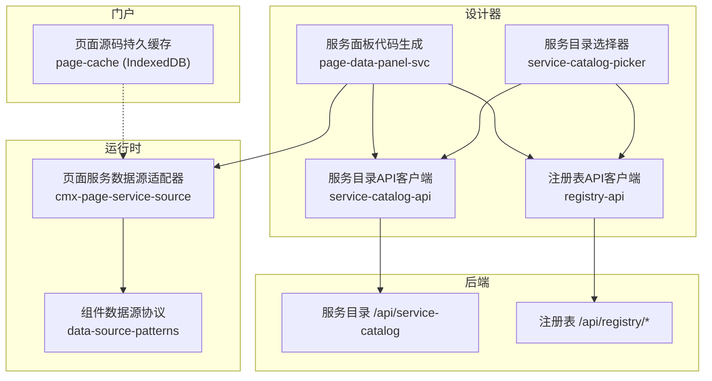
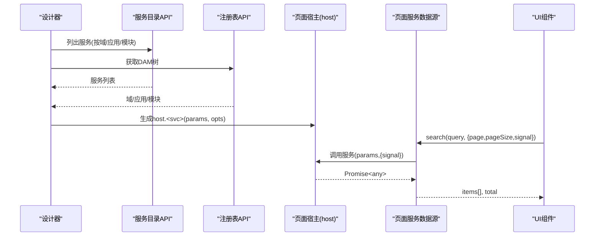
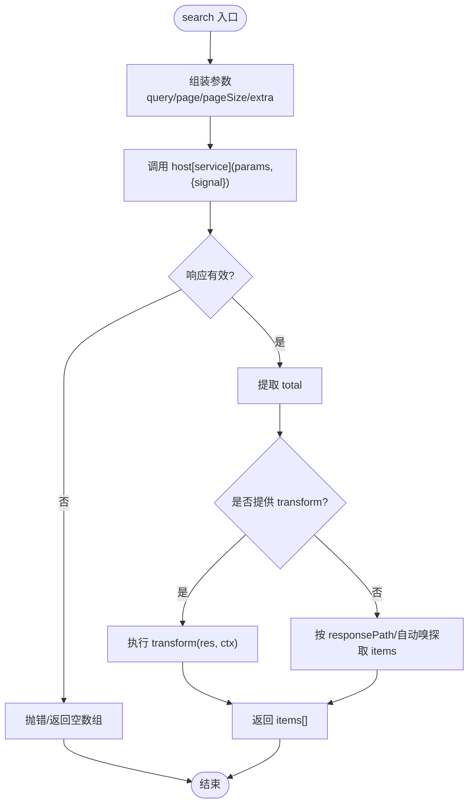
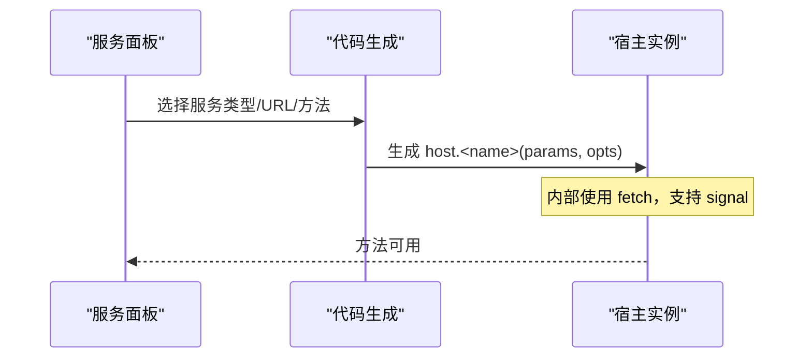
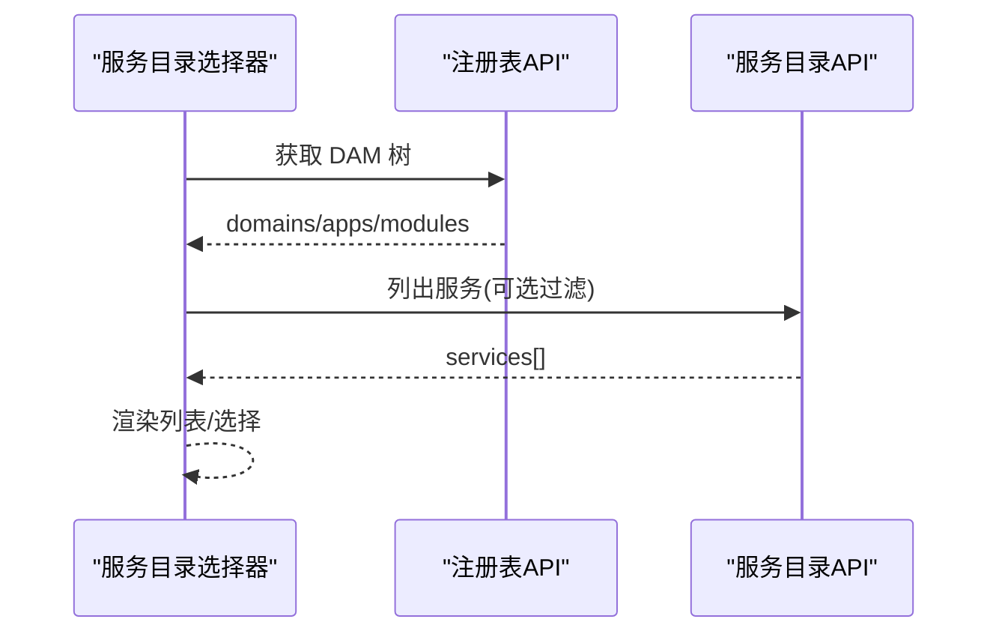
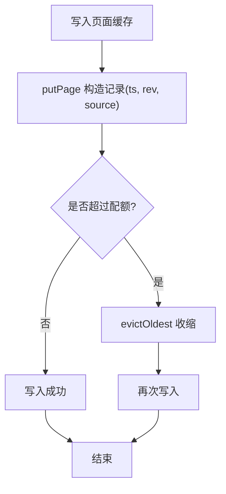
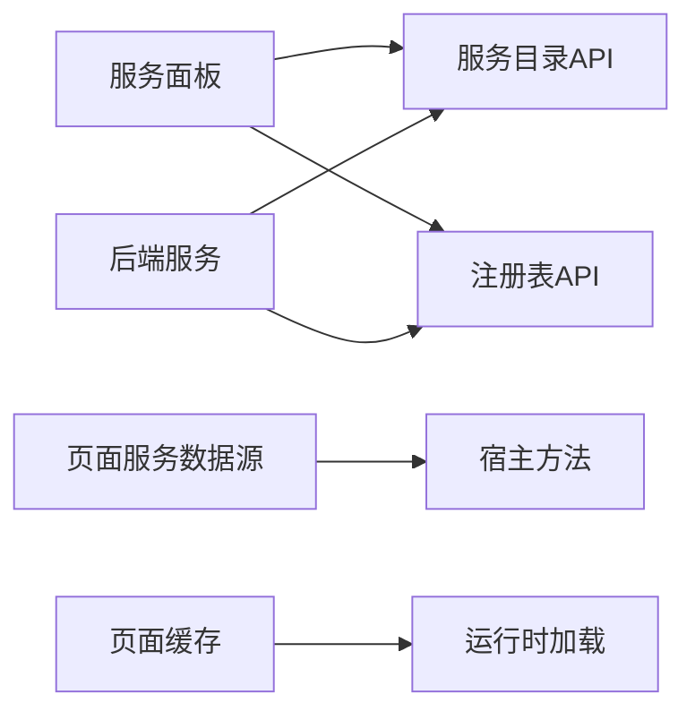

# 页面服务数据源

<cite>
**本文引用的文件**
- [packages/cmx-data-comp/src/lib/cmx-page-service-source.js](file://packages/cmx-data-comp/src/lib/cmx-page-service-source.js)
- [CMXHTMLDesigner/src/components/designer-page-data/page-data-panel-svc.js](file://CMXHTMLDesigner/src/components/designer-page-data/page-data-panel-svc.js)
- [CMXHTMLDesigner/src/api/service-catalog-api.js](file://CMXHTMLDesigner/src/api/service-catalog-api.js)
- [CMXHTMLDesigner/src/api/registry-api.js](file://CMXHTMLDesigner/src/api/registry-api.js)
- [CMXHTMLDesigner/src/components/designer-page-data/service-catalog-picker.js](file://CMXHTMLDesigner/src/components/designer-page-data/service-catalog-picker.js)
- [CMXPortalManager/src/lib/page-cache.js](file://CMXPortalManager/src/lib/page-cache.js)
- [.agents/skills/cmx-components-guide/references/data-source-patterns.md](file://.agents/skills/cmx-components-guide/references/data-source-patterns.md)
- [documents/20260822_cmx-后端_三类服务通信配置关系总结.md](file://documents/20260822_cmx-后端_三类服务通信配置关系总结.md)
</cite>

## 目录
1. [简介](#简介)
2. [项目结构](#项目结构)
3. [核心组件](#核心组件)
4. [架构总览](#架构总览)
5. [详细组件分析](#详细组件分析)
6. [依赖关系分析](#依赖关系分析)
7. [性能考量](#性能考量)
8. [故障排查指南](#故障排查指南)
9. [结论](#结论)
10. [附录](#附录)

## 简介
本技术文档围绕“页面服务数据源”展开，聚焦于 CMX 平台中页面级自定义服务的抽象设计、注册与发现机制、异步数据流处理、缓存策略以及服务组合编排。内容基于仓库中的前端实现与相关设计文档，面向开发者提供从接口契约到运行时的完整说明，并给出调试与排错建议。

## 项目结构
页面服务数据源涉及的设计器侧、运行时数据源适配层、持久化缓存与后端服务目录/注册表 API 协同工作：
- 设计器侧通过服务目录选择器与服务注册表 API 完成服务发现与元数据装配。
- 运行时将“自定义服务”包装为标准 DataSource，供表格、表单等组件消费。
- Portal 侧提供页面源码的 IndexedDB 持久缓存，提升加载性能与容错能力。
- 后端服务通信（gRPC/HTTP）与服务发现由配置与注册中心基础设施支撑。

图表来源
- [CMXHTMLDesigner/src/components/designer-page-data/service-catalog-picker.js:1-237](file://CMXHTMLDesigner/src/components/designer-page-data/service-catalog-picker.js#L1-L237)
- [CMXHTMLDesigner/src/components/designer-page-data/page-data-panel-svc.js:412-549](file://CMXHTMLDesigner/src/components/designer-page-data/page-data-panel-svc.js#L412-L549)
- [CMXHTMLDesigner/src/api/service-catalog-api.js:1-46](file://CMXHTMLDesigner/src/api/service-catalog-api.js#L1-L46)
- [CMXHTMLDesigner/src/api/registry-api.js:1-51](file://CMXHTMLDesigner/src/api/registry-api.js#L1-L51)
- [packages/cmx-data-comp/src/lib/cmx-page-service-source.js:1-200](file://packages/cmx-data-comp/src/lib/cmx-page-service-source.js#L1-L200)
- [CMXPortalManager/src/lib/page-cache.js:1-312](file://CMXPortalManager/src/lib/page-cache.js#L1-L312)

章节来源
- [CMXHTMLDesigner/src/components/designer-page-data/service-catalog-picker.js:1-237](file://CMXHTMLDesigner/src/components/designer-page-data/service-catalog-picker.js#L1-L237)
- [CMXHTMLDesigner/src/components/designer-page-data/page-data-panel-svc.js:412-549](file://CMXHTMLDesigner/src/components/designer-page-data/page-data-panel-svc.js#L412-L549)
- [CMXHTMLDesigner/src/api/service-catalog-api.js:1-46](file://CMXHTMLDesigner/src/api/service-catalog-api.js#L1-L46)
- [CMXHTMLDesigner/src/api/registry-api.js:1-51](file://CMXHTMLDesigner/src/api/registry-api.js#L1-L51)
- [packages/cmx-data-comp/src/lib/cmx-page-service-source.js:1-200](file://packages/cmx-data-comp/src/lib/cmx-page-service-source.js#L1-L200)
- [CMXPortalManager/src/lib/page-cache.js:1-312](file://CMXPortalManager/src/lib/page-cache.js#L1-L312)

## 核心组件
- 页面服务数据源适配器：将设计期生成的 host.<serviceName>(params, opts) 包装为统一 DataSource 接口，负责参数装配、响应取值、分页元信息提取与本地转换。
- 设计器服务面板：根据服务类型（REST/JSON-RPC/GraphQL）生成调用模板，支持 AbortSignal 透传、请求头与查询串拼装。
- 服务目录选择器：拉取 DAM 树与服务目录，按域/应用/模块过滤，选择后注入 pageServices。
- 页面源码持久缓存：使用 IndexedDB 存储页面源码与版本锚点，LRU 淘汰与配额保护，启动时尝试持久化存储。
- 数据源模式参考：定义标准 DataSource 协议、缓存与防抖、中断机制及常见陷阱。

章节来源
- [packages/cmx-data-comp/src/lib/cmx-page-service-source.js:1-200](file://packages/cmx-data-comp/src/lib/cmx-page-service-source.js#L1-L200)
- [CMXHTMLDesigner/src/components/designer-page-data/page-data-panel-svc.js:412-549](file://CMXHTMLDesigner/src/components/designer-page-data/page-data-panel-svc.js#L412-L549)
- [CMXHTMLDesigner/src/components/designer-page-data/service-catalog-picker.js:1-237](file://CMXHTMLDesigner/src/components/designer-page-data/service-catalog-picker.js#L1-L237)
- [CMXPortalManager/src/lib/page-cache.js:1-312](file://CMXPortalManager/src/lib/page-cache.js#L1-L312)
- [.agents/skills/cmx-components-guide/references/data-source-patterns.md:130-245](file://.agents/skills/cmx-components-guide/references/data-source-patterns.md#L130-L245)

## 架构总览
页面服务数据源的端到端流程如下：
- 设计期：通过服务目录与注册表获取服务元数据，生成 host 上的服务函数（REST/JSON-RPC/GraphQL）。
- 运行期：以 createPageServiceDataSource 将 host 方法封装为 DataSource，供 UI 组件调用 search/loadByKeys。
- 网络层：fetch 发起请求，支持 AbortSignal 取消；错误在 fetch 与 JSON 解析阶段抛出。
- 缓存层：页面源码走 IndexedDB 持久缓存；数据源层可结合上层组件的 LRU/防抖/中断缓存。

图表来源
- [CMXHTMLDesigner/src/api/service-catalog-api.js:1-46](file://CMXHTMLDesigner/src/api/service-catalog-api.js#L1-L46)
- [CMXHTMLDesigner/src/api/registry-api.js:1-51](file://CMXHTMLDesigner/src/api/registry-api.js#L1-L51)
- [CMXHTMLDesigner/src/components/designer-page-data/page-data-panel-svc.js:412-549](file://CMXHTMLDesigner/src/components/designer-page-data/page-data-panel-svc.js#L412-L549)
- [packages/cmx-data-comp/src/lib/cmx-page-service-source.js:1-200](file://packages/cmx-data-comp/src/lib/cmx-page-service-source.js#L1-L200)

## 详细组件分析

### 页面服务数据源适配器（createPageServiceDataSource）
- 职责
  - 将 host 上由设计器生成的服务函数包装为标准 DataSource。
  - 统一参数装配：搜索文本、分页、键值批量查询、额外参数。
  - 响应解析：支持 responsePath、totalPath、transform 三种方式提取数据与总数。
  - 透传 AbortSignal：当服务模板支持时，可取消请求。
- 关键行为
  - search：组装 params，调用 host[service]，记录 _lastMeta（total/page/pageSize），返回 items。
  - loadByKeys：组装 keys 参数，调用服务，返回 items。
  - 自动嗅探：未指定 responsePath 时，自动查找 res.items/res.data/items/rows 等数组。
  - total 提取：优先函数/路径，否则尝试 res.total/totalCount/data.total/data.totalCount。
- 复杂度
  - 参数装配与响应解析均为 O(1)~O(n)（n 为结果集大小），整体开销低。
- 错误处理
  - 若 host 方法不存在则抛错；服务返回非数组或空对象时回退为空数组。
- 优化点
  - 对 transform 进行本地二次处理，减少服务端压力。
  - 合理设置 pageSize/debounceMs/cacheSize 平衡体验与带宽。

图表来源
- [packages/cmx-data-comp/src/lib/cmx-page-service-source.js:53-126](file://packages/cmx-data-comp/src/lib/cmx-page-service-source.js#L53-L126)
- [packages/cmx-data-comp/src/lib/cmx-page-service-source.js:128-199](file://packages/cmx-data-comp/src/lib/cmx-page-service-source.js#L128-L199)

章节来源
- [packages/cmx-data-comp/src/lib/cmx-page-service-source.js:1-200](file://packages/cmx-data-comp/src/lib/cmx-page-service-source.js#L1-L200)

### 设计器服务面板（代码生成与模板）
- 职责
  - 根据服务类型生成 host 上的方法：REST、JSON-RPC、GraphQL。
  - 拼接请求头、查询串、请求体；支持 AbortSignal 透传。
  - 错误传播：HTTP 状态码异常与 RPC 错误均抛出。
- 关键点
  - REST：method + url + qs + headers，返回 JSON。
  - JSON-RPC：构造 jsonrpc 2.0 请求体，返回 result。
  - GraphQL：构造 query/variables，返回 data。
- 与数据源的关系
  - 生成的 host 方法被 createPageServiceDataSource 调用，形成 DataSource 的 search/loadByKeys。

图表来源
- [CMXHTMLDesigner/src/components/designer-page-data/page-data-panel-svc.js:412-549](file://CMXHTMLDesigner/src/components/designer-page-data/page-data-panel-svc.js#L412-L549)

章节来源
- [CMXHTMLDesigner/src/components/designer-page-data/page-data-panel-svc.js:412-549](file://CMXHTMLDesigner/src/components/designer-page-data/page-data-panel-svc.js#L412-L549)

### 服务目录选择器与注册表
- 服务目录选择器
  - 首次打开加载 DAM 树与服务目录，缓存全部服务并按范围过滤。
  - 选择服务后派发事件，供设计器注入 pageServices。
- 注册表 API
  - 提供 domain/app/module 三级枚举，用于构建 DAM 树与筛选服务。
- 服务目录 API
  - 列出服务条目（含 URL、方法、headers、bodyTemplate、参数描述等），支持按域/应用/模块过滤。

图表来源
- [CMXHTMLDesigner/src/components/designer-page-data/service-catalog-picker.js:1-237](file://CMXHTMLDesigner/src/components/designer-page-data/service-catalog-picker.js#L1-L237)
- [CMXHTMLDesigner/src/api/registry-api.js:1-51](file://CMXHTMLDesigner/src/api/registry-api.js#L1-L51)
- [CMXHTMLDesigner/src/api/service-catalog-api.js:1-46](file://CMXHTMLDesigner/src/api/service-catalog-api.js#L1-L46)

章节来源
- [CMXHTMLDesigner/src/components/designer-page-data/service-catalog-picker.js:1-237](file://CMXHTMLDesigner/src/components/designer-page-data/service-catalog-picker.js#L1-L237)
- [CMXHTMLDesigner/src/api/registry-api.js:1-51](file://CMXHTMLDesigner/src/api/registry-api.js#L1-L51)
- [CMXHTMLDesigner/src/api/service-catalog-api.js:1-46](file://CMXHTMLDesigner/src/api/service-catalog-api.js#L1-L46)

### 页面源码持久缓存（IndexedDB）
- 目标
  - 缓存页面源码与版本锚点（rev），命中时跳过 body 传输，提升加载性能。
- 特性
  - LRU 上限（默认 500），写后按 ts 淘汰最旧条目。
  - 配额保护：捕获 QuotaExceededError，主动收缩后再重试写入。
  - 持久化存储：启动时尝试 navigator.storage.persist() 避免低压淘汰。
  - 批量读写：getPages/putPages 减少事务往返。
- 适用场景
  - HTML 页面与原生页面的源码缓存，配合差异同步与 enrich 注入上下文。

图表来源
- [CMXPortalManager/src/lib/page-cache.js:135-180](file://CMXPortalManager/src/lib/page-cache.js#L135-L180)
- [CMXPortalManager/src/lib/page-cache.js:206-267](file://CMXPortalManager/src/lib/page-cache.js#L206-L267)
- [CMXPortalManager/src/lib/page-cache.js:280-311](file://CMXPortalManager/src/lib/page-cache.js#L280-L311)

章节来源
- [CMXPortalManager/src/lib/page-cache.js:1-312](file://CMXPortalManager/src/lib/page-cache.js#L1-L312)

### 数据源模式与工具
- 标准 DataSource 协议
  - id/keyField/labelField/search/query/loadByKeys/debounceMs/pageSize/cacheSize。
- 缓存与中断
  - searchAsync/lookupByKeyAsync 提供 LRU 查询缓存、按键缓存、防抖与 AbortController。
- 常见陷阱
  - 必须透传 opts.signal；loadByKeys 需足够 pageSize；内存数据源应设置 items。

章节来源
- [.agents/skills/cmx-components-guide/references/data-source-patterns.md:130-245](file://.agents/skills/cmx-components-guide/references/data-source-patterns.md#L130-L245)

## 依赖关系分析
- 组件耦合
  - 服务面板依赖服务目录与注册表 API；运行时数据源依赖宿主方法；Portal 缓存独立于数据源但影响页面加载链路。
- 外部依赖
  - 后端服务目录与注册表；浏览器 API（fetch、indexedDB、navigator.storage）。
- 潜在循环
  - 当前实现无直接循环依赖；数据源仅单向依赖宿主方法与组件协议。
- 服务发现与通信
  - 后端 gRPC/HTTP 通信与服务发现由配置与注册中心基础设施支撑，静态 HTTP 可独立于注册中心使用。

图表来源
- [CMXHTMLDesigner/src/components/designer-page-data/page-data-panel-svc.js:412-549](file://CMXHTMLDesigner/src/components/designer-page-data/page-data-panel-svc.js#L412-L549)
- [CMXHTMLDesigner/src/api/service-catalog-api.js:1-46](file://CMXHTMLDesigner/src/api/service-catalog-api.js#L1-L46)
- [CMXHTMLDesigner/src/api/registry-api.js:1-51](file://CMXHTMLDesigner/src/api/registry-api.js#L1-L51)
- [packages/cmx-data-comp/src/lib/cmx-page-service-source.js:1-200](file://packages/cmx-data-comp/src/lib/cmx-page-service-source.js#L1-L200)
- [CMXPortalManager/src/lib/page-cache.js:1-312](file://CMXPortalManager/src/lib/page-cache.js#L1-L312)
- [documents/20260822_cmx-后端_三类服务通信配置关系总结.md:1-54](file://documents/20260822_cmx-后端_三类服务通信配置关系总结.md#L1-L54)

章节来源
- [documents/20260822_cmx-后端_三类服务通信配置关系总结.md:1-54](file://documents/20260822_cmx-后端_三类服务通信配置关系总结.md#L1-L54)

## 性能考量
- 请求去重与中断
  - 透传 AbortSignal，避免快速输入导致的请求堆积；上层组件可复用 AbortController。
- 防抖与分页
  - debounceMs 控制搜索频率；pageSize 控制单次负载，避免大响应拖慢渲染。
- 缓存策略
  - 数据源层：利用组件提供的 LRU 查询缓存与按键缓存。
  - 页面源码层：IndexedDB 持久缓存 + LRU + 配额保护，命中时跳过网络传输。
- 资源占用
  - LRU 上限与配额监控，防止内存与磁盘空间耗尽；必要时主动收缩。

## 故障排查指南
- 常见问题
  - host 方法不存在：检查服务面板是否正确生成 host.<service>。
  - 响应格式不匹配：确认 responsePath/transform 与实际响应结构一致。
  - 取消无效：确保 opts.signal 已透传到服务模板。
  - 缓存失效：检查 rev 是否变化；必要时清空缓存或触发 bust。
- 定位步骤
  - 查看服务目录与注册表返回，确认服务元数据正确。
  - 在服务面板生成的模板中检查请求头、URL、请求体。
  - 在数据源适配器中打印 _lastMeta 与 items 提取结果。
  - 在 Portal 侧检查 IndexedDB 缓存命中情况与配额使用。

章节来源
- [packages/cmx-data-comp/src/lib/cmx-page-service-source.js:53-126](file://packages/cmx-data-comp/src/lib/cmx-page-service-source.js#L53-L126)
- [CMXHTMLDesigner/src/components/designer-page-data/page-data-panel-svc.js:412-549](file://CMXHTMLDesigner/src/components/designer-page-data/page-data-panel-svc.js#L412-L549)
- [CMXPortalManager/src/lib/page-cache.js:135-180](file://CMXPortalManager/src/lib/page-cache.js#L135-L180)

## 结论
页面服务数据源通过“设计期生成 + 运行期适配”的方式，将任意自定义服务标准化为 DataSource，屏蔽了 REST/JSON-RPC/GraphQL 的差异，并提供统一的参数装配、响应解析与分页元信息提取。结合 AbortSignal、防抖、分页与多级缓存，可在复杂业务场景中实现高效、稳定的数据加载。配合后端服务目录与注册表，可实现灵活的服务发现与动态加载。

## 附录
- 开发指南
  - 在设计器中选择服务并生成 host 方法，确保 URL、方法、请求体与响应结构符合预期。
  - 使用 createPageServiceDataSource 创建 DataSource，合理配置 keyField、labelField、responsePath、totalPath、transform、extraParams、pageSize、debounceMs、cacheSize。
  - 在 UI 组件中调用 search/loadByKeys，并传入 opts.signal 以支持取消。
- 调试技巧
  - 在服务目录选择器中验证服务元数据；在页面缓存中查看 rev 与 source 命中情况。
  - 通过控制台日志观察 _lastMeta 与 items 提取结果，定位响应解析问题。
  - 对于快速输入场景，启用防抖与中断，避免请求风暴。