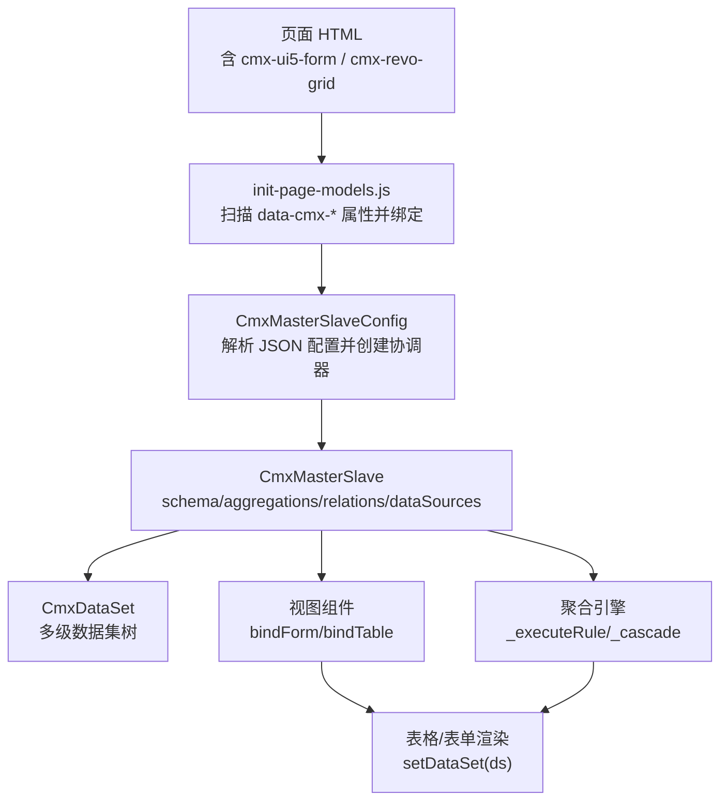
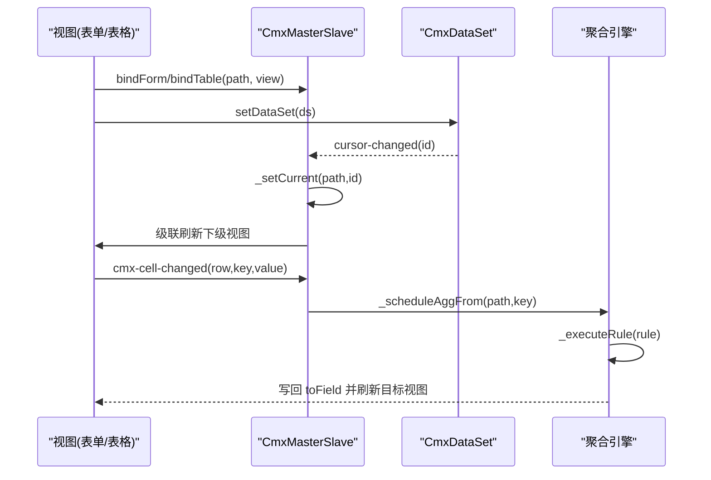
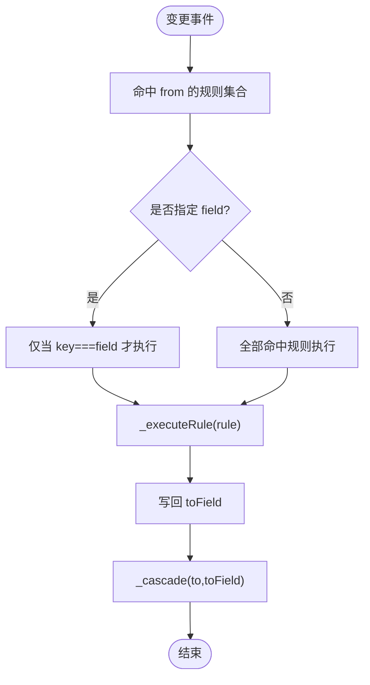
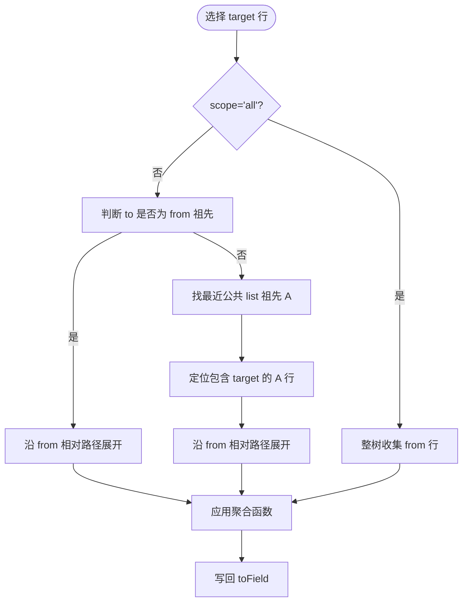
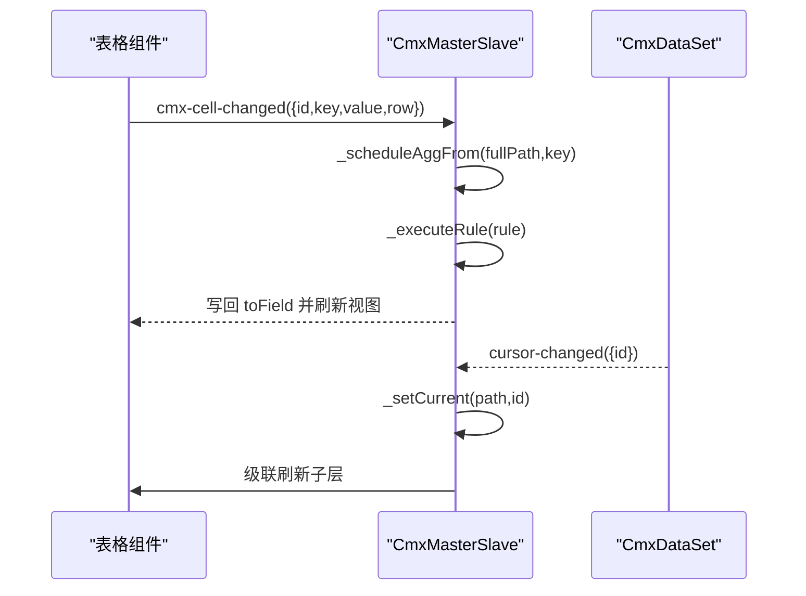
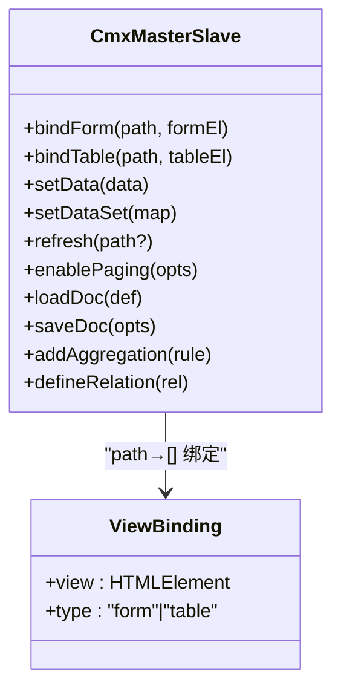
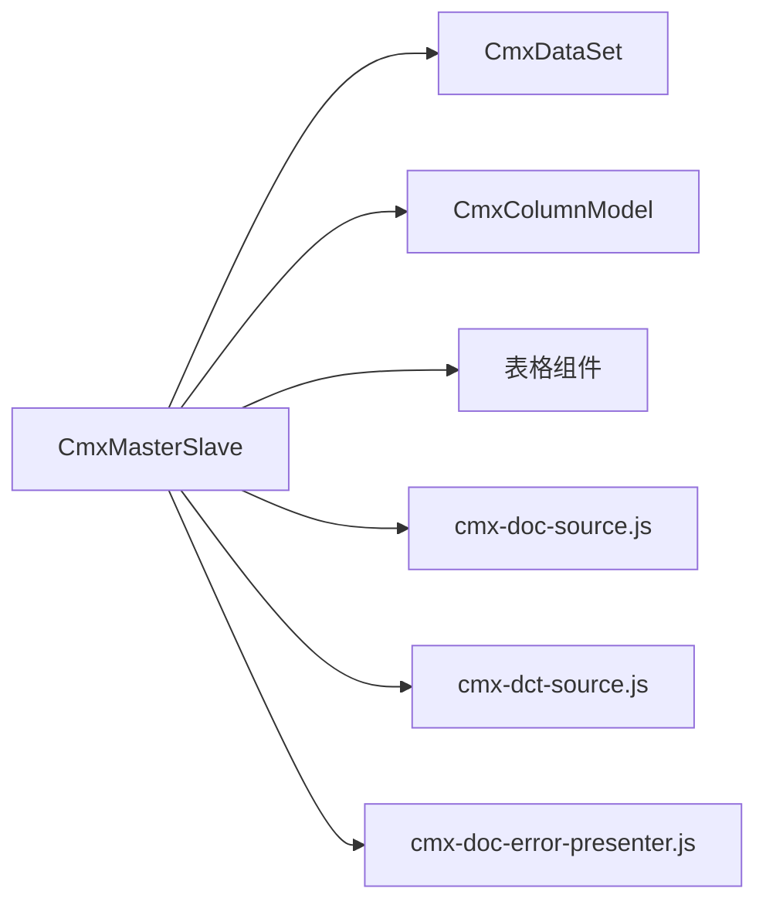

# 主从协调器 (CmxMasterSlave)

<cite>
**本文引用的文件**
- [cmx-master-slave.js](file://packages/cmx-data-comp/src/lib/cmx-master-slave.js)
- [cmx-master-slave-config.js](file://packages/cmx-data-comp/src/components/cmx-master-slave-config.js)
- [init-page-models.js](file://packages/cmx-data-comp/src/lib/init-page-models.js)
- [model-master-slave.md](file://.agents/skills/html-page-generator/references/model-master-slave.md)
- [form-components.md](file://.agents/skills/cmx-components-guide/references/form-components.md)
- [skill-generate-master-slave-page.md](file://packages/cmx-data-comp/docs/skill-generate-master-slave-page.md)
- [cmx-data-set.js](file://packages/cmx-data-comp/src/lib/cmx-data-set.js)
- [ignite-grid.js](file://packages/cmx-data-comp/src/components/ignite/cmx-ignite-grid.js)
</cite>

## 目录
1. [简介](#简介)
2. [项目结构](#项目结构)
3. [核心组件](#核心组件)
4. [架构总览](#架构总览)
5. [详细组件分析](#详细组件分析)
6. [依赖关系分析](#依赖关系分析)
7. [性能考量](#性能考量)
8. [故障排查指南](#故障排查指南)
9. [结论](#结论)
10. [附录：完整配置与使用示例](#附录完整配置与使用示例)

## 简介
本文件面向 CMX 数据组件库中的“主从协调器”——CmxMasterSlave，系统性说明其职责、数据模型、视图绑定、当前选中行管理、级联刷新、聚合规则（from/to 路径解析、聚合函数、scope 控制）、事件处理机制，以及典型配置与最佳实践。目标是让读者在不深入源码的情况下也能正确设计、集成和排障。

## 项目结构
围绕 CmxMasterSlave 的关键文件与角色如下：
- 协调器核心：packages/cmx-data-comp/src/lib/cmx-master-slave.js
- 声明式自启动元素：packages/cmx-data-comp/src/components/cmx-master-slave-config.js
- 页面初始化与 DOM 扫描绑定：packages/cmx-data-comp/src/lib/init-page-models.js
- 文档与参考：.agents/skills/html-page-generator/references/model-master-slave.md、.agents/skills/cmx-components-guide/references/form-components.md
- 数据集与网格事件：packages/cmx-data-comp/src/lib/cmx-data-set.js、packages/cmx-data-comp/src/components/ignite/cmx-ignite-grid.js
- 生成模板与示例：packages/cmx-data-comp/docs/skill-generate-master-slave-page.md

图表来源
- [cmx-master-slave.js:41-85](file://packages/cmx-data-comp/src/lib/cmx-master-slave.js#L41-L85)
- [cmx-master-slave-config.js:50-96](file://packages/cmx-data-comp/src/components/cmx-master-slave-config.js#L50-L96)
- [init-page-models.js:970-1002](file://packages/cmx-data-comp/src/lib/init-page-models.js#L970-L1002)

章节来源
- [cmx-master-slave.js:41-85](file://packages/cmx-data-comp/src/lib/cmx-master-slave.js#L41-L85)
- [cmx-master-slave-config.js:50-96](file://packages/cmx-data-comp/src/components/cmx-master-slave-config.js#L50-L96)
- [init-page-models.js:970-1002](file://packages/cmx-data-comp/src/lib/init-page-models.js#L970-L1002)

## 核心组件
- CmxMasterSlave：多表数据协调器，持有递归主从数据树，维护 path→视图绑定、path→当前选中行、聚合规则索引、关系定义、列模型注册、分页与字典能力等。
- CmxMasterSlaveConfig：声明式自启动 Web Component，解析 JSON 配置，自动创建协调器并按 selector 绑定表单/表格，最后注入初始数据。
- init-page-models：页面初始化时扫描带有 data-cmx-master-slave-id 的组件，按 datasetId/kind 调用 bindForm/bindTable，兼容旧方式直绑 DataSet。
- CmxDataSet：多级数据集容器，每行可挂子数据集形成树；变更通过 row-changed/cursor-changed/ds-row-added/ds-row-removed 事件通知。
- 网格组件（如 cmx-ignite-grid）：在编辑完成时派发 cmx-cell-changed，在增删行时派发 cmx-row-added/cmx-row-removed。

章节来源
- [cmx-master-slave.js:41-85](file://packages/cmx-data-comp/src/lib/cmx-master-slave.js#L41-L85)
- [cmx-master-slave-config.js:50-96](file://packages/cmx-data-comp/src/components/cmx-master-slave-config.js#L50-L96)
- [init-page-models.js:970-1002](file://packages/cmx-data-comp/src/lib/init-page-models.js#L970-L1002)
- [cmx-data-set.js:1-24](file://packages/cmx-data-comp/src/lib/cmx-data-set.js#L1-L24)
- [ignite-grid.js:273-284](file://packages/cmx-data-comp/src/components/ignite/cmx-ignite-grid.js#L273-L284)

## 架构总览
CmxMasterSlave 作为“多表管家”，将 schema 定义的层级结构与运行时数据树对齐，并通过事件驱动实现“选主→刷子”“改值→汇总”“增删→联动”。

图表来源
- [cmx-master-slave.js:117-139](file://packages/cmx-data-comp/src/lib/cmx-master-slave.js#L117-L139)
- [cmx-master-slave.js:357-417](file://packages/cmx-data-comp/src/lib/cmx-master-slave.js#L357-L417)
- [cmx-master-slave.js:705-740](file://packages/cmx-data-comp/src/lib/cmx-master-slave.js#L705-L740)
- [cmx-master-slave.js:755-833](file://packages/cmx-data-comp/src/lib/cmx-master-slave.js#L755-L833)

## 详细组件分析

### CmxMasterSlave 类职责与关键流程
- 递归主从数据树管理
  - setData/setDataSet 接收嵌套或映射数据，标准化为 {tables} 结构，每个根路径对应一个 CmxDataSet。
  - 通过 _registerDsListeners 递归为每个 CmxDataSet 注册 row-changed、cursor-changed、ds-row-added/removed 监听，携带完整 fullPath，避免冒泡推断。
- 视图绑定机制
  - bindForm/bindTable 将 path 与视图绑定，保存 type（form/table），并在需要时设置 editable。
  - 渲染时根据当前选中行解析目标 ds（_resolveWrap），仅在 ds 引用变化时 setDataSet，减少重复渲染。
- 当前选中行管理与级联刷新
  - _setCurrent 更新 path→id，并向所有子路径重置 currentIds，再 moveFirst 子级 ds，触发子级 cursor-changed → 继续下钻。
  - _resetDescendants 确保父级切换后子级状态一致。
- 聚合规则执行与级联
  - addAggregation 校验并注册规则，按 from 反向索引。
  - _runAggregationsFrom 根据变更字段精准命中规则；_executeRule 计算目标集合、应用聚合函数、写回 toField、派发 aggregate 事件。
  - _cascade 链式触发下游规则，带深度上限防止环或过深链路。
- 数据入口与导出
  - setFlatData 基于 relations 将平铺数组组装成树；getFlatData 反向展开。
  - exportKeyValue/exportColumnar/getDataSet 提供多种导出形态。
- 分页与字典
  - enablePaging/loadDoc/saveDoc/reload 支持 countTotal 与 layers 分页；loadDict/saveDict/newDictRow/deleteDictEntry/loadDictChildren 支持字典场景。
  - setDictGridFilter/dictGridView/dictGridMode 提供四区联动常用过滤视图能力。

图表来源
- [cmx-master-slave.js:755-833](file://packages/cmx-data-comp/src/lib/cmx-master-slave.js#L755-L833)
- [cmx-master-slave.js:835-861](file://packages/cmx-data-comp/src/lib/cmx-master-slave.js#L835-L861)

章节来源
- [cmx-master-slave.js:281-335](file://packages/cmx-data-comp/src/lib/cmx-master-slave.js#L281-L335)
- [cmx-master-slave.js:357-417](file://packages/cmx-data-comp/src/lib/cmx-master-slave.js#L357-L417)
- [cmx-master-slave.js:613-740](file://packages/cmx-data-comp/src/lib/cmx-master-slave.js#L613-L740)
- [cmx-master-slave.js:755-861](file://packages/cmx-data-comp/src/lib/cmx-master-slave.js#L755-L861)
- [cmx-master-slave.js:510-557](file://packages/cmx-data-comp/src/lib/cmx-master-slave.js#L510-L557)
- [cmx-master-slave.js:1139-1243](file://packages/cmx-data-comp/src/lib/cmx-master-slave.js#L1139-L1243)
- [cmx-master-slave.js:1277-1539](file://packages/cmx-data-comp/src/lib/cmx-master-slave.js#L1277-L1539)

### 聚合规则工作原理
- from/to 路径解析
  - from：收集源的路径（可为多层，如 head.items.taxes）。
  - to：写入目标路径（single 或 list）。
  - scope：'siblings'（默认）依据上下文限定范围；'all' 强制整树聚合。
- 作用域语义
  - 若 to 是 single（或与 from 共同祖先是 single/root）：在整树收集 from → 写到 to 那一行。
  - 若 to 是 list（与 from 有共同 list 祖先）：对 to 列表每一行 t，把 source 限定在 t 的子树沿相对路径展开。
  - 若无共同 list 祖先：等同 'all'。
- 聚合函数
  - sum/avg/min/max/count；也支持自定义函数 agg(rows)。
- 触发时机
  - setData/setFlatData 后整体预热一次。
  - cmx-cell-changed：命中 from 且字段匹配时执行。
  - cmx-row-added/cmx-row-removed：命中 from === X 或以 X 为前缀的规则。

图表来源
- [cmx-master-slave.js:897-969](file://packages/cmx-data-comp/src/lib/cmx-master-slave.js#L897-L969)

章节来源
- [model-master-slave.md:86-143](file://.agents/skills/html-page-generator/references/model-master-slave.md#L86-L143)
- [cmx-master-slave.js:206-215](file://packages/cmx-data-comp/src/lib/cmx-master-slave.js#L206-L215)
- [cmx-master-slave.js:755-833](file://packages/cmx-data-comp/src/lib/cmx-master-slave.js#L755-L833)
- [cmx-master-slave.js:897-969](file://packages/cmx-data-comp/src/lib/cmx-master-slave.js#L897-L969)

### 事件处理机制
- 监听来源
  - 表格组件：cmx-cell-changed（单元格编辑完成）、cmx-row-added、cmx-row-removed。
  - 数据集：row-changed、cursor-changed、ds-row-added、ds-row-removed。
- 处理流程
  - 单元格变更：_scheduleAggFrom(fromPath, key) → 命中规则 → _executeRule → 写回 + 级联。
  - 行增删：_onRowsChanged(path, rows) → 命中 from 以 path 为前缀的规则 → 重算。
  - 游标变化：cursor-changed → _setCurrent → 级联刷新子层。
  - 新增子数据集：ds-row-added → 递归注册监听；删除：ds-row-removed → 解绑。
- 对外事件
  - change：字段变更事件（path/id/key/value/row）。
  - select：选中变化（path/id）。
  - aggregate：聚合结果（rule/value/targetId）。

图表来源
- [ignite-grid.js:273-284](file://packages/cmx-data-comp/src/components/ignite/cmx-ignite-grid.js#L273-L284)
- [cmx-master-slave.js:357-417](file://packages/cmx-data-comp/src/lib/cmx-master-slave.js#L357-L417)
- [cmx-master-slave.js:744-766](file://packages/cmx-data-comp/src/lib/cmx-master-slave.js#L744-L766)
- [cmx-master-slave.js:705-740](file://packages/cmx-data-comp/src/lib/cmx-master-slave.js#L705-L740)

章节来源
- [ignite-grid.js:273-284](file://packages/cmx-data-comp/src/components/ignite/cmx-ignite-grid.js#L273-L284)
- [cmx-master-slave.js:357-417](file://packages/cmx-data-comp/src/lib/cmx-master-slave.js#L357-L417)
- [cmx-master-slave.js:744-766](file://packages/cmx-data-comp/src/lib/cmx-master-slave.js#L744-L766)
- [cmx-master-slave.js:705-740](file://packages/cmx-data-comp/src/lib/cmx-master-slave.js#L705-L740)

### 视图绑定与当前选中行
- 绑定方式
  - 声明式：initPageModels 扫描 data-cmx-master-slave-id 与 data-cmx-dataset-id，按 kind 调用 bindForm/bindTable。
  - 命令式：ms.bindForm/ms.bindTable 手动绑定。
- 当前选中行
  - _currentIds 维护 path→id；_resolveWrap 按选中行导航到目标 ds。
  - _primeCursors 在装载后自动 moveFirst 根层，驱动自上而下级联点亮子层。

图表来源
- [cmx-master-slave.js:117-139](file://packages/cmx-data-comp/src/lib/cmx-master-slave.js#L117-L139)
- [cmx-master-slave.js:281-335](file://packages/cmx-data-comp/src/lib/cmx-master-slave.js#L281-L335)
- [cmx-master-slave.js:613-740](file://packages/cmx-data-comp/src/lib/cmx-master-slave.js#L613-L740)

章节来源
- [init-page-models.js:970-1002](file://packages/cmx-data-comp/src/lib/init-page-models.js#L970-L1002)
- [cmx-master-slave.js:117-139](file://packages/cmx-data-comp/src/lib/cmx-master-slave.js#L117-L139)
- [cmx-master-slave.js:613-740](file://packages/cmx-data-comp/src/lib/cmx-master-slave.js#L613-L740)

## 依赖关系分析
- 内部依赖
  - CmxDataSet：数据容器与事件源。
  - CmxColumnModel：列模型，用于 calcFormula 与依赖联动。
  - 网格组件：派发 cmx-cell-changed/cmx-row-added/cmx-row-removed。
- 外部依赖
  - 文档/字典数据源：cmx-doc-source.js、cmx-dct-source.js（按需动态 import）。
  - 错误呈现：cmx-doc-error-presenter.js（按需动态 import）。

图表来源
- [cmx-master-slave.js:979-1102](file://packages/cmx-data-comp/src/lib/cmx-master-slave.js#L979-L1102)
- [cmx-master-slave.js:1277-1349](file://packages/cmx-data-comp/src/lib/cmx-master-slave.js#L1277-L1349)

章节来源
- [cmx-master-slave.js:979-1102](file://packages/cmx-data-comp/src/lib/cmx-master-slave.js#L979-L1102)
- [cmx-master-slave.js:1277-1349](file://packages/cmx-data-comp/src/lib/cmx-master-slave.js#L1277-L1349)

## 性能考量
- 微任务批处理刷新
  - 聚合写值同步执行，视图刷新合并到下一个微任务，避免多次重复渲染。
- 精准命中规则
  - 按 from 反向索引，仅运行受影响规则；字段级过滤减少不必要计算。
- 级联深度保护
  - _cascadeStack 限制最大深度，防止环或过宽图导致卡顿。
- 视图增量绑定
  - 仅在 ds 引用变化时 setDataSet，减少无意义重绑。
- 大数据集优化
  - CmxDataSet 采用无 Proxy、引用型视图（零拷贝），适合大规模数据展示。

章节来源
- [cmx-master-slave.js:772-786](file://packages/cmx-data-comp/src/lib/cmx-master-slave.js#L772-L786)
- [cmx-master-slave.js:835-861](file://packages/cmx-data-comp/src/lib/cmx-master-slave.js#L835-L861)
- [cmx-master-slave.js:677-703](file://packages/cmx-data-comp/src/lib/cmx-master-slave.js#L677-L703)
- [cmx-data-set.js:215-248](file://packages/cmx-data-comp/src/lib/cmx-data-set.js#L215-L248)

## 故障排查指南
- 常见问题
  - 路径错误：aggregations 的 from/to 必须指向 schema 中已定义的路径；重复 id 会抛 duplicate path。
  - 未绑定视图：bindForm/bindTable 未调用会导致视图不刷新。
  - 忘记 relations：使用 setFlatData 时必须提供 relations，否则无法建树。
  - SPA 内存泄漏：页面销毁时调用 ms.destroy() 解绑事件与监听。
- 诊断要点
  - 检查 _bindings 是否包含目标 path。
  - 检查 _currentIds 是否正确维护。
  - 观察 aggregate/change/select 事件是否触发。
  - 确认 grid 是否派发 cmx-cell-changed/cmx-row-added/cmx-row-removed。

章节来源
- [cmx-master-slave.js:89-113](file://packages/cmx-data-comp/src/lib/cmx-master-slave.js#L89-L113)
- [cmx-master-slave.js:145-167](file://packages/cmx-data-comp/src/lib/cmx-master-slave.js#L145-L167)
- [model-master-slave.md:395-405](file://.agents/skills/html-page-generator/references/model-master-slave.md#L395-L405)

## 结论
CmxMasterSlave 通过 schema 驱动的递归数据树、精确的事件路由与聚合规则引擎，实现了“选主刷子、改值汇总、增删联动”的主从协同能力。配合声明式配置与命令式 API，既能快速搭建常见单据界面，也能支撑复杂业务场景。遵循本文的最佳实践与性能建议，可获得稳定、高效、易维护的前端数据层。

## 附录：完整配置与使用示例
以下示例展示如何配置 schema、定义关系、注册视图、加载数据与处理变更。为避免直接粘贴代码，给出关键步骤与对应源码位置，便于对照实现。

- 声明式自启动（HTML + JSON 配置）
  - 在页面放置 <cmx-master-slave-config>，内容包含 schema/aggregations/relations/dataSources/initialData。
  - 参考：[cmx-master-slave-config.js:50-96](file://packages/cmx-data-comp/src/components/cmx-master-slave-config.js#L50-L96)
  - 参考示例片段：[form-components.md:218-273](file://.agents/skills/cmx-components-guide/references/form-components.md#L218-L273)

- 命令式绑定（pageFn）
  - 获取 host.ms，调用 bindForm/bindTable 绑定各视图；使用 setFlatData 装载数据。
  - 参考：[skill-generate-master-slave-page.md:132-204](file://packages/cmx-data-comp/docs/skill-generate-master-slave-page.md#L132-L204)
  - 参考：[model-master-slave.md:180-228](file://.agents/skills/html-page-generator/references/model-master-slave.md#L180-L228)

- 聚合规则配置
  - 定义 from/to/field/toField/agg/scope；注意作用域语义与触发时机。
  - 参考：[model-master-slave.md:86-143](file://.agents/skills/html-page-generator/references/model-master-slave.md#L86-L143)
  - 参考实现：[cmx-master-slave.js:206-215](file://packages/cmx-data-comp/src/lib/cmx-master-slave.js#L206-L215)、[cmx-master-slave.js:755-833](file://packages/cmx-data-comp/src/lib/cmx-master-slave.js#L755-L833)

- 事件监听与处理
  - 监听 change/select/aggregate 事件；表格组件派发 cmx-cell-changed/cmx-row-added/cmx-row-removed。
  - 参考：[ignite-grid.js:273-284](file://packages/cmx-data-comp/src/components/ignite/cmx-ignite-grid.js#L273-L284)
  - 参考：[model-master-slave.md:270-288](file://.agents/skills/html-page-generator/references/model-master-slave.md#L270-L288)

- 数据装载与导出
  - 使用 setFlatData 或 setData；导出可用 getFlatData/exportKeyValue/exportColumnar/getDataSet。
  - 参考：[cmx-master-slave.js:510-557](file://packages/cmx-data-comp/src/lib/cmx-master-slave.js#L510-L557)
  - 参考：[cmx-master-slave.js:444-491](file://packages/cmx-data-comp/src/lib/cmx-master-slave.js#L444-L491)

- 分页与字典
  - 启用分页：enablePaging → loadDoc/reload；字典：loadDict/saveDict/newDictRow/deleteDictEntry/loadDictChildren。
  - 参考：[cmx-master-slave.js:1139-1243](file://packages/cmx-data-comp/src/lib/cmx-master-slave.js#L1139-L1243)
  - 参考：[cmx-master-slave.js:1277-1539](file://packages/cmx-data-comp/src/lib/cmx-master-slave.js#L1277-L1539)