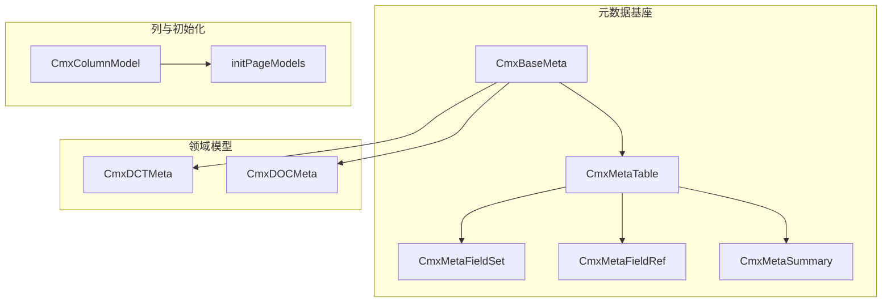
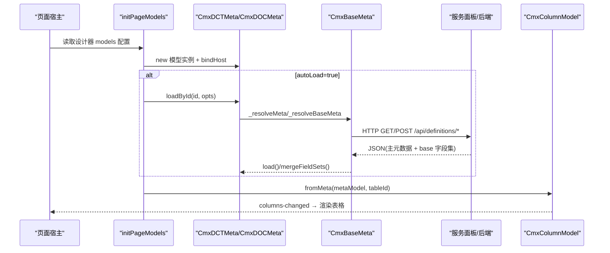
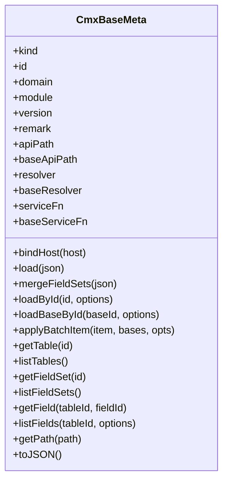
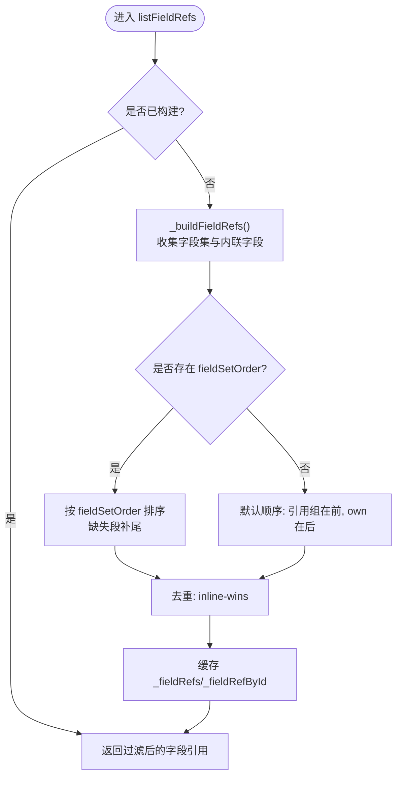
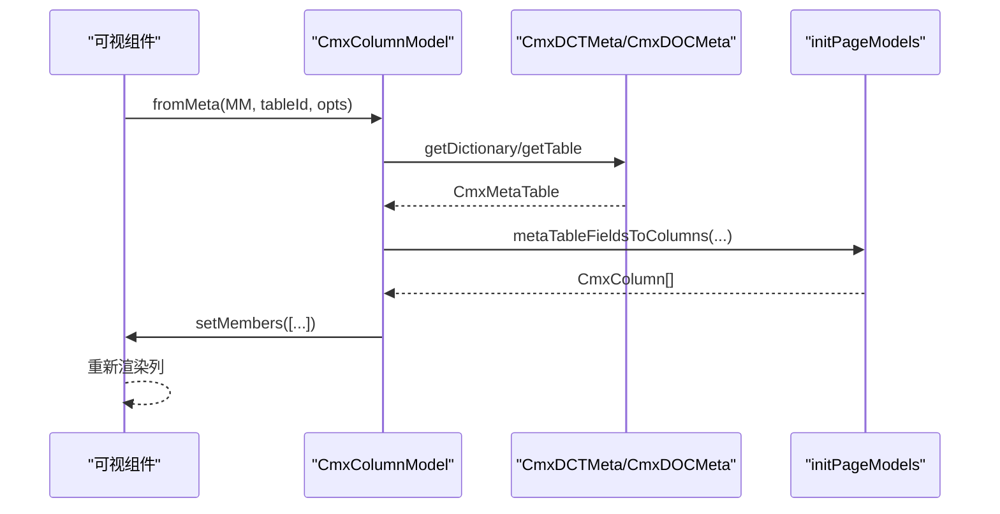
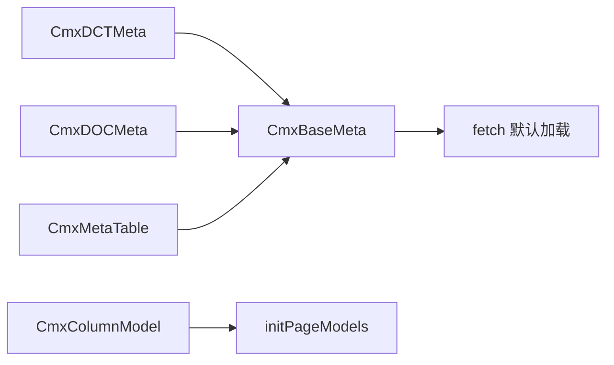

# 元数据模型 (CmxMetaModel)

<cite>
**本文引用的文件**
- [cmx-meta-model.js](file://packages/cmx-data-comp/src/lib/cmx-meta-model.js)
- [cmx-dct-meta.js](file://packages/cmx-data-comp/src/lib/cmx-dct-meta.js)
- [cmx-doc-meta.js](file://packages/cmx-data-comp/src/lib/cmx-doc-meta.js)
- [cmx-column-model.js](file://packages/cmx-data-comp/src/lib/cmx-column-model.js)
- [init-page-models.js](file://packages/cmx-data-comp/src/lib/init-page-models.js)
- [04-字典模型-CmxDCTMeta.md](file://docs/CMXPortalManager+CMXHTMLDesigner-模型体系文档/04-字典模型-CmxDCTMeta.md)
- [05-单据模型-CmxDOCMeta.md](file://docs/CMXPortalManager+CMXHTMLDesigner-模型体系文档/05-单据模型-CmxDOCMeta.md)
- [08-列模型-CmxColumnModel.md](file://docs/CMXPortalManager+CMXHTMLDesigner-模型体系文档/08-列模型-CmxColumnModel.md)
- [17-元数据JSON文件字段详解.md](file://docs/CMXPortalManager+CMXHTMLDesigner-模型体系文档/17-元数据JSON文件字段详解.md)
- [cmx-meta-model.test.js](file://packages/cmx-data-comp/src/lib/__tests__/cmx-meta-model.test.js)
</cite>

## 目录
1. [简介](#简介)
2. [项目结构](#项目结构)
3. [核心组件](#核心组件)
4. [架构总览](#架构总览)
5. [详细组件分析](#详细组件分析)
6. [依赖关系分析](#依赖关系分析)
7. [性能考量](#性能考量)
8. [故障排查指南](#故障排查指南)
9. [结论](#结论)
10. [附录](#附录)

## 简介
本文件面向 CMX 数据组件库的元数据模型，系统性阐述 CmxMetaModel 的层次结构与扩展机制，覆盖元数据的定义、验证与运行时解析；说明元数据与业务模型的映射（字段映射、类型转换、约束验证）；解释版本管理与兼容性策略（向后兼容与迁移）；并提供完整示例展示如何定义与扩展元数据模型（含自定义校验规则与动态字段生成），以及与前端组件集成和性能优化建议。

## 项目结构
围绕元数据模型的核心代码集中在 cmx-data-comp 包中：
- 基类与通用能力：CmxBaseMeta、CmxMetaTable、CmxMetaFieldSet、CmxMetaFieldRef、CmxMetaSummary、批量加载工具等
- 领域模型：CmxDCTMeta（字典）、CmxDOCMeta（单据）
- 列模型与初始化：CmxColumnModel、initPageModels（页面模型初始化入口）
- 文档与测试：模型体系文档、单元测试用例

图表来源
- [cmx-meta-model.js:347-609](file://packages/cmx-data-comp/src/lib/cmx-meta-model.js#L347-L609)
- [cmx-dct-meta.js:1-23](file://packages/cmx-data-comp/src/lib/cmx-dct-meta.js#L1-L23)
- [cmx-doc-meta.js:1-36](file://packages/cmx-data-comp/src/lib/cmx-doc-meta.js#L1-L36)
- [cmx-column-model.js:1-241](file://packages/cmx-data-comp/src/lib/cmx-column-model.js#L1-L241)
- [init-page-models.js:1-200](file://packages/cmx-data-comp/src/lib/init-page-models.js#L1-L200)

章节来源
- [cmx-meta-model.js:1-767](file://packages/cmx-data-comp/src/lib/cmx-meta-model.js#L1-L767)
- [cmx-dct-meta.js:1-23](file://packages/cmx-data-comp/src/lib/cmx-dct-meta.js#L1-L23)
- [cmx-doc-meta.js:1-36](file://packages/cmx-data-comp/src/lib/cmx-doc-meta.js#L1-L36)
- [cmx-column-model.js:1-241](file://packages/cmx-data-comp/src/lib/cmx-column-model.js#L1-L241)
- [init-page-models.js:1-200](file://packages/cmx-data-comp/src/lib/init-page-models.js#L1-L200)

## 核心组件
- CmxBaseMeta：元数据模型基类，负责加载 JSON、合并 fieldSets、按 kind 区分表集合、事件派发、批量加载与 base 字段集管理
- CmxDCTMeta / CmxDOCMeta：分别承载“字典”和“单据”两类元数据，暴露语义化 API（getDictionary/getDocument 等）
- CmxMetaTable：单张表的运行时视图，聚合字段集与内联字段，提供字段访问与汇总子表
- CmxMetaFieldSet / CmxMetaFieldRef：共享字段集与轻量字段引用，避免重复存储并支持来源标记
- CmxMetaSummary：单据汇总表（子表）对象，拥有独立 fields 与聚合属性
- CmxColumnModel：列模型，将元数据字段转换为可视化列配置，支持 fromMeta 动态构建列
- initPageModels：页面模型初始化入口，负责实例化、绑定 host、自动加载与事件脚本绑定

章节来源
- [cmx-meta-model.js:98-609](file://packages/cmx-data-comp/src/lib/cmx-meta-model.js#L98-L609)
- [cmx-dct-meta.js:1-23](file://packages/cmx-data-comp/src/lib/cmx-dct-meta.js#L1-L23)
- [cmx-doc-meta.js:1-36](file://packages/cmx-data-comp/src/lib/cmx-doc-meta.js#L1-L36)
- [cmx-column-model.js:20-241](file://packages/cmx-data-comp/src/lib/cmx-column-model.js#L20-L241)
- [init-page-models.js:1-200](file://packages/cmx-data-comp/src/lib/init-page-models.js#L1-L200)

## 架构总览
下图展示了从页面初始化到元数据加载、字段展开、列生成的端到端流程。

图表来源
- [init-page-models.js:1-200](file://packages/cmx-data-comp/src/lib/init-page-models.js#L1-L200)
- [cmx-meta-model.js:389-603](file://packages/cmx-data-comp/src/lib/cmx-meta-model.js#L389-L603)
- [cmx-column-model.js:89-158](file://packages/cmx-data-comp/src/lib/cmx-column-model.js#L89-L158)

## 详细组件分析

### CmxBaseMeta：元数据基类与扩展点
- 职责
  - 统一加载 JSON（load）、合并字段集（mergeFieldSets）、按 kind 解析表数组
  - 维护 fieldSets Map、tables 列表、tableById 索引
  - 提供 getField/set/listFields/listFieldRefs 等统一访问接口
  - 支持 resolver/baseResolver/serviceFn/baseServiceFn 多种加载策略
  - 批量加载：loadMetaBatch/loadMetaModelsBatch，支持 bundle 复用 base
- 关键行为
  - 冻结深层对象以保障只读性，cloneJson 保证不污染调用方原始 JSON
  - 通过 EventTarget 派发 meta-changed 事件
  - 自动推断 base 字段集文件（baseDctMetaRef/baseDocMetaRef）并按 moduleCode 反查 stem 形式 id

图表来源
- [cmx-meta-model.js:347-609](file://packages/cmx-data-comp/src/lib/cmx-meta-model.js#L347-L609)

章节来源
- [cmx-meta-model.js:347-609](file://packages/cmx-data-comp/src/lib/cmx-meta-model.js#L347-L609)

### CmxDCTMeta：字典元数据模型
- 职责
  - 指定 kind='DCT'，tableProp='dictionaryTables'，metaProp='moduleMeta'
  - 提供 getDictionary/listDictionaries 语义化 API
- 典型用法
  - 加载后端返回的字典元数据 JSON，按 dictCode 访问表与字段
  - 与 CmxColumnModel.fromMeta 配合，基于字典字段自动生成列

章节来源
- [cmx-dct-meta.js:1-23](file://packages/cmx-data-comp/src/lib/cmx-dct-meta.js#L1-L23)
- [04-字典模型-CmxDCTMeta.md:1-522](file://docs/CMXPortalManager+CMXHTMLDesigner-模型体系文档/04-字典模型-CmxDCTMeta.md#L1-L522)

### CmxDOCMeta：单据元数据模型
- 职责
  - 指定 kind='DOC'，tableProp='voucherTables'，metaProp='moduleMeta'
  - 提供 getDocument/listDocuments、listSummaries/listSummariesByLevel
- 典型用法
  - 描述多表层级、关系、聚合、状态流、校验规则
  - 为 CmxMasterSlave/FlexibleCombination 提供元数据支撑

章节来源
- [cmx-doc-meta.js:1-36](file://packages/cmx-data-comp/src/lib/cmx-doc-meta.js#L1-L36)
- [05-单据模型-CmxDOCMeta.md:1-27](file://docs/CMXPortalManager+CMXHTMLDesigner-模型体系文档/05-单据模型-CmxDOCMeta.md#L1-L27)

### CmxMetaTable：表级运行时视图
- 职责
  - 聚合字段集与内联字段，计算字段顺序（fieldSetOrder），去重（inline-wins）
  - 暴露 listFields/listFieldRefs/getField/getFieldRef
  - 懒构建字段引用缓存，支持 includeFieldSets/includeInline 过滤
  - 汇总子表：listSummaries/getSummary

图表来源
- [cmx-meta-model.js:159-307](file://packages/cmx-data-comp/src/lib/cmx-meta-model.js#L159-L307)

章节来源
- [cmx-meta-model.js:159-307](file://packages/cmx-data-comp/src/lib/cmx-meta-model.js#L159-L307)

### CmxMetaFieldSet / CmxMetaFieldRef：共享字段与轻量引用
- CmxMetaFieldSet：保存一份字段集，提供 getField/listFields/toJSON
- CmxMetaFieldRef：轻量包装，记录 source（fieldSet/inline/summary）、index、fieldSetId，支持 getPath/isFromFieldSet

章节来源
- [cmx-meta-model.js:98-157](file://packages/cmx-data-comp/src/lib/cmx-meta-model.js#L98-L157)

### CmxMetaSummary：单据汇总表
- 职责
  - 表示某源表下的汇总子表，拥有独立 fields（可继承源表列后物化）
  - 提供 listFields/getField/listFieldRefs/toJSON
  - 支持按 level 枚举汇总

章节来源
- [cmx-meta-model.js:309-345](file://packages/cmx-data-comp/src/lib/cmx-meta-model.js#L309-L345)
- [cmx-meta-model.test.js:387-456](file://packages/cmx-data-comp/src/lib/__tests__/cmx-meta-model.test.js#L387-L456)

### CmxColumnModel：列模型与元数据→列转换
- 职责
  - 管理列成员（CmxColumn/CmxColumnGroup），支持 setMembers/addMember/removeMember
  - fromMeta：从 CmxDCTMeta/CmxDOCMeta 的表字段动态构建列，并回填 refDict 坐标
  - toDescriptors：输出通用中间格式供适配器渲染
  - toAggregateMap：聚合配置分组
- 与 initPageModels 协作：阶段 1.5 自动列填充，保持与设计器一致

图表来源
- [cmx-column-model.js:89-158](file://packages/cmx-data-comp/src/lib/cmx-column-model.js#L89-L158)
- [init-page-models.js:127-169](file://packages/cmx-data-comp/src/lib/init-page-models.js#L127-L169)

章节来源
- [cmx-column-model.js:1-241](file://packages/cmx-data-comp/src/lib/cmx-column-model.js#L1-L241)
- [08-列模型-CmxColumnModel.md:1-249](file://docs/CMXPortalManager+CMXHTMLDesigner-模型体系文档/08-列模型-CmxColumnModel.md#L1-L249)

### 批量加载与 Bundle 复用
- loadMetaBatch：一次性加载多个元数据 + base 字段集，支持 resolver/serviceFn/fetch 三种路径
- loadMetaModelsBatch：将响应就地灌入模型面板已有实例，不新建对象
- 优势：减少网络请求、避免重复加载 base、统一错误收集与 via 追踪

章节来源
- [cmx-meta-model.js:633-767](file://packages/cmx-data-comp/src/lib/cmx-meta-model.js#L633-L767)
- [cmx-meta-model.test.js:188-385](file://packages/cmx-data-comp/src/lib/__tests__/cmx-meta-model.test.js#L188-L385)

## 依赖关系分析
- 模块耦合
  - CmxDCTMeta/CmxDOCMeta 强依赖 CmxBaseMeta（继承）
  - CmxMetaTable 依赖 CmxBaseMeta 提供的 fieldSets 与表集合
  - CmxColumnModel 依赖 initPageModels 的字段→列转换逻辑（动态 import 避免循环）
- 外部依赖
  - fetch 用于默认加载策略（可被 resolver/serviceFn 替换）
  - 后端 /api/definitions/config 与 /api/definitions/batch

图表来源
- [cmx-dct-meta.js:1-23](file://packages/cmx-data-comp/src/lib/cmx-dct-meta.js#L1-L23)
- [cmx-doc-meta.js:1-36](file://packages/cmx-data-comp/src/lib/cmx-doc-meta.js#L1-L36)
- [cmx-meta-model.js:347-609](file://packages/cmx-data-comp/src/lib/cmx-meta-model.js#L347-L609)
- [cmx-column-model.js:89-158](file://packages/cmx-data-comp/src/lib/cmx-column-model.js#L89-L158)

章节来源
- [cmx-meta-model.js:347-767](file://packages/cmx-data-comp/src/lib/cmx-meta-model.js#L347-L767)
- [cmx-column-model.js:89-158](file://packages/cmx-data-comp/src/lib/cmx-column-model.js#L89-L158)

## 性能考量
- 字段集共享与只读冻结
  - fieldSets 仅存一份，表级字段通过 CmxMetaFieldRef 指向共享字段，降低内存占用
  - freezeDeep 保护内部结构不被意外修改
- 懒构建与缓存
  - CmxMetaTable 的字段引用按需构建并缓存（_fieldRefs/_fieldRefById）
  - 汇总子表也采用懒构建
- 批量加载与 bundle 复用
  - loadMetaBatch/loadMetaModelsBatch 单次请求获取多个元数据与 base 字段集，减少网络往返
  - bundle.bases 直接注入，避免额外 base 请求
- 字段顺序优化
  - fieldSetOrder 控制分组顺序，避免不必要的重排
- 建议
  - 优先使用 loadMetaModelsBatch 将数据灌入既有实例，减少对象创建
  - 合理拆分 fieldSets，避免过大的单一字段集
  - 对大表单场景，结合 FlexibleCombination 按需加载列

章节来源
- [cmx-meta-model.js:40-45](file://packages/cmx-data-comp/src/lib/cmx-meta-model.js#L40-L45)
- [cmx-meta-model.js:159-307](file://packages/cmx-data-comp/src/lib/cmx-meta-model.js#L159-L307)
- [cmx-meta-model.js:669-767](file://packages/cmx-data-comp/src/lib/cmx-meta-model.js#L669-L767)

## 故障排查指南
- 常见错误与定位
  - 缺 domain/module：默认走 /api/definitions/config 时缺少 domain（非 base 还需 module）会抛错提示，而非静默 400
  - base 字段集 404：确保 base 请求 domain='base' 且 id 为 stem（去除 .json 与 _vN），避免透传主文件坐标
  - 未注册 kind：loadMetaBatch 遇到未知 kind 会记录 errors
- 调试技巧
  - 使用 getLastLoad 查看最近一次加载的请求摘要
  - 通过 via 字段判断实际加载路径（resolver/service:xxx/fetch）
  - 检查 model.backendPath/relPath 与 basePaths 以确认后端路径
- 参考用例
  - 单元测试覆盖了 domain 校验、bundle 复用、base 坐标隔离、批量加载、serviceFn 路由、resolver 优先级等

章节来源
- [cmx-meta-model.js:418-445](file://packages/cmx-data-comp/src/lib/cmx-meta-model.js#L418-L445)
- [cmx-meta-model.js:597-603](file://packages/cmx-data-comp/src/lib/cmx-meta-model.js#L597-L603)
- [cmx-meta-model.js:669-767](file://packages/cmx-data-comp/src/lib/cmx-meta-model.js#L669-L767)
- [cmx-meta-model.test.js:139-186](file://packages/cmx-data-comp/src/lib/__tests__/cmx-meta-model.test.js#L139-L186)
- [cmx-meta-model.test.js:188-385](file://packages/cmx-data-comp/src/lib/__tests__/cmx-meta-model.test.js#L188-L385)

## 结论
CmxMetaModel 通过统一的基类与领域子类，实现了字典与单据元数据的标准化加载、字段集共享、运行时解析与列生成；借助批量加载与 bundle 复用，显著降低网络开销；通过 resolver/serviceFn/fetch 的多路径加载策略，兼顾灵活性与可测试性；同时提供完善的错误提示与调试信息，便于问题定位。结合 CmxColumnModel 与 initPageModels，可实现从元数据到前端组件的高效映射。

## 附录

### 元数据与业务模型的映射
- 字段映射
  - 字典表：dictMeta（编码、名称、层级、物理表名、主键/编码/标签字段）+ fields（数据类型、长度、小数位、可空、标题、维度三态、编辑/显示控制、refDict 等）
  - 单据表：除字段外，还包含 schema/relations/aggregations/validationRules 等
- 类型转换
  - dataType 驱动默认编辑器与显示格式（如 NUMBER/DATE/BOOLEAN）
  - dimType（dimension/attribute/measure）决定数据来源与公式参与方式
- 约束验证
  - codeRule（模式、正则、唯一性）
  - uniqueKeys（单列/组合唯一）
  - validationRules（跨表表达式校验，level 控制触发层）

章节来源
- [04-字典模型-CmxDCTMeta.md:152-251](file://docs/CMXPortalManager+CMXHTMLDesigner-模型体系文档/04-字典模型-CmxDCTMeta.md#L152-L251)
- [17-元数据JSON文件字段详解.md:563-660](file://docs/CMXPortalManager+CMXHTMLDesigner-模型体系文档/17-元数据JSON文件字段详解.md#L563-L660)
- [05-单据模型-CmxDOCMeta.md:308-340](file://docs/CMXPortalManager+CMXHTMLDesigner-模型体系文档/05-单据模型-CmxDOCMeta.md#L308-L340)

### 版本管理与兼容性
- 版本标识
  - moduleMeta.version 与文件名后缀 _vN 对应
  - isDefault 标记同 stem 多版本中的默认版本
- 向后兼容
  - base 字段集加载使用 stem 形式 id（去除 .json 与 _vN），后端按 moduleCode 反查并支持 isDefault 切换
  - 字段顺序 fieldSetOrder 允许设计期调整，无配置时保持默认相对序
- 迁移策略
  - 新增 base 版本后，前端零改动即可生效（通过 isDefault 切换）
  - 批量加载支持 includeBase 控制是否附带 base 字段集

章节来源
- [cmx-meta-model.js:447-468](file://packages/cmx-data-comp/src/lib/cmx-meta-model.js#L447-L468)
- [cmx-meta-model.js:605-608](file://packages/cmx-data-comp/src/lib/cmx-meta-model.js#L605-L608)
- [17-元数据JSON文件字段详解.md:567-584](file://docs/CMXPortalManager+CMXHTMLDesigner-模型体系文档/17-元数据JSON文件字段详解.md#L567-L584)

### 代码示例（路径指引）
- 定义与加载字典元数据
  - 构造与加载：[04-字典模型-CmxDCTMeta.md:292-319](file://docs/CMXPortalManager+CMXHTMLDesigner-模型体系文档/04-字典模型-CmxDCTMeta.md#L292-L319)
  - 最小示例与访问：[04-字典模型-CmxDCTMeta.md:454-479](file://docs/CMXPortalManager+CMXHTMLDesigner-模型体系文档/04-字典模型-CmxDCTMeta.md#L454-L479)
- 定义与加载单据元数据
  - 结构与用途：[05-单据模型-CmxDOCMeta.md:7-22](file://docs/CMXPortalManager+CMXHTMLDesigner-模型体系文档/05-单据模型-CmxDOCMeta.md#L7-L22)
- 动态列生成
  - 从元数据构建列：[cmx-column-model.js:89-158](file://packages/cmx-data-comp/src/lib/cmx-column-model.js#L89-L158)
- 批量加载与 bundle 复用
  - 批量加载示例：[cmx-meta-model.test.js:188-267](file://packages/cmx-data-comp/src/lib/__tests__/cmx-meta-model.test.js#L188-L267)
  - 灌入既有实例：[cmx-meta-model.test.js:270-333](file://packages/cmx-data-comp/src/lib/__tests__/cmx-meta-model.test.js#L270-L333)
- 自定义校验规则
  - 跨表校验规则定义：[17-元数据JSON文件字段详解.md:470-502](file://docs/CMXPortalManager+CMXHTMLDesigner-模型体系文档/17-元数据JSON文件字段详解.md#L470-L502)
  - 单据校验规则清单：[05-单据模型-CmxDOCMeta.md:308-340](file://docs/CMXPortalManager+CMXHTMLDesigner-模型体系文档/05-单据模型-CmxDOCMeta.md#L308-L340)

### 与前端组件的集成模式
- 设计器模型面板声明实例，initPageModels 自动创建并挂到 host
- 可视组件通过 data-cmx-model-id/data-cmx-dataset-id 绑定模型
- CmxColumnModel.toDescriptors 输出通用描述符，由适配器转为具体 grid 列定义
- 弹性组合（FlexibleCombination）可在运行时替换列成员，触发 columns-changed 刷新

章节来源
- [init-page-models.js:1-200](file://packages/cmx-data-comp/src/lib/init-page-models.js#L1-L200)
- [08-列模型-CmxColumnModel.md:156-183](file://docs/CMXPortalManager+CMXHTMLDesigner-模型体系文档/08-列模型-CmxColumnModel.md#L156-L183)