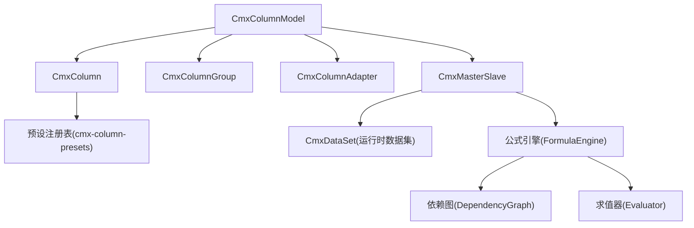
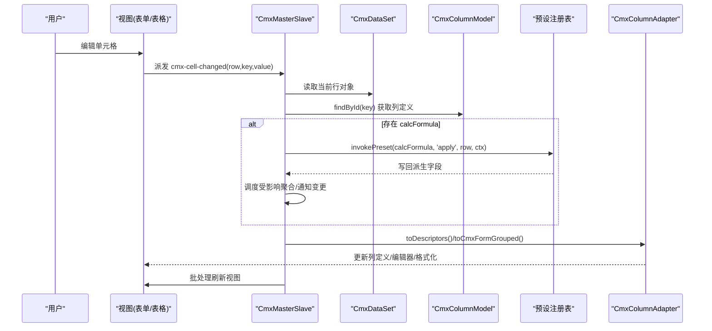
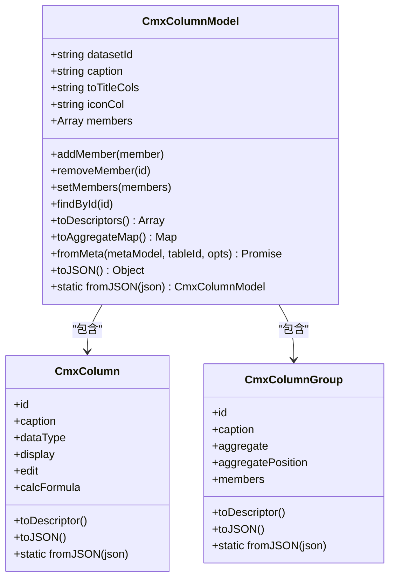
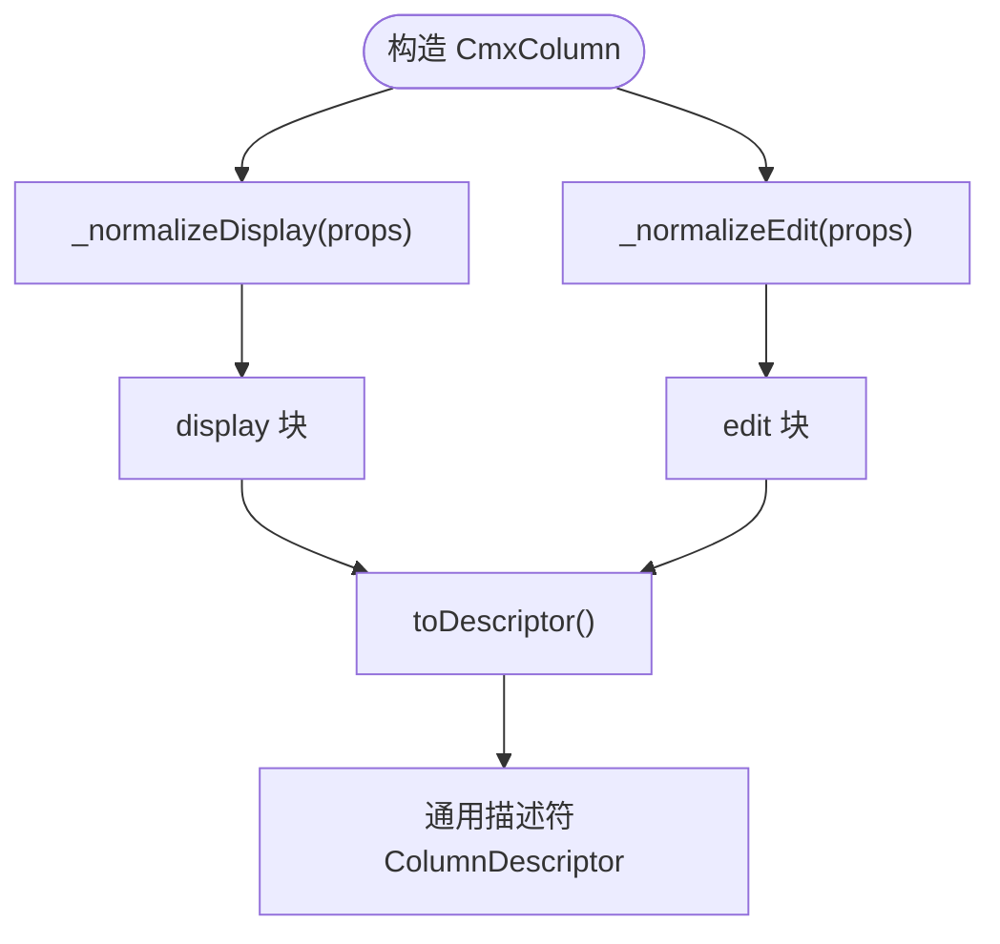
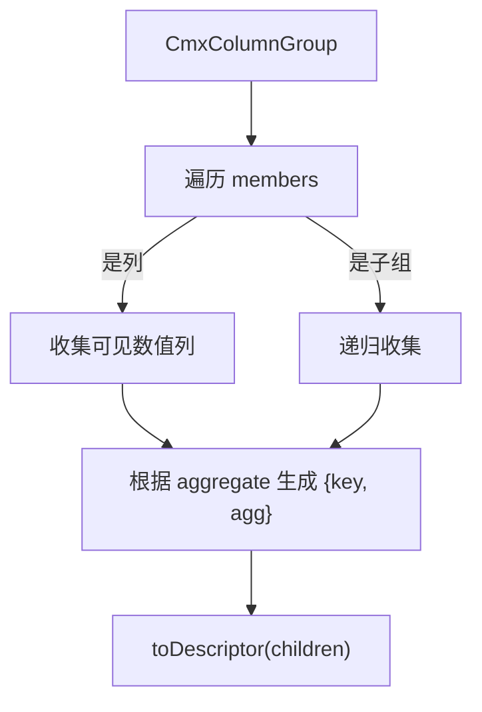
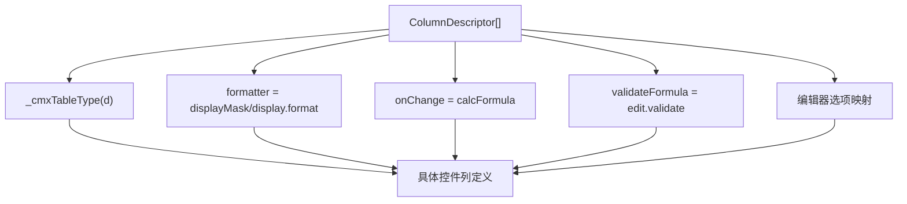
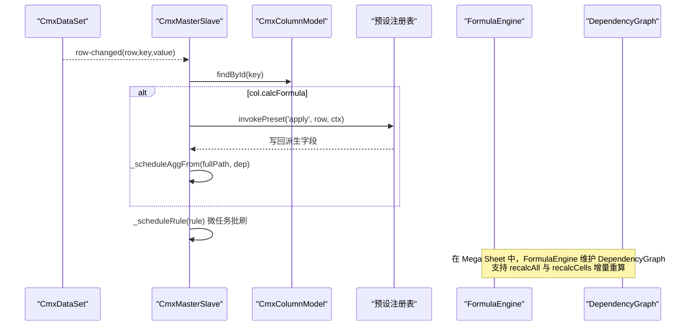
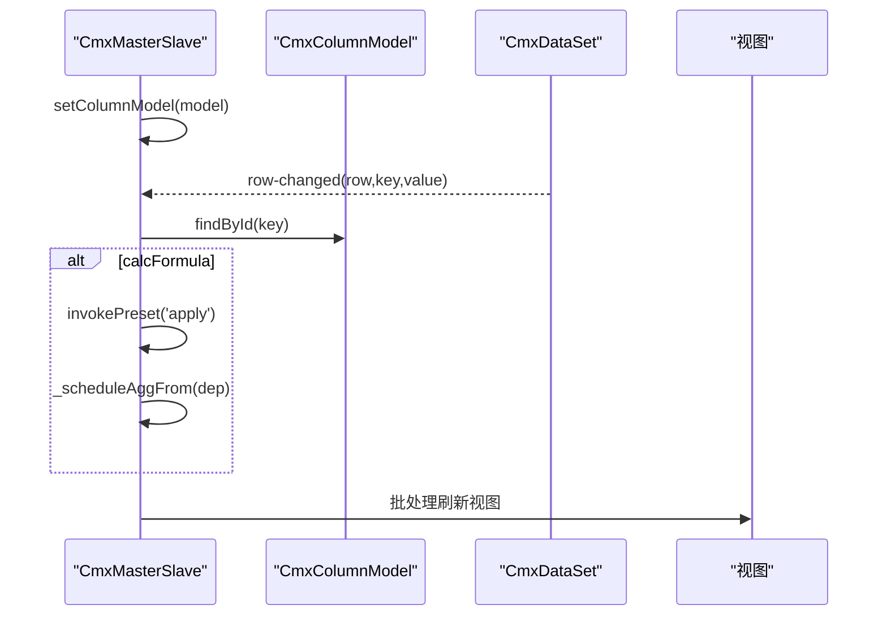
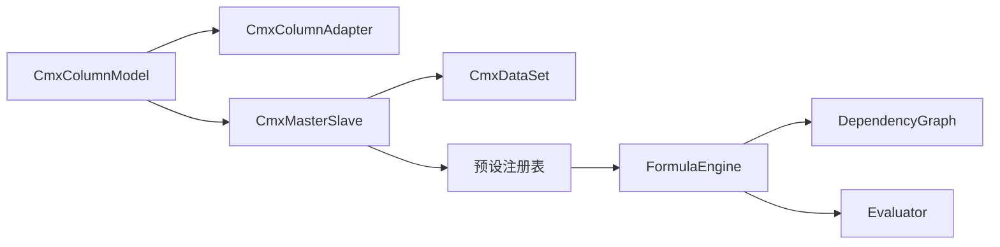

# 列模型 (CmxColumnModel)

<cite>
**本文引用的文件**
- [cmx-column-model.js](file://packages/cmx-data-comp/src/lib/cmx-column-model.js)
- [cmx-column.js](file://packages/cmx-data-comp/src/lib/cmx-column.js)
- [cmx-column-group.js](file://packages/cmx-data-comp/src/lib/cmx-column-group.js)
- [cmx-column-adapter.js](file://packages/cmx-data-comp/src/lib/cmx-column-adapter.js)
- [cmx-master-slave.js](file://packages/cmx-data-comp/src/lib/cmx-master-slave.js)
- [cmx-column-presets.js](file://packages/cmx-data-comp/src/lib/cmx-column-presets.js)
- [model-column-model.md](file://.agents/skills/html-page-generator/references/model-column-model.md)
- [08-列模型-CmxColumnModel.md](file://docs/CMXPortalManager+CMXHTMLDesigner-模型体系文档/08-列模型-CmxColumnModel.md)
- [09-主从协调器-CmxMasterSlave.md](file://docs/CMXPortalManager+CMXHTMLDesigner-模型体系文档/09-主从协调器-CmxMasterSlave.md)
- [FormulaEngine.ts](file://cmx-mega-sheet/src/formula/Formul aEngine.ts)
- [DependencyGraph.ts](file://cmx-mega-sheet/src/formula/DependencyGraph.ts)
- [Evaluator.ts](file://cmx-mega-sheet/src/formula/Evaluator.ts)
</cite>

## 目录
1. [简介](#简介)
2. [项目结构](#项目结构)
3. [核心组件](#核心组件)
4. [架构总览](#架构总览)
5. [详细组件分析](#详细组件分析)
6. [依赖关系分析](#依赖关系分析)
7. [性能考量](#性能考量)
8. [故障排查指南](#故障排查指南)
9. [结论](#结论)
10. [附录：复杂列模型示例与最佳实践](#附录：复杂列模型示例与最佳实践)

## 简介
本文件面向 CMX 数据组件库的“列模型”能力，系统性阐述 CmxColumnModel 的设计模式、层次结构与运行机制。内容覆盖：
- 字段定义、验证规则、格式化配置与编辑器绑定的实现机制
- 列模型的层次结构：基础属性、编辑设置、显示配置、数据转换
- 公式计算引擎的工作原理：calcFormula 的执行上下文、依赖追踪与性能优化
- 与主从协调器的协作模式与最佳实践
- 完整代码级示例路径（以源码引用形式给出）

## 项目结构
列模型相关能力由一组纯元数据类与适配器组成，渲染层无关：
- CmxColumnModel：组织列与列组，提供成员管理、描述符输出、聚合映射、序列化
- CmxColumn：单列定义，统一 display/edit 结构化配置，支持 calcFormula、校验、格式化等
- CmxColumnGroup：列分组，支持嵌套与组内聚合
- CmxColumnAdapter：将通用描述符转换为具体表格/表单控件所需列定义
- CmxMasterSlave：主从协调器，负责多表联动、事件分发、聚合执行与 calcFormula 触发
- 预设注册表：声明式函数预设（apply/format），用于 calcFormula、formatter、validate 等场景
- 公式引擎（Mega Sheet）：解析、求值、依赖图与增量重算，为复杂公式场景提供底层能力

图表来源
- [cmx-column-model.js:20-195](file://packages/cmx-data-comp/src/lib/cmx-column-model.js#L20-L195)
- [cmx-column.js:84-200](file://packages/cmx-data-comp/src/lib/cmx-column.js#L84-L200)
- [cmx-column-group.js:25-131](file://packages/cmx-data-comp/src/lib/cmx-column-group.js#L25-L131)
- [cmx-column-adapter.js:432-462](file://packages/cmx-data-comp/src/lib/cmx-column-adapter.js#L432-L462)
- [cmx-master-slave.js:41-85](file://packages/cmx-data-comp/src/lib/cmx-master-slave.js#L41-L85)
- [FormulaEngine.ts:36-61](file://cmx-mega-sheet/src/formula/Formul aEngine.ts#L36-L61)
- [DependencyGraph.ts:100-136](file://cmx-mega-sheet/src/formula/DependencyGraph.ts#L100-L136)
- [Evaluator.ts:59-65](file://cmx-mega-sheet/src/formula/Evaluator.ts#L59-L65)

章节来源
- [cmx-column-model.js:20-241](file://packages/cmx-data-comp/src/lib/cmx-column-model.js#L20-L241)
- [cmx-column.js:84-255](file://packages/cmx-data-comp/src/lib/cmx-column.js#L84-L255)
- [cmx-column-group.js:25-162](file://packages/cmx-data-comp/src/lib/cmx-column-group.js#L25-L162)
- [cmx-column-adapter.js:432-462](file://packages/cmx-data-comp/src/lib/cmx-column-adapter.js#L432-L462)
- [cmx-master-slave.js:41-85](file://packages/cmx-data-comp/src/lib/cmx-master-slave.js#L41-L85)
- [model-column-model.md:14-167](file://.agents/skills/html-page-generator/references/model-column-model.md#L14-L167)
- [08-列模型-CmxColumnModel.md:25-67](file://docs/CMXPortalManager+CMXHTMLDesigner-模型体系文档/08-列模型-CmxColumnModel.md#L25-L67)

## 核心组件
- CmxColumnModel：列配方容器，维护 members（CmxColumn/CmxColumnGroup），提供 setMembers/addMember/removeMember、toDescriptors、toAggregateMap、fromMeta、序列化等能力
- CmxColumn：单列元数据，统一 display/edit 块，支持 dataType、width、visible、frozen、agg、calcFormula、edit.validate、display.format、cellStyle、link/icon/badge 等
- CmxColumnGroup：列分组，支持嵌套、aggregate 配置、aggregatePosition、聚合列收集
- CmxColumnAdapter：将通用描述符适配到 cmx-ui5-table / cmx-revo-grid / cmx-ui5-form 等具体控件所需的列定义
- CmxMasterSlave：主从协调器，绑定视图、维护当前选中行、监听 row-changed/cell-changed、执行聚合与 calcFormula、批处理刷新视图
- 预设注册表：声明式 apply/format 预设，如 multiply/divide/sum/concat/format-number/format-date/lookup/copy/formula-eval/rule-validate

章节来源
- [cmx-column-model.js:20-241](file://packages/cmx-data-comp/src/lib/cmx-column-model.js#L20-L241)
- [cmx-column.js:84-255](file://packages/cmx-data-comp/src/lib/cmx-column.js#L84-L255)
- [cmx-column-group.js:25-162](file://packages/cmx-data-comp/src/lib/cmx-column-group.js#L25-L162)
- [cmx-column-adapter.js:432-462](file://packages/cmx-data-comp/src/lib/cmx-column-adapter.js#L432-L462)
- [cmx-master-slave.js:179-417](file://packages/cmx-data-comp/src/lib/cmx-master-slave.js#L179-L417)
- [cmx-column-presets.js:1-207](file://packages/cmx-data-comp/src/lib/cmx-column-presets.js#L1-L207)

## 架构总览
列模型采用“纯元数据 + 适配器”的分层设计：
- 元数据层：CmxColumnModel/CmxColumn/CmxColumnGroup 仅描述“列长什么样、怎么编辑、如何计算”，不依赖任何 UI 框架
- 适配层：CmxColumnAdapter 将通用描述符转为具体控件的列定义（类型、编辑器、格式化、选项等）
- 运行层：CmxMasterSlave 负责事件驱动的数据流（row-changed → calcFormula → 聚合 → 视图刷新），并与数据集（CmxDataSet）协作
- 公式引擎：在 Mega Sheet 中提供 AST 解析、求值、依赖图与增量重算，支撑复杂公式场景

图表来源
- [cmx-master-slave.js:357-417](file://packages/cmx-data-comp/src/lib/cmx-master-slave.js#L357-L417)
- [cmx-column-model.js:188-195](file://packages/cmx-data-comp/src/lib/cmx-column-model.js#L188-L195)
- [cmx-column-adapter.js:432-462](file://packages/cmx-data-comp/src/lib/cmx-column-adapter.js#L432-L462)
- [cmx-column-presets.js:55-73](file://packages/cmx-data-comp/src/lib/cmx-column-presets.js#L55-L73)

## 详细组件分析

### CmxColumnModel：列配方容器
- 职责：维护 members（列/列组）、提供成员管理 API、输出通用描述符、生成聚合映射、从元数据构建列、序列化/反序列化
- 关键方法：
  - addMember/setMembers/removeMember：动态替换或增删成员，并派发 columns-changed
  - toDescriptors：过滤不可见列，输出 ColumnDescriptor[] 供适配器使用
  - toAggregateMap：按 agg 类型分组，驱动合计行或后端聚合
  - fromMeta：基于 CmxDCTMeta/CmxDOCMeta 动态构建列，回填 refDict 坐标信息
  - toJSON/fromJSON：模型持久化与还原

图表来源
- [cmx-column-model.js:20-241](file://packages/cmx-data-comp/src/lib/cmx-column-model.js#L20-L241)
- [cmx-column.js:84-255](file://packages/cmx-data-comp/src/lib/cmx-column.js#L84-L255)
- [cmx-column-group.js:25-162](file://packages/cmx-data-comp/src/lib/cmx-column-group.js#L25-L162)

章节来源
- [cmx-column-model.js:20-241](file://packages/cmx-data-comp/src/lib/cmx-column-model.js#L20-L241)
- [model-column-model.md:14-167](file://.agents/skills/html-page-generator/references/model-column-model.md#L14-L167)
- [08-列模型-CmxColumnModel.md:25-67](file://docs/CMXPortalManager+CMXHTMLDesigner-模型体系文档/08-列模型-CmxColumnModel.md#L25-L67)

### CmxColumn：单列定义与归一化
- 显示域 display：mode、format、decimalDigits、zeroAsBlank、emptyText、badgeMap、link、icon、cellStyle、render 等
- 编辑域 edit：mode、trigger、options、source、valueField、displayTemplate、parent、dropdownColumns、placeholder、dependents、required、requiredWhen、validate、validateWhen、readonlyWhen、editor 等
- 别名兼容：displayMask→display.format、displayMode→display.mode、validateFormula→edit.validate、decimalDigits→display.decimalDigits、actionRef→display.link.actionRef
- toDescriptor：输出通用中间格式，保留 caption、dataType、width、visible、frozen、agg、display、edit、calcFormula、validateFormula、refDict/refField/displayField、editSettings、cellTemplate/cellProperties 等

图表来源
- [cmx-column.js:128-152](file://packages/cmx-data-comp/src/lib/cmx-column.js#L128-L152)
- [cmx-column.js:158-200](file://packages/cmx-data-comp/src/lib/cmx-column.js#L158-L200)

章节来源
- [cmx-column.js:84-255](file://packages/cmx-data-comp/src/lib/cmx-column.js#L84-L255)
- [model-column-model.md:66-167](file://.agents/skills/html-page-generator/references/model-column-model.md#L66-L167)

### CmxColumnGroup：列分组与聚合
- 支持嵌套成员（列或子组）
- aggregate：{ sum, avg, max, min, count } 启用开关
- aggregatePosition：'before'/'after' 控制合计行位置
- aggregateColumns：收集数值叶列的聚合配置，供渲染层或后端使用

图表来源
- [cmx-column-group.js:74-106](file://packages/cmx-data-comp/src/lib/cmx-column-group.js#L74-L106)
- [cmx-column-group.js:120-131](file://packages/cmx-data-comp/src/lib/cmx-column-group.js#L120-L131)

章节来源
- [cmx-column-group.js:25-162](file://packages/cmx-data-comp/src/lib/cmx-column-group.js#L25-L162)

### CmxColumnAdapter：跨控件适配
- 将通用描述符转换为 cmx-ui5-table / cmx-revo-grid / cmx-ui5-form 等控件的列定义
- 映射逻辑包括：
  - type：由 edit.mode/dataType 推导
  - formatter：来自 display.format/displayMask
  - onChange：来自 calcFormula
  - validateFormula：来自 edit.validate
  - 编辑器选项：options/placeholder/source/dependents/helper/valueField/displayTemplate 等
  - form 适配：将 edit.* 提升到 field 顶层（如 valueField/displayTemplate/dependents/requiredWhen/validate），BOOLEAN 类型映射为 checkbox

图表来源
- [cmx-column-adapter.js:432-462](file://packages/cmx-data-comp/src/lib/cmx-column-adapter.js#L432-L462)

章节来源
- [cmx-column-adapter.js:432-462](file://packages/cmx-data-comp/src/lib/cmx-column-adapter.js#L432-L462)

### 公式计算引擎：calcFormula 执行上下文、依赖追踪与性能优化
- 执行上下文：
  - 通过 CmxMasterSlave._registerDsListeners 监听 row-changed，调用 invokePreset(col.calcFormula, 'apply', row, { value, key })
  - 预设可访问 row、args、value、key、table/form 等上下文
- 依赖追踪：
  - 列模型层面：editSettings.dependents 指定派生字段，变更时触发 _scheduleAggFrom 与 change 事件
  - 公式引擎层面（Mega Sheet）：DependencyGraph 记录公式格依赖与反向依赖，支持 affectedBy 增量重算
- 性能优化：
  - 批处理刷新：_scheduleRule 同步写值，微任务去重批量刷新视图
  - 解析缓存：FormulaEngine.parseCache 缓存 AST
  - 增量重算：recalcCells(cells) 仅重算受影响闭包

图表来源
- [cmx-master-slave.js:357-417](file://packages/cmx-data-comp/src/lib/cmx-master-slave.js#L357-L417)
- [cmx-column-presets.js:55-73](file://packages/cmx-data-comp/src/lib/cmx-column-presets.js#L55-L73)
- [FormulaEngine.ts:36-61](file://cmx-mega-sheet/src/formula/Formul aEngine.ts#L36-L61)
- [DependencyGraph.ts:100-136](file://cmx-mega-sheet/src/formula/DependencyGraph.ts#L100-L136)

章节来源
- [cmx-master-slave.js:357-417](file://packages/cmx-data-comp/src/lib/cmx-master-slave.js#L357-L417)
- [cmx-column-presets.js:1-207](file://packages/cmx-data-comp/src/lib/cmx-column-presets.js#L1-L207)
- [FormulaEngine.ts:36-61](file://cmx-mega-sheet/src/formula/Formul aEngine.ts#L36-L61)
- [DependencyGraph.ts:100-136](file://cmx-mega-sheet/src/formula/DependencyGraph.ts#L100-L136)
- [Evaluator.ts:59-65](file://cmx-mega-sheet/src/formula/Evaluator.ts#L59-L65)

### 与主从协调器的协作模式与最佳实践
- 绑定列模型：ms.setColumnModel(model)，以 model.datasetId 匹配 schema 路径
- 事件驱动：row-changed → 查找列 → 执行 calcFormula → 调度聚合 → 批处理刷新视图
- 视图联动：bindForm/bindTable 后，currentId 变化自动级联刷新下级视图
- 最佳实践：
  - datasetId 必须与 schema 路径一致（单层 id）
  - 使用 editSettings.dependents 显式声明派生字段，避免隐式依赖
  - 合理拆分 calcFormula 与聚合规则，减少不必要的重算
  - 使用预设注册表集中管理业务逻辑，便于 JSON 配置与可视化

图表来源
- [cmx-master-slave.js:186-191](file://packages/cmx-data-comp/src/lib/cmx-master-slave.js#L186-L191)
- [cmx-master-slave.js:357-417](file://packages/cmx-data-comp/src/lib/cmx-master-slave.js#L357-L417)

章节来源
- [09-主从协调器-CmxMasterSlave.md:182-204](file://docs/CMXPortalManager+CMXHTMLDesigner-模型体系文档/09-主从协调器-CmxMasterSlave.md#L182-L204)
- [cmx-master-slave.js:186-191](file://packages/cmx-data-comp/src/lib/cmx-master-slave.js#L186-L191)

## 依赖关系分析
- 低耦合：CmxColumnModel/CmxColumn/CmxColumnGroup 不依赖 UI 框架，仅通过 toDescriptor 输出通用描述符
- 适配器解耦：CmxColumnAdapter 负责将通用描述符映射到具体控件，降低与渲染层的耦合
- 事件驱动：CmxMasterSlave 通过事件（row-changed、cursor-changed、cmx-row-added/removed）驱动数据流与视图刷新
- 公式引擎扩展：FormulaEngine/DependencyGraph/Evaluator 提供强大的公式解析、求值与增量重算能力

图表来源
- [cmx-column-model.js:20-241](file://packages/cmx-data-comp/src/lib/cmx-column-model.js#L20-L241)
- [cmx-column-adapter.js:432-462](file://packages/cmx-data-comp/src/lib/cmx-column-adapter.js#L432-L462)
- [cmx-master-slave.js:41-85](file://packages/cmx-data-comp/src/lib/cmx-master-slave.js#L41-L85)
- [cmx-column-presets.js:1-207](file://packages/cmx-data-comp/src/lib/cmx-column-presets.js#L1-L207)
- [FormulaEngine.ts:36-61](file://cmx-mega-sheet/src/formula/Formul aEngine.ts#L36-L61)
- [DependencyGraph.ts:100-136](file://cmx-mega-sheet/src/formula/DependencyGraph.ts#L100-L136)
- [Evaluator.ts:59-65](file://cmx-mega-sheet/src/formula/Evaluator.ts#L59-L65)

章节来源
- [cmx-column-model.js:20-241](file://packages/cmx-data-comp/src/lib/cmx-column-model.js#L20-L241)
- [cmx-column-adapter.js:432-462](file://packages/cmx-data-comp/src/lib/cmx-column-adapter.js#L432-L462)
- [cmx-master-slave.js:41-85](file://packages/cmx-data-comp/src/lib/cmx-master-slave.js#L41-L85)
- [cmx-column-presets.js:1-207](file://packages/cmx-data-comp/src/lib/cmx-column-presets.js#L1-L207)
- [FormulaEngine.ts:36-61](file://cmx-mega-sheet/src/formula/Formul aEngine.ts#L36-L61)
- [DependencyGraph.ts:100-136](file://cmx-mega-sheet/src/formula/DependencyGraph.ts#L100-L136)
- [Evaluator.ts:59-65](file://cmx-mega-sheet/src/formula/Evaluator.ts#L59-L65)

## 性能考量
- 批处理刷新：_scheduleRule 使用微任务合并多次视图刷新，避免频繁重绘
- 解析缓存：FormulaEngine.parseCache 缓存 AST，减少重复解析开销
- 增量重算：DependencyGraph.affectedBy 仅重算受影响闭包，提升大数据量下的响应性
- 依赖最小化：editSettings.dependents 显式声明派生字段，避免全表重算
- 适配器优化：toDescriptor/toCmxFormGrouped 仅在必要时重建列定义，减少 DOM 操作

[本节为通用性能讨论，无需特定文件引用]

## 故障排查指南
- datasetId 不匹配：确保 CmxColumnModel.datasetId 与 CmxMasterSlave.schema 路径一致（单层 id）
- 列未生效：检查 toDescriptors 是否过滤了 visible=false 的列；确认适配器是否正确映射 type/formatter/onChange
- 公式未执行：确认 row-changed 已触发、col.calcFormula 存在、invokePreset 正确调用
- 依赖未更新：检查 editSettings.dependents 是否声明，_scheduleAggFrom 是否被调用
- 视图未刷新：确认 _scheduleRule 的微任务批处理是否被执行，是否存在多个脏视图未合并

章节来源
- [cmx-master-slave.js:186-191](file://packages/cmx-data-comp/src/lib/cmx-master-slave.js#L186-L191)
- [cmx-master-slave.js:357-417](file://packages/cmx-data-comp/src/lib/cmx-master-slave.js#L357-L417)
- [cmx-column-adapter.js:432-462](file://packages/cmx-data-comp/src/lib/cmx-column-adapter.js#L432-L462)
- [cmx-column-presets.js:55-73](file://packages/cmx-data-comp/src/lib/cmx-column-presets.js#L55-L73)

## 结论
CmxColumnModel 通过“纯元数据 + 适配器 + 事件驱动”的架构，实现了列定义的标准化、可配置与可扩展。配合 CmxMasterSlave 的主从协调与公式引擎的依赖追踪，能够高效支撑复杂业务场景下的列展示、编辑、计算与联动需求。建议在实际项目中：
- 使用 display/edit 结构化配置，避免散落顶层别名
- 显式声明依赖（editSettings.dependents），减少不必要重算
- 利用预设注册表集中管理业务逻辑，便于 JSON 配置与可视化
- 结合 CmxMasterSlave 的批处理刷新与公式引擎的增量重算，保障性能

[本节为总结性内容，无需特定文件引用]

## 附录：复杂列模型示例与最佳实践
以下示例以源码引用形式给出，便于快速定位实现细节：
- 条件验证：edit.validate / requiredWhen / validateWhen
  - 参考：[cmx-column.js:66-70](file://packages/cmx-data-comp/src/lib/cmx-column.js#L66-L70)
- 动态格式化：display.format / displayMask / cellStyle
  - 参考：[cmx-column.js:30-46](file://packages/cmx-data-comp/src/lib/cmx-column.js#L30-L46)
- 自定义编辑器集成：edit.editor / edit.source / edit.options
  - 参考：[cmx-column.js:55-71](file://packages/cmx-data-comp/src/lib/cmx-column.js#L55-L71)
- 计算列：calcFormula + dependsOn
  - 参考：[model-column-model.md:127-144](file://.agents/skills/html-page-generator/references/model-column-model.md#L127-L144)
- 与主从协调器协作：setColumnModel、row-changed 触发 calcFormula
  - 参考：[cmx-master-slave.js:186-191](file://packages/cmx-data-comp/src/lib/cmx-master-slave.js#L186-L191)
  - 参考：[cmx-master-slave.js:357-417](file://packages/cmx-data-comp/src/lib/cmx-master-slave.js#L357-L417)
- 公式引擎依赖追踪与增量重算：
  - 参考：[FormulaEngine.ts:36-61](file://cmx-mega-sheet/src/formula/Formul aEngine.ts#L36-L61)
  - 参考：[DependencyGraph.ts:100-136](file://cmx-mega-sheet/src/formula/DependencyGraph.ts#L100-L136)

章节来源
- [cmx-column.js:30-71](file://packages/cmx-data-comp/src/lib/cmx-column.js#L30-L71)
- [model-column-model.md:127-144](file://.agents/skills/html-page-generator/references/model-column-model.md#L127-L144)
- [cmx-master-slave.js:186-191](file://packages/cmx-data-comp/src/lib/cmx-master-slave.js#L186-L191)
- [cmx-master-slave.js:357-417](file://packages/cmx-data-comp/src/lib/cmx-master-slave.js#L357-L417)
- [FormulaEngine.ts:36-61](file://cmx-mega-sheet/src/formula/Formul aEngine.ts#L36-L61)
- [DependencyGraph.ts:100-136](file://cmx-mega-sheet/src/formula/DependencyGraph.ts#L100-L136)