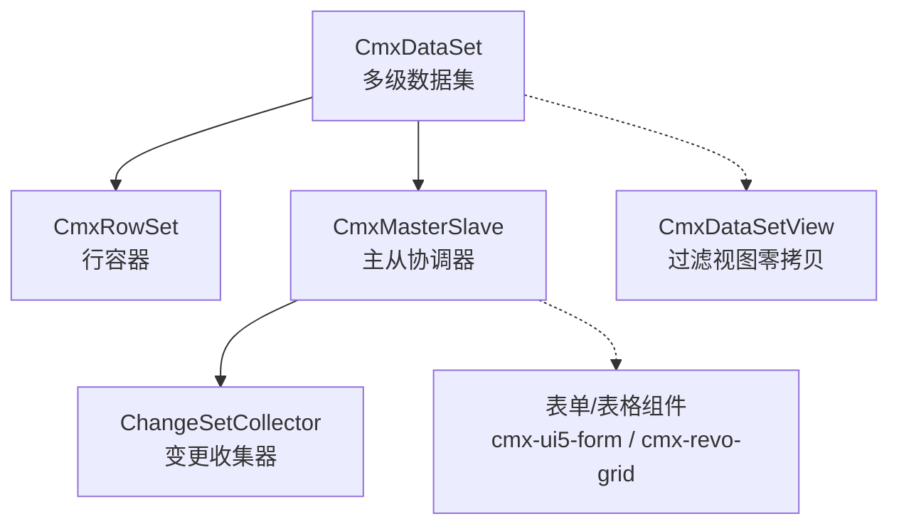
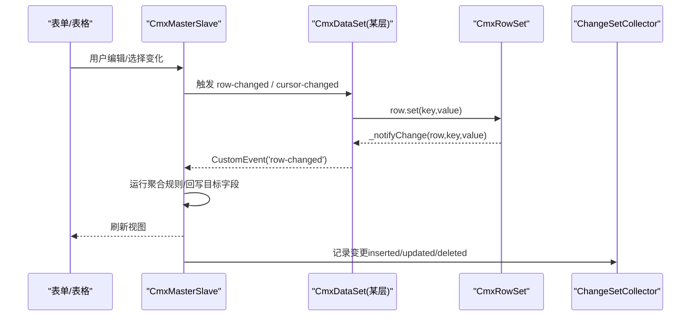
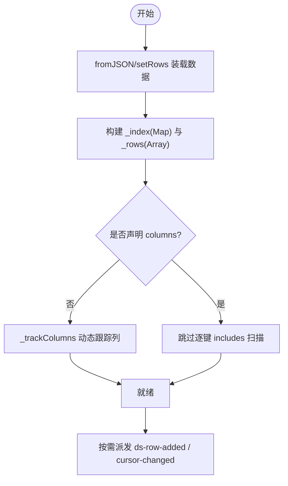
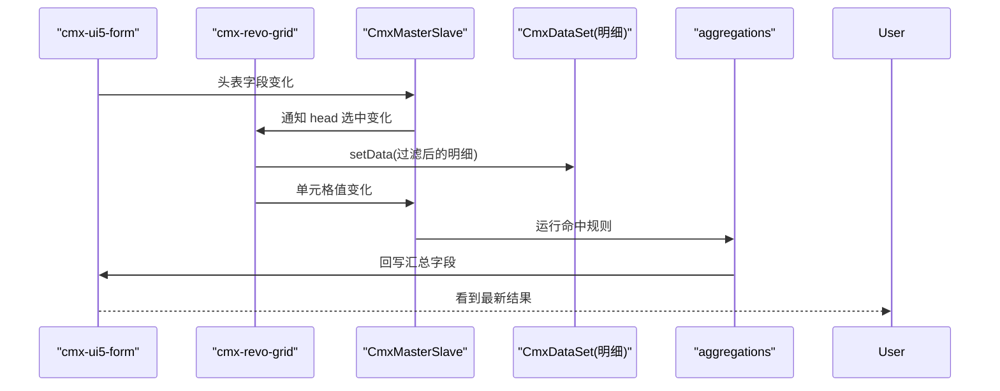
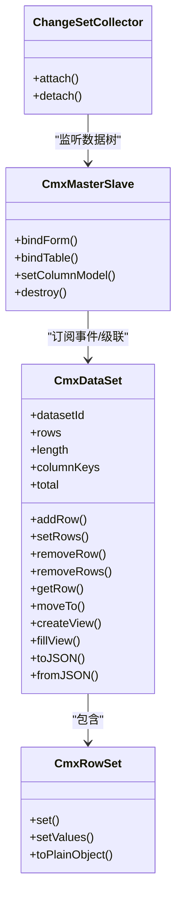

# 数据集（CmxDataSet）

<cite>
**本文引用的文件**
- [cmx-data-set.js](file://packages/cmx-data-comp/src/lib/cmx-data-set.js)
- [cmx-row-set.js](file://packages/cmx-data-comp/src/lib/cmx-row-set.js)
- [cmx-master-slave.js](file://packages/cmx-data-comp/src/lib/cmx-master-slave.js)
- [cmx-doc-source.js](file://packages/cmx-data-comp/src/lib/cmx-doc-source.js)
- [model-dataset.md](file://.agents/skills/html-page-generator/references/model-dataset.md)
- [model-master-slave.md](file://.agents/skills/html-page-generator/references/model-master-slave.md)
- [09-主从协调器-CmxMasterSlave.md](file://docs/CMXPortalManager+CMXHTMLDesigner-模型体系文档/09-主从协调器-CmxMasterSlave.md)
- [业务单据数据装载与前端模型映射方案.md](file://docs/业务单据数据装载与前端模型映射方案.md)
</cite>

## 目录
1. [简介](#简介)
2. [项目结构](#项目结构)
3. [核心组件](#核心组件)
4. [架构总览](#架构总览)
5. [详细组件分析](#详细组件分析)
6. [依赖关系分析](#依赖关系分析)
7. [性能考量](#性能考量)
8. [故障排查指南](#故障排查指南)
9. [结论](#结论)
10. [附录：使用示例与最佳实践](#附录使用示例与最佳实践)

## 简介
本章节面向 CMX 数据组件库中的数据集能力，围绕 CmxDataSet 的核心功能展开，包括数据加载、缓存策略、变更追踪、性能优化机制；阐述数据集生命周期管理（行操作、游标管理、事件派发）；说明与主从协调器的集成、实时数据更新与状态一致性保证；并提供批量操作、事务处理与错误恢复的实践建议，以及内存管理与大数据集处理的优化要点。

## 项目结构
CmxDataSet 位于 cmx-data-comp 包的 lib 层，作为多级数据集的运行时容器，配合 CmxRowSet（行容器）、CmxMasterSlave（主从协调器）和 ChangeSetCollector（变更收集器）共同构成“数据装载—视图绑定—变更聚合—持久化”的完整链路。

图表来源
- [cmx-data-set.js:37-232](file://packages/cmx-data-comp/src/lib/cmx-data-set.js#L37-L232)
- [cmx-row-set.js:10-53](file://packages/cmx-data-comp/src/lib/cmx-row-set.js#L10-L53)
- [cmx-master-slave.js:41-167](file://packages/cmx-data-comp/src/lib/cmx-master-slave.js#L41-L167)
- [cmx-doc-source.js:365-398](file://packages/cmx-data-comp/src/lib/cmx-doc-source.js#L365-L398)

章节来源
- [cmx-data-set.js:37-232](file://packages/cmx-data-comp/src/lib/cmx-data-set.js#L37-L232)
- [cmx-row-set.js:10-53](file://packages/cmx-data-comp/src/lib/cmx-row-set.js#L10-L53)
- [cmx-master-slave.js:41-167](file://packages/cmx-data-comp/src/lib/cmx-master-slave.js#L41-L167)
- [cmx-doc-source.js:365-398](file://packages/cmx-data-comp/src/lib/cmx-doc-source.js#L365-L398)

## 核心组件
- CmxDataSet：多级数据集，维护行数组、索引 Map、列提示、游标、总数等；提供增删改查、序列化、视图创建、与主从协调器互转等能力。
- CmxRowSet：单行容器，字段直接以实例属性存储，修改通过 set/setValues 统一上报变更。
- CmxMasterSlave：主从协调器，负责 schema 注册、视图绑定、当前行级联、聚合计算、事件分发与分页状态。
- ChangeSetCollector：监听 ds-row-added/ds-row-removed/row-changed，按路径收集插入、更新、删除集合，供保存/对账使用。

章节来源
- [cmx-data-set.js:37-232](file://packages/cmx-data-comp/src/lib/cmx-data-set.js#L37-L232)
- [cmx-row-set.js:10-53](file://packages/cmx-data-comp/src/lib/cmx-row-set.js#L10-L53)
- [cmx-master-slave.js:41-167](file://packages/cmx-data-comp/src/lib/cmx-master-slave.js#L41-L167)
- [cmx-doc-source.js:365-398](file://packages/cmx-data-comp/src/lib/cmx-doc-source.js#L365-L398)

## 架构总览
CmxDataSet 作为数据树的节点，既承载本地行数据，又通过 row._children 挂接子数据集，形成可无限深的树形结构。CmxMasterSlave 在 setDataSet 时递归接管各层 CmxDataSet，为每层注册 row-changed/cursor-changed/ds-row-added/ds-row-removed 监听，并执行 _primeCursors 定位首行、自上而下点亮子层视图。ChangeSetCollector 在装载后 attach，持续收集变更用于后续保存与一致性校验。

图表来源
- [cmx-master-slave.js:41-167](file://packages/cmx-data-comp/src/lib/cmx-master-slave.js#L41-L167)
- [cmx-data-set.js:195-232](file://packages/cmx-data-comp/src/lib/cmx-data-set.js#L195-L232)
- [cmx-row-set.js:22-43](file://packages/cmx-data-comp/src/lib/cmx-row-set.js#L22-L43)
- [cmx-doc-source.js:365-398](file://packages/cmx-data-comp/src/lib/cmx-doc-source.js#L365-L398)

## 详细组件分析

### CmxDataSet：数据加载、缓存、变更与性能
- 数据加载
  - fromJSON：支持列式包还原，含 childRows 递归重建；自动设置 total（后端 count_total=true）。
  - setRows：批量覆盖，重置索引与游标，最后统一派发 cursor-changed。
  - toPlainRows/exportColumnar/toJSON：多种导出形态，便于传输或持久化。
- 缓存策略
  - 行索引 Map：_index 以 String(id) 为键，O(1) 查找，兼容 number/string 主键。
  - 列提示：_columns 由首次写入动态跟踪，影响 toJSON 列顺序。
  - 视图零拷贝：createView/fillView 仅持有 CmxRowSet 引用，不复制字段数据。
- 变更追踪
  - 通过 CmxRowSet.set/setValues 调用 _ds._notifyChange，在当前 CmxDataSet 派发 row-changed。
  - 行增删：addRow/removeRow/removeRows 派发 ds-row-added/ds-row-removed，并在必要时派发 cursor-changed。
- 性能优化
  - 无 Proxy 的行对象，V8 可完整优化。
  - fromJSON 批量快路径：避免逐行事件与重复列扫描；对象展开重整 fast-shape 提升 Object.assign 性能。
  - 游标批量调整：removeRows 内部合并 cursor-changed 派发，减少重渲染。

图表来源
- [cmx-data-set.js:96-108](file://packages/cmx-data-comp/src/lib/cmx-data-set.js#L96-L108)
- [cmx-data-set.js:372-410](file://packages/cmx-data-comp/src/lib/cmx-data-set.js#L372-L410)
- [cmx-data-set.js:68-74](file://packages/cmx-data-comp/src/lib/cmx-data-set.js#L68-L74)

章节来源
- [cmx-data-set.js:37-232](file://packages/cmx-data-comp/src/lib/cmx-data-set.js#L37-L232)
- [cmx-data-set.js:292-410](file://packages/cmx-data-comp/src/lib/cmx-data-set.js#L292-L410)

### CmxRowSet：行容器与变更上报
- 字段以实例属性存储，无代理开销。
- set/setValues 统一入口，确保每次变更都上报到所属 CmxDataSet。
- toPlainObject 过滤内部属性（以下划线开头），便于安全导出。

章节来源
- [cmx-row-set.js:10-53](file://packages/cmx-data-comp/src/lib/cmx-row-set.js#L10-L53)

### 主从协调器集成：实时同步与一致性
- 视图绑定：bindForm/bindTable 将 DOM 组件与 schema path 关联，支持 editable 控制。
- 当前行级联：当父层选中变化时，级联刷新下级视图的数据源。
- 聚合计算：根据 aggregations 配置，命中 from 的规则进行求值并回写 toField。
- 事件派发：对外派发 change/select/aggregate 等事件，供业务监听。
- 与 CmxDataSet 的协作：setDataSet 时递归接管各层数据集，注册监听并预热游标。

图表来源
- [cmx-master-slave.js:117-139](file://packages/cmx-data-comp/src/lib/cmx-master-slave.js#L117-L139)
- [09-主从协调器-CmxMasterSlave.md:182-204](file://docs/CMXPortalManager+CMXHTMLDesigner-模型体系文档/09-主从协调器-CmxMasterSlave.md#L182-L204)
- [model-master-slave.md:180-228](file://.agents/skills/html-page-generator/references/model-master-slave.md#L180-L228)

章节来源
- [cmx-master-slave.js:41-167](file://packages/cmx-data-comp/src/lib/cmx-master-slave.js#L41-L167)
- [09-主从协调器-CmxMasterSlave.md:182-204](file://docs/CMXPortalManager+CMXHTMLDesigner-模型体系文档/09-主从协调器-CmxMasterSlave.md#L182-L204)
- [model-master-slave.md:180-228](file://.agents/skills/html-page-generator/references/model-master-slave.md#L180-L228)

### 变更收集与持久化：ChangeSetCollector
- attach：遍历协调器所有层 ds，注册 ds-row-added/ds-row-removed/row-changed 监听。
- 收集语义：按 path 维护 inserted/updated/deleted 集合，支持后续 saveDoc 与对账。
- detach：销毁时解绑，防止内存泄漏。

章节来源
- [cmx-doc-source.js:365-398](file://packages/cmx-data-comp/src/lib/cmx-doc-source.js#L365-L398)
- [cmx-master-slave.js:141-167](file://packages/cmx-data-comp/src/lib/cmx-master-slave.js#L141-L167)

## 依赖关系分析
- CmxDataSet 依赖 CmxRowSet 作为行载体，并通过 registerDataSetViewClass 延迟注入视图类，避免循环依赖。
- CmxMasterSlave 依赖 CmxDataSet 提供的数据集与事件，同时依赖 CmxColumnModel 执行 calcFormula。
- ChangeSetCollector 依赖 CmxMasterSlave 暴露的数据树结构，监听其底层数据集事件。

图表来源
- [cmx-data-set.js:37-232](file://packages/cmx-data-comp/src/lib/cmx-data-set.js#L37-L232)
- [cmx-row-set.js:10-53](file://packages/cmx-data-comp/src/lib/cmx-row-set.js#L10-L53)
- [cmx-master-slave.js:41-167](file://packages/cmx-data-comp/src/lib/cmx-master-slave.js#L41-L167)
- [cmx-doc-source.js:365-398](file://packages/cmx-data-comp/src/lib/cmx-doc-source.js#L365-L398)

章节来源
- [cmx-data-set.js:37-232](file://packages/cmx-data-comp/src/lib/cmx-data-set.js#L37-L232)
- [cmx-master-slave.js:41-167](file://packages/cmx-data-comp/src/lib/cmx-master-slave.js#L41-L167)
- [cmx-doc-source.js:365-398](file://packages/cmx-data-comp/src/lib/cmx-doc-source.js#L365-L398)

## 性能考量
- 行对象无代理：CmxRowSet 字段直接以实例属性存储，利于 V8 优化。
- 批量装载快路径：fromJSON 中避免逐行事件与重复列扫描，对象展开重整 fast-shape 提升赋值性能。
- 索引 O(1) 查找：_index 使用 Map，key 统一为字符串，兼容数字主键。
- 游标批量调整：removeRows 内部合并 cursor-changed 派发，降低重渲染次数。
- 视图零拷贝：createView/fillView 仅引用原行，避免复制开销。
- 分页支持：total/_paging/_lastTotal 等字段辅助分页计算与调试。

章节来源
- [cmx-data-set.js:68-74](file://packages/cmx-data-comp/src/lib/cmx-data-set.js#L68-L74)
- [cmx-data-set.js:96-108](file://packages/cmx-data-comp/src/lib/cmx-data-set.js#L96-L108)
- [cmx-data-set.js:137-148](file://packages/cmx-data-comp/src/lib/cmx-data-set.js#L137-L148)
- [cmx-data-set.js:372-410](file://packages/cmx-data-comp/src/lib/cmx-data-set.js#L372-L410)
- [cmx-master-slave.js:74-79](file://packages/cmx-data-comp/src/lib/cmx-master-slave.js#L74-L79)

## 故障排查指南
- createView 报错：需先 import 视图模块以注册 CmxDataSetView 类。
- 主键类型不一致导致无法删除：_index 键统一为字符串，若外部传入数字 id，请确保一致比较或使用 getRow(String(id))。
- 批量删除后游标异常：removeRows 会尽量修正游标，若仍异常，检查是否在批量过程中手动移动了游标。
- 主从协调器未生效：确认 bindForm/bindTable 已正确绑定，且 schema path 存在；检查 setDataSet 是否被调用。
- 聚合未回写：检查 aggregations 配置的 from/to 路径与 scope，确认 row-changed 事件已触发。
- 内存泄漏：页面销毁时调用 ms.destroy()，确保解绑所有 DOM 事件与 ds 监听。

章节来源
- [cmx-data-set.js:225-232](file://packages/cmx-data-comp/src/lib/cmx-data-set.js#L225-L232)
- [cmx-data-set.js:110-148](file://packages/cmx-data-comp/src/lib/cmx-data-set.js#L110-L148)
- [cmx-master-slave.js:141-167](file://packages/cmx-data-comp/src/lib/cmx-master-slave.js#L141-L167)
- [model-dataset.md:118-174](file://.agents/skills/html-page-generator/references/model-dataset.md#L118-L174)

## 结论
CmxDataSet 提供了高性能、可扩展的多级数据集能力，结合 CmxMasterSlave 的主从协调与 ChangeSetCollector 的变更收集，实现了从数据装载、视图绑定、实时聚合到持久化的完整闭环。通过零拷贝视图、批量装载快路径、O(1) 索引与游标批量调整等优化手段，能够胜任企业级大数据集场景。遵循本文的最佳实践，可在保证一致性的前提下获得更优的性能与可维护性。

## 附录：使用示例与最佳实践

### 数据装载与绑定
- 推荐方式：使用主从协调器声明式绑定，DOM 上指定 data-cmx-master-slave-id、data-cmx-dataset-id、data-cmx-kind、data-cmx-model-id，initPageModels 会自动完成绑定。
- 复杂场景：命令式调用 ms.bindForm/ms.bindTable，再调用 ms.setData({ tables }) 注入 CmxDataSet 树。

章节来源
- [model-dataset.md:152-174](file://.agents/skills/html-page-generator/references/model-dataset.md#L152-L174)
- [model-master-slave.md:180-228](file://.agents/skills/html-page-generator/references/model-master-slave.md#L180-L228)
- [业务单据数据装载与前端模型映射方案.md:426-449](file://docs/业务单据数据装载与前端模型映射方案.md#L426-L449)

### 行操作与游标管理
- 新增行：addRow(data, children?) 返回 CmxRowSet，并派发 ds-row-added。
- 批量覆盖：setRows(dataArray, childMap?) 重置索引与游标，最后派发一次 cursor-changed。
- 删除行：removeRow(id)/removeRows(ids) 支持批量，内部修正游标并派发相应事件。
- 游标移动：moveTo/moveFirst/moveLast/moveNext/movePrev/moveToId，变化时派发 cursor-changed。

章节来源
- [cmx-data-set.js:82-108](file://packages/cmx-data-comp/src/lib/cmx-data-set.js#L82-L108)
- [cmx-data-set.js:110-193](file://packages/cmx-data-comp/src/lib/cmx-data-set.js#L110-L193)

### 事件与脚本
- 数据集事件：ds-row-added、ds-row-removed、cursor-changed、row-changed。
- 协调器事件：change、select、aggregate。
- 脚本环境：event.detail 携带行、键、值等信息，this 指向当前数据集实例，可访问宿主上下文。

章节来源
- [model-dataset.md:118-174](file://.agents/skills/html-page-generator/references/model-dataset.md#L118-L174)
- [model-master-slave.md:270-291](file://.agents/skills/html-page-generator/references/model-master-slave.md#L270-L291)

### 批量操作与事务处理
- 批量装载：优先使用 fromJSON/setRows，利用快路径减少事件与列扫描。
- 批量删除：使用 removeRows 合并游标事件派发。
- 事务一致性：后端保存采用原子事务（save_batch atomic=true），任一失败整体回滚；前端通过 ChangeSetCollector 收集变更，配合后端校验与版本快照保证一致性。

章节来源
- [cmx-data-set.js:96-108](file://packages/cmx-data-comp/src/lib/cmx-data-set.js#L96-L108)
- [cmx-doc-source.js:365-398](file://packages/cmx-data-comp/src/lib/cmx-doc-source.js#L365-L398)
- [三元定义体系架构文档.md:1575-1615](file://docs/三元定义体系架构文档.md#L1575-L1615)

### 内存管理与大数据集处理
- 零拷贝视图：使用 createView/fillView 复用同一视图实例与底层行引用，避免重复分配。
- 释放资源：页面销毁时调用 ms.destroy() 解绑事件与监听，防止内存泄漏。
- 分页与总数：启用 enablePaging 后，利用 total/_paging/_lastTotal 进行分页计算与调试。
- 大表展示：结合虚拟滚动/分页与视图过滤，减少一次性渲染行数。

章节来源
- [cmx-data-set.js:217-251](file://packages/cmx-data-comp/src/lib/cmx-data-set.js#L217-L251)
- [cmx-master-slave.js:141-167](file://packages/cmx-data-comp/src/lib/cmx-master-slave.js#L141-L167)
- [cmx-master-slave.js:74-79](file://packages/cmx-data-comp/src/lib/cmx-master-slave.js#L74-L79)