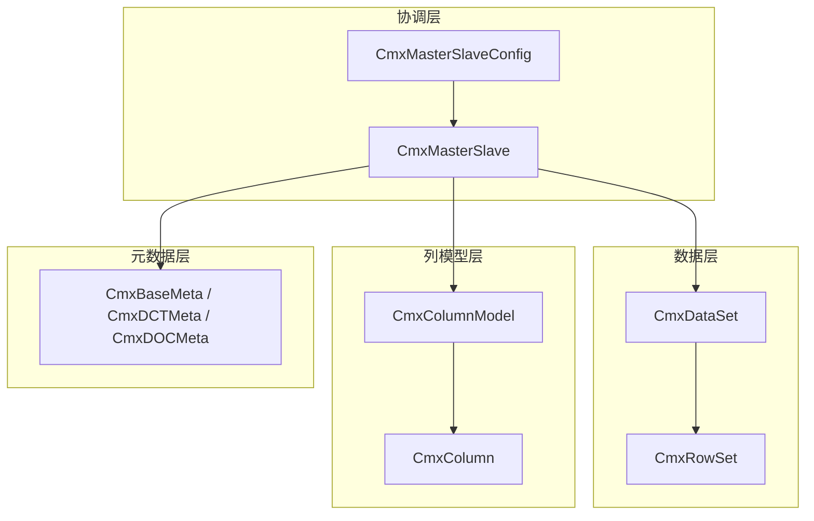
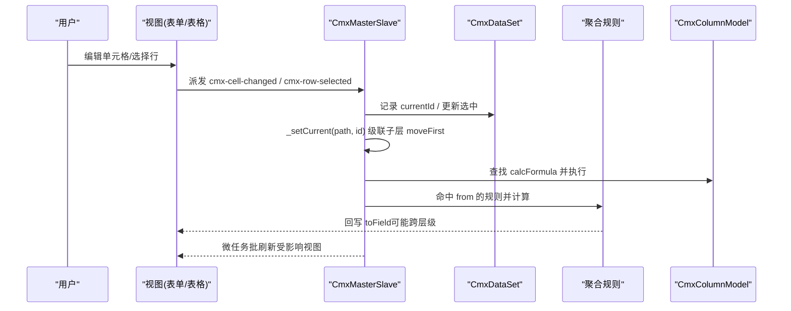
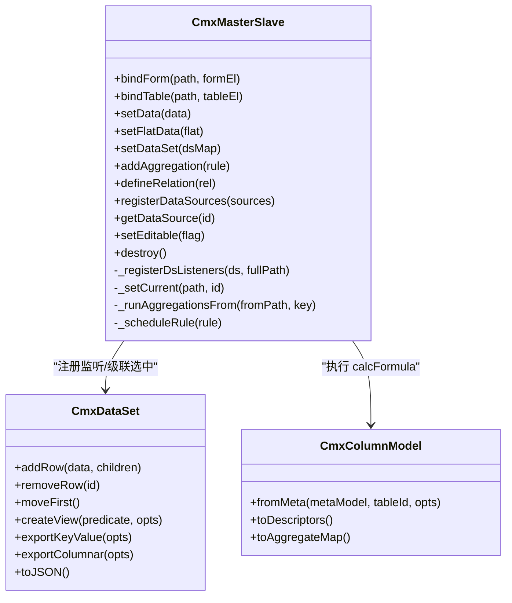
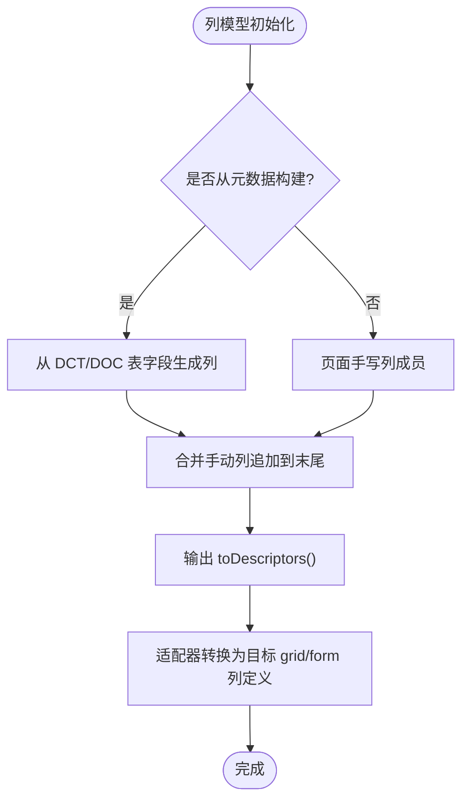
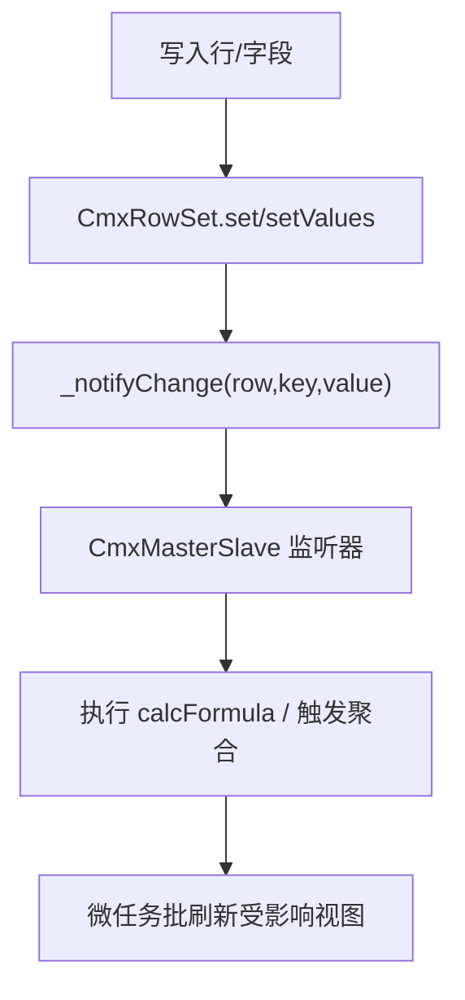
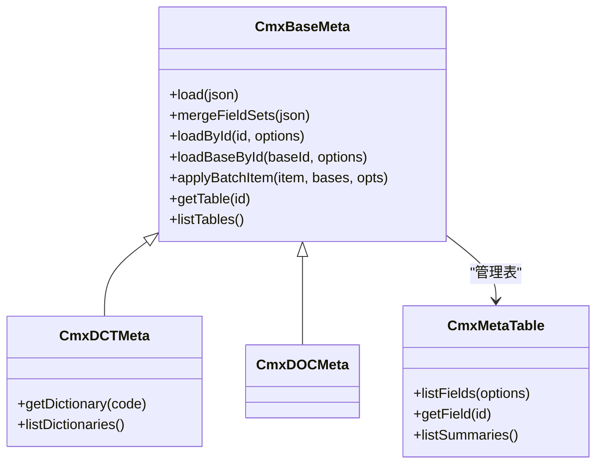
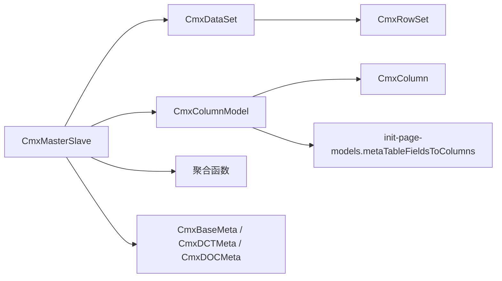

# 核心架构与数据模型

<cite>
**本文引用的文件**
- [cmx-master-slave.js](file://packages/cmx-data-comp/src/lib/cmx-master-slave.js)
- [cmx-column-model.js](file://packages/cmx-data-comp/src/lib/cmx-column-model.js)
- [cmx-data-set.js](file://packages/cmx-data-comp/src/lib/cmx-data-set.js)
- [cmx-meta-model.js](file://packages/cmx-data-comp/src/lib/cmx-meta-model.js)
- [cmx-column.js](file://packages/cmx-data-comp/src/lib/cmx-column.js)
- [cmx-row-set.js](file://packages/cmx-data-comp/src/lib/cmx-row-set.js)
- [cmx-master-slave-config.js](file://packages/cmx-data-comp/src/components/cmx-master-slave-config.js)
- [09-主从协调器-CmxMasterSlave.md](file://docs/CMXPortalManager+CMXHTMLDesigner-模型体系文档/09-主从协调器-CmxMasterSlave.md)
</cite>

## 目录
1. [简介](#简介)
2. [项目结构](#项目结构)
3. [核心组件](#核心组件)
4. [架构总览](#架构总览)
5. [详细组件分析](#详细组件分析)
6. [依赖关系分析](#依赖关系分析)
7. [性能考量](#性能考量)
8. [故障排查指南](#故障排查指南)
9. [结论](#结论)
10. [附录：协作示例与最佳实践](#附录协作示例与最佳实践)

## 简介
本文件面向 CMX 数据组件库的核心架构，聚焦以下目标：
- 深入解释主从协调机制（CmxMasterSlave）的工作原理：父子关系管理、数据同步、事件处理与聚合计算。
- 详细说明列模型（CmxColumnModel）的设计模式：字段定义、验证规则、格式化配置与编辑器绑定。
- 阐述数据集（CmxDataSet）的数据管理机制：数据加载、缓存策略、变更追踪与性能优化。
- 说明元数据模型（CmxMetaModel）的层次结构与扩展机制。
- 提供完整的代码级协作示例与最佳实践路径，帮助读者快速上手并避免常见陷阱。

## 项目结构
CMX 数据组件库位于 packages/cmx-data-comp/src/lib 下，核心模块职责清晰：
- CmxMasterSlave：多表主从协调器，负责 schema、视图绑定、选中行联动、聚合计算与事件分发。
- CmxDataSet/CmxRowSet：多级数据集与行容器，维护行集合、游标、子树与变更事件。
- CmxColumnModel/CmxColumn：列模型与单列定义，输出通用描述符供适配器转换为具体 UI 列。
- CmxMetaModel（含 CmxDCTMeta/CmxDOCMeta）：元数据装载、字段集共享、表/字段访问与批量加载。
- cmx-master-slave-config：声明式自启动元素，解析 JSON 配置并自动创建协调器与绑定视图。

图表来源
- [cmx-master-slave.js:1-85](file://packages/cmx-data-comp/src/lib/cmx-master-slave.js#L1-L85)
- [cmx-data-set.js:1-51](file://packages/cmx-data-comp/src/lib/cmx-data-set.js#L1-L51)
- [cmx-column-model.js:1-29](file://packages/cmx-data-comp/src/lib/cmx-column-model.js#L1-L29)
- [cmx-meta-model.js:347-404](file://packages/cmx-data-comp/src/lib/cmx-meta-model.js#L347-L404)
- [cmx-master-slave-config.js:1-65](file://packages/cmx-data-comp/src/components/cmx-master-slave-config.js#L1-L65)

章节来源
- [cmx-master-slave.js:1-85](file://packages/cmx-data-comp/src/lib/cmx-master-slave.js#L1-L85)
- [cmx-data-set.js:1-51](file://packages/cmx-data-comp/src/lib/cmx-data-set.js#L1-L51)
- [cmx-column-model.js:1-29](file://packages/cmx-data-comp/src/lib/cmx-column-model.js#L1-L29)
- [cmx-meta-model.js:347-404](file://packages/cmx-data-comp/src/lib/cmx-meta-model.js#L347-L404)
- [cmx-master-slave-config.js:1-65](file://packages/cmx-data-comp/src/components/cmx-master-slave-config.js#L1-L65)

## 核心组件
- CmxMasterSlave：持有递归主从数据树；按 path 注册表单/表格视图；维护当前选中行并级联刷新下级；监听单元格/行变更，运行聚合规则回写目标字段；支持 setData/setFlatData/setDataSet 多种数据入口；提供 DataSource 注册与分页状态。
- CmxDataSet：以 CmxRowSet[] 存储行，row._children[childId] = CmxDataSet 形成树；维护游标与索引；派发 row-changed/cursor-changed/ds-row-added/ds-row-removed；提供过滤视图 createView/fillView 零拷贝投影；支持 toPlainRows/exportKeyValue/exportColumnar 等导出能力。
- CmxColumnModel：组织 CmxColumn/CmxColumnGroup 为完整列配置方案；支持 fromMeta 从 DCT/DOC 元数据动态构建列；输出 toDescriptors/toAggregateMap；触发 columns-changed 通知视图重刷。
- CmxColumn：单列定义对象；display/edit 结构化配置；calcFormula/validate/formatter/dependents 等运行时行为；toDescriptor 输出通用中间格式给适配器。
- CmxMetaModel：CmxBaseMeta 作为基类，CmxDCTMeta/CmxDOCMeta 分别对应字典/单据；支持 loadById/loadMetaBatch/loadMetaModelsBatch；字段集共享与懒展开；冻结原始数据保证只读安全。

章节来源
- [cmx-master-slave.js:1-85](file://packages/cmx-data-comp/src/lib/cmx-master-slave.js#L1-L85)
- [cmx-data-set.js:1-51](file://packages/cmx-data-comp/src/lib/cmx-data-set.js#L1-L51)
- [cmx-column-model.js:1-29](file://packages/cmx-data-comp/src/lib/cmx-column-model.js#L1-L29)
- [cmx-column.js:1-80](file://packages/cmx-data-comp/src/lib/cmx-column.js#L1-L80)
- [cmx-meta-model.js:347-404](file://packages/cmx-data-comp/src/lib/cmx-meta-model.js#L347-L404)

## 架构总览
下图展示“用户操作 → 视图事件 → 协调器 → 数据集 → 聚合/公式 → 视图刷新”的端到端流程。

图表来源
- [cmx-master-slave.js:357-417](file://packages/cmx-data-comp/src/lib/cmx-master-slave.js#L357-L417)
- [cmx-master-slave.js:705-740](file://packages/cmx-data-comp/src/lib/cmx-master-slave.js#L705-L740)
- [cmx-master-slave.js:755-798](file://packages/cmx-data-comp/src/lib/cmx-master-slave.js#L755-L798)
- [cmx-column-model.js:181-195](file://packages/cmx-data-comp/src/lib/cmx-column-model.js#L181-L195)

## 详细组件分析

### 主从协调器（CmxMasterSlave）
- 父子关系管理
  - 通过 schema 注册节点树（id/path/parent/children），_schemaById 索引所有路径。
  - setDataSet 时递归遍历 CmxDataSet 树，为每个子数据集注册 row-changed/cursor-changed/ds-row-added/ds-row-removed 监听，并携带 fullPath 以便精准定位。
- 数据同步
  - bindForm/bindTable 将视图按 path 注册；_resolveWrap 根据当前选中行解析目标 ds 引用；_renderView 在 ds 引用切换时调用 view.setDataSet。
  - _primeCursors 在数据装载后 moveFirst 根层，驱动自上而下级联点亮子层视图。
- 事件处理与聚合
  - 监听 cmx-cell-changed/cmx-row-added/cmx-row-removed，按 from-path 反向索引仅运行命中规则。
  - 聚合函数 sum/avg/min/max/count 内置；scope 控制整树或上下文范围；_scheduleRule/_flushRules 实现微任务批刷新，避免重复渲染。
- 数据入口
  - setData：接受嵌套树或 {tables} 映射；setFlatData：平铺 + relations 构建树；setDataSet：直接接管已有 CmxDataSet 树，零拷贝。
- 其他能力
  - registerDataSources/getDataSource：为表单/表格提供下拉数据源。
  - setEditable/isEditable：统一切换已绑定视图编辑态。
  - destroy：解绑 DOM 事件与 ds 监听，释放内存。

图表来源
- [cmx-master-slave.js:41-85](file://packages/cmx-data-comp/src/lib/cmx-master-slave.js#L41-L85)
- [cmx-master-slave.js:117-139](file://packages/cmx-data-comp/src/lib/cmx-master-slave.js#L117-L139)
- [cmx-master-slave.js:317-350](file://packages/cmx-data-comp/src/lib/cmx-master-slave.js#L317-L350)
- [cmx-master-slave.js:705-740](file://packages/cmx-data-comp/src/lib/cmx-master-slave.js#L705-L740)
- [cmx-data-set.js:82-108](file://packages/cmx-data-comp/src/lib/cmx-data-set.js#L82-L108)
- [cmx-column-model.js:89-158](file://packages/cmx-data-comp/src/lib/cmx-column-model.js#L89-L158)

章节来源
- [cmx-master-slave.js:117-139](file://packages/cmx-data-comp/src/lib/cmx-master-slave.js#L117-L139)
- [cmx-master-slave.js:317-350](file://packages/cmx-data-comp/src/lib/cmx-master-slave.js#L317-L350)
- [cmx-master-slave.js:357-417](file://packages/cmx-data-comp/src/lib/cmx-master-slave.js#L357-L417)
- [cmx-master-slave.js:705-740](file://packages/cmx-data-comp/src/lib/cmx-master-slave.js#L705-L740)
- [cmx-master-slave.js:755-798](file://packages/cmx-data-comp/src/lib/cmx-master-slave.js#L755-L798)

### 列模型（CmxColumnModel）与列（CmxColumn）
- 设计模式
  - CmxColumnModel 是纯元数据容器，不关心渲染细节；通过 toDescriptors 输出通用中间格式，交由适配器转换为具体 grid/form 列定义。
  - CmxColumn 将 display/edit 结构化，保留向后兼容别名（如 displayMask→display.format、validateFormula→edit.validate）。
- 字段定义与验证
  - dataType/length/integerDigits/decimalDigits 决定物理类型与精度；requiredWhen/validateWhen/readonlyWhen 提供条件化行为；validate 支持预设/函数。
- 格式化与编辑器绑定
  - display.format 支持千分位/百分比/货币/日期等预设或自定义函数；edit.mode 统一控件域（input/number/date/ref/dict-select 等）；source/valueField/displayTemplate 用于下拉/引用场景。
- 元数据驱动
  - fromMeta 可从 CmxDCTMeta/CmxDOCMeta 动态生成列，并回填 refDict 的 coord 信息，确保字典弹窗请求参数完整。
- 聚合配置
  - toAggregateMap 汇总各列 agg 类型，驱动合计行或后端聚合。

图表来源
- [cmx-column-model.js:89-158](file://packages/cmx-data-comp/src/lib/cmx-column-model.js#L89-L158)
- [cmx-column.js:128-200](file://packages/cmx-data-comp/src/lib/cmx-column.js#L128-L200)

章节来源
- [cmx-column-model.js:1-29](file://packages/cmx-data-comp/src/lib/cmx-column-model.js#L1-L29)
- [cmx-column-model.js:89-158](file://packages/cmx-data-comp/src/lib/cmx-column-model.js#L89-L158)
- [cmx-column.js:1-80](file://packages/cmx-data-comp/src/lib/cmx-column.js#L1-L80)
- [cmx-column.js:128-200](file://packages/cmx-data-comp/src/lib/cmx-column.js#L128-L200)

### 数据集（CmxDataSet）数据管理
- 数据加载与树形结构
  - addRow/setRows 支持 children 映射，形成 row._children[childId] = CmxDataSet 的多级树；fromJSON 可重建整棵树并恢复 total。
- 缓存策略
  - 内部使用 Map 索引 id→row（O(1) 查找）；columnKeys 缓存列提示；createView/fillView 提供零拷贝过滤视图，避免复制数据。
- 变更追踪
  - CmxRowSet.set/setValues 统一入口，调用所属 ds 的 _notifyChange 派发 row-changed；ds 在 removeRow/removeRows 中维护 cursor 并派发 cursor-changed。
- 性能优化
  - fromJSON 采用批量快路径构造对象，减少慢形态 dictionary mode；_trackColumns 仅在新增列时扫描；_dsListeners 集中管理监听，销毁时统一解绑。

图表来源
- [cmx-row-set.js:22-43](file://packages/cmx-data-comp/src/lib/cmx-row-set.js#L22-L43)
- [cmx-data-set.js:195-207](file://packages/cmx-data-comp/src/lib/cmx-data-set.js#L195-L207)
- [cmx-master-slave.js:357-417](file://packages/cmx-data-comp/src/lib/cmx-master-slave.js#L357-L417)
- [cmx-master-slave.js:772-798](file://packages/cmx-data-comp/src/lib/cmx-master-slave.js#L772-L798)

章节来源
- [cmx-data-set.js:82-108](file://packages/cmx-data-comp/src/lib/cmx-data-set.js#L82-L108)
- [cmx-data-set.js:150-193](file://packages/cmx-data-comp/src/lib/cmx-data-set.js#L150-L193)
- [cmx-data-set.js:215-251](file://packages/cmx-data-comp/src/lib/cmx-data-set.js#L215-L251)
- [cmx-data-set.js:372-410](file://packages/cmx-data-comp/src/lib/cmx-data-set.js#L372-L410)

### 元数据模型（CmxMetaModel）层次与扩展
- 层次结构
  - CmxBaseMeta：统一加载、字段集合并、表/字段访问、批量加载接口；CmxDCTMeta/CmxDOCMeta 分别封装字典/单据入口。
  - CmxMetaTable：表级元数据，支持 fieldSets 与 inlineFields 组合、顺序控制（fieldSetOrder）、汇总（summaries）。
  - CmxMetaFieldSet/CmxMetaFieldRef：字段集与轻量引用，避免重复存储字段对象。
- 扩展机制
  - loadById/loadMetaBatch/loadMetaModelsBatch：支持 resolver/serviceFn/fetch 三种后端调用方式；批量响应内联 base 字段集，减少网络往返。
  - mergeFieldSets：就地合并字段集并重建表字段引用缓存。
  - applyBatchItem：将批量结果就地灌入既有实例，避免新建对象。

图表来源
- [cmx-meta-model.js:347-404](file://packages/cmx-data-comp/src/lib/cmx-meta-model.js#L347-L404)
- [cmx-meta-model.js:418-469](file://packages/cmx-data-comp/src/lib/cmx-meta-model.js#L418-L469)
- [cmx-meta-model.js:669-733](file://packages/cmx-data-comp/src/lib/cmx-meta-model.js#L669-L733)
- [cmx-dct-meta.js:1-22](file://packages/cmx-data-comp/src/lib/cmx-dct-meta.js#L1-L22)

章节来源
- [cmx-meta-model.js:347-404](file://packages/cmx-data-comp/src/lib/cmx-meta-model.js#L347-L404)
- [cmx-meta-model.js:418-469](file://packages/cmx-data-comp/src/lib/cmx-meta-model.js#L418-L469)
- [cmx-meta-model.js:669-733](file://packages/cmx-data-comp/src/lib/cmx-meta-model.js#L669-L733)
- [cmx-dct-meta.js:1-22](file://packages/cmx-data-comp/src/lib/cmx-dct-meta.js#L1-L22)

## 依赖关系分析
- CmxMasterSlave 依赖 CmxDataSet（数据树）、CmxColumnModel（calcFormula 执行）、聚合函数与事件系统。
- CmxDataSet 依赖 CmxRowSet（行容器）与可选的 CmxDataSetView（过滤视图）。
- CmxColumnModel 依赖 CmxColumn/CmxColumnGroup 与 init-page-models 中的 metaTableFieldsToColumns（动态导入避免循环依赖）。
- CmxMetaModel 提供 loadById/loadMetaBatch 等能力，被 CmxColumnModel.fromMeta 用于运行时动态列构建。

图表来源
- [cmx-master-slave.js:1-85](file://packages/cmx-data-comp/src/lib/cmx-master-slave.js#L1-L85)
- [cmx-data-set.js:1-51](file://packages/cmx-data-comp/src/lib/cmx-data-set.js#L1-L51)
- [cmx-column-model.js:89-158](file://packages/cmx-data-comp/src/lib/cmx-column-model.js#L89-L158)
- [cmx-meta-model.js:669-733](file://packages/cmx-data-comp/src/lib/cmx-meta-model.js#L669-L733)

章节来源
- [cmx-master-slave.js:1-85](file://packages/cmx-data-comp/src/lib/cmx-master-slave.js#L1-L85)
- [cmx-data-set.js:1-51](file://packages/cmx-data-comp/src/lib/cmx-data-set.js#L1-L51)
- [cmx-column-model.js:89-158](file://packages/cmx-data-comp/src/lib/cmx-column-model.js#L89-L158)
- [cmx-meta-model.js:669-733](file://packages/cmx-data-comp/src/lib/cmx-meta-model.js#L669-L733)

## 性能考量
- 微任务批刷新：_scheduleRule 将多次规则执行合并为一次视图刷新，降低重绘开销。
- 零拷贝视图：createView/fillView 仅持有 CmxRowSet 引用，避免数据复制。
- 批量装载：fromJSON 使用批量快路径构造对象，减少慢形态影响。
- 监听管理：_dsListeners 集中管理并支持递归解绑，防止内存泄漏。
- 索引优化：_index 使用 Map 进行 O(1) 行查找；columnKeys 缓存列提示。

[本节为通用指导，无需特定文件来源]

## 故障排查指南
- 视图未刷新
  - 检查是否正确调用 setDataSet/setData，并在之后调用 _primeCursors（由协调器内部完成）。
  - 确认视图已通过 bindForm/bindTable 注册，且 path 与 schema 一致。
- 聚合未生效
  - 确认 aggregation rule 的 from/to/toField 正确；检查 from 路径是否与变更路径匹配；必要时使用 scope:'all' 强制整树聚合。
- 字典弹窗参数缺失
  - 使用 CmxColumnModel.fromMeta 时确保传入 coord（domain/application/module），否则 dict-select 请求可能缺少必要参数。
- 内存泄漏
  - 在 SPA 销毁组件时调用 ms.destroy()，确保解绑 DOM 事件与 ds 监听。

章节来源
- [cmx-master-slave.js:141-167](file://packages/cmx-data-comp/src/lib/cmx-master-slave.js#L141-L167)
- [cmx-master-slave.js:317-350](file://packages/cmx-data-comp/src/lib/cmx-master-slave.js#L317-L350)
- [cmx-master-slave.js:755-798](file://packages/cmx-data-comp/src/lib/cmx-master-slave.js#L755-L798)
- [cmx-column-model.js:89-158](file://packages/cmx-data-comp/src/lib/cmx-column-model.js#L89-L158)

## 结论
CMX 数据组件库通过 CmxMasterSlave 将多表主从关系抽象为“路径 + 选中行 + 聚合规则”的统一模型，配合 CmxDataSet 的高效数据管理与 CmxColumnModel 的元数据驱动列定义，实现了业务无感、配置驱动、高性能的前端数据编排能力。CmxMetaModel 则提供了可扩展的元数据装载与字段集共享机制，支撑运行时动态列构建与批量加载。整体架构清晰、职责分离，便于复用与演进。

[本节为总结性内容，无需特定文件来源]

## 附录：协作示例与最佳实践
- 声明式自启动
  - 在 HTML 中使用 <cmx-master-slave-config> 注入 JSON 配置（schema/aggregations/relations/dataSources/initialData），组件会在 connectedCallback 中解析并创建协调器，按 selector 绑定表单/表格，最后注入初始数据并派发 cmx-ms-ready。
- 命令式绑定
  - 通过 ms.bindForm('head', formEl)/ms.bindTable('head.items', gridEl) 手动绑定；适合动态/复杂场景。
- 数据装载
  - 简单场景用 setFlatData({tableId: rows[]}) + defineRelation；复杂场景用 setDataSet({rootId: CmxDataSet}) 直接接管已有树，零拷贝。
- 列模型动态构建
  - 使用 CmxColumnModel.fromMeta(metaModel, tableId, {coord}) 从 DCT/DOC 元数据生成列，并回填 refDict 坐标，确保字典弹窗正常工作。
- 事件与脚本
  - 关注 cmx-cell-changed/cmx-row-added/cmx-row-removed 等事件；calcFormula 与 dependents 可用于派生字段联动。

章节来源
- [cmx-master-slave-config.js:1-65](file://packages/cmx-data-comp/src/components/cmx-master-slave-config.js#L1-L65)
- [09-主从协调器-CmxMasterSlave.md:180-243](file://docs/CMXPortalManager+CMXHTMLDesigner-模型体系文档/09-主从协调器-CmxMasterSlave.md#L180-L243)
- [cmx-column-model.js:89-158](file://packages/cmx-data-comp/src/lib/cmx-column-model.js#L89-L158)
- [cmx-master-slave.js:317-350](file://packages/cmx-data-comp/src/lib/cmx-master-slave.js#L317-L350)