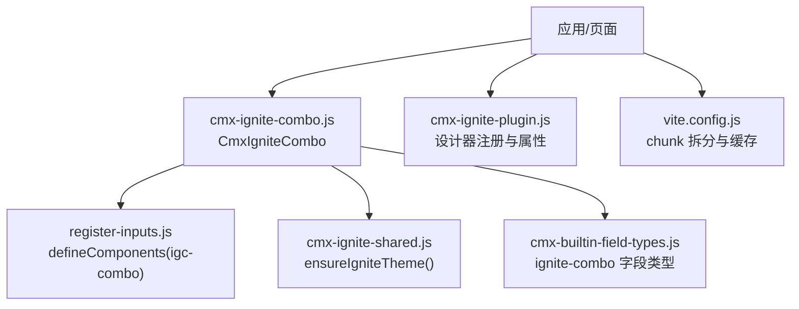
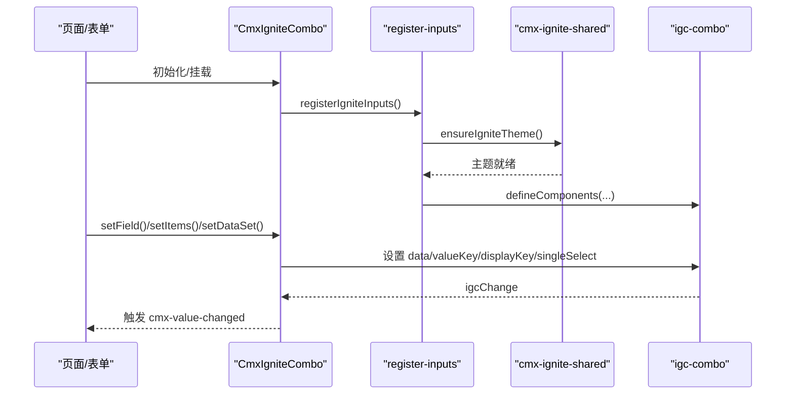
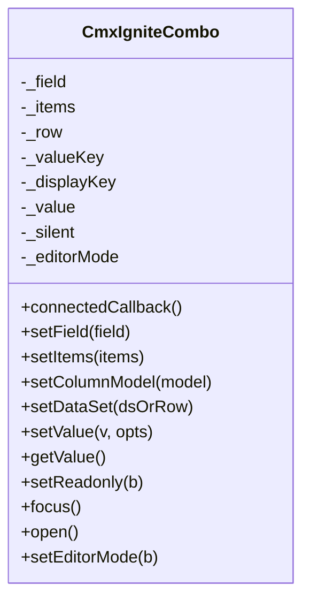
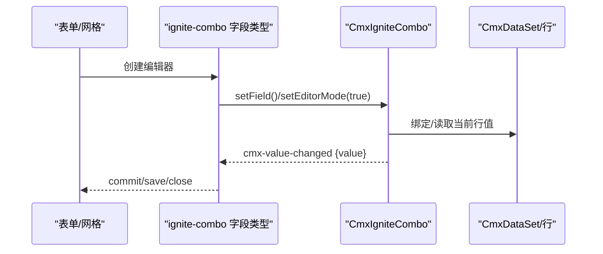
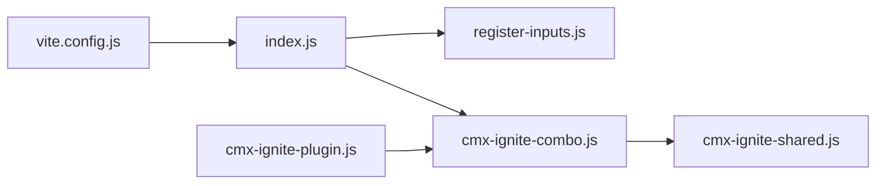

# Ignite 组合框 (CmxIgniteCombo)

<cite>
**本文引用的文件**
- [cmx-ignite-combo.js](file://packages/cmx-data-comp/src/components/ignite/cmx-ignite-combo.js)
- [cmx-ignite-shared.js](file://packages/cmx-data-comp/src/components/ignite/cmx-ignite-shared.js)
- [register-inputs.js](file://packages/cmx-data-comp/src/components/ignite/register-inputs.js)
- [index.js](file://packages/cmx-data-comp/src/components/ignite/index.js)
- [cmx-builtin-field-types.js](file://packages/cmx-data-comp/src/lib/cmx-builtin-field-types.js)
- [cmx-ignite-plugin.js](file://CMXHTMLDesigner/src/plugins/cmx-ignite-plugin.js)
- [vite.config.js](file://CMXPortalManager/vite.config.js)
</cite>

## 目录
1. [简介](#简介)
2. [项目结构](#项目结构)
3. [核心组件](#核心组件)
4. [架构总览](#架构总览)
5. [详细组件分析](#详细组件分析)
6. [依赖关系分析](#依赖关系分析)
7. [性能与大数据处理](#性能与大数据处理)
8. [故障排查指南](#故障排查指南)
9. [结论](#结论)
10. [附录：使用示例与最佳实践](#附录使用示例与最佳实践)

## 简介
本文件为 CMX 平台中基于 Infragistics Ignite UI Web Components 的 CmxIgniteCombo（Ignite 组合框）组件提供系统化文档。该组件以 igc-combo 为基础，封装了单选、数据绑定、编辑器模式、主题与国际化等能力，并作为内置字段类型在表单与网格中复用。其设计目标是在大型数据集场景下提供高性能渲染与流畅交互，同时保持与平台其他组件一致的集成方式。

## 项目结构
围绕 CmxIgniteCombo 的关键文件与职责如下：
- 组合框封装：packages/cmx-data-comp/src/components/ignite/cmx-ignite-combo.js
- 共享工具与主题注入：packages/cmx-data-comp/src/components/ignite/cmx-ignite-shared.js
- Ignite 输入组件注册：packages/cmx-data-comp/src/components/ignite/register-inputs.js
- 统一导出与懒加载入口：packages/cmx-data-comp/src/components/ignite/index.js
- 表单/网格字段类型集成：packages/cmx-data-comp/src/lib/cmx-builtin-field-types.js
- 设计器插件与属性面板：CMXHTMLDesigner/src/plugins/cmx-ignite-plugin.js
- 构建期按需拆分与缓存优化：CMXPortalManager/vite.config.js

图表来源
- [cmx-ignite-combo.js:35-65](file://packages/cmx-data-comp/src/components/ignite/cmx-ignite-combo.js#L35-L65)
- [register-inputs.js:18-31](file://packages/cmx-data-comp/src/components/ignite/register-inputs.js#L18-L31)
- [cmx-ignite-shared.js:55-64](file://packages/cmx-data-comp/src/components/ignite/cmx-ignite-shared.js#L55-L64)
- [cmx-builtin-field-types.js:251-354](file://packages/cmx-data-comp/src/lib/cmx-builtin-field-types.js#L251-L354)
- [cmx-ignite-plugin.js:18-46](file://CMXHTMLDesigner/src/plugins/cmx-ignite-plugin.js#L18-L46)
- [vite.config.js:112-154](file://CMXPortalManager/vite.config.js#L112-L154)

章节来源
- [cmx-ignite-combo.js:20-65](file://packages/cmx-data-comp/src/components/ignite/cmx-ignite-combo.js#L20-L65)
- [register-inputs.js:1-41](file://packages/cmx-data-comp/src/components/ignite/register-inputs.js#L1-L41)
- [cmx-ignite-shared.js:1-64](file://packages/cmx-data-comp/src/components/ignite/cmx-ignite-shared.js#L1-L64)
- [cmx-builtin-field-types.js:232-354](file://packages/cmx-data-comp/src/lib/cmx-builtin-field-types.js#L232-L354)
- [cmx-ignite-plugin.js:1-125](file://CMXHTMLDesigner/src/plugins/cmx-ignite-plugin.js#L1-L125)
- [vite.config.js:102-154](file://CMXPortalManager/vite.config.js#L102-L154)

## 核心组件
- CmxIgniteCombo（单选组合框）
  - 基于 igc-combo 的单选封装，支持独立使用、主从绑定、以及作为表单/网格编辑器。
  - 通过 setField/setItems/setColumnModel/setDataSet 完成配置与数据绑定。
  - 暴露 setValue/getValue/focus/open/setReadonly 等编辑器 API。
  - 事件 cmx-value-changed 携带 { key, value, row }。
- 共享能力
  - ensureIgniteTheme：按门户明暗主题自动切换 Ignite 主题变体并注入 palette CSS。
  - bindDataSetListeners/unbindDataSetListeners：绑定/解绑 CmxDataSet 游标与行变更事件。
  - parseJsonAttr/dispatchCmx：声明式属性解析与跨 Shadow DOM 事件派发。
- 字段类型集成
  - ignite-combo 字段类型在表单与网格中创建 cmx-ignite-combo，并在选中后自动保存并关闭编辑器。
- 设计器支持
  - 在设计器中注册 <cmx-ignite-combo>，支持 data-cmx-field/data-cmx-items/data-cmx-row 等属性可视化配置。

章节来源
- [cmx-ignite-combo.js:20-230](file://packages/cmx-data-comp/src/components/ignite/cmx-ignite-combo.js#L20-L230)
- [cmx-ignite-shared.js:67-136](file://packages/cmx-data-comp/src/components/ignite/cmx-ignite-shared.js#L67-L136)
- [cmx-builtin-field-types.js:251-354](file://packages/cmx-data-comp/src/lib/cmx-builtin-field-types.js#L251-L354)
- [cmx-ignite-plugin.js:18-46](file://CMXHTMLDesigner/src/plugins/cmx-ignite-plugin.js#L18-L46)

## 架构总览
CmxIgniteCombo 位于“封装层”，向上对接表单/网格与业务页面，向下对接 Ignite 原生组件与主题系统。

图表来源
- [cmx-ignite-combo.js:35-65](file://packages/cmx-data-comp/src/components/ignite/cmx-ignite-combo.js#L35-L65)
- [register-inputs.js:18-31](file://packages/cmx-data-comp/src/components/ignite/register-inputs.js#L18-L31)
- [cmx-ignite-shared.js:55-64](file://packages/cmx-data-comp/src/components/ignite/cmx-ignite-shared.js#L55-L64)

## 详细组件分析

### CmxIgniteCombo 类与生命周期
- 构造与连接
  - connectedCallback 中调用 registerIgniteInputs 确保组件可用，并 attachShadow 注入样式与 igc-combo。
  - 显式设置 singleSelect=true，保证单选行为稳定。
- 数据绑定
  - setField：读取 field.editSettings 中的 valueField/valueKey/displayKey/options，同步到内部 combo。
  - setItems：将本地选项映射为 {value,label} 数组并写入 combo.data。
  - setColumnModel：通过列模型适配器转换为 field 后调用 setField。
  - setDataSet：若传入 CmxDataSet，则绑定 cursor-changed 与 row-changed；否则直接以行对象维护当前值。
- 值读写与事件
  - _applyComboValue/_readComboValue：在单选模式下对 igc-combo 的数组 value 进行标量转换。
  - _onValueChange：优先使用事件 detail.newValue，更新内部值、回写行字段、触发 onChange，并派发 cmx-value-changed。
- 编辑器模式
  - setEditorMode：抑制自带 label 并撑满宿主容器，适配 form/grid 单元格布局。
  - setValue/getValue/focus/open/setReadonly：供外部框架（如表单/网格）控制。

图表来源
- [cmx-ignite-combo.js:20-230](file://packages/cmx-data-comp/src/components/ignite/cmx-ignite-combo.js#L20-L230)

章节来源
- [cmx-ignite-combo.js:20-230](file://packages/cmx-data-comp/src/components/ignite/cmx-ignite-combo.js#L20-L230)

### 主题、图标与国际化
- 主题
  - ensureIgniteTheme 检测门户明暗主题，调用 configureTheme('bootstrap', 'light'|'dark')，并将对应 palette CSS 注入 document.head，使阴影 DOM 内的 igc-combo 正确显示。
  - 监听 cmx-portal-theme-change 事件，实现运行时主题切换。
- 图标资源
  - 通过 Ignite 主题与组件库自带图标体系呈现，无需额外引入。
- 国际化
  - 通过 Ignite 主题变量与组件默认文案配合门户语言环境工作；如需自定义提示文案，可通过 field.placeholder 等属性传递。

章节来源
- [cmx-ignite-shared.js:15-64](file://packages/cmx-data-comp/src/components/ignite/cmx-ignite-shared.js#L15-L64)
- [cmx-ignite-combo.js:126-146](file://packages/cmx-data-comp/src/components/ignite/cmx-ignite-combo.js#L126-L146)

### 与表单/网格的协作
- 表单
  - ignite-combo 字段类型在 create 时生成 cmx-ignite-combo，进入编辑器模式，监听 cmx-value-changed 提交值。
- 网格
  - grid.editor 在单元格内挂载 cmx-ignite-combo，选中后 save 并 close，避免编辑器悬空。
  - cellTemplate 将存储的 value 映射为 label，优先取冗余字段 prop_label。

图表来源
- [cmx-builtin-field-types.js:251-354](file://packages/cmx-data-comp/src/lib/cmx-builtin-field-types.js#L251-L354)
- [cmx-ignite-combo.js:95-115](file://packages/cmx-data-comp/src/components/ignite/cmx-ignite-combo.js#L95-L115)

章节来源
- [cmx-builtin-field-types.js:251-354](file://packages/cmx-data-comp/src/lib/cmx-builtin-field-types.js#L251-L354)
- [cmx-ignite-combo.js:95-115](file://packages/cmx-data-comp/src/components/ignite/cmx-ignite-combo.js#L95-L115)

### 高级配置与交互
- 数据虚拟化
  - 组合框本身不实现虚拟滚动；对于超大选项集，建议采用服务端搜索或分页加载，再传入 setItems。
- 搜索算法
  - 由 igc-combo 内部实现；可在 field.placeholder 中提示用户输入关键字。
- 键盘导航与屏幕阅读器
  - 遵循浏览器与 igc-combo 的无障碍规范；建议在表单/网格中提供清晰的标签与占位符以提升可访问性。
- 多选支持
  - 当前封装为单选（singleSelect=true）。如需多选，请基于 igc-combo 另行扩展封装。

章节来源
- [cmx-ignite-combo.js:56-62](file://packages/cmx-data-comp/src/components/ignite/cmx-ignite-combo.js#L56-L62)
- [cmx-ignite-combo.js:126-146](file://packages/cmx-data-comp/src/components/ignite/cmx-ignite-combo.js#L126-L146)

## 依赖关系分析
- 组件注册
  - registerIgniteInputs 幂等注册 igc-combo 等输入组件，并在注册前确保主题就绪。
- 统一导出
  - index.js 提供 registerIgniteComponents/registerCmxIgniteComponents，支持按需导入与懒加载具体封装组件。
- 设计器集成
  - cmx-ignite-plugin.js 将 <cmx-ignite-combo> 注册到设计器调色板，并提供可视化属性配置。
- 构建优化
  - vite.config.js 将 Ignite 相关依赖拆分为独立 chunk，提升首屏加载与缓存命中率。

图表来源
- [index.js:55-83](file://packages/cmx-data-comp/src/components/ignite/index.js#L55-L83)
- [register-inputs.js:18-31](file://packages/cmx-data-comp/src/components/ignite/register-inputs.js#L18-L31)
- [cmx-ignite-combo.js:35-65](file://packages/cmx-data-comp/src/components/ignite/cmx-ignite-combo.js#L35-L65)
- [cmx-ignite-shared.js:55-64](file://packages/cmx-data-comp/src/components/ignite/cmx-ignite-shared.js#L55-L64)
- [cmx-ignite-plugin.js:18-46](file://CMXHTMLDesigner/src/plugins/cmx-ignite-plugin.js#L18-L46)
- [vite.config.js:112-154](file://CMXPortalManager/vite.config.js#L112-L154)

章节来源
- [index.js:1-84](file://packages/cmx-data-comp/src/components/ignite/index.js#L1-L84)
- [register-inputs.js:1-41](file://packages/cmx-data-comp/src/components/ignite/register-inputs.js#L1-L41)
- [cmx-ignite-plugin.js:1-125](file://CMXHTMLDesigner/src/plugins/cmx-ignite-plugin.js#L1-L125)
- [vite.config.js:102-154](file://CMXPortalManager/vite.config.js#L102-L154)

## 性能与大数据处理
- 渲染性能
  - 通过 shadow DOM 隔离样式，减少全局污染；仅挂载一个 igc-combo 实例，降低开销。
- 大数据集策略
  - 组合框未内置虚拟滚动；推荐在服务端实现搜索/分页，再将结果集传入 setItems，避免一次性加载大量选项。
- 构建与缓存
  - 借助构建配置将 Ignite 相关代码拆分为独立 chunk，利用内容哈希实现长期缓存，减少重复下载。

章节来源
- [cmx-ignite-combo.js:35-65](file://packages/cmx-data-comp/src/components/ignite/cmx-ignite-combo.js#L35-L65)
- [vite.config.js:112-154](file://CMXPortalManager/vite.config.js#L112-L154)

## 故障排查指南
- 下拉透明/尺寸异常
  - 确认 ensureIgniteTheme 已执行且主题 palette 已注入；检查是否被第三方样式覆盖。
- 值未更新或回环
  - 检查 setValue 是否传入 silent 标志；确认 _onValueChange 中 _silent 保护逻辑未被误用。
- 只读状态无效
  - 确认 setReadonly 已调用，且 field.readonly 正确传递至 disabled。
- 编辑器模式错位
  - 确认 setEditorMode(true) 已调用，并设置了 data-cmx-fill-host 属性以撑满宿主。

章节来源
- [cmx-ignite-shared.js:55-64](file://packages/cmx-data-comp/src/components/ignite/cmx-ignite-shared.js#L55-L64)
- [cmx-ignite-combo.js:196-227](file://packages/cmx-data-comp/src/components/ignite/cmx-ignite-combo.js#L196-L227)

## 结论
CmxIgniteCombo 以 igc-combo 为核心，提供了稳定的单选组合框能力，并与表单/网格、主题系统、设计器深度集成。通过合理的选项数据组织与服务端搜索，可在大数据集场景下获得良好性能与体验。结合构建期的 chunk 拆分与缓存策略，进一步提升了加载效率。

## 附录：使用示例与最佳实践
- 在表单中使用
  - 通过 ignite-combo 字段类型创建编辑器，设置 field.options/editSettings.options 定义选项，监听 cmx-value-changed 提交值。
- 在网格中使用
  - 在列编辑模式中启用 editMode=ignite-combo，选中后自动保存并关闭编辑器；只读显示优先展示 prop_label。
- 设计器配置
  - 拖入 <cmx-ignite-combo>，配置 data-cmx-field 或 data-cmx-items，必要时设置 data-cmx-row 初始值。
- 大型数据集最佳实践
  - 使用服务端搜索/分页，仅在可见范围内加载选项；避免一次性传入超大数据集。
- 主题与可访问性
  - 依赖 ensureIgniteTheme 自动跟随门户主题；为字段提供清晰 label/placeholder，提升可访问性。

章节来源
- [cmx-builtin-field-types.js:251-354](file://packages/cmx-data-comp/src/lib/cmx-builtin-field-types.js#L251-L354)
- [cmx-ignite-plugin.js:18-46](file://CMXHTMLDesigner/src/plugins/cmx-ignite-plugin.js#L18-L46)
- [cmx-ignite-combo.js:126-146](file://packages/cmx-data-comp/src/components/ignite/cmx-ignite-combo.js#L126-L146)