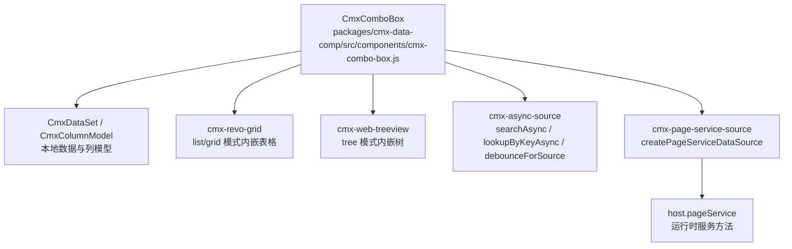
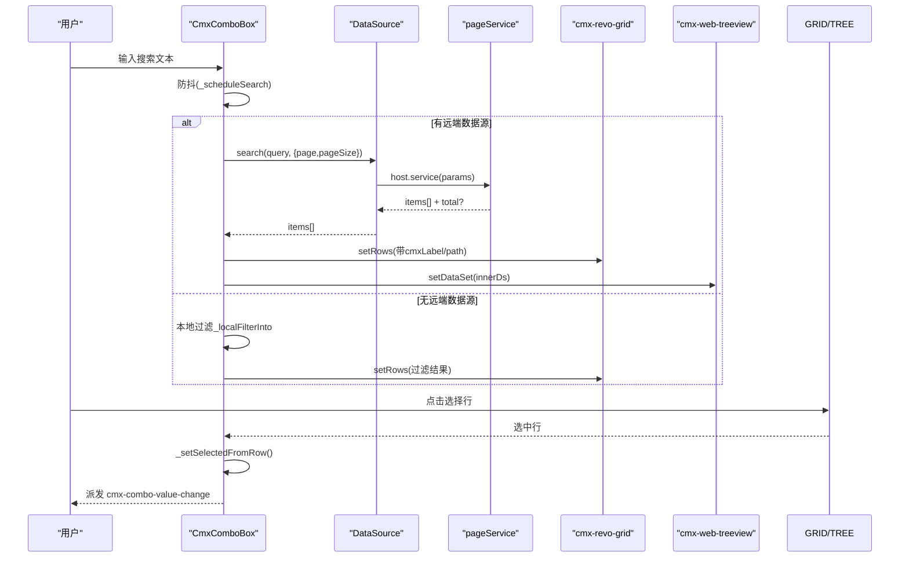
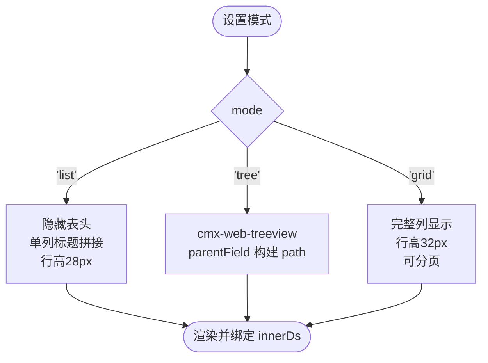
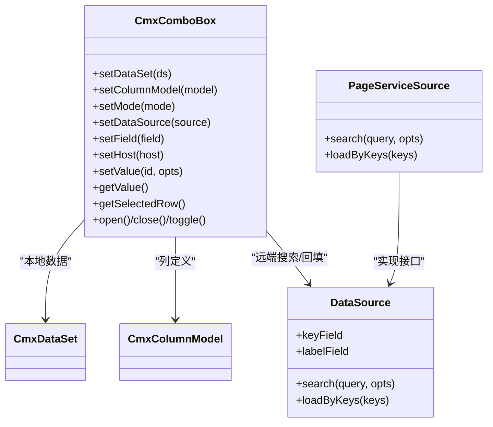
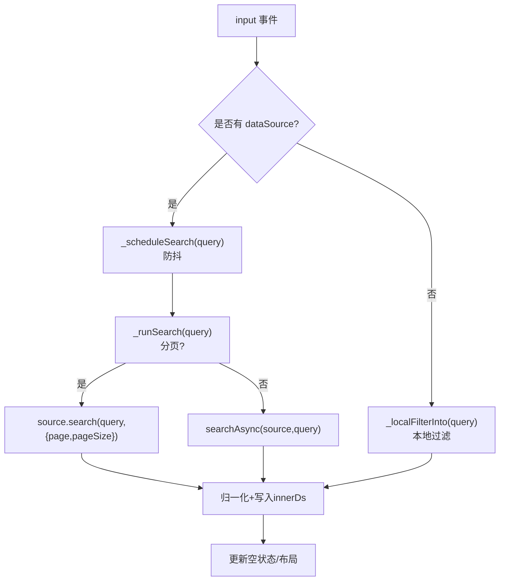
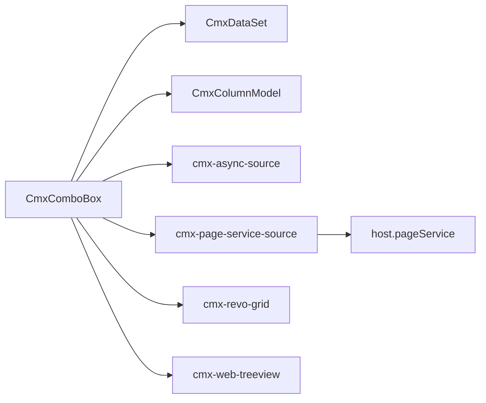

# 基础组合框 (CmxComboBox)

<cite>
**本文引用的文件**
- [cmx-combo-box.js](file://packages/cmx-data-comp/src/components/cmx-combo-box.js)
- [cmx-async-source.js](file://packages/cmx-data-comp/src/lib/cmx-async-source.js)
- [cmx-page-service-source.js](file://packages/cmx-data-comp/src/lib/cmx-page-service-source.js)
- [combo-box.md](file://.agents/skills/cmx-components-guide/references/combo-box.md)
</cite>

## 目录
1. [简介](#简介)
2. [项目结构](#项目结构)
3. [核心组件](#核心组件)
4. [架构总览](#架构总览)
5. [详细组件分析](#详细组件分析)
6. [依赖关系分析](#依赖关系分析)
7. [性能考量](#性能考量)
8. [故障排查指南](#故障排查指南)
9. [结论](#结论)
10. [附录：API 参考与示例](#附录api-参考与示例)

## 简介
CmxComboBox 是 CMX 平台的基础组合框组件，提供“下拉列表/树选择/网格选择”三种弹出模式，支持本地数据集、远端数据源和页面服务数据源的统一绑定，具备输入搜索、异步搜索与防抖处理，并提供完善的事件机制（值变更、打开关闭、搜索等）。它既可作为独立组件使用，也可作为 form/grid 的字段编辑器集成。

## 项目结构
- 组件实现位于 packages/cmx-data-comp/src/components/cmx-combo-box.js
- 异步搜索与缓存工具位于 packages/cmx-data-comp/src/lib/cmx-async-source.js
- 页面服务数据源适配器位于 packages/cmx-data-comp/src/lib/cmx-page-service-source.js
- 官方组件参考文档位于 .agents/skills/cmx-components-guide/references/combo-box.md

图表来源
- [cmx-combo-box.js:1-120](file://packages/cmx-data-comp/src/components/cmx-combo-box.js#L1-L120)
- [cmx-async-source.js:1-142](file://packages/cmx-data-comp/src/lib/cmx-async-source.js#L1-L142)
- [cmx-page-service-source.js:1-126](file://packages/cmx-data-comp/src/lib/cmx-page-service-source.js#L1-L126)

章节来源
- [cmx-combo-box.js:1-120](file://packages/cmx-data-comp/src/components/cmx-combo-box.js#L1-L120)
- [combo-box.md:1-40](file://.agents/skills/cmx-components-guide/references/combo-box.md#L1-L40)

## 核心组件
- CmxComboBox：自定义 Web Component，封装 ui5-input + ui5-popover，内嵌 cmx-revo-grid（list/grid）或 cmx-web-treeview（tree），负责渲染、事件、数据绑定、搜索与分页。
- CmxDataSet/CmxColumnModel：本地数据集与列模型，用于 list/tree/grid 的数据与展示定义。
- createPageServiceDataSource：将设计器的 pageService 包装为 DataSource，供组件进行 search/loadByKeys 调用。
- cmx-async-source：提供 LRU 缓存、AbortController 取消、debounce 防抖、按 key 查找等能力。

章节来源
- [cmx-combo-box.js:71-137](file://packages/cmx-data-comp/src/components/cmx-combo-box.js#L71-L137)
- [cmx-page-service-source.js:53-126](file://packages/cmx-data-comp/src/lib/cmx-page-service-source.js#L53-L126)
- [cmx-async-source.js:56-130](file://packages/cmx-data-comp/src/lib/cmx-async-source.js#L56-L130)

## 架构总览
CmxComboBox 通过 setDataSet/setColumnModel 绑定本地数据，或通过 setDataSource/createPageServiceDataSource 绑定远端数据；在 tree/list/grid 三种模式下分别复用不同子组件；输入搜索触发防抖后执行远端搜索或本地过滤；选中行时派发值变更事件；支持分页与扩展按钮。

图表来源
- [cmx-combo-box.js:852-900](file://packages/cmx-data-comp/src/components/cmx-combo-box.js#L852-L900)
- [cmx-combo-box.js:1336-1404](file://packages/cmx-data-comp/src/components/cmx-combo-box.js#L1336-L1404)
- [cmx-page-service-source.js:90-123](file://packages/cmx-data-comp/src/lib/cmx-page-service-source.js#L90-L123)

## 详细组件分析

### 三种弹出模式配置与使用
- list 模式：隐藏表头、单列显示标题拼接（优先用 CmxColumnModel.getTitleColIds()），行高 28px，适合快速选择。
- tree 模式：使用 cmx-web-treeview，支持 parentField 层级；path 优先级：行自带 path > parentField 回溯拼接 > id。
- grid 模式：完整列显示、行高 32px、显示行号，支持分页。

图表来源
- [cmx-combo-box.js:960-1004](file://packages/cmx-data-comp/src/components/cmx-combo-box.js#L960-L1004)
- [cmx-combo-box.js:1082-1123](file://packages/cmx-data-comp/src/components/cmx-combo-box.js#L1082-L1123)
- [cmx-combo-box.js:1153-1200](file://packages/cmx-data-comp/src/components/cmx-combo-box.js#L1153-L1200)

章节来源
- [cmx-combo-box.js:960-1004](file://packages/cmx-data-comp/src/components/cmx-combo-box.js#L960-L1004)
- [cmx-combo-box.js:1082-1123](file://packages/cmx-data-comp/src/components/cmx-combo-box.js#L1082-L1123)
- [cmx-combo-box.js:1153-1200](file://packages/cmx-data-comp/src/components/cmx-combo-box.js#L1153-L1200)
- [combo-box.md:21-38](file://.agents/skills/cmx-components-guide/references/combo-box.md#L21-L38)

### 数据源绑定机制
- 本地数据集：通过 setDataSet(CmxDataSet) 直接灌入，内部会浅拷贝并预写 cmxLabel/path，再注入 innerDs。
- 远端数据源：通过 setDataSource(source)，source 需实现 search/loadByKeys/keyField/labelField；组件使用 searchAsync 进行 LRU 缓存与请求取消。
- 页面服务数据源：通过 createPageServiceDataSource(host, def) 将 host.<service>(params) 包装为标准 DataSource，支持 queryParam/pageParam/extraParams/responsePath/transform 等。

图表来源
- [cmx-combo-box.js:165-232](file://packages/cmx-data-comp/src/components/cmx-combo-box.js#L165-L232)
- [cmx-page-service-source.js:53-126](file://packages/cmx-data-comp/src/lib/cmx-page-service-source.js#L53-L126)

章节来源
- [cmx-combo-box.js:165-232](file://packages/cmx-data-comp/src/components/cmx-combo-box.js#L165-L232)
- [cmx-page-service-source.js:53-126](file://packages/cmx-data-comp/src/lib/cmx-page-service-source.js#L53-L126)
- [combo-box.md:41-96](file://.agents/skills/cmx-components-guide/references/combo-box.md#L41-L96)

### 搜索过滤与防抖
- 输入搜索：监听 input 事件，派发 cmx-combo-search，若未展开则自动打开。
- 本地过滤：无远端数据源时，从 externalDs 按标题列或全字段包含匹配，生成临时子集灌入 innerDs。
- 远端搜索：有 source 时通过 _scheduleSearch 防抖调用 _runSearch；_runSearch 根据是否分页走不同路径，分页时绕过 LRU 缓存直接调 source.search 并携带 page/pageSize。
- 防抖：使用 debounceForSource(source, fn) 基于同一 source 共享 timer，避免频繁请求。

图表来源
- [cmx-combo-box.js:852-900](file://packages/cmx-data-comp/src/components/cmx-combo-box.js#L852-L900)
- [cmx-combo-box.js:1303-1344](file://packages/cmx-data-comp/src/components/cmx-combo-box.js#L1303-L1344)
- [cmx-combo-box.js:1351-1404](file://packages/cmx-data-comp/src/components/cmx-combo-box.js#L1351-L1404)
- [cmx-async-source.js:121-130](file://packages/cmx-data-comp/src/lib/cmx-async-source.js#L121-L130)

章节来源
- [cmx-combo-box.js:852-900](file://packages/cmx-data-comp/src/components/cmx-combo-box.js#L852-L900)
- [cmx-combo-box.js:1303-1344](file://packages/cmx-data-comp/src/components/cmx-combo-box.js#L1303-L1344)
- [cmx-combo-box.js:1351-1404](file://packages/cmx-data-comp/src/components/cmx-combo-box.js#L1351-L1404)
- [cmx-async-source.js:56-130](file://packages/cmx-data-comp/src/lib/cmx-async-source.js#L56-L130)

### 事件处理机制
- 值变更：cmx-combo-value-change，detail={id,row,source}，source 可为 click/keyboard/api/clear。
- 打开/关闭：cmx-combo-open（{mode}）、cmx-combo-close（{committed}）。
- 搜索：cmx-combo-search（{text}）、cmx-combo-search-error（{error}）。
- 清空：cmx-combo-clear（{}）。
- 扩展按钮：cmx-combo-ext-click（{id,value,row}）。

所有事件均 bubbles 且 composed，便于宿主捕获。

章节来源
- [cmx-combo-box.js:5-11](file://packages/cmx-data-comp/src/components/cmx-combo-box.js#L5-L11)
- [cmx-combo-box.js:347-400](file://packages/cmx-data-comp/src/components/cmx-combo-box.js#L347-L400)
- [cmx-combo-box.js:816-850](file://packages/cmx-data-comp/src/components/cmx-combo-box.js#L816-L850)
- [cmx-combo-box.js:1499-1506](file://packages/cmx-data-comp/src/components/cmx-combo-box.js#L1499-L1506)

### 值操作 API
- setValue(id, opts)：按 row.id 选中；找不到时异步 lookupByKey 回填；opts.silent 控制是否派发事件；opts.source 标记来源。
- getValue()：返回当前选中 id。
- getSelectedRow()：从 knownRows/innerDs/externalDs 查找选中行对象。
- open()/close(committed)/toggle()/isOpen()：控制弹出层。
- focus()：聚焦输入框。

章节来源
- [cmx-combo-box.js:314-344](file://packages/cmx-data-comp/src/components/cmx-combo-box.js#L314-L344)
- [cmx-combo-box.js:347-433](file://packages/cmx-data-comp/src/components/cmx-combo-box.js#L347-L433)

### 声明式属性与 field.editSettings
- data-cmx-* 属性：mode、placeholder、readonly、searchable、value、clearable、extension-buttons、paginated、page-size、options、rows 等。
- setField(field)：一键派生 dropdown、placeholder、width、height、parentField、dropdownColumns、clearable、extensionButtons、paginated、pageSize、source/options 等。

章节来源
- [cmx-combo-box.js:437-547](file://packages/cmx-data-comp/src/components/cmx-combo-box.js#L437-L547)
- [combo-box.md:77-96](file://.agents/skills/cmx-components-guide/references/combo-box.md#L77-L96)

## 依赖关系分析
- CmxComboBox 依赖 CmxDataSet/CmxColumnModel 管理本地数据与列定义。
- 通过 cmx-async-source 的 searchAsync/lookupByKeyAsync/debounceForSource 实现远端搜索、缓存与防抖。
- 通过 createPageServiceDataSource 将 host.pageService 适配为标准 DataSource，支持分页参数、额外参数、响应路径与 transform。
- 内嵌 cmx-revo-grid 与 cmx-web-treeview 分别承担 list/grid 与 tree 模式的展示与交互。

图表来源
- [cmx-combo-box.js:60-67](file://packages/cmx-data-comp/src/components/cmx-combo-box.js#L60-L67)
- [cmx-page-service-source.js:53-126](file://packages/cmx-data-comp/src/lib/cmx-page-service-source.js#L53-L126)
- [cmx-async-source.js:56-130](file://packages/cmx-data-comp/src/lib/cmx-async-source.js#L56-L130)

章节来源
- [cmx-combo-box.js:60-67](file://packages/cmx-data-comp/src/components/cmx-combo-box.js#L60-L67)
- [cmx-page-service-source.js:53-126](file://packages/cmx-data-comp/src/lib/cmx-page-service-source.js#L53-L126)
- [cmx-async-source.js:56-130](file://packages/cmx-data-comp/src/lib/cmx-async-source.js#L56-L130)

## 性能考量
- 防抖：debounceForSource 基于同一 source 共享 timer，减少高频输入导致的重复请求。
- 缓存：searchAsync 使用 LRU 缓存查询结果与 keyCache，提升重复查询性能。
- 请求取消：AbortController 保证同一 source 同时只保留最后一次未完成请求，避免竞态。
- 本地过滤：无远端数据源时使用内存过滤，避免网络开销。
- 分页：grid 模式开启分页时绕过 LRU 缓存，确保页码变化时重新拉取最新数据。
- 渲染优化：list/grid 模式在数据进入后刷新布局，避免滚动条变化导致的重排抖动。

章节来源
- [cmx-async-source.js:10-49](file://packages/cmx-data-comp/src/lib/cmx-async-source.js#L10-L49)
- [cmx-async-source.js:56-81](file://packages/cmx-data-comp/src/lib/cmx-async-source.js#L56-L81)
- [cmx-combo-box.js:1351-1404](file://packages/cmx-data-comp/src/components/cmx-combo-box.js#L1351-L1404)

## 故障排查指南
- 搜索错误：组件捕获异常并派发 cmx-combo-search-error，可在宿主监听该事件获取 error 详情。
- 空数据：当 innerDs 为空时显示空状态提示，可通过 emptyText 配置文案。
- 加载中状态：搜索期间显示 busy-indicator，完成后隐藏。
- 只读模式：只读时禁止编辑与下拉选择，隐藏清除按钮。
- 分页按钮禁用：根据 total 与当前页计算首/上/下/末按钮禁用状态。

章节来源
- [cmx-combo-box.js:1396-1418](file://packages/cmx-data-comp/src/components/cmx-combo-box.js#L1396-L1418)
- [cmx-combo-box.js:1420-1462](file://packages/cmx-data-comp/src/components/cmx-combo-box.js#L1420-L1462)
- [cmx-combo-box.js:247-254](file://packages/cmx-data-comp/src/components/cmx-combo-box.js#L247-L254)

## 结论
CmxComboBox 提供了统一的组合框能力，覆盖本地与远端数据、三种弹出模式、搜索与分页、丰富的事件体系，既能独立使用也能无缝集成到 form/grid 编辑器中。通过合理的防抖、缓存与分页策略，兼顾了用户体验与性能。

## 附录：API 参考与示例

### 核心方法
- setDataSet(ds)：绑定本地 CmxDataSet。
- setColumnModel(model)：绑定 CmxColumnModel，监听 columns-changed 自动刷新。
- setMode(mode)：切换 'list' | 'tree' | 'grid'。
- setDataSource(source)：绑定远端 DataSource。
- setField(field)：一键绑定 editSettings 派生的全部配置。
- setHost(host)：传入页面 host，用于解析 pageService。
- setValue(id, opts)：按 row.id 选中，支持 silent/source。
- getValue()：返回当前选中 id。
- getSelectedRow()：返回选中行对象。
- open()/close(committed)/toggle()/isOpen()：控制弹出层。
- focus()：聚焦输入框。

章节来源
- [cmx-combo-box.js:165-232](file://packages/cmx-data-comp/src/components/cmx-combo-box.js#L165-L232)
- [cmx-combo-box.js:314-433](file://packages/cmx-data-comp/src/components/cmx-combo-box.js#L314-L433)
- [combo-box.md:99-118](file://.agents/skills/cmx-components-guide/references/combo-box.md#L99-L118)

### 外观与行为配置
- setPlaceholder(text)、setReadonly(b)、setSearchable(b)、setDropdownWidth(css)、setItemsHeight(px)、setClearable(b)、setExtensionButtons(list)、setPaginated(b)、setPageSize(n)。

章节来源
- [cmx-combo-box.js:238-312](file://packages/cmx-data-comp/src/components/cmx-combo-box.js#L238-L312)
- [combo-box.md:54-96](file://.agents/skills/cmx-components-guide/references/combo-box.md#L54-L96)

### 事件
- cmx-combo-value-change、cmx-combo-open、cmx-combo-close、cmx-combo-search、cmx-combo-search-error、cmx-combo-clear、cmx-combo-ext-click。

章节来源
- [cmx-combo-box.js:5-11](file://packages/cmx-data-comp/src/components/cmx-combo-box.js#L5-L11)
- [combo-box.md:121-134](file://.agents/skills/cmx-components-guide/references/combo-box.md#L121-L134)

### 实际使用示例（路径引用）
- 独立使用 - 本地数据 + list 模式：[示例代码路径:177-211](file://.agents/skills/cmx-components-guide/references/combo-box.md#L177-L211)
- 独立使用 - tree 模式：[示例代码路径:213-232](file://.agents/skills/cmx-components-guide/references/combo-box.md#L213-L232)
- 远端搜索 + grid 模式 + 分页：[示例代码路径:234-263](file://.agents/skills/cmx-components-guide/references/combo-box.md#L234-L263)
- form/grid 编辑器集成：[示例代码路径:265-291](file://.agents/skills/cmx-components-guide/references/combo-box.md#L265-L291)
- 扩展按钮用法：[示例代码路径:293-306](file://.agents/skills/cmx-components-guide/references/combo-box.md#L293-L306)

章节来源
- [combo-box.md:177-306](file://.agents/skills/cmx-components-guide/references/combo-box.md#L177-L306)