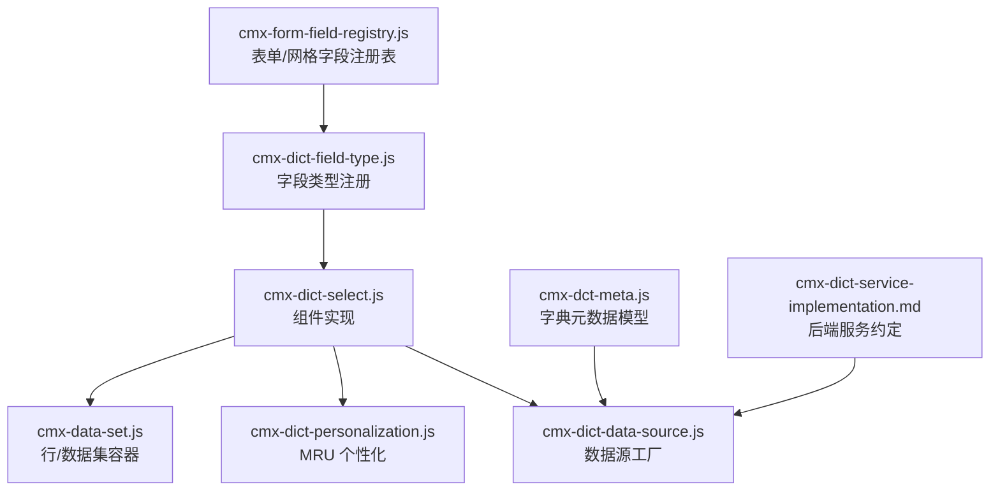
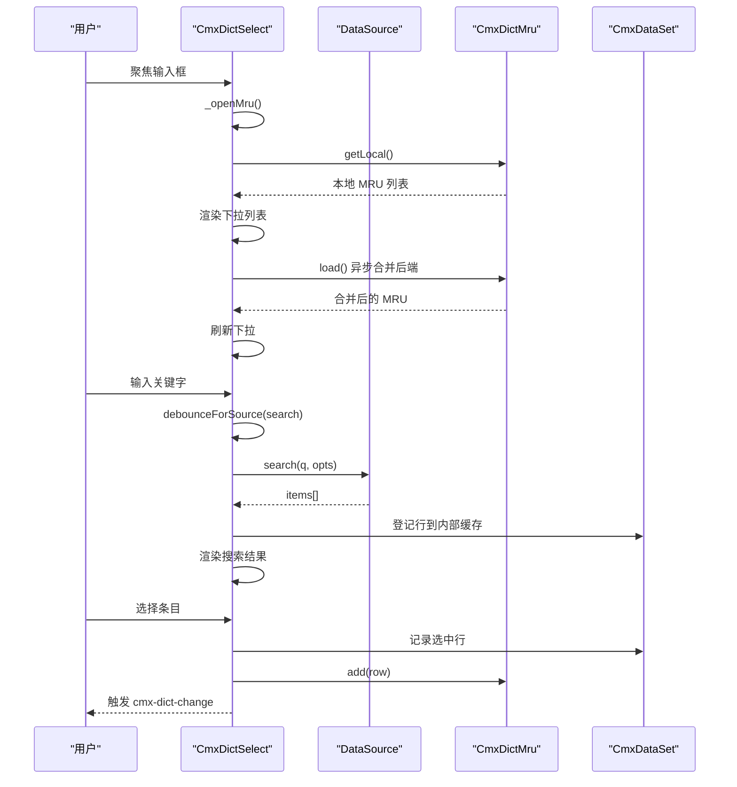
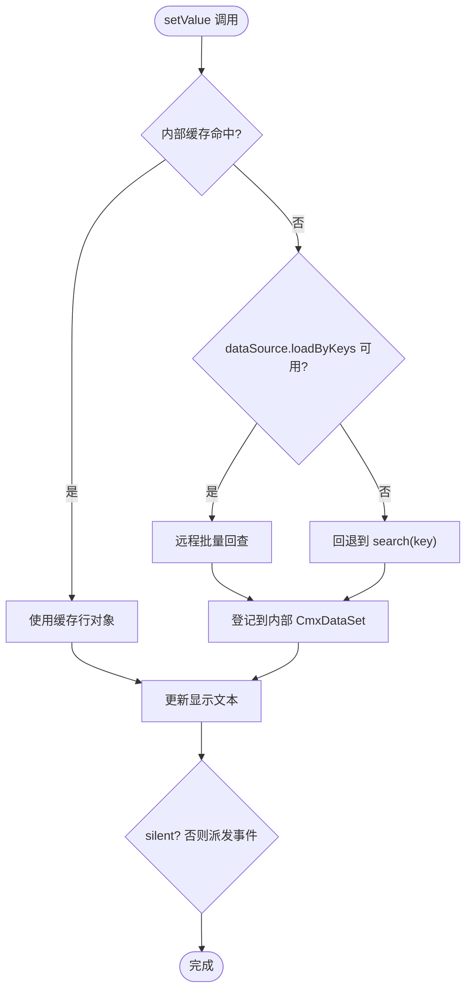
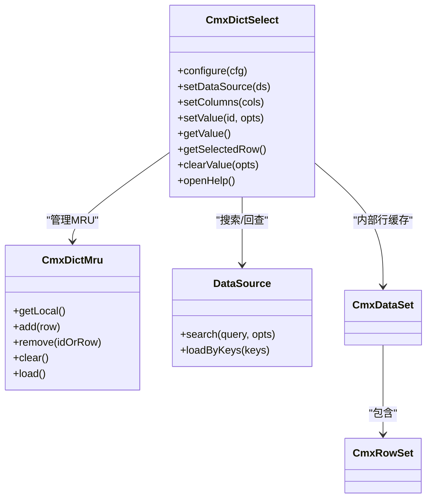

# 字典选择器 (CmxDictSelect)

<cite>
**本文引用的文件**
- [cmx-dict-select.js](file://packages/cmx-data-comp/src/components/cmx-dict-select.js)
- [dict-select.md](file://.agents/skills/cmx-components-guide/references/dict-select.md)
- [data-source-patterns.md](file://.agents/skills/cmx-components-guide/references/data-source-patterns.md)
- [cmx-dict-personalization.js](file://packages/cmx-data-comp/src/lib/cmx-dict-personalization.js)
- [cmx-dict-data-source.js](file://packages/cmx-data-comp/src/lib/cmx-dict-data-source.js)
- [cmx-dict-field-type.js](file://packages/cmx-data-comp/src/lib/cmx-dict-field-type.js)
- [cmx-form-field-registry.js](file://packages/cmx-data-comp/src/lib/cmx-form-field-registry.js)
- [cmx-data-set.js](file://packages/cmx-data-comp/src/lib/cmx-data-set.js)
- [cmx-dct-meta.js](file://packages/cmx-data-comp/src/lib/cmx-dct-meta.js)
- [cmx-dict-service-implementation.md](file://CMXPortalManager/docs/cmx-dict-service-implementation.md)
</cite>

## 目录
1. [简介](#简介)
2. [项目结构](#项目结构)
3. [核心组件](#核心组件)
4. [架构总览](#架构总览)
5. [详细组件分析](#详细组件分析)
6. [依赖关系分析](#依赖关系分析)
7. [性能与缓存策略](#性能与缓存策略)
8. [使用示例与业务场景](#使用示例与业务场景)
9. [表单集成与验证](#表单集成与验证)
10. [故障排查](#故障排查)
11. [结论](#结论)

## 简介
CmxDictSelect（<cmx-dict-select>）是 CMX 平台的数据字典选择组件，提供“输入即搜 + 最近选过（MRU）+ 值帮助对话框”的完整体验。它通过统一的数据源契约对接后端字典服务，支持扁平与层级字典、可配置显示字段与值映射，并内置本地与后端的 MRU 个性化存储，兼顾性能与用户体验。

## 项目结构
该组件位于数据组件包中，围绕“组件实现 + 数据源适配 + 个性化存储 + 字段类型注册”形成清晰分层：
- 组件实现：packages/cmx-data-comp/src/components/cmx-dict-select.js
- 数据源适配：packages/cmx-data-comp/src/lib/cmx-dict-data-source.js
- MRU 个性化：packages/cmx-data-comp/src/lib/cmx-dict-personalization.js
- 字段类型注册：packages/cmx-data-comp/src/lib/cmx-dict-field-type.js
- 表单/网格通用能力：packages/cmx-data-comp/src/lib/cmx-form-field-registry.js、cmx-data-set.js
- 字典元数据与服务：packages/cmx-data-comp/src/lib/cmx-dct-meta.js、CMXPortalManager/docs/cmx-dict-service-implementation.md

**图表来源**
- [cmx-dict-select.js:1-120](file://packages/cmx-data-comp/src/components/cmx-dict-select.js#L1-L120)
- [cmx-dict-data-source.js:1-34](file://packages/cmx-data-comp/src/lib/cmx-dict-data-source.js#L1-L34)
- [cmx-dict-personalization.js:1-60](file://packages/cmx-data-comp/src/lib/cmx-dict-personalization.js#L1-L60)
- [cmx-dict-field-type.js:1-22](file://packages/cmx-data-comp/src/lib/cmx-dict-field-type.js#L1-L22)
- [cmx-form-field-registry.js:1-59](file://packages/cmx-data-comp/src/lib/cmx-form-field-registry.js#L1-L59)
- [cmx-dct-meta.js:1-22](file://packages/cmx-data-comp/src/lib/cmx-dct-meta.js#L1-L22)

**章节来源**
- [cmx-dict-select.js:1-120](file://packages/cmx-data-comp/src/components/cmx-dict-select.js#L1-L120)
- [dict-select.md:1-62](file://.agents/skills/cmx-components-guide/references/dict-select.md#L1-L62)

## 核心组件
- 组件标签：<cmx-dict-select>
- 形态：输入框 + 右侧按钮区（清除 / 值帮助 / 扩展 slot），下拉弹层展示 MRU 或搜索结果；值帮助对话框支持 classify/group/grid 三种布局。
- 关键特性：
  - 字典编码 dictCode 作为 MRU 命名空间隔离
  - idCol/labelCol/codeCol/parentCol 控制值、显示文本、编码前缀、层级树构建
  - hierarchical 切换 treegrid
  - dataSource 契约 { search, loadByKeys } 对接远程字典服务
  - personalizationService 可选，用于 MRU 的后端持久化
  - 事件 cmx-dict-change/open/help 便于宿主集成

**章节来源**
- [cmx-dict-select.js:1-120](file://packages/cmx-data-comp/src/components/cmx-dict-select.js#L1-L120)
- [dict-select.md:9-62](file://.agents/skills/cmx-components-guide/references/dict-select.md#L9-L62)

## 架构总览
组件通过“数据源适配器 + 异步工具 + MRU 个性化 + 行/数据集容器”协同工作：
- 搜索与回查：searchAsync/lookupByKeyAsync 提供 LRU 缓存、防抖、请求中断
- MRU：本地 localStorage 优先，异步合并后端个性化结果
- 值帮助：根据 helpLayout 渲染分类/分组树 + 字典 grid/treegrid
- 数据容器：CmxDataSet/CmxRowSet 承载选中行与内部缓存

**图表来源**
- [cmx-dict-select.js:638-694](file://packages/cmx-data-comp/src/components/cmx-dict-select.js#L638-L694)
- [cmx-dict-personalization.js:84-165](file://packages/cmx-data-comp/src/lib/cmx-dict-personalization.js#L84-L165)
- [data-source-patterns.md:167-235](file://.agents/skills/cmx-components-guide/references/data-source-patterns.md#L167-L235)

## 详细组件分析

### 配置项与属性
- 配置键（configure）：dictCode、idCol、labelCol、codeCol、parentCol、columns、hierarchical、helpLayout、showClear、dataSource、classifyTreeSource、groupTreeSource、personalizationService、mruMax、placeholder、dictTitle、readonly、disabled
- HTML 属性（observedAttributes）：dict-code、id-col、label-col、code-col、parent-col、placeholder、help-layout、show-clear、hierarchical、readonly、disabled
- 行为要点：
  - codeCol 设置后，输入框显示“编码-名称”
  - hierarchical=true 时，值帮助 grid 走 treegrid，按 parentCol 建树
  - helpLayout 三态：classify（左分类树+右 grid）、group（左分组树+右 grid）、grid（仅 grid/treegrid）

**章节来源**
- [dict-select.md:29-81](file://.agents/skills/cmx-components-guide/references/dict-select.md#L29-L81)
- [cmx-dict-select.js:84-131](file://packages/cmx-data-comp/src/components/cmx-dict-select.js#L84-L131)

### API 方法
- configure(cfg)：合并配置，已渲染时同步 DOM
- setDataSource(ds)、setColumns(cols)：单独设置数据源/列定义
- setValue(id, opts)：按 id 设置选中值，支持 silent/displayText/rowData 优化
- getValue()/getSelectedRow()：读取当前选中 id/行
- clearValue(opts)：清空选中值
- openHelp()：打开值帮助对话框，返回选中行

**章节来源**
- [dict-select.md:94-119](file://.agents/skills/cmx-components-guide/references/dict-select.md#L94-L119)
- [cmx-dict-select.js:169-244](file://packages/cmx-data-comp/src/components/cmx-dict-select.js#L169-L244)

### 事件与插槽
- 事件：cmx-dict-change（detail 含 id、row、plain、text、dictCode、idCol）、cmx-dict-open、cmx-dict-help
- 插槽：actions（追加扩展按钮到右侧按钮区尾部）

**章节来源**
- [dict-select.md:123-177](file://.agents/skills/cmx-components-guide/references/dict-select.md#L123-L177)
- [cmx-dict-select.js:50-56](file://packages/cmx-data-comp/src/components/cmx-dict-select.js#L50-L56)

### 数据源契约与加载机制
- 必需方法：search(query, opts)、loadByKeys(keys)
- keyField/labelField/pageSize/items/cacheSize/debounceMs 等可选字段
- 推荐通过 createDictDataSource(host, def) 生成标准 DataSource
- 工具函数：searchAsync（LRU 缓存、AbortController 中断）、lookupByKeyAsync（多级查找顺序）、debounceForSource（防抖）

**图表来源**
- [cmx-dict-select.js:203-218](file://packages/cmx-data-comp/src/components/cmx-dict-select.js#L203-L218)
- [data-source-patterns.md:167-208](file://.agents/skills/cmx-components-guide/references/data-source-patterns.md#L167-L208)

**章节来源**
- [data-source-patterns.md:6-72](file://.agents/skills/cmx-components-guide/references/data-source-patterns.md#L6-L72)
- [cmx-dict-data-source.js:1-34](file://packages/cmx-data-comp/src/lib/cmx-dict-data-source.js#L1-L34)
- [cmx-dict-select.js:203-218](file://packages/cmx-data-comp/src/components/cmx-dict-select.js#L203-L218)

### MRU 机制与缓存策略
- 两层存储：localStorage（主路径，离线兜底）+ 后端个性化服务（可选，best-effort 异步保存）
- 分桶：以 dictCode 为 key 隔离不同字典的最近选择
- 容量：mruMax 控制每桶最大条数，超出淘汰最旧
- 合并：打开下拉先展示本地 MRU，再异步合并后端结果刷新列表
- 操作：add/remove/clear/load，onChange 订阅变化

**章节来源**
- [cmx-dict-personalization.js:1-165](file://packages/cmx-data-comp/src/lib/cmx-dict-personalization.js#L1-L165)
- [dict-select.md:212-228](file://.agents/skills/cmx-components-guide/references/dict-select.md#L212-L228)

### 值帮助对话框与层级结构
- helpLayout：classify/group/grid
- hierarchical=true：grid 走 treegrid，按 parentCol 构建树
- 左侧树数据源：classifyTreeSource/groupTreeSource（对应布局需要）
- 注意：help grid 路径需确保行对象具备 id 字段，避免随机占位 id

**章节来源**
- [dict-select.md:19-26](file://.agents/skills/cmx-components-guide/references/dict-select.md#L19-L26)
- [dict-select.md:231-249](file://.agents/skills/cmx-components-guide/references/dict-select.md#L231-L249)

## 依赖关系分析
- 组件依赖：
  - UI5 基础组件（Input/Button/Icon/ResponsivePopover/List/BusyIndicator）
  - 自定义组件：cmx-floating-dialog、cmx-revo-grid、cmx-web-treeview
  - 数据层：CmxDataSet、CmxColumn、CmxColumnModel
  - 异步工具：searchAsync、lookupByKeyAsync、debounceForSource
  - MRU：CmxDictMru、createMruServiceFromPageService
- 字段类型注册：
  - cmx-dict-field-type 将 dict-select 注册为 form/grid 双端字段类型
  - cmx-form-field-registry 提供统一注册表

**图表来源**
- [cmx-dict-select.js:83-159](file://packages/cmx-data-comp/src/components/cmx-dict-select.js#L83-L159)
- [cmx-dict-personalization.js:41-165](file://packages/cmx-data-comp/src/lib/cmx-dict-personalization.js#L41-L165)
- [cmx-data-set.js:267-407](file://packages/cmx-data-comp/src/lib/cmx-data-set.js#L267-L407)

**章节来源**
- [cmx-dict-select.js:57-80](file://packages/cmx-data-comp/src/components/cmx-dict-select.js#L57-L80)
- [cmx-form-field-registry.js:1-59](file://packages/cmx-data-comp/src/lib/cmx-form-field-registry.js#L1-L59)

## 性能与缓存策略
- 搜索防抖：debounceForSource 减少频繁请求
- 远程缓存：searchAsync 对查询结果进行 LRU 缓存，keyCache 缓存单行
- 请求中断：searchAsync 注入 AbortSignal，快速输入时中止上一次未完成的请求
- MRU 本地优先：打开下拉立即展示本地 MRU，后端异步合并，提升首屏体验
- 行缓存：内部 CmxDataSet 缓存搜索结果/选中行，避免重复回查
- 建议：
  - 合理设置 pageSize 与 mruMax
  - 编辑回填时传入 rowData 避免额外 loadByKeys
  - 确保 dataSource.search 返回行包含 id 字段，避免 help grid 出现随机 id

**章节来源**
- [data-source-patterns.md:167-235](file://.agents/skills/cmx-components-guide/references/data-source-patterns.md#L167-L235)
- [cmx-dict-select.js:662-694](file://packages/cmx-data-comp/src/components/cmx-dict-select.js#L662-L694)
- [dict-select.md:231-249](file://.agents/skills/cmx-components-guide/references/dict-select.md#L231-L249)

## 使用示例与业务场景

### 基本用法（HTML 属性）
- 配置字典编码、列映射、是否分级、帮助布局等
- 适用于简单页面嵌入

**章节来源**
- [dict-select.md:64-90](file://.agents/skills/cmx-components-guide/references/dict-select.md#L64-L90)

### 编程式配置与事件监听
- 链式 configure/setDataSource/setColumns
- 监听 cmx-dict-change，使用 plain 回写宿主各列
- 程序化 setValue/openHelp

**章节来源**
- [dict-select.md:94-119](file://.agents/skills/cmx-components-guide/references/dict-select.md#L94-L119)
- [dict-select.md:144-163](file://.agents/skills/cmx-components-guide/references/dict-select.md#L144-L163)
- [dict-select.md:253-319](file://.agents/skills/cmx-components-guide/references/dict-select.md#L253-L319)

### 常见业务场景
- 部门选择：hierarchical=true，parentCol=parent_id，helpLayout='classify'
- 状态选择：扁平字典，helpLayout='grid'，无需树
- 分类选择：classify 布局，classifyTreeSource 提供分类树，dataSource 提供明细

**章节来源**
- [dict-select.md:19-26](file://.agents/skills/cmx-components-guide/references/dict-select.md#L19-L26)
- [dict-select.md:253-319](file://.agents/skills/cmx-components-guide/references/dict-select.md#L253-L319)

## 表单集成与验证

### 字段类型注册
- 通过 cmx-dict-field-type 将 dict-select 注册为 form/grid 双端字段类型
- field.editSettings 透传字典坐标、列映射、help 布局、数据源等
- 取值默认写回字段值为选中行的 id；可通过 valueField 指定取其他列

**章节来源**
- [cmx-dict-field-type.js:1-22](file://packages/cmx-data-comp/src/lib/cmx-dict-field-type.js#L1-L22)
- [cmx-form-field-registry.js:1-59](file://packages/cmx-data-comp/src/lib/cmx-form-field-registry.js#L1-L59)

### 验证规则配置
- 表单侧校验由字段 validations/pattern 驱动，必填与格式校验在宿主表单引擎中执行
- 字典选择器本身不直接承担业务校验，但可通过 cmx-dict-change 事件配合宿主逻辑实现联动校验
- 建议在 cmx-dict-change 中根据 plain 更新宿主字段，并在提交前统一校验

**章节来源**
- [flexible-combination-engine.js:541-555](file://packages/cmx-data-comp/src/lib/flexible-combination-engine.js#L541-L555)
- [flexible-combination-engine.js:755-773](file://packages/cmx-data-comp/src/lib/flexible-combination-engine.js#L755-L773)

## 故障排查
- help grid ID 列显示随机串：确保 dataSource.search 返回的行包含 id 字段，或在 setRows 前按 idCol 重塑
- 只取 detail.id 导致丢失其它列：使用 detail.plain 回写宿主各列
- 字段映射错误：确认 idCol/labelCol/codeCol 职责正确
- classify 布局空白：同时配置 dataSource 与 classifyTreeSource
- setValue 未传 rowData 导致额外网络请求：编辑回填时传入 rowData 复用预加载数据

**章节来源**
- [dict-select.md:231-249](file://.agents/skills/cmx-components-guide/references/dict-select.md#L231-L249)
- [dict-select.md:323-332](file://.agents/skills/cmx-components-guide/references/dict-select.md#L323-L332)

## 结论
CmxDictSelect 提供了完整的字典选择体验：输入即搜、MRU 个性化、值帮助对话框、灵活的显示与值映射、以及与企业级字典服务的无缝集成。通过统一的数据源契约与缓存策略，在保证性能的同时提升了可用性。结合字段类型注册与表单引擎，可在复杂业务场景中高效落地部门、状态、分类等多种字典选择需求。