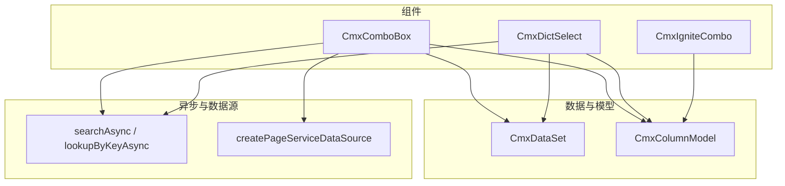
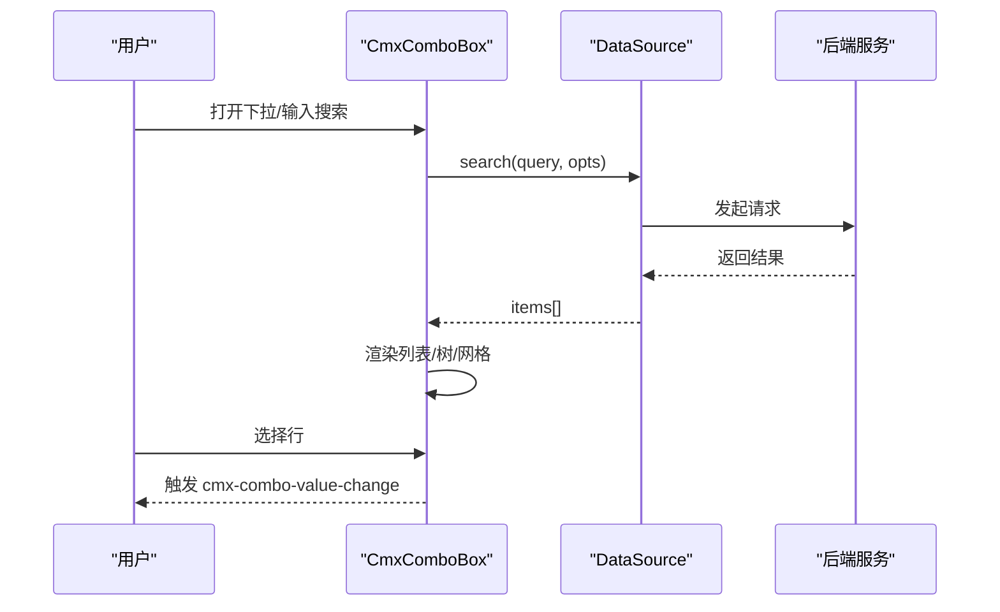
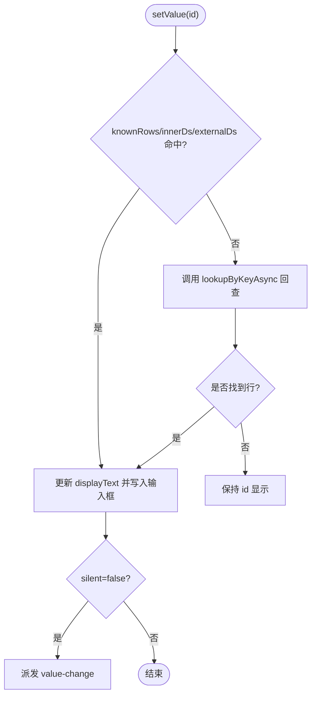
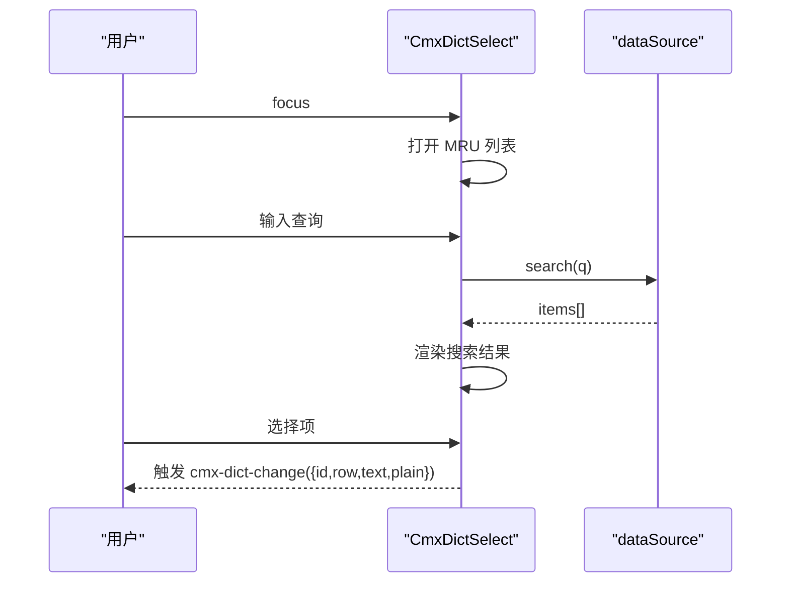
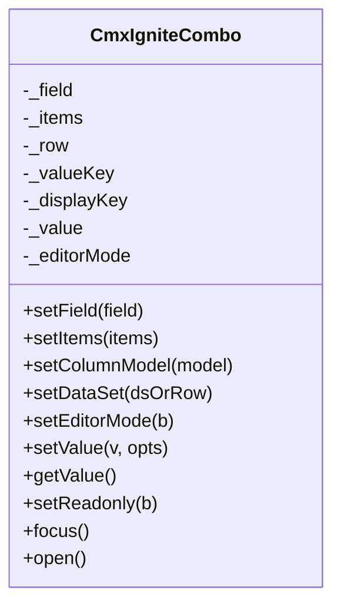
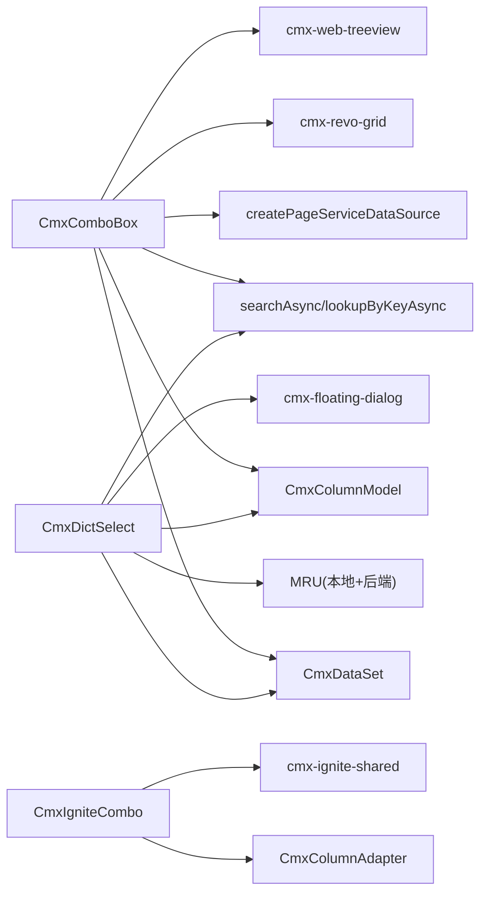

# 组合框组件

<cite>
**本文引用的文件**
- [cmx-combo-box.js](file://packages/cmx-data-comp/src/components/cmx-combo-box.js)
- [cmx-dict-select.js](file://packages/cmx-data-comp/src/components/cmx-dict-select.js)
- [cmx-ignite-combo.js](file://packages/cmx-data-comp/src/components/ignite/cmx-ignite-combo.js)
- [combo-box.md](file://.agents/skills/cmx-components-guide/references/combo-box.md)
- [dict-select.md](file://.agents/skills/cmx-components-guide/references/dict-select.md)
- [cmx-builtin-field-types.js](file://packages/cmx-data-comp/src/lib/cmx-builtin-field-types.js)
- [cmx-async-source.js](file://packages/cmx-data-comp/src/lib/cmx-async-source.js)
- [cmx-page-service-source.js](file://packages/cmx-data-comp/src/lib/cmx-page-service-source.js)
- [cmx-dataset.js](file://packages/cmx-data-comp/src/lib/cmx-data-set.js)
- [cmx-column-model.js](file://packages/cmx-data-comp/src/lib/cmx-column-model.js)
</cite>

## 目录
1. [简介](#简介)
2. [项目结构](#项目结构)
3. [核心组件](#核心组件)
4. [架构总览](#架构总览)
5. [详细组件分析](#详细组件分析)
6. [依赖关系分析](#依赖关系分析)
7. [性能考虑](#性能考虑)
8. [故障排查指南](#故障排查指南)
9. [结论](#结论)
10. [附录](#附录)

## 简介
本文件面向 CMX 平台中的三类组合框组件，提供从配置、数据绑定、事件到性能优化的系统化说明：
- 基础组合框 CmxComboBox：通用下拉/树/网格选择器，支持本地与远端数据源、分页、扩展按钮。
- 字典选择器 CmxDictSelect：面向字典/主数据的增强型选择器，内置 MRU（最近使用）、help 弹层、分组/分类树等能力。
- Ignite 组合框 CmxIgniteCombo：基于 Ignite igc-combo 的轻量封装，适合静态选项或表单/网格编辑器场景。

文档覆盖数据源绑定、异步加载、搜索过滤、选项分组、值映射与显示格式、自定义渲染、远程集成与性能优化策略，并给出业务场景示例与最佳实践。

## 项目结构
围绕组合框的核心实现位于 cmx-data-comp 包中：
- 组件层：CmxComboBox、CmxDictSelect、CmxIgniteCombo
- 数据与模型：CmxDataSet、CmxColumnModel、列适配器
- 异步与数据源：searchAsync、lookupByKeyAsync、createPageServiceDataSource
- 编辑器集成：内置 field-type 注册与 form/grid 编辑路径

图表来源
- [cmx-combo-box.js:1-120](file://packages/cmx-data-comp/src/components/cmx-combo-box.js#L1-L120)
- [cmx-dict-select.js:1-160](file://packages/cmx-data-comp/src/components/cmx-dict-select.js#L1-L160)
- [cmx-ignite-combo.js:1-70](file://packages/cmx-data-comp/src/components/ignite/cmx-ignite-combo.js#L1-L70)

章节来源
- [cmx-combo-box.js:1-120](file://packages/cmx-data-comp/src/components/cmx-combo-box.js#L1-L120)
- [cmx-dict-select.js:1-160](file://packages/cmx-data-comp/src/components/cmx-dict-select.js#L1-L160)
- [cmx-ignite-combo.js:1-70](file://packages/cmx-data-comp/src/components/ignite/cmx-ignite-combo.js#L1-L70)

## 核心组件
- CmxComboBox：数据模型驱动的下拉/树/网格选择器，支持 list/tree/grid 三种弹出模式；可绑定 CmxDataSet + CmxColumnModel 或远端 DataSource；支持分页、扩展按钮、搜索过滤、值回退与显示文本异步回填。
- CmxDictSelect：字典选择器，聚焦“字典编码 + 列映射 + help 弹层 + MRU”；输入即搜、键盘导航、帮助对话框三种布局（classify/group/grid）；支持 loadByKeys 按需回查。
- CmxIgniteCombo：基于 Ignite igc-combo 的单选封装，适配 form/grid 编辑器模式，支持 setField/setItems/setColumnModel/setDataSet，统一标量取值 API。

章节来源
- [cmx-combo-box.js:1-120](file://packages/cmx-data-comp/src/components/cmx-combo-box.js#L1-L120)
- [cmx-dict-select.js:1-160](file://packages/cmx-data-comp/src/components/cmx-dict-select.js#L1-L160)
- [cmx-ignite-combo.js:1-70](file://packages/cmx-data-comp/src/components/ignite/cmx-ignite-combo.js#L1-L70)
- [combo-box.md:1-175](file://.agents/skills/cmx-components-guide/references/combo-box.md#L1-L175)
- [dict-select.md:1-120](file://.agents/skills/cmx-components-guide/references/dict-select.md#L1-L120)

## 架构总览
三类组件共享的数据流与交互要点：
- 数据源：本地 CmxDataSet 或远端 createPageServiceDataSource；搜索通过 searchAsync，按 key 回查通过 lookupByKeyAsync。
- 显示与值：value 为 row.id；displayText 由 labelCol/标题列决定；setValue 支持 silent/source 控制事件。
- 事件：统一以 cmx-* 前缀派发，包含 open/close/value-change/search 等。
- 编辑器集成：通过内置 field-type 在 form/grid 中作为字段编辑器挂载。

图表来源
- [cmx-combo-box.js:340-400](file://packages/cmx-data-comp/src/components/cmx-combo-box.js#L340-L400)
- [cmx-async-source.js](file://packages/cmx-data-comp/src/lib/cmx-async-source.js)
- [cmx-page-service-source.js](file://packages/cmx-data-comp/src/lib/cmx-page-service-source.js)

## 详细组件分析

### CmxComboBox 基础组合框
- 弹出模式
  - list：隐藏表头、单列拼接标题（优先 titleColIds），适合紧凑展示。
  - tree：复用 web-treeview，parentField 决定层级，path 优先级：行 path > 回溯链 > id。
  - grid：完整列展示，支持分页 footer。
- 数据绑定
  - 本地：setDataSet(ds) + setColumnModel(model)。
  - 远端：setDataSource(source)，source 需含 search/loadByKeys/keyField/labelField；可通过 createPageServiceDataSource 包装 pageService。
- 搜索与分页
  - 输入搜索走 debounce 防抖；grid 模式开启 paginated 时，footer 首/上/下/末翻页调用 source.search。
- 值与显示
  - setValue(id, {silent, source}) 设置选中；getSelectedRow() 从 knownRows/innerDs/externalDs 查找；displayText 异步回填。
- 事件
  - cmx-combo-open/close/value-change/search/search-error/clear/ext-click。
- 扩展
  - setExtensionButtons 支持多个扩展按钮，点击派发自定义事件。

图表来源
- [cmx-combo-box.js:314-344](file://packages/cmx-data-comp/src/components/cmx-combo-box.js#L314-L344)
- [cmx-async-source.js](file://packages/cmx-data-comp/src/lib/cmx-async-source.js)

章节来源
- [cmx-combo-box.js:1-800](file://packages/cmx-data-comp/src/components/cmx-combo-box.js#L1-L800)
- [combo-box.md:1-175](file://.agents/skills/cmx-components-guide/references/combo-box.md#L1-L175)

### CmxDictSelect 字典选择器
- 特性
  - MRU：focus 自动展开“最近选过”，支持本地 localStorage 与后端个性化合并。
  - 搜索：输入即搜，debounce 防抖；无 dataSource 时直接空结果。
  - Help 弹层：三种布局 classify/group/grid，左侧树+右侧 grid。
  - 列映射：idCol/labelCol/codeCol/parentCol/hierarchical。
- 数据源契约
  - search(query, opts) 返回 items[]；loadByKeys(keys) 用于 setValue 异步回查。
- 值与显示
  - setValue(id, {silent, displayText, rowData})；getSelectedRow() 返回 CmxRowSet；clearValue() 清空。
- 事件
  - cmx-dict-change/open/help；change 事件 detail.plain 用于回写宿主多列。
- 常见陷阱
  - help grid 路径需确保 id 字段存在，避免 addRow 生成随机占位 id。

图表来源
- [cmx-dict-select.js:485-700](file://packages/cmx-data-comp/src/components/cmx-dict-select.js#L485-L700)
- [dict-select.md:180-230](file://.agents/skills/cmx-components-guide/references/dict-select.md#L180-L230)

章节来源
- [cmx-dict-select.js:1-800](file://packages/cmx-data-comp/src/components/cmx-dict-select.js#L1-L800)
- [dict-select.md:1-332](file://.agents/skills/cmx-components-guide/references/dict-select.md#L1-L332)

### CmxIgniteCombo Ignite 组合框
- 用法
  - 独立/主从绑定：setField/setItems/setColumnModel/setDataSet。
  - 编辑器模式：setEditorMode(true) 抑制自带 label，撑满宿主单元格。
- 数据与值
  - 内部 igc-combo 为单选；对外暴露标量 getValue/setValue；onChange 回调可写回 _row[key]。
- 事件
  - cmx-value-changed {key,value,row}。

图表来源
- [cmx-ignite-combo.js:20-231](file://packages/cmx-data-comp/src/components/ignite/cmx-ignite-combo.js#L20-L231)

章节来源
- [cmx-ignite-combo.js:1-231](file://packages/cmx-data-comp/src/components/ignite/cmx-ignite-combo.js#L1-L231)

## 依赖关系分析
- CmxComboBox 依赖：
  - CmxDataSet/CmxColumnModel：本地数据与列定义。
  - searchAsync/lookupByKeyAsync：搜索与按 key 回查。
  - createPageServiceDataSource：将页面 service 包装为统一数据源。
  - 内嵌组件：cmx-revo-grid（list/grid）、cmx-web-treeview（tree）。
- CmxDictSelect 依赖：
  - 同上数据与异步库；MRU 通过 cmx-dict-personalization；help 弹层使用 cmx-floating-dialog。
- CmxIgniteCombo 依赖：
  - Ignite igc-combo；列适配器 CmxColumnAdapter；共享工具 cmx-ignite-shared。

图表来源
- [cmx-combo-box.js:60-120](file://packages/cmx-data-comp/src/components/cmx-combo-box.js#L60-L120)
- [cmx-dict-select.js:65-80](file://packages/cmx-data-comp/src/components/cmx-dict-select.js#L65-L80)
- [cmx-ignite-combo.js:10-18](file://packages/cmx-data-comp/src/components/ignite/cmx-ignite-combo.js#L10-L18)

章节来源
- [cmx-combo-box.js:60-120](file://packages/cmx-data-comp/src/components/cmx-combo-box.js#L60-L120)
- [cmx-dict-select.js:65-80](file://packages/cmx-data-comp/src/components/cmx-dict-select.js#L65-L80)
- [cmx-ignite-combo.js:10-18](file://packages/cmx-data-comp/src/components/ignite/cmx-ignite-combo.js#L10-L18)

## 性能考虑
- 搜索防抖：CmxComboBox 与 CmxDictSelect 均对搜索进行防抖，减少频繁请求。
- 分页：CmxComboBox 在 grid 模式下支持分页，仅 remote source 且 source 返回 total 时启用 footer。
- 缓存与回退：CmxComboBox 维护 _knownRows 镜像，setValue 未命中时再回查；CmxDictSelect 支持传入 rowData 避免重复 loadByKeys。
- 渲染优化：list 模式隐藏表头、单列拼接；tree 模式利用 parentField 构建层级；popover 打开后延迟 refreshLayout 保证尺寸正确。
- 内存管理：disconnectedCallback 中解绑 columnModel 监听，避免泄漏。

[本节为通用性能建议，不直接分析具体文件]

## 故障排查指南
- 值变更未触发事件
  - 检查 setValue 是否传入 silent=true；确认 source 标记是否正确。
- 显示文本为空
  - 确认 labelCol/titleColIds 配置；必要时传入 rowData 或等待异步回填完成。
- help grid ID 列显示随机串
  - 确保 dataSource.search 返回的行包含 id 字段；或在 setRows 前按 idCol 重塑 id。
- 分页无效
  - 仅在 grid 模式 + remote source + source 返回 total 时生效；检查 pageSize 与页码状态。
- 编辑器模式错位
  - 使用 setEditorMode(true) 抑制自带 label 并撑满宿主；确保 data-cmx-fill-host 生效。

章节来源
- [cmx-combo-box.js:314-400](file://packages/cmx-data-comp/src/components/cmx-combo-box.js#L314-L400)
- [cmx-dict-select.js:230-250](file://packages/cmx-data-comp/src/components/cmx-dict-select.js#L230-L250)
- [dict-select.md:230-250](file://.agents/skills/cmx-components-guide/references/dict-select.md#L230-L250)

## 结论
- CmxComboBox 适用于通用下拉/树/网格选择，强调灵活的数据源与模式切换。
- CmxDictSelect 更适合字典/主数据场景，具备 MRU、help 弹层与列映射优势。
- CmxIgniteCombo 适合静态选项与编辑器集成，API 简洁、行为稳定。
- 三者均可通过 CmxDataSet/CmxColumnModel 与异步数据源无缝对接，配合事件机制与值映射满足复杂业务需求。

[本节为总结性内容，不直接分析具体文件]

## 附录

### 数据源绑定与远程集成
- 本地数据：setDataSet(ds) + setColumnModel(model)。
- 远端数据：setDataSource(createPageServiceDataSource(host, cfg))，cfg 含 service/keyField/labelField/queryParam/responsePath。
- 搜索与回查：searchAsync 负责搜索；lookupByKeyAsync 负责 setValue 时的按 key 回查。

章节来源
- [cmx-combo-box.js:206-232](file://packages/cmx-data-comp/src/components/cmx-combo-box.js#L206-L232)
- [cmx-async-source.js](file://packages/cmx-data-comp/src/lib/cmx-async-source.js)
- [cmx-page-service-source.js](file://packages/cmx-data-comp/src/lib/cmx-page-service-source.js)

### 事件处理机制与值映射
- CmxComboBox：cmx-combo-value-change/detail 含 id/row/source；open/close/search 事件。
- CmxDictSelect：cmx-dict-change/detail 含 id/row/text/plain；plain 用于回写宿主多列。
- CmxIgniteCombo：cmx-value-changed/detail 含 key/value/row。

章节来源
- [cmx-combo-box.js:1-120](file://packages/cmx-data-comp/src/components/cmx-combo-box.js#L1-L120)
- [cmx-dict-select.js:1-60](file://packages/cmx-data-comp/src/components/cmx-dict-select.js#L1-L60)
- [cmx-ignite-combo.js:1-20](file://packages/cmx-data-comp/src/components/ignite/cmx-ignite-combo.js#L1-L20)

### 搜索过滤与选项分组
- 搜索：输入即搜，debounce 防抖；支持 queryParam 与 responsePath 解析。
- 分组：CmxDictSelect 支持 classify/group 布局，左侧树数据源分别配置 classifyTreeSource/groupTreeSource。

章节来源
- [cmx-dict-select.js:630-700](file://packages/cmx-data-comp/src/components/cmx-dict-select.js#L630-L700)
- [dict-select.md:180-230](file://.agents/skills/cmx-components-guide/references/dict-select.md#L180-L230)

### 实际业务场景与最佳实践
- 表单字段编辑器：通过内置 field-type 注册 combo，editSettings.source 指向 pageService；setValue 使用 silent 避免循环事件。
- 主数据选择：使用 CmxDictSelect，配置 dictCode/idCol/labelCol，监听 cmx-dict-change 用 plain 回写宿主多列。
- 大数据量下拉：CmxComboBox 开启 grid 模式 + 分页；pageSize 合理设置，避免一次性加载过多数据。
- 静态选项：CmxIgniteCombo setItems 直接传入 [{value,label}]，简单高效。

章节来源
- [cmx-builtin-field-types.js:202-237](file://packages/cmx-data-comp/src/lib/cmx-builtin-field-types.js#L202-L237)
- [combo-box.md:175-307](file://.agents/skills/cmx-components-guide/references/combo-box.md#L175-L307)
- [dict-select.md:250-332](file://.agents/skills/cmx-components-guide/references/dict-select.md#L250-L332)