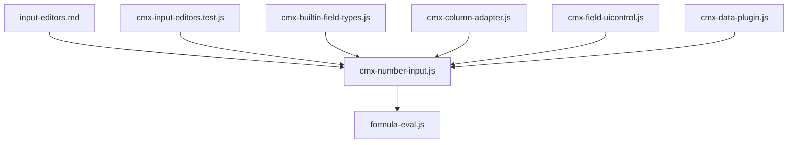
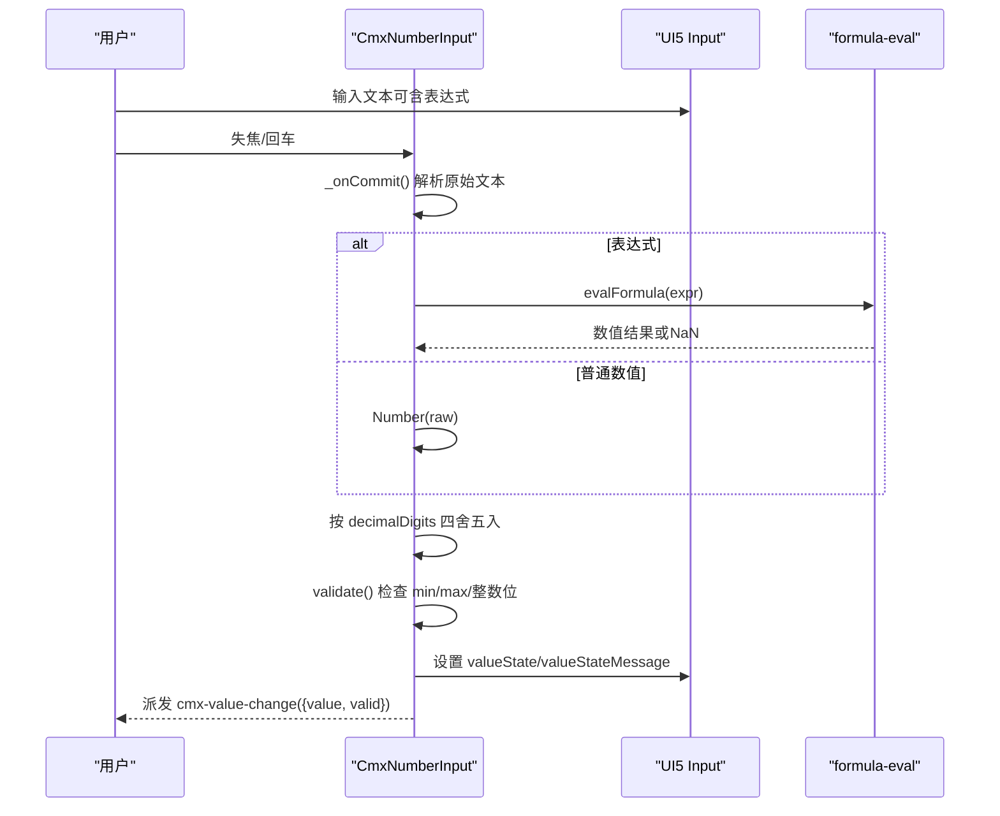
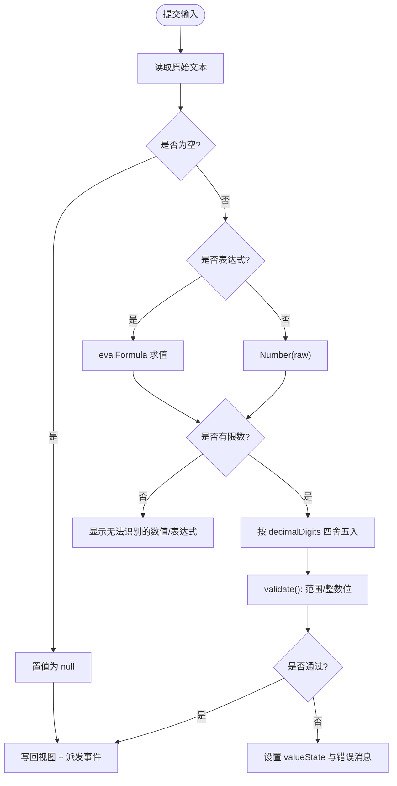
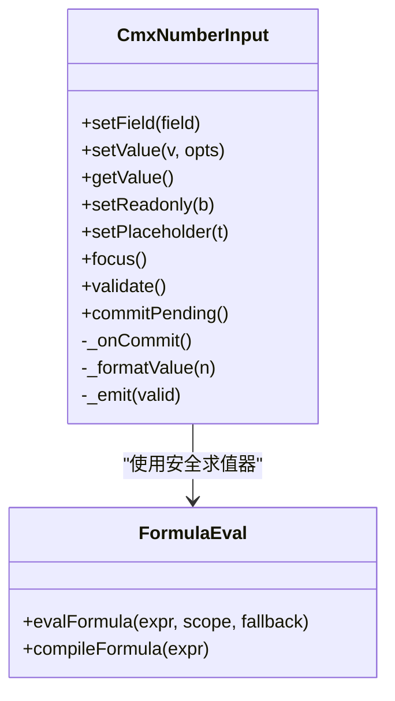

# 数字输入组件

<cite>
**本文引用的文件**
- [cmx-number-input.js](file://packages/cmx-data-comp/src/components/cmx-number-input.js)
- [formula-eval.js](file://packages/cmx-data-comp/src/lib/formula-eval.js)
- [input-editors.md](file://.agents/skills/cmx-components-guide/references/input-editors.md)
- [cmx-input-editors.test.js](file://packages/cmx-data-comp/src/lib/__tests__/cmx-input-editors.test.js)
- [cmx-builtin-field-types.js](file://packages/cmx-data-comp/src/lib/cmx-builtin-field-types.js)
- [cmx-column-adapter.js](file://packages/cmx-data-comp/src/lib/cmx-column-adapter.js)
- [cmx-field-uicontrol.js](file://packages/cmx-data-comp/src/lib/cmx-field-uicontrol.js)
- [cmx-data-plugin.js](file://CMXHTMLDesigner/src/plugins/cmx-data-plugin.js)
</cite>

## 目录
1. [简介](#简介)
2. [项目结构](#项目结构)
3. [核心组件](#核心组件)
4. [架构总览](#架构总览)
5. [详细组件分析](#详细组件分析)
6. [依赖关系分析](#依赖关系分析)
7. [性能与交互特性](#性能与交互特性)
8. [故障排查指南](#故障排查指南)
9. [结论](#结论)
10. [附录：使用示例与最佳实践](#附录使用示例与最佳实践)

## 简介
CmxNumberInput 是 CMX 数据组件库中的数值输入编辑器，用于表单和网格（grid）场景下的数值录入、校验与格式化。它封装 UI5 的输入控件，提供整数位/小数位限制、最小/最大值范围校验、表达式自动计算、微型计算器等能力，并通过统一事件对外暴露值变化与校验结果。

## 项目结构
- 组件实现位于 packages/cmx-data-comp/src/components/cmx-number-input.js
- 表达式求值器位于 packages/cmx-data-comp/src/lib/formula-eval.js
- 组件文档与用法参考位于 .agents/skills/cmx-components-guide/references/input-editors.md
- 单元测试覆盖校验、归一化、属性映射等行为，位于 packages/cmx-data-comp/src/lib/__tests__/cmx-input-editors.test.js
- 在内置字段类型注册中，number 类型默认绑定 cmx-number-input，位于 packages/cmx-data-comp/src/lib/cmx-builtin-field-types.js
- 列适配器将 type=number 的列默认编辑模式设为 cmx-number-input，位于 packages/cmx-data-comp/src/lib/cmx-column-adapter.js
- 设计器调色板为 cmx-number-input 暴露声明式属性配置，位于 CMXHTMLDesigner/src/plugins/cmx-data-plugin.js

图表来源
- [cmx-number-input.js:1-388](file://packages/cmx-data-comp/src/components/cmx-number-input.js#L1-L388)
- [formula-eval.js:1-297](file://packages/cmx-data-comp/src/lib/formula-eval.js#L1-L297)
- [input-editors.md:118-191](file://.agents/skills/cmx-components-guide/references/input-editors.md#L118-L191)
- [cmx-input-editors.test.js:59-84](file://packages/cmx-data-comp/src/lib/__tests__/cmx-input-editors.test.js#L59-L84)
- [cmx-builtin-field-types.js:576-578](file://packages/cmx-data-comp/src/lib/cmx-builtin-field-types.js#L576-L578)
- [cmx-column-adapter.js:897-897](file://packages/cmx-data-comp/src/lib/cmx-column-adapter.js#L897-L897)
- [cmx-field-uicontrol.js:13-13](file://packages/cmx-data-comp/src/lib/cmx-field-uicontrol.js#L13-L13)
- [cmx-data-plugin.js:472-501](file://CMXHTMLDesigner/src/plugins/cmx-data-plugin.js#L472-L501)

章节来源
- [cmx-number-input.js:1-388](file://packages/cmx-data-comp/src/components/cmx-number-input.js#L1-L388)
- [input-editors.md:118-191](file://.agents/skills/cmx-components-guide/references/input-editors.md#L118-L191)

## 核心组件
CmxNumberInput 是一个自定义元素，提供以下关键能力：
- 配置项：整数位上限、小数位精度、最小/最大值、占位文本、只读
- 取值/赋值：setValue/getValue，支持字符串到 number 的归一化，空值归一为 null
- 提交与校验：失焦或回车触发 _onCommit，进行表达式求值、四舍五入、范围与位数校验
- 事件：cmx-value-change，携带 { value, valid }
- 交互：尾部计算器按钮弹出微型计算器；支持键盘回车提交；支持表达式输入（以 = 开头或包含运算符）

章节来源
- [cmx-number-input.js:35-56](file://packages/cmx-data-comp/src/components/cmx-number-input.js#L35-L56)
- [cmx-number-input.js:97-126](file://packages/cmx-data-comp/src/components/cmx-number-input.js#L97-L126)
- [cmx-number-input.js:129-175](file://packages/cmx-data-comp/src/components/cmx-number-input.js#L129-L175)
- [cmx-number-input.js:179-213](file://packages/cmx-data-comp/src/components/cmx-number-input.js#L179-L213)
- [cmx-number-input.js:236-280](file://packages/cmx-data-comp/src/components/cmx-number-input.js#L236-L280)
- [cmx-number-input.js:284-373](file://packages/cmx-data-comp/src/components/cmx-number-input.js#L284-L373)

## 架构总览
CmxNumberInput 通过 setField 接收字段配置，内部维护状态并渲染 UI5 输入框。用户输入后，在失焦或回车时执行 _onCommit，调用公式求值器进行表达式计算，再进行精度四舍五入与校验，最后写回视图并派发事件。

图表来源
- [cmx-number-input.js:236-280](file://packages/cmx-data-comp/src/components/cmx-number-input.js#L236-L280)
- [formula-eval.js:287-296](file://packages/cmx-data-comp/src/lib/formula-eval.js#L287-L296)

## 详细组件分析

### 配置选项
- 整数位上限：intDigits / integerDigits / editSettings.intDigits
- 小数位精度：decimalDigits / editSettings.decimalDigits
- 范围限制：min / max
- 占位文本：placeholder
- 只读：readonly
- 声明式属性：int-digits、decimal-digits、min、max、placeholder、readonly（设计器/静态 HTML 使用）

说明
- 当外部调用 setField 后进入“外部配置模式”，HTML 属性变更不再覆盖配置
- 属性映射逻辑见 _fieldFromAttributes 与 _applyFieldConfig

章节来源
- [cmx-number-input.js:53-93](file://packages/cmx-data-comp/src/components/cmx-number-input.js#L53-L93)
- [cmx-number-input.js:97-126](file://packages/cmx-data-comp/src/components/cmx-number-input.js#L97-L126)
- [input-editors.md:124-144](file://.agents/skills/cmx-components-guide/references/input-editors.md#L124-L144)
- [cmx-data-plugin.js:472-501](file://CMXHTMLDesigner/src/plugins/cmx-data-plugin.js#L472-L501)

### 数值验证机制
- 空值：null 视为合法
- 有限性：非有限数返回错误信息
- 范围：小于 min 或大于 max 返回错误信息
- 整数位：整数部分位数超过 intDigits 返回错误信息
- 提交阶段：_onCommit 先求值/归一，再 validate，随后设置 valueState 与提示文本

图表来源
- [cmx-number-input.js:236-280](file://packages/cmx-data-comp/src/components/cmx-number-input.js#L236-L280)
- [cmx-number-input.js:156-172](file://packages/cmx-data-comp/src/components/cmx-number-input.js#L156-L172)
- [formula-eval.js:287-296](file://packages/cmx-data-comp/src/lib/formula-eval.js#L287-L296)

章节来源
- [cmx-number-input.js:156-172](file://packages/cmx-data-comp/src/components/cmx-number-input.js#L156-L172)
- [cmx-number-input.js:236-280](file://packages/cmx-data-comp/src/components/cmx-number-input.js#L236-L280)
- [cmx-input-editors.test.js:59-84](file://packages/cmx-data-comp/src/lib/__tests__/cmx-input-editors.test.js#L59-L84)

### 用户交互功能
- 上下箭头按钮：未实现（当前版本无步进控制）
- 键盘操作：回车键触发提交（表达式求值/归一/校验）
- 鼠标滚轮：未实现（依赖 UI5 输入控件，未额外处理）
- 输入过滤：不直接拦截字符，采用 Text 类型允许输入表达式；提交时统一求值与校验
- 表达式输入：以 = 开头或包含运算符时自动求值
- 微型计算器：尾部按钮打开 Popover，支持基本四则运算、小数点、退格、清空、等于/确定

章节来源
- [cmx-number-input.js:179-213](file://packages/cmx-data-comp/src/components/cmx-number-input.js#L179-L213)
- [cmx-number-input.js:284-373](file://packages/cmx-data-comp/src/components/cmx-number-input.js#L284-L373)
- [input-editors.md:151-169](file://.agents/skills/cmx-components-guide/references/input-editors.md#L151-L169)

### 数据绑定与格式化
- 取值/赋值：setValue 接受 number 或可转 number 的字符串；空值归一为 null；getValue 返回 number 或 null
- 格式化显示：按 decimalDigits 使用 toFixed 格式化；未设置小数位时直接转为字符串
- 本地化数字格式：当前实现未集成 locale-aware 千分位或货币格式化；如需千分位/货币显示，建议在展示层或 displayMask 中处理
- 科学计数法：当前实现未启用科学计数法显示；如需可在展示层处理
- 事件：cmx-value-change 携带 { value, valid }，可用于上层双向绑定或校验反馈

章节来源
- [cmx-number-input.js:129-147](file://packages/cmx-data-comp/src/components/cmx-number-input.js#L129-L147)
- [cmx-number-input.js:223-234](file://packages/cmx-data-comp/src/components/cmx-number-input.js#L223-L234)
- [input-editors.md:146-149](file://.agents/skills/cmx-components-guide/references/input-editors.md#L146-L149)

### 与表单/网格的集成
- 作为 'number' 字段类型的编辑器，由 CmxColumnModel.editMode 或 edit.mode 触发
- 列适配器默认将 type=number 的列编辑模式设为 cmx-number-input
- 设计器插件暴露 cmx-number-input 的声明式属性，便于可视化配置

章节来源
- [cmx-builtin-field-types.js:576-578](file://packages/cmx-data-comp/src/lib/cmx-builtin-field-types.js#L576-L578)
- [cmx-column-adapter.js:897-897](file://packages/cmx-data-comp/src/lib/cmx-column-adapter.js#L897-L897)
- [cmx-field-uicontrol.js:13-13](file://packages/cmx-data-comp/src/lib/cmx-field-uicontrol.js#L13-L13)
- [cmx-data-plugin.js:472-501](file://CMXHTMLDesigner/src/plugins/cmx-data-plugin.js#L472-L501)

## 依赖关系分析
- 组件依赖 UI5 的 Input、Button、Popover 以及 simulate 图标
- 表达式求值依赖 formula-eval 提供的安全求值器
- 在内置字段类型与列适配器中注册为 number 类型编辑器
- 设计器插件为其提供声明式属性面板

图表来源
- [cmx-number-input.js:35-56](file://packages/cmx-data-comp/src/components/cmx-number-input.js#L35-L56)
- [formula-eval.js:287-296](file://packages/cmx-data-comp/src/lib/formula-eval.js#L287-L296)

章节来源
- [cmx-number-input.js:29-33](file://packages/cmx-data-comp/src/components/cmx-number-input.js#L29-L33)
- [formula-eval.js:1-297](file://packages/cmx-data-comp/src/lib/formula-eval.js#L1-L297)

## 性能与交互特性
- 表达式求值：使用预编译 AST 缓存（compileFormula），减少重复解析开销
- 提交路径：仅在失焦/回车时执行求值与校验，避免频繁重绘
- 显示更新：仅当文本变化时才写入 ui5-input.value，减少不必要的 DOM 操作
- 交互体验：Text 类型允许完整表达式输入；提交后再归一与校验，提升输入灵活性

[本节为通用性能讨论，不直接分析具体文件]

## 故障排查指南
- 无法识别的数值/表达式：检查输入是否包含非法字符或表达式语法错误；确认 formula-eval 支持的函数与运算符
- 超出范围：确保 min/max 配置正确；必要时在业务层增加更友好的提示
- 整数位超限：调整 intDigits 或约束输入范围
- 小数位精度：确认 decimalDigits 设置；提交时会四舍五入
- 只读模式：确认 readonly 配置生效；注意外部 setField 会锁定属性回流

章节来源
- [cmx-number-input.js:236-280](file://packages/cmx-data-comp/src/components/cmx-number-input.js#L236-L280)
- [cmx-number-input.js:156-172](file://packages/cmx-data-comp/src/components/cmx-number-input.js#L156-L172)
- [formula-eval.js:287-296](file://packages/cmx-data-comp/src/lib/formula-eval.js#L287-L296)

## 结论
CmxNumberInput 提供了稳健的数值输入能力，涵盖范围限制、精度控制、表达式计算与微型计算器等实用功能。其设计将输入与校验解耦，通过统一提交路径保证数据一致性。对于本地化千分位、货币显示与科学计数法等高级格式化需求，建议在展示层或 displayMask 中扩展。

[本节为总结性内容，不直接分析具体文件]

## 附录：使用示例与最佳实践

### 基本数值输入
- 创建组件实例，设置 field 配置（如 placeholder、readonly）
- 监听 cmx-value-change 获取值与校验结果

章节来源
- [input-editors.md:170-191](file://.agents/skills/cmx-components-guide/references/input-editors.md#L170-L191)
- [cmx-number-input.js:129-147](file://packages/cmx-data-comp/src/components/cmx-number-input.js#L129-L147)

### 范围控制与精度
- 设置 min/max 限制数值范围
- 设置 decimalDigits 控制提交时的四舍五入精度
- 设置 intDigits 限制整数位位数

章节来源
- [cmx-number-input.js:97-126](file://packages/cmx-data-comp/src/components/cmx-number-input.js#L97-L126)
- [cmx-number-input.js:156-172](file://packages/cmx-data-comp/src/components/cmx-number-input.js#L156-L172)
- [cmx-input-editors.test.js:66-76](file://packages/cmx-data-comp/src/lib/__tests__/cmx-input-editors.test.js#L66-L76)

### 表达式计算与微型计算器
- 输入以 = 开头或包含运算符时，失焦/回车自动求值
- 点击尾部计算器按钮，使用微型计算器完成复杂计算
- 计算器结果按 decimalDigits 四舍五入

章节来源
- [cmx-number-input.js:236-280](file://packages/cmx-data-comp/src/components/cmx-number-input.js#L236-L280)
- [cmx-number-input.js:284-373](file://packages/cmx-data-comp/src/components/cmx-number-input.js#L284-L373)
- [input-editors.md:151-169](file://.agents/skills/cmx-components-guide/references/input-editors.md#L151-L169)

### 在表单/网格中使用
- 在 CmxColumnModel 中将列 type 设为 number，editMode 设为 number（或 edit.mode='cmx-number-input'）
- 通过 editSettings 配置 intDigits、decimalDigits、min、max、placeholder、readonly
- 设计器中可直接拖拽 cmx-number-input 并配置声明式属性

章节来源
- [cmx-builtin-field-types.js:576-578](file://packages/cmx-data-comp/src/lib/cmx-builtin-field-types.js#L576-L578)
- [cmx-column-adapter.js:897-897](file://packages/cmx-data-comp/src/lib/cmx-column-adapter.js#L897-L897)
- [cmx-data-plugin.js:472-501](file://CMXHTMLDesigner/src/plugins/cmx-data-plugin.js#L472-L501)

### 关于千分位格式化、货币显示与科学计数法
- 当前组件未内置本地化千分位、货币格式化或科学计数法显示
- 如需这些展示效果，建议在展示层（如 displayMask 或外层格式化逻辑）进行处理
- 组件专注于输入、校验与基础格式化（小数位精度）

章节来源
- [cmx-number-input.js:223-234](file://packages/cmx-data-comp/src/components/cmx-number-input.js#L223-L234)
- [input-editors.md:146-149](file://.agents/skills/cmx-components-guide/references/input-editors.md#L146-L149)