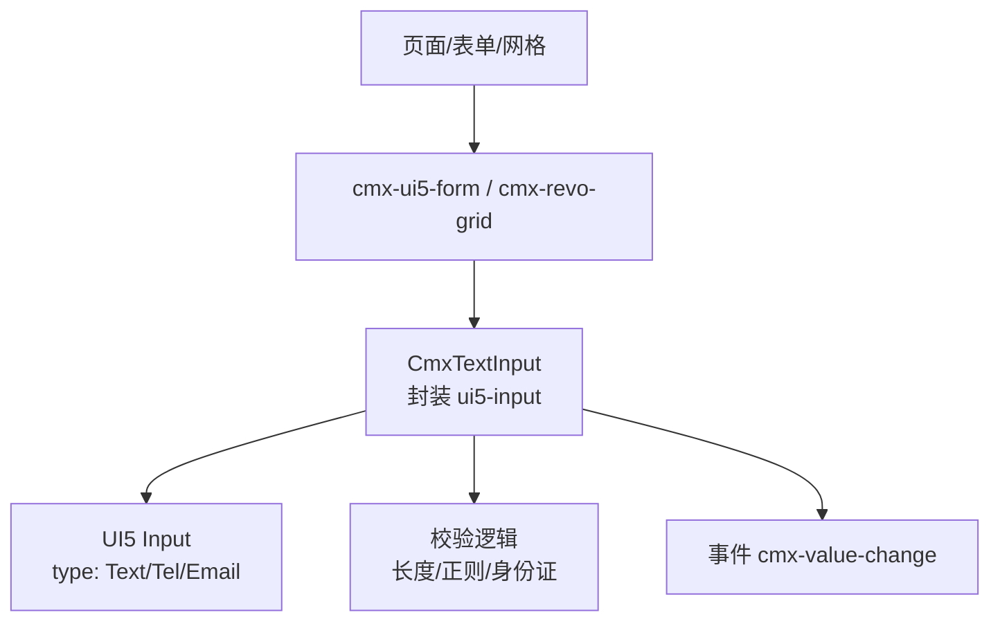
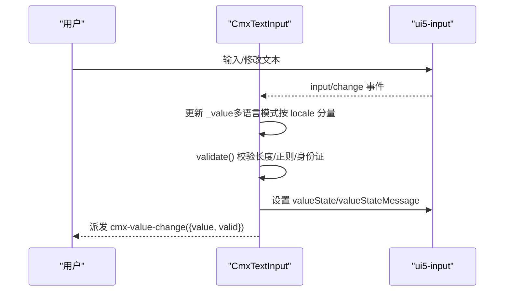
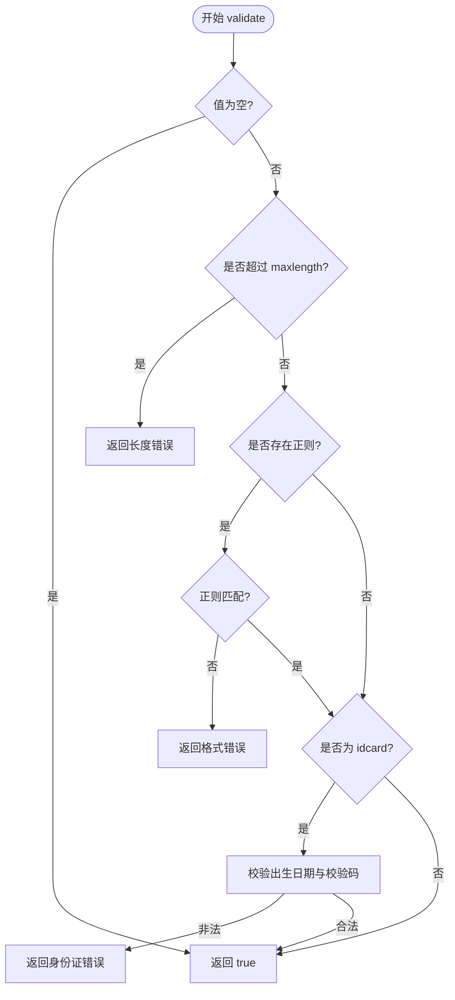
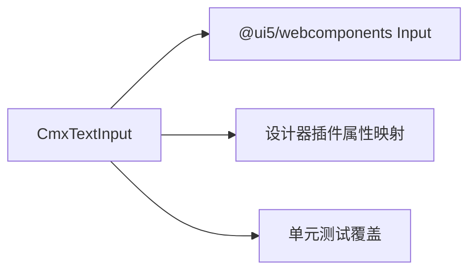

# 文本输入组件

<cite>
**本文引用的文件**
- [cmx-text-input.js](file://packages/cmx-data-comp/src/components/cmx-text-input.js)
- [input-editors.md](file://agents/skills/cmx-components-guide/references/input-editors.md)
- [cmx-input-editors.test.js](file://packages/cmx-data-comp/src/lib/__tests__/cmx-input-editors.test.js)
- [cmx-data-plugin.js](file://CMXHTMLDesigner/src/plugins/cmx-data-plugin.js)
</cite>

## 目录
1. [简介](#简介)
2. [项目结构](#项目结构)
3. [核心组件](#核心组件)
4. [架构总览](#架构总览)
5. [详细组件分析](#详细组件分析)
6. [依赖关系分析](#依赖关系分析)
7. [性能考虑](#性能考虑)
8. [故障排查指南](#故障排查指南)
9. [结论](#结论)
10. [附录：使用示例与最佳实践](#附录使用示例与最佳实践)

## 简介
CmxTextInput 是一个基于 UI5 Web Components 的字符串输入列编辑器，用于 cmx-ui5-form 与 cmx-revo-grid 的 text 字段类型编辑。它提供多种输入类型（文本、电话、邮箱、身份证）、占位符提示、最大长度限制、即时正则校验、多语言值存储与切换等能力，并通过标准事件对外暴露值变化与校验结果。

## 项目结构
- 组件实现位于 packages/cmx-data-comp/src/components/cmx-text-input.js，封装 ui5-input 并实现配置解析、数据绑定、校验与事件派发。
- 设计器插件在 CMXHTMLDesigner/src/plugins/cmx-data-plugin.js 中声明了 <cmx-text-input> 的标签、属性与默认样式，便于在设计器中可视化配置。
- 测试用例位于 packages/cmx-data-comp/src/lib/__tests__/cmx-input-editors.test.js，覆盖内置类型、自定义正则、长度限制与多语言行为。
- 输入编辑器统一说明文档位于 .agents/skills/cmx-components-guide/references/input-editors.md，汇总共同 API、事件与配置路径。

图表来源
- [cmx-text-input.js:79-336](file://packages/cmx-data-comp/src/components/cmx-text-input.js#L79-L336)
- [cmx-data-plugin.js:441-470](file://CMXHTMLDesigner/src/plugins/cmx-data-plugin.js#L441-L470)

章节来源
- [cmx-text-input.js:1-336](file://packages/cmx-data-comp/src/components/cmx-text-input.js#L1-L336)
- [cmx-data-plugin.js:441-470](file://CMXHTMLDesigner/src/plugins/cmx-data-plugin.js#L441-L470)

## 核心组件
- 组件类：CmxTextInput（继承 HTMLElement）
- 内部状态：
  - _field：外部字段配置对象（支持 field.* 与 editSettings.*）
  - _inputType：text/phone/email/idcard
  - _re/_reSource：生效的正则与来源
  - _maxlength：最大字符长度
  - _placeholder：占位文本
  - _i18n/_locale：多语言开关与当前语言
  - _readonly：只读
  - _value：非多语言为字符串；多语言为 { locale: text } 对象
- 公开 API：setField、setValue、getValue、setReadonly、setPlaceholder、setLocale、focus、validate、commitPending
- 事件：cmx-value-change（detail: { value, valid }），bubbles + composed

章节来源
- [cmx-text-input.js:79-254](file://packages/cmx-data-comp/src/components/cmx-text-input.js#L79-L254)
- [input-editors.md:17-42](file://agents/skills/cmx-components-guide/references/input-editors.md#L17-L42)

## 架构总览
CmxTextInput 通过 setField 或 HTML 属性完成配置注入，渲染时创建 ui5-input 并绑定 input/change 事件。每次输入都会触发即时校验，更新 UI5 的 valueState 与 valueStateMessage，并派发 cmx-value-change。多语言模式下，值以对象形式维护，仅编辑当前 locale 分量。

图表来源
- [cmx-text-input.js:292-333](file://packages/cmx-data-comp/src/components/cmx-text-input.js#L292-L333)

## 详细组件分析

### 配置选项与行为
- 输入类型 inputType
  - text：无内置正则，对应 UI5 type=Text
  - phone：Tel，内置手机号正则
  - email：Email，内置邮箱正则
  - idcard：Text，内置位数正则，并进一步校验出生日期与 GB 11643 校验码
- 占位符 placeholder：来自 field.placeholder 或 editSettings.placeholder，未设置时使用 INPUT_TYPES 默认占位
- 最大长度 maxlength：支持 field.maxlength 或 field.length，超出时返回错误信息
- 多语言 i18n：开启后值为 { locale: text }，setValue 接受字符串或对象，getValue 返回对象；setLocale 切换当前编辑语言
- 只读 readonly：同步到 ui5-input 的 readonly 属性
- 自定义正则 pattern：优先于 inputType 内置正则，失败时显示“格式不正确（正则来源）”

章节来源
- [cmx-text-input.js:33-40](file://packages/cmx-data-comp/src/components/cmx-text-input.js#L33-L40)
- [cmx-text-input.js:158-188](file://packages/cmx-data-comp/src/components/cmx-text-input.js#L158-L188)
- [cmx-text-input.js:237-250](file://packages/cmx-data-comp/src/components/cmx-text-input.js#L237-L250)
- [input-editors.md:61-80](file://agents/skills/cmx-components-guide/references/input-editors.md#L61-L80)

### 验证机制
- 空值放行：由 required 负责必填校验，组件自身对空值视为合法
- 长度校验：超过 maxlength 返回错误信息
- 正则校验：若存在 _re，则执行 test；否则使用 inputType 内置正则
- 身份证增强校验：idcard 类型在位数通过后，调用 validateIdCard 检查出生日期合法性与校验码
- 即时反馈：_onInput 中调用 validate，根据结果设置 valueState 与 valueStateMessage

图表来源
- [cmx-text-input.js:237-250](file://packages/cmx-data-comp/src/components/cmx-text-input.js#L237-L250)
- [cmx-text-input.js:53-75](file://packages/cmx-data-comp/src/components/cmx-text-input.js#L53-L75)

章节来源
- [cmx-text-input.js:237-250](file://packages/cmx-data-comp/src/components/cmx-text-input.js#L237-L250)
- [cmx-input-editors.test.js:25-48](file://packages/cmx-data-comp/src/lib/__tests__/cmx-input-editors.test.js#L25-L48)

### 用户交互特性
- 自动聚焦：提供 focus() 方法，内部委托给 ui5-input.focus()
- 键盘导航：依赖 UI5 Input 原生行为（如回车、方向键等）
- 输入法支持：基于浏览器与 UI5 Input 的 IME 支持
- 无障碍访问：通过 UI5 Input 的 accessible-name/description 等属性（由宿主或上层表单提供）
- 即时校验反馈：输入时设置 valueState 与 valueStateMessage，便于屏幕阅读器读取错误信息

章节来源
- [cmx-text-input.js:253-254](file://packages/cmx-data-comp/src/components/cmx-text-input.js#L253-L254)
- [cmx-text-input.js:311-323](file://packages/cmx-data-comp/src/components/cmx-text-input.js#L311-L323)

### 数据绑定机制
- 值同步：setValue 写入 _value 并写回 ui5-input.value；_onInput 将最新输入写回 _value
- 格式化：不改变原始字符串，仅在提交/展示层由上层处理（组件本身不做格式化）
- 国际化：i18n=true 时，值以对象存储；setValue 可传入字符串（视为当前 locale 分量）或对象；getValue 返回对象；setLocale 切换当前编辑语言分量

章节来源
- [cmx-text-input.js:192-229](file://packages/cmx-data-comp/src/components/cmx-text-input.js#L192-L229)
- [cmx-text-input.js:292-309](file://packages/cmx-data-comp/src/components/cmx-text-input.js#L292-L309)
- [input-editors.md:73-80](file://agents/skills/cmx-components-guide/references/input-editors.md#L73-L80)

### 事件模型
- cmx-value-change：值变化时触发，detail 包含 value 与 valid（valid 为 validate() 结果的布尔化）
- 事件冒泡与穿透：bubbles + composed，便于跨 Shadow DOM 捕获

章节来源
- [cmx-text-input.js:325-333](file://packages/cmx-data-comp/src/components/cmx-text-input.js#L325-L333)
- [input-editors.md:30-36](file://agents/skills/cmx-components-guide/references/input-editors.md#L30-L36)

## 依赖关系分析
- 运行时依赖：@ui5/webcomponents/dist/Input.js
- 设计期集成：CMXHTMLDesigner 插件注册 <cmx-text-input> 标签及属性映射
- 测试依赖：Vitest + jsdom（单元测试覆盖校验与多语言逻辑）

图表来源
- [cmx-text-input.js:31](file://packages/cmx-data-comp/src/components/cmx-text-input.js#L31)
- [cmx-data-plugin.js:441-470](file://CMXHTMLDesigner/src/plugins/cmx-data-plugin.js#L441-L470)
- [cmx-input-editors.test.js:1-22](file://packages/cmx-data-comp/src/lib/__tests__/cmx-input-editors.test.js#L1-L22)

章节来源
- [cmx-text-input.js:31](file://packages/cmx-data-comp/src/components/cmx-text-input.js#L31)
- [cmx-data-plugin.js:441-470](file://CMXHTMLDesigner/src/plugins/cmx-data-plugin.js#L441-L470)
- [cmx-input-editors.test.js:1-22](file://packages/cmx-data-comp/src/lib/__tests__/cmx-input-editors.test.js#L1-L22)

## 性能考虑
- 轻量实现：仅封装一个 ui5-input，避免复杂渲染开销
- 即时校验：每次输入都进行正则与长度校验，建议在大数据量场景下结合防抖策略（由上层控制）
- 多语言对象拷贝：_coerceI18n 会浅拷贝对象，注意在高频 setValue 场景下的对象分配成本

[本节为通用指导，无需特定文件引用]

## 故障排查指南
- 校验不生效
  - 确认已调用 setField 或在 HTML 上设置了 observedAttributes
  - 检查 pattern 是否正确编译（无效正则会被忽略）
  - 确认 maxlength 已正确设置
- 多语言值异常
  - 确认 i18n=true，且 setValue 传入的是字符串或对象
  - 使用 getValue 获取对象，而非直接取字符串
- 错误提示未显示
  - 检查 valueStateMessage 插槽是否被上层容器消费
  - 确认 _setValueStateText 已被调用（输入事件触发）

章节来源
- [cmx-text-input.js:158-188](file://packages/cmx-data-comp/src/components/cmx-text-input.js#L158-L188)
- [cmx-text-input.js:311-323](file://packages/cmx-data-comp/src/components/cmx-text-input.js#L311-L323)
- [cmx-input-editors.test.js:25-53](file://packages/cmx-data-comp/src/lib/__tests__/cmx-input-editors.test.js#L25-L53)

## 结论
CmxTextInput 提供了简洁而强大的文本输入能力，涵盖多种输入类型、即时校验、多语言支持与无障碍友好。通过 setField 与 HTML 属性两种配置方式，可灵活适配表单与网格场景。建议在上层结合业务规则与 UI5 主题，完善必填校验与国际化文案。

[本节为总结性内容，无需特定文件引用]

## 附录：使用示例与最佳实践

### 基本用法
- 创建实例并绑定字段配置，监听 cmx-value-change 事件获取值与校验结果
- 适用于普通文本、电话、邮箱、身份证等场景

章节来源
- [input-editors.md:82-114](file://agents/skills/cmx-components-guide/references/input-editors.md#L82-L114)

### 高级配置
- 自定义正则：通过 pattern 覆盖内置校验
- 多语言：启用 i18n，使用 setLocale 切换当前编辑语言分量
- 只读与占位：通过 setReadonly 与 setPlaceholder 动态调整

章节来源
- [cmx-text-input.js:158-188](file://packages/cmx-data-comp/src/components/cmx-text-input.js#L158-L188)
- [cmx-text-input.js:183-188](file://packages/cmx-data-comp/src/components/cmx-text-input.js#L183-L188)

### 错误处理场景
- 必填校验：由 required 负责，组件对空值放行
- 格式错误：根据 inputType 或 pattern 返回错误信息，并在 UI 上显示 valueStateMessage
- 长度超限：maxlength 限制，超出时返回错误信息

章节来源
- [cmx-text-input.js:237-250](file://packages/cmx-data-comp/src/components/cmx-text-input.js#L237-L250)
- [cmx-input-editors.test.js:25-48](file://packages/cmx-data-comp/src/lib/__tests__/cmx-input-editors.test.js#L25-L48)