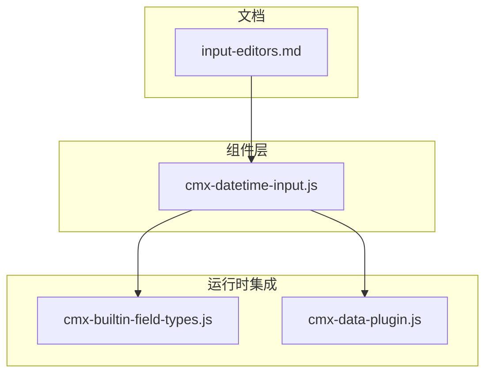
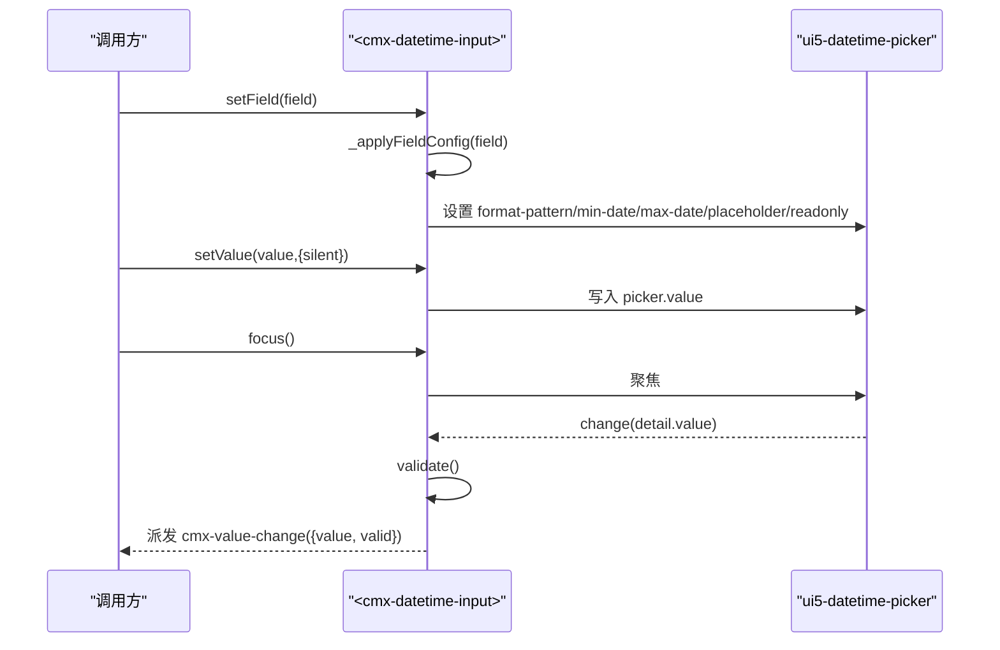
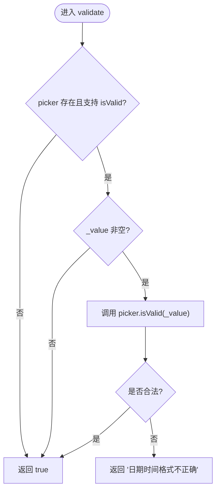
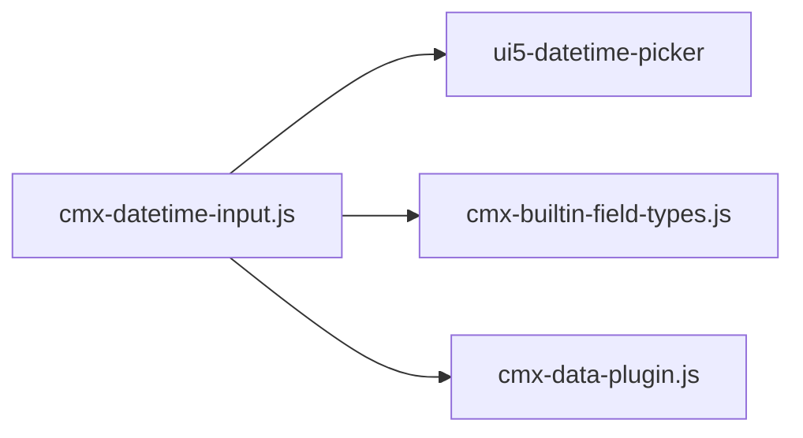

# 日期时间输入组件

<cite>
**本文引用的文件**
- [cmx-datetime-input.js](file://packages/cmx-data-comp/src/components/cmx-datetime-input.js)
- [input-editors.md](file://.agents/skills/cmx-components-guide/references/input-editors.md)
- [cmx-builtin-field-types.js](file://packages/cmx-data-comp/src/lib/cmx-builtin-field-types.js)
- [cmx-data-plugin.js](file://CMXHTMLDesigner/src/plugins/cmx-data-plugin.js)
</cite>

## 目录
1. [简介](#简介)
2. [项目结构](#项目结构)
3. [核心组件](#核心组件)
4. [架构总览](#架构总览)
5. [详细组件分析](#详细组件分析)
6. [依赖关系分析](#依赖关系分析)
7. [性能与可用性](#性能与可用性)
8. [故障排查指南](#故障排查指南)
9. [结论](#结论)
10. [附录：使用示例与最佳实践](#附录使用示例与最佳实践)

## 简介
CmxDateTimeInput（自定义元素 <cmx-datetime-input>）是用于表单与网格的“日期+时间”输入编辑器。它封装 UI5 的 DateTimePicker，提供统一的字段配置、值读写、校验与事件机制，支持在 cmx-ui5-form 与 cmx-revo-grid 中作为 datetime 字段的编辑控件。其默认值为字符串格式 yyyy-MM-dd HH:mm:ss，可通过 formatPattern/format 自定义显示/输入格式，并支持最小/最大日期范围限制、占位文本与只读模式。

## 项目结构
- 组件实现位于 packages/cmx-data-comp/src/components/cmx-datetime-input.js
- 设计器拖拽与属性面板定义位于 CMXHTMLDesigner/src/plugins/cmx-data-plugin.js
- 内置字段类型注册与表单/网格集成位于 packages/cmx-data-comp/src/lib/cmx-builtin-field-types.js
- 统一输入编辑器文档与示例位于 .agents/skills/cmx-components-guide/references/input-editors.md

图表来源
- [cmx-datetime-input.js:1-212](file://packages/cmx-data-comp/src/components/cmx-datetime-input.js#L1-L212)
- [cmx-builtin-field-types.js:580-592](file://packages/cmx-data-comp/src/lib/cmx-builtin-field-types.js#L580-L592)
- [cmx-data-plugin.js:532-533](file://CMXHTMLDesigner/src/plugins/cmx-data-plugin.js#L532-L533)
- [input-editors.md:250-310](file://.agents/skills/cmx-components-guide/references/input-editors.md#L250-L310)

章节来源
- [cmx-datetime-input.js:1-212](file://packages/cmx-data-comp/src/components/cmx-datetime-input.js#L1-L212)
- [input-editors.md:250-310](file://.agents/skills/cmx-components-guide/references/input-editors.md#L250-L310)

## 核心组件
- 组件名：<cmx-datetime-input>
- 封装控件：UI5 DateTimePicker
- 值类型：字符串（按 formatPattern 格式化后的文本）
- 默认格式：yyyy-MM-dd HH:mm:ss
- 公开 API：setField(field)、setValue(v, {silent})、getValue()、setReadonly(b)、setPlaceholder(t)、focus()、validate()、commitPending()
- 事件：cmx-value-change（detail: { value, valid }），bubbles + composed

章节来源
- [cmx-datetime-input.js:7-19](file://packages/cmx-data-comp/src/components/cmx-datetime-input.js#L7-L19)
- [input-editors.md:17-36](file://.agents/skills/cmx-components-guide/references/input-editors.md#L17-L36)

## 架构总览
CmxDateTimeInput 通过 setField 读取 field.* 与 editSettings.* 的配置项，将格式、范围、占位符、只读等映射到内部状态，并同步到 ui5-datetime-picker 的属性。用户交互触发 change 事件后，组件执行 validate 并将结果以 cmx-value-change 事件向上冒泡。组件同时支持 HTML 声明式属性（format、min-date、max-date、placeholder、readonly），在未外部 setField 时自动从属性拼装 field。

图表来源
- [cmx-datetime-input.js:88-104](file://packages/cmx-data-comp/src/components/cmx-datetime-input.js#L88-L104)
- [cmx-datetime-input.js:118-146](file://packages/cmx-data-comp/src/components/cmx-datetime-input.js#L118-L146)
- [cmx-datetime-input.js:152-169](file://packages/cmx-data-comp/src/components/cmx-datetime-input.js#L152-L169)
- [cmx-datetime-input.js:182-198](file://packages/cmx-data-comp/src/components/cmx-datetime-input.js#L182-L198)

## 详细组件分析

### 配置与数据绑定
- 配置来源优先级：field.formatPattern / field.format / editSettings.formatPattern / editSettings.format；未设置时使用默认 yyyy-MM-dd HH:mm:ss
- 范围限制：field.minDate / es.minDate 与 field.maxDate / es.maxDate，映射为 picker 的 min-date / max-date
- 占位符与只读：field.placeholder / es.placeholder 与 field.readonly
- 声明式属性：format、min-date、max-date、placeholder、readonly，会在 connectedCallback 或 attributeChangedCallback 中转换为 field 并应用
- 值读写：setValue 接受字符串或 null，内部保存为字符串；getValue 返回当前值；commitPending 将 picker 挂起文本提交到内部 _value

章节来源
- [cmx-datetime-input.js:95-104](file://packages/cmx-data-comp/src/components/cmx-datetime-input.js#L95-L104)
- [cmx-datetime-input.js:111-136](file://packages/cmx-data-comp/src/components/cmx-datetime-input.js#L111-L136)
- [cmx-datetime-input.js:41-63](file://packages/cmx-data-comp/src/components/cmx-datetime-input.js#L41-L63)
- [input-editors.md:254-272](file://.agents/skills/cmx-components-guide/references/input-editors.md#L254-L272)

### 时间选择功能
- 小时/分钟/秒：由底层 ui5-datetime-picker 提供下拉时间选择能力，组件透传格式与范围控制
- 12/24 小时制：由 UI5 DateTimePicker 根据 locale 与格式决定；组件不直接暴露切换开关，可通过格式串与 locale 间接影响显示
- 时间间隔控制：组件未暴露 step 或时间步长配置；如需细粒度控制，可在上层业务逻辑中约束取值或使用更高层表单/网格规则

章节来源
- [cmx-datetime-input.js:22-24](file://packages/cmx-data-comp/src/components/cmx-datetime-input.js#L22-L24)
- [cmx-datetime-input.js:182-190](file://packages/cmx-data-comp/src/components/cmx-datetime-input.js#L182-L190)
- [input-editors.md:274-280](file://.agents/skills/cmx-components-guide/references/input-editors.md#L274-L280)

### 验证机制
- 格式校验：委托 ui5-datetime-picker 的 isValid(value)；空值放行
- 错误提示：当格式不合法时返回固定错误信息字符串
- 必填验证：组件本身不强制必填；若需必填，请在上层表单或业务规则中增加必填校验
- 自定义业务规则：可在 cmx-value-change 事件中监听 valid 字段，结合业务上下文进行额外校验与提示

图表来源
- [cmx-datetime-input.js:138-146](file://packages/cmx-data-comp/src/components/cmx-datetime-input.js#L138-L146)

章节来源
- [cmx-datetime-input.js:138-146](file://packages/cmx-data-comp/src/components/cmx-datetime-input.js#L138-L146)
- [input-editors.md:30-36](file://.agents/skills/cmx-components-guide/references/input-editors.md#L30-L36)

### 数据绑定与格式化
- 值类型：始终为字符串，遵循 formatPattern 的显示格式
- 本地化显示：由 UI5 DateTimePicker 根据 locale 与格式串渲染；组件不直接管理本地化
- 时区处理：组件未显式处理时区转换；如需时区相关行为，请在上层服务或展示层处理
- ISO 格式支持：可通过 formatPattern 设置为 ISO 风格（如 yyyy-MM-dd'T'HH:mm:ss），但存储仍为字符串；如需标准 ISO 字符串输出，建议在提交前做格式化处理

章节来源
- [cmx-datetime-input.js:24-24](file://packages/cmx-data-comp/src/components/cmx-datetime-input.js#L24-L24)
- [cmx-datetime-input.js:118-129](file://packages/cmx-data-comp/src/components/cmx-datetime-input.js#L118-L129)
- [input-editors.md:274-280](file://.agents/skills/cmx-components-guide/references/input-editors.md#L274-L280)

### 与表单和网格的集成
- 表单集成：通过内置字段类型 'datetime' 注册，使用 makeInputFormImpl('cmx-datetime-input', 'datetime')
- 网格集成：通过内置字段类型 'datetime' 注册，使用 makeInputGridEditor('cmx-datetime-input', 'datetime')
- 设计器支持：在设计器中以 tag 'cmx-datetime-input' 提供拖拽与属性面板

章节来源
- [cmx-builtin-field-types.js:587-591](file://packages/cmx-data-comp/src/lib/cmx-builtin-field-types.js#L587-L591)
- [cmx-data-plugin.js:532-533](file://CMXHTMLDesigner/src/plugins/cmx-data-plugin.js#L532-L533)

## 依赖关系分析
- 外部依赖：@ui5/webcomponents/dist/DateTimePicker.js
- 内部依赖：无直接 JS 依赖，仅通过内置字段类型注册与表单/网格框架协作
- 耦合度：低；组件职责单一，主要关注配置映射、值读写、校验与事件派发

图表来源
- [cmx-datetime-input.js:22-22](file://packages/cmx-data-comp/src/components/cmx-datetime-input.js#L22-L22)
- [cmx-builtin-field-types.js:587-591](file://packages/cmx-data-comp/src/lib/cmx-builtin-field-types.js#L587-L591)
- [cmx-data-plugin.js:532-533](file://CMXHTMLDesigner/src/plugins/cmx-data-plugin.js#L532-L533)

章节来源
- [cmx-datetime-input.js:22-22](file://packages/cmx-data-comp/src/components/cmx-datetime-input.js#L22-L22)
- [cmx-builtin-field-types.js:587-591](file://packages/cmx-data-comp/src/lib/cmx-builtin-field-types.js#L587-L591)
- [cmx-data-plugin.js:532-533](file://CMXHTMLDesigner/src/plugins/cmx-data-plugin.js#L532-L533)

## 性能与可用性
- 渲染开销：首次渲染创建 shadow DOM 与 ui5-datetime-picker，后续复用实例；change 事件轻量派发
- 图标对齐修复：通过多次 requestAnimationFrame 修正图标垂直居中，避免布局抖动
- 可访问性：继承 UI5 DateTimePicker 的可访问性特性；组件自身不引入额外无障碍负担
- 建议：在大量网格单元格中使用该组件时，注意父容器尺寸与样式，确保宽度撑满以避免重排

章节来源
- [cmx-datetime-input.js:152-180](file://packages/cmx-data-comp/src/components/cmx-datetime-input.js#L152-L180)
- [input-editors.md:40-43](file://.agents/skills/cmx-components-guide/references/input-editors.md#L40-L43)

## 故障排查指南
- 值未更新：确认是否在 grid 取值前调用 commitPending，以确保 picker 的挂起文本被提交到内部 _value
- 校验失败：检查 formatPattern 是否与输入一致；空值会放行，若需必填请在上层添加必填规则
- 范围限制无效：确认 min-date / max-date 已正确传入并生效；注意格式应与 formatPattern 匹配
- 事件未触发：确认未在 setValue 中设置 silent:true；或在 change 事件中捕获 cmx-value-change

章节来源
- [cmx-datetime-input.js:131-146](file://packages/cmx-data-comp/src/components/cmx-datetime-input.js#L131-L146)
- [cmx-datetime-input.js:118-123](file://packages/cmx-data-comp/src/components/cmx-datetime-input.js#L118-L123)

## 结论
CmxDateTimeInput 提供了简洁稳定的日期时间输入能力，适合在表单与网格中作为 datetime 字段的统一编辑器。其核心价值在于：
- 统一的字段配置与值读写接口
- 基于 UI5 的可靠时间与日期选择体验
- 轻量校验与事件机制，便于上层扩展业务规则
- 良好的设计与开发体验（设计器支持与文档完善）

对于更复杂的时间控制需求（如秒级精度、时区处理、时间步长），建议在上层业务层进行增强与封装。

## 附录：使用示例与最佳实践

### 基本日期时间选择
- 通过 setField 配置 format 与 placeholder，并使用 setValue 回填初始值
- 监听 cmx-value-change 获取最新值与校验结果

章节来源
- [input-editors.md:282-299](file://.agents/skills/cmx-components-guide/references/input-editors.md#L282-L299)

### 时间范围控制
- 使用 minDate / maxDate 限制可选日期范围
- 在 cmx-value-change 中结合业务规则进一步约束（例如开始时间不得晚于结束时间）

章节来源
- [input-editors.md:264-272](file://.agents/skills/cmx-components-guide/references/input-editors.md#L264-L272)
- [cmx-datetime-input.js:95-104](file://packages/cmx-data-comp/src/components/cmx-datetime-input.js#L95-L104)

### 复杂业务场景
- 多字段联动：在一个表单中组合多个 datetime 字段，利用 cmx-value-change 实现联动校验
- 网格编辑：在 cmx-revo-grid 中通过列模型指定 editMode: 'datetime'，配合 editSettings 配置格式与范围
- 提交前处理：在提交前调用 getValue 或 commitPending，并按需对字符串进行二次格式化（如转为 ISO 字符串）

章节来源
- [input-editors.md:303-333](file://.agents/skills/cmx-components-guide/references/input-editors.md#L303-L333)
- [cmx-datetime-input.js:118-136](file://packages/cmx-data-comp/src/components/cmx-datetime-input.js#L118-L136)