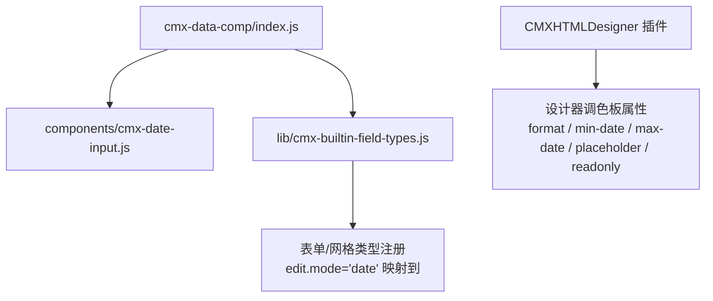
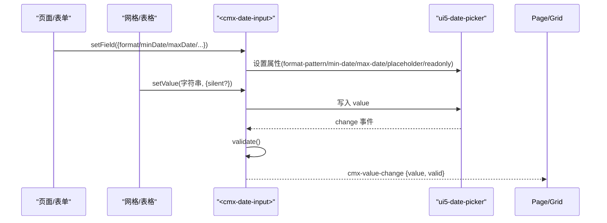
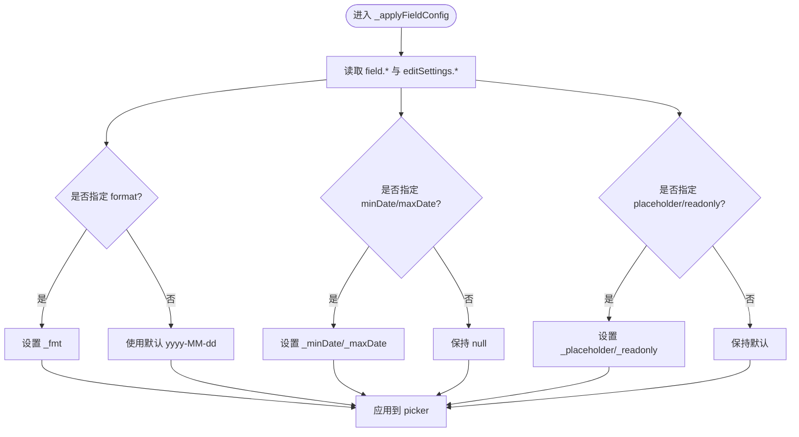
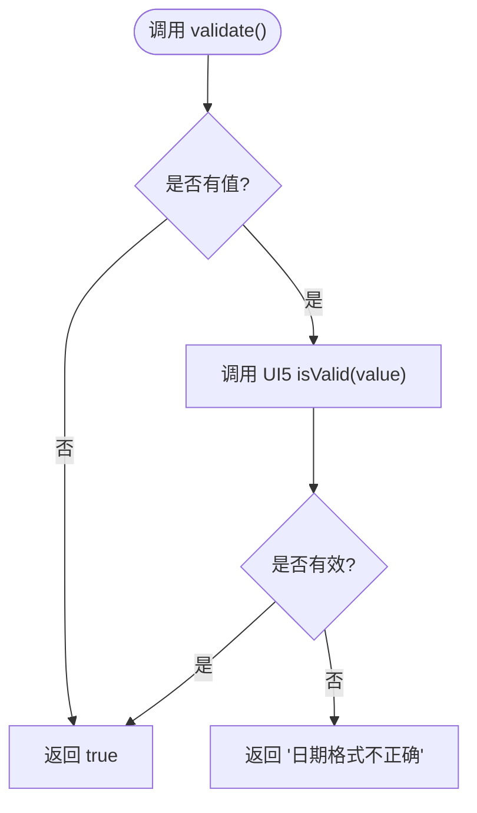
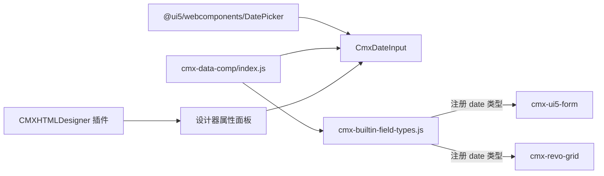

# 日期输入组件

<cite>
**本文引用的文件**
- [cmx-date-input.js](file://packages/cmx-data-comp/src/components/cmx-date-input.js)
- [input-editors.md](file://.agents/skills/cmx-components-guide/references/input-editors.md)
- [cmx-builtin-field-types.js](file://packages/cmx-data-comp/src/lib/cmx-builtin-field-types.js)
- [index.js](file://packages/cmx-data-comp/src/index.js)
- [cmx-data-plugin.js](file://CMXHTMLDesigner/src/plugins/cmx-data-plugin.js)
- [20260722_cmx-ui5-runtime_dev双实例locale-data根因分析.md](file://documents/复杂问题分析/20260722_cmx-ui5-runtime_dev双实例locale-data根因分析.md)
</cite>

## 目录
1. [简介](#简介)
2. [项目结构](#项目结构)
3. [核心组件](#核心组件)
4. [架构总览](#架构总览)
5. [详细组件分析](#详细组件分析)
6. [依赖关系分析](#依赖关系分析)
7. [性能与可用性](#性能与可用性)
8. [故障排查指南](#故障排查指南)
9. [结论](#结论)
10. [附录：使用示例与最佳实践](#附录使用示例与最佳实践)

## 简介
本组件文档围绕 CmxDateInput（<cmx-date-input>）展开，它是基于 UI5 DatePicker 封装的“日期”字段编辑器，同时服务于表单与网格列编辑场景。它提供：
- 配置化日期格式、可选范围、占位文本与只读模式
- 下拉日历选择与基础校验
- 统一的事件模型 cmx-value-change，便于上层表单/网格集成
- 与平台元数据驱动的列定义、设计器属性面板联动

注意：当前版本聚焦于“日期”（不含时间），默认格式为 yyyy-MM-dd；如需时间，请使用 CmxDatetimeInput。

## 项目结构
CmxDateInput 位于数据组件包中，作为基础输入列编辑器之一被统一注册并导出，供表单与网格复用。

图表来源
- [index.js:20-24](file://packages/cmx-data-comp/src/index.js#L20-L24)
- [cmx-builtin-field-types.js:583-585](file://packages/cmx-data-comp/src/lib/cmx-builtin-field-types.js#L583-L585)
- [cmx-data-plugin.js:503-529](file://CMXHTMLDesigner/src/plugins/cmx-data-plugin.js#L503-L529)

章节来源
- [index.js:20-24](file://packages/cmx-data-comp/src/index.js#L20-L24)
- [cmx-builtin-field-types.js:583-585](file://packages/cmx-data-comp/src/lib/cmx-builtin-field-types.js#L583-L585)
- [cmx-data-plugin.js:503-529](file://CMXHTMLDesigner/src/plugins/cmx-data-plugin.js#L503-L529)

## 核心组件
CmxDateInput 是一个自定义元素，内部挂载 ui5-date-picker，并通过 Shadow DOM 隔离样式与行为。对外暴露统一的 API 与事件：
- 配置绑定：setField(field)，支持 field.* 与 editSettings.* 两种路径
- 值读写：setValue(v, {silent}) / getValue()，值为字符串（按 formatPattern）
- 状态控制：setReadonly(b)、setPlaceholder(t)、focus()
- 校验：validate() -> true | string
- 提交挂起值：commitPending()（用于网格取值前同步）
- 事件：cmx-value-change，detail 包含 value 与 valid

章节来源
- [cmx-date-input.js:26-147](file://packages/cmx-data-comp/src/components/cmx-date-input.js#L26-L147)
- [input-editors.md:17-42](file://.agents/skills/cmx-components-guide/references/input-editors.md#L17-L42)

## 架构总览
下图展示了从页面/设计器到组件再到 UI5 DatePicker 的调用链与数据流。

图表来源
- [cmx-date-input.js:152-172](file://packages/cmx-data-comp/src/components/cmx-date-input.js#L152-L172)
- [cmx-date-input.js:185-201](file://packages/cmx-data-comp/src/components/cmx-date-input.js#L185-L201)
- [cmx-date-input.js:207-211](file://packages/cmx-data-comp/src/components/cmx-date-input.js#L207-L211)

## 详细组件分析

### 配置选项与映射
- 声明式属性（observedAttributes）：format、min-date、max-date、placeholder、readonly
- 通过 HTML 属性或 setField 传入，最终解析为内部 _fmt/_minDate/_maxDate/_placeholder/_readonly
- 优先级：field.formatPattern/field.format/editSettings.formatPattern/editSettings.format，缺省为 yyyy-MM-dd
- 范围限制：minDate/maxDate 透传到 UI5 DatePicker 的 min-date/max-date
- 只读与占位：readonly/placeholder 直接映射到 picker 属性

图表来源
- [cmx-date-input.js:95-104](file://packages/cmx-data-comp/src/components/cmx-date-input.js#L95-L104)
- [cmx-date-input.js:185-194](file://packages/cmx-data-comp/src/components/cmx-date-input.js#L185-L194)

章节来源
- [cmx-date-input.js:41-104](file://packages/cmx-data-comp/src/components/cmx-date-input.js#L41-L104)
- [cmx-date-input.js:185-194](file://packages/cmx-data-comp/src/components/cmx-date-input.js#L185-L194)

### 日历面板能力
- 基于 UI5 DatePicker，具备下拉日历选择能力
- 月份导航、年份选择等由 UI5 DatePicker 提供
- 当前实现未显式暴露 visible-months、show-week-numbers、week-start 等高级属性；可通过 UI5 原生能力扩展
- 在开发环境下，平台对 Calendar 渲染进行了补丁以修复多实例 locale-data 问题，确保日历头部文案正确显示

章节来源
- [cmx-date-input.js:22](file://packages/cmx-data-comp/src/components/cmx-date-input.js#L22)
- [20260722_cmx-ui5-runtime_dev双实例locale-data根因分析.md:224-267](file://documents/复杂问题分析/20260722_cmx-ui5-runtime_dev双实例locale-data根因分析.md#L224-L267)

### 验证机制
- 内置格式校验：当存在值时，委托 UI5 DatePicker 的 isValid(value) 进行格式校验；空值放行
- 返回 true 表示合法，否则返回错误信息字符串
- 必填校验：组件本身不强制必填；可在上层业务规则或表单层通过 required 或自定义规则实现
- 业务规则验证：可结合灵活组合引擎或表单层的 validations 表达式进行跨字段/条件校验

图表来源
- [cmx-date-input.js:138-147](file://packages/cmx-data-comp/src/components/cmx-date-input.js#L138-L147)

章节来源
- [cmx-date-input.js:138-147](file://packages/cmx-data-comp/src/components/cmx-date-input.js#L138-L147)
- [input-editors.md:17-42](file://.agents/skills/cmx-components-guide/references/input-editors.md#L17-L42)

### 数据绑定与格式化
- 值类型为字符串，遵循 formatPattern 的文本形式
- setValue/getValue 直接操作字符串；commitPending 用于网格取值前将输入框中的挂起文本同步到内部 _value
- 本地化显示：依赖 UI5 DatePicker 的 locale 与格式串；平台在运行时对 Calendar 头部的月/年文案做了兼容处理
- 时区处理：当前组件仅处理“日期”，不涉及时间与时区转换；如需时间，请使用 CmxDatetimeInput

章节来源
- [cmx-date-input.js:111-136](file://packages/cmx-data-comp/src/components/cmx-date-input.js#L111-L136)
- [input-editors.md:219-225](file://.agents/skills/cmx-components-guide/references/input-editors.md#L219-L225)
- [20260722_cmx-ui5-runtime_dev双实例locale-data根因分析.md:224-267](file://documents/复杂问题分析/20260722_cmx-ui5-runtime_dev双实例locale-data根因分析.md#L224-L267)

### 事件模型
- cmx-value-change：值变化时触发，detail 包含 value 与 valid
- 事件冒泡与穿透：bubbles + composed，便于在父级捕获
- 在 change 事件中自动执行 validate()，并将结果放入 detail.valid

章节来源
- [cmx-date-input.js:152-172](file://packages/cmx-data-comp/src/components/cmx-date-input.js#L152-L172)
- [cmx-date-input.js:207-211](file://packages/cmx-data-comp/src/components/cmx-date-input.js#L207-L211)
- [input-editors.md:30-36](file://.agents/skills/cmx-components-guide/references/input-editors.md#L30-L36)

## 依赖关系分析
- 外部依赖：@ui5/webcomponents/dist/DatePicker.js
- 注册与导出：通过 barrel index.js 导入并注册自定义元素；同时导出 CmxDateInput 类
- 类型注册：在 cmx-builtin-field-types.js 中将 'date' 类型映射到 <cmx-date-input>，供表单与网格使用
- 设计器集成：CMXHTMLDesigner 插件为该组件定义调色板属性，便于可视化配置

图表来源
- [cmx-date-input.js:22](file://packages/cmx-data-comp/src/components/cmx-date-input.js#L22)
- [index.js:20-24](file://packages/cmx-data-comp/src/index.js#L20-L24)
- [cmx-builtin-field-types.js:583-585](file://packages/cmx-data-comp/src/lib/cmx-builtin-field-types.js#L583-L585)
- [cmx-data-plugin.js:503-529](file://CMXHTMLDesigner/src/plugins/cmx-data-plugin.js#L503-L529)

章节来源
- [index.js:20-24](file://packages/cmx-data-comp/src/index.js#L20-L24)
- [cmx-builtin-field-types.js:583-585](file://packages/cmx-data-comp/src/lib/cmx-builtin-field-types.js#L583-L585)
- [cmx-data-plugin.js:503-529](file://CMXHTMLDesigner/src/plugins/cmx-data-plugin.js#L503-L529)

## 性能与可用性
- 轻量封装：仅引入一个 UI5 DatePicker，避免额外开销
- Shadow DOM 隔离：减少样式冲突，提升稳定性
- 最小重绘：_writeToPicker 仅在值变化时更新 picker.value，避免光标抖动
- 图标对齐优化：针对单元格编辑器场景，修正内部图标垂直对齐，提升视觉一致性
- 开发环境兼容性：平台对 Calendar 渲染进行补丁，保证多实例下 locale-data 正常，避免头部文案异常

章节来源
- [cmx-date-input.js:152-183](file://packages/cmx-data-comp/src/components/cmx-date-input.js#L152-L183)
- [20260722_cmx-ui5-runtime_dev双实例locale-data根因分析.md:224-267](file://documents/复杂问题分析/20260722_cmx-ui5-runtime_dev双实例locale-data根因分析.md#L224-L267)

## 故障排查指南
- 日期格式不正确：检查 formatPattern 是否与输入一致；validate() 会返回错误信息
- 范围限制无效：确认 minDate/maxDate 已正确传入并映射到 picker 的 min-date/max-date
- 只读/占位未生效：确认 setReadonly/setPlaceholder 已调用且 picker 已渲染
- 网格取值异常：在取值前调用 commitPending() 以提交挂起文本
- 日历头部文案异常（开发环境）：平台已对 Calendar onAfterRendering 进行补丁，若仍出现，请检查 UI5 版本与运行环境

章节来源
- [cmx-date-input.js:138-147](file://packages/cmx-data-comp/src/components/cmx-date-input.js#L138-L147)
- [cmx-date-input.js:185-201](file://packages/cmx-data-comp/src/components/cmx-date-input.js#L185-L201)
- [20260722_cmx-ui5-runtime_dev双实例locale-data根因分析.md:224-267](file://documents/复杂问题分析/20260722_cmx-ui5-runtime_dev双实例locale-data根因分析.md#L224-L267)

## 结论
CmxDateInput 提供了简洁、稳定的日期输入能力，适配表单与网格场景，具备格式、范围、只读与占位等常用配置，并通过统一事件模型与上层集成。其基于 UI5 DatePicker，具备良好的交互体验与本地化支持。对于更复杂的日历功能（如多个月可见、周数显示、快捷范围等），可在现有基础上扩展或直接使用 UI5 能力。

## 附录：使用示例与最佳实践

### 基本日期选择
- 创建组件并配置格式、占位与范围
- 监听 cmx-value-change 获取值与校验结果
- 使用 setValue/getValue 进行数据绑定

参考路径
- [input-editors.md:227-246](file://.agents/skills/cmx-components-guide/references/input-editors.md#L227-L246)

### 日期范围选择
- 通过 minDate/maxDate 限制可选范围
- 在上层业务逻辑中维护起止日期，必要时动态更新组件配置
- 如需“快捷日期”或“预设范围”，可在上层封装或使用 UI5 提供的扩展能力

参考路径
- [cmx-date-input.js:95-104](file://packages/cmx-data-comp/src/components/cmx-date-input.js#L95-L104)
- [cmx-date-input.js:185-194](file://packages/cmx-data-comp/src/components/cmx-date-input.js#L185-L194)

### 复杂业务场景
- 必填校验：在表单层或灵活组合引擎中配置 required 或 validations 表达式
- 跨字段校验：例如“结束日期不得早于开始日期”，可在业务规则中计算并提示
- 本地化显示：依赖 UI5 DatePicker 的 locale；平台已对 Calendar 头部文案做兼容处理
- 时区处理：当前组件仅处理“日期”，不涉及时区；如需时间，请使用 CmxDatetimeInput

参考路径
- [input-editors.md:17-42](file://.agents/skills/cmx-components-guide/references/input-editors.md#L17-L42)
- [20260722_cmx-ui5-runtime_dev双实例locale-data根因分析.md:224-267](file://documents/复杂问题分析/20260722_cmx-ui5-runtime_dev双实例locale-data根因分析.md#L224-L267)