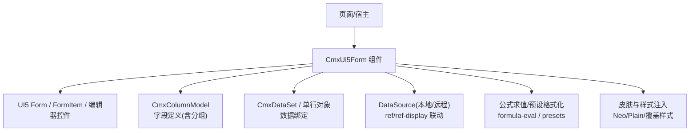
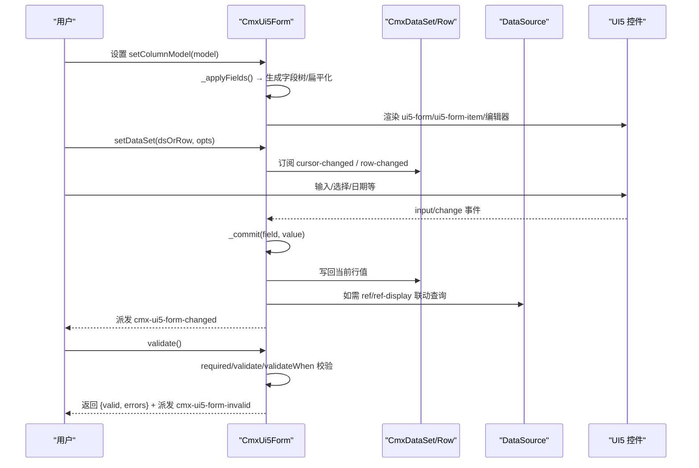
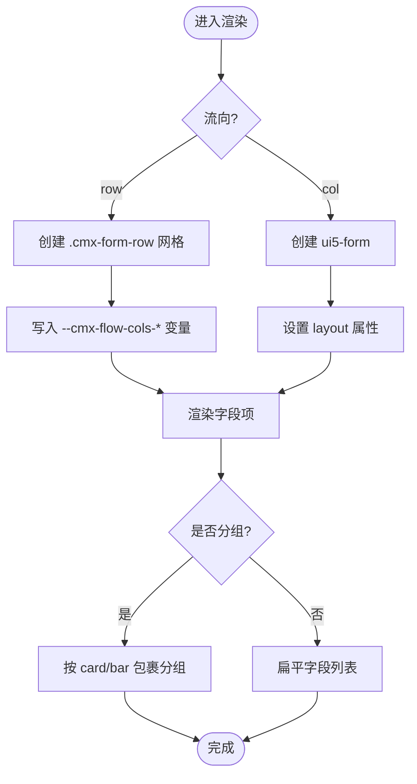
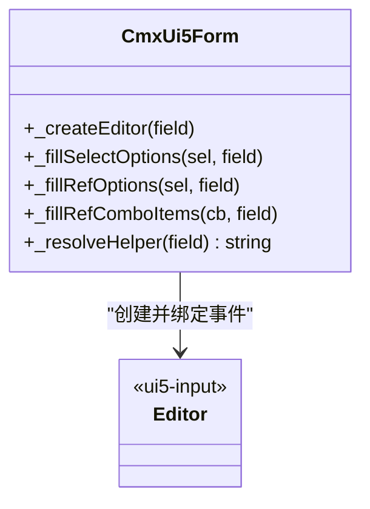
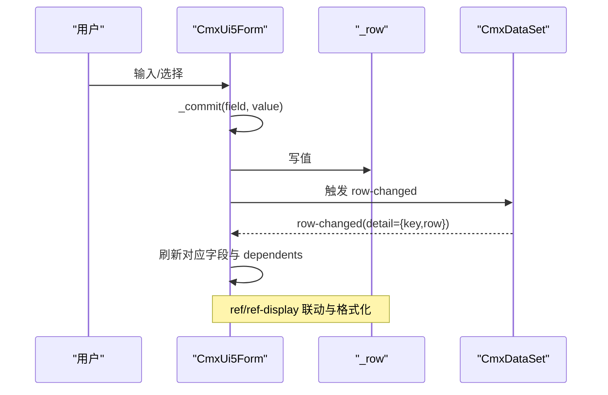
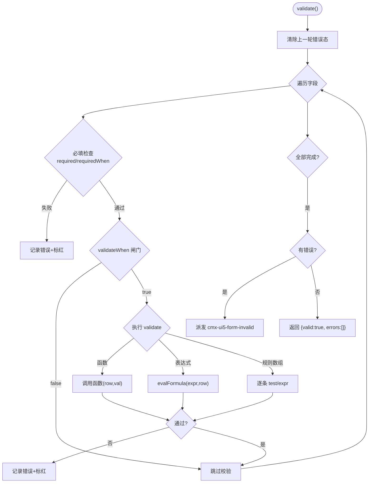
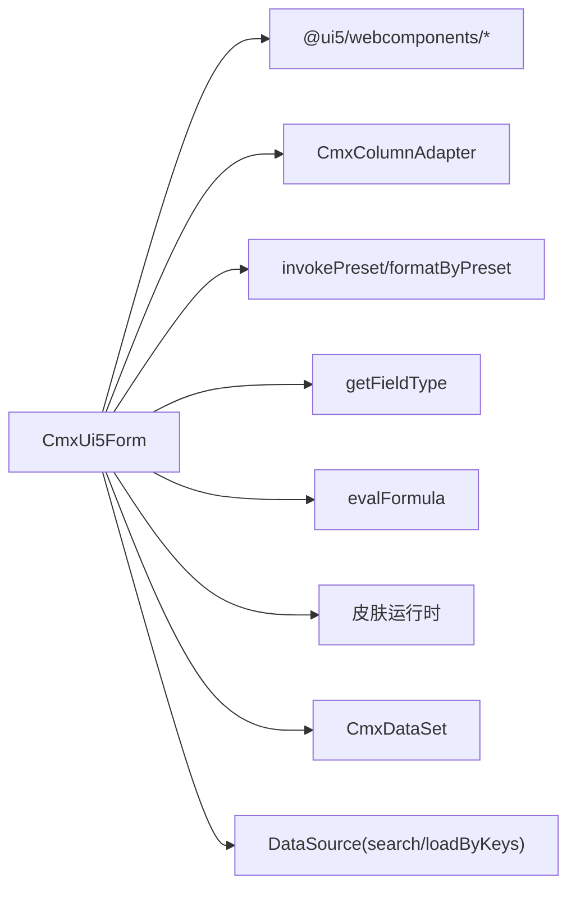

# 表单容器 (CmxUi5Form)

<cite>
**本文引用的文件**
- [cmx-ui5-form.js](file://packages/cmx-data-comp/src/components/cmx-ui5-form.js)
- [build-cmx-ui5-form-inspector.js](file://CMXHTMLDesigner/src/plugins/cmx-inspector/build-cmx-ui5-form-inspector.js)
- [form-components.md](file://.agents/skills/cmx-components-guide/references/form-components.md)
- [layout-containers.md](file://.agents/skills/cmx-components-guide/references/layout-containers.md)
- [init-page-models.js](file://packages/cmx-data-comp/src/lib/init-page-models.js)
</cite>

## 目录
1. [简介](#简介)
2. [项目结构](#项目结构)
3. [核心组件](#核心组件)
4. [架构总览](#架构总览)
5. [详细组件分析](#详细组件分析)
6. [依赖关系分析](#依赖关系分析)
7. [性能考量](#性能考量)
8. [故障排查指南](#故障排查指南)
9. [结论](#结论)
10. [附录](#附录)

## 简介
CmxUi5Form 是一个基于 SAP UI5 Form 的元数据驱动单行编辑表单容器，通过 CmxColumnModel 自动渲染字段、支持分组与响应式布局、提供双向数据绑定（与 CmxDataSet/单行对象）、内置与自定义验证机制、以及丰富的事件体系。它同时提供设计器侧的 Inspector 配置能力，便于在页面设计阶段完成表单建模与交互配置。

## 项目结构
围绕 CmxUi5Form 的关键文件与职责：
- 组件实现：packages/cmx-data-comp/src/components/cmx-ui5-form.js
- 设计器 Inspector：CMXHTMLDesigner/src/plugins/cmx-inspector/build-cmx-ui5-form-inspector.js
- 组件使用参考：.agents/skills/cmx-components-guide/references/form-components.md
- 模型初始化与列定义透传：packages/cmx-data-comp/src/lib/init-page-models.js
- 布局容器参考（与表单组合使用）：.agents/skills/cmx-components-guide/references/layout-containers.md

图表来源
- [cmx-ui5-form.js:69-122](file://packages/cmx-data-comp/src/components/cmx-ui5-form.js#L69-L122)
- [cmx-ui5-form.js:460-472](file://packages/cmx-data-comp/src/components/cmx-ui5-form.js#L460-L472)
- [cmx-ui5-form.js:592-621](file://packages/cmx-data-comp/src/components/cmx-ui5-form.js#L592-L621)
- [cmx-ui5-form.js:756-768](file://packages/cmx-data-comp/src/components/cmx-ui5-form.js#L756-L768)
- [cmx-ui5-form.js:235-256](file://packages/cmx-data-comp/src/components/cmx-ui5-form.js#L235-L256)

章节来源
- [cmx-ui5-form.js:1-122](file://packages/cmx-data-comp/src/components/cmx-ui5-form.js#L1-L122)
- [build-cmx-ui5-form-inspector.js:1-146](file://CMXHTMLDesigner/src/plugins/cmx-inspector/build-cmx-ui5-form-inspector.js#L1-L146)
- [form-components.md:20-70](file://.agents/skills/cmx-components-guide/references/form-components.md#L20-L70)

## 核心组件
- 组件类：CmxUi5Form（Web Component），封装 Shadow DOM、模板、样式、事件与 API。
- 字段定义：仅允许来自 CmxColumnModel（setColumnModel / data-cmx-model-id）。
- 数据绑定：支持 CmxDataSet（游标驱动）或单行对象；支持 ref/ref-display 联动与异步数据源。
- 布局：支持 row/col 流向与响应式 S/M/L/XL 断点列数；支持分组 card/bar 风格。
- 验证：required/requiredWhen/validate/validateWhen 及规则数组；失败时派发 cmx-ui5-form-invalid。
- 事件：cmx-ui5-form-changed（字段提交）、cmx-ui5-form-invalid（校验失败）。
- 外观：Neo/Plain/Default/None 皮肤，紧凑密度 compact，页面级样式覆盖。

章节来源
- [cmx-ui5-form.js:69-122](file://packages/cmx-data-comp/src/components/cmx-ui5-form.js#L69-L122)
- [cmx-ui5-form.js:460-472](file://packages/cmx-data-comp/src/components/cmx-ui5-form.js#L460-L472)
- [cmx-ui5-form.js:592-621](file://packages/cmx-data-comp/src/components/cmx-ui5-form.js#L592-L621)
- [cmx-ui5-form.js:678-723](file://packages/cmx-data-comp/src/components/cmx-ui5-form.js#L678-L723)
- [form-components.md:20-70](file://.agents/skills/cmx-components-guide/references/form-components.md#L20-L70)

## 架构总览
CmxUi5Form 以“字段定义→渲染→数据绑定→事件/验证”为主线，结合 DataSource 与公式/预设系统，形成可插拔、可扩展的表单运行时。

图表来源
- [cmx-ui5-form.js:460-472](file://packages/cmx-data-comp/src/components/cmx-ui5-form.js#L460-L472)
- [cmx-ui5-form.js:592-621](file://packages/cmx-data-comp/src/components/cmx-ui5-form.js#L592-L621)
- [cmx-ui5-form.js:629-665](file://packages/cmx-data-comp/src/components/cmx-ui5-form.js#L629-L665)
- [cmx-ui5-form.js:678-723](file://packages/cmx-data-comp/src/components/cmx-ui5-form.js#L678-L723)
- [cmx-ui5-form.js:1246-1412](file://packages/cmx-data-comp/src/components/cmx-ui5-form.js#L1246-L1412)

## 详细组件分析

### 布局管理与分组
- 流向模式：
  - row：行优先 CSS Grid，绕开 UI5 默认的列优先，适合多列并排；支持跨列 colspan。
  - col：列优先（报纸式），沿用 UI5 Form 行为。
- 响应式列数：S1 M2 L3 XL3 格式，解析为各断点列数并通过 CSS 变量驱动 @container 规则。
- 分组：支持嵌套 group，card/bar 两种视觉风格；分组标题通过 ui5-form::part(header) 或 row 模式的 div 标题呈现。
- 标签对齐与占位：固定 label 列宽（compact 更窄），必填星号前置，冒号右缘对齐。

图表来源
- [cmx-ui5-form.js:913-977](file://packages/cmx-data-comp/src/components/cmx-ui5-form.js#L913-L977)
- [cmx-ui5-form.js:980-1020](file://packages/cmx-data-comp/src/components/cmx-ui5-form.js#L980-L1020)
- [cmx-ui5-form.js:512-549](file://packages/cmx-data-comp/src/components/cmx-ui5-form.js#L512-L549)
- [cmx-ui5-form.js:263-439](file://packages/cmx-data-comp/src/components/cmx-ui5-form.js#L263-L439)

章节来源
- [cmx-ui5-form.js:508-549](file://packages/cmx-data-comp/src/components/cmx-ui5-form.js#L508-L549)
- [cmx-ui5-form.js:913-1020](file://packages/cmx-data-comp/src/components/cmx-ui5-form.js#L913-L1020)
- [cmx-ui5-form.js:263-439](file://packages/cmx-data-comp/src/components/cmx-ui5-form.js#L263-L439)

### 字段类型与编辑器
- 内置类型：text、number、textarea、date、select、checkbox、readonly、ref、ref-display。
- 扩展机制：通过 cmx-form-field-registry 注册外部类型，优先于内置分支。
- ref 字段交互 helper：dropdown、combo-search、remote-search（带搜索防抖与 suggestion 列表）。
- 选项填充：普通 select 与 ref 下拉均支持 displayTemplate 与空占位策略（非必填才插入空项）。

图表来源
- [cmx-ui5-form.js:1246-1412](file://packages/cmx-data-comp/src/components/cmx-ui5-form.js#L1246-L1412)
- [cmx-ui5-form.js:1414-1493](file://packages/cmx-data-comp/src/components/cmx-ui5-form.js#L1414-L1493)
- [cmx-ui5-form.js:1495-1506](file://packages/cmx-data-comp/src/components/cmx-ui5-form.js#L1495-L1506)

章节来源
- [cmx-ui5-form.js:1246-1412](file://packages/cmx-data-comp/src/components/cmx-ui5-form.js#L1246-L1412)
- [cmx-ui5-form.js:1414-1493](file://packages/cmx-data-comp/src/components/cmx-ui5-form.js#L1414-L1493)
- [cmx-ui5-form.js:1495-1506](file://packages/cmx-data-comp/src/components/cmx-ui5-form.js#L1495-L1506)

### 数据绑定与转换
- 绑定目标：CmxDataSet（游标驱动）或单行对象；切换 ds 时自动解绑旧监听。
- 双向更新：
  - 用户输入 → _commit → 写回 _row → 触发 row-changed → 其他视图同步。
  - 外部 row-changed → 匹配当前行 → 只刷新变化字段及其 dependents。
- ref/ref-display：
  - ref 修改后物化关联的 ref-display 字段（本地命中或远程 search/loadByKeys）。
  - rehydrateFromSources 在数据源就绪后补刷显示值。
- 格式化与展示：
  - readonly/ref-display 支持 formatter 预设与 display.format 预设进行展示格式化。
  - 数字/日期等类型通过 UI5 控件与预设统一处理。

图表来源
- [cmx-ui5-form.js:592-621](file://packages/cmx-data-comp/src/components/cmx-ui5-form.js#L592-L621)
- [cmx-ui5-form.js:629-665](file://packages/cmx-data-comp/src/components/cmx-ui5-form.js#L629-L665)
- [cmx-ui5-form.js:842-893](file://packages/cmx-data-comp/src/components/cmx-ui5-form.js#L842-L893)
- [cmx-ui5-form.js:1543-1599](file://packages/cmx-data-comp/src/components/cmx-ui5-form.js#L1543-L1599)

章节来源
- [cmx-ui5-form.js:592-621](file://packages/cmx-data-comp/src/components/cmx-ui5-form.js#L592-L621)
- [cmx-ui5-form.js:629-665](file://packages/cmx-data-comp/src/components/cmx-ui5-form.js#L629-L665)
- [cmx-ui5-form.js:842-893](file://packages/cmx-data-comp/src/components/cmx-ui5-form.js#L842-L893)
- [cmx-ui5-form.js:1543-1599](file://packages/cmx-data-comp/src/components/cmx-ui5-form.js#L1543-L1599)

### 验证机制
- 必填：required 或 requiredWhen（表达式求值）。
- 条件校验：validateWhen 闸门控制是否执行 validate。
- 校验形式：函数、表达式字符串、规则数组（{test|expr, message}）。
- 错误反馈：UI5 控件 value-state=Negative + value-state-message；非 UI5 控件加 class 兜底；派发 cmx-ui5-form-invalid。
- 工具方法：clearValidation 清除所有错误态。

图表来源
- [cmx-ui5-form.js:678-723](file://packages/cmx-data-comp/src/components/cmx-ui5-form.js#L678-L723)
- [cmx-ui5-form.js:725-753](file://packages/cmx-data-comp/src/components/cmx-ui5-form.js#L725-L753)

章节来源
- [cmx-ui5-form.js:678-723](file://packages/cmx-data-comp/src/components/cmx-ui5-form.js#L678-L723)
- [cmx-ui5-form.js:725-753](file://packages/cmx-data-comp/src/components/cmx-ui5-form.js#L725-L753)

### 事件处理
- cmx-ui5-form-changed：字段值提交（input/change 等），detail 包含 key/value/row。
- cmx-ui5-form-invalid：validate() 失败时派发，detail 包含 errors/row。
- 语言切换：内部监听共享运行时语言变更，重解析 caption 并就地更新 label 文本。

章节来源
- [cmx-ui5-form.js:129-155](file://packages/cmx-data-comp/src/components/cmx-ui5-form.js#L129-L155)
- [cmx-ui5-form.js:157-167](file://packages/cmx-data-comp/src/components/cmx-ui5-form.js#L157-L167)
- [cmx-ui5-form.js:1282-1284](file://packages/cmx-data-comp/src/components/cmx-ui5-form.js#L1282-L1284)
- [cmx-ui5-form.js:719-723](file://packages/cmx-data-comp/src/components/cmx-ui5-form.js#L719-L723)

### 样式定制、响应式与可访问性
- 皮肤：默认 Neo，可通过 data-cmx-skin 切换 plain/default/none；data-cmx-skin-tone 支持强调色；data-neo-form-lane 跳过全局默认注入。
- 密度：data-cmx-density="compact" 启用紧凑模式（更小字号/行高/内边距、固定 label 列宽）。
- 页面覆盖：data-cmx-style-id 指向同页 <template>/<style> 注入覆盖样式。
- 响应式：@container 配合 --cmx-flow-cols-{s/m/l/xl} 实现断点列数切换；row 模式跨列字段 grid-column:span N。
- 可访问性：必填星号 aria-hidden；label show-colon；只读态去除边框/焦点环以提升可读性。

章节来源
- [cmx-ui5-form.js:235-256](file://packages/cmx-data-comp/src/components/cmx-ui5-form.js#L235-L256)
- [cmx-ui5-form.js:263-439](file://packages/cmx-data-comp/src/components/cmx-ui5-form.js#L263-L439)
- [cmx-ui5-form.js:1063-1111](file://packages/cmx-data-comp/src/components/cmx-ui5-form.js#L1063-L1111)
- [cmx-ui5-form.js:1164-1236](file://packages/cmx-data-comp/src/components/cmx-ui5-form.js#L1164-L1236)

### 完整构建示例与最佳实践
- 声明式属性：
  - data-cmx-model-id：绑定 CmxColumnModel（字段定义唯一入口）。
  - data-cmx-layout：如 'S1 M2 L3 XL3'。
  - data-cmx-header：表单标题。
  - data-cmx-sources：JSON 数据源集（id/items/keyField/labelField/helper/search/loadByKeys）。
  - data-cmx-row：初始行数据。
  - data-cmx-density：'compact'。
  - data-cmx-skin/data-cmx-skin-tone/data-cmx-style-id：外观与覆盖。
- 编程式 API：
  - setColumnModel(model)、setLayout(layout)、setHeaderText(text)、setDataSet(dsOrRow, opts)、getData()、validate()、clearValidation()、setEditable(flag)、isEditable()、setDataSources(sources)、rehydrateFromSources()。
- 最佳实践：
  - 始终通过 CmxColumnModel 管理字段定义，避免直接操作内部 _fields。
  - 使用 CmxDataSet 管理多视图数据一致性；利用 cursor-changed/row-changed 自动同步。
  - 对复杂 ref/ref-display 场景，确保数据源提供 search/loadByKeys，并在加载完成后调用 rehydrateFromSources。
  - 使用 validateWhen/requiredWhen 做条件必填与条件校验，减少无效校验开销。
  - 使用紧凑模式与分组提升信息密度与可读性。

章节来源
- [form-components.md:20-70](file://.agents/skills/cmx-components-guide/references/form-components.md#L20-L70)
- [cmx-ui5-form.js:195-218](file://packages/cmx-data-comp/src/components/cmx-ui5-form.js#L195-L218)
- [cmx-ui5-form.js:460-472](file://packages/cmx-data-comp/src/components/cmx-ui5-form.js#L460-L472)
- [cmx-ui5-form.js:592-621](file://packages/cmx-data-comp/src/components/cmx-ui5-form.js#L592-L621)
- [cmx-ui5-form.js:756-768](file://packages/cmx-data-comp/src/components/cmx-ui5-form.js#L756-L768)
- [cmx-ui5-form.js:842-845](file://packages/cmx-data-comp/src/components/cmx-ui5-form.js#L842-L845)

## 依赖关系分析
- 外部依赖：
  - UI5 WebComponents：Form、FormGroup、FormItem、Label、Input、Select、Option、ComboBox、SuggestionItem、DatePicker、TextArea、CheckBox。
  - 异步数据源工具：searchAsync、debounceForSource、lookupByKeyAsync。
  - 列适配器与预设：CmxColumnAdapter、invokePreset、formatByPreset。
  - 字段类型注册表：getFieldType（cmx-form-field-registry）。
  - 公式求值：evalFormula（formula-eval）。
  - 皮肤运行时：setSkinStyle、applyNeoSkin、applyPageStyleId。
- 内部协作：
  - 与 CmxColumnModel/CmxColumnGroup 协同，支持分组与动态换列（columns-changed）。
  - 与 CmxDataSet 协同，监听 cursor-changed/row-changed 保持多视图一致。
  - 与协调器（MasterSlave）协同，通过 data-cmx-master-slave-id 与 bindForm 挂载。

图表来源
- [cmx-ui5-form.js:46-66](file://packages/cmx-data-comp/src/components/cmx-ui5-form.js#L46-L66)
- [cmx-ui5-form.js:629-665](file://packages/cmx-data-comp/src/components/cmx-ui5-form.js#L629-L665)
- [cmx-ui5-form.js:756-768](file://packages/cmx-data-comp/src/components/cmx-ui5-form.js#L756-L768)

章节来源
- [cmx-ui5-form.js:46-66](file://packages/cmx-data-comp/src/components/cmx-ui5-form.js#L46-L66)
- [cmx-ui5-form.js:629-665](file://packages/cmx-data-comp/src/components/cmx-ui5-form.js#L629-L665)
- [cmx-ui5-form.js:756-768](file://packages/cmx-data-comp/src/components/cmx-ui5-form.js#L756-L768)

## 性能考量
- 渲染优化：
  - 分组模式将每个分组独立 ui5-form，减少大表单重绘范围。
  - 行切换时清空脏检查缓存 _lastRaw，确保新值写入；相同值跳过以避免重置光标。
  - 预缓存 select 的 option 列表，减少重复 querySelectorAll。
- 事件与监听：
  - 仅在需要时注册 ds 的 cursor-changed/row-changed，并在 disconnectedCallback 中解绑，避免内存泄漏。
- 远程搜索：
  - remote-search 使用 debounceForSource 防抖，降低频繁请求压力。
- 样式注入：
  - 只读净化样式通过多次 requestAnimationFrame 重试，确保嵌套控件 shadowRoot 正确注入。

章节来源
- [cmx-ui5-form.js:1528-1533](file://packages/cmx-data-comp/src/components/cmx-ui5-form.js#L1528-L1533)
- [cmx-ui5-form.js:1164-1236](file://packages/cmx-data-comp/src/components/cmx-ui5-form.js#L1164-L1236)
- [cmx-ui5-form.js:1307-1345](file://packages/cmx-data-comp/src/components/cmx-ui5-form.js#L1307-L1345)
- [cmx-ui5-form.js:175-193](file://packages/cmx-data-comp/src/components/cmx-ui5-form.js#L175-L193)

## 故障排查指南
- 字段未渲染或无数据：
  - 确认已调用 setColumnModel 或通过 data-cmx-model-id 绑定；检查 model.toDescriptors 是否可用。
  - 若使用 ref/ref-display，确认数据源 items/keyField/labelField 配置正确，必要时调用 rehydrateFromSources。
- 校验不生效：
  - 检查 requiredWhen/validateWhen 表达式是否正确；确保 validate 为函数/表达式/规则数组之一。
  - 查看 validate() 返回值与 cmx-ui5-form-invalid 事件 detail。
- 只读态异常：
  - 确认字段 readonly 与整体 setEditable 状态；检查 _installReadonlyChrome 是否成功注入样式。
- 远程搜索无结果：
  - 确认数据源提供 search 或 loadByKeys；检查 displayTemplate 与 valueField/labelField。
- 语言切换后标签未更新：
  - 确认共享运行时 attachLanguageChange 已注册；检查 _relabelFromModel 是否被调用。

章节来源
- [cmx-ui5-form.js:157-167](file://packages/cmx-data-comp/src/components/cmx-ui5-form.js#L157-L167)
- [cmx-ui5-form.js:678-723](file://packages/cmx-data-comp/src/components/cmx-ui5-form.js#L678-L723)
- [cmx-ui5-form.js:1164-1236](file://packages/cmx-data-comp/src/components/cmx-ui5-form.js#L1164-L1236)
- [cmx-ui5-form.js:1307-1345](file://packages/cmx-data-comp/src/components/cmx-ui5-form.js#L1307-L1345)
- [cmx-ui5-form.js:842-893](file://packages/cmx-data-comp/src/components/cmx-ui5-form.js#L842-L893)

## 结论
CmxUi5Form 提供了企业级表单所需的元数据驱动、分组布局、响应式设计、双向数据绑定、灵活验证与事件体系，并与 CmxDataSet、DataSource、公式/预设系统深度集成。通过设计器 Inspector 与丰富的配置选项，可在页面设计阶段快速搭建高质量表单，并在运行时获得稳定、可维护、可扩展的体验。

## 附录
- 设计器配置要点：
  - masterSlaveId/datasetId/modelId 三个模型绑定选择行。
  - layout/header/sources/row JSON 文本区配置。
  - 字段定义由所选 CmxColumnModel 提供（含分组）。
- 列定义透传：
  - init-page-models 将 display/edit/displayMode/displayMask/calcFormula/validateFormula/actionRef/length/integerDigits/decimalDigits 等高保真属性透传给 CmxColumn，使表单能承载弹性组合字段的全部属性。

章节来源
- [build-cmx-ui5-form-inspector.js:1-146](file://CMXHTMLDesigner/src/plugins/cmx-inspector/build-cmx-ui5-form-inspector.js#L1-L146)
- [init-page-models.js:139-170](file://packages/cmx-data-comp/src/lib/init-page-models.js#L139-L170)