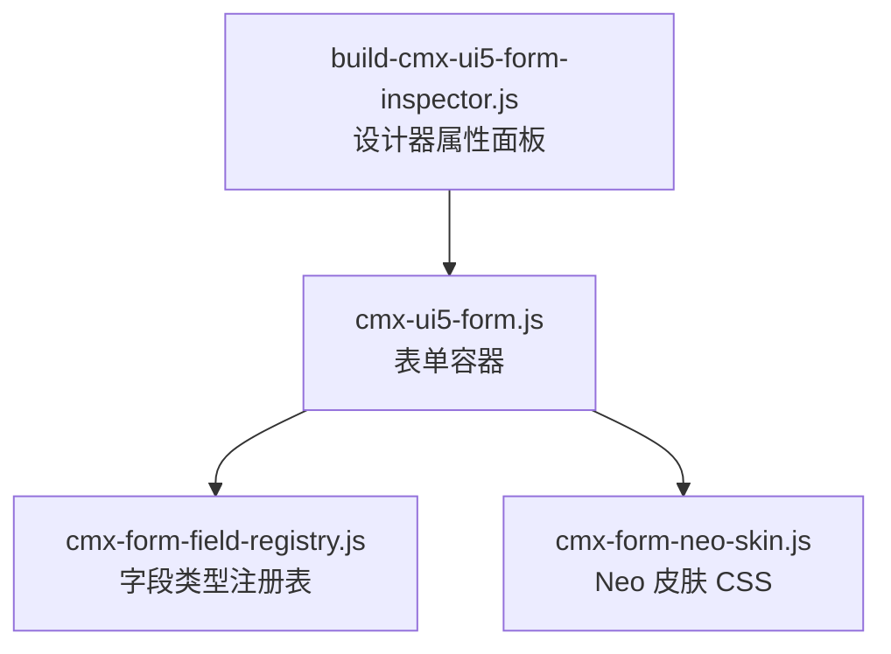
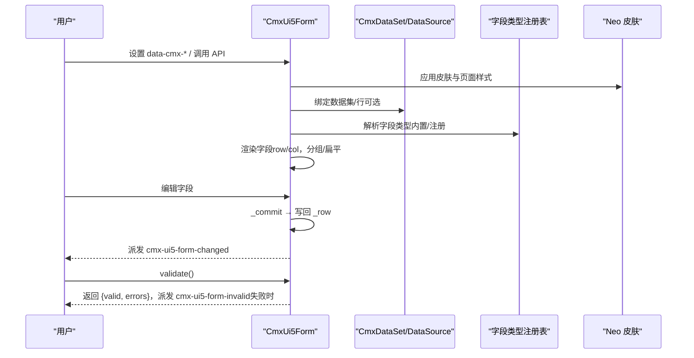
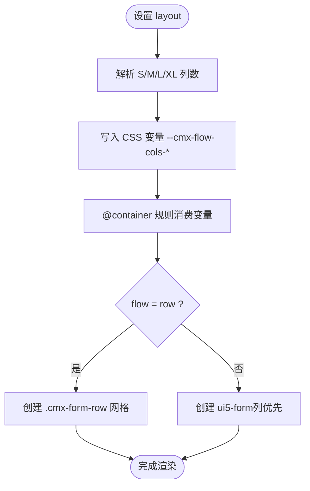
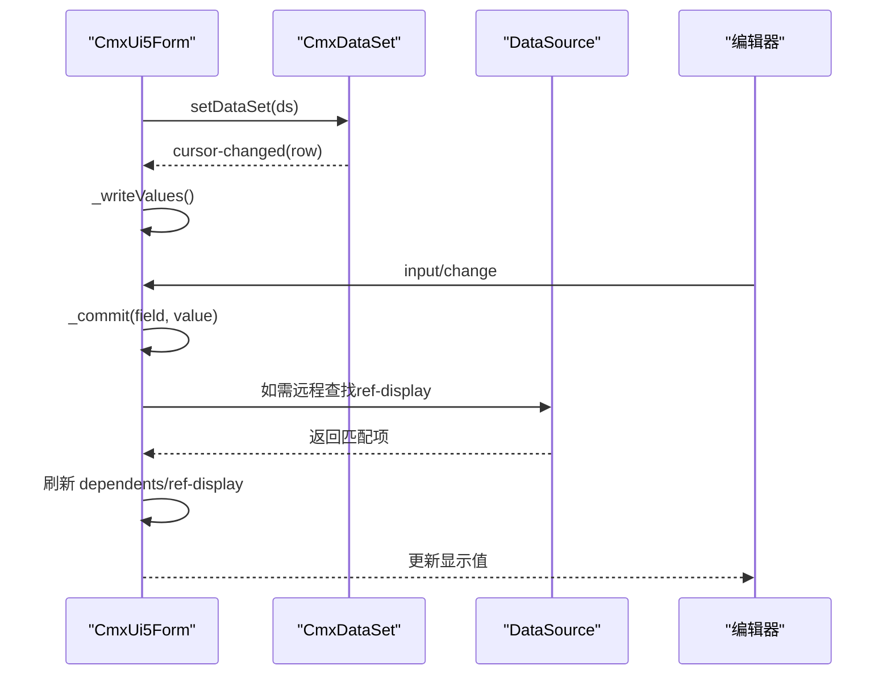
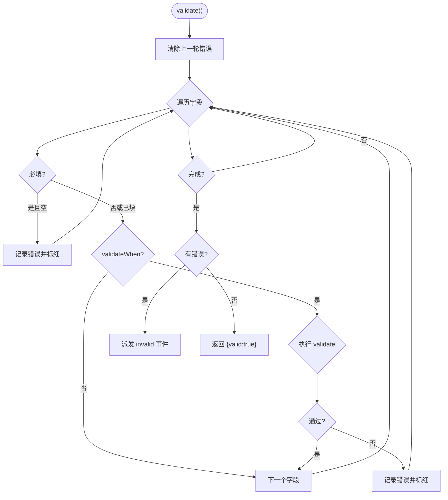
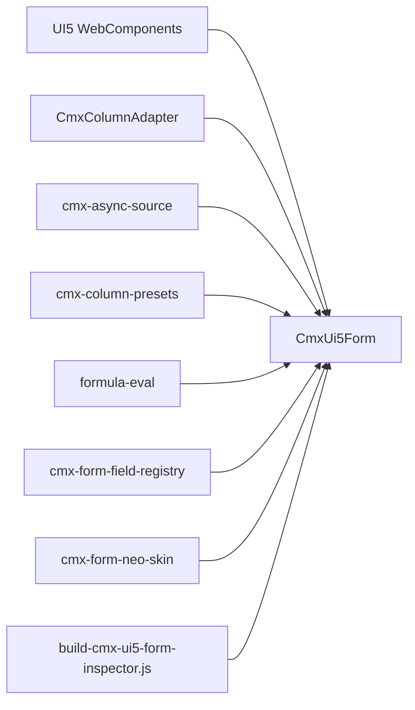

# 表单组件

<cite>
**本文引用的文件**
- [cmx-ui5-form.js](file://packages/cmx-data-comp/src/components/cmx-ui5-form.js)
- [cmx-form-field-registry.js](file://packages/cmx-data-comp/src/lib/cmx-form-field-registry.js)
- [cmx-form-neo-skin.js](file://packages/cmx-data-comp/src/lib/cmx-form-neo-skin.js)
- [build-cmx-ui5-form-inspector.js](file://CMXHTMLDesigner/src/plugins/cmx-inspector/build-cmx-ui5-form-inspector.js)
</cite>

## 目录
1. [简介](#简介)
2. [项目结构](#项目结构)
3. [核心组件](#核心组件)
4. [架构总览](#架构总览)
5. [详细组件分析](#详细组件分析)
6. [依赖关系分析](#依赖关系分析)
7. [性能考量](#性能考量)
8. [故障排查指南](#故障排查指南)
9. [结论](#结论)
10. [附录](#附录)

## 简介
本章节面向 CMX 的 CmxUi5Form 表单容器，系统性说明其配置选项、布局管理、验证机制、数据绑定、事件与交互、国际化支持、响应式与可访问性、以及性能优化建议。同时提供常见输入组件（文本、数字、日期、时间、选择、只读/引用显示等）的属性与行为说明，并给出构建示例与自定义字段类型集成方案。

## 项目结构
CmxUi5Form 位于 cmx-data-comp 包中，围绕以下关键文件组织：
- 组件实现：packages/cmx-data-comp/src/components/cmx-ui5-form.js
- 字段类型注册表：packages/cmx-data-comp/src/lib/cmx-form-field-registry.js
- Neo 皮肤样式：packages/cmx-data-comp/src/lib/cmx-form-neo-skin.js
- 设计器 Inspector：CMXHTMLDesigner/src/plugins/cmx-inspector/build-cmx-ui5-form-inspector.js

图表来源
- [cmx-ui5-form.js:1-120](file://packages/cmx-data-comp/src/components/cmx-ui5-form.js#L1-L120)
- [cmx-form-field-registry.js:1-59](file://packages/cmx-data-comp/src/lib/cmx-form-field-registry.js#L1-L59)
- [cmx-form-neo-skin.js:1-209](file://packages/cmx-data-comp/src/lib/cmx-form-neo-skin.js#L1-L209)
- [build-cmx-ui5-form-inspector.js:1-146](file://CMXHTMLDesigner/src/plugins/cmx-inspector/build-cmx-ui5-form-inspector.js#L1-L146)

章节来源
- [cmx-ui5-form.js:1-120](file://packages/cmx-data-comp/src/components/cmx-ui5-form.js#L1-L120)
- [cmx-form-field-registry.js:1-59](file://packages/cmx-data-comp/src/lib/cmx-form-field-registry.js#L1-L59)
- [cmx-form-neo-skin.js:1-209](file://packages/cmx-data-comp/src/lib/cmx-form-neo-skin.js#L1-L209)
- [build-cmx-ui5-form-inspector.js:1-146](file://CMXHTMLDesigner/src/plugins/cmx-inspector/build-cmx-ui5-form-inspector.js#L1-L146)

## 核心组件
CmxUi5Form 是一个基于 UI5 Form 的单行编辑表单组件，具备以下能力：
- 字段定义唯一入口：通过 setColumnModel(model) 或 data-cmx-model-id 绑定 CmxColumnModel，自动解析分组与叶字段。
- 响应式布局：支持 layout 字符串（如 S1 M2 L3 XL3），在 row 模式下使用 CSS Grid + @container 实现列数随宽度变化；col 模式沿用 UI5 报纸式多列。
- 数据绑定：setDataSet(dsOrRow, opts?) 支持 CmxDataSet 或单行对象；自动订阅 cursor-changed/row-changed，保持视图与数据一致。
- 验证：validate() 按 required/requiredWhen/validate/validateWhen 校验，失败时设置 value-state 与消息，并派发 cmx-ui5-form-invalid。
- 事件：字段值变更派发 cmx-ui5-form-changed；校验失败派发 cmx-ui5-form-invalid。
- 皮肤与主题：默认 Neo 皮肤，可通过 data-cmx-skin/skin-tone/style-id/density 控制外观与密度。
- 国际化：监听运行时语言切换，仅重解析 caption 更新 label 文本，不重建字段，开销最小。

章节来源
- [cmx-ui5-form.js:1-120](file://packages/cmx-data-comp/src/components/cmx-ui5-form.js#L1-L120)
- [cmx-ui5-form.js:129-193](file://packages/cmx-data-comp/src/components/cmx-ui5-form.js#L129-L193)
- [cmx-ui5-form.js:454-580](file://packages/cmx-data-comp/src/components/cmx-ui5-form.js#L454-L580)
- [cmx-ui5-form.js:592-671](file://packages/cmx-data-comp/src/components/cmx-ui5-form.js#L592-L671)
- [cmx-ui5-form.js:678-753](file://packages/cmx-data-comp/src/components/cmx-ui5-form.js#L678-L753)
- [cmx-ui5-form.js:913-1028](file://packages/cmx-data-comp/src/components/cmx-ui5-form.js#L913-L1028)
- [cmx-ui5-form.js:1246-1412](file://packages/cmx-data-comp/src/components/cmx-ui5-form.js#L1246-L1412)

## 架构总览
CmxUi5Form 以“模型驱动 + 渲染引擎 + 数据源 + 皮肤”为核心分层：
- 模型层：CmxColumnModel 提供字段定义（含分组），被适配器展平为扁平字段数组用于读写。
- 渲染层：根据 flow（row/col）与 groupStyle（card/bar）动态创建 ui5-form 或 grid，并为每个字段创建编辑器与标签。
- 数据层：支持本地 DataSource 与协调器注入的 provider；ref/ref-display 支持本地/远程查找与物化。
- 皮肤层：默认 Neo 皮肤，支持强调色与页面级覆盖样式。

图表来源
- [cmx-ui5-form.js:129-193](file://packages/cmx-data-comp/src/components/cmx-ui5-form.js#L129-L193)
- [cmx-ui5-form.js:454-580](file://packages/cmx-data-comp/src/components/cmx-ui5-form.js#L454-L580)
- [cmx-ui5-form.js:592-671](file://packages/cmx-data-comp/src/components/cmx-ui5-form.js#L592-L671)
- [cmx-ui5-form.js:678-753](file://packages/cmx-data-comp/src/components/cmx-ui5-form.js#L678-L753)
- [cmx-ui5-form.js:1246-1412](file://packages/cmx-data-comp/src/components/cmx-ui5-form.js#L1246-L1412)
- [cmx-form-field-registry.js:1-59](file://packages/cmx-data-comp/src/lib/cmx-form-field-registry.js#L1-L59)
- [cmx-form-neo-skin.js:1-209](file://packages/cmx-data-comp/src/lib/cmx-form-neo-skin.js#L1-L209)

## 详细组件分析

### 表单容器配置与生命周期
- 声明式属性（data-cmx-*）：layout、header、sources、row、skin、skin-tone、style-id、density、flow、group-style 等，在 connectedCallback 中解析并调用对应 setter。
- 生命周期：
  - connectedCallback：创建 Shadow DOM、注入基础样式与模板、应用皮肤、渲染字段、解析属性、注册语言切换监听。
  - disconnectedCallback：解绑 ds 游标/行变化监听、model columns-changed 监听、语言切换监听，避免内存泄漏。
- 公开 API：
  - setColumnModel(model)：唯一字段定义入口，支持动态换列。
  - setLayout(layout)、setHeaderText(text)、setGroupStyle(style)、setFlow(flow)。
  - setDataSet(dsOrRow, opts?)：绑定数据集或单行对象，支持 currentRowId。
  - getData()、reset()、clearValidation()、setEditable(flag)/isEditable()。
  - setDataSources(sources)、_setDataSourceProvider(fn)、rehydrateFromSources()。

章节来源
- [cmx-ui5-form.js:129-193](file://packages/cmx-data-comp/src/components/cmx-ui5-form.js#L129-L193)
- [cmx-ui5-form.js:195-256](file://packages/cmx-data-comp/src/components/cmx-ui5-form.js#L195-L256)
- [cmx-ui5-form.js:454-580](file://packages/cmx-data-comp/src/components/cmx-ui5-form.js#L454-L580)
- [cmx-ui5-form.js:592-671](file://packages/cmx-data-comp/src/components/cmx-ui5-form.js#L592-L671)
- [cmx-ui5-form.js:755-845](file://packages/cmx-data-comp/src/components/cmx-ui5-form.js#L755-L845)

### 布局管理与响应式设计
- 两种流向：
  - row：行优先 CSS Grid，跨列字段通过 gridColumn:span N 生效；@container 按表单宽度设置 --cmx-flow-cols-{s/m/l/xl} 实现响应式列数。
  - col：列优先，沿用 UI5 standaloneItemsLayout 报纸式多列。
- 分组渲染：
  - card：卡片分区（边框+标题栏底色）。
  - bar：轻量色条+下分隔线。
- 布局字符串解析：S/M/L/XL 四档断点列数，未出现则回退默认。
- 标签对齐：固定 label 列宽（compact 与非 compact 不同），超长文字换行显示；必填星号前置并对齐冒号右缘。

图表来源
- [cmx-ui5-form.js:508-549](file://packages/cmx-data-comp/src/components/cmx-ui5-form.js#L508-L549)
- [cmx-ui5-form.js:947-1028](file://packages/cmx-data-comp/src/components/cmx-ui5-form.js#L947-L1028)
- [cmx-ui5-form.js:263-439](file://packages/cmx-data-comp/src/components/cmx-ui5-form.js#L263-L439)

章节来源
- [cmx-ui5-form.js:263-439](file://packages/cmx-data-comp/src/components/cmx-ui5-form.js#L263-L439)
- [cmx-ui5-form.js:508-549](file://packages/cmx-data-comp/src/components/cmx-ui5-form.js#L508-L549)
- [cmx-ui5-form.js:947-1028](file://packages/cmx-data-comp/src/components/cmx-ui5-form.js#L947-L1028)

### 数据绑定与联动
- 数据集绑定：
  - setDataSet 支持传入 CmxDataSet 或普通对象；若为数据集，自动订阅 cursor-changed/row-changed，保持当前行与字段同步。
  - 切换数据集时自动解绑旧监听，避免内存泄漏。
- 引用字段与显示字段：
  - ref：下拉/搜索选择后写值，触发 ref-display 物化与 dependents 刷新。
  - ref-display：根据 from/source 从数据源反查显示文本，支持本地/远程查找。
- 数据源解析：
  - 组件级 _localDataSources 优先，其次协调器注入的 _dsProvider。
  - 支持 helper=remote-search 的异步搜索（searchAsync + debounceForSource）。

图表来源
- [cmx-ui5-form.js:592-671](file://packages/cmx-data-comp/src/components/cmx-ui5-form.js#L592-L671)
- [cmx-ui5-form.js:817-893](file://packages/cmx-data-comp/src/components/cmx-ui5-form.js#L817-L893)
- [cmx-ui5-form.js:1258-1356](file://packages/cmx-data-comp/src/components/cmx-ui5-form.js#L1258-L1356)

章节来源
- [cmx-ui5-form.js:592-671](file://packages/cmx-data-comp/src/components/cmx-ui5-form.js#L592-L671)
- [cmx-ui5-form.js:817-893](file://packages/cmx-data-comp/src/components/cmx-ui5-form.js#L817-L893)
- [cmx-ui5-form.js:1258-1356](file://packages/cmx-data-comp/src/components/cmx-ui5-form.js#L1258-L1356)

### 验证机制与错误提示
- 校验流程：
  - 清除上一轮错误标记。
  - 对每个非 readonly 字段：
    - 必填检查：required 或 requiredWhen 求值为真且为空时报错。
    - 条件校验：validateWhen 为真才执行 validate（函数/表达式/规则数组）。
  - 失败字段设置 value-state=Negative 与消息，并派发 cmx-ui5-form-invalid。
- 表达式求值：统一通过 evalFormula，异常回退 fallback。
- 清理：clearValidation() 清除所有字段的错误态。

图表来源
- [cmx-ui5-form.js:678-753](file://packages/cmx-data-comp/src/components/cmx-ui5-form.js#L678-L753)

章节来源
- [cmx-ui5-form.js:678-753](file://packages/cmx-data-comp/src/components/cmx-ui5-form.js#L678-L753)

### 输入组件与用户交互
支持的字段类型与交互：
- text：ui5-input，input 事件实时提交。
- number：ui5-input[type=Number]，input 事件转换为数值提交。
- date：ui5-date-picker，change 事件提交格式化后的值。
- select：ui5-select，change 事件提交选中值；支持 placeholder 与必填逻辑（必填时不提供空占位）。
- textarea：ui5-textarea，input 事件提交。
- checkbox：ui5-checkbox，change 事件提交布尔值。
- readonly/ref-display：span 展示，支持 formatter/display.format 预设格式化。
- ref：下拉/组合框/远程搜索；helper 优先级 field.helper > source.helper > 默认 dropdown。
  - combo-search：本地可搜索 combobox，selection-change 与 change 双触发。
  - remote-search：带 suggestion 的 ui5-input，按 key 防抖触发 ds.search。

章节来源
- [cmx-ui5-form.js:1246-1412](file://packages/cmx-data-comp/src/components/cmx-ui5-form.js#L1246-L1412)
- [cmx-ui5-form.js:1414-1506](file://packages/cmx-data-comp/src/components/cmx-ui5-form.js#L1414-L1506)

### 国际化支持
- 语言切换监听：通过共享运行时 attachLanguageChange，在语言变化时仅重解析 caption 并就地更新 label.textContent，不重建字段，保留焦点与值，开销最小。
- 适用场景：字段 label 可能为多语言对象，切换语言后即时反映到界面。

章节来源
- [cmx-ui5-form.js:145-167](file://packages/cmx-data-comp/src/components/cmx-ui5-form.js#L145-L167)

### 皮肤与主题
- 默认皮肤：Neo（可由 globalThis.__cmxDefaultFormSkin 覆盖）。
- 皮肤开关：data-cmx-skin="neo|plain|default|none"；data-cmx-skin-tone 支持强调色（如 mint）。
- 页面覆盖：data-cmx-style-id 指向同页 <template>/<style> 注入覆盖样式；setSkinStyles(cssText, layer) 可编程注入。
- 紧凑密度：data-cmx-density="compact" 启用更小字号/行高/内边距与固定 label 列宽。

章节来源
- [cmx-ui5-form.js:220-256](file://packages/cmx-data-comp/src/components/cmx-ui5-form.js#L220-L256)
- [cmx-form-neo-skin.js:1-209](file://packages/cmx-data-comp/src/lib/cmx-form-neo-skin.js#L1-L209)

### 可访问性与用户体验
- 必填星号前置：通过插入 span.cmx-label-star 并 aria-hidden，确保与冒号对齐，提升可读性。
- 只读净化：为 UI5 控件注入 shadowRoot 样式，去除 readonly/disabled 下的边框、焦点环与阴影，呈现纯文本外观。
- 标签对齐与溢出：label 固定列宽，超长换行；readonly-display 支持省略与占位符样式。

章节来源
- [cmx-ui5-form.js:1062-1111](file://packages/cmx-data-comp/src/components/cmx-ui5-form.js#L1062-L1111)
- [cmx-ui5-form.js:1164-1236](file://packages/cmx-data-comp/src/components/cmx-ui5-form.js#L1164-L1236)

### 自定义字段类型集成
- 注册接口：registerFieldType(name, def)，def.form.create/write 分别负责编辑器创建与值回填。
- 优先级：外挂注册类型优先于内置 switch；同名 type 会覆盖。
- 扩展点：
  - create(field, ctx)：返回 HTMLElement，ctx.commit(field, v) 提交值。
  - write(editor, raw, field, ctx)：将原始值写入编辑器。
  - grid.editor/cellTemplate：供表格端复用。

章节来源
- [cmx-form-field-registry.js:1-59](file://packages/cmx-data-comp/src/lib/cmx-form-field-registry.js#L1-L59)
- [cmx-ui5-form.js:1246-1252](file://packages/cmx-data-comp/src/components/cmx-ui5-form.js#L1246-L1252)
- [cmx-ui5-form.js:1543-1551](file://packages/cmx-data-comp/src/components/cmx-ui5-form.js#L1543-L1551)

## 依赖关系分析
- 组件对外依赖：
  - UI5 WebComponents：Form、FormGroup、FormItem、Label、Input、Select、Option、ComboBox、SuggestionItem、DatePicker、TextArea、CheckBox。
  - 内部库：CmxColumnAdapter、cmx-async-source、cmx-column-presets、formula-eval、cmx-form-field-registry、cmx-form-neo-skin、cmx-skin-runtime。
- 设计器集成：Inspector 提供 modelId、datasetId、masterSlaveId、layout、header、sources、row 的配置入口。

图表来源
- [cmx-ui5-form.js:46-66](file://packages/cmx-data-comp/src/components/cmx-ui5-form.js#L46-L66)
- [build-cmx-ui5-form-inspector.js:1-146](file://CMXHTMLDesigner/src/plugins/cmx-inspector/build-cmx-ui5-form-inspector.js#L1-L146)

章节来源
- [cmx-ui5-form.js:46-66](file://packages/cmx-data-comp/src/components/cmx-ui5-form.js#L46-L66)
- [build-cmx-ui5-form-inspector.js:1-146](file://CMXHTMLDesigner/src/plugins/cmx-inspector/build-cmx-ui5-form-inspector.js#L1-L146)

## 性能考量
- 渲染优化：
  - 语言切换仅重解析 caption，不重建字段，减少重排重绘。
  - select/ref 类型缓存 option 列表（cell._optEls），避免重复 querySelectorAll。
  - _writeOne 对 select/ref 进行脏检查（cell._lastRaw），相同值跳过以避免重置光标与不必要渲染。
- 数据源优化：
  - remote-search 使用 debounceForSource 防抖，减少频繁请求。
  - 远程查找失败时静默处理，避免阻塞主流程。
- 样式优化：
  - 只读净化样式仅在控件 shadowRoot 注入一次，避免重复。
  - 紧凑密度减少间距与高度，提升信息密度。

章节来源
- [cmx-ui5-form.js:145-167](file://packages/cmx-data-comp/src/components/cmx-ui5-form.js#L145-L167)
- [cmx-ui5-form.js:1106-1111](file://packages/cmx-data-comp/src/components/cmx-ui5-form.js#L1106-L1111)
- [cmx-ui5-form.js:1528-1543](file://packages/cmx-data-comp/src/components/cmx-ui5-form.js#L1528-L1543)
- [cmx-ui5-form.js:1306-1345](file://packages/cmx-data-comp/src/components/cmx-ui5-form.js#L1306-L1345)
- [cmx-ui5-form.js:1164-1236](file://packages/cmx-data-comp/src/components/cmx-ui5-form.js#L1164-L1236)

## 故障排查指南
- 字段未显示或值未更新：
  - 确认已通过 setColumnModel 绑定 CmxColumnModel。
  - 检查 setDataSet 是否正确传入数据集或行对象。
  - 查看 _cells 是否包含目标字段键。
- 校验不生效：
  - 确认 required/requiredWhen/validate/validateWhen 配置正确。
  - 检查表达式求值是否抛出异常（evalFormula 异常会回退）。
- 远程搜索无结果：
  - 确认数据源提供 search 方法，且参数与返回格式符合预期。
  - 查看控制台警告（缺少 search 时会降级为下拉）。
- 只读样式异常：
  - 确认控件 shadowRoot 已注入只读净化样式；必要时手动调用 setSkinStyles 注入覆盖。

章节来源
- [cmx-ui5-form.js:678-753](file://packages/cmx-data-comp/src/components/cmx-ui5-form.js#L678-L753)
- [cmx-ui5-form.js:1306-1345](file://packages/cmx-data-comp/src/components/cmx-ui5-form.js#L1306-L1345)
- [cmx-ui5-form.js:1164-1236](file://packages/cmx-data-comp/src/components/cmx-ui5-form.js#L1164-L1236)

## 结论
CmxUi5Form 提供了强大的表单容器能力：模型驱动的字段定义、灵活的布局与分组、完善的数据绑定与联动、严谨的验证机制、丰富的输入组件与交互方式、良好的国际化与皮肤支持，并通过注册表机制支持自定义字段类型扩展。结合设计器 Inspector，可在可视化环境中快速配置与调试表单。

## 附录

### 常用 API 速查
- 字段定义：setColumnModel(model)
- 布局与外观：setLayout(layout)、setHeaderText(text)、setGroupStyle(style)、setFlow(flow)、setSkinStyles(cssText, layer)
- 数据绑定：setDataSet(dsOrRow, opts?)、getData()、reset()
- 编辑状态：setEditable(flag)、isEditable()
- 数据源：setDataSources(sources)、_setDataSourceProvider(fn)、rehydrateFromSources()
- 验证：validate()、clearValidation()

章节来源
- [cmx-ui5-form.js:454-580](file://packages/cmx-data-comp/src/components/cmx-ui5-form.js#L454-L580)
- [cmx-ui5-form.js:592-671](file://packages/cmx-data-comp/src/components/cmx-ui5-form.js#L592-L671)
- [cmx-ui5-form.js:755-845](file://packages/cmx-data-comp/src/components/cmx-ui5-form.js#L755-L845)
- [cmx-ui5-form.js:678-753](file://packages/cmx-data-comp/src/components/cmx-ui5-form.js#L678-L753)

### 设计器配置要点
- 模型绑定：masterSlaveId（CmxMasterSlave）、datasetId（响应式）、modelId（CmxColumnModel）。
- 表单属性：layout（响应式列数）、header（标题）、sources（字典）、row（初始行数据）。
- 字段定义由所选 CmxColumnModel 提供（含分组）。

章节来源
- [build-cmx-ui5-form-inspector.js:1-146](file://CMXHTMLDesigner/src/plugins/cmx-inspector/build-cmx-ui5-form-inspector.js#L1-L146)