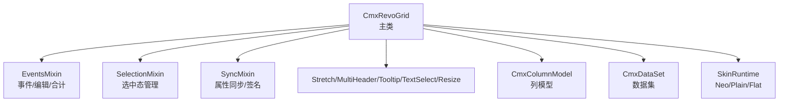
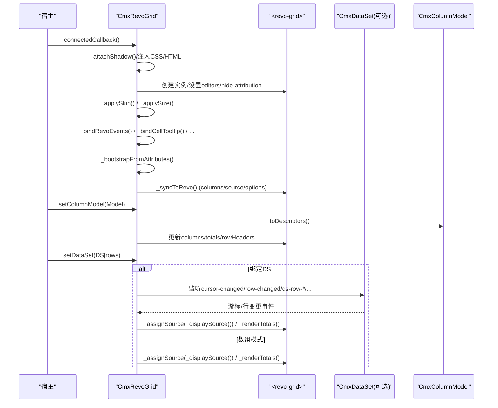
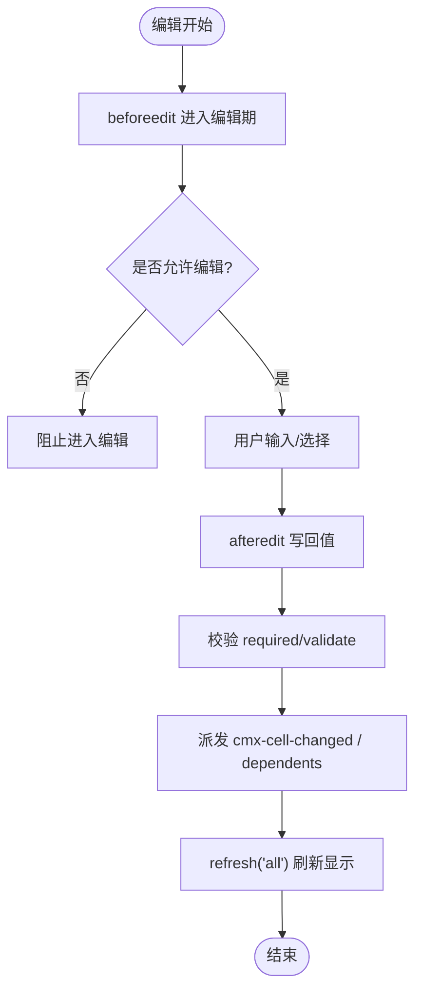
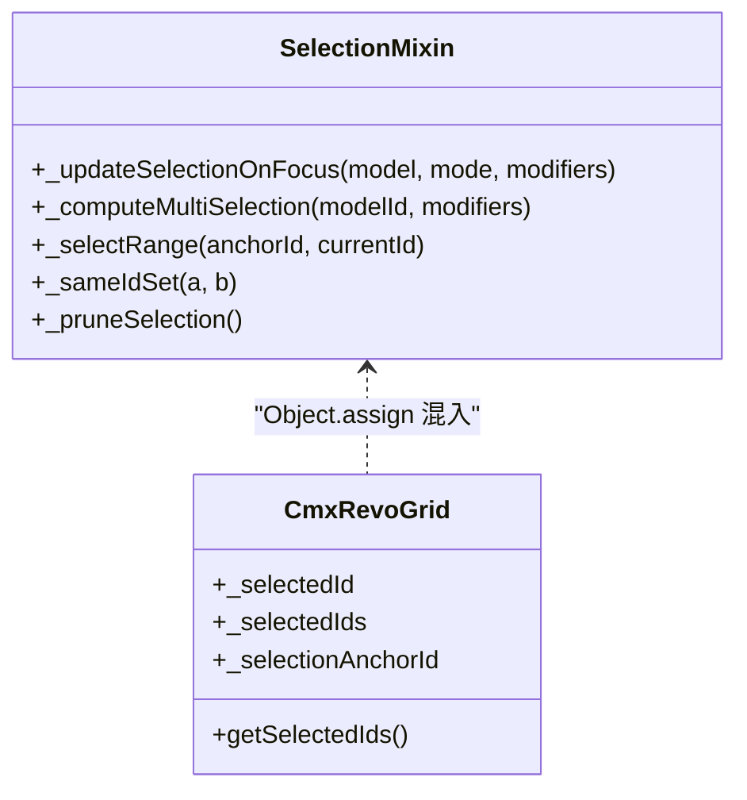
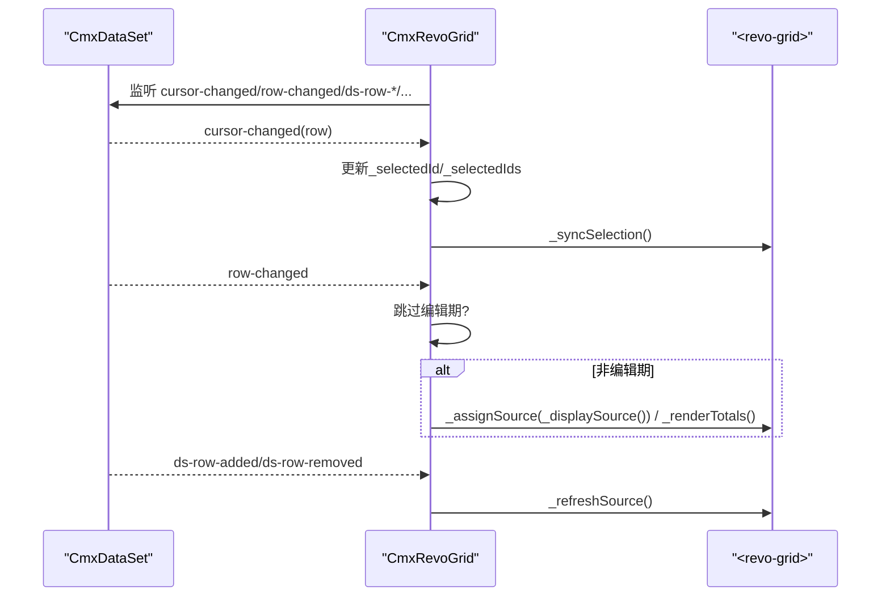
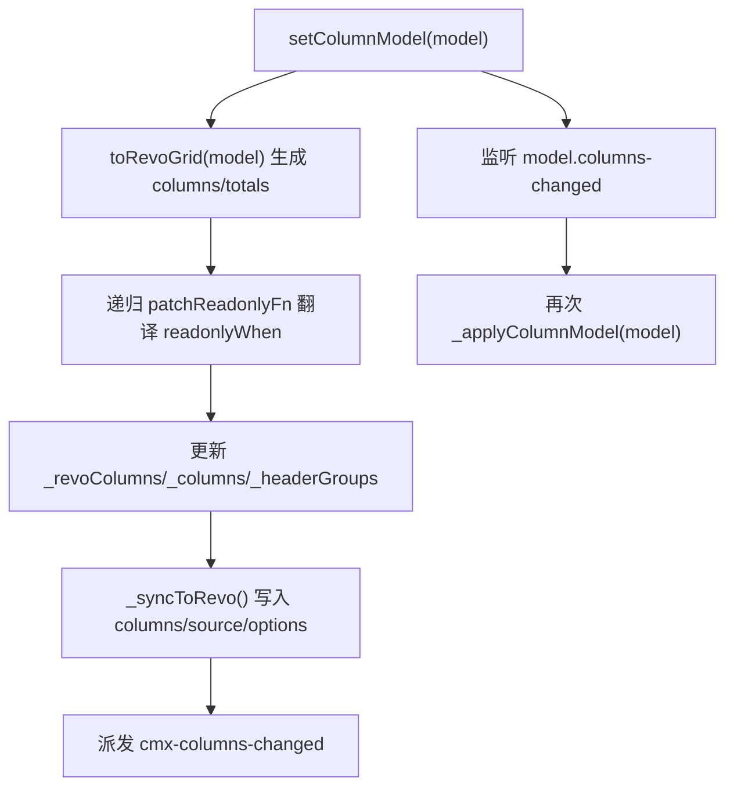
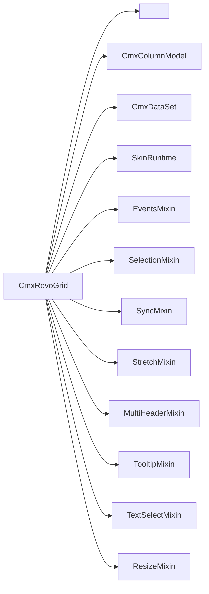

# RevoGrid 表格组件

<cite>
**本文引用的文件**
- [cmx-revo-grid.js](file://packages/cmx-data-comp/src/components/cmx-revo-grid.js)
- [revo-grid-events-mixin.js](file://packages/cmx-data-comp/src/components/revo-grid/revo-grid-events-mixin.js)
- [revo-grid-selection-mixin.js](file://packages/cmx-data-comp/src/components/revo-grid/revo-grid-selection-mixin.js)
- [revo-grid-sync-mixin.js](file://packages/cmx-data-comp/src/components/revo-grid/revo-grid-sync-mixin.js)
- [cmx-column-model.js](file://packages/cmx-data-comp/src/lib/cmx-column-model.js)
- [cmx-data-set.js](file://packages/cmx-data-comp/src/lib/cmx-data-set.js)
- [cmx-skin-runtime.js](file://packages/cmx-data-comp/src/lib/cmx-skin-runtime.js)
- [grid-components.md](file://.agents/skills/cmx-components-guide/references/grid-components.md)
</cite>

## 目录
1. [简介](#简介)
2. [项目结构](#项目结构)
3. [核心组件](#核心组件)
4. [架构总览](#架构总览)
5. [详细组件分析](#详细组件分析)
6. [依赖关系分析](#依赖关系分析)
7. [性能考量](#性能考量)
8. [故障排查指南](#故障排查指南)
9. [结论](#结论)
10. [附录](#附录)

## 简介
本文件为 CmxRevoGrid 组件的权威技术文档，围绕基于 RevoGrid 的表格封装展开，覆盖组件生命周期、Shadow DOM 封装机制、事件系统、配置选项（selectionMode、virtualScroll、editable 等）、数据绑定（setDataSet 与 setData 的区别、CmxDataSet 集成与实时同步）、列定义统一管理与动态变更监听、皮肤系统（Neo/Plain/Flat）与主题切换、国际化支持，以及大数据量下的性能优化策略。

## 项目结构
CmxRevoGrid 采用“主类 + 多 Mixin”的模块化组织方式：
- 主类 cmx-revo-grid.js：负责 Shadow DOM 挂载、属性解析、皮肤应用、尺寸与布局、对外 API（setOptions/setColumnModel/setDataSet/addRow/removeRows/getSelectedIds 等）。
- 行为 Mixin：
  - revo-grid-events-mixin.js：事件桥接、编辑校验、合计行渲染。
  - revo-grid-selection-mixin.js：单选/多选/Shift 区间选择逻辑。
  - revo-grid-sync-mixin.js：属性写入去重签名、列/数据/选项一次性同步。
  - 其他 Mixin：stretch、multi-header、tooltip、text-select、resize。
- 模型与数据：
  - CmxColumnModel：列元数据模型，toDescriptors 输出通用描述符，供适配器转换为 RevoGrid 列定义。
  - CmxDataSet：数据集，提供增删改查、游标、事件（cursor-changed、row-changed、ds-row-added/removed）。
- 皮肤运行时：cmx-skin-runtime.js 提供 Neo 皮肤注入、tone 变体、页面级样式覆盖。

图表来源
- [cmx-revo-grid.js:183-312](file://packages/cmx-data-comp/src/components/cmx-revo-grid.js#L183-L312)
- [revo-grid-events-mixin.js:21-105](file://packages/cmx-data-comp/src/components/revo-grid/revo-grid-events-mixin.js#L21-L105)
- [revo-grid-selection-mixin.js:8-64](file://packages/cmx-data-comp/src/components/revo-grid/revo-grid-selection-mixin.js#L8-L64)
- [revo-grid-sync-mixin.js:30-196](file://packages/cmx-data-comp/src/components/revo-grid/revo-grid-sync-mixin.js#L30-L196)
- [cmx-column-model.js:20-72](file://packages/cmx-data-comp/src/lib/cmx-column-model.js#L20-L72)
- [cmx-data-set.js:37-207](file://packages/cmx-data-comp/src/lib/cmx-data-set.js#L37-L207)
- [cmx-skin-runtime.js:31-109](file://packages/cmx-data-comp/src/lib/cmx-skin-runtime.js#L31-L109)

章节来源
- [cmx-revo-grid.js:1-182](file://packages/cmx-data-comp/src/components/cmx-revo-grid.js#L1-L182)
- [grid-components.md:12-47](file://.agents/skills/cmx-components-guide/references/grid-components.md#L12-L47)

## 核心组件
- CmxRevoGrid：Web Component，Shadow DOM 内嵌原生 <revo-grid>；通过 setOptions/setColumnModel/setDataSet 暴露统一 API；内部维护 _rows/_selectedId/_selectedIds/_opts 等状态。
- CmxColumnModel：纯元数据模型，toDescriptors() 输出通用描述符，由适配器转为 RevoGrid 列定义；支持 addMember/removeMember/setMembers/fromMeta，并派发 columns-changed 事件驱动视图刷新。
- CmxDataSet：事件化数据集，维护 rows/index/cursor，提供 addRow/removeRow/moveToId/currentRow 等，并通过 cursor-changed/row-changed/ds-row-added/ds-row-removed 通知订阅者。
- SkinRuntime：统一皮肤注入与 tone 变体，支持 data-cmx-skin/data-cmx-skin-tone 与全局默认 __cmxDefaultGridSkin。

章节来源
- [cmx-revo-grid.js:183-312](file://packages/cmx-data-comp/src/components/cmx-revo-grid.js#L183-L312)
- [cmx-column-model.js:20-72](file://packages/cmx-data-comp/src/lib/cmx-column-model.js#L20-L72)
- [cmx-data-set.js:37-207](file://packages/cmx-data-comp/src/lib/cmx-data-set.js#L37-L207)
- [cmx-skin-runtime.js:31-109](file://packages/cmx-data-comp/src/lib/cmx-skin-runtime.js#L31-L109)

## 架构总览
CmxRevoGrid 在 connectedCallback 中创建 Shadow DOM，注册 RevoGrid 自定义元素，注入编辑器与皮肤，绑定事件，并从宿主 data-cmx-* 属性引导初始化。随后通过 setOptions/setColumnModel/setDataSet 完成列、数据与选项的同步。所有对 RevoGrid 的属性写入均经 SyncMixin 的签名比对避免无谓重绘。

图表来源
- [cmx-revo-grid.js:247-312](file://packages/cmx-data-comp/src/components/cmx-revo-grid.js#L247-L312)
- [cmx-revo-grid.js:468-592](file://packages/cmx-data-comp/src/components/cmx-revo-grid.js#L468-L592)
- [cmx-revo-grid.js:735-832](file://packages/cmx-data-comp/src/components/cmx-revo-grid.js#L735-L832)
- [revo-grid-sync-mixin.js:112-196](file://packages/cmx-data-comp/src/components/revo-grid/revo-grid-sync-mixin.js#L112-L196)

## 详细组件分析

### 组件生命周期与 Shadow DOM 封装
- 构造器：初始化内部状态（_columns/_headerGroups/_opts/_rows/_selectedId/_selectedIds/_revoColumns 等）。
- connectedCallback：
  - 确保 RevoGrid 自定义元素已注册。
  - 创建 Shadow DOM，注入样式与容器 #host，创建 <revo-grid> 并挂载。
  - 应用皮肤、尺寸、禁用单元格背景覆盖、绑定事件、读取 data-cmx-* 初始配置，首次同步到 RevoGrid。
  - 自动主题检测与语言变化监听（attachLanguageChange），门户主题变化时刷新主题并触发 refresh('all')。
- disconnectedCallback：解绑 ResizeObserver、事件监听、主题/语言监听，释放引用。

章节来源
- [cmx-revo-grid.js:183-312](file://packages/cmx-data-comp/src/components/cmx-revo-grid.js#L183-L312)
- [cmx-revo-grid.js:314-349](file://packages/cmx-data-comp/src/components/cmx-revo-grid.js#L314-L349)

### 事件系统与交互
- 编辑流程：beforeedit 进入编辑期（data-cmx-editing），afteredit 写回行对象、执行列 onChange/dependents、派发 cmx-cell-changed；closeedit 清理编辑期标记。
- 焦点→选中：afterfocus 根据 selectionMode 与修饰键（Ctrl/Cmd/Shift）计算新选中集合，派发 cmx-row-selected 或 cmx-row-selection-change。
- 空白区点击：关闭编辑器，避免残留。
- 链接/动作点击：派发 cmx-cell-link-click，携带 key/rowId/actionRef。
- 列宽拖动：aftercolumnresize 记录用户锁定宽度，参与后续 stretch 再分配。

图表来源
- [revo-grid-events-mixin.js:25-105](file://packages/cmx-data-comp/src/components/revo-grid/revo-grid-events-mixin.js#L25-L105)
- [revo-grid-events-mixin.js:111-172](file://packages/cmx-data-comp/src/components/revo-grid/revo-grid-events-mixin.js#L111-L172)
- [revo-grid-events-mixin.js:178-227](file://packages/cmx-data-comp/src/components/revo-grid/revo-grid-events-mixin.js#L178-L227)
- [revo-grid-events-mixin.js:235-262](file://packages/cmx-data-comp/src/components/revo-grid/revo-grid-events-mixin.js#L235-L262)

章节来源
- [revo-grid-events-mixin.js:25-105](file://packages/cmx-data-comp/src/components/revo-grid/revo-grid-events-mixin.js#L25-L105)
- [revo-grid-events-mixin.js:111-172](file://packages/cmx-data-comp/src/components/revo-grid/revo-grid-events-mixin.js#L111-L172)
- [revo-grid-events-mixin.js:178-227](file://packages/cmx-data-comp/src/components/revo-grid/revo-grid-events-mixin.js#L178-L227)
- [revo-grid-events-mixin.js:235-262](file://packages/cmx-data-comp/src/components/revo-grid/revo-grid-events-mixin.js#L235-L262)

### 选择模式与选中态管理
- selectionMode='single'：聚焦某格即选中该行，派发 cmx-row-selected。
- selectionMode='multi'：支持 Ctrl/Cmd 切换、Shift 区间选择，派发 cmx-row-selection-change。
- selectionMode='none'：不可选。
- 选中态同步：_syncSelection 将每行的 __cmxRowClass 设置为 'cmx-current-row'，调用 refresh('all') 保证多选高亮正确清除。

图表来源
- [revo-grid-selection-mixin.js:8-118](file://packages/cmx-data-comp/src/components/revo-grid/revo-grid-selection-mixin.js#L8-L118)
- [cmx-revo-grid.js:834-858](file://packages/cmx-data-comp/src/components/cmx-revo-grid.js#L834-L858)
- [cmx-revo-grid.js:962-974](file://packages/cmx-data-comp/src/components/cmx-revo-grid.js#L962-L974)

章节来源
- [revo-grid-selection-mixin.js:8-118](file://packages/cmx-data-comp/src/components/revo-grid/revo-grid-selection-mixin.js#L8-L118)
- [cmx-revo-grid.js:834-858](file://packages/cmx-data-comp/src/components/cmx-revo-grid.js#L834-L858)
- [cmx-revo-grid.js:962-974](file://packages/cmx-data-comp/src/components/cmx-revo-grid.js#L962-L974)

### 数据绑定：setDataSet 与 setData 的区别、CmxDataSet 集成与实时同步
- setDataSet(dsOrRows, sel)：
  - 若 dsOrRows 为 CmxDataSet：建立与数据集的关联，共享 _rows 引用；监听 cursor-changed/row-changed/ds-row-added/ds-row-removed；根据游标同步选中；数据变化时刷新 source 与合计行。
  - 否则视为普通数组：断开与 DS 的关联，走 _setData。
- _setData(rows, sel)：纯数组模式入口，设置 _rows，修剪选中，刷新 source/合计行，必要时滚动回顶部。
- 实时同步：
  - 游标移动 → cursor-changed → 更新 _selectedId/_selectedIds → _syncSelection。
  - 行字段变化 → row-changed → 跳过编辑期重推 → 刷新 source。
  - 行增删 → ds-row-added/ds-row-removed → _refreshSource → 重新计算 displaySource/pinnedBottomSource。

图表来源
- [cmx-revo-grid.js:735-832](file://packages/cmx-data-comp/src/components/cmx-revo-grid.js#L735-L832)
- [cmx-revo-grid.js:885-892](file://packages/cmx-data-comp/src/components/cmx-revo-grid.js#L885-L892)
- [cmx-data-set.js:82-148](file://packages/cmx-data-comp/src/lib/cmx-data-set.js#L82-L148)
- [cmx-data-set.js:165-193](file://packages/cmx-data-comp/src/lib/cmx-data-set.js#L165-L193)

章节来源
- [cmx-revo-grid.js:735-832](file://packages/cmx-data-comp/src/components/cmx-revo-grid.js#L735-L832)
- [cmx-revo-grid.js:885-892](file://packages/cmx-data-comp/src/components/cmx-revo-grid.js#L885-L892)
- [cmx-data-set.js:82-148](file://packages/cmx-data-comp/src/lib/cmx-data-set.js#L82-L148)
- [cmx-data-set.js:165-193](file://packages/cmx-data-comp/src/lib/cmx-data-set.js#L165-L193)

### 列定义与动态变更监听
- 唯一入口：setColumnModel(model)。内部通过 CmxColumnAdapter.toRevoGrid(model) 生成 columns/totals，并递归为叶子列挂 readonly 函数（翻译 readonlyWhen）。
- 动态监听：订阅 model.columns-changed，当 FlexibleCombination 等动态列驱动者改变成员时，自动重新同步并派发 cmx-columns-changed，供页面钩子（如 tuneGrid/setTotals）响应。
- 必填标识：showRequiredMark=true 时为叶子列注入 columnTemplate 显示红色 *。
- 多级表头：通过 MultiHeaderMixin 修复 group cell 定位与高度，使合并表头正确显示。

图表来源
- [cmx-revo-grid.js:468-592](file://packages/cmx-data-comp/src/components/cmx-revo-grid.js#L468-L592)
- [cmx-revo-grid.js:594-626](file://packages/cmx-data-comp/src/components/cmx-revo-grid.js#L594-L626)
- [cmx-revo-grid.js:1042-1079](file://packages/cmx-data-comp/src/components/cmx-revo-grid.js#L1042-L1079)
- [cmx-column-model.js:33-72](file://packages/cmx-data-comp/src/lib/cmx-column-model.js#L33-L72)

章节来源
- [cmx-revo-grid.js:468-592](file://packages/cmx-data-comp/src/components/cmx-revo-grid.js#L468-L592)
- [cmx-revo-grid.js:594-626](file://packages/cmx-data-comp/src/components/cmx-revo-grid.js#L594-L626)
- [cmx-revo-grid.js:1042-1079](file://packages/cmx-data-comp/src/components/cmx-revo-grid.js#L1042-L1079)
- [cmx-column-model.js:33-72](file://packages/cmx-data-comp/src/lib/cmx-column-model.js#L33-L72)

### 配置选项（selectionMode/virtualScroll/editable 等）
- selectionMode：'none' | 'single'（默认）| 'multi'。
- virtualScroll：true（默认）| false，控制横向+纵向虚拟滚动开关。
- editable：false（默认）| true，总开关；未显式设置时回退 !readonly。
- 其他关键项：rowHeight/headerRowHeight/viewHeight/fillHeight/minRows/stretch/resize/editTrigger/theme/showRowIndex/rowIndexLabel/rowIndexWidth/showTotals/totals/showRequiredMark/alternateRowColor/cellTooltip/allowTextSelect/range。
- setOptions(opts) 增量合并，并在 Shadow DOM 就绪后即时应用尺寸/主题/文本选择等。

章节来源
- [cmx-revo-grid.js:71-155](file://packages/cmx-data-comp/src/components/cmx-revo-grid.js#L71-L155)
- [cmx-revo-grid.js:628-659](file://packages/cmx-data-comp/src/components/cmx-revo-grid.js#L628-L659)
- [grid-components.md:19-47](file://.agents/skills/cmx-components-guide/references/grid-components.md#L19-L47)

### 皮肤系统与主题切换、国际化
- 皮肤：
  - data-cmx-skin：'neo'（默认，可通过 globalThis.__cmxDefaultGridSkin 覆盖）、'plain'/'default'/'none'、'flat'（或 data-cmx-borderless/data-cmx-flat）。
  - data-cmx-skin-tone：'cyan'|'azure'|'violet'|'mint'，用于 Neo 强调色。
  - applyNeoSkin：注入 Neo CSS、激活 class、tone 变体 class。
  - 嵌入模式 data-cmx-embed：默认不套 Neo，除非显式指定 skin。
- 主题：theme='auto' 时检测暗色模式；门户主题变化时监听 cmx-portal-theme-change 并刷新主题。
- 国际化：监听 UI5 语言变化，重建列以按新语言解析 caption 等多语言对象。

章节来源
- [cmx-revo-grid.js:351-444](file://packages/cmx-data-comp/src/components/cmx-revo-grid.js#L351-L444)
- [cmx-revo-grid.js:1081-1089](file://packages/cmx-data-comp/src/components/cmx-revo-grid.js#L1081-L1089)
- [cmx-skin-runtime.js:31-109](file://packages/cmx-data-comp/src/lib/cmx-skin-runtime.js#L31-L109)

### 合计行与占位行
- 合计行：使用 pinnedBottomSource，单遍历多聚合（sum/avg/max/min/count），支持 totals.extra 追加额外字段；末尾下一帧重赋 columns 以铺满 footer 区域。
- 占位行：minRows 不足时填充 __cmxFiller 行，编辑/聚焦逻辑忽略这些行。

章节来源
- [revo-grid-events-mixin.js:345-430](file://packages/cmx-data-comp/src/components/revo-grid/revo-grid-events-mixin.js#L345-L430)
- [cmx-revo-grid.js:1091-1129](file://packages/cmx-data-comp/src/components/cmx-revo-grid.js#L1091-L1129)

## 依赖关系分析
- CmxRevoGrid 依赖：
  - RevoGrid 自定义元素（@revolist/revogrid/loader）。
  - CmxColumnAdapter（列适配）、CmxColumnModel（列模型）、CmxDataSet（数据集）。
  - 皮肤运行时（cmx-skin-runtime.js）、字典缓存（cmx-dict-cache.js）、表单字段注册表（cmx-form-field-registry.js）。
  - 多个 Mixin：events/selection/sync/stretch/multi-header/tooltip/text-select/resize。
- 耦合与内聚：
  - 通过 Object.assign 将 Mixin 方法注入原型，保持高内聚低耦合；跨组调用经 this 解析，避免静态循环依赖。
  - 列定义与数据源分离：CmxColumnModel 与 CmxDataSet 作为独立模型，便于复用与测试。
- 外部依赖：
  - RevoGrid 的 props（source/columns/rowHeaders/rowClass/pinnedBottomSource/disableVirtualX/Y 等）。
  - UI5 主题变量与语言 API（__cmxUi5.attachLanguageChange/detachLanguageChange）。

图表来源
- [cmx-revo-grid.js:27-43](file://packages/cmx-data-comp/src/components/cmx-revo-grid.js#L27-L43)
- [cmx-revo-grid.js:1547-1551](file://packages/cmx-data-comp/src/components/cmx-revo-grid.js#L1547-L1551)

章节来源
- [cmx-revo-grid.js:27-43](file://packages/cmx-data-comp/src/components/cmx-revo-grid.js#L27-L43)
- [cmx-revo-grid.js:1547-1551](file://packages/cmx-data-comp/src/components/cmx-revo-grid.js#L1547-L1551)

## 性能考量
- 虚拟滚动：virtualScroll=true（默认），大数据集必须开启；可关闭 disableVirtualX/Y 以禁用横向/纵向虚拟滚动。
- 列宽拉伸：stretch=true 时按比例铺满视口；手动拖动列宽会锁定该列宽度，不参与再分配；ResizeObserver 监听 host 尺寸变化，下一帧刷新 layout。
- 属性写入去重：_setRevoProp 使用签名比对（prop:name/value 或序列化串），避免同值重复赋值导致重绘。
- 数据源签名：_sourceSignature 仅比较版本号/行数/minRows/显示行数，避免 O(N) 字符串拼接与 GC 压力。
- 合计行优化：单遍历多聚合，减少多次遍历开销；footer 列区宽度通过下一帧重赋 columns 修正。
- 内存管理：disconnectedCallback 中解绑 ResizeObserver、事件监听、主题/语言监听，释放 _revo 引用，防止泄漏。
- 占位行与缓存：_displaySource 缓存结果，仅在 _rows 引用/长度/minRows 变化时重建；EMPTY_ROWS 常量避免频繁新建空数组。

章节来源
- [revo-grid-sync-mixin.js:31-107](file://packages/cmx-data-comp/src/components/revo-grid/revo-grid-sync-mixin.js#L31-L107)
- [revo-grid-events-mixin.js:345-430](file://packages/cmx-data-comp/src/components/revo-grid/revo-grid-events-mixin.js#L345-L430)
- [cmx-revo-grid.js:1171-1215](file://packages/cmx-data-comp/src/components/cmx-revo-grid.js#L1171-L1215)
- [cmx-revo-grid.js:1091-1129](file://packages/cmx-data-comp/src/components/cmx-revo-grid.js#L1091-L1129)
- [cmx-revo-grid.js:314-349](file://packages/cmx-data-comp/src/components/cmx-revo-grid.js#L314-L349)

## 故障排查指南
- 编辑器残留：点击空白区未关闭编辑器？检查 _maybeCloseEditOnBlankClick 判定路径，确认 composedPath 命中 cell/editor/header。
- 多选高亮不清除：_syncSelection 使用 refresh('all') 强制完整行渲染，避免 updateSource/diff 路径遗漏旧类。
- 整数主键删除失败：removeRows 需 String 化入参与 r.id 匹配；CmxDataSet.removeRow 也统一 String(id) 查找。
- 列宽拉伸异常：stretch 模式下，数据量变化影响垂直滚动条宽度，需 _scheduleStretchRefresh 下一帧重算。
- 主题切换闪烁：auto 主题在 connectedCallback 延一帧应用，避免 Stencil prop diff 导致的宿主 grid 闪烁；主题变化后 refresh('all') 补刷。
- 字典回显失败：enableDictEcho 预加载失败时 toast 提示，resolver 降级返回原 id，不影响渲染。

章节来源
- [revo-grid-events-mixin.js:235-262](file://packages/cmx-data-comp/src/components/revo-grid/revo-grid-events-mixin.js#L235-L262)
- [cmx-revo-grid.js:834-858](file://packages/cmx-data-comp/src/components/cmx-revo-grid.js#L834-L858)
- [cmx-revo-grid.js:927-960](file://packages/cmx-data-comp/src/components/cmx-revo-grid.js#L927-L960)
- [cmx-revo-grid.js:1205-1215](file://packages/cmx-data-comp/src/components/cmx-revo-grid.js#L1205-L1215)
- [cmx-revo-grid.js:281-301](file://packages/cmx-data-comp/src/components/cmx-revo-grid.js#L281-L301)
- [cmx-revo-grid.js:525-563](file://packages/cmx-data-comp/src/components/cmx-revo-grid.js#L525-L563)

## 结论
CmxRevoGrid 通过 Web Component + Shadow DOM 实现强隔离与可复用性，结合 CmxColumnModel 与 CmxDataSet 形成“列模型-数据模型-视图”清晰分层。其事件系统完善、皮肤与主题灵活、性能优化到位（虚拟滚动、签名去重、单遍历聚合、ResizeObserver 节流），适合企业级大数据表格场景。建议在生产环境中：
- 始终启用 virtualScroll，合理设置 rowHeight/minRows。
- 使用 setDataSet 绑定 CmxDataSet 以获得实时同步能力。
- 通过 setColumnModel 统一管理列定义，利用 columns-changed 响应动态列变更。
- 按需开启 stretch/resize，关注列宽锁定与再分配。
- 使用 Neo/Plain/Flat 皮肤与 tone 变体，配合门户主题与语言切换。

## 附录
- 常用 API 速览：
  - setOptions(opts)：增量合并运行时选项。
  - setColumnModel(model)：设置列模型并监听动态变更。
  - setDataSet(dsOrRows, sel)：绑定数据集或数组，支持 selectedId/selectedIds/preserveScroll。
  - addRow(row, opts)：追加一行，可选滚动到新行。
  - removeRows(ids)：按 id 列表删除行。
  - getSelectedIds()：获取多选选中 id 列表（字符串）。
  - refreshLayout()：强制刷新布局（可见性判断）。
  - commitEdit()：强制提交当前编辑单元格。

章节来源
- [cmx-revo-grid.js:628-659](file://packages/cmx-data-comp/src/components/cmx-revo-grid.js#L628-L659)
- [cmx-revo-grid.js:735-832](file://packages/cmx-data-comp/src/components/cmx-revo-grid.js#L735-L832)
- [cmx-revo-grid.js:894-920](file://packages/cmx-data-comp/src/components/cmx-revo-grid.js#L894-L920)
- [cmx-revo-grid.js:927-974](file://packages/cmx-data-comp/src/components/cmx-revo-grid.js#L927-L974)
- [cmx-revo-grid.js:707-724](file://packages/cmx-data-comp/src/components/cmx-revo-grid.js#L707-L724)
- [cmx-revo-grid.js:661-694](file://packages/cmx-data-comp/src/components/cmx-revo-grid.js#L661-L694)