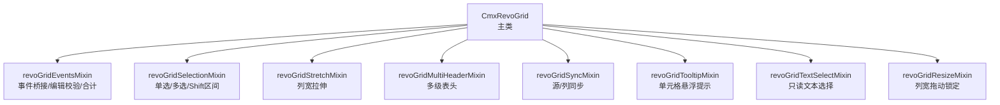
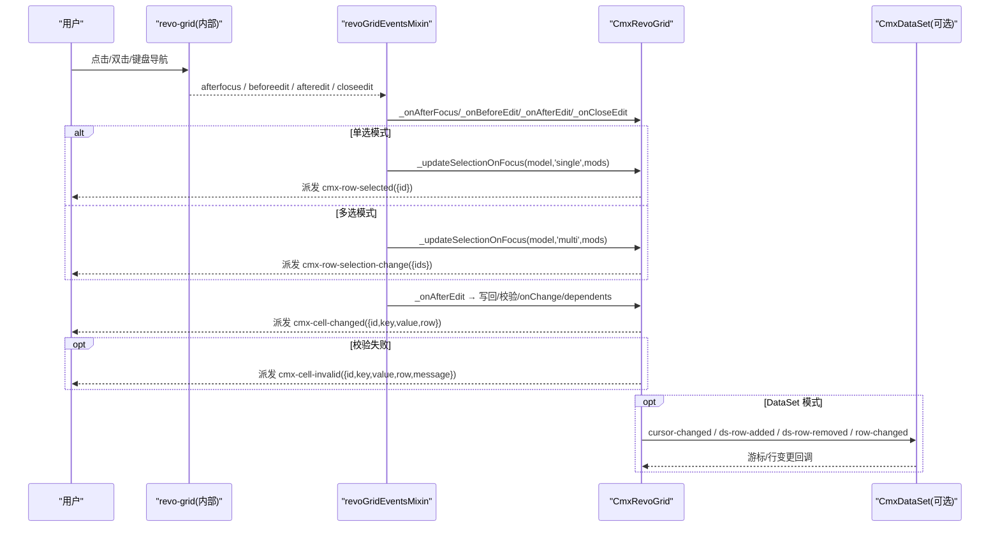
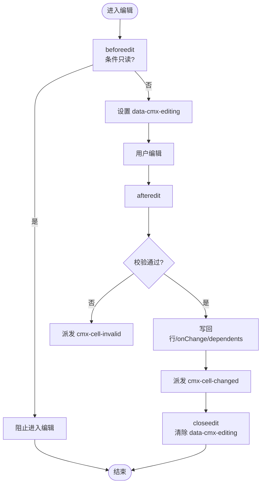
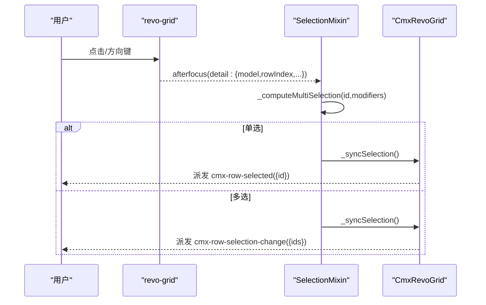
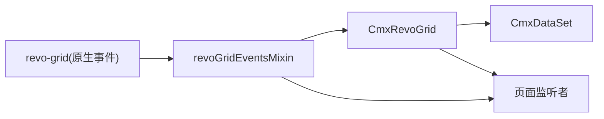

# 事件系统与交互处理

<cite>
**本文引用的文件**
- [cmx-revo-grid.js](file://packages/cmx-data-comp/src/components/cmx-revo-grid.js)
- [revo-grid-events-mixin.js](file://packages/cmx-data-comp/src/components/revo-grid/revo-grid-events-mixin.js)
- [revo-grid-selection-mixin.js](file://packages/cmx-data-comp/src/components/revo-grid/revo-grid-selection-mixin.js)
- [grid-components.md](file://.agents/skills/cmx-components-guide/references/grid-components.md)
</cite>

## 目录
1. [简介](#简介)
2. [项目结构](#项目结构)
3. [核心组件](#核心组件)
4. [架构总览](#架构总览)
5. [详细组件分析](#详细组件分析)
6. [依赖关系分析](#依赖关系分析)
7. [性能考量](#性能考量)
8. [故障排查指南](#故障排查指南)
9. [结论](#结论)
10. [附录](#附录)

## 简介
本章节面向 RevoGrid 的事件系统与交互处理，聚焦 cmx-revo-grid 对外暴露的事件、编辑生命周期、行选择与键盘导航流程，以及最佳实践与常见问题。内容基于源码实现进行梳理，帮助开发者在页面中正确监听与响应表格事件，并理解编辑值提交、回滚与校验的机制。

## 项目结构
cmx-revo-grid 采用“主类 + Mixin”的分层组织：
- 主类负责初始化、属性解析、数据绑定、皮肤/布局、对外 API（如 setDataSet、addRow、removeRows）等。
- Mixin 拆分职责：事件桥接与编辑校验、选中态管理、列宽拉伸、多表头、同步、提示、文本选择、列宽拖动等。

图表来源
- [cmx-revo-grid.js:183-1548](file://packages/cmx-data-comp/src/components/cmx-revo-grid.js#L183-L1548)
- [revo-grid-events-mixin.js:21-433](file://packages/cmx-data-comp/src/components/revo-grid/revo-grid-events-mixin.js#L21-L433)
- [revo-grid-selection-mixin.js:8-118](file://packages/cmx-data-comp/src/components/revo-grid/revo-grid-selection-mixin.js#L8-L118)

章节来源
- [cmx-revo-grid.js:183-1548](file://packages/cmx-data-comp/src/components/cmx-revo-grid.js#L183-L1548)

## 核心组件
- 对外事件（由 cmx-revo-grid 派发）：
  - cmx-row-selected：单选行变化，detail 包含 { id }
  - cmx-row-selection-change：多选行变化，detail 包含 { ids }
  - cmx-cell-changed：单元格编辑完成（含 dependents 派生），detail 包含 { id, key, value, row }
  - cmx-row-added：新增行后，detail 包含 { id, row, index }
  - cmx-row-removed：删除行后，detail 包含 { ids, rows }
  - cmx-cell-link-click：link/actions 单元格点击，detail 包含 { key, rowId, actionRef }
  - cmx-cell-invalid：编辑校验失败（不阻断写回），detail 包含 { id, key, value, row, message }
  - cmx-columns-changed：列模型变更后重同步，detail 包含 { model, columns }
- 原生编辑事件封装与转发：
  - beforeedit：用于条件只读拦截（readonlyWhen）、进入编辑期标记
  - afteredit：写回行对象、触发 onChange/dependents、派发 cmx-cell-changed
  - closeedit：关闭编辑器时清理编辑期标记
- 行选择与交互：
  - 单击/双击/键盘导航：afterfocus → 更新选中态 → 可选自动进编辑（editTrigger='click'）
  - Shift/Ctrl/Meta 修饰键：支持区间选择与反选
- 编辑生命周期：
  - 编辑器注册：通过 cmx-form-field-registry 注入编辑器到 revo-grid
  - 编辑状态管理：data-cmx-editing 标记编辑期，避免横向滚动抖动
  - 值提交与回滚：commitEdit 合成 Enter 走 save 链路；closeedit 为取消语义
  - 校验：required/validate 及条件版本 requiredWhen/validateWhen，失败派发 cmx-cell-invalid

章节来源
- [grid-components.md:66-78](file://.agents/skills/cmx-components-guide/references/grid-components.md#L66-L78)
- [revo-grid-events-mixin.js:25-105](file://packages/cmx-data-comp/src/components/revo-grid/revo-grid-events-mixin.js#L25-L105)
- [revo-grid-events-mixin.js:107-172](file://packages/cmx-data-comp/src/components/revo-grid/revo-grid-events-mixin.js#L107-L172)
- [revo-grid-events-mixin.js:174-227](file://packages/cmx-data-comp/src/components/revo-grid/revo-grid-events-mixin.js#L174-L227)
- [revo-grid-events-mixin.js:284-343](file://packages/cmx-data-comp/src/components/revo-grid/revo-grid-events-mixin.js#L284-L343)
- [cmx-revo-grid.js:661-694](file://packages/cmx-data-comp/src/components/cmx-revo-grid.js#L661-L694)
- [cmx-revo-grid.js:800-821](file://packages/cmx-data-comp/src/components/cmx-revo-grid.js#L800-L821)
- [cmx-revo-grid.js:901-959](file://packages/cmx-data-comp/src/components/cmx-revo-grid.js#L901-L959)

## 架构总览
下图展示从用户交互到事件派发的关键路径：

图表来源
- [revo-grid-events-mixin.js:25-105](file://packages/cmx-data-comp/src/components/revo-grid/revo-grid-events-mixin.js#L25-L105)
- [revo-grid-events-mixin.js:107-172](file://packages/cmx-data-comp/src/components/revo-grid/revo-grid-events-mixin.js#L107-L172)
- [revo-grid-selection-mixin.js:8-63](file://packages/cmx-data-comp/src/components/revo-grid/revo-grid-selection-mixin.js#L8-L63)
- [cmx-revo-grid.js:800-821](file://packages/cmx-data-comp/src/components/cmx-revo-grid.js#L800-L821)

## 详细组件分析

### 事件桥接与编辑生命周期（revoGridEventsMixin）
- 绑定与转换：
  - beforeedit：读取列 readonlyWhen，命中则阻止进入编辑；同时设置 data-cmx-editing 标记编辑期
  - afterfocus：根据 selectionMode 与最近一次 pointerdown 的修饰键更新选中，并在 editTrigger='click' 时进入编辑
  - afteredit：写回行对象、执行列级 onChange/dependents、派发 cmx-cell-changed；若校验失败派发 cmx-cell-invalid
  - closeedit：移除 data-cmx-editing 标记
  - aftercolumnresize：记录用户拖动的列宽，参与后续 stretch 计算
  - 空白区点击：关闭未保存的编辑器
- 编辑校验：
  - required/requiredWhen：必填校验
  - validate/validateWhen：函数或表达式校验，支持规则数组
  - 校验失败不阻断写回，仅派发 cmx-cell-invalid 供业务提示

图表来源
- [revo-grid-events-mixin.js:25-105](file://packages/cmx-data-comp/src/components/revo-grid/revo-grid-events-mixin.js#L25-L105)
- [revo-grid-events-mixin.js:107-172](file://packages/cmx-data-comp/src/components/revo-grid/revo-grid-events-mixin.js#L107-L172)
- [revo-grid-events-mixin.js:284-343](file://packages/cmx-data-comp/src/components/revo-grid/revo-grid-events-mixin.js#L284-L343)

章节来源
- [revo-grid-events-mixin.js:25-105](file://packages/cmx-data-comp/src/components/revo-grid/revo-grid-events-mixin.js#L25-L105)
- [revo-grid-events-mixin.js:107-172](file://packages/cmx-data-comp/src/components/revo-grid/revo-grid-events-mixin.js#L107-L172)
- [revo-grid-events-mixin.js:174-227](file://packages/cmx-data-comp/src/components/revo-grid/revo-grid-events-mixin.js#L174-L227)
- [revo-grid-events-mixin.js:284-343](file://packages/cmx-data-comp/src/components/revo-grid/revo-grid-events-mixin.js#L284-L343)

### 行选择与交互（revoGridSelectionMixin）
- 焦点→选中：
  - 单选：更新 _selectedId，派发 cmx-row-selected
  - 多选：计算新集合（Ctrl/Cmd 反选、Shift 区间选择），派发 cmx-row-selection-change
- 锚点策略：
  - _selectionAnchorId 统一以字符串存储，兼容整数主键场景下的区间选择
- 数据源联动：
  - 当绑定 CmxDataSet 时，通过 moveToId 驱动游标，再由 cursor-changed 回调同步高亮

图表来源
- [revo-grid-selection-mixin.js:8-63](file://packages/cmx-data-comp/src/components/revo-grid/revo-grid-selection-mixin.js#L8-L63)
- [cmx-revo-grid.js:800-821](file://packages/cmx-data-comp/src/components/cmx-revo-grid.js#L800-L821)

章节来源
- [revo-grid-selection-mixin.js:8-118](file://packages/cmx-data-comp/src/components/revo-grid/revo-grid-selection-mixin.js#L8-L118)
- [cmx-revo-grid.js:800-821](file://packages/cmx-data-comp/src/components/cmx-revo-grid.js#L800-L821)

### 行增删与事件（CmxRevoGrid）
- addRow：
  - 在 DataSet 模式下调用 ds.addRow，否则直接 push
  - 刷新 source、渲染合计、滚动到新行
  - 派发 cmx-row-added({id, row, index})
- removeRows：
  - 按 id 列表删除（支持 DataSet 与纯数组两种模式）
  - 清理选中态、刷新 source、渲染合计
  - 派发 cmx-row-removed({ids, rows})

章节来源
- [cmx-revo-grid.js:901-959](file://packages/cmx-data-comp/src/components/cmx-revo-grid.js#L901-L959)

### 编辑提交与回滚（CmxRevoGrid）
- commitEdit：
  - 定位当前编辑器宿主与输入元素
  - 合成 Enter 键事件，复用 revo-grid 原生 save 链路（Enter→saveCallback→afteredit→写回）
  - 等待 afteredit 同步写回完成
- closeedit：
  - 作为取消语义，不会提交值；但会清理编辑期标记
- beforeedit：
  - 条件只读拦截（readonlyWhen）
  - 进入编辑期标记（data-cmx-editing），防止编辑器撑出导致横向滚动抖动

章节来源
- [cmx-revo-grid.js:661-694](file://packages/cmx-data-comp/src/components/cmx-revo-grid.js#L661-L694)
- [revo-grid-events-mixin.js:25-59](file://packages/cmx-data-comp/src/components/revo-grid/revo-grid-events-mixin.js#L25-L59)

### 单元格链接与操作列点击
- display.mode='link'/'actions' 单元格点击：
  - 捕获 composedPath 中的链接/按钮节点
  - 优先读取按钮级 actionRef（data-cmx-action），其次列级 link.actionRef 或顶层 actionRef
  - 派发 cmx-cell-link-click({key, rowId, actionRef})

章节来源
- [revo-grid-events-mixin.js:88-105](file://packages/cmx-data-comp/src/components/revo-grid/revo-grid-events-mixin.js#L88-L105)
- [grid-components.md:120-168](file://.agents/skills/cmx-components-guide/references/grid-components.md#L120-L168)

## 依赖关系分析
- 主类依赖多个 mixin，通过 Object.assign 挂载到原型，运行时 this 指向实例，字段由构造器初始化，避免静态耦合。
- 事件流依赖 revo-grid 原生事件（afterfocus/beforeedit/afteredit/closeedit/aftercolumnresize），再转换为 cmx-* 自定义事件。
- 与 CmxDataSet 的集成：
  - 监听 cursor-changed/ds-row-added/ds-row-removed/row-changed，保证视图与数据源一致
  - 在编辑期（data-cmx-editing）跳过 row-changed 的重推，避免打断正在进行的编辑

图表来源
- [cmx-revo-grid.js:800-821](file://packages/cmx-data-comp/src/components/cmx-revo-grid.js#L800-L821)
- [revo-grid-events-mixin.js:25-105](file://packages/cmx-data-comp/src/components/revo-grid/revo-grid-events-mixin.js#L25-L105)

章节来源
- [cmx-revo-grid.js:800-821](file://packages/cmx-data-comp/src/components/cmx-revo-grid.js#L800-L821)
- [revo-grid-events-mixin.js:25-105](file://packages/cmx-data-comp/src/components/revo-grid/revo-grid-events-mixin.js#L25-L105)

## 性能考量
- 虚拟滚动与最小行数：
  - virtualScroll 默认开启，minRows 可填充空白行高度，避免表格过矮
- 列宽拉伸与刷新：
  - stretch 模式下使用双 rAF 去重刷新，避免滚动条出现/消失导致的宽度估算抖动
- 合计行渲染：
  - 单遍历多聚合，减少 K×N 的多遍扫描；footer 列区宽度通过下一帧重赋 columns 修正
- 编辑期优化：
  - data-cmx-editing 期间跳过 row-changed 重推，避免打断编辑
  - 空白区点击关闭编辑器，减少残留编辑器带来的布局抖动

[本节为通用性能建议，不直接分析具体文件]

## 故障排查指南
- 编辑值丢失：
  - 现象：编辑了某格但未失焦，直接保存导致值未写回
  - 解决：调用 grid.commitEdit() 强制提交当前编辑器值
- 校验失败无提示：
  - 现象：必填或自定义校验失败，但界面无反馈
  - 解决：监听 cmx-cell-invalid，获取 detail.message 并提示
- 多选高亮异常：
  - 现象：多选集合变化后仍有残留高亮
  - 原因：需使用 refresh('all') 强制全量重渲行 class
- 区间选择失效（整数主键）：
  - 现象：Shift 连选无效
  - 原因：锚点与 id 类型不一致
  - 解决：内部已统一 String(id)，确保外部传入/比较也使用字符串
- 字典回显失败：
  - 现象：外键列显示编码而非名称
  - 解决：调用 enableDictEcho 预加载字典缓存，失败时降级显示编码

章节来源
- [cmx-revo-grid.js:661-694](file://packages/cmx-data-comp/src/components/cmx-revo-grid.js#L661-L694)
- [revo-grid-events-mixin.js:107-172](file://packages/cmx-data-comp/src/components/revo-grid/revo-grid-events-mixin.js#L107-L172)
- [cmx-revo-grid.js:834-858](file://packages/cmx-data-comp/src/components/cmx-revo-grid.js#L834-L858)
- [revo-grid-selection-mixin.js:65-97](file://packages/cmx-data-comp/src/components/revo-grid/revo-grid-selection-mixin.js#L65-L97)

## 结论
cmx-revo-grid 通过清晰的事件桥接与编辑生命周期管理，提供了稳定且可扩展的表格交互能力。开发者应重点关注：
- 使用 cmx-* 事件进行业务解耦
- 利用 beforeedit/afteredit/closeedit 控制编辑行为与校验
- 在 DataSet 模式下关注游标与行变更事件
- 合理使用 commitEdit 收拢编辑值，避免数据丢失
- 借助多选/区间选择与合计行提升用户体验

[本节为总结性内容，不直接分析具体文件]

## 附录
- 事件参考速查（来自文档）：
  - cmx-row-selected：{ id }
  - cmx-row-selection-change：{ ids }
  - cmx-cell-changed：{ id, key, value, row }
  - cmx-row-added：{ id, row, index }
  - cmx-row-removed：{ ids, rows }
  - cmx-cell-link-click：{ key, rowId, actionRef }
  - cmx-cell-invalid：{ id, key, value, row, message }
  - cmx-columns-changed：{ model, columns }

章节来源
- [grid-components.md:66-78](file://.agents/skills/cmx-components-guide/references/grid-components.md#L66-L78)