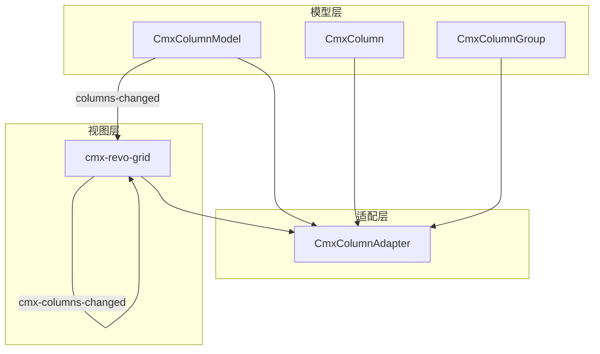
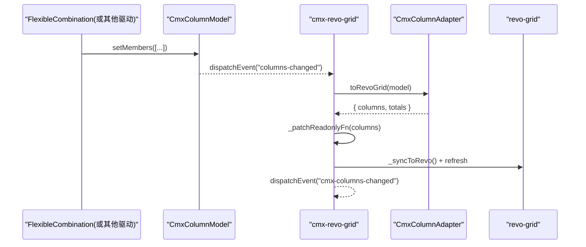
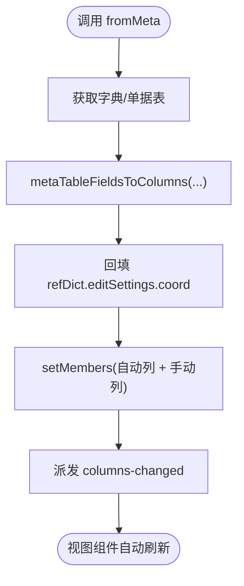
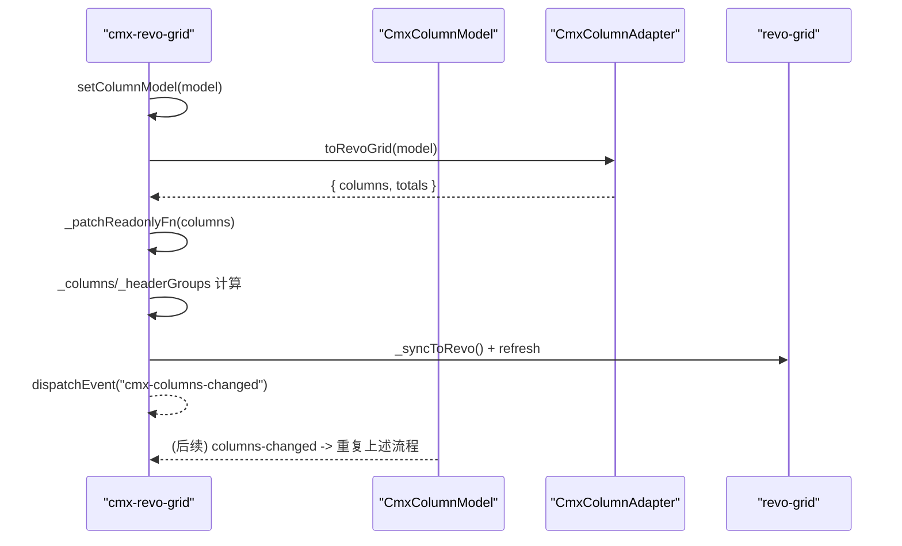
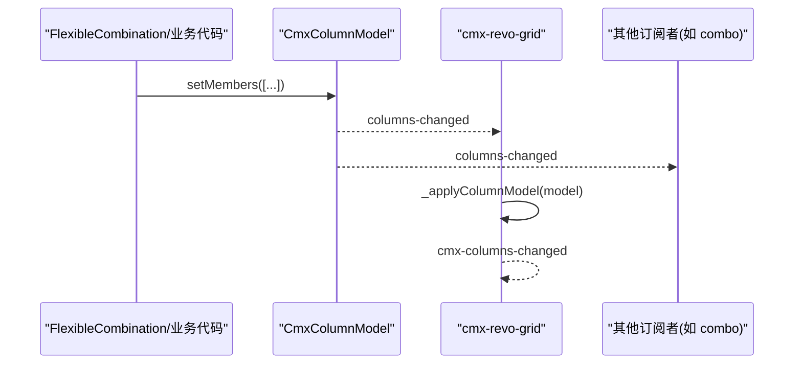
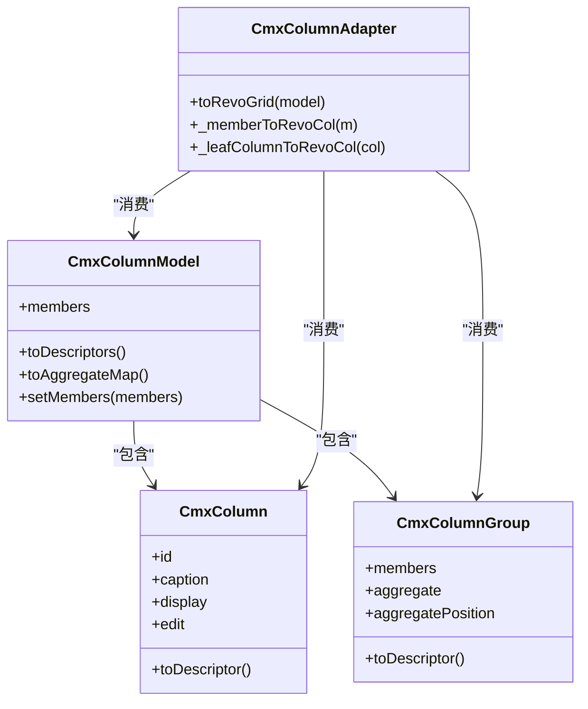
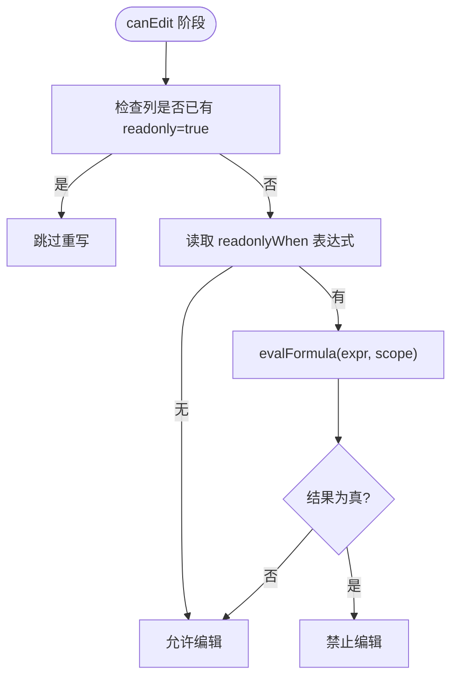
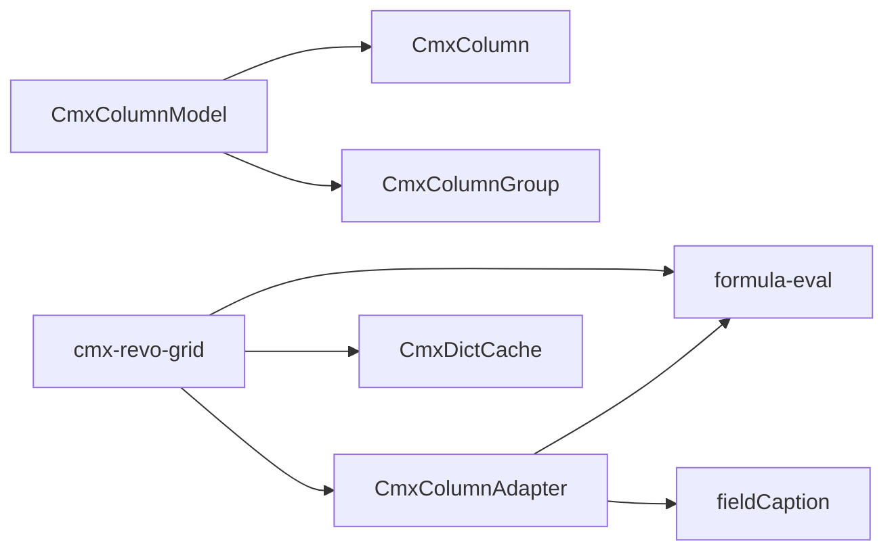

# 列模型与动态列管理

<cite>
**本文引用的文件**
- [cmx-column-model.js](file://packages/cmx-data-comp/src/lib/cmx-column-model.js)
- [cmx-column.js](file://packages/cmx-data-comp/src/lib/cmx-column.js)
- [cmx-column-group.js](file://packages/cmx-data-comp/src/lib/cmx-column-group.js)
- [cmx-column-adapter.js](file://packages/cmx-data-comp/src/lib/cmx-column-adapter.js)
- [cmx-revo-grid.js](file://packages/cmx-data-comp/src/components/cmx-revo-grid.js)
- [formula-eval.js](file://packages/cmx-data-comp/src/lib/formula-eval.js)
- [model-flexible-combination.md](file://.agents/skills/html-page-generator/references/model-flexible-combination.md)
</cite>

## 目录
1. [简介](#简介)
2. [项目结构](#项目结构)
3. [核心组件](#核心组件)
4. [架构总览](#架构总览)
5. [详细组件分析](#详细组件分析)
6. [依赖关系分析](#依赖关系分析)
7. [性能考量](#性能考量)
8. [故障排查指南](#故障排查指南)
9. [结论](#结论)
10. [附录：配置示例与最佳实践](#附录：配置示例与最佳实践)

## 简介
本文面向 RevoGrid 的列模型系统，围绕 CmxColumnModel 的统一列定义、setColumnModel 的工作流程、动态列变更监听机制、列定义转换规则（CmxColumnModel → RevoGrid 列配置）、readonlyWhen 条件只读处理，以及动态列更新场景与性能优化建议进行系统化说明。目标是帮助读者在不深入源码的情况下理解“声明式列模型 + 运行时适配器”的设计与实现。

## 项目结构
本系统的核心位于 cmx-data-comp 包中，采用“纯元数据模型 + 渲染层适配”的分层设计：
- 模型层：CmxColumnModel / CmxColumn / CmxColumnGroup 描述列的结构、显示与编辑语义，不包含具体网格实现细节。
- 适配层：CmxColumnAdapter 将模型转换为具体网格（如 RevoGrid）所需的列定义与合计配置。
- 视图层：cmx-revo-grid 订阅模型事件，调用适配器完成列同步，并派发 cmx-columns-changed 供上层消费。

图表来源
- [cmx-column-model.js:20-239](file://packages/cmx-data-comp/src/lib/cmx-column-model.js#L20-L239)
- [cmx-column.js:84-200](file://packages/cmx-data-comp/src/lib/cmx-column.js#L84-L200)
- [cmx-column-group.js:27-161](file://packages/cmx-data-comp/src/lib/cmx-column-group.js#L27-L161)
- [cmx-column-adapter.js:720-732](file://packages/cmx-data-comp/src/lib/cmx-column-adapter.js#L720-L732)
- [cmx-revo-grid.js:468-592](file://packages/cmx-data-comp/src/components/cmx-revo-grid.js#L468-L592)

章节来源
- [cmx-column-model.js:20-239](file://packages/cmx-data-comp/src/lib/cmx-column-model.js#L20-L239)
- [cmx-column-adapter.js:1-21](file://packages/cmx-data-comp/src/lib/cmx-column-adapter.js#L1-L21)
- [cmx-revo-grid.js:1-44](file://packages/cmx-data-comp/src/components/cmx-revo-grid.js#L1-L44)

## 核心组件
- CmxColumnModel：统一维护 members（CmxColumn/CmxColumnGroup），提供 toDescriptors()、toAggregateMap()、fromMeta()、setMembers()、addMember()/removeMember() 等能力，并通过 columns-changed 事件通知订阅者。
- CmxColumn：单列元数据，包含 display/edit 两组结构化配置，支持 readonlyWhen、requiredWhen、validateWhen、calcFormula 等表达式与行为。
- CmxColumnGroup：分组表头节点，可聚合子列，支持 aggregate/aggregatePosition 等合计相关属性。
- CmxColumnAdapter：将模型输出（members/descriptors）转换为 RevoGrid 列定义与 totals，同时保留对原始 CmxColumn 引用以便运行时读取最新 editSettings。
- cmx-revo-grid：绑定 CmxColumnModel，通过 setColumnModel(model) 完成列同步；订阅 columns-changed 自动刷新；派发 cmx-columns-changed 给页面级逻辑。

章节来源
- [cmx-column-model.js:33-87](file://packages/cmx-data-comp/src/lib/cmx-column-model.js#L33-L87)
- [cmx-column.js:14-80](file://packages/cmx-data-comp/src/lib/cmx-column.js#L14-L80)
- [cmx-column-group.js:27-40](file://packages/cmx-data-comp/src/lib/cmx-column-group.js#L27-L40)
- [cmx-column-adapter.js:720-732](file://packages/cmx-data-comp/src/lib/cmx-column-adapter.js#L720-L732)
- [cmx-revo-grid.js:468-592](file://packages/cmx-data-comp/src/components/cmx-revo-grid.js#L468-L592)

## 架构总览
下图展示了从模型到视图的完整数据流与事件流：

图表来源
- [cmx-column-model.js:62-71](file://packages/cmx-data-comp/src/lib/cmx-column-model.js#L62-L71)
- [cmx-revo-grid.js:468-592](file://packages/cmx-data-comp/src/components/cmx-revo-grid.js#L468-L592)
- [cmx-column-adapter.js:720-732](file://packages/cmx-data-comp/src/lib/cmx-column-adapter.js#L720-L732)

## 详细组件分析

### CmxColumnModel：统一列定义与动态变更
- 成员管理：addMember/removeMember/setMembers 均会触发内部 _emitChange('add'|'remove'|'replace')，派发 columns-changed 事件，使已绑定的视图组件自动重刷。
- 元数据构建：fromMeta(metaModel, tableId, opts) 可从 CmxDCTMeta/CmxDOCMeta 的字段列表构建列，并回填 refDict 列的坐标信息，最终 setMembers 合并自动列与手动列。
- 聚合映射：toAggregateMap() 按 agg 类型汇总列键，用于生成 totals。
- 序列化：toJSON/fromJSON 支持模型持久化与还原。

图表来源
- [cmx-column-model.js:89-157](file://packages/cmx-data-comp/src/lib/cmx-column-model.js#L89-L157)
- [cmx-column-model.js:62-71](file://packages/cmx-data-comp/src/lib/cmx-column-model.js#L62-L71)

章节来源
- [cmx-column-model.js:33-87](file://packages/cmx-data-comp/src/lib/cmx-column-model.js#L33-L87)
- [cmx-column-model.js:89-157](file://packages/cmx-data-comp/src/lib/cmx-column-model.js#L89-L157)
- [cmx-column-model.js:188-219](file://packages/cmx-data-comp/src/lib/cmx-column-model.js#L188-L219)

### setColumnModel 工作流程（列模型转换、分组表头、合计配置）
- 入口：cmx-revo-grid.setColumnModel(model) 解绑旧监听、保存新模型、立即应用并订阅 columns-changed。
- 转换：调用 CmxColumnAdapter.toRevoGrid(model) 得到 columns 与 totals；同时计算扁平 descriptors 用于内部 UI 展示。
- 分组表头：_headerGroups = CmxColumnAdapter._cmxTableHeaderGroups(model)。
- 合计配置：若 totals 存在则合并到 _opts.totals。
- 同步与刷新：_syncToRevo() 写入 revo-grid 的 columns/header/totals，并调度拉伸刷新；最后派发 cmx-columns-changed。

图表来源
- [cmx-revo-grid.js:468-592](file://packages/cmx-data-comp/src/components/cmx-revo-grid.js#L468-L592)
- [cmx-column-adapter.js:720-732](file://packages/cmx-data-comp/src/lib/cmx-column-adapter.js#L720-L732)

章节来源
- [cmx-revo-grid.js:468-592](file://packages/cmx-data-comp/src/components/cmx-revo-grid.js#L468-L592)
- [cmx-column-adapter.js:720-732](file://packages/cmx-data-comp/src/lib/cmx-column-adapter.js#L720-L732)

### 动态列变更监听机制（columns-changed 订阅与响应）
- 模型侧：CmxColumnModel.setMembers/addMember/removeMember 在修改 members 后统一派发 columns-changed。
- 视图侧：cmx-revo-grid 在 setColumnModel 时解绑旧监听并绑定新监听，回调内再次调用 _applyColumnModel(model) 完成全量同步。
- 其他组件：如 cmx-combo-box 也订阅 columns-changed 以刷新下拉列定义，确保多消费者一致刷新。

图表来源
- [cmx-column-model.js:62-71](file://packages/cmx-data-comp/src/lib/cmx-column-model.js#L62-L71)
- [cmx-revo-grid.js:468-483](file://packages/cmx-data-comp/src/components/cmx-revo-grid.js#L468-L483)
- [cmx-combo-box.js:154-185](file://packages/cmx-data-comp/src/components/cmx-combo-box.js#L154-L185)

章节来源
- [cmx-column-model.js:62-71](file://packages/cmx-data-comp/src/lib/cmx-column-model.js#L62-L71)
- [cmx-revo-grid.js:468-483](file://packages/cmx-data-comp/src/components/cmx-revo-grid.js#L468-L483)
- [cmx-combo-box.js:154-185](file://packages/cmx-data-comp/src/components/cmx-combo-box.js#L154-L185)

### 列定义转换规则（CmxColumnModel → RevoGrid 列配置）
- 入口：CmxColumnAdapter.toRevoGrid(model) 直接遍历 model.members（保留真实 CmxColumn 引用），过滤不可见列，递归构造分组与叶列。
- 叶列映射要点：
  - id → prop（行对象 key）
  - caption → name（列头文字）
  - editMode 'readonly'/'none' → readonly:true
  - type:'number' → columnType:'numeric' + 右对齐
  - align → cellProperties class
  - editSettings.options → _cmxSelectOptions
  - calcFormula（函数）→ _cmxOnChange（非函数版忽略）
  - validateFormula → 透传存储用
  - 字典外键回显元数据：refDict/refField/displayField
  - 编辑控制元数据：trigger/required/requiredWhen/validate/validateWhen/readonlyWhen/dependents
- 分组表头：_memberToRevoCol 递归处理 children，caption 使用 fieldCaption 解析当前语言。
- 合计：toAggregateMap 收集 agg 列，生成 totals。

图表来源
- [cmx-column-adapter.js:720-732](file://packages/cmx-data-comp/src/lib/cmx-column-adapter.js#L720-L732)
- [cmx-column-adapter.js:734-756](file://packages/cmx-data-comp/src/lib/cmx-column-adapter.js#L734-L756)
- [cmx-column.js:158-200](file://packages/cmx-data-comp/src/lib/cmx-column.js#L158-L200)
- [cmx-column-group.js:125-131](file://packages/cmx-data-comp/src/lib/cmx-column-group.js#L125-L131)

章节来源
- [cmx-column-adapter.js:720-756](file://packages/cmx-data-comp/src/lib/cmx-column-adapter.js#L720-L756)
- [cmx-column.js:158-200](file://packages/cmx-data-comp/src/lib/cmx-column.js#L158-L200)
- [cmx-column-group.js:125-131](file://packages/cmx-data-comp/src/lib/cmx-column-group.js#L125-L131)

### readonlyWhen 表达式与条件只读逻辑
- 位置：cmx-revo-grid._patchReadonlyFn(col) 递归为每个叶列注入 readonly(data) 函数。
- 触发时机：revo-grid 在 canEdit() 阶段调用 readonly(data)，返回 true 即跳过编辑器。
- 表达式求值：读取 col._cmxCol.edit.readonlyWhen 或 col.readonlyWhen，使用 evalFormula 在 scope={...row, value: row[prop], __col: prop} 下求值。
- 兼容处理：revo-grid 传入的 data 可能是包装对象，需识别 data.model 取真实行数据，避免公式误判导致全部只读。
- 优先级：若列已硬编码 readonly=true，则不覆盖，保持业务锁优先。

图表来源
- [cmx-revo-grid.js:594-626](file://packages/cmx-data-comp/src/components/cmx-revo-grid.js#L594-L626)
- [formula-eval.js:1-24](file://packages/cmx-data-comp/src/lib/formula-eval.js#L1-L24)

章节来源
- [cmx-revo-grid.js:594-626](file://packages/cmx-data-comp/src/components/cmx-revo-grid.js#L594-L626)
- [formula-eval.js:1-24](file://packages/cmx-data-comp/src/lib/formula-eval.js#L1-L24)

### 动态列更新场景（FlexibleCombination）
- FlexibleCombination 根据锚点维度变化，计算并生成新的 CmxColumn 数组，调用 columnModel.setMembers(columns) 替换列集合。
- 该操作会触发 columns-changed，所有订阅者（如 cmx-revo-grid）自动重新同步列与合计配置。
- 优势：零页面胶水，同一 CmxColumnModel 被多个组件绑定时，列变更广播一致。

章节来源
- [model-flexible-combination.md:15-33](file://.agents/skills/html-page-generator/references/model-flexible-combination.md#L15-L33)
- [cmx-column-model.js:62-71](file://packages/cmx-data-comp/src/lib/cmx-column-model.js#L62-L71)

## 依赖关系分析
- 模型层依赖：CmxColumnModel 依赖 CmxColumn/CmxColumnGroup 的 toDescriptor 与聚合方法；fromMeta 依赖 init-page-models 中的 metaTableFieldsToColumns（动态 import 避免循环依赖）。
- 适配层依赖：CmxColumnAdapter 依赖 formula-eval（用于某些显示/编辑逻辑）、fieldCaption（i18n 标题解析）、editModeKind（编辑模式归一化）。
- 视图层依赖：cmx-revo-grid 依赖 CmxColumnAdapter、formula-eval、主题与皮肤模块、字典缓存等。

图表来源
- [cmx-column-model.js:16-18](file://packages/cmx-data-comp/src/lib/cmx-column-model.js#L16-L18)
- [cmx-column-adapter.js:23-27](file://packages/cmx-data-comp/src/lib/cmx-column-adapter.js#L23-L27)
- [cmx-revo-grid.js:27-43](file://packages/cmx-data-comp/src/components/cmx-revo-grid.js#L27-L43)

章节来源
- [cmx-column-model.js:16-18](file://packages/cmx-data-comp/src/lib/cmx-column-model.js#L16-L18)
- [cmx-column-adapter.js:23-27](file://packages/cmx-data-comp/src/lib/cmx-column-adapter.js#L23-L27)
- [cmx-revo-grid.js:27-43](file://packages/cmx-data-comp/src/components/cmx-revo-grid.js#L27-L43)

## 性能考量
- 整体替换列时的用户列宽重置：setColumnModel 会清空 _userColSizes，避免旧宽度污染新列布局。
- 延迟刷新：_scheduleStretchRefresh 将拉伸刷新排入下一帧，减少同帧多次刷新带来的抖动。
- 字典回显预加载：enableDictEcho 异步预加载字典，失败时降级显示原 id 并提示，不阻断渲染。
- 表达式求值：readonlyWhen/requiredWhen/validateWhen 使用安全表达式求值器，避免裸 eval 的性能与安全开销。
- 建议：
  - 批量变更列时使用 setMembers 一次性替换，避免多次 addMember 引发多次重绘。
  - 合理设置 width（百分比/flex）配合 stretch，减少频繁 resize 计算。
  - 谨慎使用复杂 readonlyWhen 表达式，必要时预编译复用（若有需要可在上层缓存 AST）。

[本节为通用指导，不直接分析具体文件]

## 故障排查指南
- 列未刷新：确认 CmxColumnModel.setMembers/addMember/removeMember 是否被调用；检查 cmx-revo-grid 是否正确订阅 columns-changed。
- readonlyWhen 失效：检查列是否已硬编码 readonly=true；确认表达式语法正确且 scope 中包含所需字段；查看 _patchReadonlyFn 是否被调用。
- 合计不生效：确认列设置了 agg 类型，且 toAggregateMap 能收集到对应列；检查 totals 是否被正确合并到 _opts。
- 字典回显失败：检查 refDict.editSettings.coord 是否存在；确认 enableDictEcho 成功加载字典；失败时会 toast 提示。

章节来源
- [cmx-revo-grid.js:565-592](file://packages/cmx-data-comp/src/components/cmx-revo-grid.js#L565-L592)
- [cmx-revo-grid.js:594-626](file://packages/cmx-data-comp/src/components/cmx-revo-grid.js#L594-L626)
- [cmx-column-model.js:198-219](file://packages/cmx-data-comp/src/lib/cmx-column-model.js#L198-L219)

## 结论
CmxColumnModel 通过统一的列元数据与事件机制，实现了“声明式列定义 + 运行时动态切换”的能力。cmx-revo-grid 作为视图层，负责将模型转换为 RevoGrid 列配置，并在模型变更时自动同步。readonlyWhen 表达式提供了细粒度的条件只读控制。结合 FlexibleCombination 等动态列驱动，可实现上下文驱动的列集切换，满足复杂业务场景。

[本节为总结性内容，不直接分析具体文件]

## 附录：配置示例与最佳实践

- 列定义示例（概念性）
  - 文本列：id='name', caption='名称', dataType='VARCHAR'
  - 数值列：id='amount', caption='金额', dataType='DECIMAL', display.mode='number'
  - 日期列：id='date', caption='日期', dataType='DATE'
  - 选择列：edit.mode='select', options=[{value,label}]
  - 字典列：refDict='dictCode', refField='id', displayField='name'
  - 分组表头：CmxColumnGroup 包含若干叶子列，设置 aggregate.sum=true 启用合计

- 动态列更新场景
  - 基于锚点维度（如科目、交易类型）切换列集：FlexibleCombination 计算新列数组 → columnModel.setMembers(newCols) → 自动触发 columns-changed → 视图刷新。

- 性能优化建议
  - 使用 setMembers 批量替换列，减少多次事件触发。
  - 合理使用 width（百分比/flex）与 stretch，降低 resize 计算成本。
  - 将复杂 readonlyWhen 表达式尽量简化，或在业务层缓存结果。
  - 字典回显使用 enableDictEcho 预加载，避免逐行请求。

[本节为概念性说明，不直接分析具体文件]