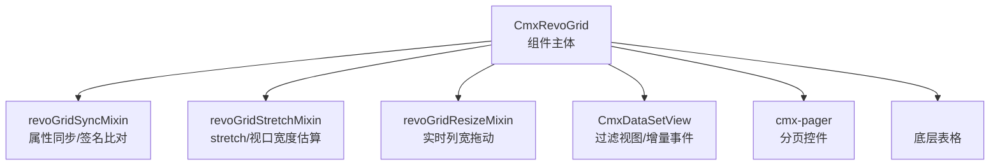
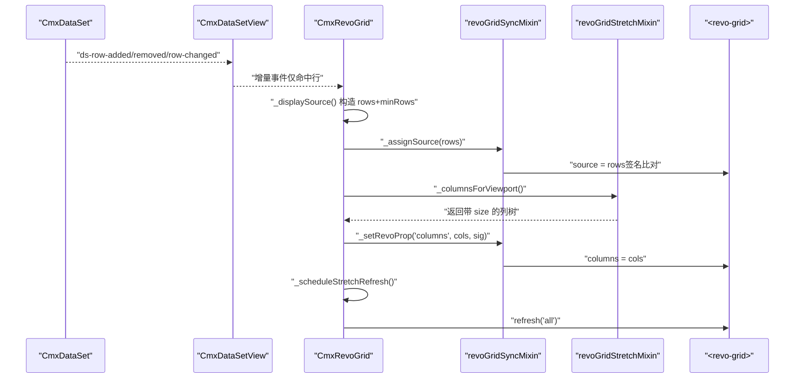
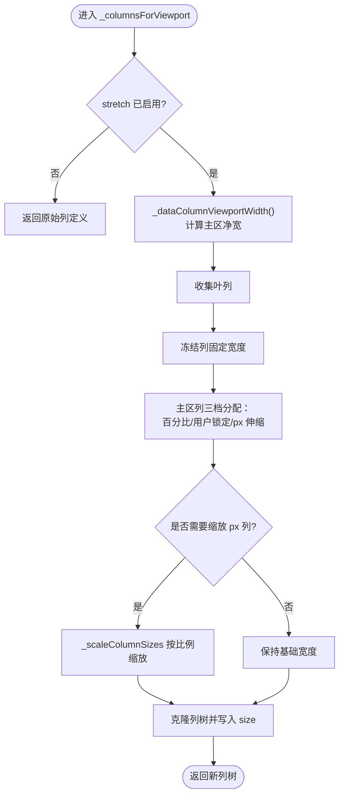
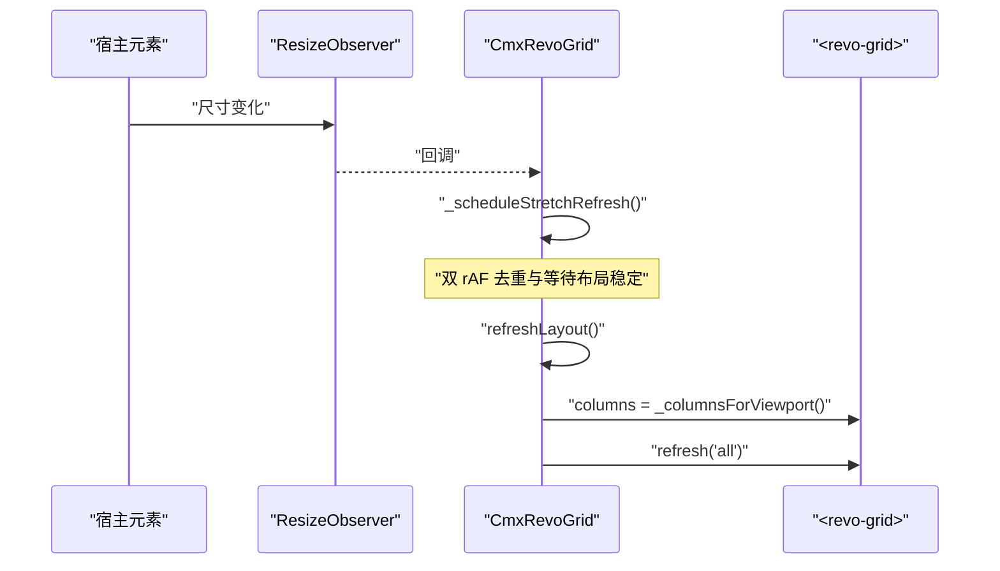
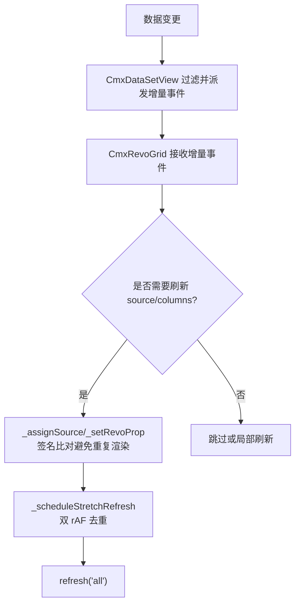
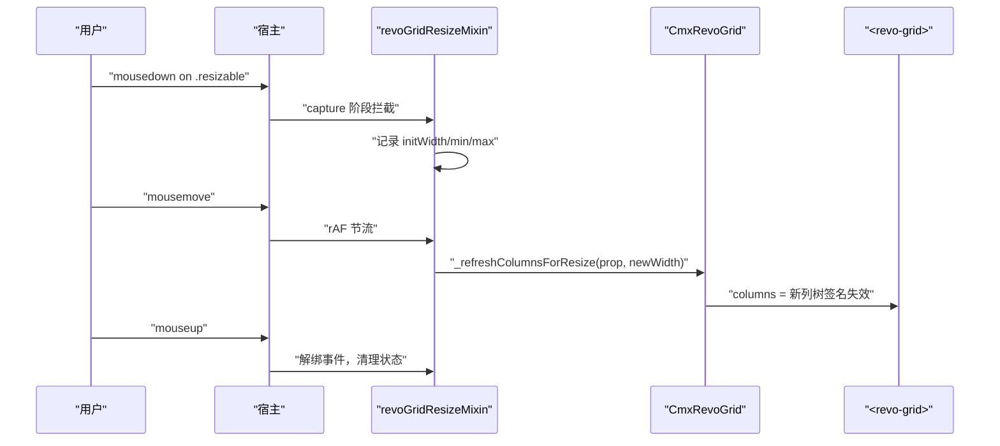
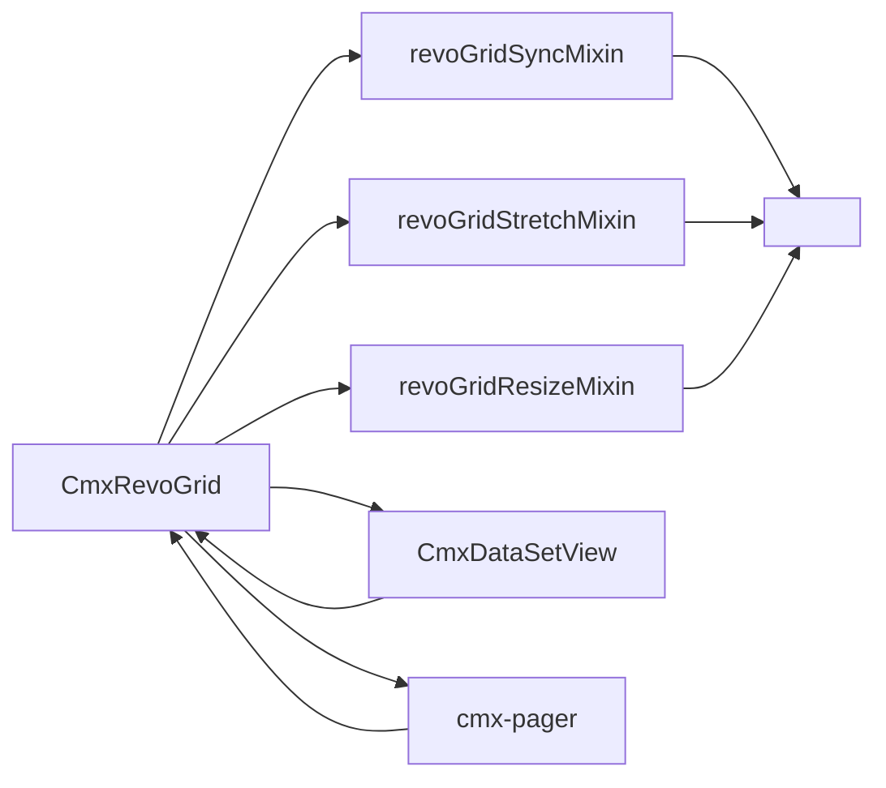

# 性能优化与大数据处理

<cite>
**本文引用的文件**
- [cmx-revo-grid.js](file://packages/cmx-data-comp/src/components/cmx-revo-grid.js)
- [revo-grid-stretch-mixin.js](file://packages/cmx-data-comp/src/components/revo-grid/revo-grid-stretch-mixin.js)
- [revo-grid-sync-mixin.js](file://packages/cmx-data-comp/src/components/revo-grid/revo-grid-sync-mixin.js)
- [revo-grid-resize-mixin.js](file://packages/cmx-data-comp/src/components/revo-grid/revo-grid-resize-mixin.js)
- [cmx-data-set-view.js](file://packages/cmx-data-comp/src/lib/cmx-data-set-view.js)
- [cmx-pager.js](file://packages/cmx-data-comp/src/components/cmx-pager.js)
- [revo-grid-stretch-percent.test.js](file://packages/cmx-data-comp/src/components/__tests__/revo-grid-stretch-percent.test.js)
</cite>

## 目录
1. [简介](#简介)
2. [项目结构](#项目结构)
3. [核心组件](#核心组件)
4. [架构总览](#架构总览)
5. [详细组件分析](#详细组件分析)
6. [依赖关系分析](#依赖关系分析)
7. [性能考量](#性能考量)
8. [故障排查指南](#故障排查指南)
9. [结论](#结论)
10. [附录](#附录)

## 简介
本文件聚焦 RevoGrid 在 cmx-data-comp 中的性能优化与大数据处理方案，覆盖虚拟滚动配置、布局计算（stretch/视口测量/ResizeObserver）、渲染优化（批量更新、防抖、DOM 操作优化）、数据分页与懒加载、内存管理以及监控与调优实践。目标是帮助在不同数据规模下稳定、高效地展示表格，避免横向溢出、抖动与卡顿。

## 项目结构
围绕 RevoGrid 的性能相关代码主要分布在以下模块：
- 组件主体：CmxRevoGrid 封装 <revo-grid>，负责选项、列模型、数据源同步、主题与尺寸、事件绑定等。
- 拉伸与布局：revoGridStretchMixin 实现 stretch 列宽分配、冻结列兼容、主区净宽估算。
- 属性同步：revoGridSyncMixin 提供签名化 prop 写入、一次性同步、虚拟滚动开关控制。
- 实时列宽拖动：revoGridResizeMixin 接管拖动、rAF 节流、即时重渲。
- 数据集视图：CmxDataSetView 将主数据集过滤为视图，按行变更派发增量事件，减少不必要刷新。
- 分页控件：cmx-pager 提供协作/独立模式分页，配合大数据集按需加载。

图表来源
- [cmx-revo-grid.js:183-312](file://packages/cmx-data-comp/src/components/cmx-revo-grid.js#L183-L312)
- [revo-grid-sync-mixin.js:30-199](file://packages/cmx-data-comp/src/components/revo-grid/revo-grid-sync-mixin.js#L30-L199)
- [revo-grid-stretch-mixin.js:16-200](file://packages/cmx-data-comp/src/components/revo-grid/revo-grid-stretch-mixin.js#L16-L200)
- [revo-grid-resize-mixin.js:22-150](file://packages/cmx-data-comp/src/components/revo-grid/revo-grid-resize-mixin.js#L22-L150)
- [cmx-data-set-view.js:120-203](file://packages/cmx-data-comp/src/lib/cmx-data-set-view.js#L120-L203)
- [cmx-pager.js:194-420](file://packages/cmx-data-comp/src/components/cmx-pager.js#L194-L420)

章节来源
- [cmx-revo-grid.js:183-312](file://packages/cmx-data-comp/src/components/cmx-revo-grid.js#L183-L312)
- [revo-grid-sync-mixin.js:30-199](file://packages/cmx-data-comp/src/components/revo-grid/revo-grid-sync-mixin.js#L30-L199)
- [revo-grid-stretch-mixin.js:16-200](file://packages/cmx-data-comp/src/components/revo-grid/revo-grid-stretch-mixin.js#L16-L200)
- [revo-grid-resize-mixin.js:22-150](file://packages/cmx-data-comp/src/components/revo-grid/revo-grid-resize-mixin.js#L22-L150)
- [cmx-data-set-view.js:120-203](file://packages/cmx-data-comp/src/lib/cmx-data-set-view.js#L120-L203)
- [cmx-pager.js:194-420](file://packages/cmx-data-comp/src/components/cmx-pager.js#L194-L420)

## 核心组件
- CmxRevoGrid：统一入口，维护默认选项（rowHeight、viewHeight、virtualScroll、minRows、stretch、resize 等），负责 Shadow DOM 初始化、皮肤、主题、尺寸、事件绑定、数据源与列模型同步、合计行渲染、stretch 刷新调度。
- revoGridSyncMixin：通过签名比对避免无谓重绘；一次性同步 columns/source/readonly/theme/rowSize 等；根据 virtualScroll 设置 disableVirtualX/Y；维护 rowClass 指向高亮字段。
- revoGridStretchMixin：实现 stretch 列宽按比例分配，支持百分比列与用户锁定列；冻结列不参与拉伸；主区净宽估算考虑序号列、垂直滚动条占位与冻结列总宽。
- revoGridResizeMixin：接管列宽拖动，rAF 节流每帧一次，实时更新 _userColSizes 并触发列树克隆与重新赋值，保证即时跟手。
- CmxDataSetView：将主数据集按 predicate 过滤为视图，订阅 ds-row-added/removed/row-changed，仅对命中行做增量更新，降低网格刷新成本。
- cmx-pager：提供 page/page-size/total 等分页能力，支持协作模式与独立模式，便于后端分页或前端分页。

章节来源
- [cmx-revo-grid.js:71-155](file://packages/cmx-data-comp/src/components/cmx-revo-grid.js#L71-L155)
- [cmx-revo-grid.js:183-312](file://packages/cmx-data-comp/src/components/cmx-revo-grid.js#L183-L312)
- [revo-grid-sync-mixin.js:30-199](file://packages/cmx-data-comp/src/components/revo-grid/revo-grid-sync-mixin.js#L30-L199)
- [revo-grid-stretch-mixin.js:16-200](file://packages/cmx-data-comp/src/components/revo-grid/revo-grid-stretch-mixin.js#L16-L200)
- [revo-grid-resize-mixin.js:22-150](file://packages/cmx-data-comp/src/components/revo-grid/revo-grid-resize-mixin.js#L22-L150)
- [cmx-data-set-view.js:120-203](file://packages/cmx-data-comp/src/lib/cmx-data-set-view.js#L120-L203)
- [cmx-pager.js:194-420](file://packages/cmx-data-comp/src/components/cmx-pager.js#L194-L420)

## 架构总览
下图展示了从数据到渲染的关键路径：数据集视图过滤 → 显示源构造（含 minRows 占位）→ 签名化写入 source/columns → 虚拟滚动渲染 → stretch 刷新调度 → ResizeObserver/rAF 驱动尺寸变化。

图表来源
- [cmx-data-set-view.js:172-203](file://packages/cmx-data-comp/src/lib/cmx-data-set-view.js#L172-L203)
- [cmx-revo-grid.js:1092-1129](file://packages/cmx-data-comp/src/components/cmx-revo-grid.js#L1092-L1129)
- [revo-grid-sync-mixin.js:93-107](file://packages/cmx-data-comp/src/components/revo-grid/revo-grid-sync-mixin.js#L93-L107)
- [revo-grid-stretch-mixin.js:17-113](file://packages/cmx-data-comp/src/components/revo-grid/revo-grid-stretch-mixin.js#L17-L113)
- [cmx-revo-grid.js:1205-1215](file://packages/cmx-data-comp/src/components/cmx-revo-grid.js#L1205-L1215)

## 详细组件分析

### 虚拟滚动与关键参数
- virtualScroll：默认开启。关闭时通过 disableVirtualX/Y 同时禁用 X/Y 虚拟滚动，适用于小数据量场景。
- rowHeight：影响每行高度与“是否出现垂直滚动条”的判断（rowCount × rowHeight > viewportH）。也用于 CSS 变量驱动行内文本垂直居中。
- viewHeight/fillHeight：固定高度或撑满父容器。fillHeight=true 时忽略 viewHeight，使用 flex 布局自适应。
- minRows：当数据不足时插入占位行，保持表格最小视觉高度，避免首次渲染过矮导致布局抖动。
- stretch：启用后由组件按比例分配剩余宽度，而非依赖 RevoGrid 原生 stretch（后者会把剩余宽度集中给末列）。

优化要点
- 大数据集务必开启 virtualScroll，合理设置 rowHeight（如 32px）以获得更合理的可见行数。
- 使用 minRows 控制首屏最小高度，避免空态或极少数据时的布局跳变。
- 优先使用 fillHeight 让表格自适应容器高度；若需固定高度，再设置 viewHeight。
- 通过 setOptions 动态切换 virtualScroll/rowHeight/viewHeight/minRows/stretch，以适配不同数据规模。

章节来源
- [cmx-revo-grid.js:82-96](file://packages/cmx-data-comp/src/components/cmx-revo-grid.js#L82-L96)
- [revo-grid-sync-mixin.js:186-192](file://packages/cmx-data-comp/src/components/revo-grid/revo-grid-sync-mixin.js#L186-L192)
- [cmx-revo-grid.js:1092-1129](file://packages/cmx-data-comp/src/components/cmx-revo-grid.js#L1092-L1129)
- [cmx-revo-grid.js:1205-1215](file://packages/cmx-data-comp/src/components/cmx-revo-grid.js#L1205-L1215)

### 布局计算与 stretch 模式
- 主区净宽估算：full - 序号列宽 - 垂直滚动条占位 - 冻结列总宽。垂直滚动条存在性基于 rowCount × rowHeight 与视口高度比较，避免依赖不可靠的 scrollHeight。
- 冻结列：pin=colPinStart/colPinEnd 的列保持固定宽度（用户拖动锁定值优先，否则取 base size），不参与 stretch。
- 百分比列：_cmxPercent 列固定为主区净宽的百分比，其余 px 列在剩余空间内按比例缩放铺满，避免擦边横向滚动条。
- 用户锁定列：开启 resize 后，拖动过的列宽被记录到 _userColSizes，后续不再参与 stretch 再分配。

图表来源
- [revo-grid-stretch-mixin.js:17-113](file://packages/cmx-data-comp/src/components/revo-grid/revo-grid-stretch-mixin.js#L17-L113)
- [revo-grid-stretch-mixin.js:115-140](file://packages/cmx-data-comp/src/components/revo-grid/revo-grid-stretch-mixin.js#L115-L140)
- [revo-grid-stretch-mixin.js:163-199](file://packages/cmx-data-comp/src/components/revo-grid/revo-grid-stretch-mixin.js#L163-L199)

章节来源
- [revo-grid-stretch-mixin.js:17-113](file://packages/cmx-data-comp/src/components/revo-grid/revo-grid-stretch-mixin.js#L17-L113)
- [revo-grid-stretch-mixin.js:115-140](file://packages/cmx-data-comp/src/components/revo-grid/revo-grid-stretch-mixin.js#L115-L140)
- [revo-grid-stretch-mixin.js:163-199](file://packages/cmx-data-comp/src/components/revo-grid/revo-grid-stretch-mixin.js#L163-L199)
- [revo-grid-stretch-percent.test.js:283-316](file://packages/cmx-data-comp/src/components/__tests__/revo-grid-stretch-percent.test.js#L283-L316)

### 视口测量与 ResizeObserver
- 宿主尺寸监听：在需要 stretch/fillHeight 时安装 ResizeObserver，监听 host 尺寸变化，触发 refreshLayout 与 _scheduleStretchRefresh。
- 双 rAF 调度：先让 revo-grid 渲染新数据（可能改变垂直滚动条），第二帧再按稳定尺寸重算 stretch，避免滚动条占用未定时导致的横向溢出。
- 编辑期样式：编辑期间临时隐藏内部 revogr-viewport-scroll 的横向溢出，防止编辑器瞬时撑出 cell 触发横向滚动条闪现导致整表抖动。

图表来源
- [cmx-revo-grid.js:1205-1215](file://packages/cmx-data-comp/src/components/cmx-revo-grid.js#L1205-L1215)
- [cmx-revo-grid.js:1225-1399](file://packages/cmx-data-comp/src/components/cmx-revo-grid.js#L1225-L1399)

章节来源
- [cmx-revo-grid.js:1205-1215](file://packages/cmx-data-comp/src/components/cmx-revo-grid.js#L1205-L1215)
- [cmx-revo-grid.js:1225-1399](file://packages/cmx-data-comp/src/components/cmx-revo-grid.js#L1225-L1399)

### 渲染性能优化技巧
- 批量更新与签名比对：
  - _setRevoProp 通过签名比对避免同值重复赋值，减少 Stencil 不必要的 @Watch 触发。
  - 列树签名包含 name/prop/size/min/max/模板标记等，确保模板变化可被捕获。
  - 数据源签名只看版本号 + 行数 + minRows + 显示行数，避免 O(N) 字符串拼接与 GC 压力。
- 增量事件：
  - CmxDataSetView 订阅主数据集事件，仅对命中行派发 ds-row-added/removed/row-changed，grid 侧据此局部刷新。
- DOM 操作优化：
  - 实时列宽拖动使用 rAF 节流，每帧最多一次重算与重渲。
  - 编辑期隐藏横向溢出，避免闪烁。
  - 合计行列宽刷新与 stretch 刷新均通过 pending 标志去重。
- 缓存策略：
  - _displaySource 结果按 rows 引用、长度、minRows 三者不变即复用，减少数组创建与拷贝。

图表来源
- [revo-grid-sync-mixin.js:31-107](file://packages/cmx-data-comp/src/components/revo-grid/revo-grid-sync-mixin.js#L31-L107)
- [cmx-data-set-view.js:172-203](file://packages/cmx-data-comp/src/lib/cmx-data-set-view.js#L172-L203)
- [cmx-revo-grid.js:1205-1215](file://packages/cmx-data-comp/src/components/cmx-revo-grid.js#L1205-L1215)

章节来源
- [revo-grid-sync-mixin.js:31-107](file://packages/cmx-data-comp/src/components/revo-grid/revo-grid-sync-mixin.js#L31-L107)
- [cmx-data-set-view.js:172-203](file://packages/cmx-data-comp/src/lib/cmx-data-set-view.js#L172-L203)
- [cmx-revo-grid.js:1205-1215](file://packages/cmx-data-comp/src/components/cmx-revo-grid.js#L1205-L1215)

### 大数据集处理方案
- 数据分页：
  - 使用 cmx-pager 的 page/page-size/total 进行分页，支持协作模式（与协调器联动）与独立模式（本地状态 + 事件）。
  - 通过 gotoPage/nextPage/prevPage/setPageSize 等 API 控制分页行为。
- 懒加载：
  - 结合 CmxDataSetView 的 live 模式与 predicate，仅加载/显示当前页或筛选后的数据，减少内存占用。
- 内存管理：
  - 使用 _displaySource 缓存机制减少数组创建；冻结列与 stretch 计算中避免重复遍历与多余对象。
  - 通过 _sourceSignature 避免全量 id 串拼接，降低 GC 压力。
- 渲染优化：
  - 虚拟滚动 + 合理 rowHeight 控制可见行数；stretch 精确铺满避免横向滚动条；rAF 节流拖动与刷新。

建议配置
- 小数据（<1k 行）：virtualScroll 可关闭，rowHeight=32，minRows=0，stretch=true。
- 中等数据（1k~10k 行）：virtualScroll=true，rowHeight=32，minRows≈视口行数，stretch=true，必要时开启 resize。
- 大数据（>10k 行）：virtualScroll=true，rowHeight=32，minRows≈视口行数，stretch=true，启用分页（page-size=50/100/200），使用 CmxDataSetView 过滤当前页数据。

章节来源
- [cmx-pager.js:194-420](file://packages/cmx-data-comp/src/components/cmx-pager.js#L194-L420)
- [cmx-data-set-view.js:120-203](file://packages/cmx-data-comp/src/lib/cmx-data-set-view.js#L120-L203)
- [cmx-revo-grid.js:1092-1129](file://packages/cmx-data-comp/src/components/cmx-revo-grid.js#L1092-L1129)
- [revo-grid-sync-mixin.js:93-107](file://packages/cmx-data-comp/src/components/revo-grid/revo-grid-sync-mixin.js#L93-L107)

### 列宽拖动与防抖
- 接管拖动：在 capture 阶段拦截 .resizable 的 mousedown，旁路 revo-grid 的 ResizeDirective，实现“按住拖动时列宽实时变化”。
- rAF 节流：mousemove 事件通过 requestAnimationFrame 合并，每帧最多一次重算 newWidth（受 minSize/maxSize 限制），更新 _userColSizes 并触发列树克隆与重新赋值。
- 清理：mouseup 解绑文档事件，恢复光标与选择行为，取消未执行的 rAF。

图表来源
- [revo-grid-resize-mixin.js:22-150](file://packages/cmx-data-comp/src/components/revo-grid/revo-grid-resize-mixin.js#L22-L150)

章节来源
- [revo-grid-resize-mixin.js:22-150](file://packages/cmx-data-comp/src/components/revo-grid/revo-grid-resize-mixin.js#L22-L150)

## 依赖关系分析
- CmxRevoGrid 依赖多个 mixin 完成职责拆分：同步、拉伸、拖动、事件、工具等。
- 数据流依赖 CmxDataSetView 提供的增量事件，避免全量刷新。
- 分页控件 cmx-pager 与协调器协作，控制数据加载范围。
- 所有 prop 写入经签名比对，避免 Stencil 不必要的响应式更新。

图表来源
- [cmx-revo-grid.js:183-312](file://packages/cmx-data-comp/src/components/cmx-revo-grid.js#L183-L312)
- [revo-grid-sync-mixin.js:30-199](file://packages/cmx-data-comp/src/components/revo-grid/revo-grid-sync-mixin.js#L30-L199)
- [revo-grid-stretch-mixin.js:16-200](file://packages/cmx-data-comp/src/components/revo-grid/revo-grid-stretch-mixin.js#L16-L200)
- [revo-grid-resize-mixin.js:22-150](file://packages/cmx-data-comp/src/components/revo-grid/revo-grid-resize-mixin.js#L22-L150)
- [cmx-data-set-view.js:120-203](file://packages/cmx-data-comp/src/lib/cmx-data-set-view.js#L120-L203)
- [cmx-pager.js:194-420](file://packages/cmx-data-comp/src/components/cmx-pager.js#L194-L420)

章节来源
- [cmx-revo-grid.js:183-312](file://packages/cmx-data-comp/src/components/cmx-revo-grid.js#L183-L312)
- [revo-grid-sync-mixin.js:30-199](file://packages/cmx-data-comp/src/components/revo-grid/revo-grid-sync-mixin.js#L30-L199)
- [revo-grid-stretch-mixin.js:16-200](file://packages/cmx-data-comp/src/components/revo-grid/revo-grid-stretch-mixin.js#L16-L200)
- [revo-grid-resize-mixin.js:22-150](file://packages/cmx-data-comp/src/components/revo-grid/revo-grid-resize-mixin.js#L22-L150)
- [cmx-data-set-view.js:120-203](file://packages/cmx-data-comp/src/lib/cmx-data-set-view.js#L120-L203)
- [cmx-pager.js:194-420](file://packages/cmx-data-comp/src/components/cmx-pager.js#L194-L420)

## 性能考量
- 虚拟滚动：大数据集必须开启 virtualScroll；合理设置 rowHeight 控制可见行数；minRows 控制首屏最小高度。
- 布局计算：stretch 模式下使用主区净宽估算，冻结列与百分比列正确处理，避免横向滚动条与溢出。
- 渲染优化：签名化 prop 写入、增量事件、rAF 节流、编辑期隐藏横向溢出、合计/拉伸刷新去重。
- 内存管理：_displaySource 缓存、_sourceSignature 避免大字符串拼接、冻结列与主区列遍历复用逻辑。
- 分页与懒加载：结合 cmx-pager 与 CmxDataSetView 的过滤视图，仅加载/显示必要数据。

[本节为通用指导，不直接分析具体文件]

## 故障排查指南
- 横向滚动条异常出现：
  - 检查 stretch 是否启用，确认 _dataColumnViewportWidth 估算正确（序号列、垂直滚动条、冻结列扣除）。
  - 确认冻结列宽度计算口径一致（用户锁定优先，否则 base size）。
- 返回页面后出现横向溢出：
  - 使用统一估算口径（不依赖 mainVp.clientWidth），确保首次渲染与返回路径一致。
- 拖动列宽不生效：
  - 确认 resize=true 且 capture 阶段成功拦截 .resizable；检查 rAF 节流与 _userColSizes 更新。
- 主题切换后颜色不更新：
  - 使用 _setRevoProp(theme) 并调用 refresh('all')，确保已渲染单元格重绘。
- 编辑期抖动：
  - 编辑期间隐藏 revogr-viewport-scroll 的横向溢出，编辑结束后恢复。

章节来源
- [revo-grid-stretch-mixin.js:115-140](file://packages/cmx-data-comp/src/components/revo-grid/revo-grid-stretch-mixin.js#L115-L140)
- [revo-grid-stretch-percent.test.js:283-316](file://packages/cmx-data-comp/src/components/__tests__/revo-grid-stretch-percent.test.js#L283-L316)
- [revo-grid-resize-mixin.js:22-150](file://packages/cmx-data-comp/src/components/revo-grid/revo-grid-resize-mixin.js#L22-L150)
- [cmx-revo-grid.js:281-301](file://packages/cmx-data-comp/src/components/cmx-revo-grid.js#L281-L301)
- [cmx-revo-grid.js:1269-1275](file://packages/cmx-data-comp/src/components/cmx-revo-grid.js#L1269-L1275)

## 结论
通过在 CmxRevoGrid 中引入签名化属性同步、stretch 精确布局、rAF 节流与增量事件，结合虚拟滚动与分页/懒加载，能够在不同数据规模下稳定高效地渲染表格。冻结列与百分比列的兼容、编辑期的样式保护、以及双 rAF 的刷新调度，进一步提升了用户体验与性能稳定性。建议在大数据场景优先采用分页与视图过滤，中小数据场景则充分利用虚拟滚动与 stretch 自适应。

[本节为总结，不直接分析具体文件]

## 附录
- 推荐配置速查
  - 小数据：virtualScroll=false，rowHeight=32，minRows=0，stretch=true。
  - 中等数据：virtualScroll=true，rowHeight=32，minRows≈视口行数，stretch=true，可选 resize。
  - 大数据：virtualScroll=true，rowHeight=32，minRows≈视口行数，stretch=true，分页 page-size=50/100/200，CmxDataSetView 过滤当前页。
- 关键 API
  - setOptions(opts)：动态调整 rowHeight/viewHeight/virtualScroll/minRows/stretch/resize 等。
  - refreshLayout()：强制刷新列宽与视口测量。
  - setDataSet(dsOrRows, sel)：绑定数据集或替换数据行，自动处理选中态与滚动位置。
  - pager.gotoPage()/setPageSize()：控制分页。

[本节为补充说明，不直接分析具体文件]