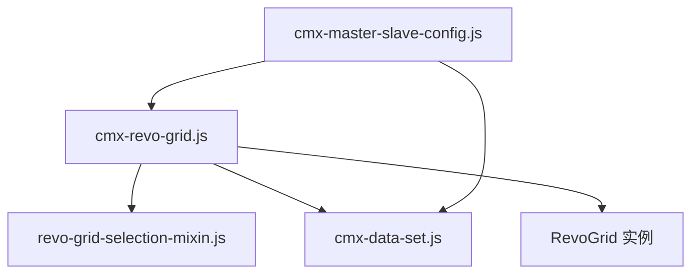
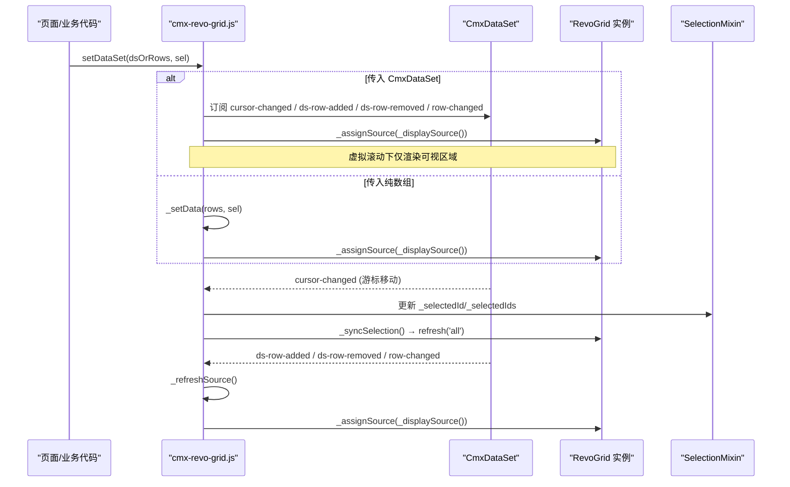
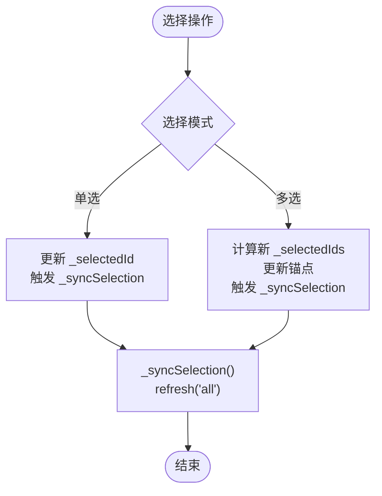
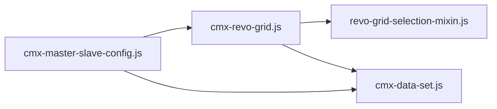

# 数据绑定与同步机制

<cite>
**本文引用的文件**
- [cmx-revo-grid.js](file://packages/cmx-data-comp/src/components/cmx-revo-grid.js)
- [revo-grid-selection-mixin.js](file://packages/cmx-data-comp/src/components/revo-grid/revo-grid-selection-mixin.js)
- [cmx-data-set.js](file://packages/cmx-data-comp/src/lib/cmx-data-set.js)
- [cmx-master-slave-config.js](file://packages/cmx-data-comp/src/components/cmx-master-slave-config.js)
- [model-dataset.md](file://.agents/skills/html-page-generator/references/model-dataset.md)
- [grid-components.md](file://.agents/skills/cmx-components-guide/references/grid-components.md)
</cite>

## 目录
1. [简介](#简介)
2. [项目结构](#项目结构)
3. [核心组件](#核心组件)
4. [架构总览](#架构总览)
5. [详细组件分析](#详细组件分析)
6. [依赖关系分析](#依赖关系分析)
7. [性能考量](#性能考量)
8. [故障排查指南](#故障排查指南)
9. [结论](#结论)
10. [附录：示例与最佳实践](#附录示例与最佳实践)

## 简介
本文面向 RevoGrid 在 CMX 平台中的数据绑定与实时同步机制，聚焦以下目标：
- 解释 setDataSet 与 setData 的区别、适用场景与内部行为差异。
- 说明 CmxDataSet 集成的实时数据同步（游标、行增删、字段变更）如何驱动视图更新。
- 梳理数据源解析流程，包括 _displaySource 缓存策略、虚拟滚动下的数据适配与 minRows 最小行数处理。
- 阐述行选择状态管理：单选模式下的 _selectedId 与多选模式下的 _selectedIds Set 维护。
- 说明数据变更监听机制：DataSet 游标事件监听、行增删操作的响应处理。
- 总结性能优化策略：数据缓存、增量更新、内存管理等最佳实践。
- 提供数据绑定示例与常见问题解决方案。

## 项目结构
RevoGrid 的数据绑定由“表格封装组件 + 数据集 + 主从协调器”三部分协作完成：
- cmx-revo-grid.js：基于 RevoGrid 的 Web Component 封装，负责列模型、选项、数据绑定、选择态、渲染刷新等。
- cmx-data-set.js：多级数据集实现，提供行增删改、游标移动、事件派发（cursor-changed、row-changed、ds-row-added/removed）。
- revo-grid-selection-mixin.js：选择逻辑混入，统一单选/多选行为，并派发选择变化事件。
- cmx-master-slave-config.js：主从协调器声明式自启动元素，负责将表单/表格绑定到 DataSet 路径上。

图表来源
- [cmx-revo-grid.js:1-120](file://packages/cmx-data-comp/src/components/cmx-revo-grid.js#L1-L120)
- [revo-grid-selection-mixin.js:23-85](file://packages/cmx-data-comp/src/components/revo-grid/revo-grid-selection-mixin.js#L23-L85)
- [cmx-data-set.js:37-193](file://packages/cmx-data-comp/src/lib/cmx-data-set.js#L37-L193)
- [cmx-master-slave-config.js:1-30](file://packages/cmx-data-comp/src/components/cmx-master-slave-config.js#L1-L30)

章节来源
- [cmx-revo-grid.js:1-120](file://packages/cmx-data-comp/src/components/cmx-revo-grid.js#L1-L120)
- [cmx-data-set.js:37-193](file://packages/cmx-data-comp/src/lib/cmx-data-set.js#L37-L193)
- [cmx-master-slave-config.js:1-30](file://packages/cmx-data-comp/src/components/cmx-master-slave-config.js#L1-L30)

## 核心组件
- CmxRevoGrid（cmx-revo-grid.js）
  - 对外 API：setColumnModel、setOptions、setEditable、commitEdit、refreshLayout、addRow、removeRows、getSelectedIds、getSource、setDataSet。
  - 内部职责：列模型转换、皮肤/主题、虚拟滚动与拉伸布局、数据源适配、选择态同步、事件派发。
- CmxDataSet（cmx-data-set.js）
  - 数据结构：rows 数组、_index Map（id→CmxRowSet）、_cursor 游标。
  - 事件：cursor-changed、row-changed、ds-row-added、ds-row-removed。
  - 方法：addRow、setRows、removeRow/removeRows、moveTo/moveFirst/moveLast/moveNext/movePrev/moveToId、getRow、toJSON/fromJSON、toPlainRows。
- SelectionMixin（revo-grid-selection-mixin.js）
  - 单选/多选选择逻辑、Shift/Ctrl 区间选择、锚点维护、选择变化事件派发。
- 主从协调器（cmx-master-slave-config.js）
  - 声明式绑定：通过 data-cmx-master-slave-id、data-cmx-dataset-id、data-cmx-kind、data-cmx-model-id 将表单/表格绑定到 DataSet 路径。

章节来源
- [cmx-revo-grid.js:183-241](file://packages/cmx-data-comp/src/components/cmx-revo-grid.js#L183-L241)
- [cmx-data-set.js:37-193](file://packages/cmx-data-comp/src/lib/cmx-data-set.js#L37-L193)
- [revo-grid-selection-mixin.js:23-85](file://packages/cmx-data-comp/src/components/revo-grid/revo-grid-selection-mixin.js#L23-L85)
- [cmx-master-slave-config.js:1-30](file://packages/cmx-data-comp/src/components/cmx-master-slave-config.js#L1-L30)

## 架构总览
下图展示从页面到 RevoGrid 的数据流与事件流：

图表来源
- [cmx-revo-grid.js:762-832](file://packages/cmx-data-comp/src/components/cmx-revo-grid.js#L762-L832)
- [cmx-revo-grid.js:834-892](file://packages/cmx-data-comp/src/components/cmx-revo-grid.js#L834-L892)
- [cmx-data-set.js:157-193](file://packages/cmx-data-comp/src/lib/cmx-data-set.js#L157-L193)
- [revo-grid-selection-mixin.js:23-85](file://packages/cmx-data-comp/src/components/revo-grid/revo-grid-selection-mixin.js#L23-L85)

## 详细组件分析

### setDataSet 与 setData 的区别与使用场景
- setDataSet(dsOrRows, sel)
  - 若传入对象具备 rows 数组与 addRow 方法，则视为 CmxDataSet；否则回退为纯数组模式。
  - DataSet 模式下：
    - 建立事件监听：cursor-changed、ds-row-added、ds-row-removed、row-changed。
    - 共享引用：this._rows = ds.rows，保证“单一真相源”。
    - 游标同步：若 ds.hasCursor 且 currentRow 存在，立即同步 _selectedId。
    - 切换 ds 时清空选中集合（除非显式传入 selectedIds），并修剪无效选择。
  - 纯数组模式下：调用内部 _setData，断开与 DataSet 的关联。
- _setData(rows, sel)
  - 用于纯数组模式：设置 this._rows，恢复选中状态，触发 source 分配与合计渲染。
  - 不订阅任何 DataSet 事件，适合静态数据或自行管理数据的场景。

使用建议
- 需要“实时同步”“多视图共享”“主从协调”的场景优先使用 setDataSet(CmxDataSet)。
- 仅需一次性渲染或本地临时数据可使用 setDataSet(数组) 或直接内部 _setData。

章节来源
- [cmx-revo-grid.js:734-832](file://packages/cmx-data-comp/src/components/cmx-revo-grid.js#L734-L832)

### CmxDataSet 实时数据同步机制
- 游标事件（cursor-changed）
  - 当 moveTo/moveToId/removeRow 等导致游标变化时派发，包含 index、prevIndex、row、id。
  - Grid 在 cursor-changed 中更新 _selectedId（单选）或同步 _selectedIds（多选），并触发 _syncSelection。
- 行增删事件（ds-row-added / ds-row-removed）
  - 触发 _refreshSource：重新拉取 ds.rows、修剪选择、重推 source、渲染合计。
- 字段变更事件（row-changed）
  - 当行内字段被修改（如其他视图编辑同一行、公式/聚合回写）时派发。
  - Grid 在非编辑期（data-cmx-editing 标记）调用 _refreshSource，避免打断正在进行的编辑。

章节来源
- [cmx-data-set.js:157-193](file://packages/cmx-data-comp/src/lib/cmx-data-set.js#L157-L193)
- [cmx-revo-grid.js:808-832](file://packages/cmx-data-comp/src/components/cmx-revo-grid.js#L808-L832)
- [cmx-revo-grid.js:885-892](file://packages/cmx-data-comp/src/components/cmx-revo-grid.js#L885-L892)

### 数据源解析流程与 _displaySource 缓存策略
- _displaySource()
  - 输入：当前 this._rows 与配置 minRows。
  - 输出：用于 RevoGrid source 的行数组（真实数据 + 占位 filler 行）。
  - 缓存键：_displaySourceBaseRows 引用、_rows.length、minRows。三者不变直接复用缓存结果，避免不必要的 diff。
  - 占位行：当 minRows > rows.length 时，生成 __cmxFiller 标记的填充行，确保表格高度与交互体验。
  - 安全拷贝：无占位行时使用浅拷贝 rows.slice()，防止 RevoGrid 可能的数组结构修改污染业务数据。
- 虚拟滚动数据适配
  - 通过 RevoGrid 的 virtualScroll 与 viewHeight/rowHeight 控制视口渲染。
  - _displaySource 返回的数组长度影响可视区行数估算；minRows 可强制保留最小渲染行数。
- minRows 最小行数处理
  - 当 minRows > 0 且实际数据不足时，插入占位行以保证 UI 稳定与交互一致性。
  - 占位行不参与业务逻辑（编辑/聚焦会被忽略），仅用于视觉与布局。

章节来源
- [cmx-revo-grid.js:1091-1129](file://packages/cmx-data-comp/src/components/cmx-revo-grid.js#L1091-L1129)

### 行选择状态管理
- 单选模式（selectionMode='single'）
  - 维护 _selectedId（String(id) 语义一致化）。
  - 游标移动（cursor-changed）时更新 _selectedId，并触发 _syncSelection。
  - 点击行时通过 SelectionMixin 更新 _selectedId，并派发 cmx-row-selected。
- 多选模式（selectionMode='multi'）
  - 维护 _selectedIds（Set<string>），支持 Ctrl 反选、Shift 区间选择。
  - 锚点 _selectionAnchorId 统一存 String(id)，避免整数主键下 Shift 区间失效。
  - 选择变化后派发 cmx-row-selection-change，detail.ids 为 string[]。
- 高亮同步
  - _syncSelection 遍历 _rows，为选中行写入 rowClass（cmx-current-row），并调用 refresh('all') 强制完整行渲染，确保多选集合变化后旧高亮被清除。

图表来源
- [revo-grid-selection-mixin.js:23-85](file://packages/cmx-data-comp/src/components/revo-grid/revo-grid-selection-mixin.js#L23-L85)
- [cmx-revo-grid.js:834-858](file://packages/cmx-data-comp/src/components/cmx-revo-grid.js#L834-L858)

章节来源
- [revo-grid-selection-mixin.js:23-85](file://packages/cmx-data-comp/src/components/revo-grid/revo-grid-selection-mixin.js#L23-L85)
- [cmx-revo-grid.js:834-858](file://packages/cmx-data-comp/src/components/cmx-revo-grid.js#L834-L858)

### 数据变更监听与响应处理
- 监听注册
  - setDataSet 检测到 CmxDataSet 时，注册 cursor-changed、ds-row-added、ds-row-removed、row-changed 监听。
  - 切换 DataSet 时先解绑旧监听，再绑定新监听。
- 响应处理
  - cursor-changed：更新选择态并同步高亮。
  - ds-row-added/ds-row-removed：_refreshSource 拉取最新 rows、修剪选择、重推 source、渲染合计。
  - row-changed：非编辑期重推 source，使单元格显示最新值。
- 编辑期保护
  - 通过 data-cmx-editing 标记编辑期，避免 row-changed 打断正在进行的编辑。

章节来源
- [cmx-revo-grid.js:789-832](file://packages/cmx-data-comp/src/components/cmx-revo-grid.js#L789-L832)
- [cmx-revo-grid.js:860-892](file://packages/cmx-data-comp/src/components/cmx-revo-grid.js#L860-L892)

### 删除行与类型一致性注意事项
- removeRows(ids)
  - 入参 ids 可能来自 getSelectedIds()（string[]），而 r.id 可能是 number。
  - 内部统一 String 化比较，确保匹配正确。
  - DataSet 模式下必须用原始 r.id 调用 ds.removeRow（与 ds._index key 同类型），否则 Map.get 跨类型恒 undefined 导致删不掉。
- 选择清理
  - 删除行后从 _selectedIds 移除对应 id，并清理 _selectedId（若指向被删行）。

章节来源
- [cmx-revo-grid.js:927-960](file://packages/cmx-data-comp/src/components/cmx-revo-grid.js#L927-L960)

## 依赖关系分析
- cmx-revo-grid.js 依赖：
  - RevoGrid 自定义元素（动态加载 defineCustomElements）。
  - 选择混入（revo-grid-selection-mixin.js）。
  - CmxDataSet（可选，用于实时同步）。
  - 主题/皮肤、字典缓存、编辑器注册等工具模块。
- CmxDataSet 依赖：
  - CmxRowSet（行容器），事件派发给上层监听者。
- 主从协调器：
  - 通过 data-cmx-dataset-id 将表格绑定到 DataSet 路径，自动完成 setDataSet 与列模型注入。

图表来源
- [cmx-revo-grid.js:27-44](file://packages/cmx-data-comp/src/components/cmx-revo-grid.js#L27-L44)
- [cmx-master-slave-config.js:1-30](file://packages/cmx-data-comp/src/components/cmx-master-slave-config.js#L1-L30)

章节来源
- [cmx-revo-grid.js:27-44](file://packages/cmx-data-comp/src/components/cmx-revo-grid.js#L27-L44)
- [cmx-master-slave-config.js:1-30](file://packages/cmx-data-comp/src/components/cmx-master-slave-config.js#L1-L30)

## 性能考量
- 数据缓存
  - _displaySource 缓存：以 rows 引用、长度、minRows 为键，命中时直接复用数组实例，减少 RevoGrid 的 updateSource/diff 开销。
  - 空数组常量 EMPTY_ROWS：避免频繁创建空数组。
- 增量更新
  - 通过 DataSet 事件驱动局部刷新：仅对变化行进行必要重绘；多选高亮使用 refresh('all') 保证可靠性，但仅在交互高频时触发。
  - stretch/resize 刷新合并：ResizeObserver 去抖，避免一帧多次重绘。
- 内存管理
  - 切换 DataSet 时解绑旧监听，防止内存泄漏。
  - 断开连接时释放 ResizeObserver、事件监听、主题监听等。
- 虚拟滚动
  - 启用 virtualScroll，合理设置 rowHeight/viewHeight/minRows，平衡渲染性能与用户体验。
- 编辑期保护
  - 编辑期间跳过 row-changed 重推，避免打断编辑流程与重复渲染。

[本节为通用性能指导，不直接分析具体文件]

## 故障排查指南
- 问题：有数据行删不掉
  - 根因：getSelectedIds() 返回 string[]，但 ds._index 的 key 是 number；Map.get 跨类型恒 undefined。
  - 解决：删除时必须用原始 r.id 调用 ds.removeRow（见 removeRows 实现）。
- 问题：多选高亮残留
  - 原因：仅刷新 data 不会重读已渲染行的 rowClass。
  - 解决：使用 refresh('all') 强制完整行渲染，确保旧类被清除。
- 问题：Shift 连选失效（整数主键）
  - 原因：锚点未统一为 String(id)。
  - 解决：SelectionMixin 中统一存储 String(id)，确保区间选择正确。
- 问题：编辑期值丢失
  - 原因：编辑器 blur 默认走取消语义（canceledit），未提交 afteredit。
  - 解决：使用 commitEdit 合成 Enter 事件走原生保存链路，确保值写回 DataSet。
- 问题：字典回显失败
  - 原因：预加载失败或未命中缓存。
  - 解决：enableDictEcho 异步预加载，失败时降级显示原 id，并提示 toast。

章节来源
- [cmx-revo-grid.js:927-960](file://packages/cmx-data-comp/src/components/cmx-revo-grid.js#L927-L960)
- [cmx-revo-grid.js:834-858](file://packages/cmx-data-comp/src/components/cmx-revo-grid.js#L834-L858)
- [revo-grid-selection-mixin.js:23-85](file://packages/cmx-data-comp/src/components/revo-grid/revo-grid-selection-mixin.js#L23-L85)
- [cmx-revo-grid.js:676-694](file://packages/cmx-data-comp/src/components/cmx-revo-grid.js#L676-L694)
- [cmx-revo-grid.js:525-563](file://packages/cmx-data-comp/src/components/cmx-revo-grid.js#L525-L563)

## 结论
RevoGrid 的数据绑定通过 CmxRevoGrid 与 CmxDataSet 的深度集成，实现了“单一真相源”的实时同步。setDataSet 支持 DataSet 与纯数组两种模式，前者提供游标与行级事件的细粒度更新能力；后者适用于静态或自管数据。_displaySource 的缓存策略与 minRows 占位机制保障了虚拟滚动下的性能与稳定性。选择态管理统一了单选/多选行为，并通过 refresh('all') 确保高亮一致性。结合主从协调器，可在复杂主从场景下轻松绑定多个表格与表单。

[本节为总结性内容，不直接分析具体文件]

## 附录：示例与最佳实践

### 数据绑定示例
- 命令式绑定（pageFn 中手动绑定）
  - 参考：在 pageFn 中获取 grid 与 models，调用 setDataSet 与 setColumnModel。
  - 参考路径：[model-dataset.md:178-184](file://.agents/skills/html-page-generator/references/model-dataset.md#L178-L184)
- 常用操作配方
  - 绑定数据：setColumnModel + setDataSet（支持 CmxDataSet 或纯数组）。
  - 行操作：addRow、removeRows、getSelectedIds。
  - 编辑态：setEditable + editTrigger + 监听 cmx-cell-changed。
  - 导出 JSON：通过 ds.toJSON / toPlainRows。
  - 参考路径：[grid-components.md:390-441](file://.agents/skills/cmx-components-guide/references/grid-components.md#L390-L441)

### 最佳实践
- 始终使用 CmxDataSet 作为数据源，以便利用实时同步与主从协调。
- 合理设置 minRows 与 rowHeight，兼顾性能与视觉一致性。
- 多选高亮变更后使用 refresh('all')，避免残留样式。
- 删除行时使用原始 r.id 调用 ds.removeRow，避免类型不一致导致的删除失败。
- 编辑期避免外部重推 source，必要时使用 commitEdit 收拢编辑。
- 使用主从协调器的声明式绑定（data-cmx-* 属性）简化复杂场景的配置。

[本节为通用指导，不直接分析具体文件]