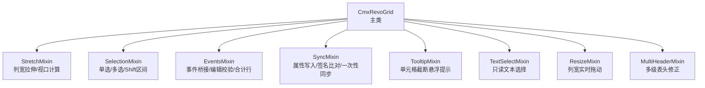
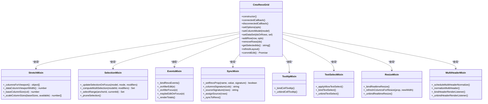
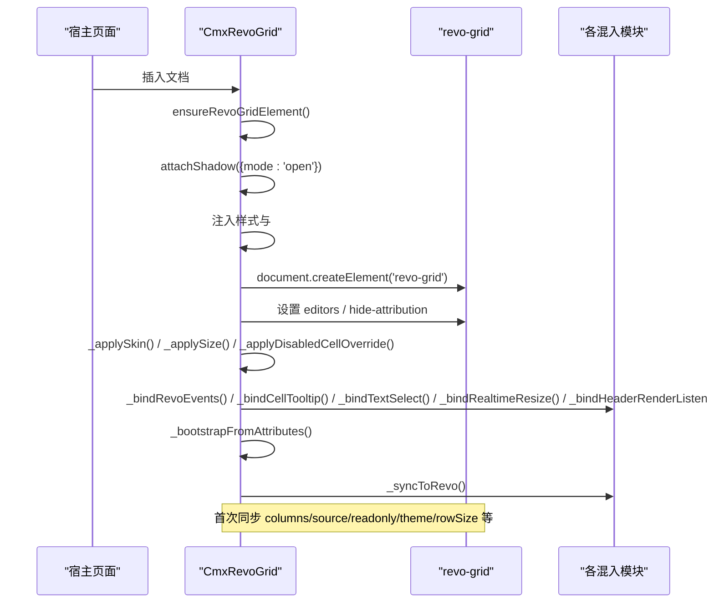
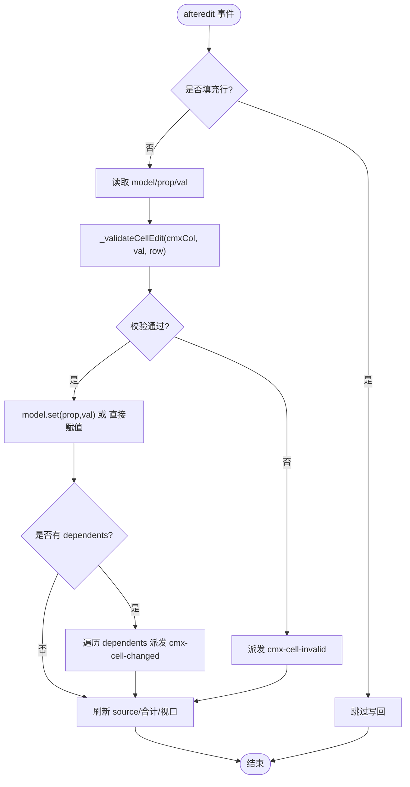
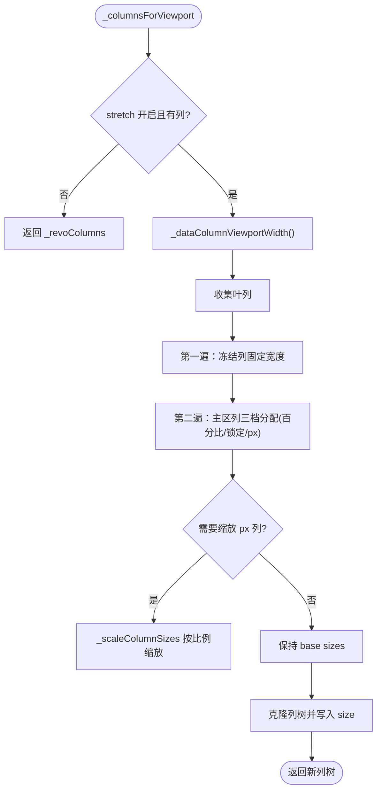

# 核心架构与生命周期

<cite>
**本文引用的文件**
- [cmx-revo-grid.js](file://packages/cmx-data-comp/src/components/cmx-revo-grid.js)
- [revo-grid-stretch-mixin.js](file://packages/cmx-data-comp/src/components/revo-grid/revo-grid-stretch-mixin.js)
- [revo-grid-selection-mixin.js](file://packages/cmx-data-comp/src/components/revo-grid/revo-grid-selection-mixin.js)
- [revo-grid-events-mixin.js](file://packages/cmx-data-comp/src/components/revo-grid/revo-grid-events-mixin.js)
- [revo-grid-sync-mixin.js](file://packages/cmx-data-comp/src/components/revo-grid/revo-grid-sync-mixin.js)
- [revo-grid-tooltip-mixin.js](file://packages/cmx-data-comp/src/components/revo-grid/revo-grid-tooltip-mixin.js)
- [revo-grid-text-select-mixin.js](file://packages/cmx-data-comp/src/components/revo-grid/revo-grid-text-select-mixin.js)
- [revo-grid-resize-mixin.js](file://packages/cmx-data-comp/src/components/revo-grid/revo-grid-resize-mixin.js)
- [revo-grid-multi-header-mixin.js](file://packages/cmx-data-comp/src/components/revo-grid/revo-grid-multi-header-mixin.js)
</cite>

## 目录
1. [简介](#简介)
2. [项目结构](#项目结构)
3. [核心组件](#核心组件)
4. [架构总览](#架构总览)
5. [详细组件分析](#详细组件分析)
6. [依赖关系分析](#依赖关系分析)
7. [性能考量](#性能考量)
8. [故障排查指南](#故障排查指南)
9. [结论](#结论)
10. [附录](#附录)

## 简介
本文件聚焦 RevoGrid 在 CMX 平台中的封装组件 CmxRevoGrid 的核心架构与生命周期。内容涵盖：
- Shadow DOM 封装机制与 Web Components 生命周期（constructor、connectedCallback、disconnectedCallback）的实现细节
- 组件初始化流程：RevoGrid 元素注册、Shadow DOM 创建、内部 revo-grid 实例挂载、事件绑定与配置应用
- 模块化混入架构：stretch、selection、events、sync、tooltip、text-select、resize、multi-header 的职责划分与协作方式
- 状态管理机制：_rows、_columns、_opts、_selectedId/_selectedIds 等核心状态的维护策略
- 扩展点与自定义集成指南

## 项目结构
CmxRevoGrid 由主类与多个职责单一的混入模块组成，采用“组合式 mixin”模式将功能解耦到独立文件中，最终通过 Object.assign 合并到原型上。

图表来源
- [cmx-revo-grid.js:183-1551](file://packages/cmx-data-comp/src/components/cmx-revo-grid.js#L183-L1551)
- [revo-grid-stretch-mixin.js:1-200](file://packages/cmx-data-comp/src/components/revo-grid/revo-grid-stretch-mixin.js#L1-L200)
- [revo-grid-selection-mixin.js:1-118](file://packages/cmx-data-comp/src/components/revo-grid/revo-grid-selection-mixin.js#L1-L118)
- [revo-grid-events-mixin.js:1-433](file://packages/cmx-data-comp/src/components/revo-grid/revo-grid-events-mixin.js#L1-L433)
- [revo-grid-sync-mixin.js:1-199](file://packages/cmx-data-comp/src/components/revo-grid/revo-grid-sync-mixin.js#L1-L199)
- [revo-grid-tooltip-mixin.js:1-168](file://packages/cmx-data-comp/src/components/revo-grid/revo-grid-tooltip-mixin.js#L1-L168)
- [revo-grid-text-select-mixin.js:1-83](file://packages/cmx-data-comp/src/components/revo-grid/revo-grid-text-select-mixin.js#L1-L83)
- [revo-grid-resize-mixin.js:1-150](file://packages/cmx-data-comp/src/components/revo-grid/revo-grid-resize-mixin.js#L1-L150)
- [revo-grid-multi-header-mixin.js:1-143](file://packages/cmx-data-comp/src/components/revo-grid/revo-grid-multi-header-mixin.js#L1-L143)

章节来源
- [cmx-revo-grid.js:1-1551](file://packages/cmx-data-comp/src/components/cmx-revo-grid.js#L1-L1551)

## 核心组件
CmxRevoGrid 是对外暴露的 Web Component，标签名为 cmx-revo-grid。其职责包括：
- 管理自身 Shadow DOM 与内部 revo-grid 实例的生命周期
- 提供 setOptions、setColumnModel、setDataSet、addRow、removeRows、getSelectedIds 等 API
- 协调各混入模块完成列宽拉伸、选中态、事件桥接、属性同步、悬浮提示、文本选择、列宽拖动、多级表头修正
- 处理皮肤、主题、语言切换、尺寸自适应等运行时行为

关键实现要点：
- constructor 中初始化所有内部状态（_rows、_columns、_opts、_selectedId/_selectedIds 等）
- connectedCallback 中懒创建 Shadow DOM、注册 revo-grid 元素、挂载内部实例、绑定事件并应用初始配置
- disconnectedCallback 中释放 ResizeObserver、解绑事件、清理引用，避免内存泄漏

章节来源
- [cmx-revo-grid.js:183-349](file://packages/cmx-data-comp/src/components/cmx-revo-grid.js#L183-L349)

## 架构总览
下图展示了 CmxRevoGrid 与其混入模块之间的职责分工与协作关系，以及它们如何共同驱动内部 revo-grid 的行为。

图表来源
- [cmx-revo-grid.js:183-1551](file://packages/cmx-data-comp/src/components/cmx-revo-grid.js#L183-L1551)
- [revo-grid-stretch-mixin.js:1-200](file://packages/cmx-data-comp/src/components/revo-grid/revo-grid-stretch-mixin.js#L1-L200)
- [revo-grid-selection-mixin.js:1-118](file://packages/cmx-data-comp/src/components/revo-grid/revo-grid-selection-mixin.js#L1-L118)
- [revo-grid-events-mixin.js:1-433](file://packages/cmx-data-comp/src/components/revo-grid/revo-grid-events-mixin.js#L1-L433)
- [revo-grid-sync-mixin.js:1-199](file://packages/cmx-data-comp/src/components/revo-grid/revo-grid-sync-mixin.js#L1-L199)
- [revo-grid-tooltip-mixin.js:1-168](file://packages/cmx-data-comp/src/components/revo-grid/revo-grid-tooltip-mixin.js#L1-L168)
- [revo-grid-text-select-mixin.js:1-83](file://packages/cmx-data-comp/src/components/revo-grid/revo-grid-text-select-mixin.js#L1-L83)
- [revo-grid-resize-mixin.js:1-150](file://packages/cmx-data-comp/src/components/revo-grid/revo-grid-resize-mixin.js#L1-L150)
- [revo-grid-multi-header-mixin.js:1-143](file://packages/cmx-data-comp/src/components/revo-grid/revo-grid-multi-header-mixin.js#L1-L143)

## 详细组件分析

### Shadow DOM 与 Web Components 生命周期
- constructor：初始化内部状态（_rows、_columns、_opts、_selectedId/_selectedIds、_revoColumns、_userColSizes、_hostResizeRo、_displaySourceCache 等），不创建 DOM
- connectedCallback：
  - 确保 <revo-grid> 已注册（首次调用 defineCustomElements）
  - 创建 open 模式的 Shadow DOM，注入样式与宿主容器
  - 创建内部 revo-grid 实例，设置 className、隐藏归属信息、注入编辑器注册表
  - 应用皮肤、尺寸、禁用覆盖、事件绑定、文本选择、实时列宽拖动、表头渲染监听
  - 解析 data-cmx-* 声明式属性，执行 _bootstrapFromAttributes
  - 首次同步列、数据、选项到 revo-grid（_syncToRevo）
  - 自动主题与语言切换监听
- disconnectedCallback：
  - 停止 ResizeObserver、解绑 DataSet 事件、窗口主题/语言事件
  - 解绑 revo-grid 事件、host pointerdown、表头渲染监听、tooltip、文本选择、实时列宽拖动
  - 清空 _revo 引用，防止内存泄漏

章节来源
- [cmx-revo-grid.js:183-349](file://packages/cmx-data-comp/src/components/cmx-revo-grid.js#L183-L349)

### 初始化流程时序

图表来源
- [cmx-revo-grid.js:247-312](file://packages/cmx-data-comp/src/components/cmx-revo-grid.js#L247-L312)
- [revo-grid-sync-mixin.js:112-196](file://packages/cmx-data-comp/src/components/revo-grid/revo-grid-sync-mixin.js#L112-L196)

### 模块化混入架构与协作
- stretch 混入：负责列宽按比例拉伸、冻结列扣除、百分比列固定、用户锁定列保留、缩放分配算法；提供 _columnsForViewport、_dataColumnViewportWidth、_baseColumnSize、_scaleColumnSizes
- selection 混入：维护 _selectedId/_selectedIds/_selectionAnchorId，支持单选、多选、Ctrl 反选、Shift 区间选择；与 DataSet 游标联动
- events 混入：桥接 revo-grid 原生事件为 cmx-* 自定义事件；编辑后写回模型、触发 dependents、校验 required/validate；渲染合计行（pinnedBottomSource）
- sync 混入：统一属性写入（带签名比对避免无谓重渲）、一次性同步列/数据/选项、计算列树签名与数据源签名
- tooltip 混入：基于事件委托的单元格截断悬浮提示，延迟显示、跟随鼠标、离开隐藏
- text-select 混入：允许只读单元格文本拖选与复制子串，拦截 copy 事件
- resize 混入：接管列宽拖动，实现“按住即变”的实时列宽调整，rAF 节流，更新 _userColSizes 与列 size
- multi-header 混入：修复多级表头渲染缺陷，计算分组深度与孤立叶行数，通过 CSS 变量与 data 属性驱动纵向合并

协作方式：
- 主类在各生命周期与方法中按序调用混入方法，如 _syncToRevo 会依次调用 _applyRequiredMarks、_columnsForViewport、_renderTotals、_scheduleMultiHeaderNormalize
- 混入之间通过 this 访问共享状态（_revo、_revoColumns、_opts、_userColSizes 等），避免静态耦合
- 事件流：revo-grid 事件 → events 混入 → 业务事件（cmx-cell-changed、cmx-row-selected、cmx-row-selection-change）→ 上层逻辑

章节来源
- [revo-grid-stretch-mixin.js:1-200](file://packages/cmx-data-comp/src/components/revo-grid/revo-grid-stretch-mixin.js#L1-L200)
- [revo-grid-selection-mixin.js:1-118](file://packages/cmx-data-comp/src/components/revo-grid/revo-grid-selection-mixin.js#L1-L118)
- [revo-grid-events-mixin.js:1-433](file://packages/cmx-data-comp/src/components/revo-grid/revo-grid-events-mixin.js#L1-L433)
- [revo-grid-sync-mixin.js:1-199](file://packages/cmx-data-comp/src/components/revo-grid/revo-grid-sync-mixin.js#L1-L199)
- [revo-grid-tooltip-mixin.js:1-168](file://packages/cmx-data-comp/src/components/revo-grid/revo-grid-tooltip-mixin.js#L1-L168)
- [revo-grid-text-select-mixin.js:1-83](file://packages/cmx-data-comp/src/components/revo-grid/revo-grid-text-select-mixin.js#L1-L83)
- [revo-grid-resize-mixin.js:1-150](file://packages/cmx-data-comp/src/components/revo-grid/revo-grid-resize-mixin.js#L1-L150)
- [revo-grid-multi-header-mixin.js:1-143](file://packages/cmx-data-comp/src/components/revo-grid/revo-grid-multi-header-mixin.js#L1-L143)

### 组件状态管理机制
- _rows：当前数据行数组（或指向 CmxDataSet.rows 引用），用于渲染与聚合计算
- _columns：扁平化后的列定义（来自 CmxColumnModel），用于必填标识、数值列汇总等
- _revoColumns：转换后的 RevoGrid 列树（含分组 children），参与视口宽度计算与渲染
- _opts：运行时选项（选择模式、布局、编辑、显示、其他），通过 setOptions 增量合并
- _selectedId/_selectedIds：单选/多选选中态，受 selectionMode 控制；与 DataSet 游标联动
- _userColSizes：记录用户手动拖动过的列宽，参与 stretch 再分配时作为“锁定值”排除
- _displaySourceCache：缓存 display source（真实行 + minRows 占位行），减少重复构建开销
- _sourceRevision：数据源版本号，纳入签名以强制刷新

维护策略：
- 数据变更：setDataSet/_setData/_refreshSource 统一更新 _rows、修剪选中、重新赋值 source、渲染合计
- 选中态：selection 混入根据点击修饰键计算新集合，同步 rowClass 并通过 refresh('all') 刷新高亮
- 列定义：setColumnModel 转换模型、订阅 columns-changed、清除用户列宽、派发 cmx-columns-changed
- 选项变更：setOptions 合并 _opts，必要时触发 _applySize、_syncToRevo、_applyAltRowClass、_applyAllowTextSelect

章节来源
- [cmx-revo-grid.js:183-241](file://packages/cmx-data-comp/src/components/cmx-revo-grid.js#L183-L241)
- [cmx-revo-grid.js:734-832](file://packages/cmx-data-comp/src/components/cmx-revo-grid.js#L734-L832)
- [cmx-revo-grid.js:834-892](file://packages/cmx-data-comp/src/components/cmx-revo-grid.js#L834-L892)
- [cmx-revo-grid.js:1099-1129](file://packages/cmx-data-comp/src/components/cmx-revo-grid.js#L1099-L1129)

### 关键流程图：编辑后写回与校验

图表来源
- [revo-grid-events-mixin.js:111-172](file://packages/cmx-data-comp/src/components/revo-grid/revo-grid-events-mixin.js#L111-L172)
- [revo-grid-events-mixin.js:306-343](file://packages/cmx-data-comp/src/components/revo-grid/revo-grid-events-mixin.js#L306-L343)

### 关键流程图：列宽拉伸与视口计算

图表来源
- [revo-grid-stretch-mixin.js:17-113](file://packages/cmx-data-comp/src/components/revo-grid/revo-grid-stretch-mixin.js#L17-L113)
- [revo-grid-stretch-mixin.js:129-176](file://packages/cmx-data-comp/src/components/revo-grid/revo-grid-stretch-mixin.js#L129-L176)
- [revo-grid-stretch-mixin.js:184-198](file://packages/cmx-data-comp/src/components/revo-grid/revo-grid-stretch-mixin.js#L184-L198)

### 公开 API 与扩展点
- 列定义：仅通过 setColumnModel(model) 或 data-cmx-model-id（由 init-page-models 注入）
- 数据绑定：setDataSet(dsOrRows, sel) 支持 CmxDataSet 或纯数组；内部维护 _ds 与 _rows 引用
- 行操作：addRow(row, opts)、removeRows(ids)，派发 cmx-row-added/cmx-row-removed
- 选中查询：getSelectedIds() 返回字符串 id 列表
- 编辑提交：commitEdit() 合成 Enter 事件走 revo-grid 原生 save 链路
- 外观与行为：setOptions(opts) 可覆盖选择/布局/编辑/显示/其他选项；setEditable(flag) 快捷开关
- 字典回显：enableDictEcho(ctx, host) 预加载字典并挂 resolver，失败降级显示原始 id
- 协调器集成：_setDataSourceProvider(fn)、_notifyDataSourcesChanged() 供主从协调器注入数据源解析函数

章节来源
- [cmx-revo-grid.js:461-592](file://packages/cmx-data-comp/src/components/cmx-revo-grid.js#L461-L592)
- [cmx-revo-grid.js:628-705](file://packages/cmx-data-comp/src/components/cmx-revo-grid.js#L628-L705)
- [cmx-revo-grid.js:756-832](file://packages/cmx-data-comp/src/components/cmx-revo-grid.js#L756-L832)
- [cmx-revo-grid.js:901-974](file://packages/cmx-data-comp/src/components/cmx-revo-grid.js#L901-L974)
- [cmx-revo-grid.js:984-997](file://packages/cmx-data-comp/src/components/cmx-revo-grid.js#L984-L997)

## 依赖关系分析
- 外部依赖：@revolist/revogrid/loader（动态注册 RevoGrid 全家桶）
- 内部依赖：
  - CmxColumnAdapter：将 CmxColumnModel 转换为 RevoGrid 列树
  - cmx-form-field-registry：注册 grid.editor 与 cellTemplate，叠加到列定义
  - cmx-theme-detect：检测暗色模式，解析 theme='auto'
  - cmx-skin-runtime：注入 Neo 皮肤与页面级样式
  - cmx-dict-cache：字典外键回显缓存与 resolver
  - cmx-toast：字典装载失败提示
- 混入间依赖：通过 this 访问共享状态，无直接 import 耦合，便于替换与测试

潜在循环依赖：无（mixin 之间通过原型方法间接协作）

章节来源
- [cmx-revo-grid.js:27-43](file://packages/cmx-data-comp/src/components/cmx-revo-grid.js#L27-L43)
- [revo-grid-sync-mixin.js:9-28](file://packages/cmx-data-comp/src/components/revo-grid/revo-grid-sync-mixin.js#L9-L28)

## 性能考量
- 虚拟滚动：默认启用 virtualScroll，大数据量必须开启
- 签名比对：_setRevoProp 对基础类型与空数组进行同值跳过，减少 Stencil 不必要的 prop diff/render
- 数据源签名：_sourceSignature 仅包含版本号、行数、minRows、显示行数，避免 O(N) 拼接与 GC 压力
- 显示源缓存：_displaySourceCache 复用 rows 引用 + minRows + length 不变时的结果，避免重复构建
- rAF 节流：实时列宽拖动、stretch 刷新、合计列刷新均使用 requestAnimationFrame 合并多次更新
- 可见性判断：_isLayoutVisible 避免隐藏容器内的无效 refresh
- 合计行单遍历：一次遍历多聚合，降低 K×N 复杂度

[本节为通用性能建议，无需特定文件引用]

## 故障排查指南
- 编辑器未关闭：检查空白区点击逻辑（_maybeCloseEditOnBlankClick），确认目标不在 rgCell/edit-input-wrapper/表头内
- 多选高亮残留：确保 _syncSelection 使用 refresh('all') 而非 'data'，避免 updateSource/diff 路径遗漏
- 列宽异常：检查 _userColSizes 是否正确记录用户拖动值；确认 _columnsForViewport 的冻结列扣除与百分比列固定逻辑
- 字典回显失败：查看 enableDictEcho 的 loadDicts 异常与 failedDicts 提示；resolver 未命中时降级显示原始 id
- 主题闪烁：theme='auto' 在 connectedCallback 延一帧应用，避免与 adoptedStyleSheets 时序冲突
- 文本选择失效：确认 allowTextSelect 选项与 _applyAllowTextSelect 正确切换 class；copy 事件 capture 阶段拦截生效

章节来源
- [revo-grid-events-mixin.js:235-262](file://packages/cmx-data-comp/src/components/revo-grid/revo-grid-events-mixin.js#L235-L262)
- [cmx-revo-grid.js:834-858](file://packages/cmx-data-comp/src/components/cmx-revo-grid.js#L834-L858)
- [revo-grid-events-mixin.js:61-78](file://packages/cmx-data-comp/src/components/revo-grid/revo-grid-events-mixin.js#L61-L78)
- [cmx-revo-grid.js:525-563](file://packages/cmx-data-comp/src/components/cmx-revo-grid.js#L525-L563)
- [cmx-revo-grid.js:281-301](file://packages/cmx-data-comp/src/components/cmx-revo-grid.js#L281-L301)
- [revo-grid-text-select-mixin.js:31-72](file://packages/cmx-data-comp/src/components/revo-grid/revo-grid-text-select-mixin.js#L31-L72)

## 结论
CmxRevoGrid 通过清晰的模块化混入架构，将复杂的数据表格能力拆分为职责单一、可测试、可替换的功能单元。其生命周期管理严谨，状态维护策略高效，结合签名比对、rAF 节流与缓存机制，在保证交互体验的同时兼顾性能。对外提供简洁稳定的 API，便于在 CMX 平台中集成与扩展。

[本节为总结性内容，无需特定文件引用]

## 附录
- 常用事件：
  - cmx-row-selected：单选行变化
  - cmx-row-selection-change：多选行变化
  - cmx-cell-changed：单元格编辑完成
  - cmx-row-added / cmx-row-removed：行增删
  - cmx-cell-link-click：链接/动作单元格点击
  - cmx-columns-changed：列定义整体替换
- 常用属性：
  - data-cmx-options：JSON 字符串，运行时选项
  - data-cmx-rows：JSON 字符串，初始数据行
  - data-cmx-fill-height：布尔快捷开关，撑满父高度
  - data-cmx-skin / data-cmx-skin-tone：皮肤与强调色
  - data-cmx-style-id：页面级样式注入 ID
  - data-cmx-embed：嵌入模式（弹层内默认不套 Neo）

[本节为概念性说明，无需特定文件引用]