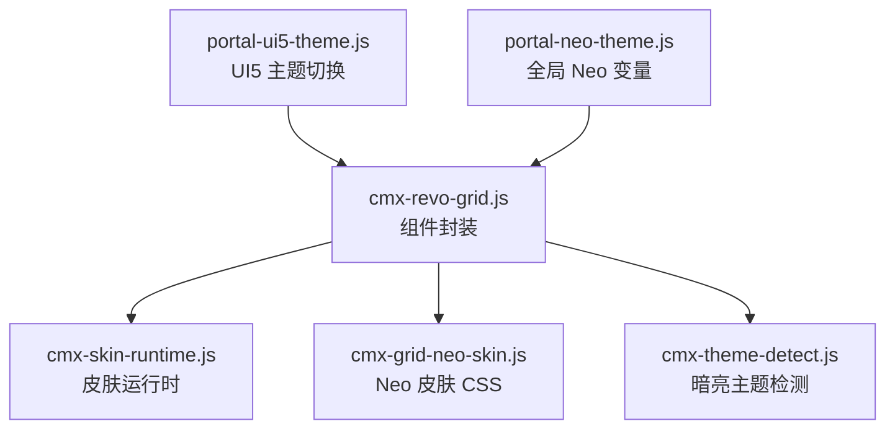
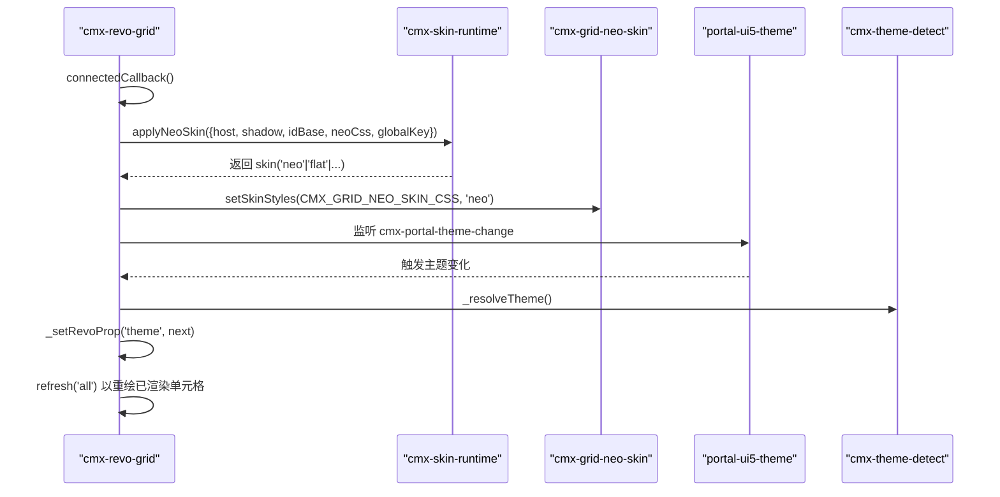
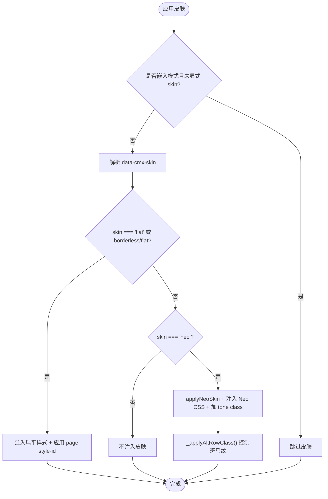
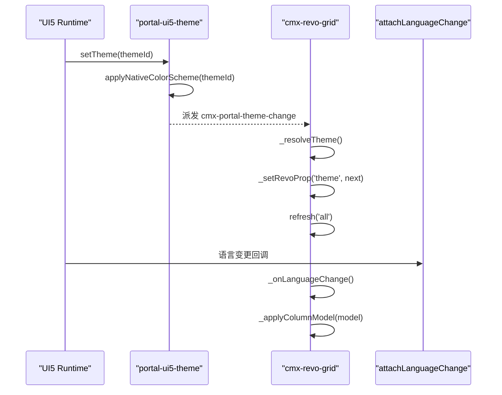
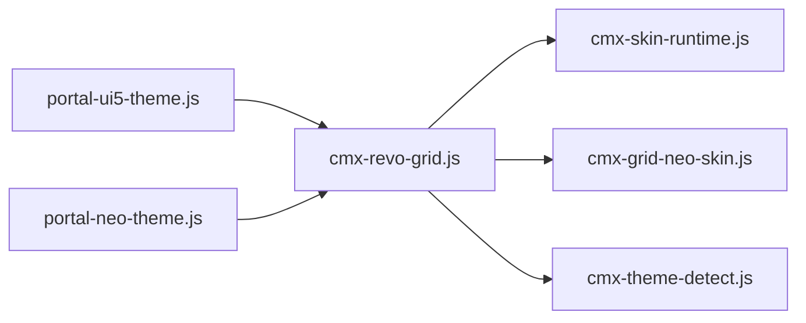

# 皮肤系统与主题定制

<cite>
**本文引用的文件**
- [cmx-revo-grid.js](file://packages/cmx-data-comp/src/components/cmx-revo-grid.js)
- [cmx-skin-runtime.js](file://packages/cmx-data-comp/src/lib/cmx-skin-runtime.js)
- [cmx-grid-neo-skin.js](file://packages/cmx-data-comp/src/lib/cmx-grid-neo-skin.js)
- [cmx-theme-detect.js](file://packages/cmx-data-comp/src/lib/cmx-theme-detect.js)
- [portal-ui5-theme.js](file://CMXPortalManager/src/lib/portal-ui5-theme.js)
- [portal-neo-theme.js](file://CMXPortalManager/src/lib/portal-neo-theme.js)
- [page-style-guide.md](file://.agents/skills/cmx-components-guide/references/page-style-guide.md)
</cite>

## 目录
1. [简介](#简介)
2. [项目结构](#项目结构)
3. [核心组件](#核心组件)
4. [架构总览](#架构总览)
5. [详细组件分析](#详细组件分析)
6. [依赖关系分析](#依赖关系分析)
7. [性能考虑](#性能考虑)
8. [故障排除指南](#故障排除指南)
9. [结论](#结论)
10. [附录：配置示例与最佳实践](#附录：配置示例与最佳实践)

## 简介
本文件系统性说明 RevoGrid 在 CMX 平台中的皮肤系统与主题定制能力，覆盖以下要点：
- 支持的主题类型：Neo、Plain、Flat 的特点与适用场景
- 皮肤配置属性：data-cmx-skin、data-cmx-skin-tone、data-cmx-style-id 的作用与优先级
- Neo 皮肤的实现机制：CSS 注入、色调类名管理、隔行换色控制
- 主题切换的动态处理：自动主题检测、UI5 主题集成、语言变更时的列头多语言处理
- 自定义皮肤开发指南、样式覆盖技巧与性能注意事项
- 常见问题的排查方法

## 项目结构
RevoGrid 的皮肤系统由“运行时皮肤引擎 + 组件封装 + 主题工具”三部分构成：
- 运行时皮肤引擎：负责解析 skin、注入 CSS、管理激活 class 与页面级覆盖
- 组件封装：cmx-revo-grid 基于 RevoGrid 的 Web Component，统一应用皮肤、尺寸、编辑、事件等
- 主题工具：暗亮主题检测、UI5 主题持久化与切换、全局 Neo 变量注入

图表来源
- [cmx-revo-grid.js:247-312](file://packages/cmx-data-comp/src/components/cmx-revo-grid.js#L247-L312)
- [cmx-skin-runtime.js:31-130](file://packages/cmx-data-comp/src/lib/cmx-skin-runtime.js#L31-L130)
- [cmx-grid-neo-skin.js:1-178](file://packages/cmx-data-comp/src/lib/cmx-grid-neo-skin.js#L1-L178)
- [cmx-theme-detect.js:1-31](file://packages/cmx-data-comp/src/lib/cmx-theme-detect.js#L1-L31)
- [portal-ui5-theme.js:40-73](file://CMXPortalManager/src/lib/portal-ui5-theme.js#L40-L73)
- [portal-neo-theme.js:627-636](file://CMXPortalManager/src/lib/portal-neo-theme.js#L627-L636)

章节来源
- [cmx-revo-grid.js:1-800](file://packages/cmx-data-comp/src/components/cmx-revo-grid.js#L1-L800)
- [cmx-skin-runtime.js:1-131](file://packages/cmx-data-comp/src/lib/cmx-skin-runtime.js#L1-L131)
- [cmx-grid-neo-skin.js:1-178](file://packages/cmx-data-comp/src/lib/cmx-grid-neo-skin.js#L1-L178)
- [cmx-theme-detect.js:1-31](file://packages/cmx-data-comp/src/lib/cmx-theme-detect.js#L1-L31)
- [portal-ui5-theme.js:1-73](file://CMXPortalManager/src/lib/portal-ui5-theme.js#L1-L73)
- [portal-neo-theme.js:1-636](file://CMXPortalManager/src/lib/portal-neo-theme.js#L1-L636)

## 核心组件
- cmx-revo-grid：基于 RevoGrid 的表格组件，统一处理皮肤、选项、数据绑定、事件、布局刷新等。默认皮肤为 Neo，可通过 data-cmx-skin 切换；支持 data-cmx-skin-tone 设置强调色；支持 data-cmx-style-id 注入页面级覆盖样式。
- cmx-skin-runtime：提供 resolveSkin、applyNeoSkin、setSkinStyle、applyPageStyleId 等通用能力，按 layer（neo < page < custom）顺序注入并保证覆盖优先级。
- cmx-grid-neo-skin：Neo 皮肤 CSS 常量，包含表头渐变、选中高亮、斑马纹、页脚渐变等，通过宿主 class 和 revo-grid theme 选择器组合生效。
- cmx-theme-detect：检测当前是否为暗色主题，优先读取 UI5 背景色计算亮度，回退到 prefers-color-scheme。
- portal-ui5-theme：门户 UI5 主题列表、持久化、切换与 color-scheme 同步，触发 cmx-portal-theme-change 事件供组件响应。
- portal-neo-theme：全局 Neo 变量与滚动条等样式片段，初始化 document 根节点变量，供 Shadow DOM 继承。

章节来源
- [cmx-revo-grid.js:183-457](file://packages/cmx-data-comp/src/components/cmx-revo-grid.js#L183-L457)
- [cmx-skin-runtime.js:14-130](file://packages/cmx-data-comp/src/lib/cmx-skin-runtime.js#L14-L130)
- [cmx-grid-neo-skin.js:1-178](file://packages/cmx-data-comp/src/lib/cmx-grid-neo-skin.js#L1-L178)
- [cmx-theme-detect.js:1-31](file://packages/cmx-data-comp/src/lib/cmx-theme-detect.js#L1-L31)
- [portal-ui5-theme.js:1-73](file://CMXPortalManager/src/lib/portal-ui5-theme.js#L1-L73)
- [portal-neo-theme.js:627-636](file://CMXPortalManager/src/lib/portal-neo-theme.js#L627-L636)

## 架构总览
皮肤系统采用“运行时注入 + 宿主 class 控制 + 页面级覆盖”的分层策略：
- 运行时解析 skin，决定注入哪一层 CSS（neo/page/custom），并通过 idBase 命名空间隔离
- 组件在 connectedCallback 中完成 Shadow DOM 创建、revo-grid 实例挂载、皮肤应用、主题监听、语言监听
- UI5 主题切换时，组件通过 cmx-portal-theme-change 事件重算并刷新主题，确保虚拟滚动下的渲染一致性
- 语言切换时，组件重新应用列模型以按新语言解析 caption，保持列头多语言显示正确

图表来源
- [cmx-revo-grid.js:247-312](file://packages/cmx-data-comp/src/components/cmx-revo-grid.js#L247-L312)
- [cmx-skin-runtime.js:91-109](file://packages/cmx-data-comp/src/lib/cmx-skin-runtime.js#L91-L109)
- [cmx-grid-neo-skin.js:1-178](file://packages/cmx-data-comp/src/lib/cmx-grid-neo-skin.js#L1-L178)
- [portal-ui5-theme.js:40-53](file://CMXPortalManager/src/lib/portal-ui5-theme.js#L40-L53)
- [cmx-theme-detect.js:10-30](file://packages/cmx-data-comp/src/lib/cmx-theme-detect.js#L10-L30)

## 详细组件分析

### 主题类型与使用场景
- Neo：科技感玻璃质感、渐变表头、选中高亮、斑马纹可选；适合现代企业后台、数据密集场景
- Plain/default：经典表格外观，无 Neo 装饰；适合传统风格或需要极简的场景
- Flat：无边框扁平样式，塌缩 padding；适合嵌入弹窗、卡片内嵌表格等紧凑场景

skin 取值与行为：
- data-cmx-skin="neo"：启用 Neo 皮肤，并可配合 data-cmx-skin-tone 设置强调色
- data-cmx-skin="plain"/"default"：不注入皮肤，沿用 revo-grid 原生外观
- data-cmx-skin="none"/"flat"：关闭所有自定义皮肤；grid 专属 flat 还会追加 cmx-grid-flat 并注入扁平样式
- 未显式设置时，默认 fallback 为 neo（可通过全局 __cmxDefaultGridSkin 覆盖）

章节来源
- [cmx-revo-grid.js:361-396](file://packages/cmx-data-comp/src/components/cmx-revo-grid.js#L361-L396)
- [page-style-guide.md:186-224](file://.agents/skills/cmx-components-guide/references/page-style-guide.md#L186-L224)

### 皮肤配置属性
- data-cmx-skin：指定皮肤类型（neo/plain/default/none/flat）
- data-cmx-skin-tone：仅对 neo 生效，设置强调色别名（cyan/mint/violet/azure）
- data-cmx-style-id：指向同页 <template> 或 <style> 节点，作为页面级覆盖注入（layer='page'），优先级低于内置 neo 皮肤但高于 custom
- data-cmx-embed：嵌入模式（如 combo/dict 弹层），未显式指定 skin 时跳过套 Neo，避免弹层强套皮肤
- data-cmx-borderless / data-cmx-flat：等价于 flat 行为，直接注入扁平样式
- data-neo-grid-tone / data-neo-grid-lane：旧版逃生舱口，命中则跳过全局默认皮肤逻辑，交由页面自行接管

章节来源
- [cmx-revo-grid.js:361-396](file://packages/cmx-data-comp/src/components/cmx-revo-grid.js#L361-L396)
- [cmx-skin-runtime.js:111-130](file://packages/cmx-data-comp/src/lib/cmx-skin-runtime.js#L111-L130)
- [page-style-guide.md:186-224](file://.agents/skills/cmx-components-guide/references/page-style-guide.md#L186-L224)

### Neo 皮肤实现机制
- CSS 注入：通过 setSkinStyle(shadowRoot, 'cmx-grid', cssText, 'neo') 将 Neo 皮肤 CSS 注入 ShadowRoot 的指定 id 节点，幂等且可替换
- 色调类名管理：applyNeoSkin 根据 data-cmx-skin-tone 生成变体 class（如 cmx-grid-neo--mint），并在宿主上添加 activeClass（cmx-grid-neo）与 toneClass
- 隔行换色控制：_applyAltRowClass 根据 alternateRowColor 选项在宿主增删 .cmx-grid-alt-rows；Neo 皮肤中偶数行背景规则仅在同时具备 .cmx-grid-neo 与 .cmx-grid-alt-rows 时生效
- 禁用编辑单元格背景覆盖：_applyDisabledCellOverride 在 revo-grid 的 shadowRoot（或降级到 cmx-revo-grid 的 shadowRoot）注入样式，覆盖 .rgCell.disabled 的背景色

图表来源
- [cmx-revo-grid.js:361-457](file://packages/cmx-data-comp/src/components/cmx-revo-grid.js#L361-L457)
- [cmx-skin-runtime.js:91-109](file://packages/cmx-data-comp/src/lib/cmx-skin-runtime.js#L91-L109)
- [cmx-grid-neo-skin.js:138-148](file://packages/cmx-data-comp/src/lib/cmx-grid-neo-skin.js#L138-L148)

章节来源
- [cmx-revo-grid.js:351-457](file://packages/cmx-data-comp/src/components/cmx-revo-grid.js#L351-L457)
- [cmx-skin-runtime.js:31-109](file://packages/cmx-data-comp/src/lib/cmx-skin-runtime.js#L31-L109)
- [cmx-grid-neo-skin.js:1-178](file://packages/cmx-data-comp/src/lib/cmx-grid-neo-skin.js#L1-L178)

### 主题切换与 UI5 集成
- 自动主题检测：connectedCallback 中若 theme 为 auto，则在下一帧调用 _resolveTheme() 并设置到 revo-grid；监听 cmx-portal-theme-change 事件，主题变化时更新 theme 并刷新视图
- UI5 主题切换：portal-ui5-theme.js 提供 applyPortalUi5Theme，设置 UI5 主题、持久化、color-scheme，并派发 cmx-portal-theme-change
- 语言变更的多语言处理：组件订阅 attachLanguageChange，语言变化时重新应用列模型以按新语言解析 caption，确保列头多语言文本正确显示

图表来源
- [cmx-revo-grid.js:281-312](file://packages/cmx-data-comp/src/components/cmx-revo-grid.js#L281-L312)
- [portal-ui5-theme.js:40-53](file://CMXPortalManager/src/lib/portal-ui5-theme.js#L40-L53)

章节来源
- [cmx-revo-grid.js:281-312](file://packages/cmx-data-comp/src/components/cmx-revo-grid.js#L281-L312)
- [portal-ui5-theme.js:40-73](file://CMXPortalManager/src/lib/portal-ui5-theme.js#L40-L73)

### 自定义皮肤开发指南
- 使用 data-cmx-style-id：在同页定义 <template id="..."> 或 <style id="...">，写入覆盖样式，组件会将其作为 page 层注入，优先级低于内置 neo 但高于 custom
- 使用 setSkinStyles：通过组件 API 注入 custom 层样式，适用于动态生成的样式或运行时条件样式
- 遵循 layer 顺序：base < neo < page < custom，后注入的样式覆盖前者，注意特异性与 !important 的使用
- 色调扩展：如需新增 tone，可在 Neo 皮肤基础上通过 page 层覆盖 CSS 变量（如 --neo-grid-accent）或使用新的变体 class

章节来源
- [cmx-skin-runtime.js:111-130](file://packages/cmx-data-comp/src/lib/cmx-skin-runtime.js#L111-L130)
- [cmx-revo-grid.js:351-359](file://packages/cmx-data-comp/src/components/cmx-revo-grid.js#L351-L359)
- [page-style-guide.md:207-224](file://.agents/skills/cmx-components-guide/references/page-style-guide.md#L207-L224)

## 依赖关系分析
- cmx-revo-grid 依赖 cmx-skin-runtime 进行皮肤解析与注入，依赖 cmx-grid-neo-skin 提供 Neo CSS，依赖 cmx-theme-detect 进行暗亮主题检测
- portal-ui5-theme 提供 UI5 主题切换与事件派发，被 cmx-revo-grid 监听以响应主题变化
- portal-neo-theme 提供全局 Neo 变量，供 Shadow DOM 继承，增强视觉一致性

图表来源
- [cmx-revo-grid.js:27-44](file://packages/cmx-data-comp/src/components/cmx-revo-grid.js#L27-L44)
- [portal-ui5-theme.js:40-53](file://CMXPortalManager/src/lib/portal-ui5-theme.js#L40-L53)
- [portal-neo-theme.js:627-636](file://CMXPortalManager/src/lib/portal-neo-theme.js#L627-L636)

章节来源
- [cmx-revo-grid.js:27-44](file://packages/cmx-data-comp/src/components/cmx-revo-grid.js#L27-L44)
- [portal-ui5-theme.js:40-73](file://CMXPortalManager/src/lib/portal-ui5-theme.js#L40-L73)
- [portal-neo-theme.js:627-636](file://CMXPortalManager/src/lib/portal-neo-theme.js#L627-L636)

## 性能考虑
- 虚拟滚动：RevoGrid 默认开启 virtualScroll，大数据量下必须保持开启以避免渲染卡顿
- 主题切换刷新：主题变化时调用 refresh('all') 以确保虚拟滚动下已渲染单元格重绘，避免颜色不一致
- 样式注入幂等：setSkinStyle 通过 id 复用节点，避免重复创建与内存泄漏
- 隔行换色开关：alternateRowColor=false 时移除 .cmx-grid-alt-rows class，即时关闭斑马纹，无需重新注入 CSS
- 语言变更优化：语言切换时仅重建列模型并重解析 caption，不重建整个表格，降低开销

章节来源
- [cmx-revo-grid.js:137-145](file://packages/cmx-data-comp/src/components/cmx-revo-grid.js#L137-L145)
- [cmx-revo-grid.js:281-301](file://packages/cmx-data-comp/src/components/cmx-revo-grid.js#L281-L301)
- [cmx-skin-runtime.js:31-45](file://packages/cmx-data-comp/src/lib/cmx-skin-runtime.js#L31-L45)

## 故障排除指南
- 问题：Neo 皮肤未生效
  - 检查 data-cmx-skin 是否为 neo，或是否被 embed 模式跳过
  - 确认未设置 data-neo-grid-tone/data-neo-grid-lane 导致逃生舱口命中
  - 查看 ShadowRoot 中是否存在 cmx-grid-skin-neo 节点
- 问题：斑马纹不显示
  - 确认 alternateRowColor=true，且宿主存在 .cmx-grid-alt-rows class
  - 确认 Neo 皮肤已注入且未被 page 层覆盖
- 问题：主题切换后颜色不一致
  - 确认已监听 cmx-portal-theme-change 并调用 refresh('all')
  - 检查 UI5 主题是否正确设置，color-scheme 是否同步
- 问题：语言变更后列头文字未更新
  - 确认 attachLanguageChange 已注册，语言变化时重新应用列模型
- 问题：禁用编辑单元格背景异常
  - 检查 _applyDisabledCellOverride 是否成功注入样式到 revo-grid 的 shadowRoot

章节来源
- [cmx-revo-grid.js:361-457](file://packages/cmx-data-comp/src/components/cmx-revo-grid.js#L361-L457)
- [cmx-revo-grid.js:281-312](file://packages/cmx-data-comp/src/components/cmx-revo-grid.js#L281-L312)
- [cmx-skin-runtime.js:31-45](file://packages/cmx-data-comp/src/lib/cmx-skin-runtime.js#L31-L45)

## 结论
RevoGrid 的皮肤系统在 CMX 平台中提供了灵活、可扩展的主题定制能力。通过统一的运行时皮肤引擎、清晰的层级注入策略以及与 UI5 主题的深度集成，开发者可以便捷地实现 Neo、Plain、Flat 等多种皮肤，并支持动态主题切换与多语言列头展示。结合页面级覆盖与自定义样式注入，既能满足标准化需求，又能保留足够的个性化空间。

## 附录：配置示例与最佳实践
- 基础配置
  - 启用 Neo 皮肤：data-cmx-skin="neo"
  - 设置强调色：data-cmx-skin-tone="cyan" | "violet" | "mint" | "azure"
  - 扁平风格：data-cmx-skin="flat" 或 data-cmx-borderless
  - 经典风格：data-cmx-skin="plain" 或 "default"
- 页面级覆盖
  - 定义 <template id="my-grid-skin"> 或 <style id="my-grid-skin">，写入覆盖样式
  - 在组件上设置 data-cmx-style-id="my-grid-skin"
- 运行时注入
  - 使用 setSkinStyles(cssText, 'custom') 动态注入 custom 层样式
- 最佳实践
  - 优先使用 data-cmx-style-id 进行页面级覆盖，避免全局污染
  - 谨慎使用 !important，尽量通过 specificity 控制样式优先级
  - 主题切换后确保刷新视图，避免虚拟滚动下的渲染不一致
  - 语言变更后重新应用列模型，确保多语言 caption 正确显示

章节来源
- [page-style-guide.md:186-224](file://.agents/skills/cmx-components-guide/references/page-style-style-guide.md#L186-L224)
- [cmx-revo-grid.js:351-359](file://packages/cmx-data-comp/src/components/cmx-revo-grid.js#L351-L359)
- [cmx-skin-runtime.js:111-130](file://packages/cmx-data-comp/src/lib/cmx-skin-runtime.js#L111-L130)