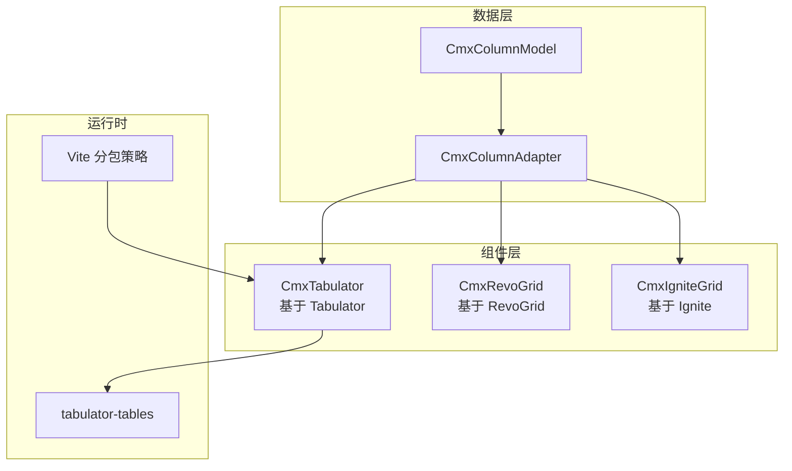
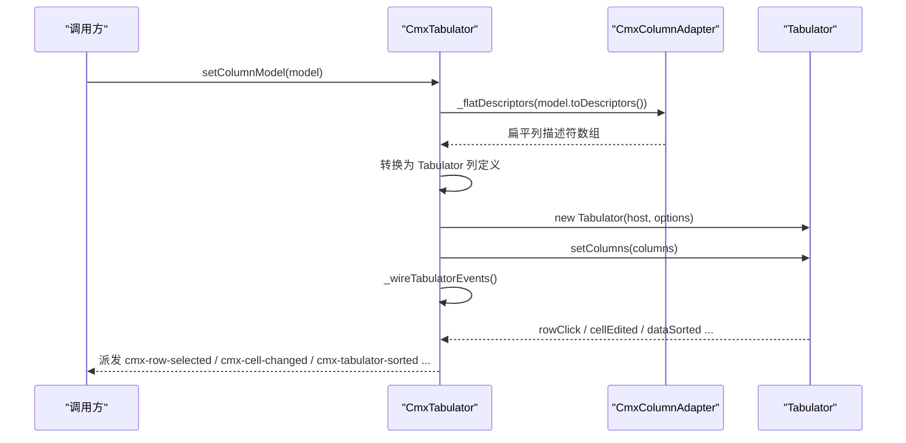
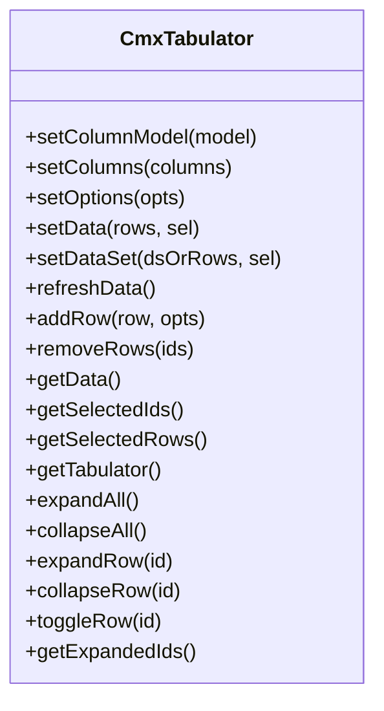
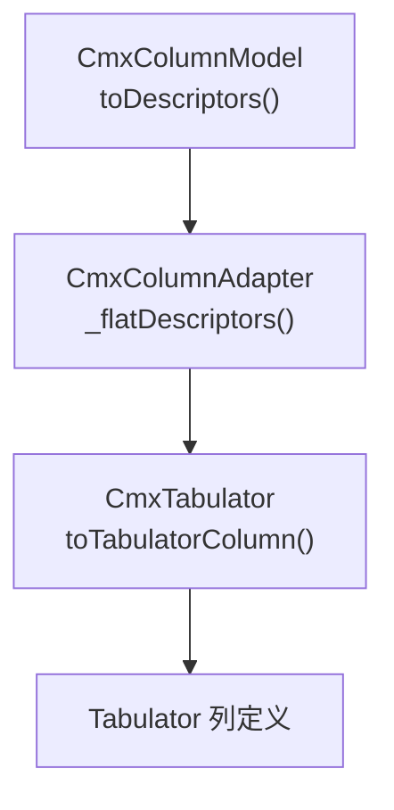
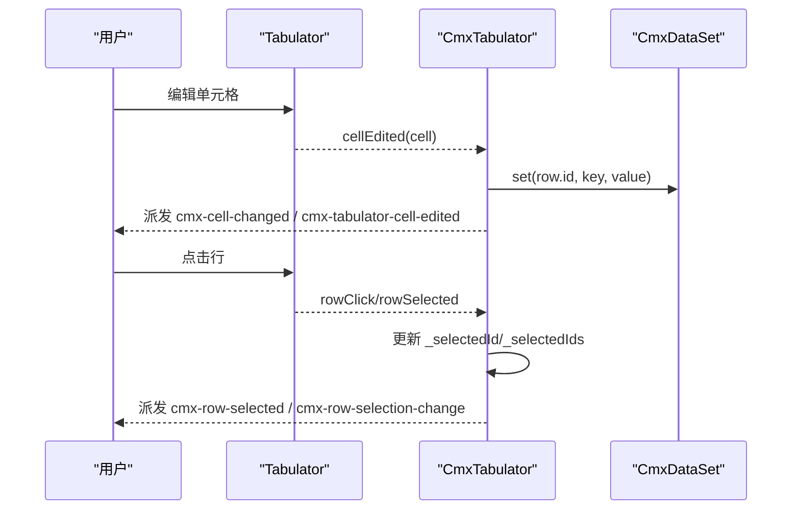
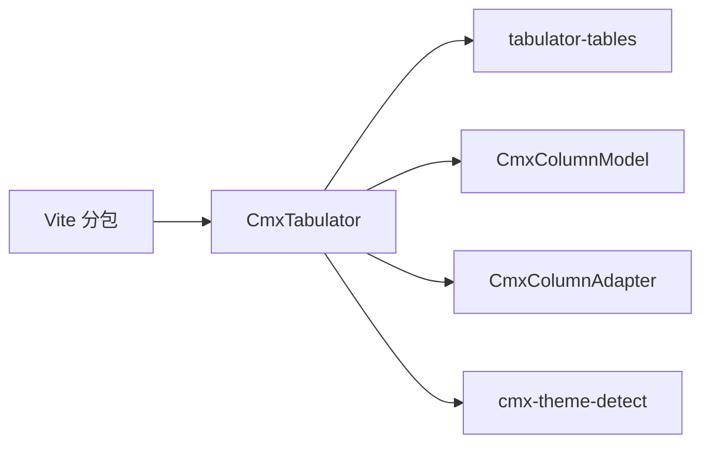

# Tabulator 表格组件

<cite>
**本文引用的文件**
- [cmx-tabulator.js](file://packages/cmx-data-comp/src/components/cmx-tabulator.js)
- [cmx-column-model.js](file://packages/cmx-data-comp/src/lib/cmx-column-model.js)
- [cmx-column-adapter.js](file://packages/cmx-data-comp/src/lib/cmx-column-adapter.js)
- [cmx-revo-grid.js](file://packages/cmx-data-comp/src/components/cmx-revo-grid.js)
- [revo-grid-stretch-mixin.js](file://packages/cmx-data-comp/src/components/revo-grid/revo-grid-stretch-mixin.js)
- [revo-grid-events-mixin.js](file://packages/cmx-data-comp/src/components/revo-grid/revo-grid-events-mixin.js)
- [cmx-ignite-grid.js](file://packages/cmx-data-comp/src/components/ignite/cmx-ignite-grid.js)
- [vite.config.js](file://CMXPortalManager/vite.config.js)
</cite>

## 目录
1. [简介](#简介)
2. [项目结构](#项目结构)
3. [核心组件](#核心组件)
4. [架构总览](#架构总览)
5. [详细组件分析](#详细组件分析)
6. [依赖关系分析](#依赖关系分析)
7. [性能考量](#性能考量)
8. [故障排查指南](#故障排查指南)
9. [结论](#结论)
10. [附录](#附录)

## 简介
本文件为 CmxTabulator 组件的完整技术文档。CmxTabulator 是基于 Tabulator 6.4 封装的 Web Component（<cmx-tabulator>），在 cmx-data-comp 中作为第三种表格视图，与 cmx-ui5-table、cmx-revo-grid 保持相近 API，并支持 CmxColumnModel / CmxDataSet / CmxMasterSlave 绑定。它提供排序、筛选、分页、编辑、选择、列拖拽、树形表格、主题适配等能力，并将底层事件统一转发为 cmx-* CustomEvent，便于页面脚本与设计器事件面板使用。

## 项目结构
- 组件实现：packages/cmx-data-comp/src/components/cmx-tabulator.js
- 列模型与适配器：packages/cmx-data-comp/src/lib/cmx-column-model.js、packages/cmx-data-comp/src/lib/cmx-column-adapter.js
- 对比参考：packages/cmx-data-comp/src/components/cmx-revo-grid.js、packages/cmx-data-comp/src/components/revo-grid/*.js、packages/cmx-data-comp/src/components/ignite/cmx-ignite-grid.js
- 构建与分包：CMXPortalManager/vite.config.js（对 tabulator-tables 进行 vendor chunk 拆分）

图表来源
- [cmx-tabulator.js:1-80](file://packages/cmx-data-comp/src/components/cmx-tabulator.js#L1-L80)
- [cmx-column-model.js:1-30](file://packages/cmx-data-comp/src/lib/cmx-column-model.js#L1-L30)
- [cmx-column-adapter.js:1-21](file://packages/cmx-data-comp/src/lib/cmx-column-adapter.js#L1-L21)
- [vite.config.js:120-160](file://CMXPortalManager/vite.config.js#L120-L160)

章节来源
- [cmx-tabulator.js:1-80](file://packages/cmx-data-comp/src/components/cmx-tabulator.js#L1-L80)
- [cmx-column-model.js:1-30](file://packages/cmx-data-comp/src/lib/cmx-column-model.js#L1-L30)
- [cmx-column-adapter.js:1-21](file://packages/cmx-data-comp/src/lib/cmx-column-adapter.js#L1-L21)
- [vite.config.js:120-160](file://CMXPortalManager/vite.config.js#L120-L160)

## 核心组件
- CmxTabulator：Web Component，封装 Tabulator，提供声明式属性、选项合并、列定义转换、数据绑定、事件转发、树形表格、主题适配等能力。
- CmxColumnModel：纯元数据的列模型，输出通用描述符 toDescriptors()，供各渲染层消费。
- CmxColumnAdapter：将 CmxColumnModel 的描述符转换为具体 grid 所需的列配置（当前包含 Revo/Ignite 等路径；Tabulator 侧通过内部方法映射）。

章节来源
- [cmx-tabulator.js:262-319](file://packages/cmx-data-comp/src/components/cmx-tabulator.js#L262-L319)
- [cmx-column-model.js:20-30](file://packages/cmx-data-comp/src/lib/cmx-column-model.js#L20-L30)
- [cmx-column-adapter.js:1-21](file://packages/cmx-data-comp/src/lib/cmx-column-adapter.js#L1-L21)

## 架构总览
CmxTabulator 通过以下流程完成“列模型 → 列定义 → 表格实例”的装配：
- setColumnModel(model)：读取 model.toDescriptors()，经适配器扁平化后转为 Tabulator 列定义，调用 setColumns() 应用。
- _tabulatorOptions()：把 cmx 级选项翻译为 Tabulator 原生选项（如 dataTree*），注入 data/columns。
- _treeRows()：树模式下将扁平数据归一为嵌套结构。
- _wireTabulatorEvents()：将 Tabulator 事件转发为 cmx-* 自定义事件。

图表来源
- [cmx-tabulator.js:818-842](file://packages/cmx-data-comp/src/components/cmx-tabulator.js#L818-L842)
- [cmx-tabulator.js:558-587](file://packages/cmx-data-comp/src/components/cmx-tabulator.js#L558-L587)
- [cmx-tabulator.js:670-697](file://packages/cmx-data-comp/src/components/cmx-tabulator.js#L670-L697)

## 详细组件分析

### CmxTabulator 组件
- 声明式属性：data-cmx-options / columns / rows / height / layout / pagination / pageSize / selectionMode / placeholder / movableColumns / reactiveData / autoColumns / readonly / tree / parentField / treeColumn / treeChildField / treeStartExpanded / iconField / skin / borderless / flat 等。
- 默认选项：layout=fitColumns、height=100%、selectableRows=1、selectionCheckbox=false、rowHeight=null、reactiveData=false、movableColumns=true、resizableColumnFit=false、pagination=false、paginationSize=20、placeholder=暂无数据、index=id、autoColumns=false、dataTree=false、parentField=parentId、dataTreeChildField=_children、dataTreeChildIndent=14、treeColumn=null、treeStartExpanded=false。
- 列定义转换：toTabulatorColumn 支持多级表头 children；自动推断 formatter/editor/sorter/对齐；清理空值字段。
- 数据绑定：setData/setDataSet 支持 DataSet 事件监听（cursor-changed/ds-row-added/ds-row-removed/row-changed），刷新时恢复选中与展开态。
- 事件转发：rowClick/rowSelected/rowDeselected/cellEdited/dataChanged/dataFiltered/dataSorted/pageLoaded/columnMoved 等统一转发为 cmx-* 事件。
- 树形表格：normalizeTreeData 归一数据；_applyTreeIconFormatter 叠加图标；expandAll/collapseAll/expandRow/collapseRow/toggleRow/getExpandedIds 管理展开态；刷新后通过 _expandedIds 快照恢复。
- 主题：暗色检测 + 门户主题切换事件，shadow DOM 内联样式覆盖 SAP 变量。

图表来源
- [cmx-tabulator.js:818-1158](file://packages/cmx-data-comp/src/components/cmx-tabulator.js#L818-L1158)

章节来源
- [cmx-tabulator.js:51-74](file://packages/cmx-data-comp/src/components/cmx-tabulator.js#L51-L74)
- [cmx-tabulator.js:220-260](file://packages/cmx-data-comp/src/components/cmx-tabulator.js#L220-L260)
- [cmx-tabulator.js:558-614](file://packages/cmx-data-comp/src/components/cmx-tabulator.js#L558-L614)
- [cmx-tabulator.js:670-807](file://packages/cmx-data-comp/src/components/cmx-tabulator.js#L670-L807)
- [cmx-tabulator.js:818-1158](file://packages/cmx-data-comp/src/components/cmx-tabulator.js#L818-L1158)

### 与 CmxColumnModel 的适配层
- CmxColumnModel.toDescriptors() 输出通用描述符数组（过滤不可见列，保留分组）。
- CmxColumnAdapter._flatDescriptors() 展平层级，再按目标 grid 生成列定义。
- 对于 Tabulator，CmxTabulator 内部通过 toTabulatorColumn 将 cmx 列定义转换为 Tabulator 列定义；同时支持从 CmxColumnModel 描述符到 Tabulator 列定义的转换路径（setColumnModel 中调用适配器扁平化后转列定义）。

图表来源
- [cmx-column-model.js:181-195](file://packages/cmx-data-comp/src/lib/cmx-column-model.js#L181-L195)
- [cmx-column-adapter.js:1-21](file://packages/cmx-data-comp/src/lib/cmx-column-adapter.js#L1-L21)
- [cmx-tabulator.js:220-260](file://packages/cmx-data-comp/src/components/cmx-tabulator.js#L220-L260)

章节来源
- [cmx-column-model.js:181-195](file://packages/cmx-data-comp/src/lib/cmx-column-model.js#L181-L195)
- [cmx-column-adapter.js:1-21](file://packages/cmx-data-comp/src/lib/cmx-column-adapter.js#L1-L21)
- [cmx-tabulator.js:818-842](file://packages/cmx-data-comp/src/components/cmx-tabulator.js#L818-L842)

### 数据绑定机制与事件处理
- 数据绑定：
  - setData(rows, sel)：解绑 DataSet，设置纯数组数据，应用选中参数，推入 Tabulator。
  - setDataSet(dsOrRows, sel)：若传入 DataSet，则监听 cursor-changed/ds-row-added/ds-row-removed/row-changed，自动刷新并保持选中。
  - refreshData()：从 DataSet 拉取最新行数据，树模式重建嵌套结构后整体替换，并恢复选中与展开态。
- 事件处理：
  - 单元格编辑：cellEdited → 写回 DataSet（若存在）→ 派发 cmx-cell-changed / cmx-tabulator-cell-edited。
  - 行选择：rowClick/rowSelected/rowDeselected → 同步 _selectedId/_selectedIds → 派发 cmx-row-selected / cmx-row-selection-change。
  - 其他：dataChanged/dataFiltered/dataSorted/pageLoaded/columnMoved 均转发为 cmx-tabulator-* 事件。

图表来源
- [cmx-tabulator.js:670-807](file://packages/cmx-data-comp/src/components/cmx-tabulator.js#L670-L807)
- [cmx-tabulator.js:880-912](file://packages/cmx-data-comp/src/components/cmx-tabulator.js#L880-L912)

章节来源
- [cmx-tabulator.js:670-807](file://packages/cmx-data-comp/src/components/cmx-tabulator.js#L670-L807)
- [cmx-tabulator.js:880-912](file://packages/cmx-data-comp/src/components/cmx-tabulator.js#L880-L912)

### 与 RevoGrid 的差异与适用场景
- 差异点：
  - 渲染引擎：CmxTabulator 基于 Tabulator；CmxRevoGrid 基于 RevoGrid（Stencil 自定义元素）。
  - 虚拟滚动：RevoGrid 内置虚拟滚动与 stretch 布局；Tabulator 通过分页/本地分页或远程分页控制可见行数。
  - 列宽与布局：RevoGrid 支持百分比/flex/尺寸对象；Tabulator 通过 fitColumns/固定宽度/百分比处理。
  - 事件体系：两者都转发 cmx-* 事件，但底层事件源不同。
- 适用场景：
  - CmxTabulator：需要丰富内置功能（排序/筛选/分页/编辑/树形表格）、轻量集成、快速上手的企业表格场景。
  - CmxRevoGrid：需要高性能虚拟滚动、复杂列宽计算、精细 UI 定制的场景。

章节来源
- [cmx-tabulator.js:51-74](file://packages/cmx-data-comp/src/components/cmx-tabulator.js#L51-L74)
- [cmx-revo-grid.js:44-77](file://packages/cmx-data-comp/src/components/cmx-revo-grid.js#L44-L77)
- [revo-grid-stretch-mixin.js:121-142](file://packages/cmx-data-comp/src/components/revo-grid/revo-grid-stretch-mixin.js#L121-L142)

### 与其他表格组件的对比与迁移指南
- 与 Ignite Grid：
  - 选择模式映射：none/single/multi 对应不同后端选择行为。
  - 事件：rowSelectionChanging/cellEditDone 统一转发为 cmx-row-selection-change / cmx-cell-changed。
- 迁移建议：
  - 列定义：优先使用 CmxColumnModel + CmxColumnAdapter 输出通用描述符，再由目标组件适配器转换。
  - 事件：统一订阅 cmx-* 事件，屏蔽底层差异。
  - 数据绑定：优先使用 setDataSet 绑定 CmxDataSet，利用其事件驱动刷新。

章节来源
- [cmx-ignite-grid.js:240-307](file://packages/cmx-data-comp/src/components/ignite/cmx-ignite-grid.js#L240-L307)
- [cmx-column-adapter.js:913-932](file://packages/cmx-data-comp/src/lib/cmx-column-adapter.js#L913-L932)

## 依赖关系分析
- 组件依赖：
  - CmxTabulator 依赖 tabulator-tables（导入 TabulatorFull 与 CSS）。
  - 列定义依赖 CmxColumnModel/CmxColumnAdapter。
  - 主题依赖 cmx-theme-detect 与 SAP 主题变量。
- 构建依赖：
  - Vite 将 tabulator-tables 拆分为 vendor-tabulator chunk，避免主包体积过大。

图表来源
- [cmx-tabulator.js:45-49](file://packages/cmx-data-comp/src/components/cmx-tabulator.js#L45-L49)
- [vite.config.js:120-160](file://CMXPortalManager/vite.config.js#L120-L160)

章节来源
- [cmx-tabulator.js:45-49](file://packages/cmx-data-comp/src/components/cmx-tabulator.js#L45-L49)
- [vite.config.js:120-160](file://CMXPortalManager/vite.config.js#L120-L160)

## 性能考量
- 大数据量处理：
  - 使用分页：pagination='local' 或 'remote'，减少一次性渲染行数。
  - 关闭不必要的功能：如 selectableRows=false、movableColumns=false 以降低交互开销。
  - 合理设置 rowHeight：固定行高可提升渲染性能。
- 虚拟滚动配置：
  - RevoGrid 自带虚拟滚动与 stretch 布局，适合超大表；Tabulator 通过分页控制可见范围。
  - 避免过多冻结列与复杂 formatter，降低重排成本。
- 内存优化：
  - 及时销毁表格实例：disconnectedCallback 中销毁 Tabulator 实例，释放引用。
  - 避免重复创建数组：使用 EMPTY_ROWS 常量（RevoGrid 示例）减少 GC 压力。
  - 树形表格：刷新数据后通过 _expandedIds 快照恢复展开态，避免全量展开导致内存占用过高。

章节来源
- [cmx-tabulator.js:337-348](file://packages/cmx-data-comp/src/components/cmx-tabulator.js#L337-L348)
- [cmx-tabulator.js:918-934](file://packages/cmx-data-comp/src/components/cmx-tabulator.js#L918-L934)
- [cmx-revo-grid.js:44-77](file://packages/cmx-data-comp/src/components/cmx-revo-grid.js#L44-L77)
- [revo-grid-stretch-mixin.js:121-142](file://packages/cmx-data-comp/src/components/revo-grid/revo-grid-stretch-mixin.js#L121-L142)

## 故障排查指南
- 列宽异常：
  - 现象：'300px' 被当作百分比导致列宽爆炸。
  - 解决：normalizeColWidth 将 '300px'/'300' 转为数字像素；百分比原样保留；非法值走自动分配。
- 树形表格展开态丢失：
  - 现象：刷新数据后节点折叠。
  - 解决：通过 _expandedIds 快照在 _restoreExpanded 中恢复展开态。
- 主题不生效：
  - 现象：暗色模式未正确应用。
  - 解决：确保 _applyTheme 在 connectedCallback 中执行，并监听 cmx-portal-theme-change 事件。
- 事件未触发：
  - 现象：cmx-* 事件未派发。
  - 解决：检查 _wireTabulatorEvents 是否正确绑定，确认 shadowRoot 已就绪。

章节来源
- [cmx-tabulator.js:136-145](file://packages/cmx-data-comp/src/components/cmx-tabulator.js#L136-L145)
- [cmx-tabulator.js:925-934](file://packages/cmx-data-comp/src/components/cmx-tabulator.js#L925-L934)
- [cmx-tabulator.js:1160-1180](file://packages/cmx-data-comp/src/components/cmx-tabulator.js#L1160-L1180)
- [cmx-tabulator.js:670-697](file://packages/cmx-data-comp/src/components/cmx-tabulator.js#L670-L697)

## 结论
CmxTabulator 提供了稳定、易用的企业级表格能力，结合 CmxColumnModel 与 CmxColumnAdapter 实现了列配置的跨组件复用。通过事件转发、树形表格、主题适配与性能优化策略，能够满足大多数业务场景。对于超大数据量与复杂布局需求，可考虑 RevoGrid；对于快速集成与丰富功能，Tabulator 是更优选择。

## 附录
- 常用 API 速查：
  - 列定义：setColumns(columns)
  - 数据绑定：setData(rows, sel)、setDataSet(dsOrRows, sel)
  - 选择操作：getSelectedIds()、getSelectedRows()
  - 树形操作：expandAll()、collapseAll()、expandRow(id)、collapseRow(id)、toggleRow(id)
  - 事件订阅：cmx-row-selected、cmx-row-selection-change、cmx-cell-changed、cmx-tabulator-ready、cmx-tabulator-sorted、cmx-tabulator-page-loaded

章节来源
- [cmx-tabulator.js:818-1158](file://packages/cmx-data-comp/src/components/cmx-tabulator.js#L818-L1158)