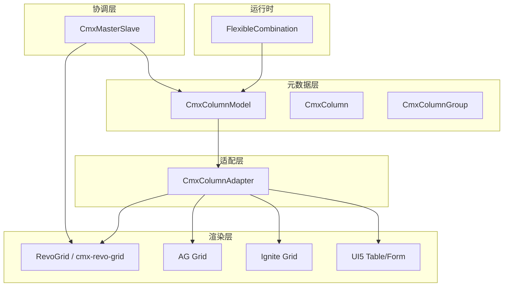
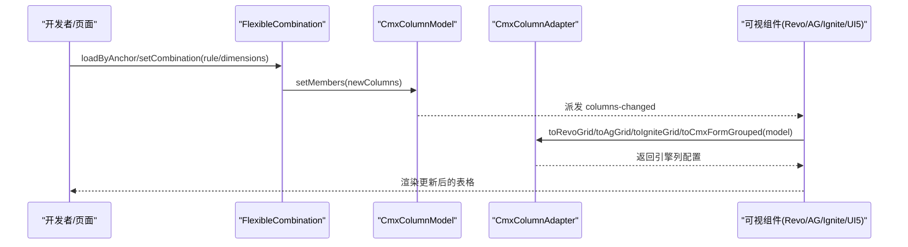
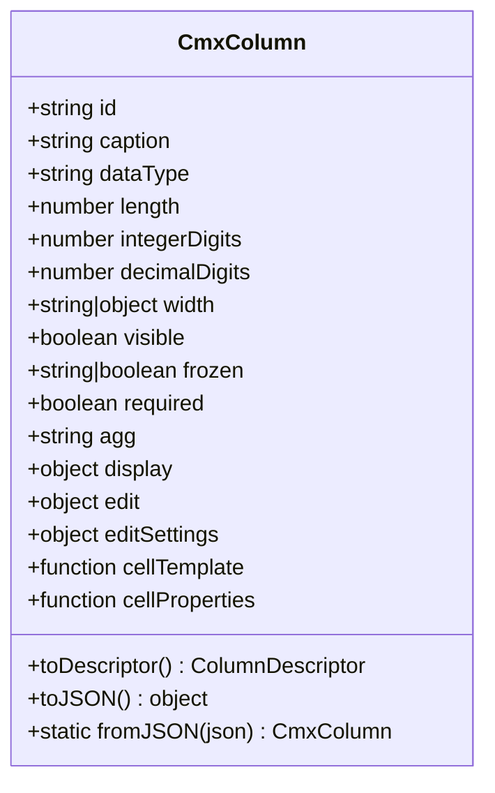
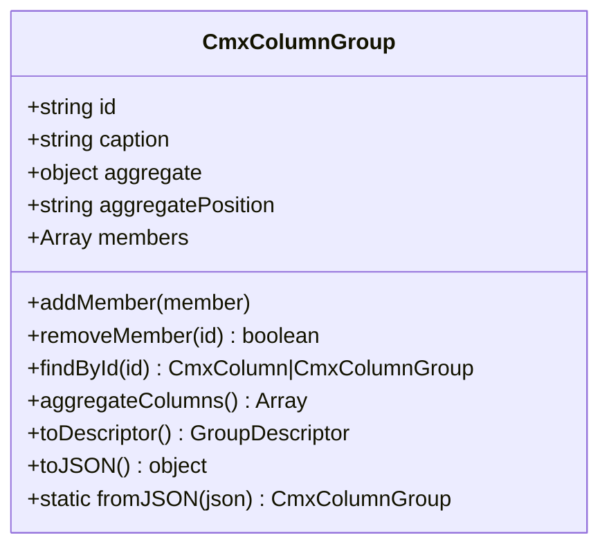
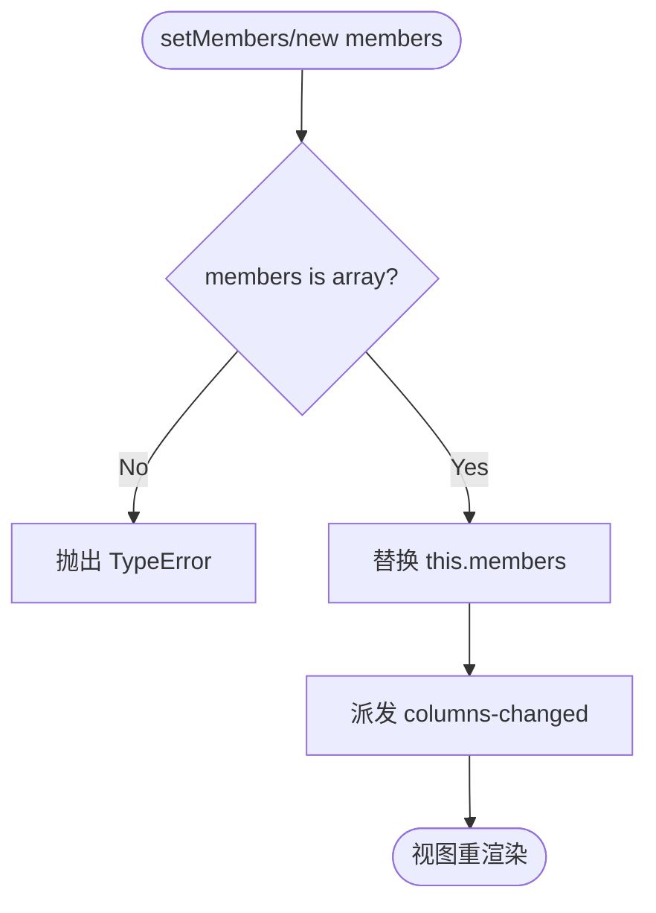
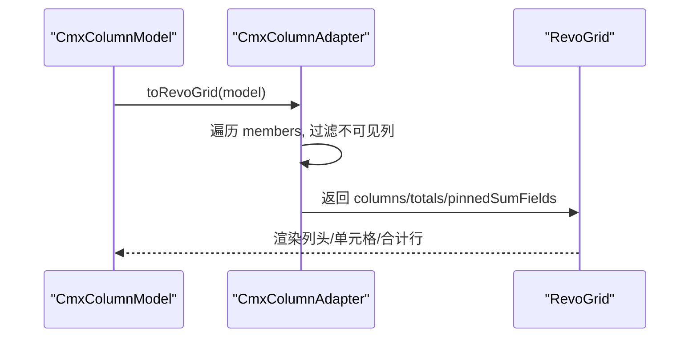
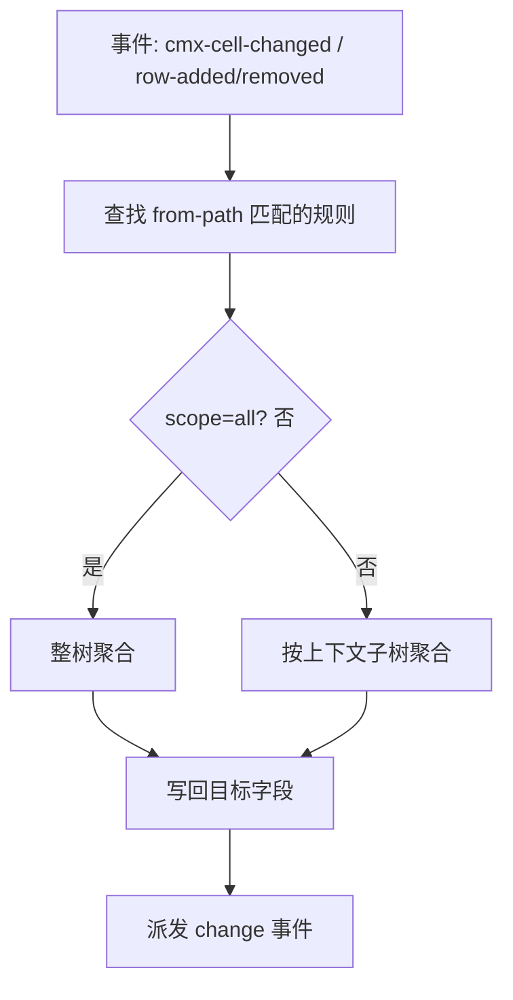
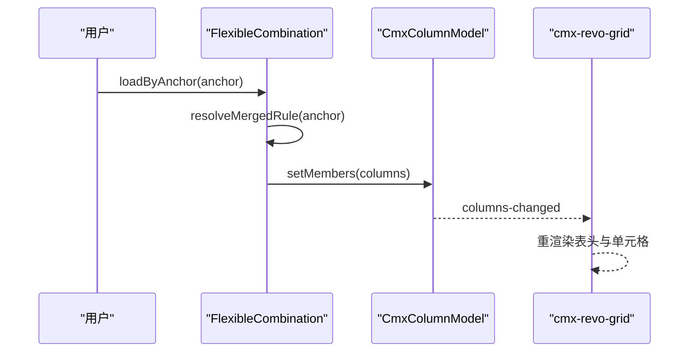
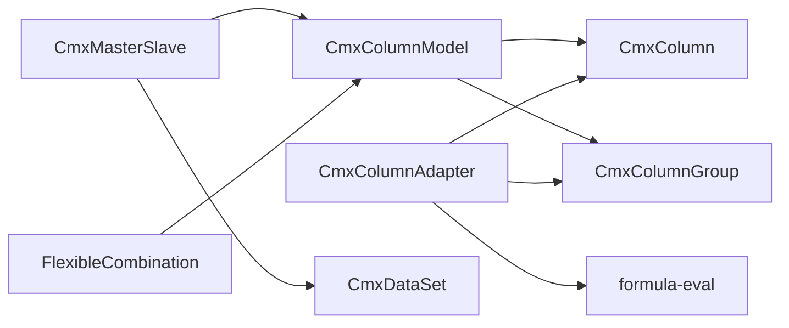

# 列模型集成

<cite>
**本文引用的文件**
- [cmx-column-model.js](file://packages/cmx-data-comp/src/lib/cmx-column-model.js)
- [cmx-column.js](file://packages/cmx-data-comp/src/lib/cmx-column.js)
- [cmx-column-group.js](file://packages/cmx-data-comp/src/lib/cmx-column-group.js)
- [cmx-column-adapter.js](file://packages/cmx-data-comp/src/lib/cmx-column-adapter.js)
- [cmx-master-slave.js](file://packages/cmx-data-comp/src/lib/cmx-master-slave.js)
- [08-列模型-CmxColumnModel.md](file://docs/CMXPortalManager+CMXHTMLDesigner-模型体系文档/08-列模型-CmxColumnModel.md)
- [10-弹性组合-FlexibleCombination.md](file://docs/CMXPortalManager+CMXHTMLDesigner-模型体系文档/10-弹性组合-FlexibleCombination.md)
- [column-editor-display-guide.md](file://packages/cmx-data-comp/docs/column-editor-display-guide.md)
- [condFormat.ts](file://cmx-mega-sheet/src/render/condFormat.ts)
</cite>

## 目录
1. [简介](#简介)
2. [项目结构](#项目结构)
3. [核心组件](#核心组件)
4. [架构总览](#架构总览)
5. [详细组件分析](#详细组件分析)
6. [依赖关系分析](#依赖关系分析)
7. [性能考量](#性能考量)
8. [故障排查指南](#故障排查指南)
9. [结论](#结论)
10. [附录](#附录)

## 简介
本文件围绕表格组件的“列模型”进行系统化说明，重点解释 CmxColumnModel 的设计理念、在表格中的核心作用、列定义标准格式（字段类型、验证规则、显示格式、编辑控件）、列适配器如何把统一描述转换为不同引擎（RevoGrid、AG Grid、Ignite、UI5）的特定格式，以及动态列变更机制（FlexibleCombination）、权限控制、条件格式化与自定义渲染器的实现方式。最后给出复杂场景配置示例：主从关系、级联依赖与计算列。

## 项目结构
与列模型相关的代码集中在 cmx-data-comp 库中，采用“纯元数据 + 适配器”的分层设计：
- 元数据层：CmxColumn、CmxColumnGroup、CmxColumnModel 负责声明式描述列与分组，不感知任何渲染细节。
- 适配层：CmxColumnAdapter 将通用描述符转换为具体 grid 的配置。
- 协调层：CmxMasterSlave 负责主从多表数据与聚合、事件联动，并在行变更时执行 calcFormula。
- 运行时：FlexibleCombination 根据上下文动态改写 CmxColumnModel 的成员集合，驱动视图重渲染。

图表来源
- [cmx-column-model.js:20-72](file://packages/cmx-data-comp/src/lib/cmx-column-model.js#L20-L72)
- [cmx-column-adapter.js:1-21](file://packages/cmx-data-comp/src/lib/cmx-column-adapter.js#L1-L21)
- [cmx-master-slave.js:1-31](file://packages/cmx-data-comp/src/lib/cmx-master-slave.js#L1-L31)
- [10-弹性组合-FlexibleCombination.md:29-54](file://docs/CMXPortalManager+CMXHTMLDesigner-模型体系文档/10-弹性组合-FlexibleCombination.md#L29-L54)

章节来源
- [cmx-column-model.js:20-72](file://packages/cmx-data-comp/src/lib/cmx-column-model.js#L20-L72)
- [cmx-column-adapter.js:1-21](file://packages/cmx-data-comp/src/lib/cmx-column-adapter.js#L1-L21)
- [cmx-master-slave.js:1-31](file://packages/cmx-data-comp/src/lib/cmx-master-slave.js#L1-L31)
- [10-弹性组合-FlexibleCombination.md:29-54](file://docs/CMXPortalManager+CMXHTMLDesigner-模型体系文档/10-弹性组合-FlexibleCombination.md#L29-L54)

## 核心组件
- CmxColumn：单列元数据，声明 id、caption、dataType、width、visible、frozen、agg、display/edit 等，提供 toDescriptor() 输出通用描述符。
- CmxColumnGroup：列分组，支持嵌套成员、组内聚合（sum/avg/max/min/count）及聚合位置 before/after。
- CmxColumnModel：列模型容器，维护 members（列或分组），支持增删改、fromMeta 动态构建、toDescriptors 输出、toAggregateMap 汇总聚合、序列化/反序列化。
- CmxColumnAdapter：列描述符适配器，提供 toRevoGrid、toAgGrid、toIgniteGrid、toCmxFormGrouped 等方法，将通用描述转为各引擎配置。
- CmxMasterSlave：主从协调器，绑定表单/表格视图，监听单元格/行变化，运行聚合规则与 calcFormula，管理数据集与分页。
- FlexibleCombination：按上下文（锚点维度）动态生成列，通过 setMembers 替换 CmxColumnModel 成员并触发 columns-changed 事件。

章节来源
- [cmx-column.js:84-200](file://packages/cmx-data-comp/src/lib/cmx-column.js#L84-L200)
- [cmx-column-group.js:25-131](file://packages/cmx-data-comp/src/lib/cmx-column-group.js#L25-L131)
- [cmx-column-model.js:20-241](file://packages/cmx-data-comp/src/lib/cmx-column-model.js#L20-L241)
- [cmx-column-adapter.js:1-21](file://packages/cmx-data-comp/src/lib/cmx-column-adapter.js#L1-L21)
- [cmx-master-slave.js:41-85](file://packages/cmx-data-comp/src/lib/cmx-master-slave.js#L41-L85)
- [10-弹性组合-FlexibleCombination.md:29-54](file://docs/CMXPortalManager+CMXHTMLDesigner-模型体系文档/10-弹性组合-FlexibleCombination.md#L29-L54)

## 架构总览
列模型体系遵循“声明式元数据 → 通用描述符 → 引擎适配”的流水线：
- 设计期/运行期构造 CmxColumn/CmxColumnGroup，放入 CmxColumnModel。
- 调用 toDescriptors() 产出通用中间格式（ColumnDescriptor[]）。
- 由 CmxColumnAdapter 转换为目标引擎配置（如 RevoGrid columns、AG Grid columnDefs、Ignite Grid 列、UI5 Form 字段树）。
- 可视组件（cmx-revo-grid、AG Grid、Ignite Grid、UI5 Table/Form）消费配置完成渲染与交互。
- 动态列变更通过 FlexibleCombination 修改 CmxColumnModel.members，派发 columns-changed，驱动视图刷新。

图表来源
- [cmx-column-model.js:33-72](file://packages/cmx-data-comp/src/lib/cmx-column-model.js#L33-L72)
- [cmx-column-adapter.js:717-732](file://packages/cmx-data-comp/src/lib/cmx-column-adapter.js#L717-L732)
- [10-弹性组合-FlexibleCombination.md:29-54](file://docs/CMXPortalManager+CMXHTMLDesigner-模型体系文档/10-弹性组合-FlexibleCombination.md#L29-L54)

## 详细组件分析

### CmxColumn — 单列元数据
- 职责：声明列的标识、标题、数据类型、宽度、可见性、冻结、聚合、显示与编辑配置；提供 toDescriptor() 输出通用描述符。
- 关键能力：
  - display/edit 结构化配置收敛，兼容旧字段别名（displayMask→display.format、validateFormula→edit.validate 等）。
  - 完整继承额外属性（如 refDict/refField/displayField/editSettings），供字典回显与编辑器使用。
  - 支持 cellTemplate/cellProperties 逃生舱，允许高级自定义渲染与属性注入。
- 复杂度：toDescriptor 为 O(1)，序列化/反序列化为 O(n)（n 为字段数）。

图表来源
- [cmx-column.js:84-200](file://packages/cmx-data-comp/src/lib/cmx-column.js#L84-L200)
- [cmx-column.js:202-255](file://packages/cmx-data-comp/src/lib/cmx-column.js#L202-L255)

章节来源
- [cmx-column.js:84-200](file://packages/cmx-data-comp/src/lib/cmx-column.js#L84-L200)
- [cmx-column.js:202-255](file://packages/cmx-data-comp/src/lib/cmx-column.js#L202-L255)

### CmxColumnGroup — 列分组与聚合
- 职责：组织若干列或嵌套分组为带标题的分组，支持组内聚合（sum/avg/max/min/count）和聚合行位置（before/after）。
- 关键能力：
  - aggregateColumns() 收集启用聚合的叶列键与聚合类型。
  - toDescriptor() 输出分组描述符，包含 children 与聚合配置。
- 复杂度：aggregateColumns 遍历叶列，O(n)。

图表来源
- [cmx-column-group.js:25-131](file://packages/cmx-data-comp/src/lib/cmx-column-group.js#L25-L131)

章节来源
- [cmx-column-group.js:25-131](file://packages/cmx-data-comp/src/lib/cmx-column-group.js#L25-L131)

### CmxColumnModel — 列模型容器
- 职责：管理 members（列/分组），提供 toDescriptors() 输出通用描述符，toAggregateMap() 汇总聚合，fromMeta() 从元数据构建列，setMembers() 动态替换列集合。
- 关键能力：
  - _emitChange('columns-changed') 通知订阅者（如 cmx-revo-grid）重新渲染。
  - fromMeta() 支持 DCT/DOC 元数据自动构建列，并回填 refDict 坐标信息。
  - toJSON/fromJSON 支持持久化与还原。
- 复杂度：toDescriptors 为 O(m)，m 为成员数；fromMeta 涉及动态 import 与转换，整体 O(n)。

图表来源
- [cmx-column-model.js:62-72](file://packages/cmx-data-comp/src/lib/cmx-column-model.js#L62-L72)

章节来源
- [cmx-column-model.js:20-241](file://packages/cmx-data-comp/src/lib/cmx-column-model.js#L20-L241)

### CmxColumnAdapter — 列描述符适配器
- 职责：将通用描述符转换为具体 grid 的列定义，当前支持 RevoGrid、AG Grid、Ignite Grid、UI5 Form。
- 关键方法：
  - toRevoGrid(model)：返回 columns、totals、pinnedSumFields。
  - toAgGrid(model)：返回 columnDefs、defaultColDef 扩展。
  - toIgniteGrid(model)：返回 columns、totals。
  - toCmxFormGrouped(model)：返回 UI5 表单字段树（含分组）。
- 关键逻辑：
  - 解析 display/edit 块，推断对齐、数值/日期/布尔类型、只读/必填、下拉选项、日期编辑器等。
  - 处理 calcFormula、displayMask、cellStyle 条件样式、refDict 字典回显。
  - 对 RevoGrid 保留 CmxColumn 引用以便运行时读取最新 editSettings。

图表来源
- [cmx-column-adapter.js:717-732](file://packages/cmx-data-comp/src/lib/cmx-column-adapter.js#L717-L732)
- [cmx-column-adapter.js:873-885](file://packages/cmx-data-comp/src/lib/cmx-column-adapter.js#L873-L885)

章节来源
- [cmx-column-adapter.js:1-21](file://packages/cmx-data-comp/src/lib/cmx-column-adapter.js#L1-L21)
- [cmx-column-adapter.js:717-732](file://packages/cmx-data-comp/src/lib/cmx-column-adapter.js#L717-L732)
- [cmx-column-adapter.js:873-885](file://packages/cmx-data-comp/src/lib/cmx-column-adapter.js#L873-L885)

### CmxMasterSlave — 主从协调器与计算列
- 职责：持有递归主从数据树，注册表单/表格视图，管理选中行与级联刷新，监听单元格/行变更运行聚合规则与 calcFormula。
- 关键能力：
  - setColumnModel(model)：以 model.datasetId 为 key 注册列模型，用于 row-changed 时执行 calcFormula。
  - 聚合函数 sum/avg/min/max/count，支持 scope 控制聚合范围。
  - 事件驱动：cmx-cell-changed、cmx-row-added/removed 触发受影响规则重算。
- 复杂度：聚合与规则调度基于反向索引，命中部分仅跑受影响规则，整体高效。

图表来源
- [cmx-master-slave.js:17-31](file://packages/cmx-data-comp/src/lib/cmx-master-slave.js#L17-L31)
- [cmx-master-slave.js:181-191](file://packages/cmx-data-comp/src/lib/cmx-master-slave.js#L181-L191)

章节来源
- [cmx-master-slave.js:1-200](file://packages/cmx-data-comp/src/lib/cmx-master-slave.js#L1-L200)

### FlexibleCombination — 动态列变更
- 职责：根据上下文（锚点维度）动态生成列，通过 setMembers 替换 CmxColumnModel 成员，派发 columns-changed，驱动视图刷新。
- 数据来源：inlineData（开页生效）、serviceFn（推荐，动态取数）、setCombination（运行时 JSON 直设）。
- 匹配评分：精确 match > 属性匹配 > 兜底规则；合并语义同分取定义顺序靠前。
- 特性：零页面胶水、多消费者、缓存、回退到初始列、可叠加多次 setCombination。

图表来源
- [10-弹性组合-FlexibleCombination.md:29-54](file://docs/CMXPortalManager+CMXHTMLDesigner-模型体系文档/10-弹性组合-FlexibleCombination.md#L29-L54)
- [10-弹性组合-FlexibleCombination.md:262-280](file://docs/CMXPortalManager+CMXHTMLDesigner-模型体系文档/10-弹性组合-FlexibleCombination.md#L262-L280)

章节来源
- [10-弹性组合-FlexibleCombination.md:29-54](file://docs/CMXPortalManager+CMXHTMLDesigner-模型体系文档/10-弹性组合-FlexibleCombination.md#L29-L54)
- [10-弹性组合-FlexibleCombination.md:262-280](file://docs/CMXPortalManager+CMXHTMLDesigner-模型体系文档/10-弹性组合-FlexibleCombination.md#L262-L280)

## 依赖关系分析
- CmxColumnModel 依赖 CmxColumn、CmxColumnGroup 构建 members，依赖 cmx-doc-coord 解析坐标。
- CmxColumnAdapter 依赖 CmxColumn、CmxColumnGroup、formula-eval、editModeKind、fieldCaption 完成描述符到引擎配置的转换。
- CmxMasterSlave 依赖 CmxDataSet、invokePreset（列预设）、CmxColumnModel（calcFormula 执行）。
- FlexibleCombination 依赖后端服务或 inlineData 生成 rule/dimensions，最终写入 CmxColumnModel。

图表来源
- [cmx-column-model.js:16-18](file://packages/cmx-data-comp/src/lib/cmx-column-model.js#L16-L18)
- [cmx-column-adapter.js:23-27](file://packages/cmx-data-comp/src/lib/cmx-column-adapter.js#L23-L27)
- [cmx-master-slave.js:1-3](file://packages/cmx-data-comp/src/lib/cmx-master-slave.js#L1-L3)

章节来源
- [cmx-column-model.js:16-18](file://packages/cmx-data-comp/src/lib/cmx-column-model.js#L16-L18)
- [cmx-column-adapter.js:23-27](file://packages/cmx-data-comp/src/lib/cmx-column-adapter.js#L23-L27)
- [cmx-master-slave.js:1-3](file://packages/cmx-data-comp/src/lib/cmx-master-slave.js#L1-L3)

## 性能考量
- 列描述符生成：toDescriptors() 仅遍历 members，时间复杂度 O(m)，适合频繁动态列切换。
- 适配器转换：toRevoGrid/toAgGrid 等对 members 做线性扫描，避免重复计算；RevoGrid 路径保留 CmxColumn 引用以减少快照开销。
- 聚合与公式：CmxMasterSlave 通过反向索引仅运行受影响规则，减少全量重算；calcFormula 依赖 dependsOn 拓扑排序，避免循环与冗余。
- 条件格式：condFormat.ts 提供纯计算的条件格式引擎，独立于渲染层，可 Node 测试，提升性能与可测性。

[本节为通用性能讨论，无需特定文件引用]

## 故障排查指南
- 列未显示：检查 CmxColumn.visible 是否为 false；确认 toDescriptors() 过滤逻辑。
- 编辑器不生效：确认 edit.mode 与字段类型匹配；检查 editSettings.options 是否传入；参考 revo-grid 编辑器注册表。
- 动态列不更新：确保 FlexibleCombination 正确调用 setMembers，并确认 columns-changed 被订阅。
- 计算列不重算：确认 calcFormula 与 dependsOn 配置正确；检查 CmxMasterSlave 是否注册了对应 datasetId 的列模型。
- 条件格式异常：核对 condFormat 规则表达式与值域；确保预计算值已填充。

章节来源
- [cmx-column-model.js:188-195](file://packages/cmx-data-comp/src/lib/cmx-column-model.js#L188-L195)
- [column-editor-display-guide.md:146-171](file://packages/cmx-data-comp/docs/column-editor-display-guide.md#L146-L171)
- [cmx-master-slave.js:181-191](file://packages/cmx-data-comp/src/lib/cmx-master-slave.js#L181-L191)
- [condFormat.ts:1-168](file://cmx-mega-sheet/src/render/condFormat.ts#L1-L168)

## 结论
CmxColumnModel 体系通过“声明式元数据 + 通用描述符 + 多引擎适配器”的设计，实现了列定义的标准化与跨引擎复用。FlexibleCombination 提供了强大的动态列能力，结合 CmxMasterSlave 的主从协调与计算列机制，可满足复杂业务场景（主从关系、级联依赖、计算列）。同时，条件格式化与自定义渲染器为高级定制提供了灵活空间。

[本节为总结，无需特定文件引用]

## 附录

### 列定义标准格式速查
- 字段类型：VARCHAR、BIGINT、NUMBER、DATE、DATETIME、BOOLEAN 等。
- 验证规则：edit.required、edit.validate、edit.validateWhen、requiredWhen。
- 显示格式：display.format（如 thousands、percent、currency、date:YYYY-MM-DD）、display.decimalDigits、display.zeroAsBlank、display.emptyText。
- 编辑控件：edit.mode（input/textarea/rich-text/number/date/datetime/checkbox/select/ref/combo/ignite-combo/dict-select/image/video/readonly/none）、edit.trigger、edit.options、edit.source、edit.valueField、edit.displayTemplate、edit.parent、edit.dropdownColumns、edit.dropdownWidth、edit.dropdownMaxHeight、edit.placeholder、edit.dependents。
- 计算列：calcFormula、dependsOn。
- 聚合：agg（sum/count/avg/max/min）。
- 其他：width、visible、frozen、actionRef、length、integerDigits、decimalDigits、refDict/refField/displayField、editSettings.coord。

章节来源
- [08-列模型-CmxColumnModel.md:39-68](file://docs/CMXPortalManager+CMXHTMLDesigner-模型体系文档/08-列模型-CmxColumnModel.md#L39-L68)
- [cmx-column.js:13-80](file://packages/cmx-data-comp/src/lib/cmx-column.js#L13-L80)

### 复杂列配置示例
- 主从关系：通过 CmxMasterSlave 绑定父/子表视图，设置 relations 与 path，监听选中行变化级联刷新下级视图。
- 级联依赖：attribute 列从 dimension 列带出；measure 列通过 calcFormula 与 dependsOn 实现级联计算。
- 计算列：edit.mode=computed，formula 使用白名单运算符与函数（ROUND/ABS/MIN/MAX/IF），dependsOn 指定依赖字段。

章节来源
- [cmx-master-slave.js:1-31](file://packages/cmx-data-comp/src/lib/cmx-master-slave.js#L1-L31)
- [10-弹性组合-FlexibleCombination.md:283-315](file://docs/CMXPortalManager+CMXHTMLDesigner-模型体系文档/10-弹性组合-FlexibleCombination.md#L283-L315)