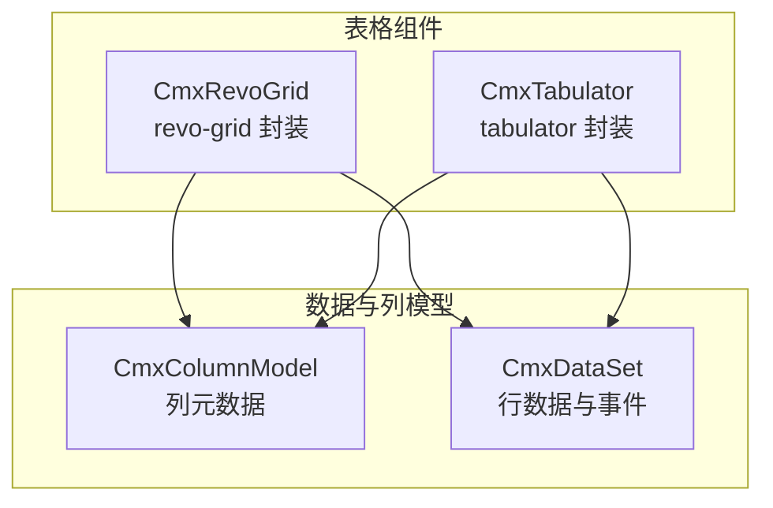
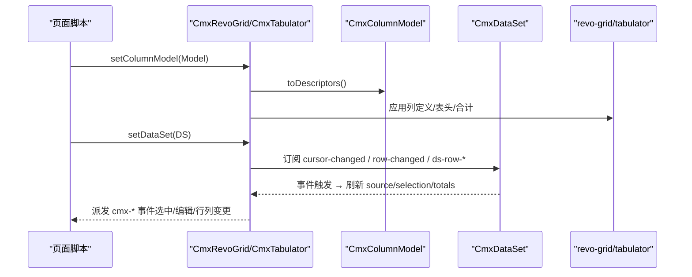
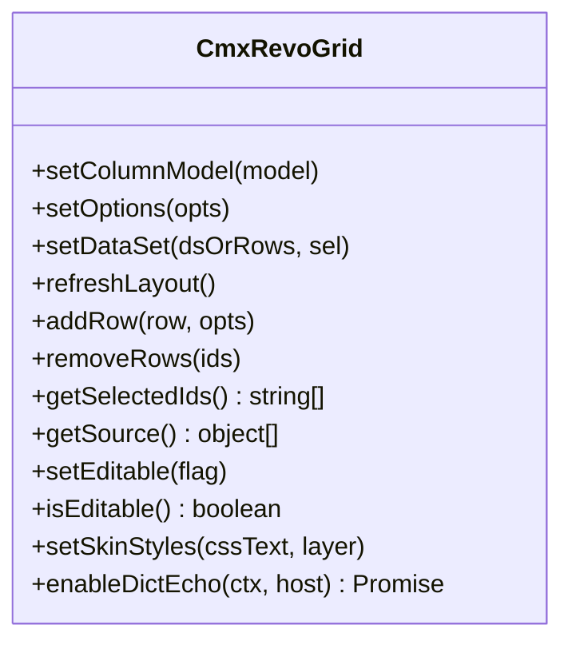
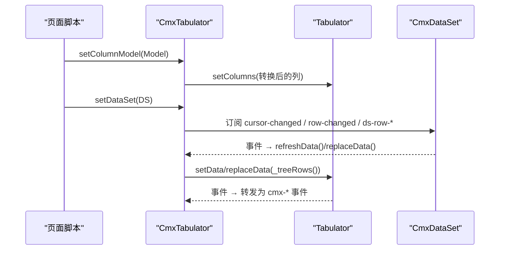
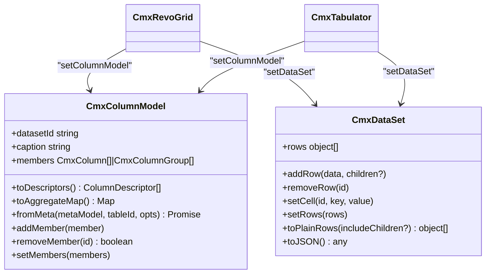
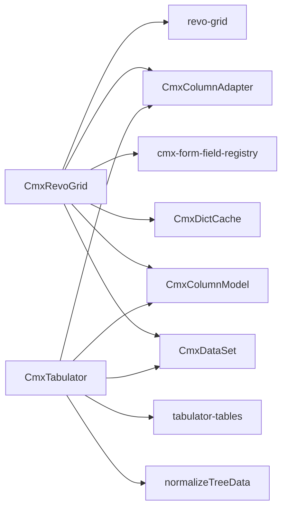

# 表格组件

<cite>
**本文引用的文件**
- [cmx-revo-grid.js](file://packages/cmx-data-comp/src/components/cmx-revo-grid.js)
- [cmx-tabulator.js](file://packages/cmx-data-comp/src/components/cmx-tabulator.js)
- [grid-components.md](file://.agents/skills/cmx-components-guide/references/grid-components.md)
- [cmx-column-model.js](file://packages/cmx-data-comp/src/lib/cmx-column-model.js)
- [model-dataset.md](file://.agents/skills/html-page-generator/references/model-dataset.md)
- [skill-generate-master-slave-page.md](file://packages/cmx-data-comp/docs/skill-generate-master-slave-page.md)
</cite>

## 目录
1. [简介](#简介)
2. [项目结构](#项目结构)
3. [核心组件](#核心组件)
4. [架构总览](#架构总览)
5. [详细组件分析](#详细组件分析)
6. [依赖关系分析](#依赖关系分析)
7. [性能与大数据处理](#性能与大数据处理)
8. [故障排查指南](#故障排查指南)
9. [结论](#结论)
10. [附录](#附录)

## 简介
本章节面向 CMX 平台中的两种表格引擎：CmxRevoGrid（基于 RevoGrid）与 CmxTabulator（基于 Tabulator）。文档聚焦于两者的能力差异、适用场景、配置选项（列定义、排序、筛选、分页、虚拟滚动）、数据绑定机制、单元格编辑、批量操作与导出，以及复杂应用场景（主从表格、树形表格、动态列配置），并给出性能优化策略与内存管理建议。

## 项目结构
CMX 表格能力集中在 cmx-data-comp 包中：
- CmxRevoGrid：通用数据表格首选，支持多级表头、合计行、虚拟滚动、Neo 皮肤、字典回显等。
- CmxTabulator：树形表格备选，内置 dataTree、本地/远程分页、列拖拽移动、fitColumns 自适应等。
- 列模型与数据集：通过 CmxColumnModel 与 CmxDataSet 统一描述列与数据，被两个表格组件复用。

图表来源
- [cmx-revo-grid.js:183-312](file://packages/cmx-data-comp/src/components/cmx-revo-grid.js#L183-L312)
- [cmx-tabulator.js:262-335](file://packages/cmx-data-comp/src/components/cmx-tabulator.js#L262-L335)
- [cmx-column-model.js:20-30](file://packages/cmx-data-comp/src/lib/cmx-column-model.js#L20-L30)

章节来源
- [cmx-revo-grid.js:1-1551](file://packages/cmx-data-comp/src/components/cmx-revo-grid.js#L1-L1551)
- [cmx-tabulator.js:1-1186](file://packages/cmx-data-comp/src/components/cmx-tabulator.js#L1-L1186)
- [cmx-column-model.js:1-241](file://packages/cmx-data-comp/src/lib/cmx-column-model.js#L1-L241)

## 核心组件
- CmxRevoGrid：以 setColumnModel(model) 作为唯一列入口，提供 setOptions/setDataSet/refreshLayout/addRow/removeRows/getSelectedIds/getSource/setEditable/isEditable/setSkinStyles/enableDictEcho 等 API；默认 Neo 皮肤、自动暗色主题、合计行、虚拟滚动、列拉伸 stretch、手动 resize、只读/编辑态切换、单元格文本选择、tooltip 等。
- CmxTabulator：以 setColumnModel(model)/setColumns(columns)/data-cmx-columns 设置列；提供 treegrid（dataTree）、本地/远程分页、列拖拽移动、fitColumns、复选框列、树节点展开/折叠快照保持、丰富事件转发等。

章节来源
- [grid-components.md:12-103](file://.agents/skills/cmx-components-guide/references/grid-components.md#L12-L103)
- [grid-components.md:238-320](file://.agents/skills/cmx-components-guide/references/grid-components.md#L238-L320)
- [cmx-revo-grid.js:459-663](file://packages/cmx-data-comp/src/components/cmx-revo-grid.js#L459-L663)
- [cmx-tabulator.js:262-319](file://packages/cmx-data-comp/src/components/cmx-tabulator.js#L262-L319)

## 架构总览
两个表格组件共享“列模型 + 数据集”的抽象：
- 列模型（CmxColumnModel）负责描述列、分组表头、聚合、图标列等元数据，并通过 toDescriptors() 输出中间格式，由适配器转换为具体 grid 的列定义。
- 数据集（CmxDataSet）提供 rows 数组与增删改、游标、事件（cursor-changed/ds-row-added/ds-row-removed/row-changed），表格组件订阅这些事件实现双向联动。

图表来源
- [cmx-revo-grid.js:468-592](file://packages/cmx-data-comp/src/components/cmx-revo-grid.js#L468-L592)
- [cmx-tabulator.js:822-842](file://packages/cmx-data-comp/src/components/cmx-tabulator.js#L822-L842)
- [cmx-column-model.js:181-195](file://packages/cmx-data-comp/src/lib/cmx-column-model.js#L181-L195)

## 详细组件分析

### CmxRevoGrid（首选表格）
- 列定义：仅通过 setColumnModel(model) 或 data-cmx-model-id 注入；内部使用 CmxColumnAdapter 将模型转为 revo-grid 列，支持多级表头与合计。
- 选项与显示：selectionMode、rowHeight、viewHeight、fillHeight、virtualScroll、showRowIndex、showTotals、totals、theme、range、minRows、stretch、editTrigger、alternateRowColor、showRequiredMark、cellTooltip、allowTextSelect、resize 等。
- 数据绑定：setDataSet(dsOrRows, sel) 支持 CmxDataSet 或纯数组；自动监听 ds 事件并刷新视图；支持 selectedId/selectedIds/preserveScroll。
- 编辑与校验：editable/readonly/editTrigger；列级 readonlyWhen 表达式翻译为 revo-grid readonly 函数；commitEdit 可强制提交当前编辑器值。
- 布局与尺寸：refreshLayout 强制刷新视口/拉伸；ResizeObserver 监听宿主尺寸变化；stretch 按比例铺满，百分比列优先占位，冻结列不参与拉伸。
- 字典回显：enableDictEcho 预加载 refDict 条目并挂 resolver，失败时降级显示 id 并提示。
- 事件：cmx-columns-changed、cmx-row-selected、cmx-row-selection-change、cmx-cell-changed、cmx-row-added、cmx-row-removed、cmx-cell-link-click、cmx-cell-invalid。

图表来源
- [cmx-revo-grid.js:459-663](file://packages/cmx-data-comp/src/components/cmx-revo-grid.js#L459-L663)
- [cmx-revo-grid.js:714-724](file://packages/cmx-data-comp/src/components/cmx-revo-grid.js#L714-L724)
- [cmx-revo-grid.js:734-832](file://packages/cmx-data-comp/src/components/cmx-revo-grid.js#L734-L832)
- [cmx-revo-grid.js:885-960](file://packages/cmx-data-comp/src/components/cmx-revo-grid.js#L885-L960)
- [cmx-revo-grid.js:1099-1129](file://packages/cmx-data-comp/src/components/cmx-revo-grid.js#L1099-L1129)

章节来源
- [cmx-revo-grid.js:1-1551](file://packages/cmx-data-comp/src/components/cmx-revo-grid.js#L1-L1551)
- [grid-components.md:19-103](file://.agents/skills/cmx-components-guide/references/grid-components.md#L19-L103)

### CmxTabulator（树表备选）
- 列定义：setColumnModel(model)/setColumns(columns)/data-cmx-columns；toTabulatorColumn 将 cmx 列定义映射到 tabulator 列（含多级表头 children）。
- 选项与显示：layout、height、selectableRows、selectionCheckbox、rowHeight、reactiveData、movableColumns、resizableColumnFit、pagination、paginationSize、placeholder、index、autoColumns、dataTree、parentField、dataTreeChildField、dataTreeChildIndent、treeColumn、treeStartExpanded。
- 树形表格：normalizeTreeData 将扁平行按 parentField 重建嵌套结构；expandAll/collapseAll/expandRow/collapseRow/toggleRow/getExpandedIds；刷新后通过 _expandedIds 快照恢复展开态。
- 数据绑定：setDataSet(dsOrRows, sel) 支持 CmxDataSet 或纯数组；setData(rows, sel) 用于纯数组模式；_pushData 推入 tabulator 并恢复选中与展开态。
- 编辑与事件：cellEdited 写回 ds 并派发 cmx-cell-changed；丰富的 tabulator 事件转发为 cmx-* 事件（ready/data-changed/filtered/sorted/page-loaded/column-moved/cell-edited）。
- 选择与复选框：selectionCheckbox 列渲染勾选状态，支持全选/半选同步。

图表来源
- [cmx-tabulator.js:228-260](file://packages/cmx-data-comp/src/components/cmx-tabulator.js#L228-L260)
- [cmx-tabulator.js:543-587](file://packages/cmx-data-comp/src/components/cmx-tabulator.js#L543-L587)
- [cmx-tabulator.js:822-912](file://packages/cmx-data-comp/src/components/cmx-tabulator.js#L822-L912)
- [cmx-tabulator.js:918-1002](file://packages/cmx-data-comp/src/components/cmx-tabulator.js#L918-L1002)

章节来源
- [cmx-tabulator.js:1-1186](file://packages/cmx-data-comp/src/components/cmx-tabulator.js#L1-L1186)
- [grid-components.md:238-320](file://.agents/skills/cmx-components-guide/references/grid-components.md#L238-L320)

### 列模型与数据集（共同基础）
- CmxColumnModel：维护 members（CmxColumn/CmxColumnGroup），支持 addMember/removeMember/setMembers/fromMeta/toDescriptors/toAggregateMap；columns-changed 事件驱动表格重刷。
- CmxDataSet：提供 rows、addRow/removeRow/setCell/setRows、createView、toPlainRows、toJSON 等；表格组件通过 setDataSet 绑定并监听事件。

图表来源
- [cmx-column-model.js:20-30](file://packages/cmx-data-comp/src/lib/cmx-column-model.js#L20-L30)
- [cmx-column-model.js:40-72](file://packages/cmx-data-comp/src/lib/cmx-column-model.js#L40-L72)
- [cmx-column-model.js:89-158](file://packages/cmx-data-comp/src/lib/cmx-column-model.js#L89-L158)
- [cmx-column-model.js:181-219](file://packages/cmx-data-comp/src/lib/cmx-column-model.js#L181-L219)
- [model-dataset.md:175-229](file://.agents/skills/html-page-generator/references/model-dataset.md#L175-L229)

章节来源
- [cmx-column-model.js:1-241](file://packages/cmx-data-comp/src/lib/cmx-column-model.js#L1-L241)
- [model-dataset.md:175-229](file://.agents/skills/html-page-generator/references/model-dataset.md#L175-L229)

## 依赖关系分析
- CmxRevoGrid 依赖：
  - RevoGrid（Stencil 自定义元素）
  - CmxColumnAdapter（列模型→revo-grid 列）
  - CmxFormFieldRegistry（编辑器注册表）
  - CmxDictCache（字典回显）
  - Mixins：stretch/selection/multi-header/sync/events/tooltip/text-select/resize
- CmxTabulator 依赖：
  - Tabulator 6.4
  - CmxColumnAdapter（列模型→tabulator 列）
  - normalizeTreeData（树形数据归一化）
- 两者均依赖 CmxColumnModel 与 CmxDataSet 进行列与数据绑定。

图表来源
- [cmx-revo-grid.js:27-43](file://packages/cmx-data-comp/src/components/cmx-revo-grid.js#L27-L43)
- [cmx-tabulator.js:45-50](file://packages/cmx-data-comp/src/components/cmx-tabulator.js#L45-L50)

章节来源
- [cmx-revo-grid.js:27-43](file://packages/cmx-data-comp/src/components/cmx-revo-grid.js#L27-L43)
- [cmx-tabulator.js:45-50](file://packages/cmx-data-comp/src/components/cmx-tabulator.js#L45-L50)

## 性能与大数据处理
- 虚拟滚动：
  - CmxRevoGrid：virtualScroll 默认开启，支持横向+纵向虚拟滚动；minRows 控制最小渲染行数以避免表格过矮。
  - CmxTabulator：原生虚拟滚动，适合大数据集展示。
- 列宽与拉伸：
  - CmxRevoGrid：stretch=true 时按比例铺满；百分比列优先占位，冻结列不参与拉伸；用户拖动过的列宽锁定；resize 开启后可手动调宽。
  - CmxTabulator：fitColumns 自适应；可设置 movableColumns 允许列拖拽移动。
- 渲染优化：
  - CmxRevoGrid：displaySource 缓存策略（rows 引用/长度/minRows 不变则复用）；refresh('all') 仅在必要时触发；ResizeObserver 合并刷新避免重复重绘。
  - CmxTabulator：_pushData 异步 setData/replaceData，并在完成后恢复选中与展开态；redraw(true) 在容器尺寸变化时重绘。
- 内存管理：
  - 组件生命周期内正确解绑事件监听（ds 事件、窗口主题事件、ResizeObserver），disconnectedCallback 中销毁实例释放引用。
  - CmxRevoGrid 在 disconnectedCallback 中移除 revo 事件监听与 ResizeObserver；CmxTabulator 销毁 tabulator 实例并断开观察器。

章节来源
- [cmx-revo-grid.js:1099-1129](file://packages/cmx-data-comp/src/components/cmx-revo-grid.js#L1099-L1129)
- [cmx-revo-grid.js:1171-1215](file://packages/cmx-data-comp/src/components/cmx-revo-grid.js#L1171-L1215)
- [cmx-tabulator.js:918-1008](file://packages/cmx-data-comp/src/components/cmx-tabulator.js#L918-L1008)
- [cmx-tabulator.js:321-348](file://packages/cmx-data-comp/src/components/cmx-tabulator.js#L321-L348)

## 故障排查指南
- 多选高亮不生效：
  - CmxRevoGrid：需调用 refresh('all') 才能重新计算每行的 rowClass；确保 _syncSelection 已执行。
- 删除行无效：
  - CmxRevoGrid：传入 ids 可能为字符串，但 r.id 可能是整数；内部已做 String 化匹配；DataSet 模式需用原始 r.id 调用 removeRow。
- 树表展开态丢失：
  - CmxTabulator：刷新数据后需通过 _restoreExpanded 恢复 _expandedIds 快照；新增/删除行时注意重建嵌套结构。
- 主题切换未生效：
  - CmxRevoGrid：auto 主题延一帧检测并监听 cmx-portal-theme-change；必要时调用 refresh('all') 重绘。
  - CmxTabulator：_applyTheme 设置 data-cmx-theme 并 redraw。
- 字典回显失败：
  - CmxRevoGrid：enableDictEcho 预加载失败会 toast 提示；resolver 未命中时降级显示原 id。

章节来源
- [cmx-revo-grid.js:834-858](file://packages/cmx-data-comp/src/components/cmx-revo-grid.js#L834-L858)
- [cmx-revo-grid.js:927-960](file://packages/cmx-data-comp/src/components/cmx-revo-grid.js#L927-L960)
- [cmx-tabulator.js:925-934](file://packages/cmx-data-comp/src/components/cmx-tabulator.js#L925-L934)
- [cmx-tabulator.js:1175-1180](file://packages/cmx-data-comp/src/components/cmx-tabulator.js#L1175-L1180)
- [cmx-revo-grid.js:525-563](file://packages/cmx-data-comp/src/components/cmx-revo-grid.js#L525-L563)

## 结论
- 首选 CmxRevoGrid 用于通用数据表格：虚拟滚动、多级表头、合计行、Neo 皮肤、字典回显、列拉伸与手动 resize 等能力完善。
- 需要树形表格、本地/远程分页、列拖拽移动或 fitColumns 自适应时，选择 CmxTabulator。
- 两者均基于 CmxColumnModel 与 CmxDataSet 统一列与数据抽象，便于在主从协调器、动态列、表单联动等场景中复用。
- 大数据场景下应启用虚拟滚动、合理配置 minRows/stretch、避免频繁全量刷新，并注意组件生命周期内的资源释放。

## 附录
- 常用配置速查：
  - CmxRevoGrid：selectionMode、rowHeight、viewHeight、fillHeight、virtualScroll、showRowIndex、showTotals、totals、theme、range、minRows、stretch、editTrigger、alternateRowColor、showRequiredMark、cellTooltip、allowTextSelect、resize。
  - CmxTabulator：layout、height、selectableRows、selectionCheckbox、rowHeight、reactiveData、movableColumns、resizableColumnFit、pagination、paginationSize、placeholder、index、autoColumns、dataTree、parentField、dataTreeChildField、dataTreeChildIndent、treeColumn、treeStartExpanded。
- 声明式属性：
  - CmxRevoGrid：data-cmx-options、data-cmx-rows、data-cmx-fill-height、data-cmx-model-id、data-cmx-skin、data-cmx-skin-tone、data-cmx-style-id、data-cmx-embed、data-cmx-borderless、data-cmx-flat。
  - CmxTabulator：data-cmx-options、data-cmx-rows、data-cmx-columns、data-cmx-model-id、data-cmx-master-slave-id、data-cmx-dataset-id、data-cmx-tree、data-cmx-parent-field、data-cmx-tree-column、data-cmx-tree-child-field、data-cmx-tree-start-expanded、data-cmx-icon-field、data-cmx-height、data-cmx-layout、data-cmx-pagination、data-cmx-page-size、data-cmx-selection-mode、data-cmx-placeholder、data-cmx-movable-columns、data-cmx-reactive-data、data-cmx-auto-columns、data-cmx-readonly、data-cmx-skin、data-cmx-borderless、data-cmx-flat。
- 复杂场景示例：
  - 主从表格：通过 CmxMasterSlave 绑定主从网格，使用 ms.bindTable 与 setFlatData 加载扁平数据并按 relations 分组。
  - 树形表格：CmxTabulator 启用 dataTree，配置 parentField/treeColumn/treeStartExpanded，利用 expandAll/collapseAll/expandRow/collapseRow/toggleRow 控制展开态。
  - 动态列配置：CmxColumnModel.setMembers/fromMeta 动态替换列，触发 columns-changed 事件使表格自动重刷。

章节来源
- [grid-components.md:19-103](file://.agents/skills/cmx-components-guide/references/grid-components.md#L19-L103)
- [grid-components.md:238-320](file://.agents/skills/cmx-components-guide/references/grid-components.md#L238-L320)
- [skill-generate-master-slave-page.md:132-204](file://packages/cmx-data-comp/docs/skill-generate-master-slave-page.md#L132-L204)
- [model-dataset.md:175-229](file://.agents/skills/html-page-generator/references/model-dataset.md#L175-L229)