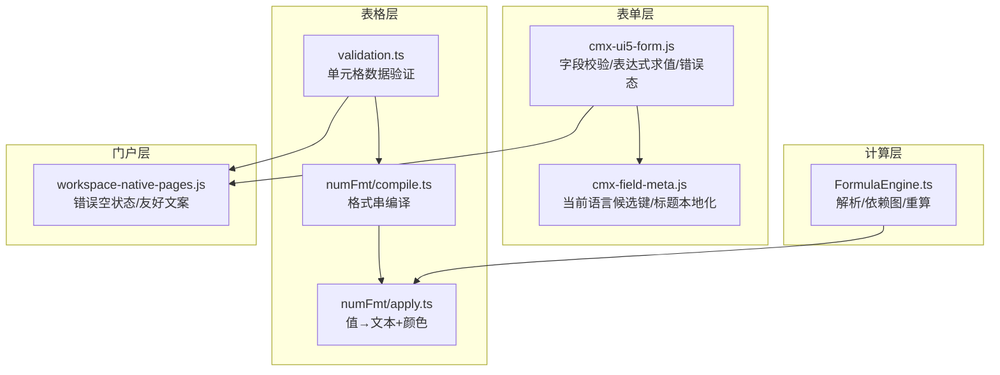
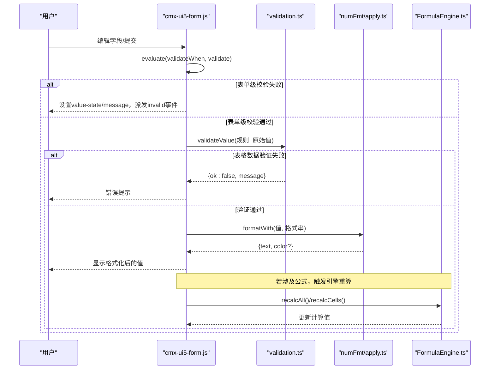
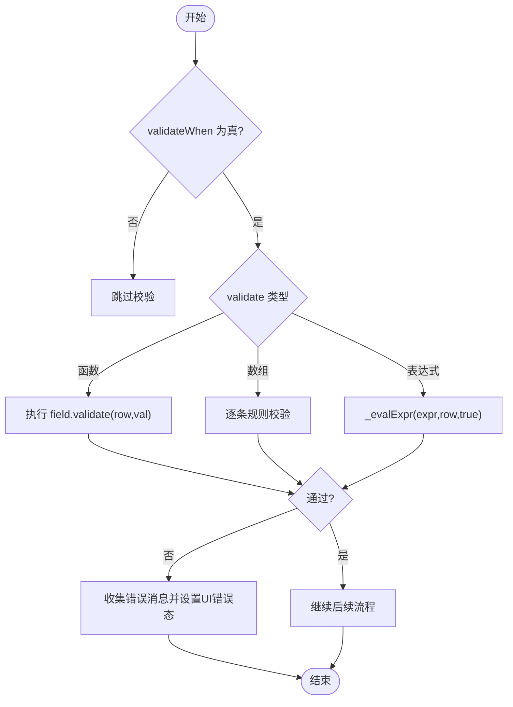
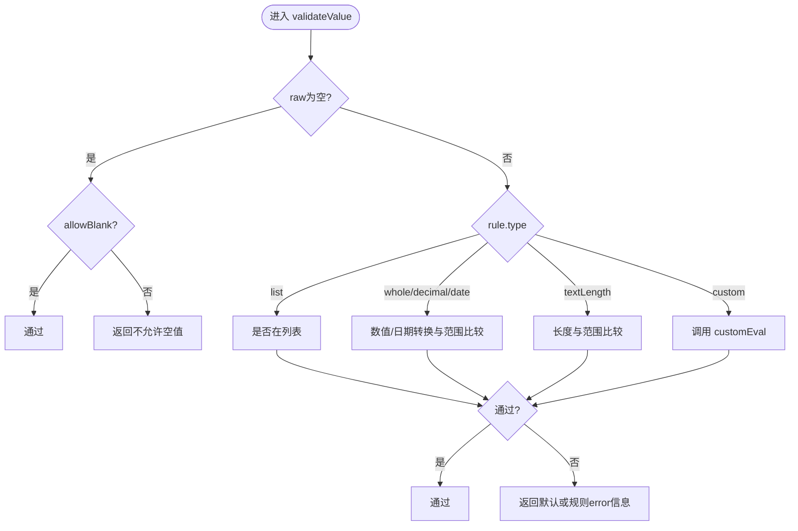
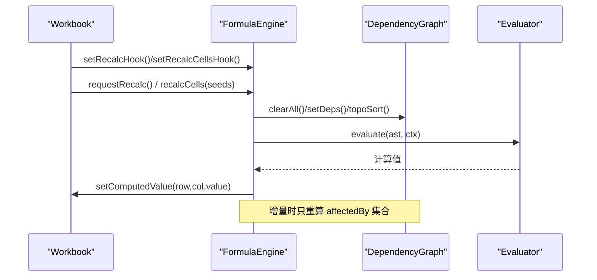
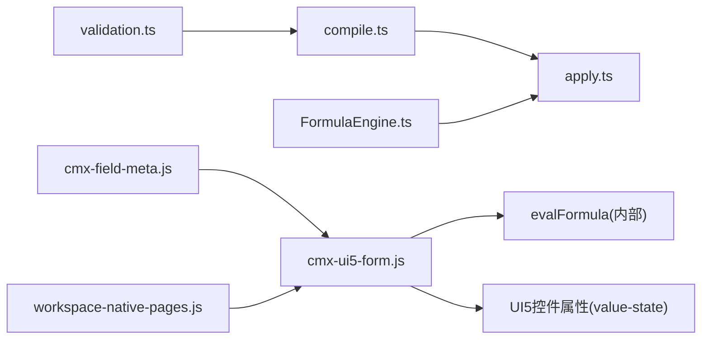

# 验证与格式化

<cite>
**本文引用的文件**
- [validation.ts](file://cmx-mega-sheet/src/core/validation.ts)
- [compile.ts](file://cmx-mega-sheet/src/render/numFmt/compile.ts)
- [apply.ts](file://cmx-mega-sheet/src/render/numFmt/apply.ts)
- [FormulaEngine.ts](file://cmx-mega-sheet/src/formula/Formul aEngine.ts)
- [cmx-ui5-form.js](file://packages/cmx-data-comp/src/components/cmx-ui5-form.js)
- [cmx-field-meta.js](file://packages/cmx-data-comp/src/lib/cmx-field-meta.js)
- [workspace-native-pages.js](file://CMXPortalManager/src/lib/workspace-native-pages.js)
- [flexible-combination-engine.test.js](file://packages/cmx-data-comp/src/lib/__tests__/flexible-combination-engine.test.js)
- [numFmt.test.ts](file://cmx-mega-sheet/test/numFmt.test.ts)
</cite>

## 目录
1. [简介](#简介)
2. [项目结构](#项目结构)
3. [核心组件](#核心组件)
4. [架构总览](#架构总览)
5. [详细组件分析](#详细组件分析)
6. [依赖关系分析](#依赖关系分析)
7. [性能考虑](#性能考虑)
8. [故障排查指南](#故障排查指南)
9. [结论](#结论)
10. [附录](#附录)

## 简介
本文件面向 CMX 验证与格式化系统，覆盖以下主题：
- 字段验证规则定义、内置验证器与自定义验证器的实现方式
- 数值与日期格式化的配置与使用，以及自定义格式函数
- 公式计算引擎的功能与扩展机制
- 验证消息的本地化、错误提示显示与用户交互反馈
- 复杂验证场景示例与性能优化建议

该系统由“表单级验证”“表格数据验证”“数字/日期格式化”“公式引擎”四部分组成，分别服务于 UI 表单、电子表格渲染与计算。

## 项目结构
- 表单验证与展示：位于 packages/cmx-data-comp 中，负责字段校验、表达式求值、错误态设置与事件派发。
- 表格数据验证：位于 cmx-mega-sheet 的 core/validation.ts，提供纯逻辑的数据验证能力。
- 数字/日期格式化：位于 cmx-mega-sheet 的 render/numFmt，包含格式串编译与渲染。
- 公式引擎：位于 cmx-mega-sheet 的 formula，提供解析、依赖图、全量/增量重算与扩展点。
- 错误呈现与本地化：门户层对错误进行友好呈现；字段标题等支持多语言候选键匹配。



图表来源
- [cmx-ui5-form.js:690-748](file://packages/cmx-data-comp/src/components/cmx-ui5-form.js#L690-L748)
- [cmx-field-meta.js:1-62](file://packages/cmx-data-comp/src/lib/cmx-field-meta.js#L1-L62)
- [validation.ts:1-87](file://cmx-mega-sheet/src/core/validation.ts#L1-L87)
- [compile.ts:1-79](file://cmx-mega-sheet/src/render/numFmt/compile.ts#L1-L79)
- [apply.ts:1-75](file://cmx-mega-sheet/src/render/numFmt/apply.ts#L1-L75)
- [FormulaEngine.ts:36-67](file://cmx-mega-sheet/src/formula/Formul aEngine.ts#L36-L67)
- [workspace-native-pages.js:241-266](file://CMXPortalManager/src/lib/workspace-native-pages.js#L241-L266)

章节来源
- [cmx-ui5-form.js:690-748](file://packages/cmx-data-comp/src/components/cmx-ui5-form.js#L690-L748)
- [cmx-field-meta.js:1-62](file://packages/cmx-data-comp/src/lib/cmx-field-meta.js#L1-L62)
- [validation.ts:1-87](file://cmx-mega-sheet/src/core/validation.ts#L1-L87)
- [compile.ts:1-79](file://cmx-mega-sheet/src/render/numFmt/compile.ts#L1-L79)
- [apply.ts:1-75](file://cmx-mega-sheet/src/render/numFmt/apply.ts#L1-L75)
- [FormulaEngine.ts:36-67](file://cmx-mega-sheet/src/formula/Formul aEngine.ts#L36-L67)
- [workspace-native-pages.js:241-266](file://CMXPortalManager/src/lib/workspace-native-pages.js#L241-L266)

## 核心组件
- 表单验证器（cmx-ui5-form.js）
  - 支持 validateWhen 闸门、validate 为函数或表达式数组、逐条失败取 message。
  - 错误态通过 value-state/value-state-message 与 class 切换，并派发 cmx-ui5-form-invalid 事件。
- 表格数据验证（validation.ts）
  - 支持 list/whole/decimal/date/textLength/custom 类型，operator 支持 between/notBetween/eq/ne/gt/lt/ge/le。
  - allowBlank 控制空值策略；custom 类型通过外部 customEval 回调求值。
- 数字/日期格式化（compile.ts + apply.ts）
  - compileFormat 将格式串编译为 CompiledFormat（含 sections、isGeneral），结果 memo 缓存。
  - applyFormat 根据值类型与条件段选择区段，输出文本与可选颜色；支持百分比、千分位、科学计数、分数、日期、文本等。
- 公式引擎（FormulaEngine.ts）
  - 维护解析缓存、依赖图、全量/增量重算；支持 QM/QC 等报表取值函数；环引用标记 #CIRC!。
- 本地化与错误呈现
  - 字段标题按当前界面语言候选键匹配；门户层对网络不可达等错误做友好空状态呈现。

章节来源
- [cmx-ui5-form.js:690-748](file://packages/cmx-data-comp/src/components/cmx-ui5-form.js#L690-L748)
- [validation.ts:1-87](file://cmx-mega-sheet/src/core/validation.ts#L1-L87)
- [compile.ts:1-79](file://cmx-mega-sheet/src/render/numFmt/compile.ts#L1-L79)
- [apply.ts:1-75](file://cmx-mega-sheet/src/render/numFmt/apply.ts#L1-L75)
- [FormulaEngine.ts:36-67](file://cmx-mega-sheet/src/formula/Formul aEngine.ts#L36-L67)
- [cmx-field-meta.js:1-62](file://packages/cmx-data-comp/src/lib/cmx-field-meta.js#L1-L62)
- [workspace-native-pages.js:241-266](file://CMXPortalManager/src/lib/workspace-native-pages.js#L241-L266)

## 架构总览
下图展示了从输入到验证、格式化与计算的端到端流程。



图表来源
- [cmx-ui5-form.js:690-748](file://packages/cmx-data-comp/src/components/cmx-ui5-form.js#L690-L748)
- [validation.ts:24-65](file://cmx-mega-sheet/src/core/validation.ts#L24-L65)
- [apply.ts:30-75](file://cmx-mega-sheet/src/render/numFmt/apply.ts#L30-L75)
- [FormulaEngine.ts:149-198](file://cmx-mega-sheet/src/formula/Formul aEngine.ts#L149-L198)

## 详细组件分析

### 表单级验证与表达式求值（cmx-ui5-form.js）
- 验证闸门：validateWhen 为真才执行校验。
- 规则形式：
  - 函数式：field.validate(row, val)
  - 表达式数组：[{expr,message}|{test,message}]，逐条校验，首条失败取 message
  - 字符串表达式：通过 _evalExpr 调用 evalFormula
- 错误处理：
  - 设置 value-state/Negative 与 value-state-message
  - 添加 cmx-field-invalid 类名与 title
  - 派发 cmx-ui5-form-invalid 事件，携带 errors 与 row
- 国际化：caption 等字段标题通过 cmx-field-meta.js 的多语言候选键匹配当前界面语言。



图表来源
- [cmx-ui5-form.js:690-748](file://packages/cmx-data-comp/src/components/cmx-ui5-form.js#L690-L748)

章节来源
- [cmx-ui5-form.js:690-748](file://packages/cmx-data-comp/src/components/cmx-ui5-form.js#L690-L748)
- [cmx-field-meta.js:1-62](file://packages/cmx-data-comp/src/lib/cmx-field-meta.js#L1-L62)

### 表格数据验证（validation.ts）
- 支持类型：list、whole、decimal、date、textLength、custom。
- 比较操作符：between、notBetween、eq、ne、gt、lt、ge、le。
- 空值策略：allowBlank 控制是否允许空。
- 自定义验证：通过 customEval(formula) 返回布尔，便于与业务上下文联动。



图表来源
- [validation.ts:24-87](file://cmx-mega-sheet/src/core/validation.ts#L24-L87)

章节来源
- [validation.ts:1-87](file://cmx-mega-sheet/src/core/validation.ts#L1-L87)

### 数字与日期格式化（compile.ts + apply.ts）
- 编译阶段（compile.ts）
  - 将格式串切分为最多 4 个区段（正/负/零/文本），抽取颜色段、条件段、类别与数字子计划。
  - 结果 memo 缓存，避免重复编译。
- 应用阶段（apply.ts）
  - 根据值类型与条件段选择区段，渲染为文本与可选颜色。
  - 支持百分比、千分位、缩放、科学计数、分数、日期、文本等。
  - 通用数字最短表示与布尔值 TRUE/FALSE 兼容旧行为。

```mermaid
classDiagram
class CompiledFormat {
+sections : FmtSection[]
+isGeneral : boolean
}
class FmtSection {
+raw : string
+tokens : FmtToken[]
+kind : "number|date|text|general"
+color? : string
+condition? : {op,value}
+decimals : int
+intMin : int
+hasThousands : boolean
+scale : number
+hasPercent : boolean
+hasSci : boolean
+sciExpDigits : int
+hasFraction : boolean
+fracDenomDigits : int
}
class FmtToken {
+t : "dig|dot|comma|pct|sci|date|lit|at|fill|skip|slash"
+c? : string
+s? : string
+code? : string
}
CompiledFormat --> FmtSection : "包含"
FmtSection --> FmtToken : "包含"
```

图表来源
- [compile.ts:12-43](file://cmx-mega-sheet/src/render/numFmt/compile.ts#L12-L43)
- [compile.ts:128-250](file://cmx-mega-sheet/src/render/numFmt/compile.ts#L128-L250)
- [apply.ts:30-75](file://cmx-mega-sheet/src/render/numFmt/apply.ts#L30-L75)

章节来源
- [compile.ts:1-79](file://cmx-mega-sheet/src/render/numFmt/compile.ts#L1-L79)
- [apply.ts:1-200](file://cmx-mega-sheet/src/render/numFmt/apply.ts#L1-L200)
- [numFmt.test.ts:1-164](file://cmx-mega-sheet/test/numFmt.test.ts#L1-L164)

### 公式计算引擎（FormulaEngine.ts）
- 职责：扫描工作簿所有公式格，解析 AST，构建依赖图，拓扑排序后求值回填；检测循环引用并标记 #CIRC!。
- 缓存：解析缓存 parseCache 提升重复公式性能。
- 增量重算：recalcCells 仅重算受影响闭包，大表编辑显著降低开销。
- 扩展点：
  - 自定义函数注册表（BuiltinRegistry）
  - 报表取值函数（QM/QC 等）通过 ReportValueMap 注入值并触发重算
  - 直接求值 evaluateFormula 供预览/聚合使用



图表来源
- [FormulaEngine.ts:36-67](file://cmx-mega-sheet/src/formula/Formul aEngine.ts#L36-L67)
- [FormulaEngine.ts:149-198](file://cmx-mega-sheet/src/formula/Formul aEngine.ts#L149-L198)
- [FormulaEngine.ts:206-243](file://cmx-mega-sheet/src/formula/Formul aEngine.ts#L206-L243)

章节来源
- [FormulaEngine.ts:1-289](file://cmx-mega-sheet/src/formula/Formul aEngine.ts#L1-L289)

### 验证消息本地化与错误提示
- 字段标题本地化：cmx-field-meta.js 读取当前界面语言，生成候选键链（如 zh_CN/zh-CN/zh），优先匹配 caption 对象中的对应键。
- 表单错误提示：cmx-ui5-form.js 设置 value-state 与 value-state-message，并派发 invalid 事件，上层可订阅统一处理。
- 门户错误空状态：workspace-native-pages.js 对服务不可达等错误进行友好文案与重试引导，技术细节折叠至详情。

章节来源
- [cmx-field-meta.js:1-62](file://packages/cmx-data-comp/src/lib/cmx-field-meta.js#L1-L62)
- [cmx-ui5-form.js:690-748](file://packages/cmx-data-comp/src/components/cmx-ui5-form.js#L690-L748)
- [workspace-native-pages.js:241-266](file://CMXPortalManager/src/lib/workspace-native-pages.js#L241-L266)

### 复杂验证场景示例
- 正则与必填组合：pattern 与 validations 同时存在时，先运行 validations，再追加 pattern 函数式规则；空值放过，不匹配拦截。
- 多规则顺序：数组形式的 validate 规则按序执行，首条失败即停止并取其 message。
- 条件段格式化：使用 [>=阈值] 条件段对不同区间值应用不同样式与文案。

章节来源
- [flexible-combination-engine.test.js:324-341](file://packages/cmx-data-comp/src/lib/__tests__/flexible-combination-engine.test.js#L324-L341)
- [numFmt.test.ts:18-42](file://cmx-mega-sheet/test/numFmt.test.ts#L18-L42)

## 依赖关系分析
- 表单层依赖表达式求值与 UI5 控件属性，用于即时校验与错误态展示。
- 表格验证与格式化相互独立但共同服务于单元格编辑与显示。
- 公式引擎与格式化无直接耦合，但计算结果会参与格式化流程。
- 本地化模块被表单层用于标题与提示文案。



图表来源
- [cmx-ui5-form.js:690-748](file://packages/cmx-data-comp/src/components/cmx-ui5-form.js#L690-L748)
- [validation.ts:1-87](file://cmx-mega-sheet/src/core/validation.ts#L1-L87)
- [compile.ts:1-79](file://cmx-mega-sheet/src/render/numFmt/compile.ts#L1-L79)
- [apply.ts:1-75](file://cmx-mega-sheet/src/render/numFmt/apply.ts#L1-L75)
- [FormulaEngine.ts:36-67](file://cmx-mega-sheet/src/formula/Formul aEngine.ts#L36-L67)
- [cmx-field-meta.js:1-62](file://packages/cmx-data-comp/src/lib/cmx-field-meta.js#L1-L62)
- [workspace-native-pages.js:241-266](file://CMXPortalManager/src/lib/workspace-native-pages.js#L241-L266)

章节来源
- [cmx-ui5-form.js:690-748](file://packages/cmx-data-comp/src/components/cmx-ui5-form.js#L690-L748)
- [validation.ts:1-87](file://cmx-mega-sheet/src/core/validation.ts#L1-L87)
- [compile.ts:1-79](file://cmx-mega-sheet/src/render/numFmt/compile.ts#L1-L79)
- [apply.ts:1-75](file://cmx-mega-sheet/src/render/numFmt/apply.ts#L1-L75)
- [FormulaEngine.ts:36-67](file://cmx-mega-sheet/src/formula/Formul aEngine.ts#L36-L67)
- [cmx-field-meta.js:1-62](file://packages/cmx-data-comp/src/lib/cmx-field-meta.js#L1-L62)
- [workspace-native-pages.js:241-266](file://CMXPortalManager/src/lib/workspace-native-pages.js#L241-L266)

## 性能考虑
- 格式化编译缓存：compileFormat 对格式串进行 memo，避免重复解析与 token 化。
- 公式解析缓存：FormulaEngine.parseCache 缓存 AST，减少重复解析成本。
- 增量重算：recalcCells 基于依赖图仅重算受影响闭包，适合大表频繁编辑场景。
- 区域引用钳制：整列/整行引用在 getRangeValues 中钳到 sheet 维度，防止遍历百万格。
- 建议
  - 复用相同格式串以减少编译次数
  - 将复杂校验拆分为多条简单规则，提高可读性与可测试性
  - 谨慎使用 volatile 函数，避免每次增量重算都纳入计算集

章节来源
- [compile.ts:68-79](file://cmx-mega-sheet/src/render/numFmt/compile.ts#L68-L79)
- [FormulaEngine.ts:69-80](file://cmx-mega-sheet/src/formula/Formul aEngine.ts#L69-L80)
- [FormulaEngine.ts:206-243](file://cmx-mega-sheet/src/formula/Formul aEngine.ts#L206-L243)
- [FormulaEngine.ts:82-115](file://cmx-mega-sheet/src/formula/Formul aEngine.ts#L82-L115)

## 故障排查指南
- 表单校验未生效
  - 检查 validateWhen 是否为真；确认 validate 为函数或表达式数组且至少一条失败能产出 message。
  - 查看 cmx-ui5-form-invalid 事件是否被上层订阅处理。
- 表格数据验证失败
  - 核对 rule.type 与 operator 是否匹配；确认 allowBlank 是否符合预期。
  - 对于 custom 类型，确保 customEval 已正确传入并返回布尔。
- 格式化异常
  - 确认格式串语法合法；检查条件段与区段顺序是否正确。
  - 使用 numFmt.test.ts 中的用例作为对照，逐步缩小问题范围。
- 公式计算异常
  - 出现 #CIRC! 表示循环引用；检查依赖图与公式间引用关系。
  - 出现 #VALUE! 或 #NAME? 表示求值错误或名称未解析；检查函数注册与参数类型。

章节来源
- [cmx-ui5-form.js:690-748](file://packages/cmx-data-comp/src/components/cmx-ui5-form.js#L690-L748)
- [validation.ts:24-87](file://cmx-mega-sheet/src/core/validation.ts#L24-L87)
- [numFmt.test.ts:1-164](file://cmx-mega-sheet/test/numFmt.test.ts#L1-L164)
- [FormulaEngine.ts:149-198](file://cmx-mega-sheet/src/formula/Formul aEngine.ts#L149-L198)

## 结论
CMX 验证与格式化系统通过“表单级验证 + 表格数据验证 + 数字/日期格式化 + 公式引擎”的组合，提供了完整的前端数据质量保障与展示能力。其关键优势包括：
- 灵活的验证规则与本地化消息
- Excel 兼容的数字/日期格式串编译器与渲染器
- 高性能的公式解析与增量重算
- 友好的错误呈现与用户交互反馈

在实际项目中，建议结合业务场景选择合适的验证策略与格式化方案，充分利用缓存与增量重算提升性能，并通过事件与本地化机制完善用户体验。

## 附录
- 常用验证类型与操作符参考：见 validation.ts
- 常用格式串模式参考：见 numFmt.test.ts
- 公式扩展点：见 FormulaEngine.ts 的 registry 与 ReportValueMap