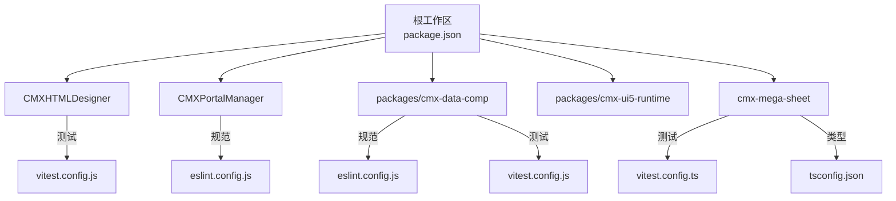
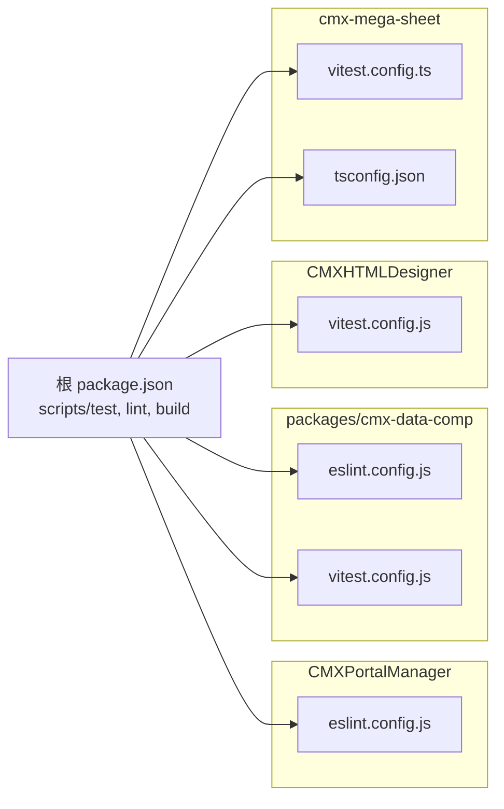
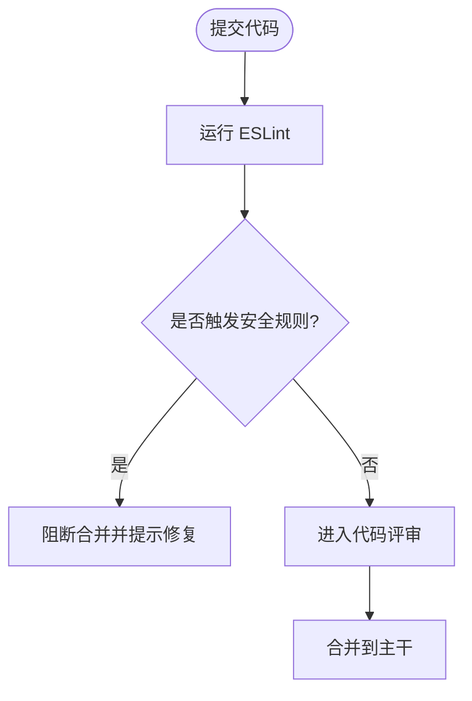
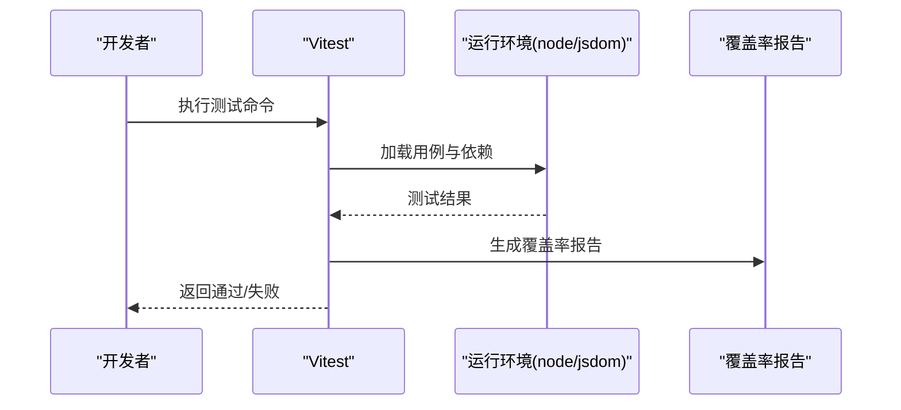
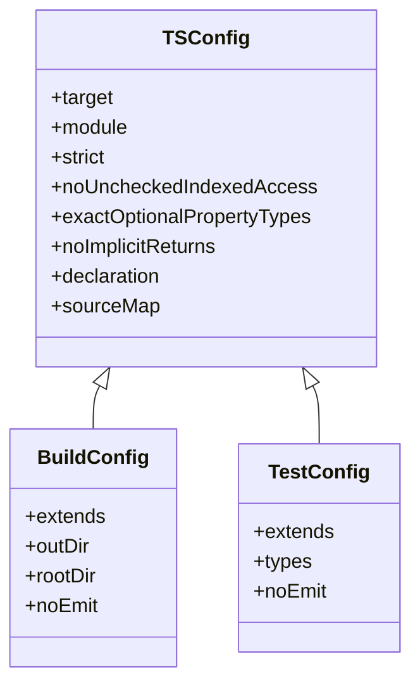
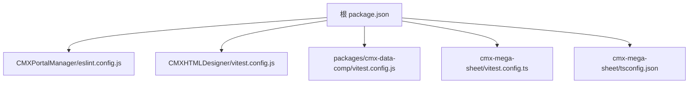

# 代码质量与重构

<cite>
**本文引用的文件**
- [package.json](file://package.json)
- [CMXPortalManager/eslint.config.js](file://CMXPortalManager/eslint.config.js)
- [packages/cmx-data-comp/eslint.config.js](file://packages/cmx-data-comp/eslint.config.js)
- [CMXHTMLDesigner/vitest.config.js](file://CMXHTMLDesigner/vitest.config.js)
- [packages/cmx-data-comp/vitest.config.js](file://packages/cmx-data-comp/vitest.config.js)
- [cmx-mega-sheet/vitest.config.ts](file://cmx-mega-sheet/vitest.config.ts)
- [cmx-mega-sheet/tsconfig.json](file://cmx-mega-sheet/tsconfig.json)
- [cmx-mega-sheet/tsconfig.build.json](file://cmx-mega-sheet/tsconfig.build.json)
- [cmx-mega-sheet/tsconfig.test.json](file://cmx-mega-sheet/tsconfig.test.json)
</cite>

## 目录
1. [简介](#简介)
2. [项目结构](#项目结构)
3. [核心组件](#核心组件)
4. [架构总览](#架构总览)
5. [详细组件分析](#详细组件分析)
6. [依赖分析](#依赖分析)
7. [性能考虑](#性能考虑)
8. [故障排查指南](#故障排查指南)
9. [结论](#结论)
10. [附录](#附录)

## 简介
本文件面向 CMX 企业门户平台，沉淀“代码质量与重构”的最佳实践。内容覆盖：
- 代码规范制定与执行：ESLint 规则、Prettier 格式化（建议）、TypeScript 类型约束
- 测试体系：单元测试、集成测试、端到端测试的编写与维护
- 代码审查流程、静态分析与质量门禁
- 技术债务识别、重构策略与渐进式改进
- 模块化设计原则、依赖管理与版本升级策略
- 基于仓库现有配置与实践的可落地方案

## 项目结构
仓库采用 monorepo 组织，根 package.json 通过 workspaces 管理多个子工程：
- packages/*：可复用库（如 cmx-data-comp、cmx-ui5-runtime）
- CMXHTMLDesigner：页面设计器前端
- CMXPortalManager：门户应用前端
- cmx-mega-sheet：高性能表格引擎（TypeScript）

图示来源
- [package.json:1-25](file://package.json#L1-L25)
- [CMXHTMLDesigner/vitest.config.js:1-15](file://CMXHTMLDesigner/vitest.config.js#L1-L15)
- [CMXPortalManager/eslint.config.js:1-125](file://CMXPortalManager/eslint.config.js#L1-L125)
- [packages/cmx-data-comp/eslint.config.js:1-71](file://packages/cmx-data-comp/eslint.config.js#L1-L71)
- [packages/cmx-data-comp/vitest.config.js:1-16](file://packages/cmx-data-comp/vitest.config.js#L1-L16)
- [cmx-mega-sheet/vitest.config.ts:1-17](file://cmx-mega-sheet/vitest.config.ts#L1-L17)
- [cmx-mega-sheet/tsconfig.json:1-27](file://cmx-mega-sheet/tsconfig.json#L1-L27)

章节来源
- [package.json:1-25](file://package.json#L1-L25)

## 核心组件
围绕代码质量与重构，本项目已具备以下关键能力：
- ESLint 安全与一致性规则：禁止裸 innerHTML/outerHTML/insertAdjacentHTML/document.write；禁止 eval/new Function；统一转义函数导入；限制原生 alert/confirm/prompt
- 测试框架 Vitest：多工程独立配置，支持 jsdom/node 环境、覆盖率阈值与报告
- TypeScript 严格模式：strict、noUncheckedIndexedAccess、exactOptionalPropertyTypes、noImplicitReturns 等
- Monorepo 脚本：统一的 test/lint/build 入口，便于在 CI 中串联质量门禁

章节来源
- [CMXPortalManager/eslint.config.js:1-125](file://CMXPortalManager/eslint.config.js#L1-L125)
- [packages/cmx-data-comp/eslint.config.js:1-71](file://packages/cmx-data-comp/eslint.config.js#L1-L71)
- [CMXHTMLDesigner/vitest.config.js:1-15](file://CMXHTMLDesigner/vitest.config.js#L1-L15)
- [packages/cmx-data-comp/vitest.config.js:1-16](file://packages/cmx-data-comp/vitest.config.js#L1-L16)
- [cmx-mega-sheet/vitest.config.ts:1-17](file://cmx-mega-sheet/vitest.config.ts#L1-L17)
- [cmx-mega-sheet/tsconfig.json:1-27](file://cmx-mega-sheet/tsconfig.json#L1-L27)

## 架构总览
下图展示质量工具在各子工程中的分布与协作关系：ESLint 负责静态检查，Vitest 负责单元/集成测试，TypeScript 提供编译期类型保障，根脚本串联执行。

图示来源
- [package.json:16-25](file://package.json#L16-L25)
- [CMXPortalManager/eslint.config.js:1-125](file://CMXPortalManager/eslint.config.js#L1-L125)
- [packages/cmx-data-comp/eslint.config.js:1-71](file://packages/cmx-data-comp/eslint.config.js#L1-L71)
- [packages/cmx-data-comp/vitest.config.js:1-16](file://packages/cmx-data-comp/vitest.config.js#L1-L16)
- [CMXHTMLDesigner/vitest.config.js:1-15](file://CMXHTMLDesigner/vitest.config.js#L1-L15)
- [cmx-mega-sheet/vitest.config.ts:1-17](file://cmx-mega-sheet/vitest.config.ts#L1-L17)
- [cmx-mega-sheet/tsconfig.json:1-27](file://cmx-mega-sheet/tsconfig.json#L1-L27)

## 详细组件分析

### 静态代码分析（ESLint）
- 安全优先：禁止内联 HTML 注入与动态执行字符串，强制使用统一转义函数或 DOM API
- 一致性与可维护性：限制原生弹窗 API，统一 UI 交互方式；禁用未使用变量与空块
- 差异化处理：对特定目录（如 ai-workbench、escape 工具）做精准豁免，避免误伤

图示来源
- [CMXPortalManager/eslint.config.js:1-125](file://CMXPortalManager/eslint.config.js#L1-L125)
- [packages/cmx-data-comp/eslint.config.js:1-71](file://packages/cmx-data-comp/eslint.config.js#L1-L71)

章节来源
- [CMXPortalManager/eslint.config.js:1-125](file://CMXPortalManager/eslint.config.js#L1-L125)
- [packages/cmx-data-comp/eslint.config.js:1-71](file://packages/cmx-data-comp/eslint.config.js#L1-L71)

### 测试体系（Vitest）
- 环境选择：无 DOM 逻辑优先 node 环境以提升速度；需要 DOM 的用例按文件覆盖为 jsdom
- 覆盖率：启用 v8 提供者，输出 text 与 lcov/html 报告，可按需设置阈值
- 范围控制：通过 include/exclude 精确控制被测源文件与排除项

图示来源
- [CMXHTMLDesigner/vitest.config.js:1-15](file://CMXHTMLDesigner/vitest.config.js#L1-L15)
- [packages/cmx-data-comp/vitest.config.js:1-16](file://packages/cmx-data-comp/vitest.config.js#L1-L16)
- [cmx-mega-sheet/vitest.config.ts:1-17](file://cmx-mega-sheet/vitest.config.ts#L1-L17)

章节来源
- [CMXHTMLDesigner/vitest.config.js:1-15](file://CMXHTMLDesigner/vitest.config.js#L1-L15)
- [packages/cmx-data-comp/vitest.config.js:1-16](file://packages/cmx-data-comp/vitest.config.js#L1-L16)
- [cmx-mega-sheet/vitest.config.ts:1-17](file://cmx-mega-sheet/vitest.config.ts#L1-L17)

### 类型系统（TypeScript）
- 严格模式：开启 strict、noUncheckedIndexedAccess、exactOptionalPropertyTypes、noImplicitReturns 等，提升类型安全性
- 构建与测试分离：tsconfig.build.json 控制产物输出；tsconfig.test.json 允许测试依赖 Node 内置类型
- 模块与声明：isolatedModules、verbatimModuleSyntax、declaration/sourceMap 利于工程化与调试

图示来源
- [cmx-mega-sheet/tsconfig.json:1-27](file://cmx-mega-sheet/tsconfig.json#L1-L27)
- [cmx-mega-sheet/tsconfig.build.json:1-10](file://cmx-mega-sheet/tsconfig.build.json#L1-L10)
- [cmx-mega-sheet/tsconfig.test.json:1-10](file://cmx-mega-sheet/tsconfig.test.json#L1-L10)

章节来源
- [cmx-mega-sheet/tsconfig.json:1-27](file://cmx-mega-sheet/tsconfig.json#L1-L27)
- [cmx-mega-sheet/tsconfig.build.json:1-10](file://cmx-mega-sheet/tsconfig.build.json#L1-L10)
- [cmx-mega-sheet/tsconfig.test.json:1-10](file://cmx-mega-sheet/tsconfig.test.json#L1-L10)

### 质量门禁与持续集成建议
- 本地开发：在 pre-commit 阶段运行 ESLint 与基础测试，快速反馈问题
- CI 流水线：
  - 并行执行各子工程的 lint 与 test
  - 收集覆盖率报告并校验阈值（可按模块逐步提高）
  - 将 ESLint 错误与测试失败作为阻断条件
- 分支保护：要求通过质量门禁后方可合并

章节来源
- [package.json:16-25](file://package.json#L16-L25)

### 重构策略与技术债务治理
- 渐进式改进：以单文件或单模块为单位，先补测试再重构，确保行为不变
- 安全先行：优先消除裸 innerHTML/eval/new Function 等高风险点
- 解耦与职责单一：拆分大组件与大函数，提取可复用的工具与模型
- 文档与契约：为公共接口补充类型与注释，明确输入输出与副作用
- 度量驱动：用覆盖率与复杂度指标跟踪改进效果

[本节为通用方法论，不直接分析具体文件]

### 模块化设计与依赖管理
- 包边界清晰：UI 组件、数据模型、渲染引擎分层，减少跨层耦合
- 依赖收敛：通过 overrides 锁定关键依赖版本，降低冲突风险
- 发布策略：库包独立版本化，应用按需引入；升级前进行回归测试

章节来源
- [package.json:1-15](file://package.json#L1-L15)

## 依赖分析
- 根工作区统一管理 scripts，集中触发各子工程的质量任务
- 子工程各自维护 eslint/vitest/tsconfig，保证灵活性与隔离性
- 通过 overrides 锁定 vitest 与 graphql 等关键依赖版本，提升稳定性

图示来源
- [package.json:16-25](file://package.json#L16-L25)
- [CMXPortalManager/eslint.config.js:1-125](file://CMXPortalManager/eslint.config.js#L1-L125)
- [CMXHTMLDesigner/vitest.config.js:1-15](file://CMXHTMLDesigner/vitest.config.js#L1-L15)
- [packages/cmx-data-comp/vitest.config.js:1-16](file://packages/cmx-data-comp/vitest.config.js#L1-L16)
- [cmx-mega-sheet/vitest.config.ts:1-17](file://cmx-mega-sheet/vitest.config.ts#L1-L17)
- [cmx-mega-sheet/tsconfig.json:1-27](file://cmx-mega-sheet/tsconfig.json#L1-L27)

章节来源
- [package.json:1-25](file://package.json#L1-L25)

## 性能考虑
- 测试环境优化：无 DOM 逻辑使用 node 环境，缩短测试时间
- 覆盖率采集：仅对核心源码路径采集，避免无关文件拖慢构建
- 构建产物：TS 开启 sourceMap 与 declaration，便于定位问题与二次消费

[本节为通用指导，不直接分析具体文件]

## 故障排查指南
- 静态检查失败：根据 ESLint 报错定位到具体语法或调用，优先修复安全相关规则
- 测试失败：结合 Vitest 输出与覆盖率报告，缩小问题范围；必要时切换 jsdom 环境验证 DOM 相关逻辑
- 类型错误：依据 tsconfig 严格选项逐一修正类型推断与返回值
- 覆盖率不足：补充边界用例与异常路径，逐步提升阈值

章节来源
- [CMXPortalManager/eslint.config.js:1-125](file://CMXPortalManager/eslint.config.js#L1-L125)
- [packages/cmx-data-comp/eslint.config.js:1-71](file://packages/cmx-data-comp/eslint.config.js#L1-L71)
- [CMXHTMLDesigner/vitest.config.js:1-15](file://CMXHTMLDesigner/vitest.config.js#L1-L15)
- [packages/cmx-data-comp/vitest.config.js:1-16](file://packages/cmx-data-comp/vitest.config.js#L1-L16)
- [cmx-mega-sheet/vitest.config.ts:1-17](file://cmx-mega-sheet/vitest.config.ts#L1-L17)
- [cmx-mega-sheet/tsconfig.json:1-27](file://cmx-mega-sheet/tsconfig.json#L1-L27)

## 结论
本项目已建立以 ESLint 安全规则为核心、Vitest 测试与 TypeScript 类型约束为支撑的代码质量体系。建议在现有基础上：
- 将质量门禁固化到 CI，并以覆盖率阈值作为合并门槛
- 持续推进高风险代码的重构与测试补齐
- 保持依赖版本收敛与分步升级策略，降低回归风险

[本节为总结性内容，不直接分析具体文件]

## 附录
- 建议引入 Prettier 统一格式风格，并与 ESLint 协同，形成“格式化+静态检查”双保险
- 为公共 API 补充 JSDoc/类型定义，提升可发现性与可维护性
- 建立技术债看板，按优先级与影响面排期治理

[本节为通用建议，不直接分析具体文件]