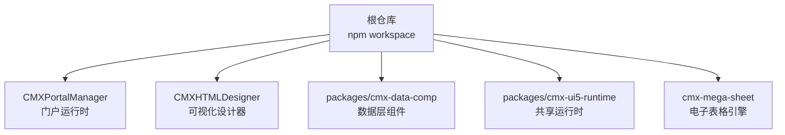
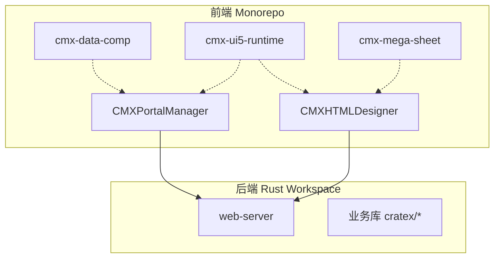
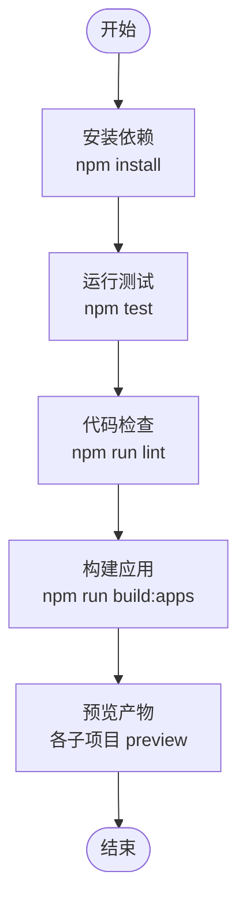
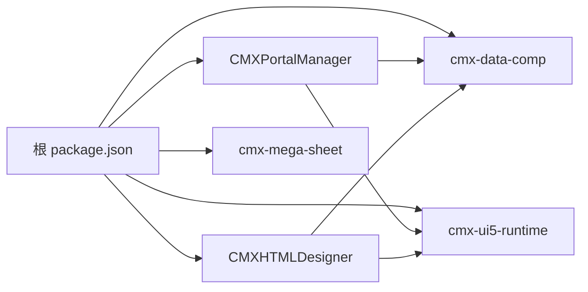

# 团队协作规范

<cite>
**本文引用的文件**
- [README.md](file://README.md)
- [CONTRIBUTING.md](file://CONTRIBUTING.md)
- [package.json](file://package.json)
- [.npmrc](file://.npmrc)
- [CMXPortalManager/package.json](file://CMXPortalManager/package.json)
- [CMXHTMLDesigner/package.json](file://CMXHTMLDesigner/package.json)
- [cmx-mega-sheet/package.json](file://cmx-mega-sheet/package.json)
- [CMXHTMLDesigner/vitest.config.js](file://CMXHTMLDesigner/vitest.config.js)
- [cmx-mega-sheet/vitest.config.ts](file://cmx-mega-sheet/vitest.config.ts)
</cite>

## 目录
1. [简介](#简介)
2. [项目结构](#项目结构)
3. [核心组件](#核心组件)
4. [架构总览](#架构总览)
5. [详细组件分析](#详细组件分析)
6. [依赖分析](#依赖分析)
7. [性能与构建优化](#性能与构建优化)
8. [故障排查指南](#故障排查指南)
9. [结论](#结论)
10. [附录](#附录)

## 简介
本规范面向 CMX 企业门户平台的团队协作，覆盖 Git 工作流、分支管理、提交规范、Monorepo 项目管理、依赖版本控制、发布流程、文档与 API 维护、知识库建设、代码审查、问题跟踪、知识分享机制，以及开发环境配置、构建部署与 CI/CD 流水线设置。目标是让大型团队在 Monorepo 中高效协作，保证质量、可追溯性与可复现的交付。

## 项目结构
本项目为 npm workspace Monorepo，包含：
- CMXPortalManager（门户运行时）
- CMXHTMLDesigner（可视化设计器）
- packages/cmx-data-comp（数据层 Web Components）
- packages/cmx-ui5-runtime（共享 UI5/Tabler 运行时）
- cmx-mega-sheet（自研电子表格引擎）

根 package.json 统一声明 workspaces、脚本与依赖覆盖；各子项目独立维护自己的 scripts、devDependencies 与测试配置。

图表来源
- [package.json:6-10](file://package.json#L6-L10)
- [README.md:10-17](file://README.md#L10-L17)

章节来源
- [README.md:10-17](file://README.md#L10-L17)
- [package.json:1-39](file://package.json#L1-L39)

## 核心组件
- 门户运行时（CMXPortalManager）：提供路由 /portal/，集成 UI5 WebComponents、CodeMirror、Fastify 等能力，复用 cmx-data-comp 与 cmx-ui5-runtime。
- 可视化设计器（CMXHTMLDesigner）：提供路由 /html/，用于页面元数据驱动的设计与预览，使用 Vitest 进行单元测试与覆盖率收集。
- 数据层组件（cmx-data-comp）：主从协调、列模型、数据集、增量 changeset 等通用能力，被多个应用复用。
- 共享运行时（cmx-ui5-runtime）：UI5/Tabler 主题与本地化等共享能力，供多应用构建时引用。
- 电子表格引擎（cmx-mega-sheet）：纯 TypeScript/Web Components 实现的表格引擎，具备独立的构建与测试配置。

章节来源
- [README.md:10-17](file://README.md#L10-L17)
- [CMXPortalManager/package.json:1-62](file://CMXPortalManager/package.json#L1-L62)
- [CMXHTMLDesigner/package.json:1-39](file://CMXHTMLDesigner/package.json#L1-L39)
- [cmx-mega-sheet/package.json:1-31](file://cmx-mega-sheet/package.json#L1-L31)

## 架构总览
前端 Monorepo 与后端 Rust Workspace（cmx-container）协同：前端通过同源托管或反向代理访问后端服务。构建产物由 Vite 生成，测试使用 Vitest，Lint 使用 ESLint。

图表来源
- [README.md:45-55](file://README.md#L45-L55)
- [CMXPortalManager/package.json:24-53](file://CMXPortalManager/package.json#L24-L53)
- [CMXHTMLDesigner/package.json:14-30](file://CMXHTMLDesigner/package.json#L14-L30)

## 详细组件分析

### Git 工作流与分支策略
- 分支命名
  - 特性分支：feat/<简述>
  - 修复分支：fix/<简述>
  - 其他：docs、refactor、chore 等按 Conventional Commits 语义
- 分支保护
  - main 仅允许通过 PR 合并，至少一名 Reviewer 批准
  - 强制运行 lint/test/build 检查
- 合并策略
  - 推荐 Squash Merge 保持主线整洁；也可使用 Rebase Merge 保留历史
  - 大变更建议拆分为小 PR，便于评审与回滚

章节来源
- [CONTRIBUTING.md:21-24](file://CONTRIBUTING.md#L21-L24)

### 代码提交规范
- 提交信息遵循 Conventional Commits：feat(scope): ... / fix(scope): ... / docs: ... / refactor: ...
- 一个 PR 聚焦一件事；附带测试；破坏性变更需在 PR 描述显式标注
- 禁止提交敏感信息、二进制、node_modules、dist、target、本地配置

章节来源
- [CONTRIBUTING.md:21-29](file://CONTRIBUTING.md#L21-L29)

### 代码审查流程
- 所有变更必须通过 Pull Request 审查
- 审查要点
  - 功能正确性与边界条件
  - 可读性与一致性（命名、注释密度、惯用法）
  - 测试覆盖与回归用例
  - 安全与合规（不提交凭据、许可证合规）
- 自动化门禁
  - 提交前必过：前端 npm test、npm run lint；后端 cargo test、cargo clippy、cargo fmt --check

章节来源
- [CONTRIBUTING.md:9-19](file://CONTRIBUTING.md#L9-L19)
- [CONTRIBUTING.md:26-29](file://CONTRIBUTING.md#L26-L29)

### 问题跟踪与知识分享
- 一般 bug/需求：GitHub Issue
- 安全问题：走私有渠道，勿开公开 Issue
- 知识沉淀
  - 将方案、复盘、最佳实践归档至 docs 与 documents 目录
  - 使用 .agents/skills 下的 SKILL 与 references 沉淀组件与流程经验

章节来源
- [CONTRIBUTING.md:41-43](file://CONTRIBUTING.md#L41-L43)

### 开发环境配置
- 后端：Rust + PostgreSQL（见 rust-toolchain.toml）
- 前端：Node + npm（Monorepo 根执行 npm install）
- 私有源：Infragistics 包需配置私有 registry（.npmrc）
- 环境变量：多环境通过 .env.<mode> 与 Vite 模式加载

章节来源
- [CONTRIBUTING.md:5-8](file://CONTRIBUTING.md#L5-L8)
- [.npmrc:1-4](file://.npmrc#L1-L4)
- [CMXPortalManager/package.json:12-12](file://CMXPortalManager/package.json#L12-L12)

### 构建与测试
- 根脚本
  - build:apps：依次构建共享运行时、门户与设计器
  - test：运行 cmx-data-comp 与 cmx-html-designer 测试
  - lint：运行两个子项目的 ESLint
- 子项目
  - CMXPortalManager：Vite 构建，ESLint 校验
  - CMXHTMLDesigner：Vitest 单测与覆盖率（jsdom 环境）
  - cmx-mega-sheet：TypeScript 构建与 Vitest 测试（node 环境）

图表来源
- [package.json:16-25](file://package.json#L16-L25)
- [CMXHTMLDesigner/vitest.config.js:3-13](file://CMXHTMLDesigner/vitest.config.js#L3-L13)
- [cmx-mega-sheet/vitest.config.ts:5-15](file://cmx-mega-sheet/vitest.config.ts#L5-L15)

章节来源
- [package.json:16-25](file://package.json#L16-L25)
- [CMXPortalManager/package.json:8-22](file://CMXPortalManager/package.json#L8-L22)
- [CMXHTMLDesigner/package.json:6-12](file://CMXHTMLDesigner/package.json#L6-L12)
- [cmx-mega-sheet/package.json:18-23](file://cmx-mega-sheet/package.json#L18-L23)

### 依赖版本控制
- 根级 overrides 锁定关键依赖版本（如 vitest、graphql），确保 Monorepo 内一致
- 子项目 devDependencies 与 dependencies 分离，避免污染生产包
- 私有包注册表：Infragistics 通过 .npmrc 指向私有源
- 建议
  - 使用 lockfile（package-lock.json）并纳入版本控制
  - 定期升级依赖，关注安全公告与许可证合规

章节来源
- [package.json:11-15](file://package.json#L11-L15)
- [.npmrc:1-4](file://.npmrc#L1-L4)

### 发布流程管理
- 版本策略
  - 子项目独立版本号（如 cmx-mega-sheet 7.x），应用层按需升级
  - 破坏性变更需提前沟通并在 PR 描述中标注
- 发布步骤
  - 本地验证：test、lint、build、preview
  - 提交 PR 并通过审查
  - 合并后打 Tag 并发布制品（NPM 私有仓或内部制品库）
- 回滚策略
  - 基于 Tag 快速回滚到稳定版本
  - 灰度发布与特性开关配合

章节来源
- [CONTRIBUTING.md:23-24](file://CONTRIBUTING.md#L23-L24)
- [cmx-mega-sheet/package.json:1-10](file://cmx-mega-sheet/package.json#L1-L10)

### 文档编写标准与 API 文档维护
- 文档位置
  - 顶层 docs：架构方案、技术设计、评估报告
  - documents：专题方案、任务细化、问题分析
  - 子项目 docs：模块级说明与接口文档
- 编写规范
  - 标题层级清晰、术语一致
  - 图示优先（流程图、架构图、时序图）
  - 更新同步：代码变更伴随文档更新
- API 文档
  - 接口变更需更新对应 API 文档
  - 示例请求/响应与错误码说明完整

章节来源
- [README.md:45-55](file://README.md#L45-L55)

### 知识库建设
- 使用 .agents/skills 沉淀技能与参考材料
- 每个 Skill 包含 SKILL.md 与 references，形成可检索的知识单元
- 鼓励团队贡献新 Skill 与完善现有参考

章节来源
- [README.md:10-17](file://README.md#L10-L17)

### CI/CD 流水线建议
- 触发条件
  - Push/Pull Request 到 main/feature 分支
- 阶段
  - 安装依赖：npm ci
  - 代码检查：npm run lint
  - 单元测试：npm test（含覆盖率阈值）
  - 构建产物：npm run build:apps
  - 制品归档：上传 dist 与测试报告
- 缓存
  - node_modules、Vite 缓存、Vitest 缓存
- 安全扫描
  - 依赖漏洞扫描、许可证合规检查

[本节为通用建议，不直接分析具体文件]

## 依赖分析
Monorepo 通过 root package.json 统一管理 workspaces 与脚本，子项目通过 * 引用共享包，确保版本一致与复用。

图表来源
- [package.json:6-10](file://package.json#L6-L10)
- [CMXPortalManager/package.json:45-47](file://CMXPortalManager/package.json#L45-L47)
- [CMXHTMLDesigner/package.json:26-28](file://CMXHTMLDesigner/package.json#L26-L28)

章节来源
- [package.json:1-39](file://package.json#L1-L39)
- [CMXPortalManager/package.json:1-62](file://CMXPortalManager/package.json#L1-L62)
- [CMXHTMLDesigner/package.json:1-39](file://CMXHTMLDesigner/package.json#L1-L39)

## 性能与构建优化
- 构建优化
  - 使用 Vite 增量构建与并行构建
  - 合理拆分依赖，减少重复打包
  - 启用 Tree Shaking 与压缩
- 测试优化
  - 使用 jsdom 环境进行 DOM 相关测试
  - 对无 DOM 逻辑使用 node 环境提升速度
- 缓存策略
  - 缓存 node_modules、Vite 缓存、Vitest 缓存
  - 后端 Rust 构建缓存 ~/.cargo 与 target/

章节来源
- [CMXHTMLDesigner/vitest.config.js:3-13](file://CMXHTMLDesigner/vitest.config.js#L3-L13)
- [cmx-mega-sheet/vitest.config.ts:5-15](file://cmx-mega-sheet/vitest.config.ts#L5-L15)

## 故障排查指南
- 常见问题
  - 依赖解析失败：检查 .npmrc 私有源配置与网络连通性
  - 构建失败：确认 Node 版本与 engines 要求
  - 测试失败：检查 Vitest 环境与覆盖率阈值
- 定位方法
  - 查看 CI 日志与本地 npm 输出
  - 逐步缩小范围：先运行单个子项目测试与构建
  - 清理缓存：删除 node_modules、dist、target 后重试

章节来源
- [.npmrc:1-4](file://.npmrc#L1-L4)
- [CMXPortalManager/package.json:5-7](file://CMXPortalManager/package.json#L5-L7)
- [CMXHTMLDesigner/vitest.config.js:3-13](file://CMXHTMLDesigner/vitest.config.js#L3-L13)

## 结论
通过统一的 Monorepo 管理、严格的 Git 工作流与提交规范、完善的测试与构建流程、清晰的文档与知识库建设，CMX 企业门户平台能够在大型团队中实现高效协作与高质量交付。建议持续优化 CI/CD 流水线与依赖治理，保障长期可维护性与安全性。

## 附录
- 快速命令
  - 安装依赖：npm install
  - 运行测试：npm test
  - 代码检查：npm run lint
  - 构建应用：npm run build:apps
  - 启动开发：npm run dev:portal / npm run dev:html

章节来源
- [package.json:16-25](file://package.json#L16-L25)
- [CMXPortalManager/package.json:8-11](file://CMXPortalManager/package.json#L8-L11)
- [CMXHTMLDesigner/package.json:6-9](file://CMXHTMLDesigner/package.json#L6-L9)