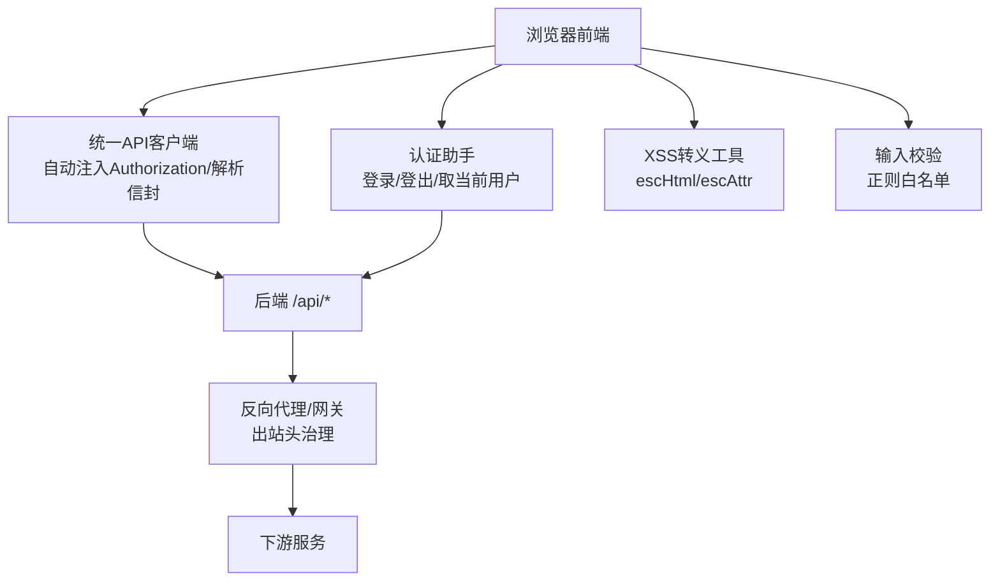
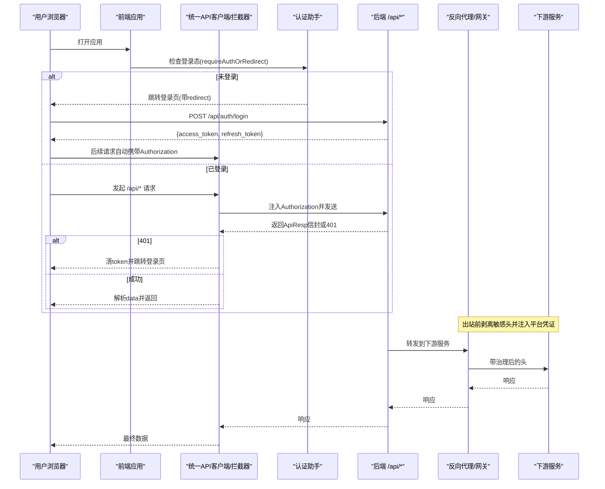
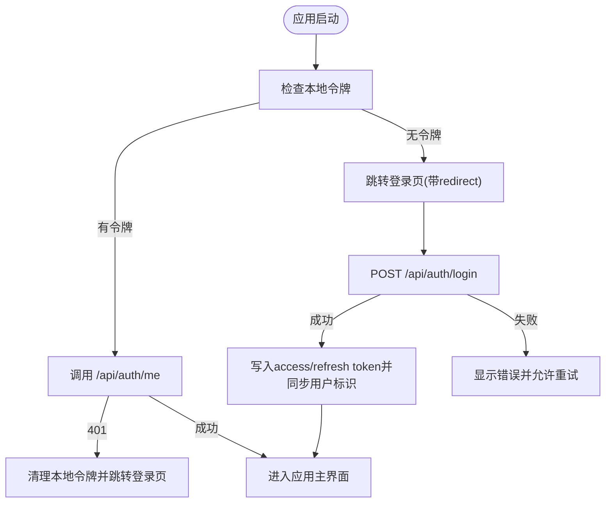
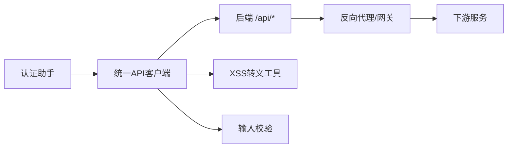

# 安全最佳实践

<cite>
**本文引用的文件**
- [CMXPortalManager/src/lib/api-client.js](file://CMXPortalManager/src/lib/api-client.js)
- [CMXHTMLDesigner/src/lib/api-client.js](file://CMXHTMLDesigner/src/lib/api-client.js)
- [CMXPortalManager/src/lib/auth.js](file://CMXPortalManager/src/lib/auth.js)
- [CMXHTMLDesigner/src/lib/auth.js](file://CMXHTMLDesigner/src/lib/auth.js)
- [CMXPortalManager/src/lib/escape.js](file://CMXPortalManager/src/lib/escape.js)
- [CMXPortalManager/src/api/activities-api.js](file://CMXPortalManager/src/api/activities-api.js)
- [documents/20260822_cmx-flow-rpt_反向代理评估与优化方案.md](file://documents/20260822_cmx-flow-rpt_反向代理评估与优化方案.md)
- [CMXPortalManager/CMXPortalManager-评估报告.md](file://CMXPortalManager/CMXPortalManager-评估报告.md)
</cite>

## 目录
1. [简介](#简介)
2. [项目结构](#项目结构)
3. [核心组件](#核心组件)
4. [架构总览](#架构总览)
5. [详细组件分析](#详细组件分析)
6. [依赖关系分析](#依赖关系分析)
7. [性能与安全权衡](#性能与安全权衡)
8. [故障排查指南](#故障排查指南)
9. [结论](#结论)
10. [附录](#附录)

## 简介
本指南面向 CMX 企业门户平台，围绕用户认证与授权、API 安全防护、跨站脚本（XSS）与跨站请求伪造（CSRF）防护、安全头配置、敏感数据处理与日志脱敏、安全审计、安全编码规范、安全测试与漏洞扫描等方面，提供基于 OWASP 标准与企业级安全要求的实施建议。内容严格依据仓库中前端认证拦截器、令牌管理、输入校验与 XSS 转义等实现进行说明，并结合反向代理出站头的已知风险给出修复与加固路径。

## 项目结构
CMX 门户由多个前端应用组成，其中关键的安全相关能力集中在：
- 统一 API 客户端与全局 fetch 拦截器：负责自动注入 Authorization 头、处理 401 跳转、解析后端 ApiResp 信封。
- 认证助手：封装登录、登出、获取当前用户、回跳登录等流程。
- XSS 转义工具：集中提供 HTML/属性转义函数，避免各组件各自实现导致策略漂移。
- 输入校验：对活动/菜单 ID、图标、页面 ID 等进行白名单正则校验。
- 反向代理出站头治理：识别并修复透传鉴权头重复、Cookie 泄漏等问题。

**图表来源**
- [CMXPortalManager/src/lib/api-client.js:1-259](file://CMXPortalManager/src/lib/api-client.js#L1-L259)
- [CMXHTMLDesigner/src/lib/api-client.js:1-245](file://CMXHTMLDesigner/src/lib/api-client.js#L1-L245)
- [CMXPortalManager/src/lib/auth.js:1-121](file://CMXPortalManager/src/lib/auth.js#L1-L121)
- [CMXHTMLDesigner/src/lib/auth.js:1-100](file://CMXHTMLDesigner/src/lib/auth.js#L1-L100)
- [CMXPortalManager/src/lib/escape.js:1-35](file://CMXPortalManager/src/lib/escape.js#L1-L35)
- [CMXPortalManager/src/api/activities-api.js:1-233](file://CMXPortalManager/src/api/activities-api.js#L1-L233)
- [documents/20260822_cmx-flow-rpt_反向代理评估与优化方案.md:77-239](file://documents/20260822_cmx-flow-rpt_反向代理评估与优化方案.md#L77-L239)

**章节来源**
- [CMXPortalManager/src/lib/api-client.js:1-259](file://CMXPortalManager/src/lib/api-client.js#L1-L259)
- [CMXHTMLDesigner/src/lib/api-client.js:1-245](file://CMXHTMLDesigner/src/lib/api-client.js#L1-L245)
- [CMXPortalManager/src/lib/auth.js:1-121](file://CMXPortalManager/src/lib/auth.js#L1-L121)
- [CMXHTMLDesigner/src/lib/auth.js:1-100](file://CMXHTMLDesigner/src/lib/auth.js#L1-L100)
- [CMXPortalManager/src/lib/escape.js:1-35](file://CMXPortalManager/src/lib/escape.js#L1-L35)
- [CMXPortalManager/src/api/activities-api.js:1-233](file://CMXPortalManager/src/api/activities-api.js#L1-L233)
- [documents/20260822_cmx-flow-rpt_反向代理评估与优化方案.md:77-239](file://documents/20260822_cmx-flow-rpt_反向代理评估与优化方案.md#L77-L239)

## 核心组件
- 统一 API 客户端与全局拦截器
  - 自动为同源 /api/* 请求注入 Authorization: Bearer <token>，非 JSON 响应原样透传。
  - 401 时清除本地 token 并跳转登录页，防止未授权访问继续。
  - 透明解析后端 ApiResp 信封，业务错误映射为非 2xx 且保留 msg/code/data，便于前端展示与结构化错误处理。
  - 支持不同源部署时的 API_BASE 重写，确保跨域场景下 /api/* 正确路由到后端。
- 认证助手
  - 登录调用 /api/auth/login，成功后写入 access_token 与 refresh_token。
  - 登出调用 /api/auth/logout，并在 finally 块中清理本地 token 及用户标识缓存。
  - 获取当前用户信息 /api/auth/me，401 时清理本地状态。
  - 提供 requireAuthOrRedirect 启动门，未登录直接跳转登录页并携带回跳地址。
- XSS 转义工具
  - 提供 escHtml、escAttr、escAttrHtml 三种转义策略，集中管理以避免策略漂移。
- 输入校验
  - 使用正则白名单对活动/菜单 ID、图标、页面 ID 等字段进行严格校验，拒绝非法字符。
- 反向代理出站头治理
  - 识别并修复出站透传中的鉴权头重复问题，防止客户端可控值覆盖平台注入值。
  - 剥离不应透传的敏感头（如 Cookie、X-Tenant、X-User、X-Request-Id），避免凭据泄漏与链路污染。
  - 要求下游服务生产环境强制启用 API Key 校验，封死“配置不全”导致的认证绕过路径。

**章节来源**
- [CMXPortalManager/src/lib/api-client.js:1-259](file://CMXPortalManager/src/lib/api-client.js#L1-L259)
- [CMXHTMLDesigner/src/lib/api-client.js:1-245](file://CMXHTMLDesigner/src/lib/api-client.js#L1-L245)
- [CMXPortalManager/src/lib/auth.js:1-121](file://CMXPortalManager/src/lib/auth.js#L1-L121)
- [CMXHTMLDesigner/src/lib/auth.js:1-100](file://CMXHTMLDesigner/src/lib/auth.js#L1-L100)
- [CMXPortalManager/src/lib/escape.js:1-35](file://CMXPortalManager/src/lib/escape.js#L1-L35)
- [CMXPortalManager/src/api/activities-api.js:1-233](file://CMXPortalManager/src/api/activities-api.js#L1-L233)
- [documents/20260822_cmx-flow-rpt_反向代理评估与优化方案.md:77-239](file://documents/20260822_cmx-flow-rpt_反向代理评估与优化方案.md#L77-L239)

## 架构总览
下图展示了从浏览器发起请求到后端响应的完整安全链路，包括令牌注入、401 处理、信封解析以及反向代理的出站头治理。

**图表来源**
- [CMXPortalManager/src/lib/api-client.js:1-259](file://CMXPortalManager/src/lib/api-client.js#L1-L259)
- [CMXHTMLDesigner/src/lib/api-client.js:1-245](file://CMXHTMLDesigner/src/lib/api-client.js#L1-L245)
- [CMXPortalManager/src/lib/auth.js:1-121](file://CMXPortalManager/src/lib/auth.js#L1-L121)
- [CMXHTMLDesigner/src/lib/auth.js:1-100](file://CMXHTMLDesigner/src/lib/auth.js#L1-L100)
- [documents/20260822_cmx-flow-rpt_反向代理评估与优化方案.md:77-239](file://documents/20260822_cmx-flow-rpt_反向代理评估与优化方案.md#L77-L239)

## 详细组件分析

### 认证与授权机制（JWT 令牌管理与会话安全）
- 令牌存储与注入
  - 访问令牌与刷新令牌存储在 localStorage，键名分别为 cmx_access_token 与 cmx_refresh_token。
  - 统一客户端在 apiFetch 与全局拦截器中为 /api/* 请求注入 Authorization: Bearer <token>，auth 端点不强制注入。
- 登录与登出
  - 登录调用 /api/auth/login，成功后写入令牌；登出调用 /api/auth/logout，并在 finally 中清理本地令牌与用户标识缓存。
- 当前用户与信息同步
  - 通过 /api/auth/me 获取当前用户信息；失败或 401 时清理本地状态。
  - 登录成功后将 user_id 与 username 同步至 localStorage（cmx_user_id/cmx_username），供待办中心等模块按人过滤任务。
- 启动门与回跳
  - requireAuthOrRedirect 在未登录时跳转到登录页并携带 redirect 参数；登录页地址遵循 BASE_URL，避免 base-aware 部署下的 404。
- 401 处理与防回环
  - 401 时清除本地 token 并跳转登录页；跳转逻辑包含防回环保护，避免 401 风暴导致 URL 膨胀。

**图表来源**
- [CMXPortalManager/src/lib/auth.js:1-121](file://CMXPortalManager/src/lib/auth.js#L1-L121)
- [CMXHTMLDesigner/src/lib/auth.js:1-100](file://CMXHTMLDesigner/src/lib/auth.js#L1-L100)
- [CMXPortalManager/src/lib/api-client.js:1-259](file://CMXPortalManager/src/lib/api-client.js#L1-L259)
- [CMXHTMLDesigner/src/lib/api-client.js:1-245](file://CMXHTMLDesigner/src/lib/api-client.js#L1-L245)

**章节来源**
- [CMXPortalManager/src/lib/auth.js:1-121](file://CMXPortalManager/src/lib/auth.js#L1-L121)
- [CMXHTMLDesigner/src/lib/auth.js:1-100](file://CMXHTMLDesigner/src/lib/auth.js#L1-L100)
- [CMXPortalManager/src/lib/api-client.js:1-259](file://CMXPortalManager/src/lib/api-client.js#L1-L259)
- [CMXHTMLDesigner/src/lib/api-client.js:1-245](file://CMXHTMLDesigner/src/lib/api-client.js#L1-L245)

### API 安全防护（请求签名、参数验证与 SQL 注入防护）
- 请求签名
  - 当前前端实现未包含请求签名机制；建议在网关或后端入口引入 HMAC 签名与时间戳校验，防止重放攻击。
- 参数验证
  - 前端已通过正则白名单对活动/菜单 ID、图标、页面 ID 等进行严格校验，降低非法输入带来的风险。
  - 建议在后端对所有入参进行类型、长度、格式与范围校验，采用强类型模型绑定与 Schema 校验（如 Zod）。
- SQL 注入防护
  - 文档指出存在手写 SQL 的场景，但多数为编译期字面量；涉及元数据表名/列名拼接时需进行标识符白名单校验，禁止直接使用用户输入拼写 SQL。
  - 建议全面迁移至参数化查询与 ORM，并对动态标识符进行白名单校验。

**章节来源**
- [CMXPortalManager/src/api/activities-api.js:1-233](file://CMXPortalManager/src/api/activities-api.js#L1-L233)
- [documents/20260822_cmx-flow-rpt_反向代理评估与优化方案.md:77-239](file://documents/20260822_cmx-flow-rpt_反向代理评估与优化方案.md#L77-L239)

### XSS 攻击防护、CSRF 防护与安全头配置
- XSS 防护
  - 提供统一的 escHtml、escAttr、escAttrHtml 转义函数，避免各组件自行实现导致策略漂移。
  - 建议在前端渲染层强制使用转义函数输出用户可控数据，禁用 innerHTML/insertAdjacentHTML 等危险 API。
- CSRF 防护
  - 当前实现主要依赖 Bearer Token 与同源策略；若使用 Cookie 会话，需在后端启用 SameSite、Secure、HttpOnly 并配合 CSRF Token。
- 安全头配置
  - 建议在后端或网关设置 Content-Security-Policy、Strict-Transport-Security、X-Content-Type-Options、X-Frame-Options 等安全头。
  - 文档示例提供了 CSP 的基本配置思路，可按站点需求细化 script-src、style-src、connect-src 等指令。

**章节来源**
- [CMXPortalManager/src/lib/escape.js:1-35](file://CMXPortalManager/src/lib/escape.js#L1-L35)
- [CMXPortalManager/CMXPortalManager-评估报告.md:386-949](file://CMXPortalManager/CMXPortalManager-评估报告.md#L386-L949)

### 敏感数据处理、日志脱敏与安全审计
- 敏感数据处理
  - 令牌与用户标识存储在 localStorage，建议在生产环境评估是否改用 httpOnly Cookie 以降低 XSS 窃取风险。
  - 登出时清理本地 token 与用户标识缓存，避免残留泄露。
- 日志脱敏
  - 建议在日志记录层对敏感字段（如用户名、ID、Token）进行脱敏处理，避免日志泄露。
- 安全审计
  - 文档提及审计列填充与变更明细落库，建议结合 cmx_audit_log 等机制记录关键操作，确保可追溯性。

**章节来源**
- [CMXPortalManager/src/lib/auth.js:1-121](file://CMXPortalManager/src/lib/auth.js#L1-L121)
- [CMXPortalManager/src/lib/api-client.js:1-259](file://CMXPortalManager/src/lib/api-client.js#L1-L259)

### 安全编码规范、安全测试方法与漏洞扫描工具使用指南
- 安全编码规范
  - 禁止直接使用 innerHTML/eval/new Function/insertAdjacentHTML，除非显式确认已转义。
  - 所有用户可控数据必须经过转义或白名单校验后再输出。
  - 后端对所有入参进行强类型与 Schema 校验，禁止信任前端校验。
- 安全测试方法
  - 建立单元测试覆盖 XSS 转义函数与输入校验逻辑。
  - 集成测试覆盖认证流程、401 跳转、信封解析与错误消息提取。
  - 针对反向代理出站头治理编写用例，验证敏感头剥离与平台凭证注入。
- 漏洞扫描工具使用指南
  - 建议使用 SAST/DAST 工具（如 SonarQube、OWASP ZAP、Dependabot）定期扫描代码与依赖。
  - 对第三方依赖进行版本升级与漏洞修复，保持依赖库处于安全基线。

**章节来源**
- [CMXPortalManager/CMXPortalManager-评估报告.md:386-949](file://CMXPortalManager/CMXPortalManager-评估报告.md#L386-L949)

## 依赖关系分析
前端安全能力之间的依赖关系如下：
- 认证助手依赖统一 API 客户端提供的令牌存取与跳转逻辑。
- 统一 API 客户端依赖后端 ApiResp 信封约定，并在拦截器中处理 401 与信封解析。
- 输入校验与 XSS 转义被多处组件复用，形成统一的安全基线。
- 反向代理出站头治理影响前后端通信链路的完整性与安全性。

**图表来源**
- [CMXPortalManager/src/lib/auth.js:1-121](file://CMXPortalManager/src/lib/auth.js#L1-L121)
- [CMXPortalManager/src/lib/api-client.js:1-259](file://CMXPortalManager/src/lib/api-client.js#L1-L259)
- [CMXHTMLDesigner/src/lib/api-client.js:1-245](file://CMXHTMLDesigner/src/lib/api-client.js#L1-L245)
- [CMXPortalManager/src/lib/escape.js:1-35](file://CMXPortalManager/src/lib/escape.js#L1-L35)
- [CMXPortalManager/src/api/activities-api.js:1-233](file://CMXPortalManager/src/api/activities-api.js#L1-L233)
- [documents/20260822_cmx-flow-rpt_反向代理评估与优化方案.md:77-239](file://documents/20260822_cmx-flow-rpt_反向代理评估与优化方案.md#L77-L239)

**章节来源**
- [CMXPortalManager/src/lib/auth.js:1-121](file://CMXPortalManager/src/lib/auth.js#L1-L121)
- [CMXPortalManager/src/lib/api-client.js:1-259](file://CMXPortalManager/src/lib/api-client.js#L1-L259)
- [CMXHTMLDesigner/src/lib/api-client.js:1-245](file://CMXHTMLDesigner/src/lib/api-client.js#L1-L245)
- [CMXPortalManager/src/lib/escape.js:1-35](file://CMXPortalManager/src/lib/escape.js#L1-L35)
- [CMXPortalManager/src/api/activities-api.js:1-233](file://CMXPortalManager/src/api/activities-api.js#L1-L233)
- [documents/20260822_cmx-flow-rpt_反向代理评估与优化方案.md:77-239](file://documents/20260822_cmx-flow-rpt_反向代理评估与优化方案.md#L77-L239)

## 性能与安全权衡
- 令牌注入与信封解析会增加少量网络开销，但能显著提升安全性与一致性。
- 401 跳转与回环防护避免了无效请求与 URL 膨胀，提升用户体验与稳定性。
- 反向代理出站头治理可能增加头部处理成本，但能有效防止凭据泄漏与认证绕过。
- 建议在生产环境开启连接超时与读超时，避免长连接占用资源。

[本节为通用指导，无需特定文件引用]

## 故障排查指南
- 401 未授权
  - 检查本地是否存在有效 token；确认拦截器是否正确注入 Authorization。
  - 确认后端是否返回 ApiResp 信封且 code 为 0；否则前端会抛出业务错误。
- 登录失败
  - 检查 /api/auth/login 请求体是否包含必要字段；确认后端返回的 access_token 与 refresh_token 是否正确写入。
- XSS 输出异常
  - 确认输出位置是否使用了 escHtml/escAttr/escAttrHtml；避免直接使用 innerHTML。
- 反向代理透传问题
  - 检查出站头是否剥离了敏感头（Cookie、X-Tenant、X-User、X-Request-Id）；确认平台凭证注入是否唯一。
  - 验证下游服务是否启用了 API Key 校验，避免“配置不全”导致的认证绕过。

**章节来源**
- [CMXPortalManager/src/lib/api-client.js:1-259](file://CMXPortalManager/src/lib/api-client.js#L1-L259)
- [CMXHTMLDesigner/src/lib/api-client.js:1-245](file://CMXHTMLDesigner/src/lib/api-client.js#L1-L245)
- [CMXPortalManager/src/lib/auth.js:1-121](file://CMXPortalManager/src/lib/auth.js#L1-L121)
- [CMXHTMLDesigner/src/lib/auth.js:1-100](file://CMXHTMLDesigner/src/lib/auth.js#L1-L100)
- [documents/20260822_cmx-flow-rpt_反向代理评估与优化方案.md:77-239](file://documents/20260822_cmx-flow-rpt_反向代理评估与优化方案.md#L77-L239)

## 结论
CMX 企业门户平台在前端实现了较为完善的认证与授权机制、XSS 转义与输入校验，并通过统一 API 客户端与全局拦截器提升了安全性与一致性。反向代理出站头治理的已知风险需要尽快修复，以防止凭据泄漏与认证绕过。建议在后端与网关层面补充请求签名、CSRF 防护与安全头配置，并建立持续的安全测试与漏洞扫描流程，确保平台符合 OWASP 标准与企业级安全要求。

[本节为总结性内容，无需特定文件引用]

## 附录
- 参考实现路径
  - 认证与令牌管理：[CMXPortalManager/src/lib/auth.js:1-121](file://CMXPortalManager/src/lib/auth.js#L1-L121)、[CMXHTMLDesigner/src/lib/auth.js:1-100](file://CMXHTMLDesigner/src/lib/auth.js#L1-L100)
  - 统一 API 客户端与拦截器：[CMXPortalManager/src/lib/api-client.js:1-259](file://CMXPortalManager/src/lib/api-client.js#L1-L259)、[CMXHTMLDesigner/src/lib/api-client.js:1-245](file://CMXHTMLDesigner/src/lib/api-client.js#L1-L245)
  - XSS 转义工具：[CMXPortalManager/src/lib/escape.js:1-35](file://CMXPortalManager/src/lib/escape.js#L1-L35)
  - 输入校验：[CMXPortalManager/src/api/activities-api.js:1-233](file://CMXPortalManager/src/api/activities-api.js#L1-L233)
  - 反向代理出站头治理：[documents/20260822_cmx-flow-rpt_反向代理评估与优化方案.md:77-239](file://documents/20260822_cmx-flow-rpt_反向代理评估与优化方案.md#L77-L239)
  - 安全评估与建议：[CMXPortalManager/CMXPortalManager-评估报告.md:386-949](file://CMXPortalManager/CMXPortalManager-评估报告.md#L386-L949)

[本节为附录，无需特定文件引用]