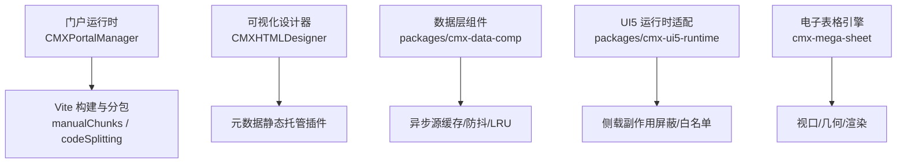
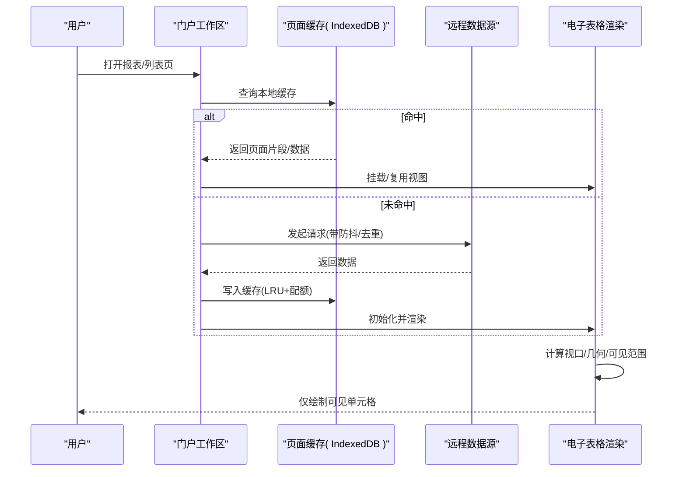
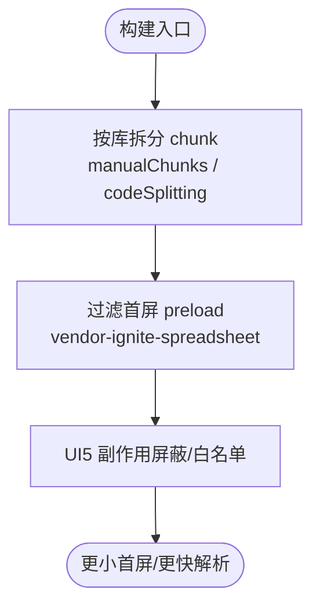
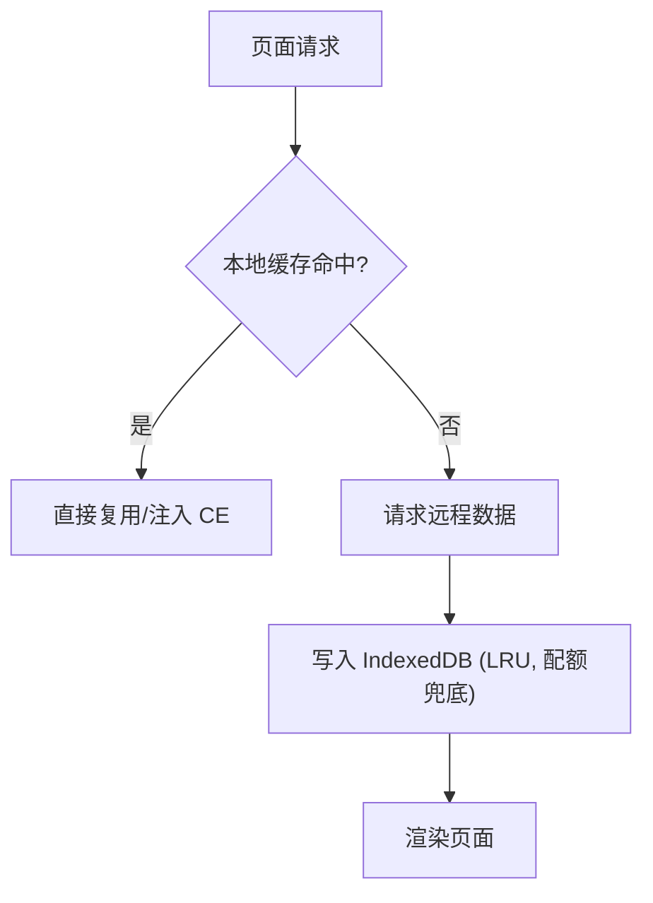
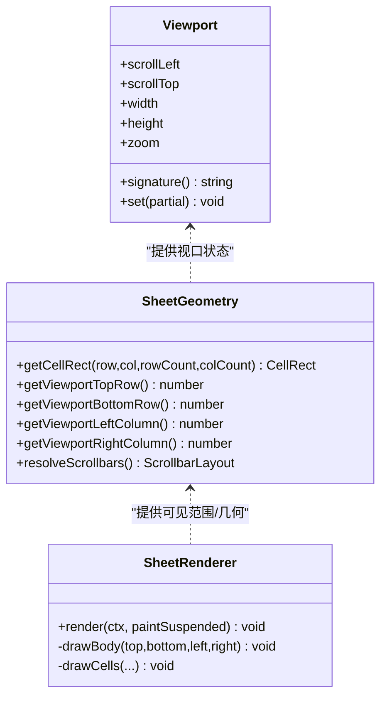
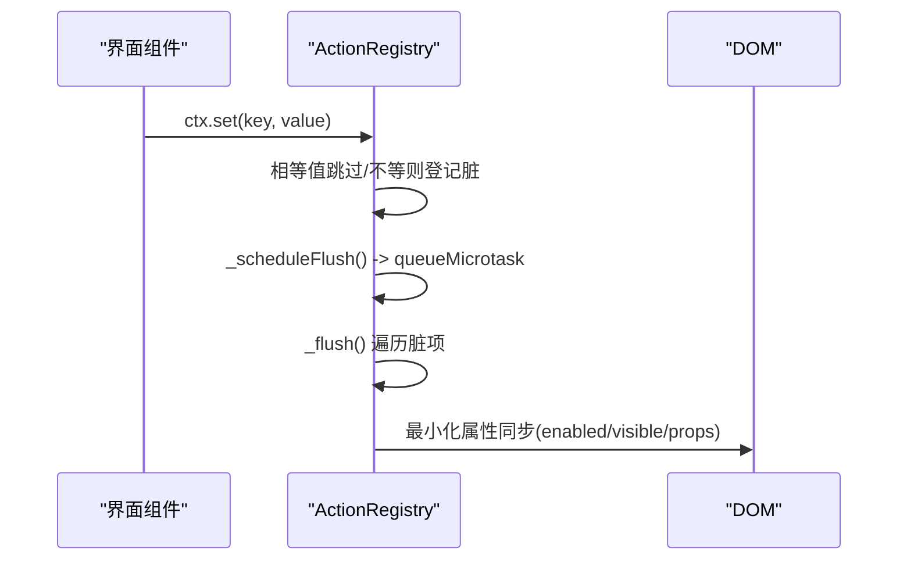
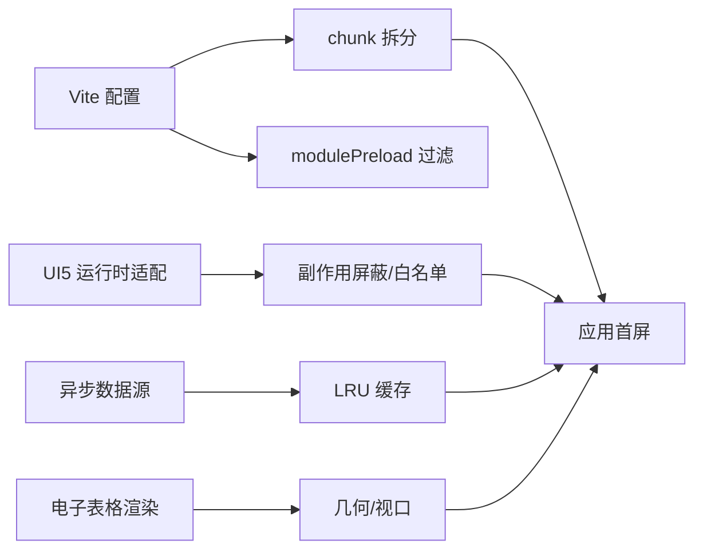

# 性能优化

<cite>
**本文引用的文件**
- [README.md](file://README.md)
- [package.json](file://package.json)
- [CMXPortalManager/vite.config.js](file://CMXPortalManager/vite.config.js)
- [CMXHTMLDesigner/vite-designer-metadata-plugin.js](file://CMXHTMLDesigner/vite-designer-metadata-plugin.js)
- [packages/cmx-ui5-runtime/vite-app.js](file://packages/cmx-ui5-runtime/vite-app.js)
- [CMXPortalManager/src/lib/page-cache.js](file://CMXPortalManager/src/lib/page-cache.js)
- [CMXPortalManager/src/lib/workspace-html-pages.js](file://CMXPortalManager/src/lib/workspace-html-pages.js)
- [CMXPortalManager/src/components/portal-app-workspace-loading.js](file://CMXPortalManager/src/components/portal-app-workspace-loading.js)
- [CMXPortalManager/src/lib/action-registry.js](file://CMXPortalManager/src/lib/action-registry.js)
- [packages/cmx-data-comp/src/lib/cmx-async-source.js](file://packages/cmx-data-comp/src/lib/cmx-async-source.js)
- [packages/cmx-data-comp/src/components/cmx-filter-bar.js](file://packages/cmx-data-comp/src/components/cmx-filter-bar.js)
- [packages/cmx-data-comp/src/lib/cmx-dict-personalization.js](file://packages/cmx-data-comp/src/lib/cmx-dict-personalization.js)
- [cmx-mega-sheet/src/render/Viewport.ts](file://cmx-mega-sheet/src/render/Viewport.ts)
- [cmx-mega-sheet/src/render/SheetGeometry.ts](file://cmx-mega-sheet/src/render/SheetGeometry.ts)
- [cmx-mega-sheet/src/render/SheetRenderer.ts](file://cmx-mega-sheet/src/render/SheetRenderer.ts)
- [cmx-mega-sheet/test/Viewport.test.ts](file://cmx-mega-sheet/test/Viewport.test.ts)
- [cmx-mega-sheet/test/SheetRenderer.test.ts](file://cmx-mega-sheet/test/SheetRenderer.test.ts)
- [cmx-mega-sheet/test/ScrollbarLayout.test.ts](file://cmx-mega-sheet/test/ScrollbarLayout.test.ts)
</cite>

## 目录
1. [简介](#简介)
2. [项目结构](#项目结构)
3. [核心组件](#核心组件)
4. [架构总览](#架构总览)
5. [详细组件分析](#详细组件分析)
6. [依赖关系分析](#依赖关系分析)
7. [性能考量](#性能考量)
8. [故障排查指南](#故障排查指南)
9. [结论](#结论)
10. [附录](#附录)

## 简介
本指南面向 CMX 企业门户平台的前端与电子表格引擎，聚焦可落地的性能优化实践。内容覆盖：
- 前端应用：组件懒加载、代码分割、资源压缩与缓存策略
- 电子表格引擎：虚拟滚动、增量更新、内存管理与渲染优化
- 数据绑定与事件处理：响应式最小化重算、防抖节流、事件委托
- DOM 操作优化：批量更新、避免抖动、减少布局抖动
- 浏览器性能监控：FPS、长任务、内存泄漏检测与瓶颈定位
- 测试与基准：单元/集成测试、回归基线、压测方法
- 实战建议：基于仓库现有实现的最佳实践与调优技巧

## 项目结构
CMX 为 monorepo，包含门户运行时、可视化设计器、数据层 Web Components 与共享 UI5 运行时；电子表格引擎 cmx-mega-sheet 提供高性能渲染能力。构建与分包策略集中在 Vite 配置中，通过 manualChunks/codeSplitting 将重型第三方库拆分到独立 chunk，配合 modulePreload 过滤首屏预加载，降低首屏解析成本。

图表来源
- [CMXPortalManager/vite.config.js:112-168](file://CMXPortalManager/vite.config.js#L112-L168)
- [CMXHTMLDesigner/vite-designer-metadata-plugin.js:43-66](file://CMXHTMLDesigner/vite-designer-metadata-plugin.js#L43-L66)
- [packages/cmx-data-comp/src/lib/cmx-async-source.js:1-43](file://packages/cmx-data-comp/src/lib/cmx-async-source.js#L1-L43)
- [packages/cmx-ui5-runtime/vite-app.js:15-30](file://packages/cmx-ui5-runtime/vite-app.js#L15-L30)
- [cmx-mega-sheet/src/render/Viewport.ts:1-178](file://cmx-mega-sheet/src/render/Viewport.ts#L1-L178)

章节来源
- [README.md:1-73](file://README.md#L1-L73)
- [package.json:1-39](file://package.json#L1-L39)

## 核心组件
- 页面与资源缓存：IndexedDB 页面缓存（LRU + 配额兜底）、工作区 HTML 页面复用与按需拉取
- 数据源与交互：异步数据源 LRU 缓存、搜索防抖、AbortController 去重请求
- 渲染与虚拟化：电子表格 Viewport/SheetGeometry/SheetRenderer 的可见区域裁剪、冻结/尾冻结分带、条件格式叠加与迷你图绘制
- 构建与分包：按第三方库维度拆分 chunk，modulePreload 过滤重型依赖，UI5 副作用模块白名单
- 状态与绑定：ActionRegistry 的 Proxy 依赖追踪、微任务批处理刷新、DOM 属性最小化同步

章节来源
- [CMXPortalManager/src/lib/page-cache.js:109-180](file://CMXPortalManager/src/lib/page-cache.js#L109-L180)
- [CMXPortalManager/src/lib/workspace-html-pages.js:363-396](file://CMXPortalManager/src/lib/workspace-html-pages.js#L363-L396)
- [packages/cmx-data-comp/src/lib/cmx-async-source.js:105-142](file://packages/cmx-data-comp/src/lib/cmx-async-source.js#L105-L142)
- [cmx-mega-sheet/src/render/SheetRenderer.ts:165-229](file://cmx-mega-sheet/src/render/SheetRenderer.ts#L165-L229)
- [CMXPortalManager/vite.config.js:112-168](file://CMXPortalManager/vite.config.js#L112-L168)
- [packages/cmx-ui5-runtime/vite-app.js:15-30](file://packages/cmx-ui5-runtime/vite-app.js#L15-L30)
- [CMXPortalManager/src/lib/action-registry.js:238-283](file://CMXPortalManager/src/lib/action-registry.js#L238-L283)

## 架构总览
下图展示从页面加载、缓存命中、数据获取到渲染的关键路径，以及电子表格引擎的虚拟化渲染流程。

图表来源
- [CMXPortalManager/src/lib/page-cache.js:109-180](file://CMXPortalManager/src/lib/page-cache.js#L109-L180)
- [packages/cmx-data-comp/src/lib/cmx-async-source.js:105-142](file://packages/cmx-data-comp/src/lib/cmx-async-source.js#L105-L142)
- [cmx-mega-sheet/src/render/SheetGeometry.ts:451-500](file://cmx-mega-sheet/src/render/SheetGeometry.ts#L451-L500)
- [cmx-mega-sheet/src/render/SheetRenderer.ts:165-229](file://cmx-mega-sheet/src/render/SheetRenderer.ts#L165-L229)

## 详细组件分析

### 前端代码分割与首屏优化
- 将重型第三方库（如 Ignite Spreadsheet/Grids/Gauges、Tabulator、RevoGrid、Lit）拆分为独立 chunk，避免主包膨胀
- 使用 modulePreload 过滤首屏不必要的 vendor chunk，减少首屏解析时间
- 对 UI5 组件进行副作用屏蔽与功能模块白名单，避免无关注册逻辑影响启动

图表来源
- [CMXPortalManager/vite.config.js:112-168](file://CMXPortalManager/vite.config.js#L112-L168)
- [packages/cmx-ui5-runtime/vite-app.js:15-30](file://packages/cmx-ui5-runtime/vite-app.js#L15-L30)

章节来源
- [CMXPortalManager/vite.config.js:112-168](file://CMXPortalManager/vite.config.js#L112-L168)
- [packages/cmx-ui5-runtime/vite-app.js:15-30](file://packages/cmx-ui5-runtime/vite-app.js#L15-L30)

### 页面与数据缓存策略
- 页面级缓存：IndexedDB 存储页面片段与版本信息，支持批量读取、写入淘汰与配额异常恢复
- 工作区页面复用：已注册的自定义元素直接复用模板，跳过重复网络请求
- 数据源缓存：按 query/key 的 LRU 缓存，结合 debounce 控制高频搜索频率，AbortController 保证同 source 并发请求去重

图表来源
- [CMXPortalManager/src/lib/page-cache.js:109-180](file://CMXPortalManager/src/lib/page-cache.js#L109-L180)
- [CMXPortalManager/src/lib/workspace-html-pages.js:363-396](file://CMXPortalManager/src/lib/workspace-html-pages.js#L363-L396)
- [packages/cmx-data-comp/src/lib/cmx-async-source.js:105-142](file://packages/cmx-data-comp/src/lib/cmx-async-source.js#L105-L142)

章节来源
- [CMXPortalManager/src/lib/page-cache.js:109-180](file://CMXPortalManager/src/lib/page-cache.js#L109-L180)
- [CMXPortalManager/src/lib/workspace-html-pages.js:363-396](file://CMXPortalManager/src/lib/workspace-html-pages.js#L363-L396)
- [packages/cmx-data-comp/src/lib/cmx-async-source.js:105-142](file://packages/cmx-data-comp/src/lib/cmx-async-source.js#L105-L142)

### 电子表格引擎：虚拟滚动与渲染优化
- 视口管理：记录滚动、缩放、行列头偏移、冻结/尾冻结行/列，生成稳定签名以触发最小化重绘
- 几何映射：将内容坐标与屏幕坐标互转，计算可见行列范围，支持冻结/尾冻结分带与拆分条
- 渲染管线：仅绘制可见区域，条件格式叠加、迷你图、浮动对象在可见范围内高效绘制
- 滚动条布局：两趟计算 gutter，回写视口尺寸，确保可见范围正确

图表来源
- [cmx-mega-sheet/src/render/Viewport.ts:1-178](file://cmx-mega-sheet/src/render/Viewport.ts#L1-L178)
- [cmx-mega-sheet/src/render/SheetGeometry.ts:256-300](file://cmx-mega-sheet/src/render/SheetGeometry.ts#L256-L300)
- [cmx-mega-sheet/src/render/SheetRenderer.ts:165-229](file://cmx-mega-sheet/src/render/SheetRenderer.ts#L165-L229)

章节来源
- [cmx-mega-sheet/src/render/Viewport.ts:1-178](file://cmx-mega-sheet/src/render/Viewport.ts#L1-L178)
- [cmx-mega-sheet/src/render/SheetGeometry.ts:451-500](file://cmx-mega-sheet/src/render/SheetGeometry.ts#L451-L500)
- [cmx-mega-sheet/src/render/SheetRenderer.ts:165-229](file://cmx-mega-sheet/src/render/SheetRenderer.ts#L165-L229)

### 数据绑定与事件处理优化
- 依赖追踪：通过 Proxy 拦截 ctx 读写，精确登记依赖键，仅在变更时触发受影响 action 的更新
- 批处理刷新：脏标记收集后通过 queueMicrotask 统一 flush，避免频繁 DOM 操作
- 事件防抖与节流：筛选栏溢出重排使用双 rAF 防抖；异步数据源 search 使用 debounceForSource 合并快速输入
- 事件委托与捕获：在 capture 阶段拦截点击，阻止 disabled 元素的无效交互

图表来源
- [CMXPortalManager/src/lib/action-registry.js:238-283](file://CMXPortalManager/src/lib/action-registry.js#L238-L283)
- [CMXPortalManager/src/lib/action-registry.js:318-334](file://CMXPortalManager/src/lib/action-registry.js#L318-L334)
- [packages/cmx-data-comp/src/components/cmx-filter-bar.js:166-193](file://packages/cmx-data-comp/src/components/cmx-filter-bar.js#L166-L193)
- [packages/cmx-data-comp/src/lib/cmx-async-source.js:117-142](file://packages/cmx-data-comp/src/lib/cmx-async-source.js#L117-L142)

章节来源
- [CMXPortalManager/src/lib/action-registry.js:238-283](file://CMXPortalManager/src/lib/action-registry.js#L238-L283)
- [packages/cmx-data-comp/src/components/cmx-filter-bar.js:166-193](file://packages/cmx-data-comp/src/components/cmx-filter-bar.js#L166-L193)
- [packages/cmx-data-comp/src/lib/cmx-async-source.js:117-142](file://packages/cmx-data-comp/src/lib/cmx-async-source.js#L117-L142)

### DOM 操作与加载体验优化
- 加载遮罩：延迟显示与淡入动画，避免闪烁；使用 contain 提升合成性能
- 多视图区域 hydrate：使用双 rAF 等待布局稳定后再设置透明度，减少重排抖动
- 字典 MRU 缓存：本地存储失败降级为内存有效，避免阻塞主线程

章节来源
- [CMXPortalManager/src/components/portal-app-workspace-loading.js:102-136](file://CMXPortalManager/src/components/portal-app-workspace-loading.js#L102-L136)
- [CMXPortalManager/src/lib/workspace-html-page-preview.js:395-410](file://CMXPortalManager/src/lib/workspace-html-page-preview.js#L395-L410)
- [packages/cmx-data-comp/src/lib/cmx-dict-personalization.js:27-74](file://packages/cmx-data-comp/src/lib/cmx-dict-personalization.js#L27-L74)

## 依赖关系分析
- 构建期依赖：Vite/Rolldown 分包策略决定 chunk 粒度与首屏 preload 行为
- 运行期依赖：UI5 组件通过白名单与副作用屏蔽减少不必要初始化
- 数据层依赖：异步数据源缓存与防抖降低网络压力与重复计算
- 渲染层依赖：SheetGeometry/Viewport/SheetRenderer 形成稳定的虚拟化渲染链路

图表来源
- [CMXPortalManager/vite.config.js:112-168](file://CMXPortalManager/vite.config.js#L112-L168)
- [packages/cmx-ui5-runtime/vite-app.js:15-30](file://packages/cmx-ui5-runtime/vite-app.js#L15-L30)
- [packages/cmx-data-comp/src/lib/cmx-async-source.js:105-142](file://packages/cmx-data-comp/src/lib/cmx-async-source.js#L105-L142)
- [cmx-mega-sheet/src/render/SheetGeometry.ts:451-500](file://cmx-mega-sheet/src/render/SheetGeometry.ts#L451-L500)

章节来源
- [CMXPortalManager/vite.config.js:112-168](file://CMXPortalManager/vite.config.js#L112-L168)
- [packages/cmx-ui5-runtime/vite-app.js:15-30](file://packages/cmx-ui5-runtime/vite-app.js#L15-L30)
- [packages/cmx-data-comp/src/lib/cmx-async-source.js:105-142](file://packages/cmx-data-comp/src/lib/cmx-async-source.js#L105-L142)
- [cmx-mega-sheet/src/render/SheetGeometry.ts:451-500](file://cmx-mega-sheet/src/render/SheetGeometry.ts#L451-L500)

## 性能考量
- 首屏与网络
  - 将重型库拆分至独立 chunk，避免主包过大导致解析慢
  - 过滤首屏 preload 的重型 vendor chunk，按需加载
  - 使用本地缓存与页面复用减少网络请求
- 渲染与内存
  - 电子表格仅绘制可见区域，冻结/尾冻结分带减少重绘范围
  - 条件格式与迷你图在可见范围内计算与叠加，避免全表扫描
  - 视口签名稳定化，避免无意义的重定位与重绘
- 数据与事件
  - 搜索输入防抖、请求去重，降低服务端压力与重复计算
  - 依赖追踪最小化更新范围，微任务批处理刷新
  - 事件捕获阶段拦截无效交互，减少无用回调
- 构建与依赖
  - UI5 副作用屏蔽与功能模块白名单，减少无关初始化
  - dedupe 关键库实例，避免重复解析导致的性能损耗

[本节为通用指导，不直接分析具体文件]

## 故障排查指南
- 页面加载卡顿
  - 检查是否命中本地缓存；若未命中，确认远程请求是否被防抖/去重
  - 查看 chunk 拆分是否合理，是否存在首屏 preload 了重型库
- 电子表格滚动卡顿
  - 确认视口签名变化是否频繁；检查冻结/尾冻结配置是否合理
  - 验证滚动条布局计算是否正确，gutter 回写是否生效
- 内存泄漏
  - 检查 ResizeObserver、事件监听是否在组件卸载时清理
  - 确认 ActionRegistry 中的订阅集合在删除 action 时清理
- 缓存异常
  - IndexedDB 写入失败时是否有配额异常恢复逻辑
  - 页面复用是否误用旧版本导致不一致

章节来源
- [packages/cmx-data-comp/src/components/cmx-filter-bar.js:184-186](file://packages/cmx-data-comp/src/components/cmx-filter-bar.js#L184-L186)
- [CMXPortalManager/src/lib/action-registry.js:238-247](file://CMXPortalManager/src/lib/action-registry.js#L238-L247)
- [CMXPortalManager/src/lib/page-cache.js:156-170](file://CMXPortalManager/src/lib/page-cache.js#L156-L170)

## 结论
CMX 平台在前端构建、缓存、数据绑定与电子表格渲染方面已形成完善的性能优化基础。通过精细的代码分割、稳定的视口虚拟化、最小化依赖更新与合理的缓存策略，可在大数据量与复杂交互场景下保持流畅体验。建议在新增功能时遵循上述原则，持续通过测试与监控保障性能基线。

[本节为总结性内容，不直接分析具体文件]

## 附录

### 性能测试工具与基准方法
- 单元测试与断言
  - 视口状态与边界：验证缩放、滚动、内容尺寸计算的正确性
  - 渲染输出：断言背景填充、文本绘制、对齐与格式化结果
  - 滚动条可见性：验证内容小于视口时隐藏滚动条、大于时显示
- 基准与回归
  - 针对大表格滚动、冻结/尾冻结切换、条件格式叠加等场景建立回归用例
  - 使用 Vitest 执行测试套件，确保重构或升级不引入性能退化

章节来源
- [cmx-mega-sheet/test/Viewport.test.ts:1-58](file://cmx-mega-sheet/test/Viewport.test.ts#L1-L58)
- [cmx-mega-sheet/test/SheetRenderer.test.ts:61-101](file://cmx-mega-sheet/test/SheetRenderer.test.ts#L61-L101)
- [cmx-mega-sheet/test/ScrollbarLayout.test.ts:1-44](file://cmx-mega-sheet/test/ScrollbarLayout.test.ts#L1-L44)