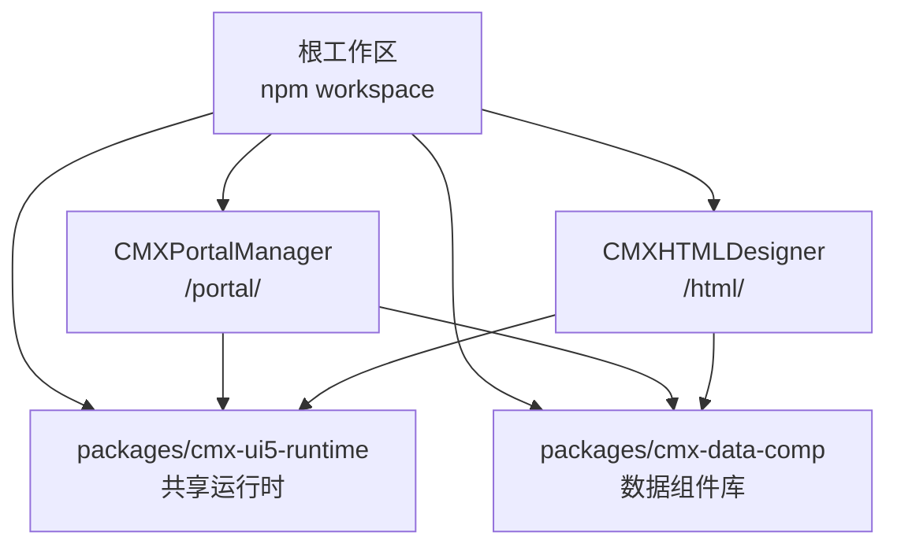
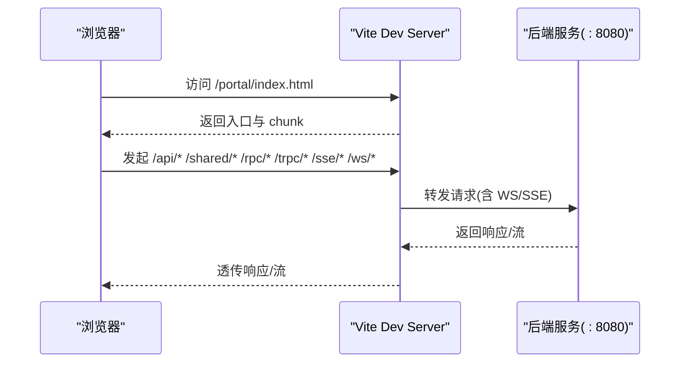
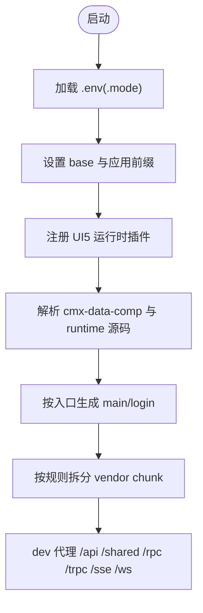
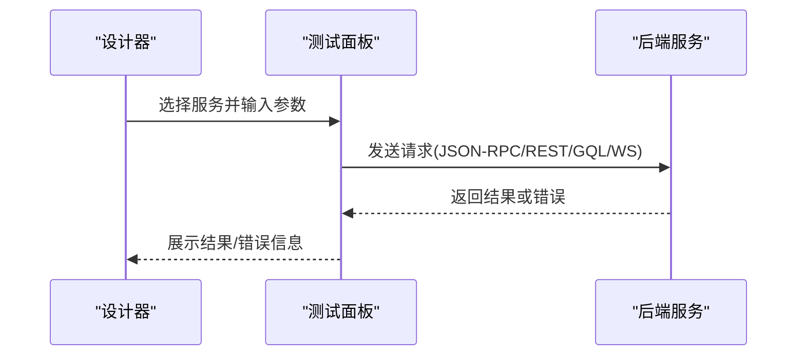
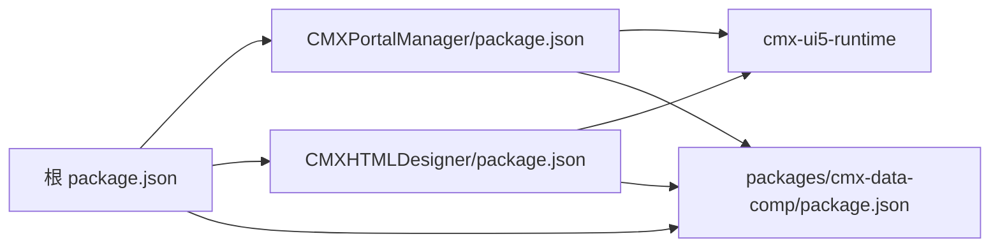

# 最佳实践

<cite>
**本文引用的文件**
- [README.md](file://README.md)
- [package.json](file://package.json)
- [CONTRIBUTING.md](file://CONTRIBUTING.md)
- [AGENTS.md](file://AGENTS.md)
- [CMXPortalManager/package.json](file://CMXPortalManager/package.json)
- [CMXHTMLDesigner/package.json](file://CMXHTMLDesigner/package.json)
- [packages/cmx-data-comp/package.json](file://packages/cmx-data-comp/package.json)
- [CMXPortalManager/vite.config.js](file://CMXPortalManager/vite.config.js)
- [CMXHTMLDesigner/vite.config.js](file://CMXHTMLDesigner/vite.config.js)
- [CMXPortalManager/src/lib/api-client.js](file://CMXPortalManager/src/lib/api-client.js)
- [CMXHTMLDesigner/src/components/designer-page-data/page-data-panel-test.js](file://CMXHTMLDesigner/src/components/designer-page-data/page-data-panel-test.js)
- [CMXPortalManager/docs/software-quality-assessment-report.html](file://CMXPortalManager/docs/software-quality-assessment-report.html)
- [docs/Rust-WASM二次开发平台-缺口补齐开发方案.md](file://docs/Rust-WASM二次开发平台-缺口补齐开发方案.md)
</cite>

## 目录
1. [引言](#引言)
2. [项目结构](#项目结构)
3. [核心组件](#核心组件)
4. [架构总览](#架构总览)
5. [详细组件分析](#详细组件分析)
6. [依赖分析](#依赖分析)
7. [性能优化建议](#性能优化建议)
8. [安全最佳实践](#安全最佳实践)
9. [用户体验设计原则](#用户体验设计原则)
10. [代码重构指南与架构模式](#代码重构指南与架构模式)
11. [测试策略、质量保证与持续集成](#测试策略质量保证与持续集成)
12. [团队协作规范、文档标准与知识分享](#团队协作规范文档标准与知识分享)
13. [常见陷阱与排错指南](#常见陷阱与排错指南)
14. [结论](#结论)

## 引言
本指南面向 CMX 企业门户平台的研发与交付团队，聚焦可落地的最佳实践：性能优化、安全加固、用户体验、重构路径、架构模式、模块划分与依赖管理、测试与质量保障、CI/CD 落地，以及团队协作与知识沉淀。内容基于仓库现有工程配置、构建脚本、技能规范与质量评估报告提炼而成，确保“可操作、可验证、可复用”。

## 项目结构
CMX 前端采用 npm workspace monorepo 组织，包含：
- CMXPortalManager（门户运行时）
- CMXHTMLDesigner（可视化设计器）
- packages/cmx-data-comp（数据层 Web Components）
- packages/cmx-ui5-runtime（共享 UI5/Tabler 运行时）

根 package.json 统一声明 workspaces、全局覆盖版本与脚本；各子应用通过 Vite 构建并复用 cmx-ui5-runtime 插件与能力。

图表来源
- [package.json:1-39](file://package.json#L1-L39)
- [README.md:10-17](file://README.md#L10-L17)

章节来源
- [README.md:10-17](file://README.md#L10-L17)
- [package.json:1-39](file://package.json#L1-L39)

## 核心组件
- 数据组件库（cmx-data-comp）：提供主从协调、列模型、数据集、表单/表格/树等 Web Components，并通过 exports 暴露稳定 API，供门户与设计器复用。
- 门户运行时（CMXPortalManager）：基于 Vite + UI5 WebComponents，负责路由、工作区、菜单、页面加载与后端 API 代理。
- HTML 设计器（CMXHTMLDesigner）：元数据驱动的页面设计与预览，内置测试面板与服务调用能力。
- 共享运行时（cmx-ui5-runtime）：提供 UI5 初始化、主题、本地化白名单、Vite 插件等横切能力。

章节来源
- [packages/cmx-data-comp/package.json:14-73](file://packages/cmx-data-comp/package.json#L14-L73)
- [CMXPortalManager/package.json:24-53](file://CMXPortalManager/package.json#L24-L53)
- [CMXHTMLDesigner/package.json:14-31](file://CMXHTMLDesigner/package.json#L14-L31)
- [README.md:19-24](file://README.md#L19-L24)

## 架构总览
前后端边界清晰：前端通过 Vite dev server 将 /api、/shared、/rpc、/trpc、/sse、/ws 等请求代理到后端服务（默认 :8080）。构建产物由后端同源托管。

图表来源
- [CMXPortalManager/vite.config.js:84-95](file://CMXPortalManager/vite.config.js#L84-L95)
- [CMXHTMLDesigner/vite.config.js:72-84](file://CMXHTMLDesigner/vite.config.js#L72-L84)

章节来源
- [CMXPortalManager/vite.config.js:84-95](file://CMXPortalManager/vite.config.js#L84-L95)
- [CMXHTMLDesigner/vite.config.js:72-84](file://CMXHTMLDesigner/vite.config.js#L72-L84)

## 详细组件分析

### 门户运行时（CMXPortalManager）
- 职责：应用壳、路由与工作区、菜单与侧边栏、页面容器、与后端通信。
- 关键配置：多入口构建（index/login）、manualChunks/rolldown codeSplitting 拆分重型第三方库、环境变量分层、代理后端接口。
- 风险点：UI5/Fiori chunk 体积大，需按需懒加载与预加载控制；生产 SourceMap 开启需评估泄露风险。

图表来源
- [CMXPortalManager/vite.config.js:15-31](file://CMXPortalManager/vite.config.js#L15-L31)
- [CMXPortalManager/vite.config.js:34-83](file://CMXPortalManager/vite.config.js#L34-L83)
- [CMXPortalManager/vite.config.js:97-168](file://CMXPortalManager/vite.config.js#L97-L168)
- [CMXPortalManager/vite.config.js:84-95](file://CMXPortalManager/vite.config.js#L84-L95)

章节来源
- [CMXPortalManager/vite.config.js:15-168](file://CMXPortalManager/vite.config.js#L15-L168)

### HTML 设计器（CMXHTMLDesigner）
- 职责：页面元数据编辑、预览、调试与服务调用测试。
- 关键能力：内置测试面板支持 JSON-RPC/REST/GQL/WebSocket 调用，便于联调与回归。
- 风险点：动态函数执行存在安全风险，应限制在受控环境并最小化权限。

图表来源
- [CMXHTMLDesigner/src/components/designer-page-data/page-data-panel-test.js:69-96](file://CMXHTMLDesigner/src/components/designer-page-data/page-data-panel-test.js#L69-L96)

章节来源
- [CMXHTMLDesigner/src/components/designer-page-data/page-data-panel-test.js:69-96](file://CMXHTMLDesigner/src/components/designer-page-data/page-data-panel-test.js#L69-L96)

### 数据组件库（cmx-data-comp）
- 职责：提供稳定的 Web Components 与数据模型（主从、列模型、数据集、字典/单据/报表相关组件），通过 exports 精确导出，降低耦合。
- 关键点：peerDependencies 约束 UI5 版本；商业组件隔离在 spreadjs/ignite 子目录；大量单元测试保障稳定性。

章节来源
- [packages/cmx-data-comp/package.json:14-102](file://packages/cmx-data-comp/package.json#L14-L102)

## 依赖分析
- 工作区依赖：根 package.json 统一管理 workspaces、覆盖 vitest 版本、集中脚本。
- 子包依赖：
  - CMXPortalManager：UI5、Lit、Fastify（遗留）、CodeMirror、tRPC、Zod 等。
  - CMXHTMLDesigner：UI5、CodeMirror、Vitest、JS DOM 环境。
  - cmx-data-comp：Ignite UI、SpreadJS、RevoGrid、Tabulator、Treeview 等，部分为商业授权。
- 构建期去重：对 UI5 与 Lit 进行 dedupe，避免多实例导致状态不一致。

图表来源
- [package.json:1-39](file://package.json#L1-L39)
- [CMXPortalManager/package.json:24-53](file://CMXPortalManager/package.json#L24-L53)
- [CMXHTMLDesigner/package.json:14-31](file://CMXHTMLDesigner/package.json#L14-L31)
- [packages/cmx-data-comp/package.json:75-102](file://packages/cmx-data-comp/package.json#L75-L102)

章节来源
- [package.json:1-39](file://package.json#L1-L39)
- [CMXPortalManager/package.json:24-53](file://CMXPortalManager/package.json#L24-L53)
- [CMXHTMLDesigner/package.json:14-31](file://CMXHTMLDesigner/package.json#L14-L31)
- [packages/cmx-data-comp/package.json:75-102](file://packages/cmx-data-comp/package.json#L75-L102)

## 性能优化建议
- 首屏与网络
  - 使用 manualChunks/rolldown codeSplitting 将重型库（Ignite Spreadsheet/Grids/Gauges、Tabulator、RevoGrid、Treeview、Lit、Markdown、Shiki）拆分为独立 chunk，并按需加载。
  - 通过 modulePreload 过滤掉仅在动态路径使用的重型 vendor chunk，减少首屏开销。
  - 合理设置 base 与多入口构建，避免重复资源加载。
- 构建与缓存
  - 利用 content hash 与 immutable 缓存策略，提升长期缓存命中率。
  - 生产环境谨慎开启 SourceMap，必要时仅对关键模块启用。
- 运行期
  - 对 UI5 资源进行按需加载与本地化白名单控制，减少不必要资源下载。
  - 对大数据表格/表单场景，优先使用虚拟滚动与增量更新（结合数据组件库能力）。

章节来源
- [CMXPortalManager/vite.config.js:97-168](file://CMXPortalManager/vite.config.js#L97-L168)
- [CMXHTMLDesigner/vite.config.js:90-103](file://CMXHTMLDesigner/vite.config.js#L90-L103)
- [CMXPortalManager/docs/software-quality-assessment-report.html:307-314](file://CMXPortalManager/docs/software-quality-assessment-report.html#L307-L314)

## 安全最佳实践
- 接口与鉴权
  - 新接口禁用可变路径段，禁用 PUT/PATCH/DELETE，统一 POST + JSON body，详情查询可用 GET + query。
  - 鉴权二选一：Bearer Token 或 X-API-Key（开发环境免登录），生产务必关闭免登录。
- 前端安全
  - 严格限制 eval/new Function 等动态执行；设计器测试面板中的动态执行仅限受控环境，且最小化权限。
  - 对 innerHTML/outerHTML/insertAdjacentHTML 进行白名单与转义处理。
- 构建与发布
  - 生产环境关闭不必要的调试接口与 GraphQL IDE，缩小攻击面。
  - 谨慎发布 SourceMap，避免源码泄露。
- 数据与配置
  - 不提交真实凭据与环境敏感信息；只提交模板与示例配置。
  - 测试数据必须脱敏。

章节来源
- [AGENTS.md:114-125](file://AGENTS.md#L114-L125)
- [AGENTS.md:180-212](file://AGENTS.md#L180-L212)
- [CONTRIBUTING.md:26-39](file://CONTRIBUTING.md#L26-L39)
- [CMXHTMLDesigner/src/components/designer-page-data/page-data-panel-test.js:69-96](file://CMXHTMLDesigner/src/components/designer-page-data/page-data-panel-test.js#L69-L96)
- [CMXPortalManager/docs/software-quality-assessment-report.html:277-280](file://CMXPortalManager/docs/software-quality-assessment-report.html#L277-L280)

## 用户体验设计原则
- 主题一致性
  - 所有页面与组件必须同时兼容 UI5 大主题与 Neo 皮肤/色调，禁止硬编码色值；亮/暗主题可读性一致。
  - 展示类组件必须接入 Neo 皮肤，支持 plain 模式回退与 tone 切换。
- 交互与可访问性
  - 表单/表格/列表等组件遵循统一的列模型与字段类型，保证一致的编辑与展示体验。
  - 空态、错误态、加载态有明确反馈，提升可用性。
- 性能感知
  - 首屏与关键路径资源优先加载，非关键功能按需懒加载；长列表与大数据场景使用虚拟化与增量更新。

章节来源
- [AGENTS.md:99-113](file://AGENTS.md#L99-L113)
- [packages/cmx-data-comp/package.json:14-73](file://packages/cmx-data-comp/package.json#L14-L73)

## 代码重构指南与架构模式
- 模块化与解耦
  - 以 cmx-data-comp 为稳定边界，对外暴露精确 exports；业务页面通过组合而非继承复用能力。
  - 将重型第三方库按功能拆分至独立 chunk，避免单体包过大导致的解析与加载瓶颈。
- 数据流与状态
  - 使用数据集与列模型驱动表单/表格渲染，变更通过增量 changeset 提交，减少全量刷新。
  - 跨组件通信优先使用事件总线或轻量上下文，避免深层 props 传递。
- 错误处理与可观测
  - 统一错误码族与提示策略（如单据校验失败、状态锁定、版本冲突、权限拒绝、锁持有），前端据此精准定位与提示。
  - 关键流程埋点与日志上报，便于问题定位与性能分析。

章节来源
- [packages/cmx-data-comp/package.json:14-73](file://packages/cmx-data-comp/package.json#L14-L73)
- [CMXPortalManager/vite.config.js:118-168](file://CMXPortalManager/vite.config.js#L118-L168)
- [docs/Rust-WASM二次开发平台-缺口补齐开发方案.md:244-253](file://docs/Rust-WASM二次开发平台-缺口补齐开发方案.md#L244-L253)

## 测试策略、质量保证与持续集成
- 测试策略
  - 单元：cmx-data-comp 与 cmx-html-designer 使用 Vitest 覆盖核心逻辑；新增/修改必带单测。
  - 集成：针对关键链路（如表单保存、批量装载）编写冒烟脚本，覆盖“配置→触发→生效”闭环。
  - E2E：结合 Playwright 对门户关键路径进行端到端验证。
- 质量保证
  - 提交前必过：前端 npm test、lint；后端 cargo test、clippy、fmt --check。
  - 代码审查：关注主题兼容性、安全规则、chunk 拆分合理性、错误处理完备性。
- 持续集成
  - CI 阶段执行 lint、unit test、build；对关键包增加依赖图检查与覆盖率阈值。
  - 构建产物签名与哈希校验，确保分发一致性。

章节来源
- [CONTRIBUTING.md:9-19](file://CONTRIBUTING.md#L9-L19)
- [AGENTS.md:215-231](file://AGENTS.md#L215-L231)
- [docs/Rust-WASM二次开发平台-缺口补齐开发方案.md:247-253](file://docs/Rust-WASM二次开发平台-缺口补齐开发方案.md#L247-L253)

## 团队协作规范、文档标准与知识分享
- 分支与提交
  - 从 main 切特性分支，使用 Conventional Commits；一个 PR 聚焦一件事，破坏性变更显式标注。
- 文档与知识
  - 方案/规划/计划统一归档到 documents/plans/，命名遵循 plan-naming 规范。
  - 技能文档（SKILL.md）作为决策入口，references/ 存放模板、示例与大段规范；引用相对路径，避免精确行号。
- 资产与真源
  - 前端资源/数据资产从工作区真源发布；目标仓发布产物禁止直接修改，需通过脚本同步。
- 安全与合规
  - 不提交敏感信息与真实数据；安全问题走私渠道报告。

章节来源
- [CONTRIBUTING.md:21-39](file://CONTRIBUTING.md#L21-L39)
- [AGENTS.md:80-87](file://AGENTS.md#L80-L87)
- [AGENTS.md:120-131](file://AGENTS.md#L120-L131)

## 常见陷阱与排错指南
- 构建与部署
  - 多入口构建时确保 input 正确配置，避免 login/debug/preview 页面丢失导致路由异常。
  - 生产环境关闭不必要的调试接口与 GraphQL IDE，防止攻击面扩大。
  - 谨慎开启 SourceMap，避免源码泄露。
- 运行时
  - 动态函数执行（如设计器测试面板）仅限受控环境，避免在生产启用。
  - 主题切换后视觉掉队、强调色不变、色值硬编码等问题需在 CR 中一票否决。
- 数据与接口
  - 新接口遵循固定路径段与 POST 约定；详情查询才用 GET + query。
  - 错误码族统一，前端根据 code 精准提示与高亮出错位置。
- 性能
  - 重型库未拆分导致首屏过大；通过 manualChunks/codeSplitting 与 modulePreload 优化。
  - UI5 资源加载顺序与本地化白名单需正确配置，避免重复加载与语言包缺失。

章节来源
- [CMXPortalManager/vite.config.js:112-168](file://CMXPortalManager/vite.config.js#L112-L168)
- [CMXHTMLDesigner/vite.config.js:90-103](file://CMXHTMLDesigner/vite.config.js#L90-L103)
- [CMXHTMLDesigner/src/components/designer-page-data/page-data-panel-test.js:69-96](file://CMXHTMLDesigner/src/components/designer-page-data/page-data-panel-test.js#L69-L96)
- [CMXPortalManager/src/lib/api-client.js:249-258](file://CMXPortalManager/src/lib/api-client.js#L249-L258)
- [AGENTS.md:99-113](file://AGENTS.md#L99-L113)
- [CMXPortalManager/docs/software-quality-assessment-report.html:307-314](file://CMXPortalManager/docs/software-quality-assessment-report.html#L307-L314)

## 结论
CMX 企业门户平台以元数据驱动为核心，结合稳定的数据组件库与清晰的门户/设计器边界，具备良好的可扩展性与可维护性。通过严格的构建拆分、主题一致性、安全基线与完善的测试/CI 体系，可在复杂企业场景中提供高性能、高可靠的用户体验。建议团队持续遵循本指南的规范与实践，逐步消除技术债，提升交付质量与效率。