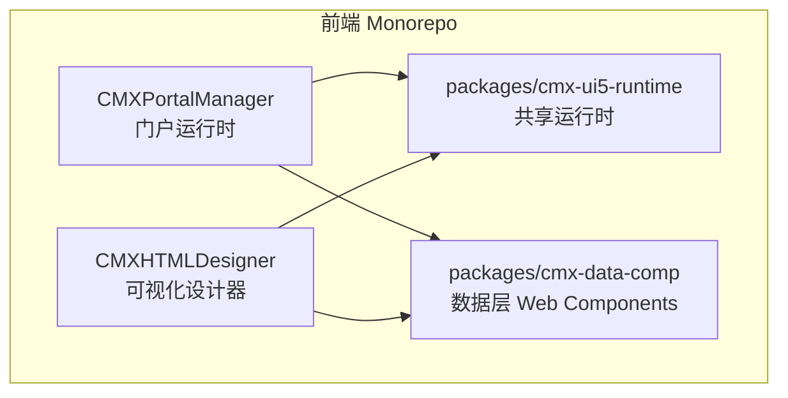
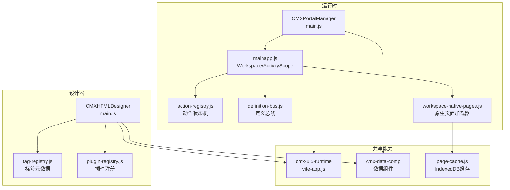
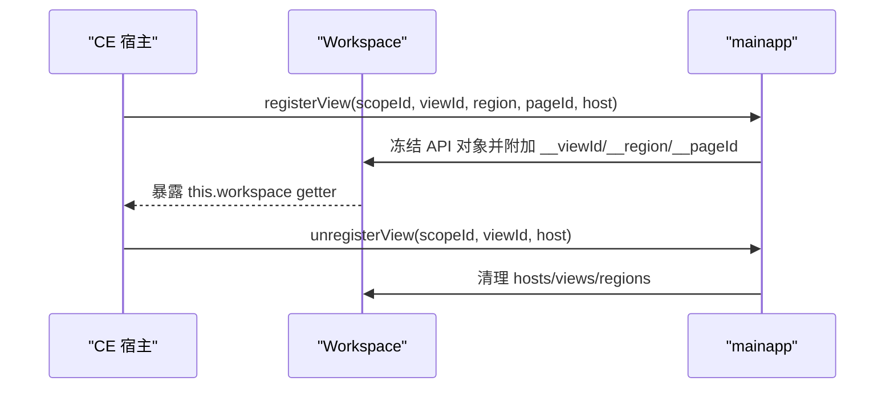
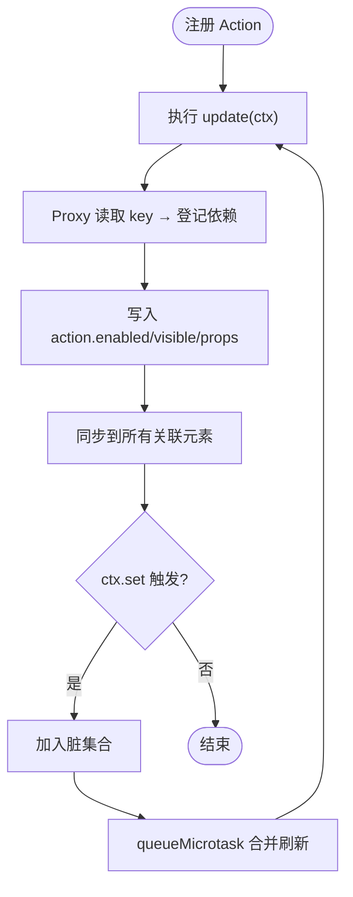
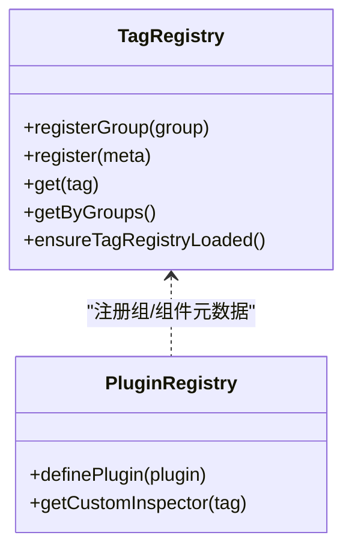
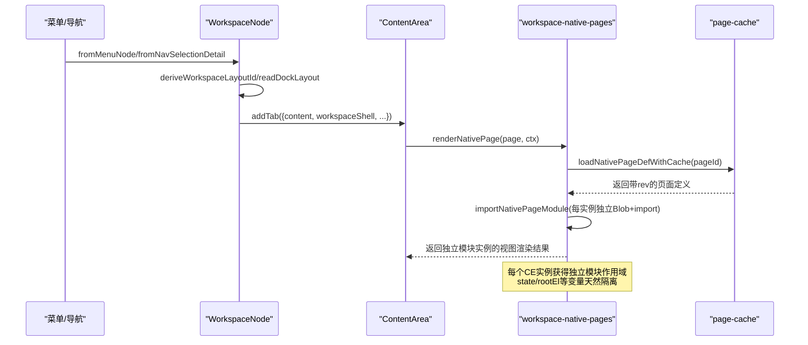
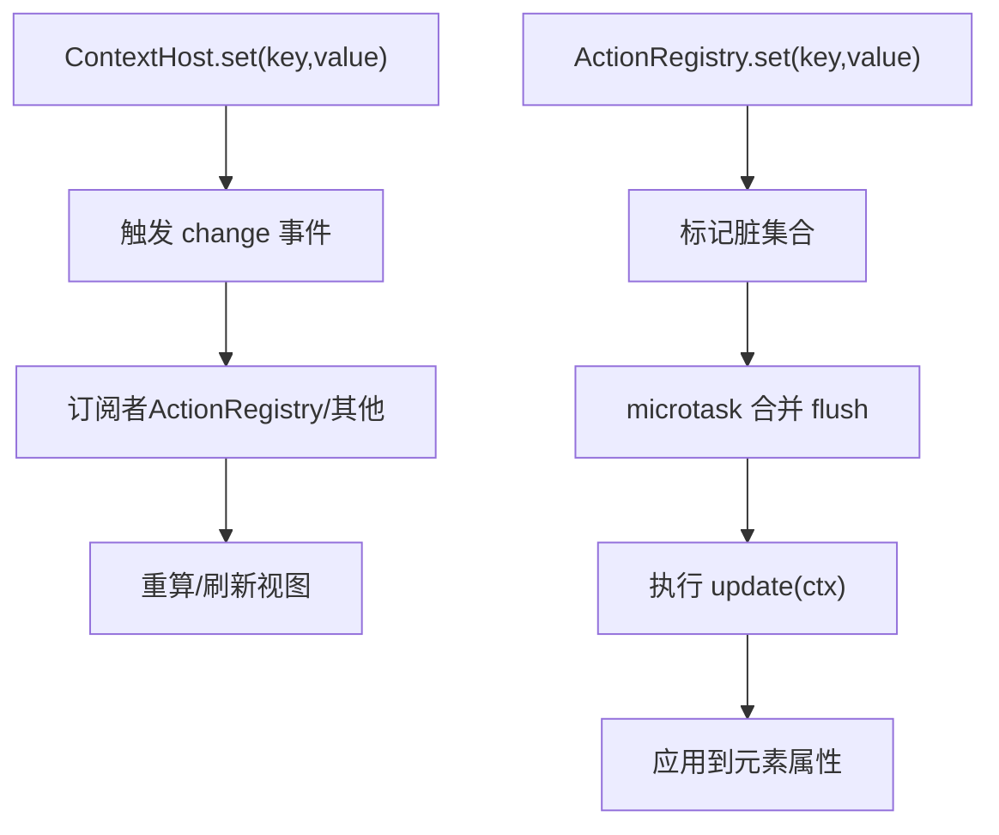
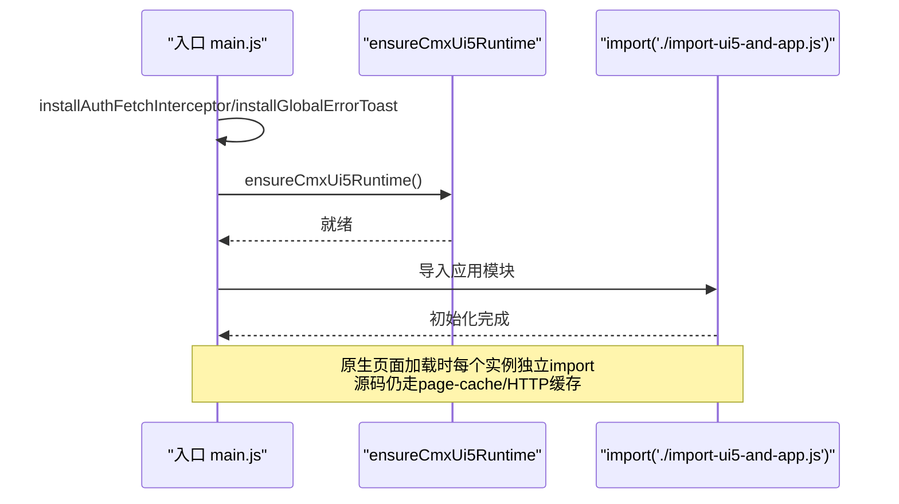
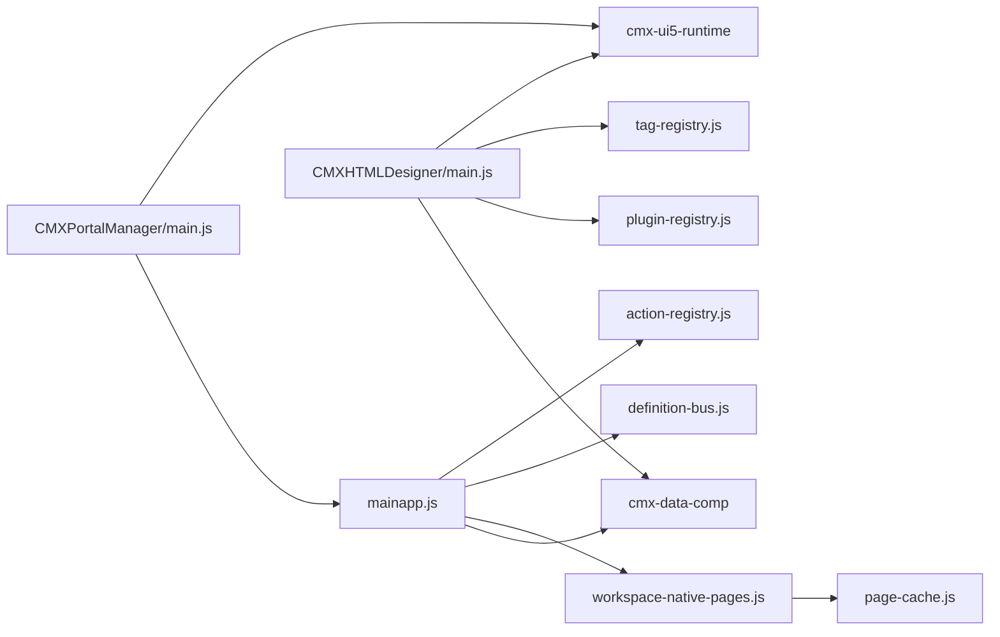

# 架构设计模式

<cite>
**本文引用的文件**
- [README.md](file://README.md)
- [package.json](file://package.json)
- [CMXPortalManager/src/main.js](file://CMXPortalManager/src/main.js)
- [CMXHTMLDesigner/src/main.js](file://CMXHTMLDesigner/src/main.js)
- [CMXPortalManager/src/lib/mainapp.js](file://CMXPortalManager/src/lib/mainapp.js)
- [CMXPortalManager/src/lib/action-registry.js](file://CMXPortalManager/src/lib/action-registry.js)
- [CMXHTMLDesigner/src/metadata/tag-registry.js](file://CMXHTMLDesigner/src/metadata/tag-registry.js)
- [CMXHTMLDesigner/src/lib/plugin-registry.js](file://CMXHTMLDesigner/src/lib/plugin-registry.js)
- [CMXPortalManager/src/lib/definition-bus.js](file://CMXPortalManager/src/lib/definition-bus.js)
- [cmx-mega-sheet/src/core/EventEmitter.ts](file://cmx-mega-sheet/src/core/EventEmitter.ts)
- [CMXPortalManager/src/lib/workspace-node.js](file://CMXPortalManager/src/lib/workspace-node.js)
- [CMXHTMLDesigner/src/components/designer-app/designer-app-shell-template.js](file://CMXHTMLDesigner/src/components/designer-app/designer-app-shell-template.js)
- [packages/cmx-ui5-runtime/vite-app.js](file://packages/cmx-ui5-runtime/vite-app.js)
- [CMXPortalManager/src/lib/workspace-native-pages.js](file://CMXPortalManager/src/lib/workspace-native-pages.js)
- [CMXPortalManager/src/lib/page-cache.js](file://CMXPortalManager/src/lib/page-cache.js)
- [documents/plans/20260827_portal_原生页面多实例模块隔离方案.md](file://documents/plans/20260827_portal_原生页面多实例模块隔离方案.md)
</cite>

## 更新摘要
**变更内容**
- 更新了微前端与模块独立化章节中关于原生页面动态加载的描述，从'按pageId缓存模块'改为'移除模块级缓存以实现实例隔离'
- 新增多实例隔离架构设计的详细说明
- 更新了相关架构图表和实现细节
- 补充了cr-form跨tab串数据问题的根因分析和解决方案

## 目录
1. [简介](#简介)
2. [项目结构](#项目结构)
3. [核心组件](#核心组件)
4. [架构总览](#架构总览)
5. [详细组件分析](#详细组件分析)
6. [依赖关系分析](#依赖关系分析)
7. [性能考量](#性能考量)
8. [故障排查指南](#故障排查指南)
9. [结论](#结论)
10. [附录](#附录)

## 简介
本文件面向 CMX 企业门户平台，总结并沉淀一套可复用的架构设计模式最佳实践。围绕 Web Components 架构、事件驱动架构与插件化架构，结合元数据驱动开发、组件注册机制与动态加载策略，给出微前端与模块独立化、服务解耦、状态管理、数据流与异步处理的设计指导；同时提供架构演进路径、技术选型评估与决策记录建议，帮助企业在可扩展、可维护的前提下持续演进。

## 项目结构
CMX 采用 monorepo 组织：
- CMXPortalManager：门户运行时（路由 /portal/），负责应用壳、工作区、视图注册、动作状态等。
- CMXHTMLDesigner：可视化设计器（路由 /html/），负责标签元数据、调色板、画布、数据面板、插件扩展等。
- packages/cmx-data-comp：数据层 Web Components（主从表格、组合框、树表、公式编辑器、单据/字典/报表组件等）。
- packages/cmx-ui5-runtime：共享 UI5/Tabler 运行时，统一主题、语言与渲染能力。

**图表来源**
- [README.md:45-55](file://README.md#L45-L55)
- [package.json:6-10](file://package.json#L6-L10)

**章节来源**
- [README.md:1-73](file://README.md#L1-L73)
- [package.json:1-39](file://package.json#L1-L39)

## 核心组件
- 应用启动与引导：门户与设计器入口均先安装全局拦截与错误兜底，再加载共享 UI5 运行时，最后导入各自应用逻辑。
- 工作区与作用域：mainapp 提供 Workspace/ActivityScope 作用域模型，集中管理视图注册、区域布局、上下文与对话框生命周期。
- 动作状态管理：ActionRegistry 实现声明式按钮/菜单/工具栏的状态同步，基于事件与依赖追踪的无轮询更新。
- 元数据驱动：标签元数据通过 tag-registry 动态加载与注册，支持插件扩展自定义组与组件。
- 定义总线：DefinitionBus 为 DCT/DOC 列表/主体/检查器提供跨模块共享的事件总线，保证多组件协同刷新。
- 原生页面动态加载：workspace-native-pages 支持 HTML/JS 原生页面的动态 import 与实例隔离。

**章节来源**
- [CMXPortalManager/src/main.js:1-49](file://CMXPortalManager/src/main.js#L1-L49)
- [CMXHTMLDesigner/src/main.js:1-29](file://CMXHTMLDesigner/src/main.js#L1-L29)
- [CMXPortalManager/src/lib/mainapp.js:1-556](file://CMXPortalManager/src/lib/mainapp.js#L1-L556)
- [CMXPortalManager/src/lib/action-registry.js:1-531](file://CMXPortalManager/src/lib/action-registry.js#L1-L531)
- [CMXHTMLDesigner/src/metadata/tag-registry.js:1-149](file://CMXHTMLDesigner/src/metadata/tag-registry.js#L1-L149)
- [CMXHTMLDesigner/src/lib/plugin-registry.js:1-95](file://CMXHTMLDesigner/src/lib/plugin-registry.js#L1-L95)
- [CMXPortalManager/src/lib/definition-bus.js:1-48](file://CMXPortalManager/src/lib/definition-bus.js#L1-L48)
- [CMXPortalManager/src/lib/workspace-native-pages.js:1-510](file://CMXPortalManager/src/lib/workspace-native-pages.js#L1-L510)

## 架构总览
CMX 以"元数据驱动 + Web Components + 事件驱动"为核心，将门户运行时与设计器解耦，并通过共享运行时与数据组件复用能力。工作区作为视图容器与作用域边界，动作系统驱动 UI 状态，插件体系扩展设计期能力，原生页面按需动态加载并实现实例隔离。

**图表来源**
- [CMXPortalManager/src/main.js:1-49](file://CMXPortalManager/src/main.js#L1-L49)
- [CMXHTMLDesigner/src/main.js:1-29](file://CMXHTMLDesigner/src/main.js#L1-L29)
- [CMXPortalManager/src/lib/mainapp.js:1-556](file://CMXPortalManager/src/lib/mainapp.js#L1-L556)
- [CMXPortalManager/src/lib/action-registry.js:1-531](file://CMXPortalManager/src/lib/action-registry.js#L1-L531)
- [CMXHTMLDesigner/src/metadata/tag-registry.js:1-149](file://CMXHTMLDesigner/src/metadata/tag-registry.js#L1-L149)
- [CMXHTMLDesigner/src/lib/plugin-registry.js:1-95](file://CMXHTMLDesigner/src/lib/plugin-registry.js#L1-L95)
- [packages/cmx-ui5-runtime/vite-app.js:1-30](file://packages/cmx-ui5-runtime/vite-app.js#L1-L30)
- [CMXPortalManager/src/lib/workspace-native-pages.js:1-510](file://CMXPortalManager/src/lib/workspace-native-pages.js#L1-L510)
- [CMXPortalManager/src/lib/page-cache.js:1-200](file://CMXPortalManager/src/lib/page-cache.js#L1-L200)

## 详细组件分析

### Web Components 架构模式
- 宿主与应用壳：门户与设计器均以 Web Components 构建，使用 Shadow DOM 隔离样式与行为，便于嵌入任意宿主。
- 视图注册与生命周期：通过 registerView/unregisterView 在 connectedCallback/disconnectedCallback 中完成视图注册与清理，避免 dock 拖动导致的顺序错乱。
- 上下文与作用域：每个工作区/活动侧栏拥有独立的 ContextHost，仅 set/delete 触发 change，确保最小化通知范围。

**图表来源**
- [CMXPortalManager/src/lib/mainapp.js:467-534](file://CMXPortalManager/src/lib/mainapp.js#L467-L534)

**章节来源**
- [CMXPortalManager/src/lib/mainapp.js:28-99](file://CMXPortalManager/src/lib/mainapp.js#L28-L99)
- [CMXPortalManager/src/lib/mainapp.js:141-358](file://CMXPortalManager/src/lib/mainapp.js#L141-L358)
- [CMXPortalManager/src/lib/mainapp.js:467-534](file://CMXPortalManager/src/lib/mainapp.js#L467-L534)

### 事件驱动架构
- 动作系统：ActionRegistry 完全事件驱动，update 函数内通过 ctx Proxy 自动追踪依赖，ctx.set 后在 microtask 合并刷新，避免轮询。
- 全局断开观察：MutationObserver 监听文档节点移除，批量清理已脱离 DOM 的元素引用，防止内存泄漏。
- 定义总线：DefinitionBus 基于 EventTarget，提供 items/select/refresh/dirty 等事件，支撑列表/主体/检查器联动。
- 轻量事件总线：cmx-mega-sheet 的 EventEmitter 提供类型化事件分发，回调异常隔离，保障健壮性。

**图表来源**
- [CMXPortalManager/src/lib/action-registry.js:112-187](file://CMXPortalManager/src/lib/action-registry.js#L112-L187)
- [CMXPortalManager/src/lib/action-registry.js:250-334](file://CMXPortalManager/src/lib/action-registry.js#L250-L334)
- [CMXPortalManager/src/lib/action-registry.js:336-475](file://CMXPortalManager/src/lib/action-registry.js#L336-L475)

**章节来源**
- [CMXPortalManager/src/lib/action-registry.js:1-531](file://CMXPortalManager/src/lib/action-registry.js#L1-L531)
- [CMXPortalManager/src/lib/definition-bus.js:1-48](file://CMXPortalManager/src/lib/definition-bus.js#L1-L48)
- [cmx-mega-sheet/src/core/EventEmitter.ts:1-60](file://cmx-mega-sheet/src/core/EventEmitter.ts#L1-L60)

### 插件化架构与元数据驱动
- 标签元数据：tag-registry 从 dist/metadata 动态加载 common-attrs/style-groups/event-presets/tag-index，并按 tag 聚合 attrs/styles/events/defaultSetup。
- 插件扩展：plugin-registry 支持 definePlugin 注册自定义组与组件元数据，并在 window 派发 cmx:plugin-registered 事件，左侧面板自动刷新。
- 设计器外壳：designer-app-shell-template 定义了画布、源码、数据、模型、函数、服务、接口、数据流、测试、依赖等 Tab 与交互区域。

**图表来源**
- [CMXHTMLDesigner/src/metadata/tag-registry.js:15-149](file://CMXHTMLDesigner/src/metadata/tag-registry.js#L15-L149)
- [CMXHTMLDesigner/src/lib/plugin-registry.js:1-95](file://CMXHTMLDesigner/src/lib/plugin-registry.js#L1-L95)

**章节来源**
- [CMXHTMLDesigner/src/metadata/tag-registry.js:1-149](file://CMXHTMLDesigner/src/metadata/tag-registry.js#L1-L149)
- [CMXHTMLDesigner/src/lib/plugin-registry.js:1-95](file://CMXHTMLDesigner/src/lib/plugin-registry.js#L1-L95)
- [CMXHTMLDesigner/src/components/designer-app/designer-app-shell-template.js:1-241](file://CMXHTMLDesigner/src/components/designer-app/designer-app-shell-template.js#L1-L241)

### 微前端与模块独立化

**更新** 实现了原生页面多实例隔离架构，移除了模块级缓存以避免跨实例数据串扰

- 工作区节点：WorkspaceNode 从菜单节点或导航选择构造 workspace 配置，支持 dock 布局恢复、内容区渲染与 shell 快照应用。
- **原生页面多实例隔离**：workspace-native-pages 现在为每个 CE 实例创建独立的 Blob URL 和模块实例，彻底解决了同 pageId 多个实例间的状态共享问题。
- **实例隔离机制**：通过 `importNativePageModule` 函数，每个原生页面实例都获得独立的模块作用域，页面内的模块级变量（state/rootEl/headForms等）天然 per-instance 隔离。
- **源码缓存优化**：虽然模块实例不再共享，但源码文本仍通过 page-cache（IndexedDB）和 HTTP 缓存去重，每实例只多一次解析执行，性能开销可控。
- **运行时隔离**：UI5 运行时通过 vite-app.js 对 side-effect 模块进行 shim，减少打包体积并提升兼容性。

**图表来源**
- [CMXPortalManager/src/lib/workspace-node.js:124-283](file://CMXPortalManager/src/lib/workspace-node.js#L124-L283)
- [CMXPortalManager/src/lib/workspace-native-pages.js:454-498](file://CMXPortalManager/src/lib/workspace-native-pages.js#L454-L498)
- [CMXPortalManager/src/lib/page-cache.js:393-416](file://CMXPortalManager/src/lib/page-cache.js#L393-L416)
- [packages/cmx-ui5-runtime/vite-app.js:1-30](file://packages/cmx-ui5-runtime/vite-app.js#L1-L30)

**章节来源**
- [CMXPortalManager/src/lib/workspace-node.js:1-283](file://CMXPortalManager/src/lib/workspace-node.js#L1-L283)
- [CMXPortalManager/src/lib/workspace-native-pages.js:1-510](file://CMXPortalManager/src/lib/workspace-native-pages.js#L1-L510)
- [CMXPortalManager/src/lib/page-cache.js:1-200](file://CMXPortalManager/src/lib/page-cache.js#L1-L200)
- [packages/cmx-ui5-runtime/vite-app.js:1-30](file://packages/cmx-ui5-runtime/vite-app.js#L1-L30)
- [documents/plans/20260827_portal_原生页面多实例模块隔离方案.md:1-103](file://documents/plans/20260827_portal_原生页面多实例模块隔离方案.md#L1-L103)

### 状态管理与数据流
- 上下文状态：ContextHost 提供 get/set/delete/snapshot/on/off，仅 set/delete 触发 change，避免裸赋值导致的不必要通知。
- 动作状态：ActionRegistry 维护 action 的 enabled/visible/props，并通过 ctx Proxy 自动依赖追踪，microtask 合并刷新。
- 定义总线：DefinitionBus 提供 items/select/refresh/dirty 事件，用于列表/主体/检查器之间的解耦通信。

**图表来源**
- [CMXPortalManager/src/lib/mainapp.js:28-99](file://CMXPortalManager/src/lib/mainapp.js#L28-L99)
- [CMXPortalManager/src/lib/action-registry.js:250-334](file://CMXPortalManager/src/lib/action-registry.js#L250-L334)
- [CMXPortalManager/src/lib/definition-bus.js:19-39](file://CMXPortalManager/src/lib/definition-bus.js#L19-L39)

**章节来源**
- [CMXPortalManager/src/lib/mainapp.js:28-99](file://CMXPortalManager/src/lib/mainapp.js#L28-L99)
- [CMXPortalManager/src/lib/action-registry.js:250-334](file://CMXPortalManager/src/lib/action-registry.js#L250-L334)
- [CMXPortalManager/src/lib/definition-bus.js:1-48](file://CMXPortalManager/src/lib/definition-bus.js#L1-L48)

### 异步处理策略
- 启动流程：入口先安装全局拦截与错误兜底，再 ensureCmxUi5Runtime，最后导入应用模块，失败时展示致命屏幕。
- 元数据加载：tag-registry.ensureTagRegistryLoaded 并发 fetch 多个 JSON，缓存 Promise，避免重复请求。
- **原生页面模块加载**：importNativePageModule 使用 Blob URL 动态 import，每个实例独立创建和销毁 URL，避免模块级缓存导致的跨实例数据串扰。

**图表来源**
- [CMXPortalManager/src/main.js:16-49](file://CMXPortalManager/src/main.js#L16-L49)
- [CMXHTMLDesigner/src/main.js:11-29](file://CMXHTMLDesigner/src/main.js#L11-L29)
- [CMXHTMLDesigner/src/metadata/tag-registry.js:120-149](file://CMXHTMLDesigner/src/metadata/tag-registry.js#L120-L149)
- [CMXPortalManager/src/lib/workspace-native-pages.js:474-498](file://CMXPortalManager/src/lib/workspace-native-pages.js#L474-L498)

**章节来源**
- [CMXPortalManager/src/main.js:1-49](file://CMXPortalManager/src/main.js#L1-L49)
- [CMXHTMLDesigner/src/main.js:1-29](file://CMXHTMLDesigner/src/main.js#L1-L29)
- [CMXHTMLDesigner/src/metadata/tag-registry.js:120-149](file://CMXHTMLDesigner/src/metadata/tag-registry.js#L120-L149)
- [CMXPortalManager/src/lib/workspace-native-pages.js:474-498](file://CMXPortalManager/src/lib/workspace-native-pages.js#L474-L498)

## 依赖关系分析
- 应用入口依赖共享运行时与认证拦截，确保主题、语言、鉴权与错误处理一致。
- 工作区依赖动作系统与定义总线，实现跨视图状态同步与组件协作。
- 设计器依赖标签元数据与插件注册，支持运行时扩展与调试体验。
- 数据组件与 UI5 运行时解耦，通过适配器与 shims 兼容不同环境。
- **原生页面加载器依赖 page-cache 进行源码持久化缓存，但模块实例不再共享**。

**图表来源**
- [CMXPortalManager/src/main.js:1-49](file://CMXPortalManager/src/main.js#L1-L49)
- [CMXHTMLDesigner/src/main.js:1-29](file://CMXHTMLDesigner/src/main.js#L1-L29)
- [CMXPortalManager/src/lib/mainapp.js:1-556](file://CMXPortalManager/src/lib/mainapp.js#L1-L556)
- [CMXPortalManager/src/lib/action-registry.js:1-531](file://CMXPortalManager/src/lib/action-registry.js#L1-L531)
- [CMXHTMLDesigner/src/metadata/tag-registry.js:1-149](file://CMXHTMLDesigner/src/metadata/tag-registry.js#L1-L149)
- [CMXHTMLDesigner/src/lib/plugin-registry.js:1-95](file://CMXHTMLDesigner/src/lib/plugin-registry.js#L1-L95)
- [CMXPortalManager/src/lib/workspace-native-pages.js:1-510](file://CMXPortalManager/src/lib/workspace-native-pages.js#L1-L510)
- [CMXPortalManager/src/lib/page-cache.js:1-200](file://CMXPortalManager/src/lib/page-cache.js#L1-L200)

**章节来源**
- [CMXPortalManager/src/main.js:1-49](file://CMXPortalManager/src/main.js#L1-L49)
- [CMXHTMLDesigner/src/main.js:1-29](file://CMXHTMLDesigner/src/main.js#L1-L29)
- [CMXPortalManager/src/lib/mainapp.js:1-556](file://CMXPortalManager/src/lib/mainapp.js#L1-L556)
- [CMXPortalManager/src/lib/action-registry.js:1-531](file://CMXPortalManager/src/lib/action-registry.js#L1-L531)
- [CMXHTMLDesigner/src/metadata/tag-registry.js:1-149](file://CMXHTMLDesigner/src/metadata/tag-registry.js#L1-L149)
- [CMXHTMLDesigner/src/lib/plugin-registry.js:1-95](file://CMXHTMLDesigner/src/lib/plugin-registry.js#L1-L95)
- [CMXPortalManager/src/lib/workspace-native-pages.js:1-510](file://CMXPortalManager/src/lib/workspace-native-pages.js#L1-L510)
- [CMXPortalManager/src/lib/page-cache.js:1-200](file://CMXPortalManager/src/lib/page-cache.js#L1-L200)

## 性能考量
- 微任务合并刷新：ActionRegistry 使用 queueMicrotask 合并多次 ctx.set，减少重复计算与 DOM 操作。
- **多实例隔离性能**：虽然移除了模块级缓存，但源码仍通过 IndexedDB 和 HTTP 缓存去重，cr-form 84KB 约 <10ms/实例的性能开销可接受。
- **Blob URL 管理**：每个实例独立创建和销毁 Blob URL，通过 finally 块确保 URL.revokeObjectURL 调用，避免内存泄漏。
- **断开观察优化**：全局 MutationObserver 批量扫描 disconnected 元素，避免逐 registry 重复开销。
- **运行时 shim**：UI5 运行时针对 side-effect 模块进行 shim，减少不必要依赖与体积。

## 故障排查指南
- 启动失败：入口 catch 捕获错误并展示致命屏幕，优先检查认证拦截与运行时加载是否成功。
- 视图未注册：确认 connectedCallback 调用 registerView，disconnectedCallback 调用 unregisterView，避免 dock 拖动顺序问题。
- 动作不生效：检查 update 是否正确读取 ctx 键，ctx.set 是否触发；必要时调用 invalidate/invalidateAll。
- 插件未生效：确认 definePlugin 正确注册组件元数据，并监听 cmx:plugin-registered 事件刷新调色板。
- 定义总线无响应：检查 DefinitionBus 实例是否创建，items/select/refresh 事件是否被正确派发与监听。
- **原生页面跨实例串扰**：如遇到 cr-form 等多实例场景的数据串扰问题，确认使用的是最新的实例隔离版本。

**章节来源**
- [CMXPortalManager/src/main.js:45-49](file://CMXPortalManager/src/main.js#L45-L49)
- [CMXHTMLDesigner/src/main.js:25-29](file://CMXHTMLDesigner/src/main.js#L25-L29)
- [CMXPortalManager/src/lib/mainapp.js:467-534](file://CMXPortalManager/src/lib/mainapp.js#L467-L534)
- [CMXPortalManager/src/lib/action-registry.js:288-334](file://CMXPortalManager/src/lib/action-registry.js#L288-L334)
- [CMXHTMLDesigner/src/lib/plugin-registry.js:60-89](file://CMXHTMLDesigner/src/lib/plugin-registry.js#L60-L89)
- [CMXPortalManager/src/lib/definition-bus.js:19-39](file://CMXPortalManager/src/lib/definition-bus.js#L19-L39)
- [documents/plans/20260827_portal_原生页面多实例模块隔离方案.md:7-20](file://documents/plans/20260827_portal_原生页面多实例模块隔离方案.md#L7-L20)

## 结论
CMX 企业门户平台通过 Web Components、事件驱动与插件化架构，实现了高内聚、低耦合的企业级前端体系。元数据驱动使页面与组件具备强扩展性与可配置性；工作区与作用域划分清晰，动作系统与定义总线保障了状态一致性与组件协作；**最新的多实例隔离架构设计彻底解决了原生页面跨 tab 串数据的问题**，通过移除模块级缓存实现真正的实例隔离。原生页面与运行时 shim 提升了灵活性与性能。建议在后续演进中继续强化微前端边界、完善服务解耦与监控告警，形成更稳健的架构基座。

## 附录
- 架构演进路径建议
  - 逐步将业务模块拆分为独立微前端，通过路由与工作区进行集成。
  - 引入服务发现与配置中心，统一服务定位与版本管理。
  - 建立统一的日志与埋点体系，覆盖动作刷新、视图注册、插件加载等关键路径。
- 技术选型评估要点
  - Web Components 适配：确保 Shadow DOM 隔离与样式兼容。
  - 事件总线选型：优先使用轻量、类型化、异常隔离的实现。
  - 元数据格式：保持向后兼容，支持增量扩展与校验。
  - **多实例隔离策略**：对于需要多实例并存的业务场景，优先考虑平台层的实例隔离方案。
- 架构决策记录模板
  - 决策背景、选项对比、最终选择、影响范围、回滚策略、验证方式。