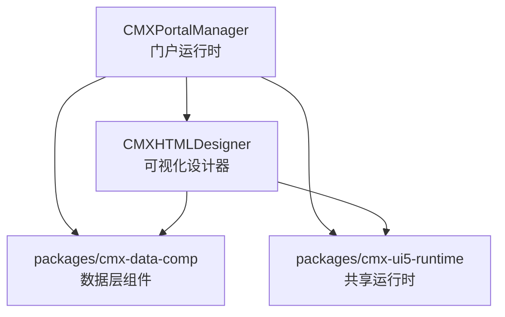
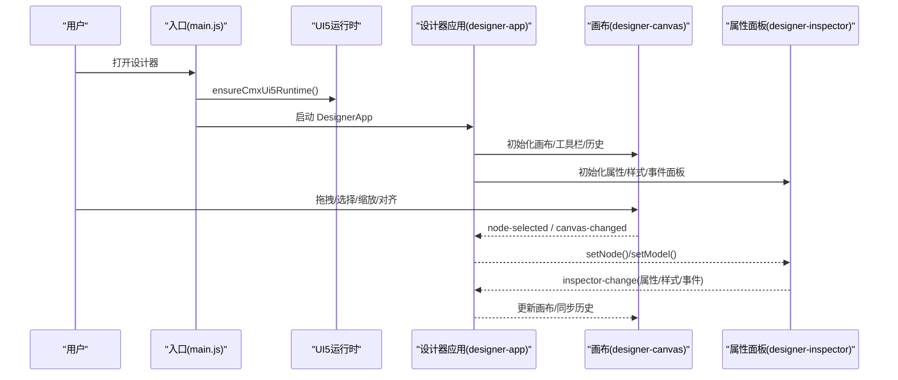
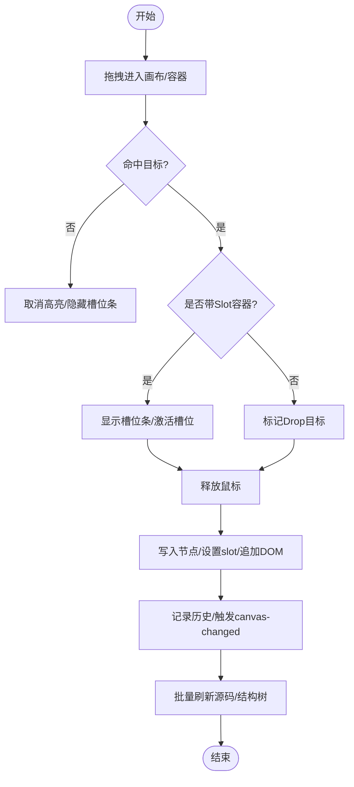
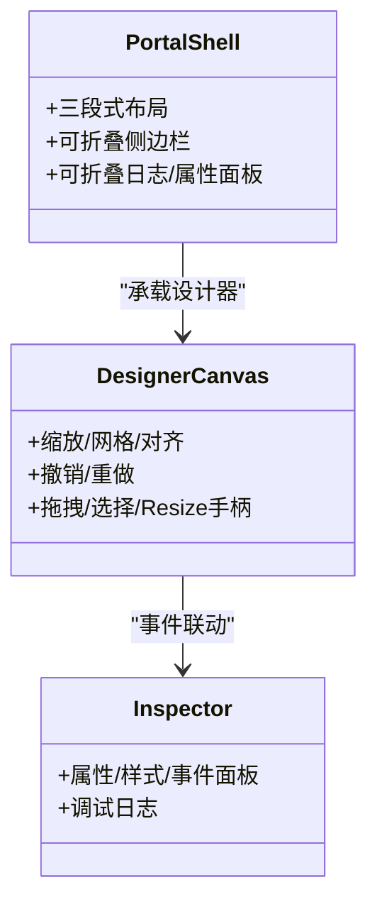
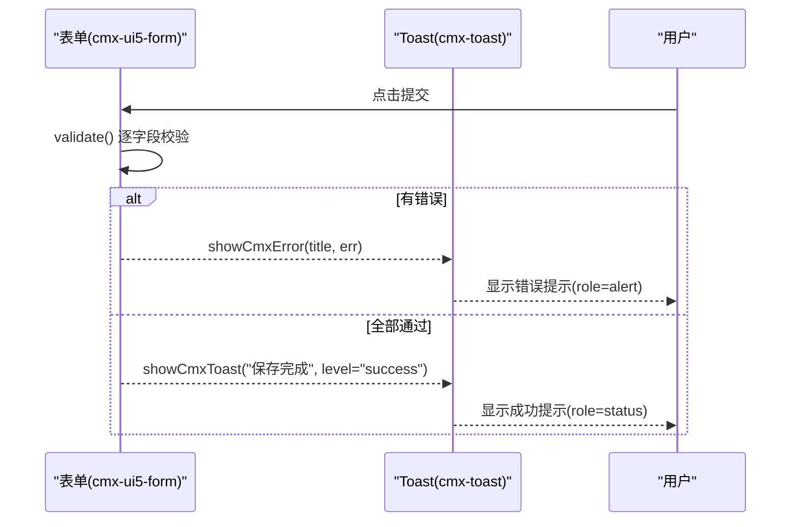
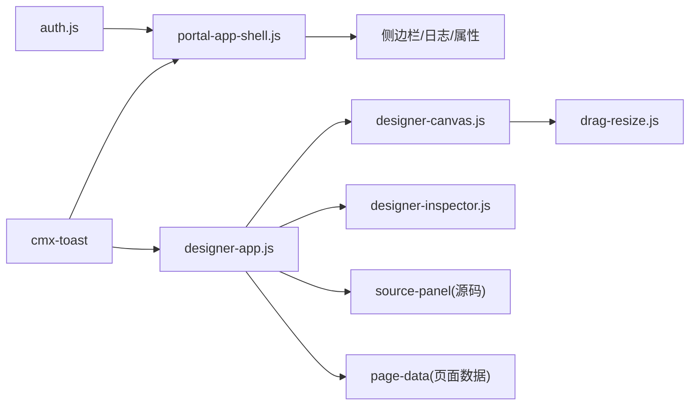

# 用户体验设计

<cite>
**本文引用的文件**
- [README.md](file://README.md)
- [CMXHTMLDesigner/src/main.js](file://CMXHTMLDesigner/src/main.js)
- [CMXPortalManager/src/main.js](file://CMXPortalManager/src/main.js)
- [CMXHTMLDesigner/src/components/designer-app.js](file://CMXHTMLDesigner/src/components/designer-app.js)
- [CMXHTMLDesigner/src/components/designer-canvas.js](file://CMXHTMLDesigner/src/components/designer-canvas.js)
- [CMXHTMLDesigner/src/components/designer-inspector.js](file://CMXHTMLDesigner/src/components/designer-inspector.js)
- [CMXHTMLDesigner/src/utils/drag-resize.js](file://CMXHTMLDesigner/src/utils/drag-resize.js)
- [CMXPortalManager/src/components/portal-app-shell.js](file://CMXPortalManager/src/components/portal-app-shell.js)
- [CMXPortalManager/src/lib/auth.js](file://CMXPortalManager/src/lib/auth.js)
- [packages/cmx-data-comp/src/lib/__tests__/cmx-toast.test.js](file://packages/cmx-data-comp/src/lib/__tests__/cmx-toast.test.js)
- [packages/cmx-data-comp/src/components/cmx-ui5-form.js](file://packages/cmx-data-comp/src/components/cmx-ui5-form.js)
- [CMXHTMLDesigner/src/metadata/event-presets.json](file://CMXHTMLDesigner/src/metadata/event-presets.json)
</cite>

## 目录
1. [简介](#简介)
2. [项目结构](#项目结构)
3. [核心组件](#核心组件)
4. [架构总览](#架构总览)
5. [详细组件分析](#详细组件分析)
6. [依赖关系分析](#依赖关系分析)
7. [性能考量](#性能考量)
8. [故障排查指南](#故障排查指南)
9. [结论](#结论)
10. [附录](#附录)

## 简介
本文件面向 CMX 企业门户平台的用户体验设计最佳实践，聚焦可视化设计器的交互原则（拖拽、实时预览、属性编辑）、企业级界面规范（布局一致性、响应式、无障碍）、表单可用性（输入验证、错误提示、操作反馈），以及移动端适配、键盘导航与屏幕阅读器支持。内容基于仓库中实际实现进行提炼，并给出可操作的指导与图示。

## 项目结构
CMX 前端为 monorepo，包含：
- 门户运行时（/portal）：应用外壳、侧边栏、工作区、日志与属性面板等
- 可视化设计器（/html）：画布、属性/样式/事件面板、源码编辑器、页面数据管理
- 数据层 Web Components：表格、表单、树表、公式等
- 共享 UI5 运行时：主题、语言、UI5 元素渲染

**图表来源**
- [README.md:10-17](file://README.md#L10-L17)

**章节来源**
- [README.md:10-17](file://README.md#L10-L17)

## 核心组件
- 设计器主应用：协调画布、属性面板、源码、页面数据、导入导出、多页运行等
- 设计画布：拖拽放置、节点选择、缩放、对齐、撤销重做、网格、Slot 区域指示
- 属性/样式/事件面板：元数据驱动的属性编辑、样式分组、事件脚本绑定与调试
- 门户外壳：三段式布局（顶栏/主体/状态栏），可折叠侧边栏与日志/属性面板
- 认证与全局错误：登录门、统一拦截器、全局错误 Toast

**章节来源**
- [CMXHTMLDesigner/src/components/designer-app.js:39-193](file://CMXHTMLDesigner/src/components/designer-app.js#L39-L193)
- [CMXHTMLDesigner/src/components/designer-canvas.js:50-176](file://CMXHTMLDesigner/src/components/designer-canvas.js#L50-L176)
- [CMXHTMLDesigner/src/components/designer-inspector.js:48-135](file://CMXHTMLDesigner/src/components/designer-inspector.js#L48-L135)
- [CMXPortalManager/src/components/portal-app-shell.js:6-200](file://CMXPortalManager/src/components/portal-app-shell.js#L6-L200)
- [CMXHTMLDesigner/src/main.js:11-28](file://CMXHTMLDesigner/src/main.js#L11-L28)
- [CMXPortalManager/src/main.js:16-48](file://CMXPortalManager/src/main.js#L16-L48)

## 架构总览
设计器与门户通过统一的启动流程与运行时初始化，确保主题、语言、认证一致；设计器内部以组件化方式组织，画布与属性面板通过事件解耦协作。

**图表来源**
- [CMXHTMLDesigner/src/main.js:16-28](file://CMXHTMLDesigner/src/main.js#L16-L28)
- [CMXHTMLDesigner/src/components/designer-app.js:75-193](file://CMXHTMLDesigner/src/components/designer-app.js#L75-L193)
- [CMXHTMLDesigner/src/components/designer-canvas.js:97-176](file://CMXHTMLDesigner/src/components/designer-canvas.js#L97-L176)
- [CMXHTMLDesigner/src/components/designer-inspector.js:76-135](file://CMXHTMLDesigner/src/components/designer-inspector.js#L76-L135)

## 详细组件分析

### 可视化设计器交互设计原则
- 拖拽操作
  - 从调色板拖入新节点到画布容器，或画布内移动节点到目标容器
  - 对支持 Slot 的容器显示“槽位条”，明确插入位置（默认内容、startContent、endContent 等）
  - 拖拽命中使用 composedPath 穿透 Shadow DOM，避免误判
  - 拖拽过程 rAF 节流，减少重复计算
- 实时预览
  - 画布变更触发结构树刷新；属性/样式/事件变更合并到下一帧批量刷新，降低卡顿
  - 支持缩放、网格、对齐、撤销/重做，提升定位与修正效率
- 属性编辑
  - 基于元数据的属性面板：文本、数字、布尔、下拉、颜色、原始 style 等
  - 事件脚本编辑器集成 CodeMirror，支持 debugger 插入、事件预设提示
  - 模型与列配置在独立面板编辑，联动刷新

**图表来源**
- [CMXHTMLDesigner/src/components/designer-canvas.js:531-607](file://CMXHTMLDesigner/src/components/designer-canvas.js#L531-L607)
- [CMXHTMLDesigner/src/components/designer-canvas.js:610-642](file://CMXHTMLDesigner/src/components/designer-canvas.js#L610-L642)
- [CMXHTMLDesigner/src/components/designer-app.js:402-456](file://CMXHTMLDesigner/src/components/designer-app.js#L402-L456)

**章节来源**
- [CMXHTMLDesigner/src/components/designer-canvas.js:50-176](file://CMXHTMLDesigner/src/components/designer-canvas.js#L50-L176)
- [CMXHTMLDesigner/src/components/designer-canvas.js:531-642](file://CMXHTMLDesigner/src/components/designer-canvas.js#L531-L642)
- [CMXHTMLDesigner/src/components/designer-inspector.js:268-572](file://CMXHTMLDesigner/src/components/designer-inspector.js#L268-L572)
- [CMXHTMLDesigner/src/components/designer-app.js:402-456](file://CMXHTMLDesigner/src/components/designer-app.js#L402-L456)

### 企业级界面设计规范
- 布局一致性
  - 门户采用三段式网格布局（顶栏/主体/状态栏），侧边栏、日志、属性面板可折叠，保证信息密度与空间利用
  - 设计器工作区支持水平/垂直分隔条拖拽调整，提供最小/最大宽度约束
- 响应式设计
  - 主体区域使用 flex/grid 自适应，子区域设置 min-width/min-height 防止溢出
  - 画布缩放与网格辅助，适配不同分辨率与缩放比例
- 无障碍访问支持
  - 按钮与控件提供 tooltip、accessible-name、role 语义
  - 调试日志与 toast 使用 role=status/alert，配合 aria-live 区域增强可读性
  - 键盘快捷键：撤销/重做、删除选中节点、Tab 顺序合理

**图表来源**
- [CMXPortalManager/src/components/portal-app-shell.js:6-200](file://CMXPortalManager/src/components/portal-app-shell.js#L6-L200)
- [CMXHTMLDesigner/src/components/designer-canvas.js:66-95](file://CMXHTMLDesigner/src/components/designer-canvas.js#L66-L95)
- [CMXHTMLDesigner/src/components/designer-inspector.js:48-135](file://CMXHTMLDesigner/src/components/designer-inspector.js#L48-L135)

**章节来源**
- [CMXPortalManager/src/components/portal-app-shell.js:6-200](file://CMXPortalManager/src/components/portal-app-shell.js#L6-L200)
- [CMXHTMLDesigner/src/components/designer-canvas.js:66-95](file://CMXHTMLDesigner/src/components/designer-canvas.js#L66-L95)
- [CMXHTMLDesigner/src/components/designer-inspector.js:48-135](file://CMXHTMLDesigner/src/components/designer-inspector.js#L48-L135)

### 表单设计的可用性原则
- 输入验证
  - 提交时逐字段校验 required/requiredWhen/validate/validateWhen，失败标红并返回结构化错误列表
  - 非必填且空值跳过校验，减少干扰
- 错误提示
  - 使用统一 Toast 组件，区分 success/warning/error，自动去重与超时消失
  - 错误级别使用 role=alert，标题加粗，便于屏幕阅读器识别
- 操作反馈
  - 保存/导入成功提示，失败时展示原因与补救建议
  - 全局错误兜底：未捕获异常/拒绝 Promise 转为轻量 Toast，避免用户无感知

**图表来源**
- [packages/cmx-data-comp/src/components/cmx-ui5-form.js:672-697](file://packages/cmx-data-comp/src/components/cmx-ui5-form.js#L672-L697)
- [packages/cmx-data-comp/src/lib/__tests__/cmx-toast.test.js:24-59](file://packages/cmx-data-comp/src/lib/__tests__/cmx-toast.test.js#L24-L59)

**章节来源**
- [packages/cmx-data-comp/src/components/cmx-ui5-form.js:672-697](file://packages/cmx-data-comp/src/components/cmx-ui5-form.js#L672-L697)
- [packages/cmx-data-comp/src/lib/__tests__/cmx-toast.test.js:24-59](file://packages/cmx-data-comp/src/lib/__tests__/cmx-toast.test.js#L24-L59)

### 移动端适配、键盘导航与屏幕阅读器支持
- 移动端适配
  - 画布支持缩放与网格，便于小屏精细操作
  - 分隔条拖拽与面板折叠，适应窄屏空间
- 键盘导航
  - 撤销/重做快捷键（Ctrl+Z/Y），删除键删除选中节点
  - 属性/样式/事件面板使用 ui5 控件，遵循原生 Tab 顺序与焦点管理
- 屏幕阅读器支持
  - 按钮与控件提供 accessible-name、tooltip、role
  - 调试日志与 toast 使用 role=status/alert，aria-live 区域播报变化

**章节来源**
- [CMXHTMLDesigner/src/components/designer-canvas.js:142-163](file://CMXHTMLDesigner/src/components/designer-canvas.js#L142-L163)
- [CMXHTMLDesigner/src/components/designer-canvas.js:298-325](file://CMXHTMLDesigner/src/components/designer-canvas.js#L298-L325)
- [packages/cmx-data-comp/src/lib/__tests__/cmx-toast.test.js:24-59](file://packages/cmx-data-comp/src/lib/__tests__/cmx-toast.test.js#L24-L59)

### 用户研究方法与可用性测试流程
- 任务导向测试
  - 典型任务：拖拽组件到画布、设置属性、绑定事件、保存/预览
  - 指标：任务完成率、平均用时、错误次数、回退次数
- 观察与访谈
  - 观察用户在属性面板查找字段、事件绑定的路径
  - 访谈用户对错误提示清晰度、反馈及时性的感受
- 迭代优化
  - 根据测试结果调整面板分组、文案、快捷键与引导提示
  - 持续收集问题单与反馈，纳入需求池

[本节为通用方法论，不直接分析具体文件]

## 依赖关系分析
- 启动与认证
  - 设计器与门户均通过 main.js 安装全局拦截器与错误处理，再加载 UI5 运行时与应用
  - 认证模块负责登录/登出/当前用户获取，并在启动门拦截未登录访问
- 组件耦合
  - designer-app 作为协调者，订阅画布与属性面板事件，驱动源码与结构树刷新
  - 画布与属性面板通过事件解耦，降低直接依赖
- 外部依赖
  - UI5 Web Components 用于表单与控件
  - CodeMirror 用于事件脚本编辑
  - cmx-toast 提供统一提示

**图表来源**
- [CMXHTMLDesigner/src/components/designer-app.js:39-193](file://CMXHTMLDesigner/src/components/designer-app.js#L39-L193)
- [CMXHTMLDesigner/src/components/designer-canvas.js:50-176](file://CMXHTMLDesigner/src/components/designer-canvas.js#L50-L176)
- [CMXHTMLDesigner/src/components/designer-inspector.js:48-135](file://CMXHTMLDesigner/src/components/designer-inspector.js#L48-L135)
- [CMXHTMLDesigner/src/utils/drag-resize.js:1-66](file://CMXHTMLDesigner/src/utils/drag-resize.js#L1-L66)
- [CMXPortalManager/src/components/portal-app-shell.js:6-200](file://CMXPortalManager/src/components/portal-app-shell.js#L6-L200)
- [CMXPortalManager/src/lib/auth.js:105-121](file://CMXPortalManager/src/lib/auth.js#L105-L121)

**章节来源**
- [CMXHTMLDesigner/src/components/designer-app.js:39-193](file://CMXHTMLDesigner/src/components/designer-app.js#L39-L193)
- [CMXHTMLDesigner/src/components/designer-canvas.js:50-176](file://CMXHTMLDesigner/src/components/designer-canvas.js#L50-L176)
- [CMXHTMLDesigner/src/components/designer-inspector.js:48-135](file://CMXHTMLDesigner/src/components/designer-inspector.js#L48-L135)
- [CMXHTMLDesigner/src/utils/drag-resize.js:1-66](file://CMXHTMLDesigner/src/utils/drag-resize.js#L1-L66)
- [CMXPortalManager/src/components/portal-app-shell.js:6-200](file://CMXPortalManager/src/components/portal-app-shell.js#L6-L200)
- [CMXPortalManager/src/lib/auth.js:105-121](file://CMXPortalManager/src/lib/auth.js#L105-L121)

## 性能考量
- 批量刷新
  - 设计器将多次变更合并到 requestAnimationFrame 执行，显著降低拖拽与连续编辑时的卡顿
- 命中检测优化
  - 使用 composedPath 快速定位设计节点，避免强制布局与大量 getBoundingClientRect
- 历史栈限制
  - 撤销历史步数上限控制内存占用
- 资源加载
  - CodeMirror 按需加载，减少首屏体积

**章节来源**
- [CMXHTMLDesigner/src/components/designer-app.js:604-618](file://CMXHTMLDesigner/src/components/designer-app.js#L604-L618)
- [CMXHTMLDesigner/src/components/designer-canvas.js:654-693](file://CMXHTMLDesigner/src/components/designer-canvas.js#L654-L693)
- [CMXHTMLDesigner/src/components/designer-canvas.js:231-264](file://CMXHTMLDesigner/src/components/designer-canvas.js#L231-L264)

## 故障排查指南
- 启动失败
  - 检查认证拦截与 UI5 运行时加载，查看全局错误 Toast 与控制台日志
- 画布无响应
  - 确认 mutationLocked 状态（页内运行期间锁定），检查事件绑定与历史栈
- 属性面板不更新
  - 检查 inspector-change 事件是否触发，确认源码与结构树刷新逻辑
- 表单验证无效
  - 检查 required/validate 配置与表达式求值作用域，确认错误提示是否渲染

**章节来源**
- [CMXHTMLDesigner/src/main.js:11-28](file://CMXHTMLDesigner/src/main.js#L11-L28)
- [CMXPortalManager/src/main.js:16-48](file://CMXPortalManager/src/main.js#L16-L48)
- [CMXHTMLDesigner/src/components/designer-canvas.js:183-198](file://CMXHTMLDesigner/src/components/designer-canvas.js#L183-L198)
- [packages/cmx-data-comp/src/components/cmx-ui5-form.js:672-697](file://packages/cmx-data-comp/src/components/cmx-ui5-form.js#L672-L697)

## 结论
CMX 平台在设计器与门户层面提供了完善的企业级 UX 基础：
- 设计器强调拖拽直观、实时反馈与属性编辑高效
- 门户强调布局一致性与可折叠面板，满足复杂业务场景
- 表单验证与统一提示保障可用性与可维护性
- 无障碍与键盘导航覆盖关键交互路径
建议在实际项目中结合用户研究与可用性测试持续优化，确保体验与企业标准对齐。

[本节为总结性内容，不直接分析具体文件]

## 附录
- 事件预设与表单事件类型参考
- 设计器工作区尺寸约束与分隔条行为
- 认证流程与登录门拦截策略

**章节来源**
- [CMXHTMLDesigner/src/metadata/event-presets.json:1-72](file://CMXHTMLDesigner/src/metadata/event-presets.json#L1-L72)
- [CMXHTMLDesigner/src/utils/drag-resize.js:1-66](file://CMXHTMLDesigner/src/utils/drag-resize.js#L1-L66)
- [CMXPortalManager/src/lib/auth.js:105-121](file://CMXPortalManager/src/lib/auth.js#L105-L121)