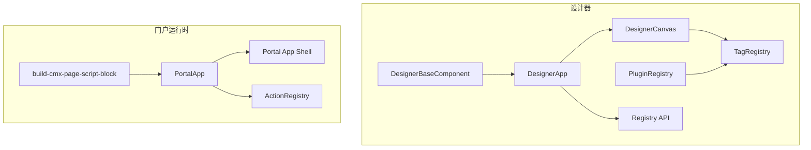
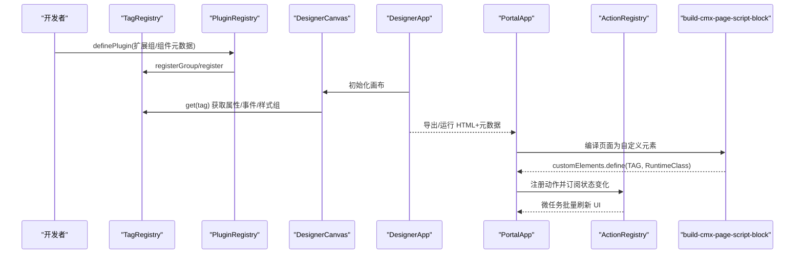
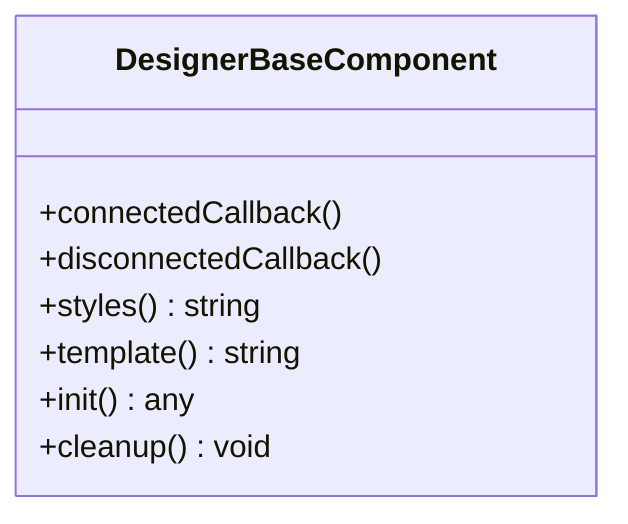
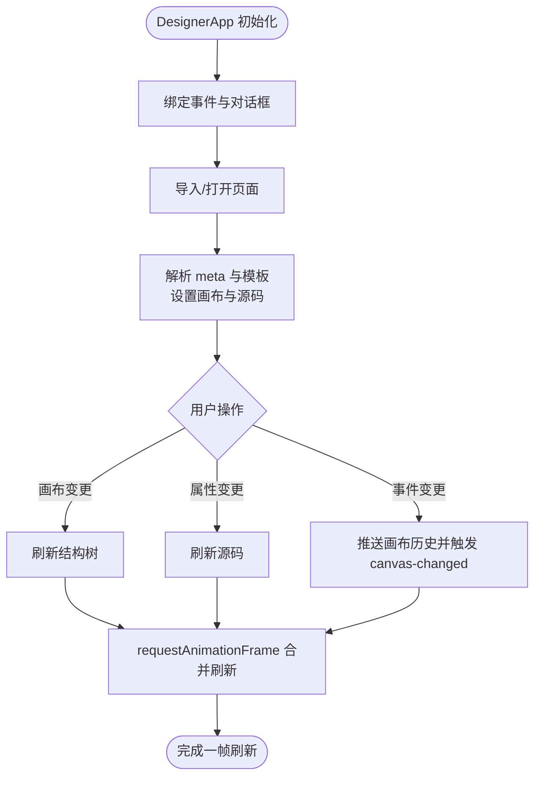
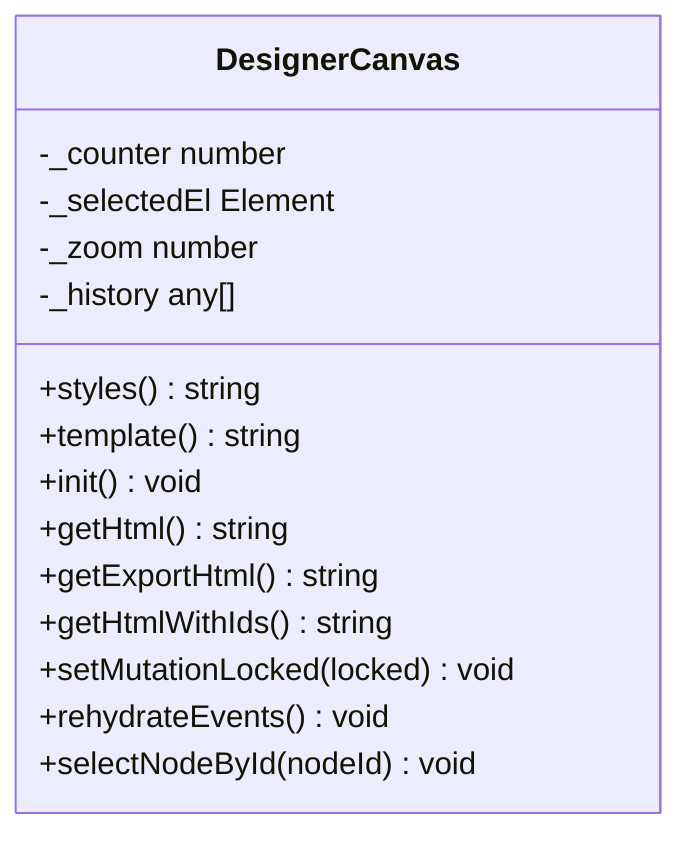
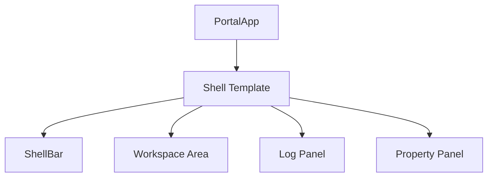
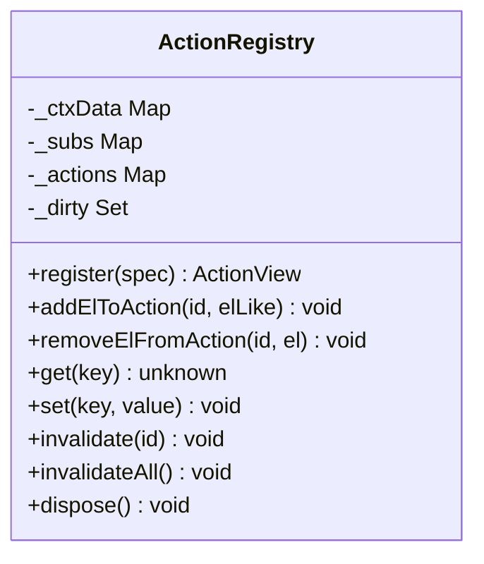
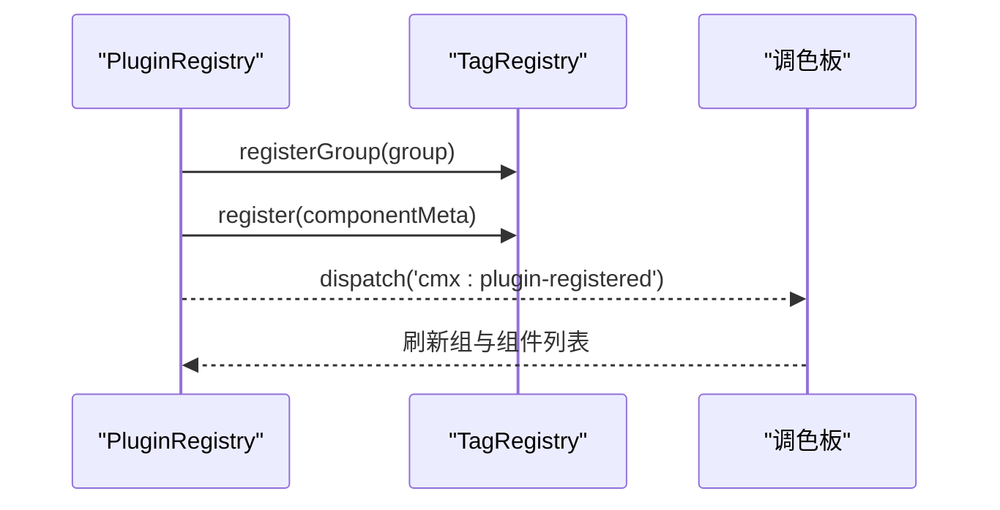
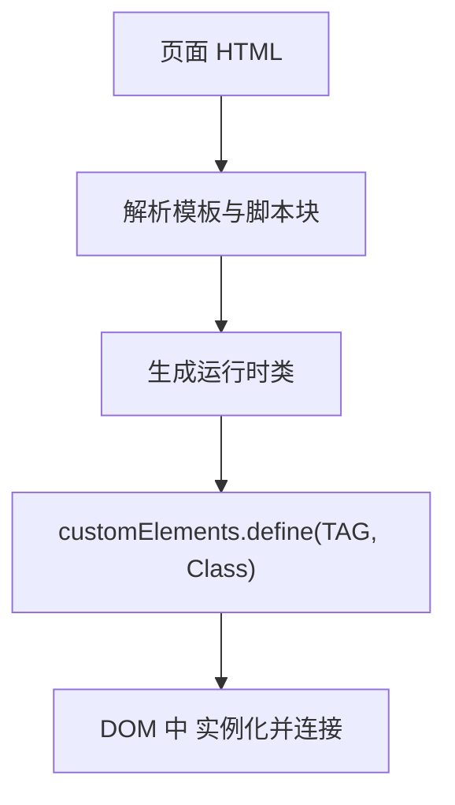
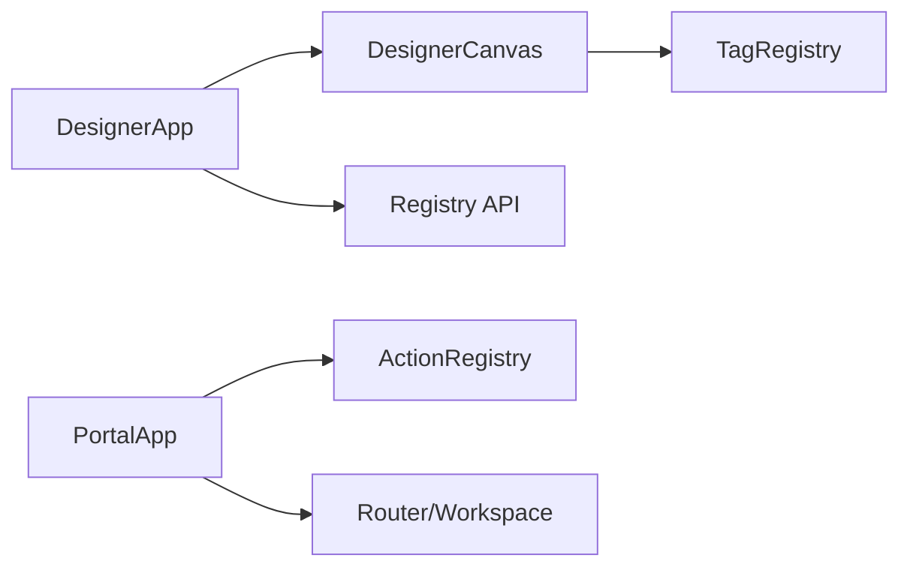

# Web Components 架构模式

<cite>
**本文引用的文件**
- [designer-base-component.js](file://CMXHTMLDesigner/src/components/designer-base-component.js)
- [designer-app.js](file://CMXHTMLDesigner/src/components/designer-app.js)
- [designer-canvas.js](file://CMXHTMLDesigner/src/components/designer-canvas.js)
- [portal-app-shell.js](file://CMXPortalManager/src/components/portal-app-shell.js)
- [portal-app.js](file://CMXPortalManager/src/components/portal-app.js)
- [plugin-registry.js](file://CMXHTMLDesigner/src/lib/plugin-registry.js)
- [tag-registry.js](file://CMXHTMLDesigner/src/metadata/tag-registry.js)
- [registry-api.js](file://CMXHTMLDesigner/src/api/registry-api.js)
- [action-registry.js](file://CMXPortalManager/src/lib/action-registry.js)
- [build-cmx-page-script-block.js](file://CMXHTMLDesigner/src/utils/build-cmx-page-script-block.js)
</cite>

## 目录
1. [简介](#简介)
2. [项目结构](#项目结构)
3. [核心组件](#核心组件)
4. [架构总览](#架构总览)
5. [详细组件分析](#详细组件分析)
6. [依赖关系分析](#依赖关系分析)
7. [性能考量](#性能考量)
8. [故障排查指南](#故障排查指南)
9. [结论](#结论)
10. [附录：开发规范与集成指南](#附录开发规范与集成指南)

## 简介
本文件系统性梳理基于原生 Web Components（自定义元素、Shadow DOM、模板）的组件化架构，覆盖生命周期管理、属性绑定、事件通信、组件注册表、插件系统与动态加载机制，并给出开发规范、性能优化策略与兼容性注意事项。该体系在 CMXHTMLDesigner（设计器）与 CMXPortalManager（门户运行时）中均有落地实践，形成“设计期元数据驱动 + 运行期组件化”的完整闭环。

## 项目结构
- 设计器侧（CMXHTMLDesigner）
  - 基类与外壳：以 DesignerBaseComponent 为统一基类，封装 Shadow DOM 挂载、样式注入、初始化与清理流程；DesignerApp 作为主应用外壳协调画布、源码、属性面板等子组件。
  - 画布与交互：DesignerCanvas 承载可视化编辑、拖拽、缩放、撤销重做、事件绑定等能力，并通过 tag 注册表约束可渲染标签与属性。
  - 元数据与插件：TagRegistry 集中管理标签元数据（属性、事件、样式组），PluginRegistry 提供运行时扩展能力（新增组、组件元数据、自定义 Inspector）。
  - API 层：Registry API 对接后端 /api/registry/*，用于保存页面时拉取 domain/app/module 等上下文。
- 门户运行时（CMXPortalManager）
  - 应用外壳：PortalApp 通过 attachShadow 构建应用级 Shell，组合侧边栏、内容区、日志区、属性面板等区域，并处理路由、通知、浮动窗口等全局行为。
  - 动作状态机：ActionRegistry 提供声明式按钮/菜单/工具项的状态管理与自动依赖追踪，支持 workspace/host 两级作用域与微任务合并刷新。
  - 动态脚本生成：build-cmx-page-script-block.js 将页面模板与逻辑编译为运行时自定义元素，按需定义到 customElements。

图表来源
- [designer-base-component.js:12-38](file://CMXHTMLDesigner/src/components/designer-base-component.js#L12-L38)
- [designer-app.js:39-73](file://CMXHTMLDesigner/src/components/designer-app.js#L39-L73)
- [designer-canvas.js:50-95](file://CMXHTMLDesigner/src/components/designer-canvas.js#L50-L95)
- [tag-registry.js:15-118](file://CMXHTMLDesigner/src/metadata/tag-registry.js#L15-L118)
- [plugin-registry.js:60-89](file://CMXHTMLDesigner/src/lib/plugin-registry.js#L60-L89)
- [registry-api.js:6-51](file://CMXHTMLDesigner/src/api/registry-api.js#L6-L51)
- [portal-app.js:32-94](file://CMXPortalManager/src/components/portal-app.js#L32-L94)
- [portal-app-shell.js:6-201](file://CMXPortalManager/src/components/portal-app-shell.js#L6-L201)
- [action-registry.js:112-187](file://CMXPortalManager/src/lib/action-registry.js#L112-L187)
- [build-cmx-page-script-block.js:75-312](file://CMXHTMLDesigner/src/utils/build-cmx-page-script-block.js#L75-L312)

章节来源
- [designer-base-component.js:12-38](file://CMXHTMLDesigner/src/components/designer-base-component.js#L12-L38)
- [designer-app.js:39-73](file://CMXHTMLDesigner/src/components/designer-app.js#L39-L73)
- [designer-canvas.js:50-95](file://CMXHTMLDesigner/src/components/designer-canvas.js#L50-L95)
- [portal-app.js:32-94](file://CMXPortalManager/src/components/portal-app.js#L32-L94)
- [portal-app-shell.js:6-201](file://CMXPortalManager/src/components/portal-app-shell.js#L6-L201)
- [action-registry.js:112-187](file://CMXPortalManager/src/lib/action-registry.js#L112-L187)
- [build-cmx-page-script-block.js:75-312](file://CMXHTMLDesigner/src/utils/build-cmx-page-script-block.js#L75-L312)

## 核心组件
- 基类与生命周期
  - DesignerBaseComponent 统一实现 connectedCallback/disconnectedCallback，自动创建 Shadow DOM、注入样式与模板，并提供 init/cleanup 钩子，保证幂等初始化与资源释放。
- 设计器外壳
  - DesignerApp 聚合画布、源码、属性面板、页数据等子组件，负责布局、事件桥接、导入导出、预览与运行上下文构造。
- 画布组件
  - DesignerCanvas 提供可视化编辑能力，包括节点选择、拖放、缩放、对齐、网格、撤销重做、事件绑定与序列化输出，严格依据 TagRegistry 的元数据过滤属性。
- 门户外壳
  - PortalApp 使用 attachShadow 构建应用壳，组合活动栏、工作区、日志区、属性面板，并处理路由、通知、浮动窗口等全局交互。
- 动作注册表
  - ActionRegistry 提供声明式 UI 状态管理，支持依赖自动追踪、微任务批量刷新、父子 registry 继承与断开观察器清理。
- 元数据与插件
  - TagRegistry 集中管理标签元数据（属性、事件、样式组），支持从 dist/metadata 异步加载与按组分组；PluginRegistry 允许运行时扩展组与组件元数据，并派发 cmx:plugin-registered 事件。
- 动态加载
  - build-cmx-page-script-block.js 将页面模板与逻辑编译为运行时自定义元素，按需 customElements.define，避免重复定义。

章节来源
- [designer-base-component.js:12-38](file://CMXHTMLDesigner/src/components/designer-base-component.js#L12-L38)
- [designer-app.js:39-73](file://CMXHTMLDesigner/src/components/designer-app.js#L39-L73)
- [designer-canvas.js:50-95](file://CMXHTMLDesigner/src/components/designer-canvas.js#L50-L95)
- [portal-app.js:32-94](file://CMXPortalManager/src/components/portal-app.js#L32-L94)
- [action-registry.js:112-187](file://CMXPortalManager/src/lib/action-registry.js#L112-L187)
- [tag-registry.js:15-118](file://CMXHTMLDesigner/src/metadata/tag-registry.js#L15-L118)
- [plugin-registry.js:60-89](file://CMXHTMLDesigner/src/lib/plugin-registry.js#L60-L89)
- [build-cmx-page-script-block.js:75-312](file://CMXHTMLDesigner/src/utils/build-cmx-page-script-block.js#L75-L312)

## 架构总览
下图展示设计器与门户运行时的关键交互：设计期通过 TagRegistry 与 PluginRegistry 管理组件元数据，DesignerCanvas 基于元数据进行渲染与校验；运行期由 PortalApp 组装 Shell，ActionRegistry 管理 UI 状态，页面模板经 build-cmx-page-script-block 编译为自定义元素后挂载。

图表来源
- [plugin-registry.js:60-89](file://CMXHTMLDesigner/src/lib/plugin-registry.js#L60-L89)
- [tag-registry.js:123-146](file://CMXHTMLDesigner/src/metadata/tag-registry.js#L123-L146)
- [designer-canvas.js:110-118](file://CMXHTMLDesigner/src/components/designer-canvas.js#L110-L118)
- [designer-app.js:316-345](file://CMXHTMLDesigner/src/components/designer-app.js#L316-L345)
- [portal-app.js:71-94](file://CMXPortalManager/src/components/portal-app.js#L71-L94)
- [action-registry.js:322-334](file://CMXPortalManager/src/lib/action-registry.js#L322-L334)
- [build-cmx-page-script-block.js:75-312](file://CMXHTMLDesigner/src/utils/build-cmx-page-script-block.js#L75-L312)

## 详细组件分析

### 基类与生命周期：DesignerBaseComponent
- 职责
  - 统一生命周期：connectedCallback 内创建 Shadow DOM、注入样式与模板、调用 init；disconnectedCallback 调用 cleanup。
  - 幂等保护：若已存在 shadowRoot 则跳过重复初始化。
  - 扩展点：styles/template/init/cleanup 供子类覆盖。
- 复杂度
  - 初始化 O(1)，清理 O(1)。
- 错误处理
  - init 返回 Promise 时捕获异常并打印错误。
- 性能
  - 避免重复 attachShadow 与 innerHTML 赋值，减少重排。

图表来源
- [designer-base-component.js:12-38](file://CMXHTMLDesigner/src/components/designer-base-component.js#L12-L38)

章节来源
- [designer-base-component.js:12-38](file://CMXHTMLDesigner/src/components/designer-base-component.js#L12-L38)

### 设计器外壳：DesignerApp
- 职责
  - 协调子组件：canvas/source/inspector/pageData/treePanel 等。
  - 事件总线：监听 node-selected、inspector-change、page-data-changed 等事件，触发视图同步与源码刷新。
  - 导入导出：解析 __designer_meta__，提取模板内容，构建保存 bundle。
  - 调试与锁定：页内运行期间锁定画布与源码变更，防止冲突。
- 数据流
  - 画布变更 → 调度刷新（requestAnimationFrame 合并）→ 更新源码与结构树。
  - 属性面板变更 → 仅更新源码（不联动画布），但事件变更会推送到画布历史。
- 性能
  - _scheduleRefresh 合并同帧多次刷新，降低卡顿。

图表来源
- [designer-app.js:75-193](file://CMXHTMLDesigner/src/components/designer-app.js#L75-L193)
- [designer-app.js:402-495](file://CMXHTMLDesigner/src/components/designer-app.js#L402-L495)
- [designer-app.js:586-618](file://CMXHTMLDesigner/src/components/designer-app.js#L586-L618)

章节来源
- [designer-app.js:75-193](file://CMXHTMLDesigner/src/components/designer-app.js#L75-L193)
- [designer-app.js:402-495](file://CMXHTMLDesigner/src/components/designer-app.js#L402-L495)
- [designer-app.js:586-618](file://CMXHTMLDesigner/src/components/designer-app.js#L586-L618)

### 画布组件：DesignerCanvas
- 职责
  - 可视化编辑：选中、拖拽、缩放、对齐、网格、撤销重做、删除。
  - 元数据驱动：通过 TagRegistry.get(tag) 获取允许的属性集合，过滤内部属性。
  - 序列化：提供 getHtml/getExportHtml/getHtmlWithIds 等方法，输出设计区 HTML。
  - 调试：支持 rehydrateEvents 重新绑定事件，sourceURL 带 pageId。
- 事件
  - 派发 node-selected、canvas-changed，供上层 DesignerApp 消费。
- 性能
  - 滚动/拖拽时使用 requestAnimationFrame 防抖；MutationObserver 与遮罩隐藏优化交互体验。

图表来源
- [designer-canvas.js:50-95](file://CMXHTMLDesigner/src/components/designer-canvas.js#L50-L95)
- [designer-canvas.js:97-175](file://CMXHTMLDesigner/src/components/designer-canvas.js#L97-L175)

章节来源
- [designer-canvas.js:50-95](file://CMXHTMLDesigner/src/components/designer-canvas.js#L50-L95)
- [designer-canvas.js:97-175](file://CMXHTMLDesigner/src/components/designer-canvas.js#L97-L175)

### 门户外壳：PortalApp 与 Shell
- 职责
  - 构建应用 Shell：三段网格布局（顶栏/中区/状态栏），组合侧边栏、内容区、日志区、属性面板。
  - 全局事件：活动栏切换、通知中心、浮动窗口状态、面板收起等。
  - 路由与启动：router.attach 与 handleInitialLocation，决定首屏。
- 样式与布局
  - 使用 CSS Grid/Flexbox，变量控制面板尺寸，splitter 分割区域。
- 性能
  - 使用 queueMicrotask 延迟同步属性/日志 dock，避免阻塞首屏。

图表来源
- [portal-app.js:32-94](file://CMXPortalManager/src/components/portal-app.js#L32-L94)
- [portal-app-shell.js:6-201](file://CMXPortalManager/src/components/portal-app-shell.js#L6-L201)

章节来源
- [portal-app.js:32-94](file://CMXPortalManager/src/components/portal-app.js#L32-L94)
- [portal-app-shell.js:6-201](file://CMXPortalManager/src/components/portal-app-shell.js#L6-L201)

### 动作注册表：ActionRegistry
- 职责
  - 声明式 UI 状态：enabled/visible/props 同步到关联元素。
  - 依赖自动追踪：update 中通过 ctx Proxy 读取 key 自动登记依赖，ctx.set 触发脏标记与微任务刷新。
  - 层级作用域：workspace/host 两级 registry，host 覆盖 workspace。
  - 断开观察器：全局 MutationObserver 清理已脱离 DOM 的元素引用。
- 性能
  - 微任务合并刷新，避免频繁重绘；capture 阶段拦截 click 阻止 disabled 元素响应。
- 接口
  - register/addElToAction/removeElFromAction/invalidate/invalidateAll/getAction/dispose。

图表来源
- [action-registry.js:112-187](file://CMXPortalManager/src/lib/action-registry.js#L112-L187)
- [action-registry.js:250-334](file://CMXPortalManager/src/lib/action-registry.js#L250-L334)
- [action-registry.js:454-494](file://CMXPortalManager/src/lib/action-registry.js#L454-L494)

章节来源
- [action-registry.js:112-187](file://CMXPortalManager/src/lib/action-registry.js#L112-L187)
- [action-registry.js:250-334](file://CMXPortalManager/src/lib/action-registry.js#L250-L334)
- [action-registry.js:454-494](file://CMXPortalManager/src/lib/action-registry.js#L454-L494)

### 元数据与插件系统：TagRegistry 与 PluginRegistry
- TagRegistry
  - 集中管理标签元数据：attrs/events/styleGroups/defaultSetup。
  - 异步加载：ensureTagRegistryLoaded 并行 fetch common-attrs/style-groups/event-presets/tag-index，再加载各标签 JSON。
  - 默认回退：未知 tag 返回通用元数据，包含常见事件与默认文本。
- PluginRegistry
  - definePlugin：校验 id/components，注册组与组件元数据，可选 customInspectors。
  - 事件：cmx:plugin-registered 通知调色板刷新。
  - HMR 友好：重注册时按 tag 覆盖，便于热更新。

图表来源
- [plugin-registry.js:60-89](file://CMXHTMLDesigner/src/lib/plugin-registry.js#L60-L89)
- [tag-registry.js:24-55](file://CMXHTMLDesigner/src/metadata/tag-registry.js#L24-L55)
- [tag-registry.js:123-146](file://CMXHTMLDesigner/src/metadata/tag-registry.js#L123-L146)

章节来源
- [plugin-registry.js:60-89](file://CMXHTMLDesigner/src/lib/plugin-registry.js#L60-L89)
- [tag-registry.js:24-55](file://CMXHTMLDesigner/src/metadata/tag-registry.js#L24-L55)
- [tag-registry.js:123-146](file://CMXHTMLDesigner/src/metadata/tag-registry.js#L123-L146)

### 动态加载机制：页面脚本编译与自定义元素定义
- 编译过程
  - build-cmx-page-script-block.js 将页面模板与逻辑编译为运行时自定义元素类，并在末尾执行 customElements.define(TAG, RuntimeClass)。
  - 支持查找 templateRoot，兼容不同宿主环境。
- 运行时挂载
  - 门户运行时根据 URL/路由打开页面，页面 HTML 中包含模板与脚本块，浏览器解析后定义元素并挂载。

图表来源
- [build-cmx-page-script-block.js:75-312](file://CMXHTMLDesigner/src/utils/build-cmx-page-script-block.js#L75-L312)

章节来源
- [build-cmx-page-script-block.js:75-312](file://CMXHTMLDesigner/src/utils/build-cmx-page-script-block.js#L75-L312)

## 依赖关系分析
- 组件耦合
  - DesignerApp 强依赖 DesignerCanvas、Inspector、PageData 等子组件，通过事件解耦。
  - DesignerCanvas 依赖 TagRegistry 进行属性白名单过滤，确保设计区只保留合法属性。
  - PortalApp 依赖 ActionRegistry 管理 UI 状态，依赖 Router 与 Workspace 模块。
- 外部依赖
  - Registry API 对接后端 /api/registry/*，用于保存页面时获取 DAM 坐标。
  - UI5 组件（如 ui5-button）在设计器中使用，需确保运行时可用。
- 循环依赖
  - 未发现明显循环依赖；模块间通过事件与 API 解耦。

图表来源
- [designer-app.js:39-73](file://CMXHTMLDesigner/src/components/designer-app.js#L39-L73)
- [designer-canvas.js:110-118](file://CMXHTMLDesigner/src/components/designer-canvas.js#L110-L118)
- [registry-api.js:6-51](file://CMXHTMLDesigner/src/api/registry-api.js#L6-L51)
- [portal-app.js:32-94](file://CMXPortalManager/src/components/portal-app.js#L32-L94)
- [action-registry.js:112-187](file://CMXPortalManager/src/lib/action-registry.js#L112-L187)

章节来源
- [designer-app.js:39-73](file://CMXHTMLDesigner/src/components/designer-app.js#L39-L73)
- [designer-canvas.js:110-118](file://CMXHTMLDesigner/src/components/designer-canvas.js#L110-L118)
- [registry-api.js:6-51](file://CMXHTMLDesigner/src/api/registry-api.js#L6-L51)
- [portal-app.js:32-94](file://CMXPortalManager/src/components/portal-app.js#L32-L94)
- [action-registry.js:112-187](file://CMXPortalManager/src/lib/action-registry.js#L112-L187)

## 性能考量
- 渲染与更新
  - 使用 requestAnimationFrame 合并画布与源码刷新，避免高频抖动。
  - ActionRegistry 使用 queueMicrotask 批量刷新，减少重绘次数。
- 内存与清理
  - DesignerBaseComponent.cleanup 移除 window 级监听器；PortalApp.disconnectedCallback 清理全局事件。
  - ActionRegistry 全局 MutationObserver 清理已脱离 DOM 的元素引用，防止泄漏。
- 网络与加载
  - TagRegistry.ensureTagRegistryLoaded 并行 fetch 多个 JSON，缩短冷启动时间。
  - 动态脚本编译仅在需要时定义自定义元素，避免重复定义。

[本节为通用性能建议，无需特定文件来源]

## 故障排查指南
- 初始化失败
  - DesignerBaseComponent.init 返回 Promise 时捕获异常并打印错误，检查 init 中的异步逻辑。
- 属性未生效
  - DesignerCanvas 使用 TagRegistry.get(tag).attrs 过滤属性，确认组件元数据中是否声明了对应属性。
- 事件未触发
  - 检查 DesignerApp 是否绑定了相应事件监听器；确认画布是否处于 mutation-locked 状态。
- 动作状态不同步
  - 确认 ActionRegistry.update 是否正确读取 ctx 键值；必要时调用 invalidate/invalidateAll 强制刷新。
- 动态元素未挂载
  - 检查 build-cmx-page-script-block 生成的自定义元素是否成功定义；确认模板 ID 与选择器匹配。

章节来源
- [designer-base-component.js:17-20](file://CMXHTMLDesigner/src/components/designer-base-component.js#L17-L20)
- [designer-canvas.js:110-118](file://CMXHTMLDesigner/src/components/designer-canvas.js#L110-L118)
- [designer-app.js:402-495](file://CMXHTMLDesigner/src/components/designer-app.js#L402-L495)
- [action-registry.js:322-334](file://CMXPortalManager/src/lib/action-registry.js#L322-L334)
- [build-cmx-page-script-block.js:75-312](file://CMXHTMLDesigner/src/utils/build-cmx-page-script-block.js#L75-L312)

## 结论
本项目以原生 Web Components 为核心，构建了设计器与门户运行时的组件化架构。通过统一的基类与生命周期管理、元数据驱动的组件注册与插件扩展、以及声明式的动作状态机，实现了高内聚、低耦合、易扩展的前端工程体系。结合性能优化策略与兼容性考虑，为复杂企业应用的开发与维护提供了坚实基础。

[本节为总结性内容，无需特定文件来源]

## 附录：开发规范与集成指南

### 组件开发规范
- 继承 DesignerBaseComponent，覆盖 styles/template/init/cleanup。
- 使用 Shadow DOM 隔离样式与结构，避免全局污染。
- 通过属性与事件进行组件间通信，避免直接操作 DOM。
- 在 init 中查询元素并绑定监听器，在 cleanup 中移除监听器。

章节来源
- [designer-base-component.js:12-38](file://CMXHTMLDesigner/src/components/designer-base-component.js#L12-L38)

### 属性绑定与事件通信
- 属性绑定：通过 TagRegistry 声明属性，DesignerCanvas 过滤非法属性。
- 事件通信：组件派发 CustomEvent，父组件监听并处理；DesignerApp 作为事件中枢协调子组件。

章节来源
- [designer-canvas.js:110-118](file://CMXHTMLDesigner/src/components/designer-canvas.js#L110-L118)
- [designer-app.js:402-495](file://CMXHTMLDesigner/src/components/designer-app.js#L402-L495)

### 组件注册表与插件系统
- 使用 PluginRegistry.definePlugin 扩展组件元数据与组。
- 确保插件 id 唯一，components 非空；HMR 场景下支持重注册。

章节来源
- [plugin-registry.js:60-89](file://CMXHTMLDesigner/src/lib/plugin-registry.js#L60-L89)
- [tag-registry.js:24-55](file://CMXHTMLDesigner/src/metadata/tag-registry.js#L24-L55)

### 动态加载机制
- 页面模板经 build-cmx-page-script-block 编译为自定义元素，按需定义。
- 运行时通过 URL/路由打开页面，确保模板与脚本块正确加载。

章节来源
- [build-cmx-page-script-block.js:75-312](file://CMXHTMLDesigner/src/utils/build-cmx-page-script-block.js#L75-L312)

### 性能优化策略
- 合并刷新：使用 requestAnimationFrame 与 queueMicrotask 合并多次更新。
- 懒加载：异步加载元数据与页面脚本，减少首屏负担。
- 内存管理：及时清理监听器与观察者，避免内存泄漏。

[本节为通用优化建议，无需特定文件来源]

### 兼容性考虑
- 浏览器支持：确保目标浏览器支持 Web Components（customElements、Shadow DOM）。
- 第三方组件：如 UI5 组件需在运行时可用，注意版本兼容。
- 降级策略：在不支持的环境中提供降级方案或提示。

[本节为通用兼容性建议，无需特定文件来源]