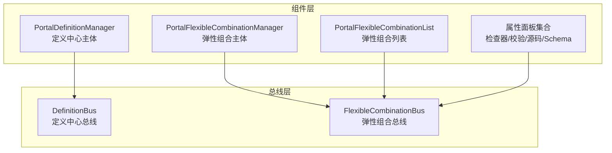
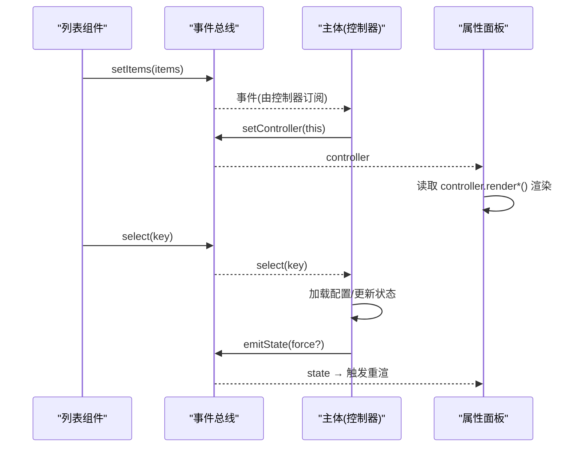
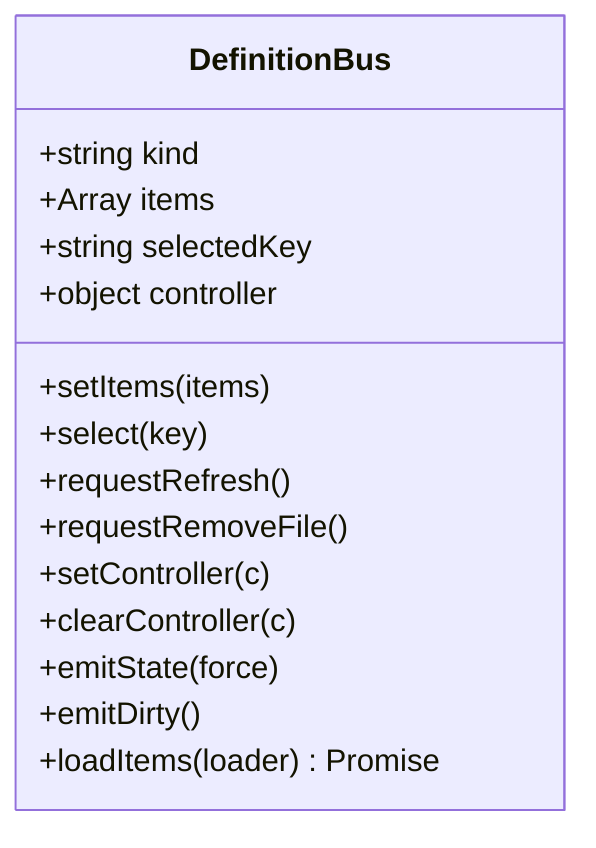
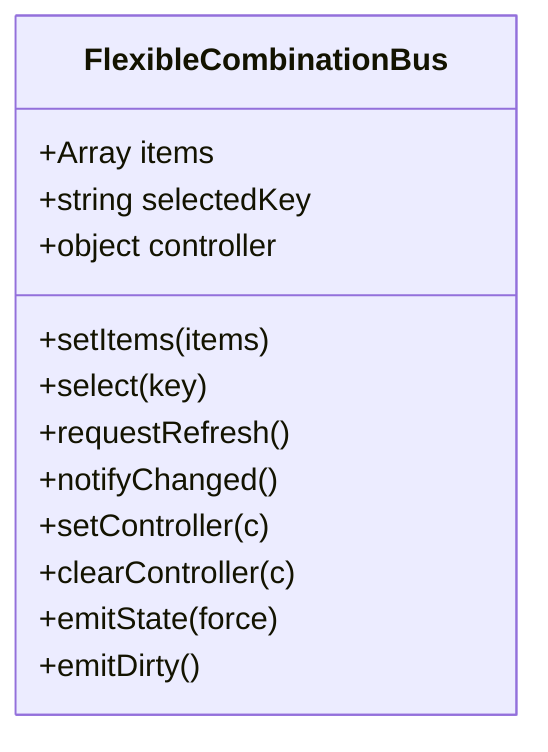
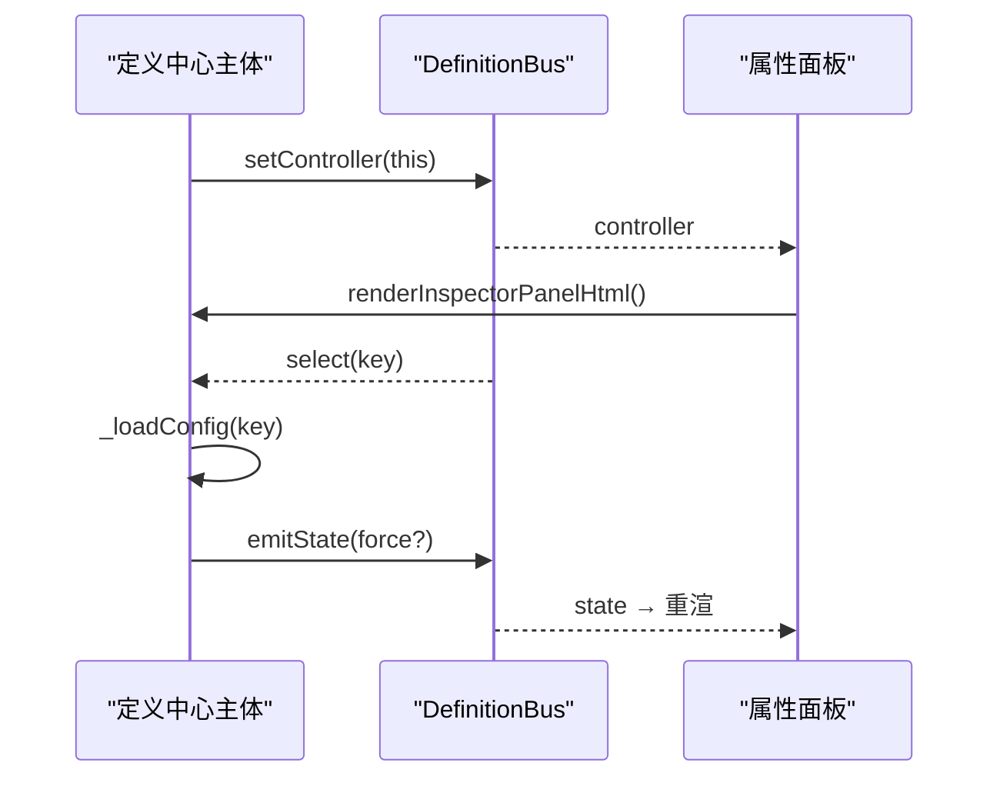
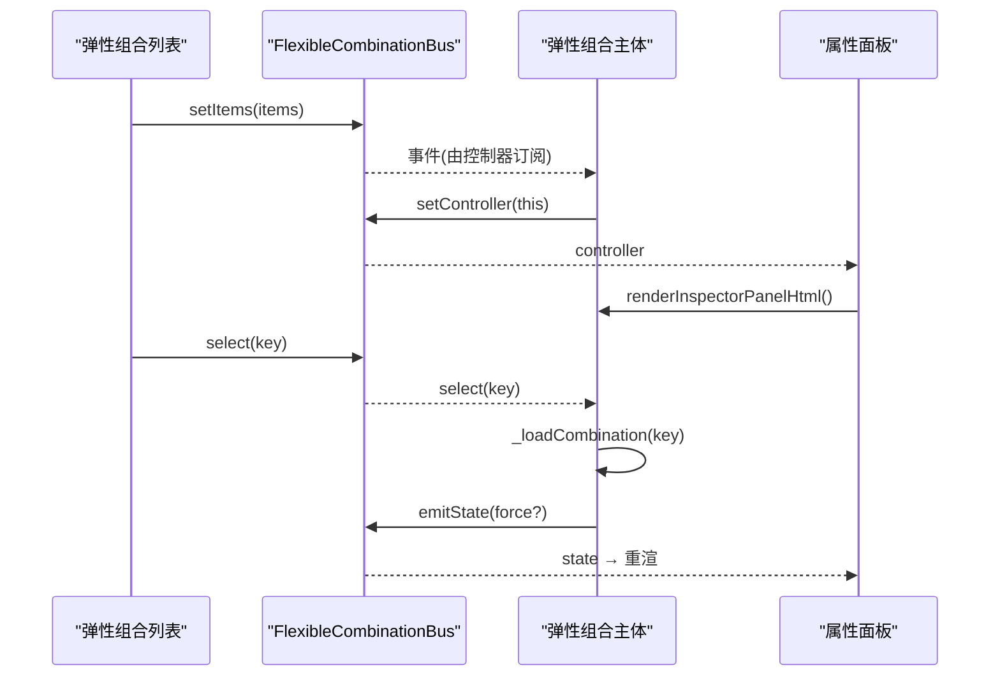
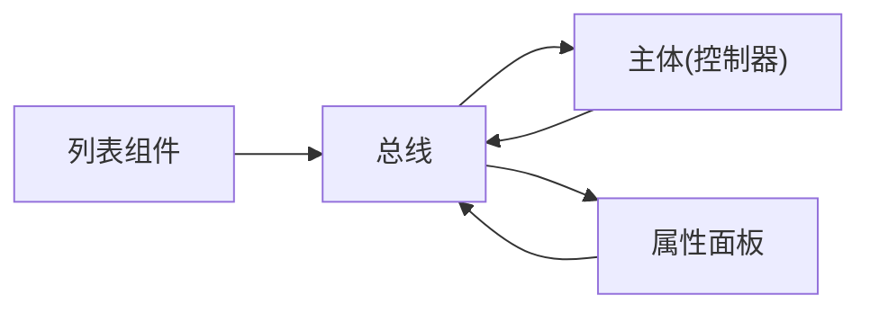
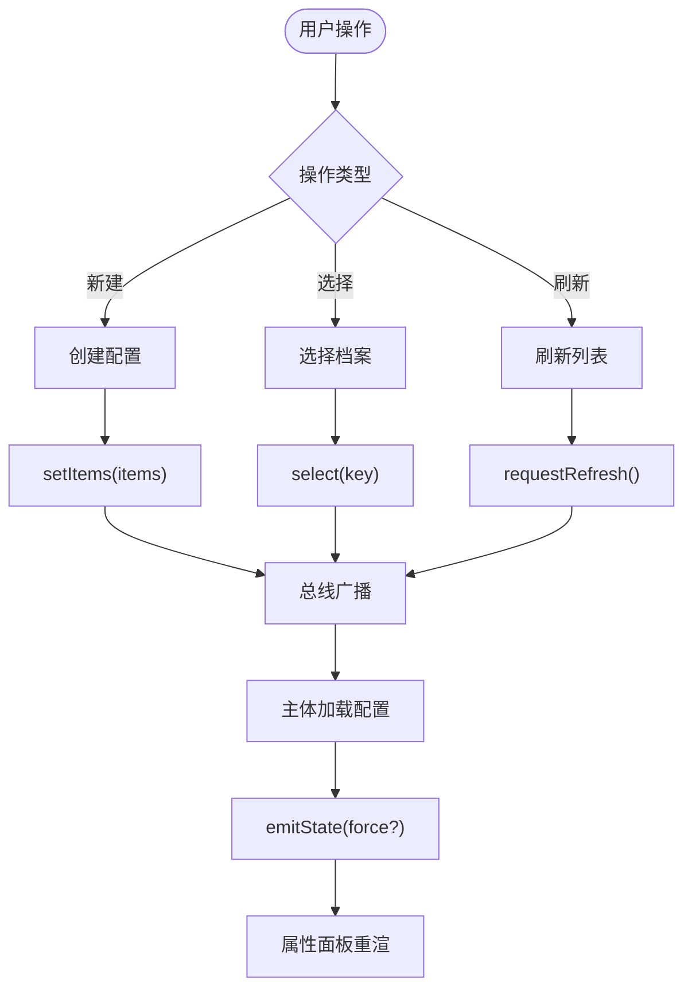

# 事件驱动通信机制

<cite>
**本文引用的文件**
- [definition-bus.js](file://CMXPortalManager/src/lib/definition-bus.js)
- [flexible-combination-bus.js](file://CMXPortalManager/src/lib/flexible-combination-bus.js)
- [portal-definition-manager.js](file://CMXPortalManager/src/components/portal-definition-manager.js)
- [portal-flexible-combination-manager.js](file://CMXPortalManager/src/components/portal-flexible-combination-manager.js)
- [portal-flexible-combination-panels.js](file://CMXPortalManager/src/components/portal-flexible-combination-panels.js)
</cite>

## 目录
1. [简介](#简介)
2. [项目结构](#项目结构)
3. [核心组件](#核心组件)
4. [架构总览](#架构总览)
5. [详细组件分析](#详细组件分析)
6. [依赖关系分析](#依赖关系分析)
7. [性能考量](#性能考量)
8. [故障排查指南](#故障排查指南)
9. [结论](#结论)
10. [附录：使用示例与最佳实践](#附录使用示例与最佳实践)

## 简介
本文件系统性阐述 CMX Portal Manager 中的事件驱动通信机制，重点覆盖：
- 全局事件总线与发布订阅模式在跨 Shadow DOM、跨模块组件间的解耦通信
- 定义总线（DefinitionBus）与弹性组合总线（FlexibleCombinationBus）的实现原理、事件语义与作用域隔离策略
- 事件命名规范、错误处理与性能优化实践
- 事件流图、时序图与具体使用示例
- 面向工程落地的最佳实践与常见问题解决方案

## 项目结构
事件驱动通信主要位于 CMXPortalManager 的 lib 与 components 目录：
- lib 层提供总线抽象与单例管理：definition-bus.js、flexible-combination-bus.js
- components 层通过总线进行列表、主体、属性面板之间的松耦合通信：portal-definition-manager.js、portal-flexible-combination-manager.js、portal-flexible-combination-panels.js

图表来源
- [definition-bus.js:1-48](file://CMXPortalManager/src/lib/definition-bus.js#L1-L48)
- [flexible-combination-bus.js:1-73](file://CMXPortalManager/src/lib/flexible-combination-bus.js#L1-L73)
- [portal-definition-manager.js:1-200](file://CMXPortalManager/src/components/portal-definition-manager.js#L1-L200)
- [portal-flexible-combination-manager.js:1-165](file://CMXPortalManager/src/components/portal-flexible-combination-manager.js#L1-L165)
- [portal-flexible-combination-panels.js:76-154](file://CMXPortalManager/src/components/portal-flexible-combination-panels.js#L76-L154)

章节来源
- [definition-bus.js:1-48](file://CMXPortalManager/src/lib/definition-bus.js#L1-L48)
- [flexible-combination-bus.js:1-73](file://CMXPortalManager/src/lib/flexible-combination-bus.js#L1-L73)

## 核心组件
- DefinitionBus：为“定义中心”（DCT/DOC）提供列表↔主体↔检查器的共享总线。每个 kind 一个 bus，通过 globalThis 保证跨模块解析到同一实例；结构与 FlexibleCombinationBus 对齐，额外带 kind 标识与 loadItems 去重。
- FlexibleCombinationBus：为“弹性组合”提供列表（explorer 区）↔主体（content 区）的共享总线。状态（items/selectedKey/controller）保存在总线上，避免晚挂载组件错过事件造成的竞态。支持作用域隔离（全局单例或页面私有实例）。

关键能力对比
- 共同点：基于 EventTarget 的自定义事件；维护共享状态；控制器委托协议；焦点保护与局部刷新；dirty/state 通知。
- 差异点：DefinitionBus 按 kind 隔离并内置 loadItems 去重；FlexibleCombinationBus 提供 combinationBusFor(scope) 作用域总线。

章节来源
- [definition-bus.js:1-48](file://CMXPortalManager/src/lib/definition-bus.js#L1-L48)
- [flexible-combination-bus.js:1-73](file://CMXPortalManager/src/lib/flexible-combination-bus.js#L1-L73)

## 架构总览
事件驱动通信采用“总线 + 控制器”模式：
- 列表组件负责拉取数据并通过总线广播 items/select/refresh
- 主体组件订阅 select/refresh，加载配置并作为 controller 暴露渲染方法
- 属性面板订阅 state/controller/dirty，按需读取 controller 渲染自身视图
- 所有跨 Shadow DOM 的交互均通过总线事件完成，避免直接 DOM 操作

图表来源
- [portal-flexible-combination-panels.js:76-154](file://CMXPortalManager/src/components/portal-flexible-combination-panels.js#L76-L154)
- [portal-flexible-combination-manager.js:102-165](file://CMXPortalManager/src/components/portal-flexible-combination-manager.js#L102-L165)
- [flexible-combination-bus.js:17-59](file://CMXPortalManager/src/lib/flexible-combination-bus.js#L17-L59)

## 详细组件分析

### 定义总线（DefinitionBus）
- 职责：为 DCT/DOC 设计期提供统一的跨组件通信通道，屏蔽列表、主体、检查器之间的紧耦合。
- 关键特性：
  - 每个 kind 一个 bus（DCT/DOC 互不串扰），通过 busFor(kind, scope) 获取
  - 内置 loadItems(loader) 去重，避免重复请求
  - 事件：items、select、refresh、remove-file-request、controller、state、dirty
  - 状态：items、selectedKey、controller

图表来源
- [definition-bus.js:9-40](file://CMXPortalManager/src/lib/definition-bus.js#L9-L40)

章节来源
- [definition-bus.js:1-48](file://CMXPortalManager/src/lib/definition-bus.js#L1-L48)

### 弹性组合总线（FlexibleCombinationBus）
- 职责：连接列表（explorer）与主体（content），并提供属性面板所需的控制器协议。
- 关键特性：
  - 事件：items、select、changed、refresh、state、controller、dirty
  - 状态：items、selectedKey、controller
  - 作用域总线：combinationBusFor(scope) 支持页面级隔离（嵌入只读复用场景）
  - 防抖与去重：select 在 key 未变且列表非空时不重复广播；loadItems 类似逻辑（见 DefinitionBus）

图表来源
- [flexible-combination-bus.js:17-59](file://CMXPortalManager/src/lib/flexible-combination-bus.js#L17-L59)

章节来源
- [flexible-combination-bus.js:1-73](file://CMXPortalManager/src/lib/flexible-combination-bus.js#L1-L73)

### 定义中心主体（PortalDefinitionManager）
- 角色：定义中心的“控制器”，对外暴露渲染方法与事件处理入口，供属性面板调用。
- 行为要点：
  - 通过 busFor(kind, scope) 获取对应 kind 的总线实例
  - 订阅 select/items/refresh，驱动列表与配置的加载
  - 设置 controller 后，属性面板可安全地读取渲染方法
  - 支持嵌入模式与只读模式，适配不同复用场景

图表来源
- [portal-definition-manager.js:101-200](file://CMXPortalManager/src/components/portal-definition-manager.js#L101-L200)

章节来源
- [portal-definition-manager.js:1-200](file://CMXPortalManager/src/components/portal-definition-manager.js#L1-L200)

### 弹性组合主体与面板（PortalFlexibleCombinationManager & Panels）
- 主体：
  - 订阅 bus 的 select/refresh，加载配置并维护本地状态（_combination/_diagnostics/_preview 等）
  - 作为 controller 暴露渲染方法（如 renderInspectorPanelHtml/renderVerifyPanelHtml）
  - 支持嵌入模式（自带档案下拉）与只读模式（拦截写入）
- 面板：
  - 基类 FlexibleCombinationPanelBase 统一事件委托与焦点保护
  - 监听 state/controller/dirty，按需读取 controller 渲染
  - 源码视图支持 CodeMirror 与 textarea 降级，保持编辑体验

图表来源
- [portal-flexible-combination-manager.js:102-165](file://CMXPortalManager/src/components/portal-flexible-combination-manager.js#L102-L165)
- [portal-flexible-combination-panels.js:76-154](file://CMXPortalManager/src/components/portal-flexible-combination-panels.js#L76-L154)
- [flexible-combination-bus.js:17-59](file://CMXPortalManager/src/lib/flexible-combination-bus.js#L17-L59)

章节来源
- [portal-flexible-combination-manager.js:1-165](file://CMXPortalManager/src/components/portal-flexible-combination-manager.js#L1-L165)
- [portal-flexible-combination-panels.js:1-154](file://CMXPortalManager/src/components/portal-flexible-combination-panels.js#L1-L154)

## 依赖关系分析
- 组件对总线的依赖是单向的：列表/主体/面板仅通过总线事件与状态协作，不直接互相引用
- 控制器协议：面板通过 bus.controller 调用主体的渲染方法，形成“面板→主体”的弱耦合调用链
- 作用域隔离：busFor(kind, scope) 与 combinationBusFor(scope) 确保多实例场景下的隔离性

图表来源
- [definition-bus.js:42-48](file://CMXPortalManager/src/lib/definition-bus.js#L42-L48)
- [flexible-combination-bus.js:61-73](file://CMXPortalManager/src/lib/flexible-combination-bus.js#L61-L73)
- [portal-flexible-combination-panels.js:76-154](file://CMXPortalManager/src/components/portal-flexible-combination-panels.js#L76-L154)

章节来源
- [definition-bus.js:42-48](file://CMXPortalManager/src/lib/definition-bus.js#L42-L48)
- [flexible-combination-bus.js:61-73](file://CMXPortalManager/src/lib/flexible-combination-bus.js#L61-L73)

## 性能考量
- 事件去重与防抖：
  - FlexibleCombinationBus.select 在 key 未变且列表非空时不重复广播，避免重复加载
  - DefinitionBus.loadItems 使用 Promise 缓存，避免并发重复请求
- 局部刷新与焦点保护：
  - 属性面板在 activeElement 为输入控件时跳过重建，避免打断用户输入
  - 列表组件对搜索/分页/DAM 过滤采用局部重绘，减少整树渲染开销
- 作用域隔离：
  - 通过 scope 参数创建页面私有总线实例，避免跨页污染与不必要的事件传播
- 资源加载与降级：
  - 源码视图优先加载 CodeMirror，失败则降级为 textarea，保障可用性

[本节为通用性能建议，不直接分析具体文件]

## 故障排查指南
- 列表与主体不同步：
  - 检查是否调用了 setItems/select，并确保主体已订阅 select 事件
  - 确认主体已 setController，属性面板才能渲染
- 属性面板不更新：
  - 检查 emitState(force) 是否正确触发，force=true 用于强制重建
  - 确认面板已订阅 state/controller/dirty 事件
- 作用域冲突：
  - 嵌入模式下应使用 combinationBusFor(scope) 或 busFor(kind, scope)，避免全局单例污染
- 网络错误处理：
  - 主体在 fetch 失败时设置 _message 并渲染消息条，注意捕获并展示错误信息

章节来源
- [portal-flexible-combination-manager.js:376-450](file://CMXPortalManager/src/components/portal-flexible-combination-manager.js#L376-L450)
- [portal-definition-manager.js:158-200](file://CMXPortalManager/src/components/portal-definition-manager.js#L158-L200)
- [portal-flexible-combination-panels.js:76-154](file://CMXPortalManager/src/components/portal-flexible-combination-panels.js#L76-L154)

## 结论
该事件驱动通信机制通过“总线 + 控制器”模式实现了跨 Shadow DOM、跨模块的松耦合通信，具备以下优势：
- 清晰的职责划分：列表负责数据，主体负责业务逻辑，面板负责展示
- 强大的作用域隔离：支持全局单例与页面私有实例
- 良好的用户体验：焦点保护、局部刷新、错误提示
- 可扩展性：新增组件只需订阅相应事件即可接入

[本节为总结性内容，不直接分析具体文件]

## 附录：使用示例与最佳实践

### 事件命名规范
- 列表相关：items、select、refresh、changed
- 控制器相关：controller
- 状态相关：state、dirty
- 删除相关：remove-file-request（定义中心）
- 建议：事件名采用小写短横线风格，detail 中携带必要上下文

章节来源
- [flexible-combination-bus.js:9-16](file://CMXPortalManager/src/lib/flexible-combination-bus.js#L9-L16)
- [definition-bus.js:19-27](file://CMXPortalManager/src/lib/definition-bus.js#L19-L27)

### 错误处理最佳实践
- 网络请求失败时设置 _message 并渲染消息条
- 使用 buildHttpError 包装 HTTP 错误，便于统一展示
- 在属性面板中捕获异常，避免影响主流程

章节来源
- [portal-flexible-combination-manager.js:383-396](file://CMXPortalManager/src/components/portal-flexible-combination-manager.js#L383-L396)
- [portal-definition-manager.js:158-200](file://CMXPortalManager/src/components/portal-definition-manager.js#L158-L200)

### 性能优化建议
- 使用 loadItems 去重避免重复请求
- 使用 select 去重避免重复加载
- 使用局部刷新减少重绘范围
- 使用作用域总线隔离多实例场景

章节来源
- [definition-bus.js:29-39](file://CMXPortalManager/src/lib/definition-bus.js#L29-L39)
- [flexible-combination-bus.js:31-37](file://CMXPortalManager/src/lib/flexible-combination-bus.js#L31-L37)

### 具体使用示例
- 列表组件新建弹性组合：
  - 弹出对话框收集 scenario/title
  - POST 创建成功后刷新列表并 select 新项
  - 主体收到 select 事件后加载配置进入编辑态

章节来源
- [portal-flexible-combination-panels.js:514-604](file://CMXPortalManager/src/components/portal-flexible-combination-panels.js#L514-L604)

### 事件流图

图表来源
- [portal-flexible-combination-panels.js:514-604](file://CMXPortalManager/src/components/portal-flexible-combination-panels.js#L514-L604)
- [portal-flexible-combination-manager.js:376-450](file://CMXPortalManager/src/components/portal-flexible-combination-manager.js#L376-L450)