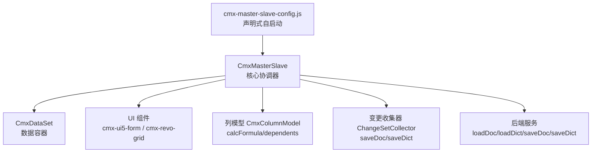
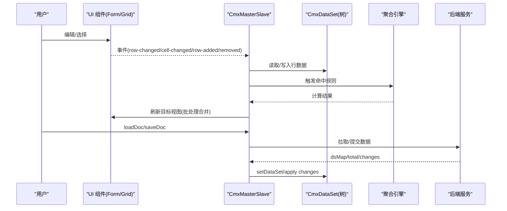
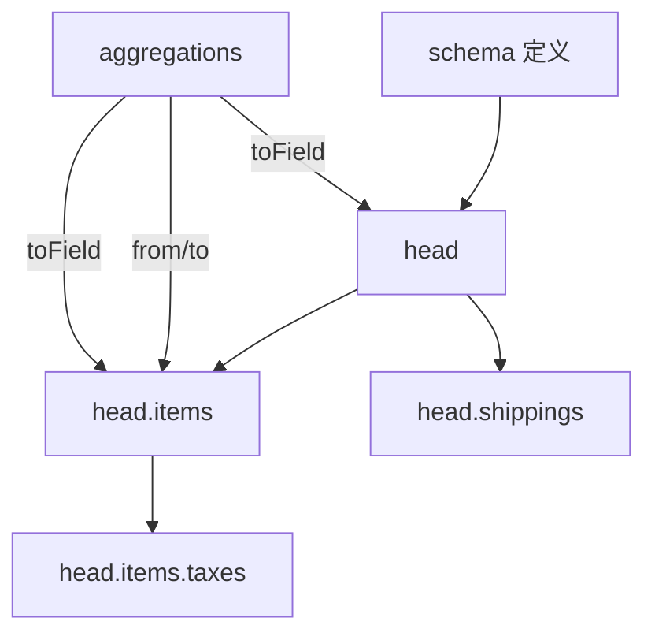
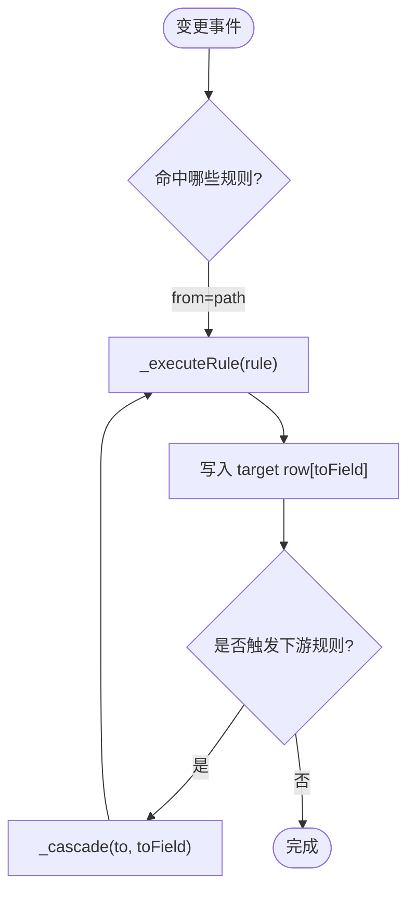
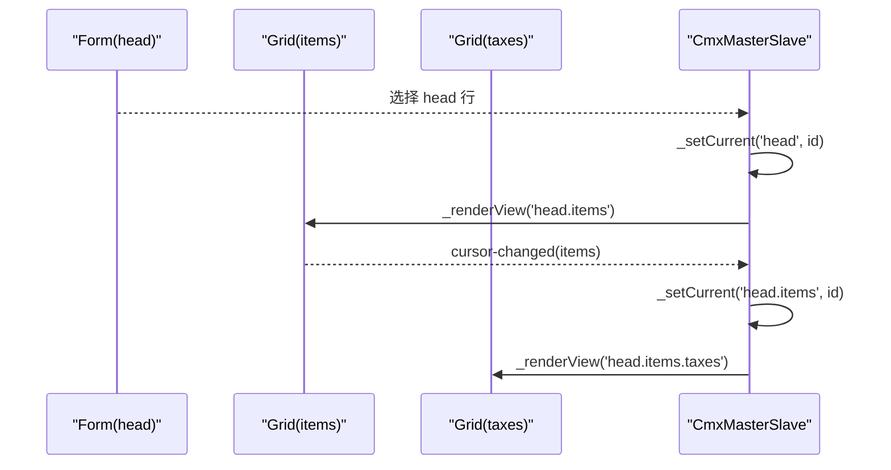
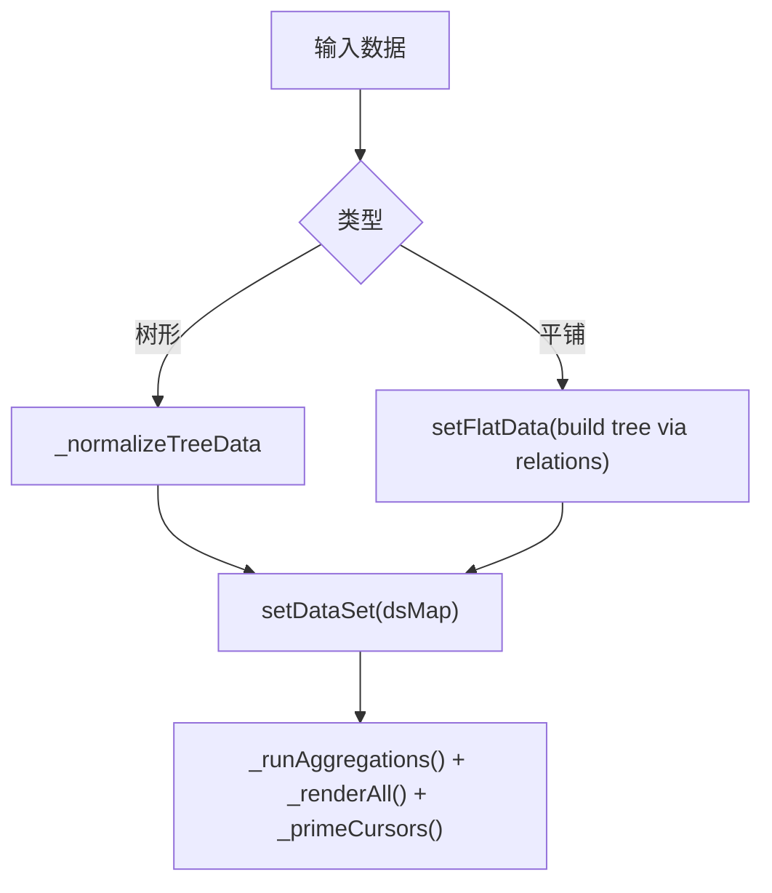
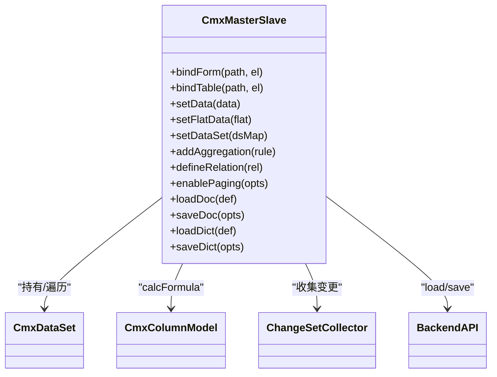

# 主从协调器 (CmxMasterSlave)

<cite>
**本文引用的文件**
- [cmx-master-slave.js](file://packages/cmx-data-comp/src/lib/cmx-master-slave.js)
- [cmx-master-slave-config.js](file://packages/cmx-data-comp/src/components/cmx-master-slave-config.js)
- [09-主从协调器-CmxMasterSlave.md](file://docs/CMXPortalManager+CMXHTMLDesigner-模型体系文档/09-主从协调器-CmxMasterSlave.md)
- [model-master-slave.md](file://.agents/skills/html-page-generator/references/model-master-slave.md)
- [skill-generate-master-slave-page.md](file://packages/cmx-data-comp/docs/skill-generate-master-slave-page.md)
- [build-cmx-page-script-block.js](file://CMXHTMLDesigner/src/utils/build-cmx-page-script-block.js)
</cite>

## 目录
1. [简介](#简介)
2. [项目结构](#项目结构)
3. [核心组件](#核心组件)
4. [架构总览](#架构总览)
5. [详细组件分析](#详细组件分析)
6. [依赖关系分析](#依赖关系分析)
7. [性能考量](#性能考量)
8. [故障排查指南](#故障排查指南)
9. [结论](#结论)
10. [附录](#附录)

## 简介
CmxMasterSlave 是“多表主从协调器”，负责把主表、子表、孙表等递归层级绑定在一起，实现：
- 选主行 → 自动刷新子视图
- 改子字段 → 自动聚合回写主字段
- 支持声明式 schema/aggregations/relations 配置
- 与 Form/Grid 等 UI 组件解耦绑定，业务无感知

它不关心“凭证/订单/BOM”等业务语义，只认 schema 路径、字段名和聚合规则。

**章节来源**
- [09-主从协调器-CmxMasterSlave.md:7-35](file://docs/CMXPortalManager+CMXHTMLDesigner-模型体系文档/09-主从协调器-CmxMasterSlave.md#L7-L35)
- [model-master-slave.md:8-22](file://.agents/skills/html-page-generator/references/model-master-slave.md#L8-L22)

## 项目结构
围绕 CmxMasterSlave 的关键文件与职责：
- packages/cmx-data-comp/src/lib/cmx-master-slave.js：协调器核心实现（schema、绑定、事件、聚合、分页、字典、保存）
- packages/cmx-data-comp/src/components/cmx-master-slave-config.js：声明式自启动元素，解析 JSON 并自动 bindForm/bindTable
- docs/.../09-主从协调器-CmxMasterSlave.md：官方使用文档（schema/aggregations/relations/事件/示例）
- .agents/skills/html-page-generator/references/model-master-slave.md：生成页面时的权威参考（DOM 属性、pageFn、常见坑）
- packages/cmx-data-comp/docs/skill-generate-master-slave-page.md：生成主从页面的规范与最佳实践
- CMXHTMLDesigner/src/utils/build-cmx-page-script-block.js：页面脚本构建工具（含脏标记与事件桥接，配合协调器使用）

**图表来源**
- [cmx-master-slave.js:1-31](file://packages/cmx-data-comp/src/lib/cmx-master-slave.js#L1-L31)
- [cmx-master-slave-config.js:1-24](file://packages/cmx-data-comp/src/components/cmx-master-slave-config.js#L1-L24)

**章节来源**
- [cmx-master-slave.js:1-85](file://packages/cmx-data-comp/src/lib/cmx-master-slave.js#L1-L85)
- [cmx-master-slave-config.js:1-24](file://packages/cmx-data-comp/src/components/cmx-master-slave-config.js#L1-L24)

## 核心组件
- CmxMasterSlave：持有递归主从数据树；按 path 注册视图；维护当前选中行；监听 cell/row 变化并执行聚合；提供 setData/setFlatData/setDataSet；支持分页、字典、保存。
- CmxMasterSlaveConfig：在 HTML 中以自定义元素方式声明 schema/aggregations/relations/dataSources/initialData，插入 DOM 后自动创建协调器并按 selector 绑定表单/表格。
- 配套能力：列模型 calcFormula 联动、ChangeSetCollector 变更集、loadDoc/saveDoc、loadDict/saveDict、enablePaging/gotoPage 等。

**章节来源**
- [cmx-master-slave.js:41-85](file://packages/cmx-data-comp/src/lib/cmx-master-slave.js#L41-L85)
- [cmx-master-slave-config.js:28-96](file://packages/cmx-data-comp/src/components/cmx-master-slave-config.js#L28-L96)

## 架构总览
协调器处于“数据层”与“视图层”之间，屏蔽业务语义，仅通过 schema/path 驱动。

**图表来源**
- [cmx-master-slave.js:357-417](file://packages/cmx-data-comp/src/lib/cmx-master-slave.js#L357-L417)
- [cmx-master-slave.js:755-786](file://packages/cmx-data-comp/src/lib/cmx-master-slave.js#L755-L786)
- [cmx-master-slave.js:1005-1065](file://packages/cmx-data-comp/src/lib/cmx-master-slave.js#L1005-L1065)
- [cmx-master-slave.js:1076-1099](file://packages/cmx-data-comp/src/lib/cmx-master-slave.js#L1076-L1099)

## 详细组件分析

### Schema 配置与 Path 路由机制
- schema 是一棵树，每个节点代表一张表，id 唯一，children 表示父子关系。
- 展开为点分隔完整路径：head、head.items、head.items.taxes、head.shippings 等。
- 所有 path 引用必须使用完整路径（bindTable、aggregations.from/to）。
- 重复 id 会抛 duplicate path；未知 path 会抛 unknown path。

**图表来源**
- [cmx-master-slave.js:89-107](file://packages/cmx-data-comp/src/lib/cmx-master-slave.js#L89-L107)
- [model-master-slave.md:43-83](file://.agents/skills/html-page-generator/references/model-master-slave.md#L43-L83)

**章节来源**
- [cmx-master-slave.js:89-113](file://packages/cmx-data-comp/src/lib/cmx-master-slave.js#L89-L113)
- [model-master-slave.md:43-83](file://.agents/skills/html-page-generator/references/model-master-slave.md#L43-L83)
- [skill-generate-master-slave-page.md:21-45](file://packages/cmx-data-comp/docs/skill-generate-master-slave-page.md#L21-L45)

### Aggregations 聚合规则与触发时机
- 字段：from、agg(sum/avg/min/max/count 或函数)、field、to、toField、scope(siblings/all)。
- 语义：
  - to 是 single：整树收集 from → 写到 to 那一行
  - to 是 list：对 to 列表每一行 t，source 限定在 t 的子树
  - scope=all：忽略上下文，整树聚合
- 触发：
  - setData/setFlatData 后整体预热一次
  - cmx-cell-changed：命中 from 的规则
  - cmx-row-added/removed：命中 from === X 或以 X 为前缀的规则
- 链式聚合：rule.to + toField 可能成为另一条规则的 source，自动级联（深度上限保护）。

**图表来源**
- [cmx-master-slave.js:755-786](file://packages/cmx-data-comp/src/lib/cmx-master-slave.js#L755-L786)
- [cmx-master-slave.js:805-861](file://packages/cmx-data-comp/src/lib/cmx-master-slave.js#L805-L861)

**章节来源**
- [09-主从协调器-CmxMasterSlave.md:87-133](file://docs/CMXPortalManager+CMXHTMLDesigner-模型体系文档/09-主从协调器-CmxMasterSlave.md#L87-L133)
- [model-master-slave.md:86-144](file://.agents/skills/html-page-generator/references/model-master-slave.md#L86-L144)
- [cmx-master-slave.js:805-861](file://packages/cmx-data-comp/src/lib/cmx-master-slave.js#L805-L861)

### 与 Form/Grid 的绑定与父子关系维护
- 绑定方式：
  - 声明式：<cmx-master-slave-config> 内 JSON 中 schema 节点可带 selector，运行时按 selector 查找组件并调用 bindForm/bindTable。
  - 命令式：ms.bindForm('head', formEl)、ms.bindTable('head.items', gridEl)。
- 父子关系维护：
  - 上级 currentId 变化 → _setCurrent → 重置子孙 currentId → moveFirst 子级 → 子级 cursor-changed → 继续向下级联。
  - 视图渲染时根据 _resolveWrap(path) 沿当前选中路径解析到对应 CmxDataSet，再 setDataSet 给 UI。
- 级联删除：
  - 删除父行时，其子数据集会被解绑监听，避免内存泄漏与无效刷新。

**图表来源**
- [cmx-master-slave.js:677-740](file://packages/cmx-data-comp/src/lib/cmx-master-slave.js#L677-L740)
- [cmx-master-slave.js:357-417](file://packages/cmx-data-comp/src/lib/cmx-master-slave.js#L357-L417)

**章节来源**
- [cmx-master-slave-config.js:87-122](file://packages/cmx-data-comp/src/components/cmx-master-slave-config.js#L87-L122)
- [model-master-slave.md:180-228](file://.agents/skills/html-page-generator/references/model-master-slave.md#L180-L228)
- [cmx-master-slave.js:677-740](file://packages/cmx-data-comp/src/lib/cmx-master-slave.js#L677-L740)

### 数据装载：setData vs setFlatData vs setDataSet
- setData：传入嵌套树形数据（tables: { rootId: CmxDataSet }），内部标准化后 setDataSet。
- setFlatData：传入平铺数组 + relations，自动建树挂到父行的 _children，再 setDataSet。
- setDataSet：直接接管已构造好的 CmxDataSet 映射，统一入口，自动注册 row-changed/cursor-changed 监听，预热聚合并级联首行。

**图表来源**
- [cmx-master-slave.js:281-335](file://packages/cmx-data-comp/src/lib/cmx-master-slave.js#L281-L335)
- [cmx-master-slave.js:510-536](file://packages/cmx-data-comp/src/lib/cmx-master-slave.js#L510-L536)
- [cmx-master-slave.js:576-602](file://packages/cmx-data-comp/src/lib/cmx-master-slave.js#L576-L602)

**章节来源**
- [model-master-slave.md:231-268](file://.agents/skills/html-page-generator/references/model-master-slave.md#L231-L268)
- [cmx-master-slave.js:281-335](file://packages/cmx-data-comp/src/lib/cmx-master-slave.js#L281-L335)

### 事件系统与业务集成
- change：某行某字段值变化（path/id/key/value/row）
- select：某行被选中（path/id）
- aggregate：聚合规则触发（rule/value/targetId）
- page-changed：分页信息变化（启用分页时）
- dict-grid-filter-changed：字典网格过滤变化

这些事件供业务侧监听以更新 UI 或执行业务逻辑。

**章节来源**
- [09-主从协调器-CmxMasterSlave.md:168-178](file://docs/CMXPortalManager+CMXHTMLDesigner-模型体系文档/09-主从协调器-CmxMasterSlave.md#L168-L178)
- [model-master-slave.md:270-288](file://.agents/skills/html-page-generator/references/model-master-slave.md#L270-L288)
- [cmx-master-slave.js:198-201](file://packages/cmx-data-comp/src/lib/cmx-master-slave.js#L198-L201)

### 典型业务场景示例
- 凭证录入：头→分录→税行，分录金额变化汇总到头合计，税行税额汇总到分录合计。
- 订单管理：订单主表→明细→物流→发票（多级）。
- BOM 展开：物料主表→子件清单。

以上场景均通过 schema 路径与 aggregations 配置驱动，无需修改协调器代码。

**章节来源**
- [09-主从协调器-CmxMasterSlave.md:17-24](file://docs/CMXPortalManager+CMXHTMLDesigner-模型体系文档/09-主从协调器-CmxMasterSlave.md#L17-L24)
- [model-master-slave.md:292-391](file://.agents/skills/html-page-generator/references/model-master-slave.md#L292-L391)

## 依赖关系分析
- 对外依赖：
  - CmxDataSet：数据容器，提供 rows/_children/cursor-changed/row-changed 等能力。
  - CmxColumnModel：列模型，用于 calcFormula 与 dependents 联动。
  - ChangeSetCollector：变更集收集，用于 saveDoc/saveDict。
  - 后端服务：loadDoc/loadDict/saveDoc/saveDict（通过 host 注入）。
- 内部耦合：
  - 协调器与 UI 组件松耦合：通过 bindForm/bindTable 抽象，仅要求 setDataSet 接口。
  - 聚合引擎与数据树解耦：通过 _collectRows/_descendFromRow 抽象路径遍历。

**图表来源**
- [cmx-master-slave.js:41-85](file://packages/cmx-data-comp/src/lib/cmx-master-slave.js#L41-L85)
- [cmx-master-slave.js:1005-1099](file://packages/cmx-data-comp/src/lib/cmx-master-slave.js#L1005-L1099)
- [cmx-master-slave.js:1277-1349](file://packages/cmx-data-comp/src/lib/cmx-master-slave.js#L1277-L1349)

**章节来源**
- [cmx-master-slave.js:1-85](file://packages/cmx-data-comp/src/lib/cmx-master-slave.js#L1-L85)

## 性能考量
- 微任务批处理：多个聚合规则命中同一目标视图时，写值同步执行，视图刷新合并到下一个微任务，减少重绘。
- 反向索引：按 from-path 索引规则，变更时仅运行命中规则，无关规则跳过。
- 链式聚合保护：深度上限（默认 16）防止循环或过深级联。
- 视图懒绑定：table/form 仅在 ds 引用切换时重新 setDataSet，避免频繁刷新。
- 分页优化：仅在启用分页时合入 countTotal:true，减少不必要 COUNT 查询。
- 建议：
  - 合理拆分 aggregations，避免单条规则扫描过大集合。
  - 复杂计算尽量放在后端或 ColumnModel calcFormula 中。
  - 大数据量优先使用分页与懒加载（loadDictChildren）。

**章节来源**
- [cmx-master-slave.js:772-786](file://packages/cmx-data-comp/src/lib/cmx-master-slave.js#L772-L786)
- [cmx-master-slave.js:835-861](file://packages/cmx-data-comp/src/lib/cmx-master-slave.js#L835-L861)
- [cmx-master-slave.js:1012-1037](file://packages/cmx-data-comp/src/lib/cmx-master-slave.js#L1012-L1037)

## 故障排查指南
常见问题与定位要点：
- 路径错误：aggregations/from/to 未使用完整路径，导致 unknown path。
- 重复 id：schema 中出现同名 id，抛出 duplicate path。
- 未绑视图：调 setCurrentId 但无绑定，视图不会刷新。
- 忘记 destroy：SPA 切换页面未销毁协调器，导致内存泄漏。
- 聚合未生效：检查 from 是否命中变更路径；确认 field 与 agg 配置正确；查看 cascade 深度限制。
- 分页异常：确认 enablePaging 已设置；检查后端返回 total；注意 gotoPage 越界 clamp。

**章节来源**
- [09-主从协调器-CmxMasterSlave.md:294-304](file://docs/CMXPortalManager+CMXHTMLDesigner-模型体系文档/09-主从协调器-CmxMasterSlave.md#L294-L304)
- [model-master-slave.md:395-406](file://.agents/skills/html-page-generator/references/model-master-slave.md#L395-L406)
- [cmx-master-slave.js:145-167](file://packages/cmx-data-comp/src/lib/cmx-master-slave.js#L145-L167)

## 结论
CmxMasterSlave 通过“配置驱动 + 事件驱动”的方式，将主从多表的数据同步、视图联动与聚合计算封装为通用能力。开发者只需关注 schema/aggregations/relations 的配置，即可快速实现订单-明细、凭证-分录等典型主从场景。结合分页、字典、保存与变更集，可满足企业级复杂业务需求。

## 附录
- 声明式自启动：使用 <cmx-master-slave-config> 在 HTML 中声明 schema/aggregations/relations/dataSources/initialData，插入 DOM 后自动初始化并派发 cmx-ms-ready。
- 页面脚本构建：build-cmx-page-script-block.js 提供脏标记与事件桥接，便于与协调器协作。

**章节来源**
- [cmx-master-slave-config.js:1-24](file://packages/cmx-data-comp/src/components/cmx-master-slave-config.js#L1-L24)
- [cmx-master-slave-config.js:50-96](file://packages/cmx-data-comp/src/components/cmx-master-slave-config.js#L50-L96)
- [build-cmx-page-script-block.js:220-244](file://CMXHTMLDesigner/src/utils/build-cmx-page-script-block.js#L220-L244)