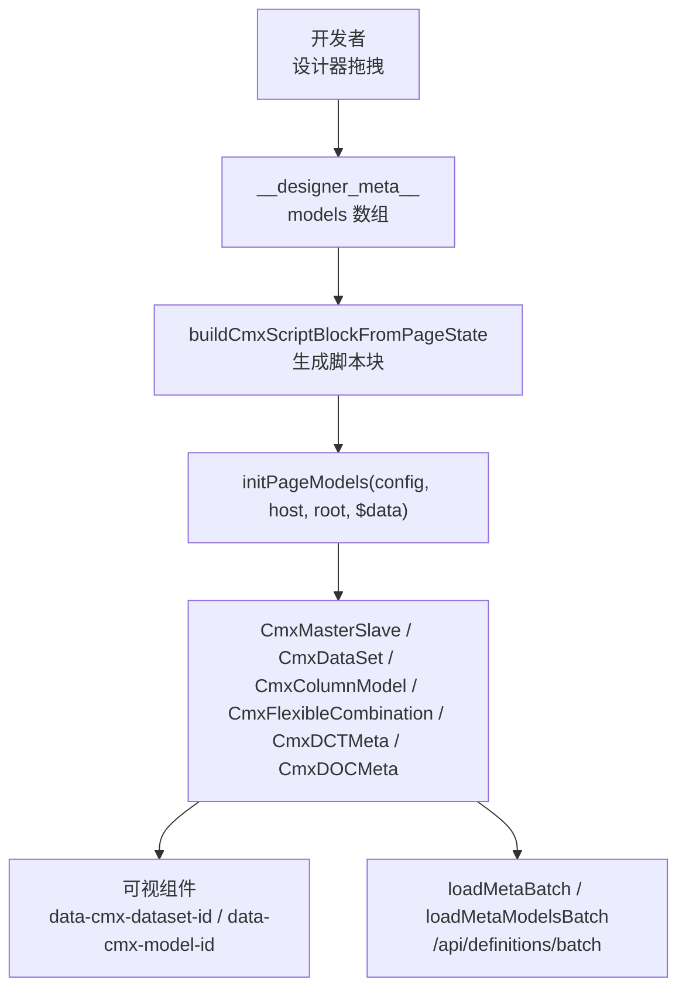
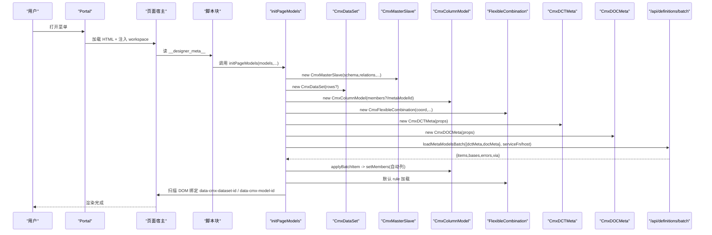
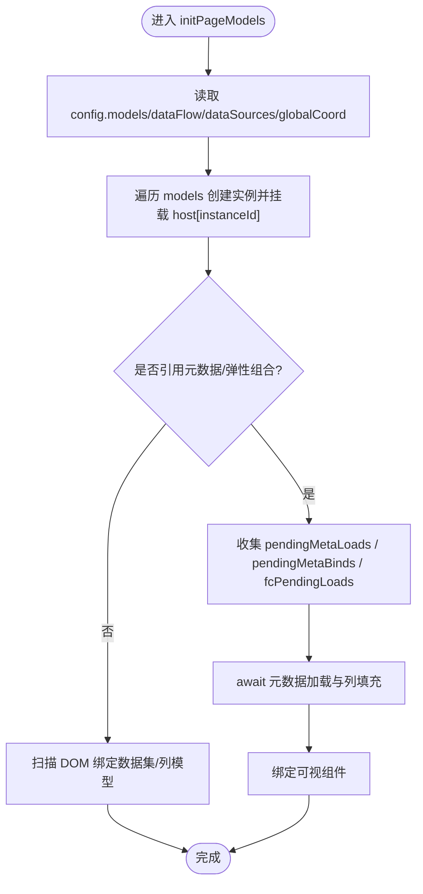
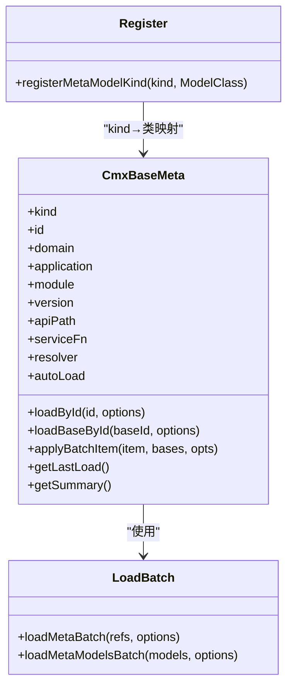
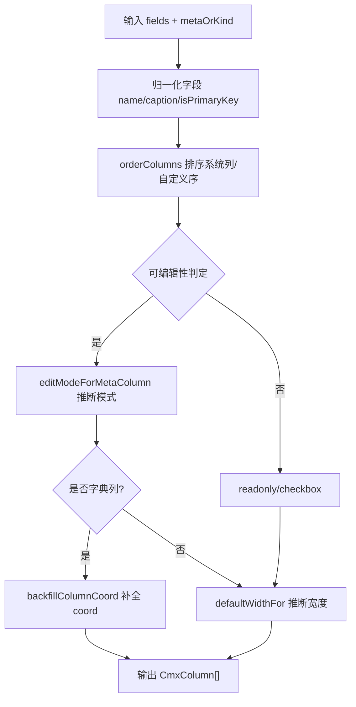
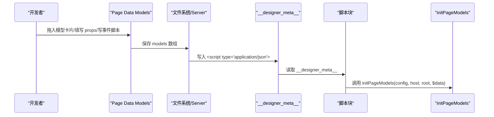
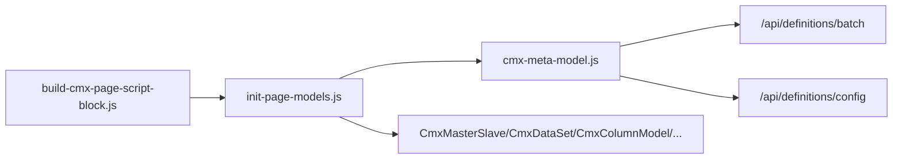

# 元数据生命周期管理

<cite>
**本文引用的文件**
- [init-page-models.js](file://packages/cmx-data-comp/src/lib/init-page-models.js)
- [cmx-meta-model.js](file://packages/cmx-data-comp/src/lib/cmx-meta-model.js)
- [build-cmx-page-script-block.js](file://CMXHTMLDesigner/src/utils/build-cmx-page-script-block.js)
- [12-运行时初始化流程.md](file://docs/CMXPortalManager+CMXHTMLDesigner-模型体系文档/12-运行时初始化流程.md)
- [03-模型面板-在设计器里怎么配.md](file://docs/CMXPortalManager+CMXHTMLDesigner-模型体系文档/03-模型面板-在设计器里怎么配.md)
- [cmx-console.js](file://CMXHTMLDesigner/src/utils/cmx-console.js)
- [cmx-toast.test.js](file://packages/cmx-data-comp/src/lib/__tests__/cmx-toast.test.js)
- [cmx-meta-data-元数据管理重建方案.md](file://docs/cmx-meta-data-元数据管理重建方案.md)
</cite>

## 目录
1. [简介](#简介)
2. [项目结构](#项目结构)
3. [核心组件](#核心组件)
4. [架构总览](#架构总览)
5. [详细组件分析](#详细组件分析)
6. [依赖关系分析](#依赖关系分析)
7. [性能考量](#性能考量)
8. [故障排查指南](#故障排查指南)
9. [结论](#结论)
10. [附录](#附录)

## 简介
本文件系统性阐述 CMX 平台中“元数据生命周期管理”的完整链路：从设计器保存页面模型，到 Portal 运行时加载、实例化与绑定；重点解析 initPageModels 的执行过程、模型注册机制、依赖解析算法；并覆盖版本控制、热更新、回滚策略、错误处理、调试工具与性能监控。文末提供元数据文件结构规范、序列化格式与迁移策略建议。

## 项目结构
围绕元数据生命周期，关键代码分布在以下位置：
- 设计器侧：将 models 数组序列化进 HTML 的 __designer_meta__，并在运行时注入脚本块调用 initPageModels。
- 运行时库：init-page-models.js 负责按 modelType 创建模型实例、挂到 host、扫描 DOM 绑定可视组件、触发 autoLoad 与列填充。
- 元数据模型：cmx-meta-model.js 提供 CmxBaseMeta 及批量加载 loadMetaBatch/loadMetaModelsBatch，支持 kind 注册表与 base 字段集合并。
- 文档与测试：运行时流程图、模型面板说明、控制台桥接与 toast 行为测试。

图表来源
- [build-cmx-page-script-block.js:286-304](file://CMXHTMLDesigner/src/utils/build-cmx-page-script-block.js#L286-L304)
- [init-page-models.js:717-800](file://packages/cmx-data-comp/src/lib/init-page-models.js#L717-L800)
- [cmx-meta-model.js:669-733](file://packages/cmx-data-comp/src/lib/cmx-meta-model.js#L669-L733)

章节来源
- [12-运行时初始化流程.md:7-133](file://docs/CMXPortalManager+CMXHTMLDesigner-模型体系文档/12-运行时初始化流程.md#L7-L133)
- [03-模型面板-在设计器里怎么配.md:162-176](file://docs/CMXPortalManager+CMXHTMLDesigner-模型体系文档/03-模型面板-在设计器里怎么配.md#L162-L176)

## 核心组件
- 设计器序列化与脚本注入：将 models 数组写入 __designer_meta__，运行时通过动态 import 或全局 __cmxInitPageModels 调用 initPageModels。
- 运行时初始化入口 initPageModels：
  - 读取 config.models/dataFlow/dataSources/globalCoord。
  - 顺序创建模型实例并挂载到 host[instanceId]。
  - 收集 pendingMetaLoads/pendingMetaBinds/fcPendingLoads，阶段1.5 统一 await 后回填列与默认规则。
  - 扫描 Shadow DOM，依据 data-cmx-dataset-id / data-cmx-model-id 自动绑定可视组件。
  - 为模型事件 def.events 编译并绑定执行上下文（with(host)）。
- 元数据模型与批量加载：
  - CmxBaseMeta：封装 kind/domain/module/id/version/apiPath/serviceFn/resolver/autoLoad 等属性，支持 loadById/loadBaseById/applyBatchItem。
  - loadMetaBatch/loadMetaModelsBatch：一次性批量请求后端 /api/definitions/batch，按 kind 注册表实例化模型，就地 applyBatchItem 合并 base 字段集，返回 byId/byKind/dct/doc/errors/via。
- 列模型增强：
  - metaTableFieldsToColumns：将元数据字段转为 CmxColumn[]，内置主键/业务键/必填判定、edit 模式推断、字典选择配置、坐标补全 backfillColumnCoord。
  - 支持分组列、聚合属性透传、display/edit 白名单过滤。

章节来源
- [init-page-models.js:1-17](file://packages/cmx-data-comp/src/lib/init-page-models.js#L1-L17)
- [init-page-models.js:717-800](file://packages/cmx-data-comp/src/lib/init-page-models.js#L717-L800)
- [init-page-models.js:392-566](file://packages/cmx-data-comp/src/lib/init-page-models.js#L392-L566)
- [cmx-meta-model.js:347-609](file://packages/cmx-data-comp/src/lib/cmx-meta-model.js#L347-L609)
- [cmx-meta-model.js:669-733](file://packages/cmx-data-comp/src/lib/cmx-meta-model.js#L669-L733)

## 架构总览
下图展示从设计器保存到运行时的端到端流程，包括模型实例化、元数据批量加载、列模型构建与视图绑定。

图表来源
- [build-cmx-page-script-block.js:286-304](file://CMXHTMLDesigner/src/utils/build-cmx-page-script-block.js#L286-L304)
- [init-page-models.js:717-800](file://packages/cmx-data-comp/src/lib/init-page-models.js#L717-L800)
- [cmx-meta-model.js:669-733](file://packages/cmx-data-comp/src/lib/cmx-meta-model.js#L669-L733)

## 详细组件分析

### 组件A：initPageModels 执行过程
- 输入：config（含 models/dataFlow/dataSources）、host（需有 $coord）、root（ShadowRoot/Element）、$data。
- 阶段1：遍历 models，按 modelType 创建实例并挂载到 host[instanceId]；对 CmxColumnModel 引用元数据场景暂存 pendingMetaBinds；对 FlexibleCombination 无 inlineData 但配置了 scenario 坐标的场景暂存 fcPendingLoads。
- 阶段1.5：await 所有 pendingMetaLoads（autoLoad）与 pendingMetaBinds（从已声明的 dctMeta/docMeta 取字段填充列），再处理 fcPendingLoads。
- 阶段2：扫描 root 下可视组件，若存在 data-cmx-dataset-id 则 setDataSet，若存在 data-cmx-model-id 则 setColumnModel；同时为 CmxColumnModel 中 refDict 列补全 editSettings.coord（backfillColumnCoord）。
- 事件绑定：wireModelEvents 将 def.events 编译为 Function(event, host)，以 with(host) 作用域执行，异常时记录错误并 toast 提示。

图表来源
- [init-page-models.js:717-800](file://packages/cmx-data-comp/src/lib/init-page-models.js#L717-L800)
- [init-page-models.js:678-703](file://packages/cmx-data-comp/src/lib/init-page-models.js#L678-L703)
- [init-page-models.js:581-611](file://packages/cmx-data-comp/src/lib/init-page-models.js#L581-L611)

章节来源
- [init-page-models.js:717-800](file://packages/cmx-data-comp/src/lib/init-page-models.js#L717-L800)
- [init-page-models.js:678-703](file://packages/cmx-data-comp/src/lib/init-page-models.js#L678-L703)

### 组件B：模型注册机制与依赖解析
- 元数据模型注册：META_MODEL_KINDS Map 维护 kind → ModelClass 映射；CmxDCTMeta/CmxDOCMeta 在导入时自注册，使 loadMetaBatch 能按 kind 实例化对应模型。
- 依赖解析算法：
  - 单条加载：CmxBaseMeta.loadById/_resolveMeta 优先走 resolver > host.serviceFn > fetchDefinitionConfig。
  - 批量加载：loadMetaBatch 构造 refs 列表，按优先级 resolver > serviceFn > fetch 调用 /api/definitions/batch；返回 items/bases/basePaths/errors/via。
  - 就地装载：applyBatchItem 将批量响应中的 doc 载入模型，并按 baseFile 合并 bases 中的 fieldSets；记录 _lastLoad.via 便于追踪来源。
  - 模型面板批量：loadMetaModelsBatch 从已声明的 dctMeta/docMeta 推断 refs，复用 targets 命中既有实例，避免重复创建。

图表来源
- [cmx-meta-model.js:347-609](file://packages/cmx-data-comp/src/lib/cmx-meta-model.js#L347-L609)
- [cmx-meta-model.js:633-638](file://packages/cmx-data-comp/src/lib/cmx-meta-model.js#L633-L638)
- [cmx-meta-model.js:669-733](file://packages/cmx-data-comp/src/lib/cmx-meta-model.js#L669-L733)

章节来源
- [cmx-meta-model.js:633-638](file://packages/cmx-data-comp/src/lib/cmx-meta-model.js#L633-L638)
- [cmx-meta-model.js:669-733](file://packages/cmx-data-comp/src/lib/cmx-meta-model.js#L669-L733)

### 组件C：列模型构建与增强
- metaTableFieldsToColumns：将元数据字段转换为 CmxColumn[]，包含：
  - 主键/业务键识别：isPrimaryKeyField/isBusinessKey。
  - 必填判定：isRequiredCol（业务键强制必填、元数据 required、nullable=false 推断）。
  - 编辑模式推断：editModeForMetaColumn（ref/dict-select/checkbox/select/input/date/datetime/number/readonly 等）。
  - 字典选择配置：dictCode/idCol/labelCol/hierarchical/parentField/coord。
  - 坐标补全：backfillColumnCoord 用 host.$coord 合并局部 coord，确保字典请求不缺失 domain/app/module。
- 分组列与聚合：buildMember/buildMembersFromColumnsAndGroups 支持 CmxColumnGroup 嵌套与 aggregate/aggregatePosition 透传。

图表来源
- [init-page-models.js:392-566](file://packages/cmx-data-comp/src/lib/init-page-models.js#L392-L566)
- [init-page-models.js:581-611](file://packages/cmx-data-comp/src/lib/init-page-models.js#L581-L611)

章节来源
- [init-page-models.js:392-566](file://packages/cmx-data-comp/src/lib/init-page-models.js#L392-L566)
- [init-page-models.js:581-611](file://packages/cmx-data-comp/src/lib/init-page-models.js#L581-L611)

### 组件D：设计器保存与运行时脚本注入
- 设计器：在 Page Data → Models 标签中配置的 models 数组最终序列化进 __designer_meta__。
- 运行时：buildCmxScriptBlockFromPageState 将 models/dataFlow/dataSources 序列化为 JSON 字符串，动态 import cmx-data-comp/lib/init-page-models.js 并调用 initPageModels；失败时降级调用 host.initPage。

图表来源
- [03-模型面板-在设计器里怎么配.md:162-176](file://docs/CMXPortalManager+CMXHTMLDesigner-模型体系文档/03-模型面板-在设计器里怎么配.md#L162-L176)
- [build-cmx-page-script-block.js:286-304](file://CMXHTMLDesigner/src/utils/build-cmx-page-script-block.js#L286-L304)

章节来源
- [03-模型面板-在设计器里怎么配.md:162-176](file://docs/CMXPortalManager+CMXHTMLDesigner-模型体系文档/03-模型面板-在设计器里怎么配.md#L162-L176)
- [build-cmx-page-script-block.js:286-304](file://CMXHTMLDesigner/src/utils/build-cmx-page-script-block.js#L286-L304)

## 依赖关系分析
- 模块耦合：
  - init-page-models.js 依赖多种模型类（CmxMasterSlave/CmxDataSet/CmxColumnModel/CmxFlexibleCombination/CmxDCTMeta/CmxDOCMeta）与工具函数（fieldCaption/orderColumns/resolveCoord/showCmxToast）。
  - cmx-meta-model.js 提供 CmxBaseMeta 与批量加载能力，被 init-page-models.js 通过 loadMetaModelsBatch 调用。
  - 设计器 build-cmx-page-script-block.js 仅负责脚本注入，不感知具体模型类，降低耦合。
- 外部依赖：
  - 后端接口：/api/definitions/batch（批量加载）、/api/definitions/config（单条加载）。
  - 浏览器环境：fetch、Shadow DOM、EventTarget。
- 循环依赖规避：
  - META_MODEL_KINDS 注册表解耦 kind 与 ModelClass，避免直接 import 循环。

图表来源
- [init-page-models.js:19-31](file://packages/cmx-data-comp/src/lib/init-page-models.js#L19-L31)
- [cmx-meta-model.js:611-651](file://packages/cmx-data-comp/src/lib/cmx-meta-model.js#L611-L651)
- [build-cmx-page-script-block.js:286-304](file://CMXHTMLDesigner/src/utils/build-cmx-page-script-block.js#L286-L304)

章节来源
- [init-page-models.js:19-31](file://packages/cmx-data-comp/src/lib/init-page-models.js#L19-L31)
- [cmx-meta-model.js:611-651](file://packages/cmx-data-comp/src/lib/cmx-meta-model.js#L611-L651)

## 性能考量
- 批量加载：loadMetaBatch 单次请求获取多个元数据及其 base 字段集，减少网络往返；via 字段记录实际加载路径（resolver/service/fetch），便于观测。
- 就地装载：applyBatchItem 将批量结果直接灌入已有实例，避免重复创建对象；_lastLoad.at 记录时间戳用于诊断。
- 列模型构建：metaTableFieldsToColumns 使用 Map/Set 去重与快速查找；白名单过滤 display/edit 属性，减少无效属性传播。
- 坐标合并：backfillColumnCoord 仅在必要时替换对象，避免无谓内存分配。
- 事件编译：wireModelEvents 预编译 Function，运行时仅调用；异常捕获避免阻塞后续初始化。

[本节为通用性能讨论，无需特定文件分析]

## 故障排查指南
- 常见错误与定位：
  - host.<instanceId> 为 undefined：检查 models 数组中 modelType/instanceId 是否正确。
  - 表格无数据：确认 dataSource 配置、dataSourceEvent 是否为 onInit、pageService 是否可用。
  - 列未出现：检查 columnModelId 拼写、列模型 columns 是否为空且未被 FC 触发。
  - 聚合不工作：核对 aggregations 的 from/to/toField 路径。
  - 事件未触发：事件名大小写敏感、脚本语法错误。
  - FC 静默失败：目标 columnModelId 不存在、inlineData 解析失败（控制台 warn）。
- 调试工具：
  - 控制台桥接：installCmxConsoleTap 劫持 console.log/warn/error，双写到 DevTools 与自定义 sink，便于在 inspector 中观察。
  - Toast 提示：showCmxToast 用于非模态轻提示，error 级带 title/msg，支持 Error 对象自动取 message。
  - 模型事件调试：wireModelEvents 在开发环境下插入 debugger；sourceURL 指向 cmx://model-event/{instanceId}/{evtName}。
- 测试用例参考：
  - cmx-toast.test.js 验证 error 级 role=alert、title 渲染、Error 对象处理、showCmxError 行为。

章节来源
- [cmx-console.js:1-84](file://CMXHTMLDesigner/src/utils/cmx-console.js#L1-L84)
- [cmx-toast.test.js:34-60](file://packages/cmx-data-comp/src/lib/__tests__/cmx-toast.test.js#L34-L60)
- [init-page-models.js:678-703](file://packages/cmx-data-comp/src/lib/init-page-models.js#L678-L703)

## 结论
CMX 平台的元数据生命周期管理通过“设计器序列化 → 运行时脚本注入 → initPageModels 实例化 → 批量元数据加载 → 列模型增强 → 视图绑定”形成闭环。其核心优势在于：
- 解耦：设计器与运行时通过 __designer_meta__ 契约交互，initPageModels 不感知具体模型类实现细节。
- 高效：批量加载与就地装载减少网络与内存开销；列模型构建使用高效数据结构。
- 可观测：via 字段、_lastLoad、console 桥接、toast 提示、sourceURL 调试点提升排障效率。
- 可扩展：kind 注册表与 serviceFn/resolver 机制支持自定义加载逻辑与测试替换。

[本节为总结性内容，无需特定文件分析]

## 附录

### 元数据文件结构规范
- __designer_meta__ 结构：
  - pageData/pageFns/pageServices/pageDeps/pageInterfaces：页面级数据、函数、服务、依赖、接口。
  - dataFlow：兼容老配置（schema/aggregations/relations）。
  - models：数组，每项包含 modelType/instanceId/props/events。
- 元数据模型结构（CmxBaseMeta）：
  - kind/domain/module/id/version/apiPath/serviceFn/resolver/autoLoad。
  - 字段集 fieldSets、表 tables、汇总 summaries。
  - 批量响应 items/bases/basePaths/errors/via。

章节来源
- [12-运行时初始化流程.md:51-68](file://docs/CMXPortalManager+CMXHTMLDesigner-模型体系文档/12-运行时初始化流程.md#L51-L68)
- [cmx-meta-model.js:347-609](file://packages/cmx-data-comp/src/lib/cmx-meta-model.js#L347-L609)

### 序列化格式
- 设计器保存：models 数组 JSON 序列化进 __designer_meta__。
- 批量加载：POST /api/definitions/batch，body 为 {refs, includeBase}，返回 {items,bases,basePaths,errors,via}。
- 单条加载：GET /api/definitions/config，参数 kind/id/domain/application/module。

章节来源
- [build-cmx-page-script-block.js:286-304](file://CMXHTMLDesigner/src/utils/build-cmx-page-script-block.js#L286-L304)
- [cmx-meta-model.js:611-651](file://packages/cmx-data-comp/src/lib/cmx-meta-model.js#L611-L651)

### 迁移策略
- 新范式元数据管理（cmx-meta-data）：
  - 统一 EntityType 元模型，三种 profile（reference/transaction/composition）。
  - 字段三层解耦（structure/semantic/display），国际化优先（i18n-first）。
  - 种子装载与翻译包非破坏合并，幂等部署。
- 历史兼容：
  - 现有 cmx-model 结构通过 loadMetaBatch 的 via 字段与 _lastLoad 记录可追溯来源。
  - 逐步迁移至新范式，保留旧路径作为兼容层，直至完全切换。

章节来源
- [cmx-meta-data-元数据管理重建方案.md:18-28](file://docs/cmx-meta-data-元数据管理重建方案.md#L18-L28)
- [cmx-meta-data-元数据管理重建方案.md:251-252](file://docs/cmx-meta-data-元数据管理重建方案.md#L251-L252)