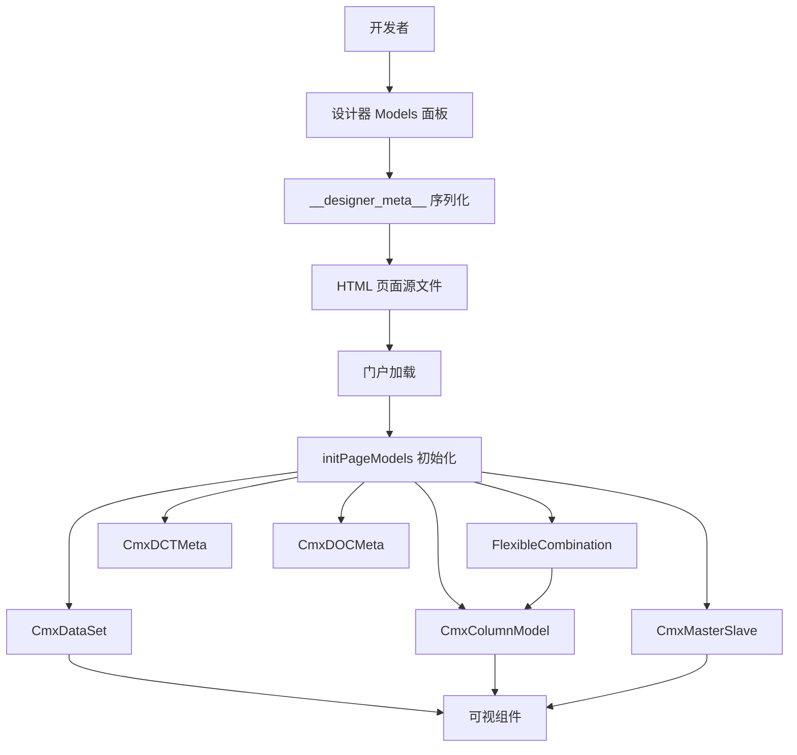
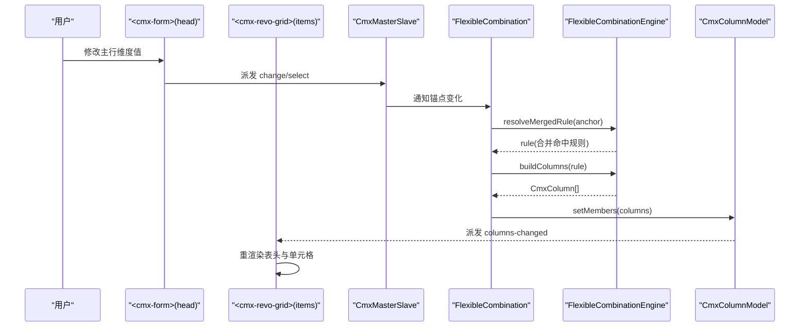
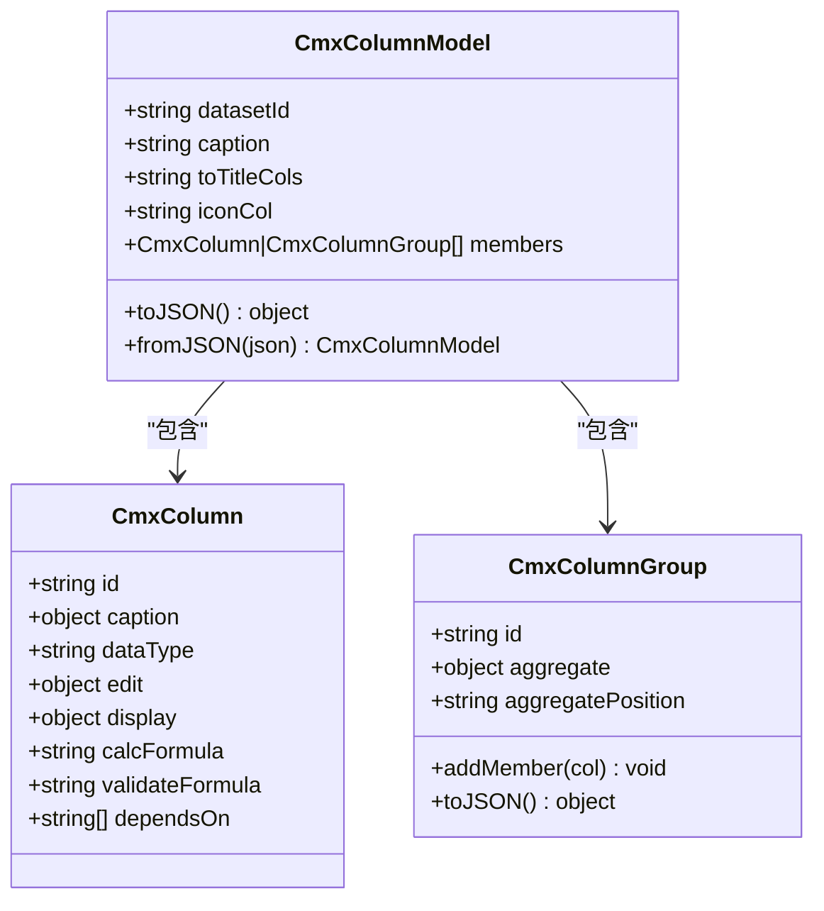
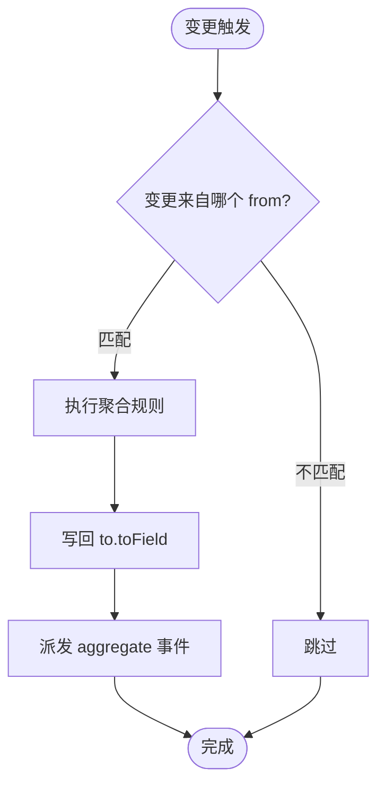
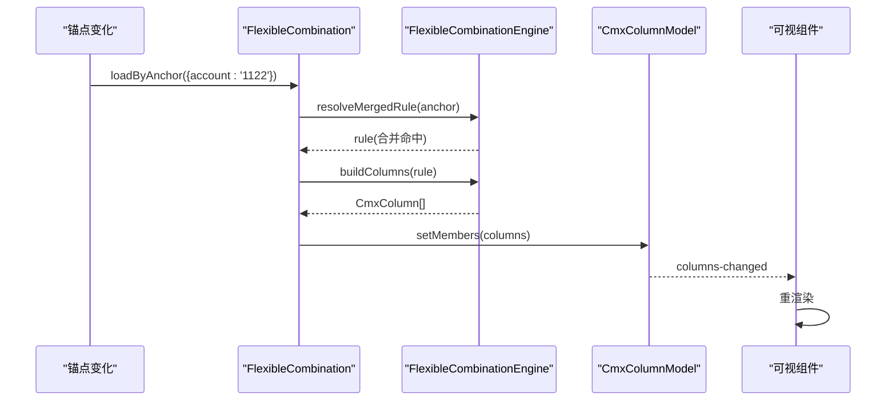
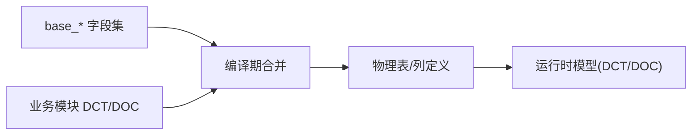
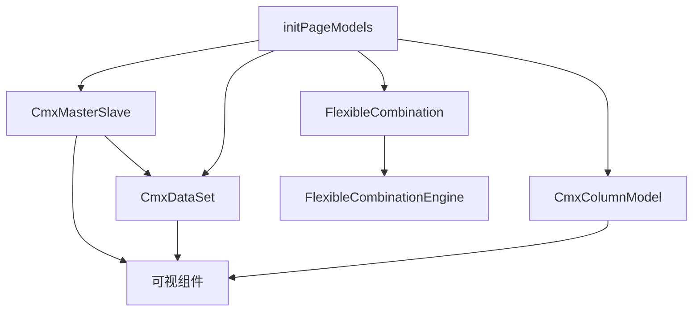

# 元数据驱动架构

<cite>
**本文引用的文件**
- [02-模型体系全景图.md](file://docs/CMXPortalManager+CMXHTMLDesigner-模型体系文档/02-模型体系全景图.md)
- [08-列模型-CmxColumnModel.md](file://docs/CMXPortalManager+CMXHTMLDesigner-模型体系文档/08-列模型-CmxColumnModel.md)
- [09-主从协调器-CmxMasterSlave.md](file://docs/CMXPortalManager+CMXHTMLDesigner-模型体系文档/09-主从协调器-CmxMasterSlave.md)
- [10-弹性组合-FlexibleCombination.md](file://docs/CMXPortalManager+CMXHTMLDesigner-模型体系文档/10-弹性组合-FlexibleCombination.md)
- [11-模型事件与脚本.md](file://docs/CMXPortalManager+CMXHTMLDesigner-模型体系文档/11-模型事件与脚本.md)
- [12-运行时初始化流程.md](file://docs/CMXPortalManager+CMXHTMLDesigner-模型体系文档/12-运行时初始化流程.md)
- [17-元数据JSON文件字段详解.md](file://docs/CMXPortalManager+CMXHTMLDesigner-模型体系文档/17-元数据JSON文件字段详解.md)
- [cmx-column-model.js](file://packages/cmx-data-comp/src/lib/cmx-column-model.js)
- [flexible-combination-engine.js](file://packages/cmx-data-comp/src/lib/flexible-combination-engine.js)
- [init-page-models.js](file://packages/cmx-data-comp/src/lib/init-page-models.js)
- [cmx-master-slave-config.js](file://packages/cmx-data-comp/src/components/cmx-master-slave-config.js)
- [models-panel-spec.md](file://CMXHTMLDesigner/docs/models-panel-spec.md)
</cite>

## 目录
1. [简介](#简介)
2. [项目结构](#项目结构)
3. [核心组件](#核心组件)
4. [架构总览](#架构总览)
5. [详细组件分析](#详细组件分析)
6. [依赖关系分析](#依赖关系分析)
7. [性能考量](#性能考量)
8. [故障排查指南](#故障排查指南)
9. [结论](#结论)
10. [附录](#附录)

## 简介
本文件系统性阐述 CMX 平台的“元数据驱动”架构：以页面元数据为核心，通过 CmxColumnModel（列模型）、CmxMasterSlave（主从协调器）、FlexibleCombination（弹性组合）三大核心数据模型，配合 CmxDCTMeta/CmxDOCMeta（字典/单据元数据），实现“配置即逻辑”的页面装配、数据绑定与动态渲染。文档覆盖：
- 页面元数据、组件模型、数据绑定的实现原理
- 核心数据模型的设计思想与使用方式
- 元数据的生命周期管理、版本控制与热更新机制
- 元数据 schema 定义、验证规则与转换逻辑
- 具体配置示例与最佳实践

## 项目结构
- 设计期（CMXHTMLDesigner）：在 Models 面板中编辑 6 大模型，序列化进 __designer_meta__，最终保存为 HTML 页面源文件。
- 运行期（CMXPortalManager + cmx-data-comp）：加载 HTML 后执行 initPageModels，按 modelType 实例化模型并挂到 host；可视组件通过 data-cmx-dataset-id / data-cmx-model-id 自动绑定模型。
- 后端（cmx-container/Rust）：提供 DCT/DOC/FLC 等元数据服务，支持 DAM 三段定位与 scenario 路由。

图表来源
- [02-模型体系全景图.md:8-70](file://docs/CMXPortalManager+CMXHTMLDesigner-模型体系文档/02-模型体系全景图.md#L8-L70)
- [12-运行时初始化流程.md:72-116](file://docs/CMXPortalManager+CMXHTMLDesigner-模型体系文档/12-运行时初始化流程.md#L72-L116)

章节来源
- [02-模型体系全景图.md:8-70](file://docs/CMXPortalManager+CMXHTMLDesigner-模型体系文档/02-模型体系全景图.md#L8-L70)
- [12-运行时初始化流程.md:72-116](file://docs/CMXPortalManager+CMXHTMLDesigner-模型体系文档/12-运行时初始化流程.md#L72-L116)

## 核心组件
- CmxColumnModel：表格列模板，组织 columns/columnGroups，输出 toDescriptors 供适配器渲染。
- CmxMasterSlave：多表协调器，维护递归主从树、视图绑定、选中联动与聚合回写。
- FlexibleCombination：上下文驱动的动态列引擎，按锚点维度选择规则，生成 CmxColumn[] 并写入目标 ColumnModel。
- CmxDCTMeta / CmxDOCMeta：字典/单据元数据，提供字段定义、物理表结构与校验规则。

章节来源
- [cmx-column-model.js:1-240](file://packages/cmx-data-comp/src/lib/cmx-column-model.js#L1-L240)
- [09-主从协调器-CmxMasterSlave.md:1-54](file://docs/CMXPortalManager+CMXHTMLDesigner-模型体系文档/09-主从协调器-CmxMasterSlave.md#L1-L54)
- [10-弹性组合-FlexibleCombination.md:1-75](file://docs/CMXPortalManager+CMXHTMLDesigner-模型体系文档/10-弹性组合-FlexibleCombination.md#L1-L75)
- [17-元数据JSON文件字段详解.md:97-180](file://docs/CMXPortalManager+CMXHTMLDesigner-模型体系文档/17-元数据JSON文件字段详解.md#L97-L180)

## 架构总览
下图展示从“用户操作”到“界面刷新”的完整链路：主从协调器负责选中和聚合，弹性组合根据锚点变化重写列模型，可视组件响应列变更重新渲染。

图表来源
- [10-弹性组合-FlexibleCombination.md:29-55](file://docs/CMXPortalManager+CMXHTMLDesigner-模型体系文档/10-弹性组合-FlexibleCombination.md#L29-L55)
- [flexible-combination-engine.js:126-168](file://packages/cmx-data-comp/src/lib/flexible-combination-engine.js#L126-L168)
- [09-主从协调器-CmxMasterSlave.md:182-204](file://docs/CMXPortalManager+CMXHTMLDesigner-模型体系文档/09-主从协调器-CmxMasterSlave.md#L182-L204)

## 详细组件分析

### CmxColumnModel（列模型）
- 职责：将 CmxColumn 与 CmxColumnGroup 组织为完整的列配置方案，导出 toDescriptors 给适配器渲染。
- 关键能力：
  - members 数组承载列与分组，支持嵌套分组与聚合属性透传。
  - toJSON/fromJSON 序列化/反序列化，便于设计器与运行时互通。
  - 与数据集 datasetId 关联，供可视组件绑定。
- 设计要点：
  - 纯元数据对象，不直接参与渲染，解耦 UI 框架差异。
  - 支持计算列、校验公式、显示格式化等丰富列行为。

图表来源
- [cmx-column-model.js:1-240](file://packages/cmx-data-comp/src/lib/cmx-column-model.js#L1-L240)

章节来源
- [cmx-column-model.js:1-240](file://packages/cmx-data-comp/src/lib/cmx-column-model.js#L1-L240)
- [08-列模型-CmxColumnModel.md:25-68](file://docs/CMXPortalManager+CMXHTMLDesigner-模型体系文档/08-列模型-CmxColumnModel.md#L25-L68)
- [models-panel-spec.md:78-97](file://CMXHTMLDesigner/docs/models-panel-spec.md#L78-L97)

### CmxMasterSlave（主从协调器）
- 职责：持有递归主从数据树；按 path 注册视图；维护当前选中行；监听 cell/row 变更并跑聚合规则回写。
- 关键配置：
  - schema：路径树，定义表层级与父子关系。
  - aggregations：聚合规则，指定 from/to/agg/field/toField/scope。
  - relations：平铺数据时的主外键关系。
- 运行时 API：bindForm/bindTable、setData/setFlatData、setCurrentId、getRow 等。
- 事件：change/select/aggregate，event.detail 携带路径、字段、值与目标行信息。

图表来源
- [09-主从协调器-CmxMasterSlave.md:87-131](file://docs/CMXPortalManager+CMXHTMLDesigner-模型体系文档/09-主从协调器-CmxMasterSlave.md#L87-L131)

章节来源
- [09-主从协调器-CmxMasterSlave.md:27-54](file://docs/CMXPortalManager+CMXHTMLDesigner-模型体系文档/09-主从协调器-CmxMasterSlave.md#L27-L54)
- [09-主从协调器-CmxMasterSlave.md:152-179](file://docs/CMXPortalManager+CMXHTMLDesigner-模型体系文档/09-主从协调器-CmxMasterSlave.md#L152-L179)
- [cmx-master-slave-config.js:1-65](file://packages/cmx-data-comp/src/components/cmx-master-slave-config.js#L1-L65)

### FlexibleCombination（弹性组合）
- 职责：根据锚点维度值（如 account=1122）选择规则，生成 CmxColumn[] 并写入目标 CmxColumnModel，实现“上下文决定列”。
- 数据来源优先级：inlineData > 缓存命中 > serviceFn > apiPath。
- 匹配评分：精确值 > 维度属性匹配 > 兜底规则；specificity = score*100 + 锚点维度数。
- 引擎 API：resolveRule/resolveMergedRule/buildColumns/onPickDimension/recompute/validate。
- 与 ColumnModel 的关系：setMembers → 派发 columns-changed → 可视组件重渲染。

图表来源
- [10-弹性组合-FlexibleCombination.md:29-55](file://docs/CMXPortalManager+CMXHTMLDesigner-模型体系文档/10-弹性组合-FlexibleCombination.md#L29-L55)
- [flexible-combination-engine.js:126-168](file://packages/cmx-data-comp/src/lib/flexible-combination-engine.js#L126-L168)

章节来源
- [10-弹性组合-FlexibleCombination.md:58-75](file://docs/CMXPortalManager+CMXHTMLDesigner-模型体系文档/10-弹性组合-FlexibleCombination.md#L58-L75)
- [10-弹性组合-FlexibleCombination.md:223-281](file://docs/CMXPortalManager+CMXHTMLDesigner-模型体系文档/10-弹性组合-FlexibleCombination.md#L223-L281)
- [flexible-combination-engine.js:1-68](file://packages/cmx-data-comp/src/lib/flexible-combination-engine.js#L1-L68)

### 元数据 JSON 与 Schema（DCT/DOC）
- 四文件体系：base_dct_meta_v1.json、cmxfico_dct_meta_v3.json、base_doc_meta_v1.json、cmxfico_doc_meta_v2.json。
- 字段三态：dimension（维度）、attribute（属性）、measure（度量）。
- 字段集复用：业务模块通过 baseDctMetaRef/baseDocMetaRef 引用基础字段集，避免重复维护。
- 单据结构：voucherSchema 定义 schema（二维层级）、relations（主外键）、aggregations（聚合规则）。
- 校验规则：validationRules 跨表校验，expr 表达式在保存期与提交期执行。

图表来源
- [17-元数据JSON文件字段详解.md:537-560](file://docs/CMXPortalManager+CMXHTMLDesigner-模型体系文档/17-元数据JSON文件字段详解.md#L537-L560)

章节来源
- [17-元数据JSON文件字段详解.md:34-95](file://docs/CMXPortalManager+CMXHTMLDesigner-模型体系文档/17-元数据JSON文件字段详解.md#L34-L95)
- [17-元数据JSON文件字段详解.md:341-450](file://docs/CMXPortalManager+CMXHTMLDesigner-模型体系文档/17-元数据JSON文件字段详解.md#L341-L450)

## 依赖关系分析
- initPageModels 是运行时入口，按 modelType 创建实例并挂载到 host。
- 可视组件通过 DOM 属性 data-cmx-dataset-id / data-cmx-model-id 自动绑定 DataSet 与 ColumnModel。
- FlexibleCombination 依赖 FlexibleCombinationEngine 进行规则解析与列构建。
- CmxMasterSlave 依赖 CmxDataSet 与可视组件的事件流，驱动聚合与联动。

图表来源
- [12-运行时初始化流程.md:72-116](file://docs/CMXPortalManager+CMXHTMLDesigner-模型体系文档/12-运行时初始化流程.md#L72-L116)
- [init-page-models.js:1-31](file://packages/cmx-data-comp/src/lib/init-page-models.js#L1-L31)

章节来源
- [12-运行时初始化流程.md:122-133](file://docs/CMXPortalManager+CMXHTMLDesigner-模型体系文档/12-运行时初始化流程.md#L122-L133)
- [init-page-models.js:1-31](file://packages/cmx-data-comp/src/lib/init-page-models.js#L1-L31)

## 性能考量
- 聚合规则优化：CmxMasterSlave 对 aggregations 按 from 反向索引，仅命中相关规则，降低每次 cell change 的重算成本。
- 弹性组合缓存：FlexibleCombination 按锚点签名缓存最近结果，重复锚点不再请求后端。
- 列模型成员增量更新：setMembers 仅替换 members，避免全量重建。
- 公式计算拓扑排序：recompute 按 dependsOn 拓扑序重算，避免循环与重复计算。

章节来源
- [09-主从协调器-CmxMasterSlave.md:125-131](file://docs/CMXPortalManager+CMXHTMLDesigner-模型体系文档/09-主从协调器-CmxMasterSlave.md#L125-L131)
- [10-弹性组合-FlexibleCombination.md:432-441](file://docs/CMXPortalManager+CMXHTMLDesigner-模型体系文档/10-弹性组合-FlexibleCombination.md#L432-L441)
- [flexible-combination-engine.js:147-168](file://packages/cmx-data-comp/src/lib/flexible-combination-engine.js#L147-L168)

## 故障排查指南
- 常见问题：
  - host.<instanceId> 未定义：检查 models 数组是否包含对应 modelType 或 instanceId 拼写错误。
  - 表格无数据：dataSource 未填或 pageService 404。
  - 列未出现：columnModelId 拼错或初始 columns=[] 且无 FC 触发。
  - 聚合不工作：aggregations 的 from/to/toField 路径错误。
  - 事件未触发：事件名大小写错误或脚本语法错误。
  - FC 静默失败：目标列模型不存在或 inlineData 解析失败（控制台有 warn）。
- 建议：
  - 使用设计器 Models 面板“事件”Tab 编写脚本，注意 with(host) 作用域。
  - 在 pageFns 中监听 FC 的内部事件（flexible-combination-loaded/error/cleared）。

章节来源
- [11-模型事件与脚本.md:25-67](file://docs/CMXPortalManager+CMXHTMLDesigner-模型体系文档/11-模型事件与脚本.md#L25-L67)
- [12-运行时初始化流程.md:237-247](file://docs/CMXPortalManager+CMXHTMLDesigner-模型体系文档/12-运行时初始化流程.md#L237-L247)

## 结论
CMX 的元数据驱动架构通过“配置即逻辑”的方式，将页面装配、数据绑定与动态渲染统一到模型层。CmxColumnModel 提供稳定的列模板抽象，CmxMasterSlave 实现多表协调与聚合自动化，FlexibleCombination 则让“上下文决定列”成为可能。配合 DCT/DOC 的字段集复用与校验规则，平台具备高扩展性、可维护性与高性能表现。

## 附录

### 配置示例与最佳实践
- 列模型最小配置：定义 id、caption、dataType、edit/display 模式，必要时添加 calcFormula/dependsOn。
- 主从协调器配置：schema 用点分隔完整路径（如 head.items.taxes），aggregations 明确 from/to/agg/field/toField。
- 弹性组合配置：优先使用 serviceFn 动态取数；inlineData 用于快速原型；setCombination 支持单规则或多规则+anchor。
- 元数据 JSON：明确 dimType（dimension/attribute/measure），合理使用 base 字段集引用，避免重复维护。

章节来源
- [08-列模型-CmxColumnModel.md:72-102](file://docs/CMXPortalManager+CMXHTMLDesigner-模型体系文档/08-列模型-CmxColumnModel.md#L72-L102)
- [09-主从协调器-CmxMasterSlave.md:56-115](file://docs/CMXPortalManager+CMXHTMLDesigner-模型体系文档/09-主从协调器-CmxMasterSlave.md#L56-L115)
- [10-弹性组合-FlexibleCombination.md:110-187](file://docs/CMXPortalManager+CMXHTMLDesigner-模型体系文档/10-弹性组合-FlexibleCombination.md#L110-L187)
- [17-元数据JSON文件字段详解.md:34-95](file://docs/CMXPortalManager+CMXHTMLDesigner-模型体系文档/17-元数据JSON文件字段详解.md#L34-L95)