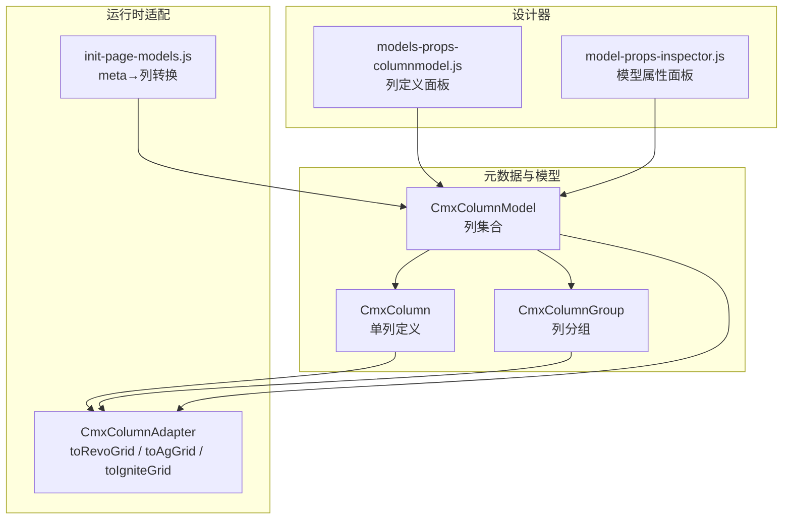
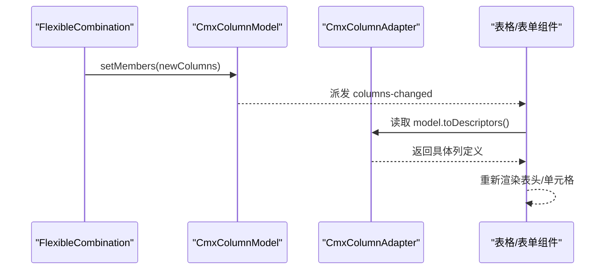
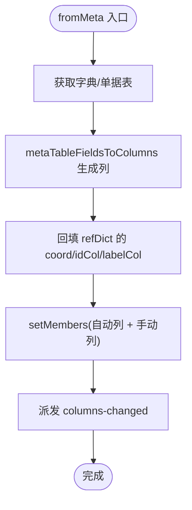
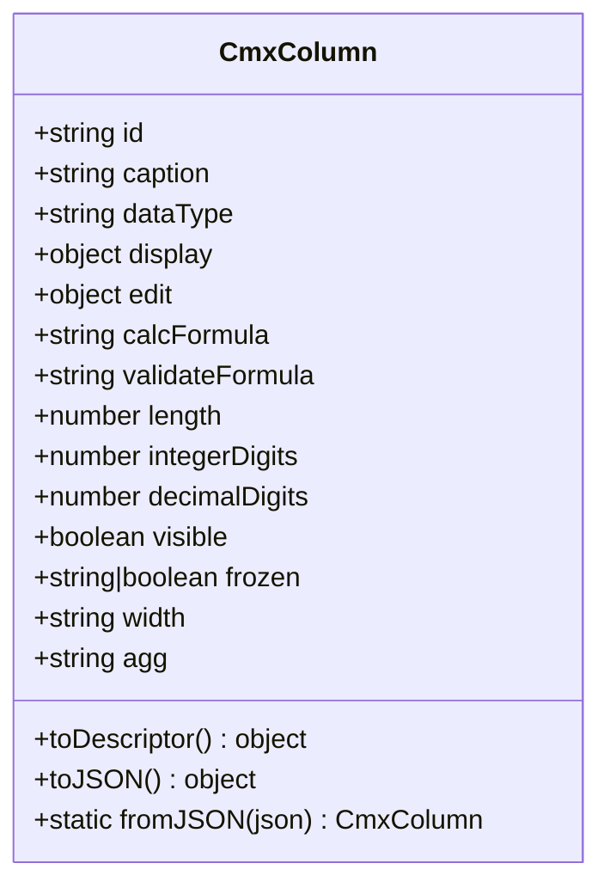
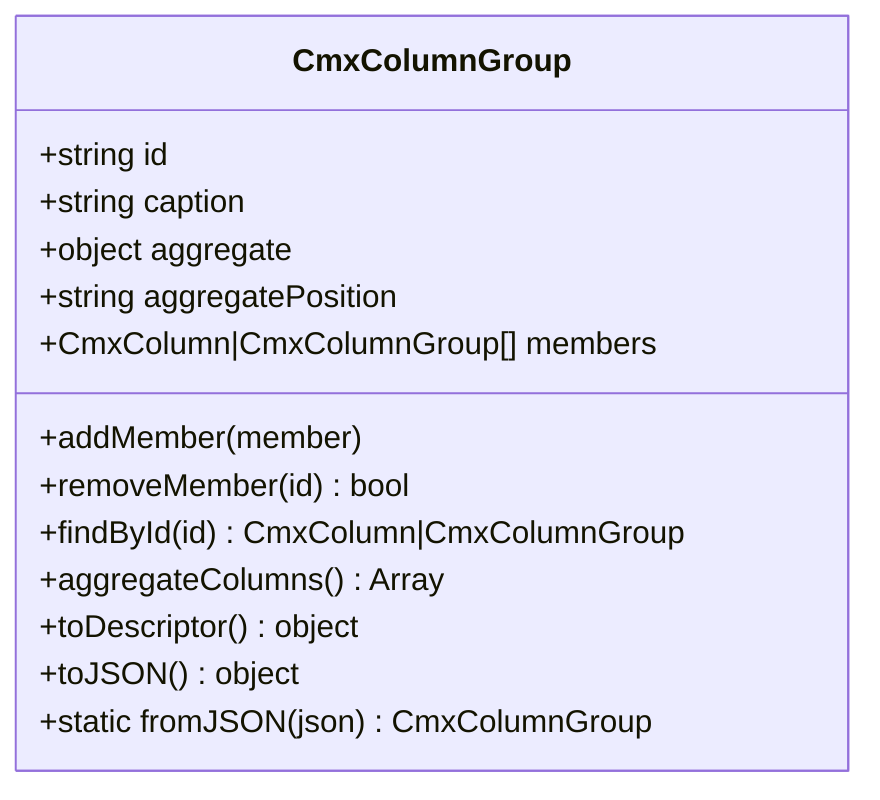
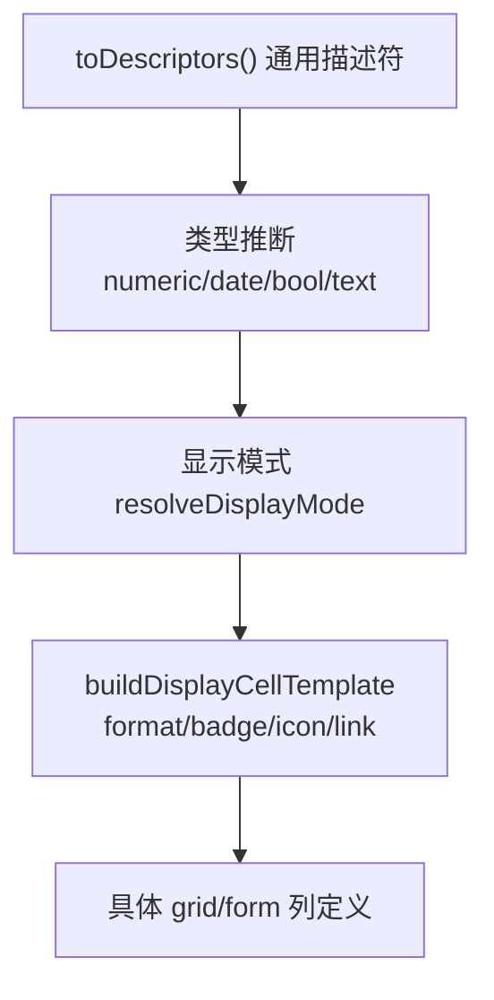
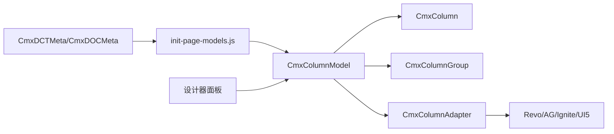

# 列模型（CmxColumnModel）

<cite>
**本文引用的文件**
- [cmx-column-model.js](file://packages/cmx-data-comp/src/lib/cmx-column-model.js)
- [cmx-column.js](file://packages/cmx-data-comp/src/lib/cmx-column.js)
- [cmx-column-group.js](file://packages/cmx-data-comp/src/lib/cmx-column-group.js)
- [cmx-column-adapter.js](file://packages/cmx-data-comp/src/lib/cmx-column-adapter.js)
- [init-page-models.js](file://packages/cmx-data-comp/src/lib/init-page-models.js)
- [model-column-model.md](file://.agents/skills/html-page-generator/references/model-column-model.md)
- [08-列模型-CmxColumnModel.md](file://docs/CMXPortalManager+CMXHTMLDesigner-模型体系文档/08-列模型-CmxColumnModel.md)
- [flexible-combination-meta-model.md](file://packages/cmx-data-comp/docs/flexible-combination-meta-model.md)
- [column-editor-display-guide.md](file://packages/cmx-data-comp/docs/column-editor-display-guide.md)
- [models-props-columnmodel.js](file://CMXHTMLDesigner/src/components/designer-page-data/models-props-columnmodel.js)
- [model-props-inspector.js](file://CMXHTMLDesigner/src/components/designer-inspector/model-props-inspector.js)
</cite>

## 目录
1. [简介](#简介)
2. [项目结构](#项目结构)
3. [核心组件](#核心组件)
4. [架构总览](#架构总览)
5. [详细组件分析](#详细组件分析)
6. [依赖关系分析](#依赖关系分析)
7. [性能考虑](#性能考虑)
8. [故障排查指南](#故障排查指南)
9. [结论](#结论)
10. [附录](#附录)

## 简介
本文件系统性说明 CmxColumnModel 列模型的完整能力：列定义、字段类型映射、验证规则配置；列分组与顺序控制；动态列生成机制；与表单/表格组件的绑定关系（显示控制、编辑模式）；并提供覆盖文本、数字、日期、下拉框等常见类型的列定义示例，以及性能优化技巧与扩展开发指南。

## 项目结构
围绕 CmxColumnModel 的核心代码位于 cmx-data-comp 包中，设计器侧提供可视化编辑与属性面板，适配器将通用描述符转换为具体表格/表单实现所需的列定义。

**图示来源**
- [cmx-column-model.js:1-240](file://packages/cmx-data-comp/src/lib/cmx-column-model.js#L1-L240)
- [cmx-column.js:1-255](file://packages/cmx-data-comp/src/lib/cmx-column.js#L1-L255)
- [cmx-column-group.js:1-162](file://packages/cmx-data-comp/src/lib/cmx-column-group.js#L1-L162)
- [cmx-column-adapter.js:1-200](file://packages/cmx-data-comp/src/lib/cmx-column-adapter.js#L1-L200)
- [init-page-models.js:139-170](file://packages/cmx-data-comp/src/lib/init-page-models.js#L139-L170)
- [models-props-columnmodel.js:1-800](file://CMXHTMLDesigner/src/components/designer-page-data/models-props-columnmodel.js#L1-L800)
- [model-props-inspector.js:310-334](file://CMXHTMLDesigner/src/components/designer-inspector/model-props-inspector.js#L310-L334)

**章节来源**
- [cmx-column-model.js:1-240](file://packages/cmx-data-comp/src/lib/cmx-column-model.js#L1-L240)
- [cmx-column.js:1-255](file://packages/cmx-data-comp/src/lib/cmx-column.js#L1-L255)
- [cmx-column-group.js:1-162](file://packages/cmx-data-comp/src/lib/cmx-column-group.js#L1-L162)
- [cmx-column-adapter.js:1-200](file://packages/cmx-data-comp/src/lib/cmx-column-adapter.js#L1-L200)
- [init-page-models.js:139-170](file://packages/cmx-data-comp/src/lib/init-page-models.js#L139-L170)
- [models-props-columnmodel.js:1-800](file://CMXHTMLDesigner/src/components/designer-page-data/models-props-columnmodel.js#L1-L800)
- [model-props-inspector.js:310-334](file://CMXHTMLDesigner/src/components/designer-inspector/model-props-inspector.js#L310-L334)

## 核心组件
- CmxColumnModel：管理 members（CmxColumn/CmxColumnGroup），提供成员增删改、序列化、聚合汇总、标题列解析、从元数据构建列等能力。
- CmxColumn：单列元数据，包含基础属性、display/edit 结构化配置、计算列、校验、宽度、冻结、可见性等。
- CmxColumnGroup：列分组，支持嵌套、组内聚合与聚合行位置。
- CmxColumnAdapter：将通用描述符转换为 RevoGrid、AG Grid、Ignite Grid 或 UI5 Form 所需的具体列定义。
- init-page-models.js：将元数据表字段转换为 CmxColumn（含 edit.mode/display/refDict/editSettings 等）。
- 设计器面板：可视化编辑 columns/columnGroups，JSON 视图双向同步。

**章节来源**
- [cmx-column-model.js:1-240](file://packages/cmx-data-comp/src/lib/cmx-column-model.js#L1-L240)
- [cmx-column.js:1-255](file://packages/cmx-data-comp/src/lib/cmx-column.js#L1-L255)
- [cmx-column-group.js:1-162](file://packages/cmx-data-comp/src/lib/cmx-column-group.js#L1-L162)
- [cmx-column-adapter.js:1-200](file://packages/cmx-data-comp/src/lib/cmx-column-adapter.js#L1-L200)
- [init-page-models.js:139-170](file://packages/cmx-data-comp/src/lib/init-page-models.js#L139-L170)
- [models-props-columnmodel.js:1-800](file://CMXHTMLDesigner/src/components/designer-page-data/models-props-columnmodel.js#L1-L800)

## 架构总览
CmxColumnModel 作为“列配方”，通过 toDescriptors() 输出通用中间格式，再由 CmxColumnAdapter 转换为具体表格/表单实现。FlexibleCombination 可在运行时调用 setMembers 替换列并触发 columns-changed 事件，驱动可视组件重渲染。

**图示来源**
- [cmx-column-model.js:31-72](file://packages/cmx-data-comp/src/lib/cmx-column-model.js#L31-L72)
- [cmx-column-model.js:179-195](file://packages/cmx-data-comp/src/lib/cmx-column-model.js#L179-L195)
- [cmx-column-adapter.js:1-200](file://packages/cmx-data-comp/src/lib/cmx-column-adapter.js#L1-L200)

## 详细组件分析

### CmxColumnModel：列集合与生命周期
- 成员管理：addMember/removeMember/setMembers，内部统一派发 columns-changed 事件。
- 标题列：toTitleCols 解析为列 id 数组，供标题组合展示。
- 聚合汇总：toAggregateMap 按 agg 类型收集列 id，用于合计行或后端聚合。
- 从元数据构建：fromMeta 基于 CmxDCTMeta/CmxDOCMeta 的字段列表，委托 init-page-models.js 生成 CmxColumn[]，并回填 refDict 的坐标信息，再整体替换 members。
- 序列化：toJSON/fromJSON 支持模型持久化与还原。

**图示来源**
- [cmx-column-model.js:74-158](file://packages/cmx-data-comp/src/lib/cmx-column-model.js#L74-L158)
- [init-page-models.js:139-170](file://packages/cmx-data-comp/src/lib/init-page-models.js#L139-L170)

**章节来源**
- [cmx-column-model.js:20-240](file://packages/cmx-data-comp/src/lib/cmx-column-model.js#L20-L240)
- [init-page-models.js:139-170](file://packages/cmx-data-comp/src/lib/init-page-models.js#L139-L170)

### CmxColumn：单列元数据与显示/编辑
- 基础属性：id、caption、dataType、width、visible、frozen、agg 等。
- display：mode/format/decimalDigits/thousandSeparator/zeroAsBlank/negativeColor/badge/icon/link/cellStyle/render 等。
- edit：mode/options/source/valueField/displayTemplate/parent/dropdown* /placeholder/dependents/required/requiredWhen/validate/validateWhen/readonlyWhen/editor 等。
- 计算列：calcFormula + dependsOn，配合 readonly 编辑模式。
- 校验：validateFormula 或 edit.validate（支持 preset 与表达式）。
- 序列化：toJSON/fromJSON 保留额外属性，函数值丢弃。

**图示来源**
- [cmx-column.js:1-255](file://packages/cmx-data-comp/src/lib/cmx-column.js#L1-L255)

**章节来源**
- [cmx-column.js:1-255](file://packages/cmx-data-comp/src/lib/cmx-column.js#L1-L255)
- [model-column-model.md:38-167](file://.agents/skills/html-page-generator/references/model-column-model.md#L38-L167)

### CmxColumnGroup：分组与聚合
- 成员：可包含 CmxColumn 或嵌套 CmxColumnGroup。
- 聚合：aggregate{sum,avg,max,min,count}，aggregatePosition 控制合计行位置。
- 叶列收集与计数：leafCount 忽略不可见列。
- 描述符：toDescriptor 输出 type=group 的结构，children 递归处理。

**图示来源**
- [cmx-column-group.js:1-162](file://packages/cmx-data-comp/src/lib/cmx-column-group.js#L1-L162)

**章节来源**
- [cmx-column-group.js:1-162](file://packages/cmx-data-comp/src/lib/cmx-column-group.js#L1-L162)

### CmxColumnAdapter：跨表格/表单的统一适配
- 输入：CmxColumnModel.toDescriptors() 输出的通用描述符。
- 输出：
  - RevoGrid：columns + totals 配置。
  - AG Grid：columnDefs + defaultColDef 扩展。
  - Ignite Grid：列配置与 totals。
  - UI5 Form：字段树（含分组）。
- 关键逻辑：
  - 类型推断：isNumericDescriptor/isDateDescriptor/isDatetimeDescriptor/isBooleanDescriptor。
  - 显示模式：resolveDisplayMode 决定 number/text/badge/icon/link/actions。
  - 单元格模板：buildDisplayCellTemplate 处理 format、badge、icon、link、空值占位等。
  - 列宽解析：parseColWidth 支持 px/%/flex/对象形式。

**图示来源**
- [cmx-column-adapter.js:1-200](file://packages/cmx-data-comp/src/lib/cmx-column-adapter.js#L1-L200)

**章节来源**
- [cmx-column-adapter.js:1-200](file://packages/cmx-data-comp/src/lib/cmx-column-adapter.js#L1-L200)

### 设计器：可视化编辑与 JSON 视图
- 定义视图：可视化添加/删除/移动列，编辑列属性，管理列组与成员。
- JSON 视图：CodeMirror 编辑 columns/columnGroups，格式化/应用/刷新。
- 复制粘贴：跨 ColumnModel 实例复制列与列组。
- 与模型面板联动：选中列后在详情面板编辑。

**章节来源**
- [models-props-columnmodel.js:1-800](file://CMXHTMLDesigner/src/components/designer-page-data/models-props-columnmodel.js#L1-L800)

## 依赖关系分析
- CmxColumnModel 依赖 CmxColumn/CmxColumnGroup 进行成员组织与描述符输出。
- CmxColumnModel.fromMeta 依赖 init-page-models.js 的 metaTableFieldsToColumns 将元数据字段转为列。
- 所有可视组件通过 CmxColumnAdapter 消费 toDescriptors() 的输出，屏蔽底层差异。
- 设计器通过 models-props-columnmodel.js 维护 columns/columnGroups，并与模型面板交互。

**图示来源**
- [cmx-column-model.js:74-158](file://packages/cmx-data-comp/src/lib/cmx-column-model.js#L74-L158)
- [init-page-models.js:139-170](file://packages/cmx-data-comp/src/lib/init-page-models.js#L139-L170)
- [cmx-column-adapter.js:1-200](file://packages/cmx-data-comp/src/lib/cmx-column-adapter.js#L1-L200)
- [models-props-columnmodel.js:1-800](file://CMXHTMLDesigner/src/components/designer-page-data/models-props-columnmodel.js#L1-L800)

**章节来源**
- [cmx-column-model.js:74-158](file://packages/cmx-data-comp/src/lib/cmx-column-model.js#L74-L158)
- [init-page-models.js:139-170](file://packages/cmx-data-comp/src/lib/init-page-models.js#L139-L170)
- [cmx-column-adapter.js:1-200](file://packages/cmx-data-comp/src/lib/cmx-column-adapter.js#L1-L200)
- [models-props-columnmodel.js:1-800](file://CMXHTMLDesigner/src/components/designer-page-data/models-props-columnmodel.js#L1-L800)

## 性能考虑
- 避免频繁重建列：优先使用 setMembers 一次性替换，减少多次 addMember/removeMember 导致的多次事件派发。
- 合理设置 visible：隐藏列不参与 toDescriptors 过滤，但可减少渲染开销。
- 使用聚合汇总：通过 toAggregateMap 集中处理合计，避免前端重复计算。
- 列宽策略：百分比/弹性列参与 stretch 均分，避免过多固定像素列导致布局抖动。
- 编辑器选择：select/combo 等远端搜索列应限制选项数量与请求频率。
- 公式与校验：尽量使用预设与轻量表达式，避免复杂函数体。

[本节为通用指导，不直接分析具体文件]

## 故障排查指南
- 列未生效：检查 members 是否为 CmxColumn/CmxColumnGroup 实例；确认 toDescriptors 是否被适配器消费。
- 事件未触发：确认通过 setMembers/addMember/removeMember 修改列；columns-changed 由 CmxColumnModel 内部派发。
- 字典列无坐标：fromMeta 会回填 editSettings.coord；若仍缺失，检查传入 coord 或 metaModel 的 domain/application/module。
- 显示异常：核对 display.mode 与 dataType 匹配；select 列让位给字段类型注册表的 cellTemplate，勿覆盖。
- 校验不生效：确保 edit.validate/validateFormula 正确配置，并在保存动作中执行校验流程。

**章节来源**
- [cmx-column-model.js:31-72](file://packages/cmx-data-comp/src/lib/cmx-column-model.js#L31-L72)
- [cmx-column-model.js:74-158](file://packages/cmx-data-comp/src/lib/cmx-column-model.js#L74-L158)
- [cmx-column-adapter.js:126-200](file://packages/cmx-data-comp/src/lib/cmx-column-adapter.js#L126-L200)
- [column-editor-display-guide.md:354-376](file://packages/cmx-data-comp/docs/column-editor-display-guide.md#L354-L376)

## 结论
CmxColumnModel 提供了统一的列建模能力，结合 CmxColumn/CmxColumnGroup 的结构化配置与 CmxColumnAdapter 的多端适配，实现了“一次定义、多端复用”。通过 FlexibleCombination 的动态改写与设计器的可视化编辑，可满足复杂业务场景下的列定义需求。遵循本文的配置规范与性能建议，可显著提升开发与运行效率。

[本节为总结性内容，不直接分析具体文件]

## 附录

### 字段类型映射与常用配置速查
- 数据类型：VARCHAR/TEXT/BIGINT/INT/NUMBER/DECIMAL/DATE/DATETIME/TIMESTAMP/BOOLEAN/JSON。
- 编辑模式：cmx-text-input/cm x-number-input/cm x-date-input/cm x-datetime-input/checkbox/select/combo/cmx-dict-select/readonly/none 等。
- 显示模式：''/text/number/badge/link/icon/actions；format 支持 thousands/percent/currency:date/datetime 等。
- 计算列：edit.mode=readonly + calcFormula + dependsOn。
- 校验：validateFormula/edit.validate（支持 preset 与表达式）。

**章节来源**
- [model-column-model.md:38-167](file://.agents/skills/html-page-generator/references/model-column-model.md#L38-L167)
- [column-editor-display-guide.md:354-376](file://packages/cmx-data-comp/docs/column-editor-display-guide.md#L354-L376)

### 列分组与顺序控制
- 分组：columnGroups 支持嵌套，members 可为列 id 或子分组。
- 聚合：aggregate 启用 sum/avg/max/min/count，aggregatePosition 控制合计行位置。
- 顺序：designer 支持上下移动列；setMembers 整体替换时保持新数组顺序。

**章节来源**
- [08-列模型-CmxColumnModel.md:106-127](file://docs/CMXPortalManager+CMXHTMLDesigner-模型体系文档/08-列模型-CmxColumnModel.md#L106-L127)
- [models-props-columnmodel.js:157-167](file://CMXHTMLDesigner/src/components/designer-page-data/models-props-columnmodel.js#L157-L167)
- [cmx-column-group.js:87-106](file://packages/cmx-data-comp/src/lib/cmx-column-group.js#L87-L106)

### 动态列生成机制
- 从元数据构建：fromMeta 将 CmxDCTMeta/CmxDOCMeta 的字段列表转换为 CmxColumn[]，并回填 refDict 坐标。
- 运行时改写：FlexibleCombination 调用 applyToColumnModel → setMembers，触发 columns-changed，驱动可视组件重渲染。
- 页面初始化：init-page-models.js 阶段将元数据字段映射到列（含 edit.mode/display/refDict/editSettings）。

**章节来源**
- [cmx-column-model.js:74-158](file://packages/cmx-data-comp/src/lib/cmx-column-model.js#L74-L158)
- [flexible-combination-meta-model.md:179-191](file://packages/cmx-data-comp/docs/flexible-combination-meta-model.md#L179-L191)
- [init-page-models.js:139-170](file://packages/cmx-data-comp/src/lib/init-page-models.js#L139-L170)

### 与表单/表格组件的绑定
- 表格：setColumnModel(model) 后，组件内部调用适配器转换列定义；支持 RevoGrid/AG Grid/Ignite。
- 表单：toCmxFormGrouped 输出字段树（含分组），用于 UI5 Form 渲染。
- 显示控制：visible=false 的列不参与渲染；display.mode/format 控制单元格呈现。
- 编辑模式：edit.mode 决定录入控件；select/combo/dict-select 支持远端数据源。

**章节来源**
- [cmx-column-adapter.js:1-200](file://packages/cmx-data-comp/src/lib/cmx-column-adapter.js#L1-L200)
- [08-列模型-CmxColumnModel.md:156-167](file://docs/CMXPortalManager+CMXHTMLDesigner-模型体系文档/08-列模型-CmxColumnModel.md#L156-L167)

### 完整列定义示例（覆盖常见类型）
- 文本列：id/caption/dataType=VARCHAR/edit.mode=cmx-text-input。
- 数字列：dataType=NUMBER/DECIMAL，edit.mode=cmx-number-input，display.format=thousands/percent/currency。
- 日期/时间列：dataType=DATE/DATETIME，edit.mode=cmx-date-input/cm x-datetime-input。
- 下拉框：edit.mode=select 或 combo，options 或远端 source。
- 字典选择：edit.mode=cmx-dict-select，refDict 与 editSettings.coord。
- 计算列：edit.mode=readonly + calcFormula + dependsOn。
- 状态徽章：display.mode=badge + badgeMap。
- 操作列：display.mode=actions + actions[]。

**章节来源**
- [model-column-model.md:222-309](file://.agents/skills/html-page-generator/references/model-column-model.md#L222-L309)

### 扩展开发指南
- 自定义字段类型：通过 registerFieldType 注册 form/grid 两端编辑器，grid mount 时写入 revo.editors。
- 自定义渲染：display.render 或 col.cellTemplate 提供逃生舱，优先级高于内置模板。
- 表达式与校验：使用 formula-eval 与 rule-validate 预设，避免复杂函数体。

**章节来源**
- [model-column-model.md:345-361](file://.agents/skills/html-page-generator/references/model-column-model.md#L345-L361)
- [column-editor-display-guide.md:354-376](file://packages/cmx-data-comp/docs/column-editor-display-guide.md#L354-L376)