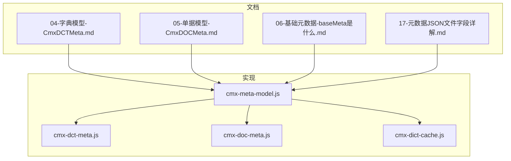
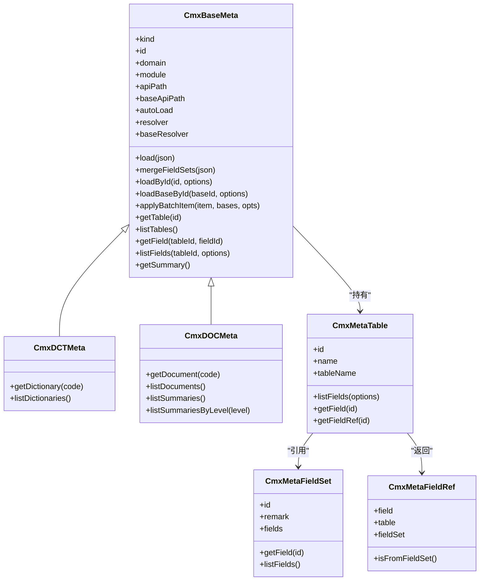
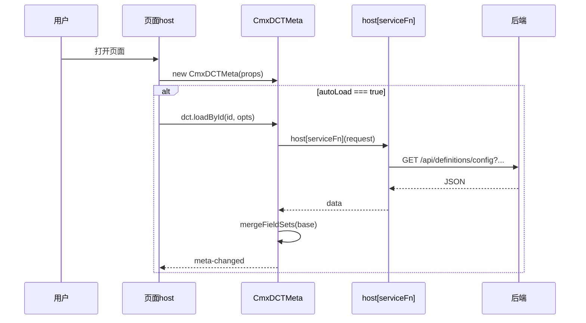
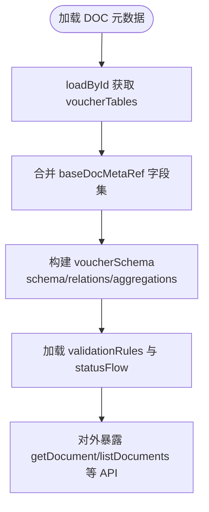
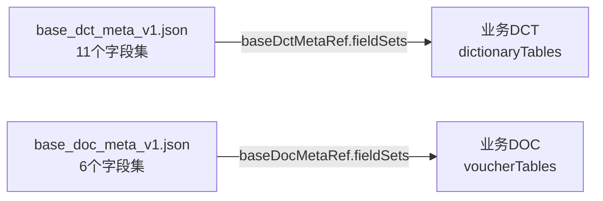
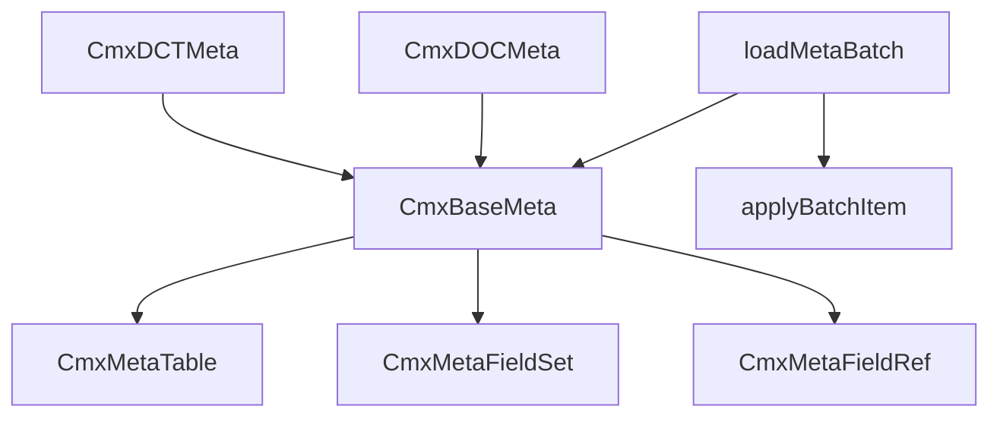
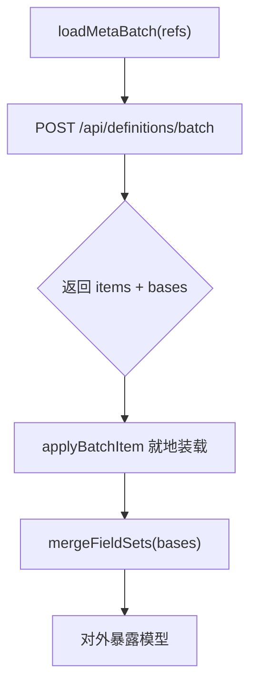

# 字典与单据元数据

<cite>
**本文引用的文件**
- [04-字典模型-CmxDCTMeta.md](file://docs/CMXPortalManager+CMXHTMLDesigner-模型体系文档/04-字典模型-CmxDCTMeta.md)
- [05-单据模型-CmxDOCMeta.md](file://docs/CMXPortalManager+CMXHTMLDesigner-模型体系文档/05-单据模型-CmxDOCMeta.md)
- [06-基础元数据-baseMeta是什么.md](file://docs/CMXPortalManager+CMXHTMLDesigner-模型体系文档/06-基础元数据-baseMeta是什么.md)
- [17-元数据JSON文件字段详解.md](file://docs/CMXPortalManager+CMXHTMLDesigner-模型体系文档/17-元数据JSON文件字段详解.md)
- [cmx-meta-model.js](file://packages/cmx-data-comp/src/lib/cmx-meta-model.js)
- [cmx-dct-meta.js](file://packages/cmx-data-comp/src/lib/cmx-dct-meta.js)
- [cmx-doc-meta.js](file://packages/cmx-data-comp/src/lib/cmx-doc-meta.js)
- [dct-doc-meta-model.md](file://packages/cmx-data-comp/docs/dct-doc-meta-model.md)
- [cmx-dict-cache.js](file://packages/cmx-data-comp/src/lib/cmx-dict-cache.js)
</cite>

## 目录
1. [引言](#引言)
2. [项目结构](#项目结构)
3. [核心组件](#核心组件)
4. [架构总览](#架构总览)
5. [详细组件分析](#详细组件分析)
6. [依赖关系分析](#依赖关系分析)
7. [性能与缓存](#性能与缓存)
8. [导入导出与在线编辑](#导入导出与在线编辑)
9. [故障排查](#故障排查)
10. [结论](#结论)
11. [附录：配置示例与集成方案](#附录：配置示例与集成方案)

## 引言
本文件面向“字典模型（CmxDCTMeta）”和“单据模型（CmxDOCMeta）”的完整技术说明，覆盖数据来源、结构定义、加载机制、缓存策略、版本管理、物理表定义、字段映射、业务规则、导入导出、在线编辑与实时同步等主题。目标是让读者既能快速上手配置，也能深入理解底层实现与扩展点。

## 项目结构
- 文档层：位于 docs/CMXPortalManager+CMXHTMLDesigner-模型体系文档/ 下的多份专题文档，系统阐述 DCT/DOC/BASE 的概念、结构与用法。
- 实现层：位于 packages/cmx-data-comp/src/lib/ 的核心类与工具函数，提供元数据模型的运行时能力（加载、合并、查询、批量加载）。
- 设计器与门户：通过属性面板与页面服务将模型注入 host，并在页面中消费。

图表来源
- [cmx-meta-model.js:1-767](file://packages/cmx-data-comp/src/lib/cmx-meta-model.js#L1-L767)
- [cmx-dct-meta.js:1-22](file://packages/cmx-data-comp/src/lib/cmx-dct-meta.js#L1-L22)
- [cmx-doc-meta.js:1-36](file://packages/cmx-data-comp/src/lib/cmx-doc-meta.js#L1-L36)
- [cmx-dict-cache.js:75-105](file://packages/cmx-data-comp/src/lib/cmx-dict-cache.js#L75-L105)

章节来源
- [04-字典模型-CmxDCTMeta.md:1-522](file://docs/CMXPortalManager+CMXHTMLDesigner-模型体系文档/04-字典模型-CmxDCTMeta.md#L1-L522)
- [05-单据模型-CmxDOCMeta.md:1-509](file://docs/CMXPortalManager+CMXHTMLDesigner-模型体系文档/05-单据模型-CmxDOCMeta.md#L1-L509)
- [06-基础元数据-baseMeta是什么.md:1-267](file://docs/CMXPortalManager+CMXHTMLDesigner-模型体系文档/06-基础元数据-baseMeta是什么.md#L1-L267)
- [17-元数据JSON文件字段详解.md:1-682](file://docs/CMXPortalManager+CMXHTMLDesigner-模型体系文档/17-元数据JSON文件字段详解.md#L1-L682)

## 核心组件
- CmxDCTMeta：数据字典元数据模型，负责加载并暴露字典表、字段集与字段访问 API。
- CmxDOCMeta：业务单据元数据模型，在 DCT 基础上增加单据层级、主外键关系、聚合、状态机与校验规则。
- CmxBaseMeta：基类，统一处理加载、字段集合并、批量加载、事件派发与通用查询。
- CmxMetaTable / CmxMetaFieldSet / CmxMetaFieldRef：表、字段集与轻量字段引用对象，支撑字段展开与只读访问。
- loadMetaBatch / loadMetaModelsBatch：批量加载元数据与 base 字段集，去重并复用。
- CmxDictCache：字典数据缓存，支持按 dictCode 加载与 resolve/resolveMany。

章节来源
- [cmx-meta-model.js:98-345](file://packages/cmx-data-comp/src/lib/cmx-meta-model.js#L98-L345)
- [cmx-meta-model.js:347-767](file://packages/cmx-data-comp/src/lib/cmx-meta-model.js#L347-L767)
- [cmx-dct-meta.js:1-22](file://packages/cmx-data-comp/src/lib/cmx-dct-meta.js#L1-L22)
- [cmx-doc-meta.js:1-36](file://packages/cmx-data-comp/src/lib/cmx-doc-meta.js#L1-L36)
- [cmx-dict-cache.js:75-105](file://packages/cmx-data-comp/src/lib/cmx-dict-cache.js#L75-L105)

## 架构总览
CmxDCTMeta 与 CmxDOCMeta 继承自同一基类，共享加载、合并、查询与批量加载能力；差异在于 kind、tableProp 以及各自领域方法（getDictionary/getDocument 等）。BASE 元数据作为共享字段集被多个业务模块引用，避免重复维护。

图表来源
- [cmx-meta-model.js:98-345](file://packages/cmx-data-comp/src/lib/cmx-meta-model.js#L98-L345)
- [cmx-meta-model.js:347-767](file://packages/cmx-data-comp/src/lib/cmx-meta-model.js#L347-L767)
- [cmx-dct-meta.js:1-22](file://packages/cmx-data-comp/src/lib/cmx-dct-meta.js#L1-L22)
- [cmx-doc-meta.js:1-36](file://packages/cmx-data-comp/src/lib/cmx-doc-meta.js#L1-L36)

## 详细组件分析

### 字典模型 CmxDCTMeta
- 定位：描述“数据字典”的元数据容器，提供 getDictionary/listDictionaries 等语义化入口。
- 数据结构：顶层包含 moduleMeta、baseDctMetaRef、dictionaryTableConventions、dictionaryTables、updatedAt。每张字典表含 dictMeta、fields[] 及多种字段集引用（base/hierarchy/audit/effective/disable/system/scope），并可配置 codeRule 与 uniqueKeys。
- 加载机制：四种优先级 resolver → serviceFn → baseResolver → fetch 默认接口；支持 loadById 自动合并 base 字段集；支持 loadMetaBatch 批量加载并去重 base。
- 使用场景：为下拉选择、字典树、维度选择等提供字段定义与取值能力。

图表来源
- [cmx-meta-model.js:418-468](file://packages/cmx-data-comp/src/lib/cmx-meta-model.js#L418-L468)
- [cmx-meta-model.js:589-603](file://packages/cmx-data-comp/src/lib/cmx-meta-model.js#L589-L603)
- [04-字典模型-CmxDCTMeta.md:424-450](file://docs/CMXPortalManager+CMXHTMLDesigner-模型体系文档/04-字典模型-CmxDCTMeta.md#L424-L450)

章节来源
- [04-字典模型-CmxDCTMeta.md:25-136](file://docs/CMXPortalManager+CMXHTMLDesigner-模型体系文档/04-字典模型-CmxDCTMeta.md#L25-L136)
- [04-字典模型-CmxDCTMeta.md:148-274](file://docs/CMXPortalManager+CMXHTMLDesigner-模型体系文档/04-字典模型-CmxDCTMeta.md#L148-L274)
- [cmx-dct-meta.js:1-22](file://packages/cmx-data-comp/src/lib/cmx-dct-meta.js#L1-L22)

### 单据模型 CmxDOCMeta
- 定位：描述“业务单据”的元数据容器，除 DCT 能力外，增加 voucherSchema（schema/relations/aggregations）、voucherStatusFlow、validationRules 等。
- 数据结构：顶层包含 moduleMeta（含 organizationDict/keyDicts/documentTypeDict/versioning）、baseDocMetaRef、voucherCommonFieldSet、voucherSchema、voucherTables、voucherStatusFlow、updatedAt、validationRules。
- 字段映射与业务规则：
  - 物理表定义：voucherTables[].tableName/tableAlias/level/parentTable。
  - 字段映射：fields[] 与 documentFieldSets/fieldOverrides 组合，支持对 base 字段进行覆盖。
  - 业务规则：aggregations（金额逐层上卷）、validationRules（跨表校验）、voucherStatusFlow（状态机守卫）。
- 使用场景：驱动表单、网格、主从协调器、弹性组合等 UI 组件，生成 CRUD 页面与报表视图。

图表来源
- [cmx-meta-model.js:418-468](file://packages/cmx-data-comp/src/lib/cmx-meta-model.js#L418-L468)
- [05-单据模型-CmxDOCMeta.md:129-189](file://docs/CMXPortalManager+CMXHTMLDesigner-模型体系文档/05-单据模型-CmxDOCMeta.md#L129-L189)
- [05-单据模型-CmxDOCMeta.md:275-341](file://docs/CMXPortalManager+CMXHTMLDesigner-模型体系文档/05-单据模型-CmxDOCMeta.md#L275-L341)

章节来源
- [05-单据模型-CmxDOCMeta.md:25-128](file://docs/CMXPortalManager+CMXHTMLDesigner-模型体系文档/05-单据模型-CmxDOCMeta.md#L25-L128)
- [05-单据模型-CmxDOCMeta.md:191-274](file://docs/CMXPortalManager+CMXHTMLDesigner-模型体系文档/05-单据模型-CmxDOCMeta.md#L191-L274)
- [cmx-doc-meta.js:1-36](file://packages/cmx-data-comp/src/lib/cmx-doc-meta.js#L1-L36)

### 基础元数据 BASE 与字段集
- 概念：BASE 不是“表”，而是“字段集的集合”。业务模块通过 baseDctMetaRef/baseDocMetaRef 引用，避免重复维护公共列。
- 设计期：在 CmxDCTMeta 的属性面板有两个 Tab——“元数据 JSON”和“共享字段集 JSON”，分别编辑业务定义与 BASE 字段集。
- 运行期：字段集引用会被自动展开，listFields 结果包含来自 base 的字段。

图表来源
- [06-基础元数据-baseMeta是什么.md:20-48](file://docs/CMXPortalManager+CMXHTMLDesigner-模型体系文档/06-基础元数据-baseMeta是什么.md#L20-L48)
- [17-元数据JSON文件字段详解.md:17-31](file://docs/CMXPortalManager+CMXHTMLDesigner-模型体系文档/17-元数据JSON文件字段详解.md#L17-L31)

章节来源
- [06-基础元数据-baseMeta是什么.md:69-147](file://docs/CMXPortalManager+CMXHTMLDesigner-模型体系文档/06-基础元数据-baseMeta是什么.md#L69-L147)
- [17-元数据JSON文件字段详解.md:271-338](file://docs/CMXPortalManager+CMXHTMLDesigner-模型体系文档/17-元数据JSON文件字段详解.md#L271-L338)

## 依赖关系分析
- 类层次：CmxDCTMeta/CmxDOCMeta 均继承 CmxBaseMeta；CmxBaseMeta 内部维护 CmxMetaTable/CmxMetaFieldSet/CmxMetaFieldRef。
- 加载链路：_resolveMeta/_resolveBaseMeta 优先走 resolver/serviceFn，再回退到 fetch；loadMetaBatch 支持一次性拉取多个元数据与 base，并通过 applyBatchItem 就地装载。
- 字段集合并：mergeFieldSets 会清空表的字段缓存，确保后续 listFields 重新计算。
- 注册机制：registerMetaModelKind 使 loadMetaBatch 能按 kind 实例化对应模型。

图表来源
- [cmx-meta-model.js:633-767](file://packages/cmx-data-comp/src/lib/cmx-meta-model.js#L633-L767)
- [cmx-meta-model.js:98-345](file://packages/cmx-data-comp/src/lib/cmx-meta-model.js#L98-L345)

章节来源
- [cmx-meta-model.js:347-767](file://packages/cmx-data-comp/src/lib/cmx-meta-model.js#L347-L767)

## 性能与缓存
- 字段集共享：字段集在模型内保存一份，表字段展开时返回轻量 CmxMetaFieldRef，减少内存占用与复制成本。
- 批量加载：loadMetaBatch 单次请求拉取多个元数据与 base，字段集自动去重，降低网络开销。
- 字典缓存：CmxDictCache 按 dictCode 缓存字典数据，支持 resolve/resolveMany；失败不写缓存以便重试。
- 冻结与不可变：raw/meta/fieldSets 深度冻结，避免意外修改导致的状态不一致。

图表来源
- [cmx-meta-model.js:669-733](file://packages/cmx-data-comp/src/lib/cmx-meta-model.js#L669-L733)
- [cmx-dict-cache.js:75-105](file://packages/cmx-data-comp/src/lib/cmx-dict-cache.js#L75-L105)

章节来源
- [cmx-meta-model.js:669-733](file://packages/cmx-data-comp/src/lib/cmx-meta-model.js#L669-L733)
- [cmx-dict-cache.js:75-105](file://packages/cmx-data-comp/src/lib/cmx-dict-cache.js#L75-L105)

## 导入导出与在线编辑
- 在线编辑：设计器属性区提供“元数据 JSON”和“共享字段集 JSON”两个编辑器，支持直接粘贴与 CodeMirror 编辑。
- 导入：可通过 loadById/loadMetaBatch 从后端加载；也可通过 load 直接传入 JSON 对象用于测试或离线场景。
- 导出：模型提供 toJSON/getSummary/raw 等方法，便于序列化与调试；页面与服务端交互通常通过服务面板声明的服务函数完成。

章节来源
- [06-基础元数据-baseMeta是什么.md:69-85](file://docs/CMXPortalManager+CMXHTMLDesigner-模型体系文档/06-基础元数据-baseMeta是什么.md#L69-L85)
- [cmx-meta-model.js:503-568](file://packages/cmx-data-comp/src/lib/cmx-meta-model.js#L503-L568)

## 故障排查
- 缺少 domain/module：非 base 加载必须带 domain（必要时 module），否则后端返回 400；基类会在 _buildLoadRequest 前给出明确错误提示。
- base 未合并：若 loadById 后未看到 base 字段，检查是否传入了 bundle.bases 或未调用 loadBaseById；或确认 base 文件路径与 moduleCode 匹配。
- 字段集未生效：确认 baseDctMetaRef.fieldSets 列表中包含该字段集名，且单张表的引用键（如 baseFieldSet）正确。
- 字典缓存失败：CmxDictCache 在响应异常或不合法时不会写入缓存，控制台会有警告；上层应重试或降级显示。

章节来源
- [cmx-meta-model.js:418-427](file://packages/cmx-data-comp/src/lib/cmx-meta-model.js#L418-L427)
- [cmx-meta-model.js:447-468](file://packages/cmx-data-comp/src/lib/cmx-meta-model.js#L447-L468)
- [cmx-dict-cache.js:75-105](file://packages/cmx-data-comp/src/lib/cmx-dict-cache.js#L75-L105)

## 结论
- CmxDCTMeta 与 CmxDOCMeta 基于同一基类，共享加载、合并、查询与批量加载能力；差异体现在领域方法与 JSON 结构。
- BASE 字段集是跨模块复用的关键，避免重复维护公共列。
- 通过 loadMetaBatch 可高效加载多份元数据与 base，结合 CmxDictCache 提升字典数据读取性能。
- 单据模型提供完整的物理表定义、字段映射与业务规则（聚合、状态机、校验），支撑复杂业务场景。

## 附录：配置示例与集成方案

### 最小配置示例（字典）
- 在模型面板添加 CmxDCTMeta，设置 id/domain/module/autoLoad/json/fieldSets 等属性。
- 页面中使用 host.glDctMeta.getDictionary('gl_account') 获取字典表，再通过 getField/listFields 访问字段。

章节来源
- [04-字典模型-CmxDCTMeta.md:454-479](file://docs/CMXPortalManager+CMXHTMLDesigner-模型体系文档/04-字典模型-CmxDCTMeta.md#L454-L479)

### 最小配置示例（单据）
- 在模型面板添加 CmxDOCMeta，设置 id/domain/module/autoLoad。
- 页面中使用 host.voucherDocMeta.getDocument('cv_header') 获取头表，listFields('cv_aux_line') 获取辅助行字段。

章节来源
- [05-单据模型-CmxDOCMeta.md:376-399](file://docs/CMXPortalManager+CMXHTMLDesigner-模型体系文档/05-单据模型-CmxDOCMeta.md#L376-L399)

### 批量加载与共享 base
- 使用 loadMetaBatch 一次拉取 DCT 与 DOC，并自动合并 base 字段集；返回 byId/byKind 索引，便于后续访问。

章节来源
- [cmx-meta-model.js:669-733](file://packages/cmx-data-comp/src/lib/cmx-meta-model.js#L669-L733)

### 字典数据缓存
- 使用 CmxDictCache 按 dictCode 加载字典数据，支持 resolve/resolveMany；失败不写缓存以保留重试机会。

章节来源
- [cmx-dict-cache.js:75-105](file://packages/cmx-data-comp/src/lib/cmx-dict-cache.js#L75-L105)

### 版本管理与实时同步
- 版本管理：moduleMeta.version 标识元数据版本；BASE 反查按 moduleCode 定位 stem，支持多版本切换。
- 实时同步：模型在加载/合并后派发 meta-changed 事件，页面可订阅以刷新视图；字典缓存失败时控制台告警，上层可重试。

章节来源
- [cmx-meta-model.js:570-574](file://packages/cmx-data-comp/src/lib/cmx-meta-model.js#L570-L574)
- [cmx-meta-model.js:447-468](file://packages/cmx-data-comp/src/lib/cmx-meta-model.js#L447-L468)
- [cmx-dict-cache.js:75-105](file://packages/cmx-data-comp/src/lib/cmx-dict-cache.js#L75-L105)