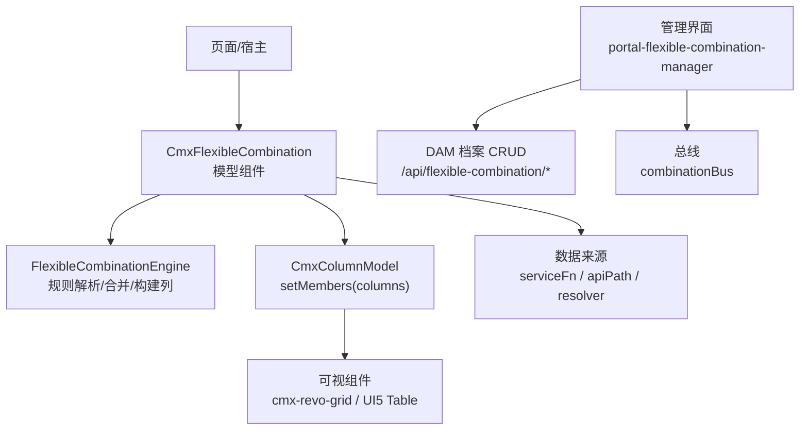
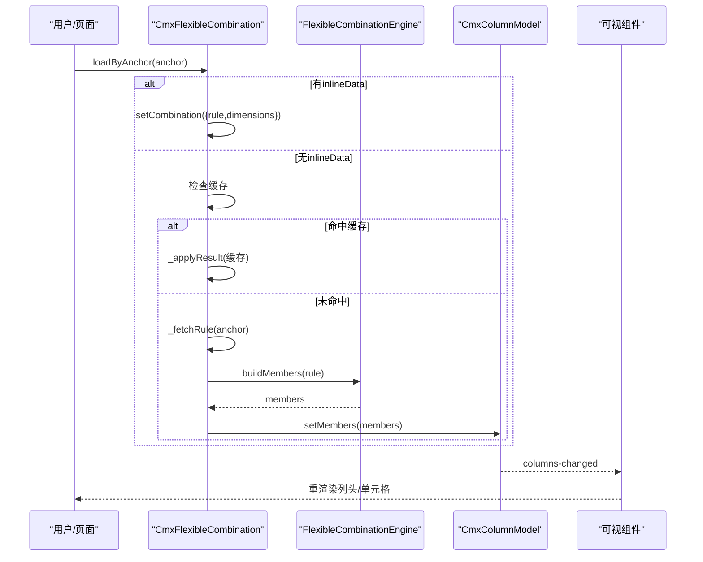
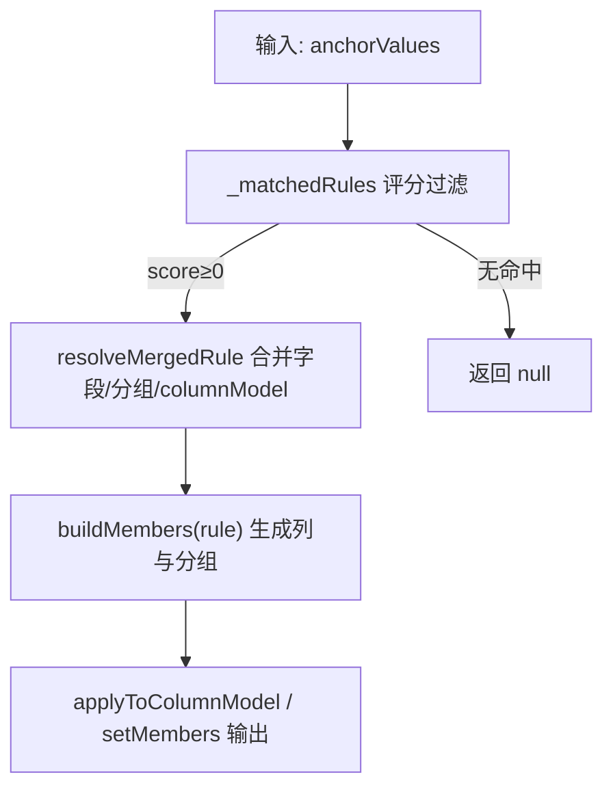
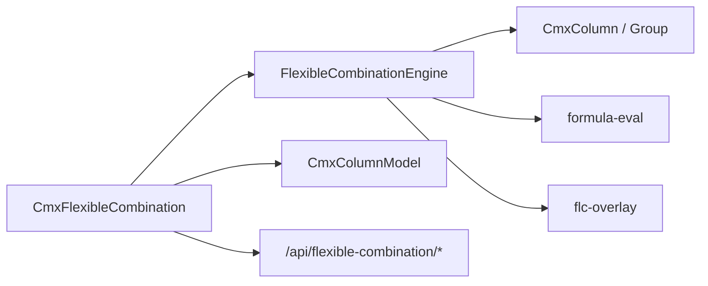

# 弹性组合 (FlexibleCombination)

<cite>
**本文引用的文件**
- [10-弹性组合-FlexibleCombination.md](file://docs/CMXPortalManager+CMXHTMLDesigner-模型体系文档/10-弹性组合-FlexibleCombination.md)
- [FLC-弹性组合-应用个性化最佳设计.md](file://docs/FLC-弹性组合-应用个性化最佳设计.md)
- [cmx-flexible-combination.js](file://packages/cmx-data-comp/src/lib/cmx-flexible-combination.js)
- [flexible-combination-engine.js](file://packages/cmx-data-comp/src/lib/flexible-combination-engine.js)
- [portal-flexible-combination-manager.js](file://CMXPortalManager/src/components/portal-flexible-combination-manager.js)
- [models-props-flexible-combination.js](file://CMXHTMLDesigner/src/components/designer-page-data/models-props-flexible-combination.js)
- [flexible-combination-bus.js](file://CMXPortalManager/src/lib/flexible-combination-bus.js)
- [cmx-flexible-combination.test.js](file://packages/cmx-data-comp/src/lib/__tests__/cmx-flexible-combination.test.js)
</cite>

## 目录
1. [简介](#简介)
2. [项目结构](#项目结构)
3. [核心组件](#核心组件)
4. [架构总览](#架构总览)
5. [详细组件分析](#详细组件分析)
6. [依赖关系分析](#依赖关系分析)
7. [性能与扩展指南](#性能与扩展指南)
8. [故障排查](#故障排查)
9. [结论](#结论)
10. [附录：配置示例与场景](#附录配置示例与场景)

## 简介
弹性组合（FlexibleCombination，简称 FLC）是“按上下文动态生成列”的元数据驱动能力。它通过锚点维度值（如会计科目、交易类型）匹配规则，派生出当前情境下应展示的列集合，并写入目标 CmxColumnModel，触发可视组件（如 cmx-revo-grid）自动重渲染。其核心价值在于：用 JSON 配置替代 if-else 分支，实现同一单据在不同业务情境下的“一表多态”。

## 项目结构
围绕 FlexibleCombination 的前后端协作涉及以下关键位置：
- 运行时引擎与模型组件：packages/cmx-data-comp/src/lib
- 管理界面与总线：CMXPortalManager/src/components, CMXPortalManager/src/lib
- 设计器属性面板：CMXHTMLDesigner/src/components/designer-page-data
- 权威说明文档：docs/.../10-弹性组合-FlexibleCombination.md, docs/FLC-弹性组合-应用个性化最佳设计.md



图表来源
- [cmx-flexible-combination.js:37-347](file://packages/cmx-data-comp/src/lib/cmx-flexible-combination.js#L37-L347)
- [flexible-combination-engine.js:47-789](file://packages/cmx-data-comp/src/lib/flexible-combination-engine.js#L47-L789)
- [portal-flexible-combination-manager.js:51-531](file://CMXPortalManager/src/components/portal-flexible-combination-manager.js#L51-L531)
- [flexible-combination-bus.js:17-73](file://CMXPortalManager/src/lib/flexible-combination-bus.js#L17-L73)

章节来源
- [10-弹性组合-FlexibleCombination.md:1-470](file://docs/CMXPortalManager+CMXHTMLDesigner-模型体系文档/10-弹性组合-FlexibleCombination.md#L1-L470)
- [FLC-弹性组合-应用个性化最佳设计.md:1-161](file://docs/FLC-弹性组合-应用个性化最佳设计.md#L1-L161)

## 核心组件
- CmxFlexibleCombination：对外暴露 loadByAnchor/setRule/setCombination/clear 等 API，负责取数、缓存、结果路由到目标列模型，并派发事件。
- FlexibleCombinationEngine：领域无关的规则引擎，负责锚点评分、多规则合并、字段→列转换、分组构建、公式计算与校验。
- portal-flexible-combination-manager：可视化维护 DAM 三段定位 + scenario 的弹性组合档案，支持维度、规则、锚点、分组、columnModel 编辑与预览。
- combinationBus：列表与主体之间的跨 ShadowDOM 通信总线，用于选中、刷新、状态同步。
- 设计器属性面板：在 Designer 中为 FlexibleCombination 提供属性编辑入口提示。

章节来源
- [cmx-flexible-combination.js:37-347](file://packages/cmx-data-comp/src/lib/cmx-flexible-combination.js#L37-L347)
- [flexible-combination-engine.js:47-789](file://packages/cmx-data-comp/src/lib/flexible-combination-engine.js#L47-L789)
- [portal-flexible-combination-manager.js:51-531](file://CMXPortalManager/src/components/portal-flexible-combination-manager.js#L51-L531)
- [flexible-combination-bus.js:17-73](file://CMXPortalManager/src/lib/flexible-combination-bus.js#L17-L73)
- [models-props-flexible-combination.js:1-16](file://CMXHTMLDesigner/src/components/designer-page-data/models-props-flexible-combination.js#L1-L16)

## 架构总览
弹性组合的运行链路如下：
- 用户操作或页面初始化触发 anchor 变化
- 优先命中 inlineData；否则查缓存；再调用 serviceFn 或默认 fetch 获取 rule + dimensions
- Engine 进行锚点评分与多规则合并，构建 members 与 columnModel
- 写入目标 CmxColumnModel，触发 columns-changed 事件，可视组件重渲染



图表来源
- [cmx-flexible-combination.js:104-147](file://packages/cmx-data-comp/src/lib/cmx-flexible-combination.js#L104-L147)
- [flexible-combination-engine.js:346-430](file://packages/cmx-data-comp/src/lib/flexible-combination-engine.js#L346-L430)

## 详细组件分析

### CmxFlexibleCombination 模型组件
- 绑定与路由
  - 单绑定：columnModelId 为字符串时，始终将字段集0应用到该列模型。
  - 多绑定：columnModelId 为 {表名: 列模型ID} 映射时，按字段集的 table 路由到对应列模型；'*' 作为兜底。
- 数据来源优先级
  - 显式 resolver > serviceFn（host 上的 pageService）> 默认 fetch(apiPath)。
- 缓存与回退
  - 按 anchor 签名缓存；失败或无规则时还原各绑定的初始 members。
- 事件
  - flexible-combination-loaded / error / cleared。

```mermaid
classDiagram
class CmxFlexibleCombination {
+loadByAnchor(anchorValues) Promise
+setRule({rule,dimensions,anchor})
+setCombination(json)
+clear()
+invalidateCache(anchor)
-_fetchRule(anchor)
-_buildResult(res)
-_applyResult(result)
-_restoreInitial()
}
class FlexibleCombinationEngine {
+resolveMergedRule(anchor)
+buildMembers(rule)
+buildColumnModel(rule,combination)
}
class CmxColumnModel {
+setMembers(members)
}
CmxFlexibleCombination --> FlexibleCombinationEngine : "委托规则解析"
CmxFlexibleCombination --> CmxColumnModel : "写入列成员"
```

图表来源
- [cmx-flexible-combination.js:37-347](file://packages/cmx-data-comp/src/lib/cmx-flexible-combination.js#L37-L347)
- [flexible-combination-engine.js:47-430](file://packages/cmx-data-comp/src/lib/flexible-combination-engine.js#L47-L430)

章节来源
- [cmx-flexible-combination.js:37-347](file://packages/cmx-data-comp/src/lib/cmx-flexible-combination.js#L37-L347)
- [cmx-flexible-combination.test.js:39-186](file://packages/cmx-data-comp/src/lib/__tests__/cmx-flexible-combination.test.js#L39-L186)

### FlexibleCombinationEngine 规则引擎
- 锚点评分与多规则合并
  - 精确匹配得分最高，数组/层级泛化次之，通配最低；具体度 = score×100 + 锚点维度数。
  - 多规则合并：同名字段取高分者，同分取定义靠前；分组顺序拼接；columnModel 高分覆盖。
- 字段三态与列构建
  - dimension/attribute/measure/text；自动推导 edit.mode、display、校验、公式重算。
- 公式与校验
  - 白名单求值（+ - * / ROUND/ABS/MIN/MAX/IF），dependsOn 拓扑排序重算；validations 与 pattern 校验。
- overlay 展开
  - use/pick/over 在构造期展开为 inline fields，保证后续方法一致可见。



图表来源
- [flexible-combination-engine.js:131-236](file://packages/cmx-data-comp/src/lib/flexible-combination-engine.js#L131-L236)
- [flexible-combination-engine.js:346-430](file://packages/cmx-data-comp/src/lib/flexible-combination-engine.js#L346-L430)
- [flexible-combination-engine.js:720-773](file://packages/cmx-data-comp/src/lib/flexible-combination-engine.js#L720-L773)

章节来源
- [flexible-combination-engine.js:47-789](file://packages/cmx-data-comp/src/lib/flexible-combination-engine.js#L47-L789)

### 管理界面与总线
- portal-flexible-combination-manager
  - 维护 DAM 三段定位 + scenario 的档案；编辑维度、规则、锚点、分组、columnModel；支持预览与校验。
  - 加载 DOC/DCT 引用以辅助 pick/use/over 与字典列候选。
- combinationBus
  - 列表与主体共享 items/selectedKey/controller/state，避免竞态与重复请求。

章节来源
- [portal-flexible-combination-manager.js:51-531](file://CMXPortalManager/src/components/portal-flexible-combination-manager.js#L51-L531)
- [flexible-combination-bus.js:17-73](file://CMXPortalManager/src/lib/flexible-combination-bus.js#L17-L73)

### 设计器属性面板
- models-props-flexible-combination.js 提供属性区占位与提示，引导用户在右侧属性区域编辑业务场景、目标列模型、取数来源、锚点维度与内联规则。

章节来源
- [models-props-flexible-combination.js:1-16](file://CMXHTMLDesigner/src/components/designer-page-data/models-props-flexible-combination.js#L1-L16)

## 依赖关系分析
- 组件耦合
  - CmxFlexibleCombination 依赖 Engine 做规则解析，依赖 CmxColumnModel 写列成员；Engine 依赖 CmxColumn/CmxColumnGroup/CmxColumnModel/formula-eval/flc-overlay/drn。
- 外部集成点
  - 后端 API：/api/flexible-combination/rule、/config、/list、/validate、/preview、/default。
  - 服务层：pageService 函数（serviceFn）可自定义取数逻辑。
- 事件链
  - CmxColumnModel.setMembers → columns-changed → 可视组件重渲染。



图表来源
- [cmx-flexible-combination.js:37-347](file://packages/cmx-data-comp/src/lib/cmx-flexible-combination.js#L37-L347)
- [flexible-combination-engine.js:47-789](file://packages/cmx-data-comp/src/lib/flexible-combination-engine.js#L47-L789)

章节来源
- [cmx-flexible-combination.js:37-347](file://packages/cmx-data-comp/src/lib/cmx-flexible-combination.js#L37-L347)
- [flexible-combination-engine.js:47-789](file://packages/cmx-data-comp/src/lib/flexible-combination-engine.js#L47-L789)

## 性能与扩展指南
- 性能要点
  - 缓存：按 anchor 签名缓存最近结果，重复锚点不再请求后端。
  - 多规则合并：仅对命中规则合并字段/分组/columnModel，减少无效计算。
  - 公式重算：基于 dependsOn 拓扑序增量重算，避免全量重算。
  - overlay 展开：构造期一次性展开 use/pick，避免运行期反复展开。
- 扩展建议
  - 自定义取数：通过 resolver 或 serviceFn 注入，屏蔽后端差异。
  - 多表绑定：使用 {表名: 列模型ID} 映射，精准路由字段集。
  - 列模型覆盖：利用 rule.columnModel 与档案级 columnModel 的高分覆盖策略，实现局部定制。
  - 事件监听：订阅 flexible-combination-loaded/error/cleared 与 columns-changed，实现联动与审计。

[本节为通用指导，不直接分析具体文件]

## 故障排查
- 常见问题
  - columnModelId 写错：列变更派发但目标不存在，静默失败。
  - inlineData 既无 rule 也无 rules：console.warn 且不派发事件。
  - 锚点为空或未传：引擎给最小列集或回退到初始列。
  - 后端无匹配规则：调用方拿到 null，列保持原状。
  - 改 scenario 后未清缓存：旧规则仍命中，需调用 clear()。
- 调试手段
  - 监听 flexible-combination-error 获取错误详情。
  - 使用 preview/validate 端点预览与校验配置。
  - 在管理界面查看诊断信息与匹配结果。

章节来源
- [10-弹性组合-FlexibleCombination.md:432-453](file://docs/CMXPortalManager+CMXHTMLDesigner-模型体系文档/10-弹性组合-FlexibleCombination.md#L432-L453)
- [cmx-flexible-combination.js:126-131](file://packages/cmx-data-comp/src/lib/cmx-flexible-combination.js#L126-L131)

## 结论
FlexibleCombination 通过“锚点→规则匹配→动态列组合”的机制，将 ERP 个性化的表达从命令式代码迁移到声明式 JSON 配置，实现了零代码定制、继承与特化、升级不冲突、多租户复用与治理。配合 Engine 的评分合并、overlay 叠加、公式与校验，以及管理界面的可视化维护，形成完整的弹性组合解决方案。

[本节为总结性内容，不直接分析具体文件]

## 附录：配置示例与场景

### 基础概念速查
- 别名 ContextProfile：早期文档中的别名，实际类名为 CmxFlexibleCombination，modelType 字符串为 "FlexibleCombination"。
- DAM 三段定位：domain/app/module + scenario 标识，决定后端存储路径与读取坐标。
- 三种数据来源：inlineData（开页生效）、serviceFn（推荐动态取数）、setCombination（运行时直设）。

章节来源
- [10-弹性组合-FlexibleCombination.md:7-16](file://docs/CMXPortalManager+CMXHTMLDesigner-模型体系文档/10-弹性组合-FlexibleCombination.md#L7-L16)
- [10-弹性组合-FlexibleCombination.md:77-190](file://docs/CMXPortalManager+CMXHTMLDesigner-模型体系文档/10-弹性组合-FlexibleCombination.md#L77-L190)

### 典型业务场景
- 不同角色看到不同列
  - 通过 anchor 维度（如 role/account）匹配不同规则，派生不同列集。
  - 使用多规则合并，通用打底 + 角色特化覆盖。
- 根据业务状态动态调整界面
  - 以 txType/productType 等作为锚点，切换展示产品/规格/数量/单价等列。
  - 使用 attribute 带出与 defaultFrom 度量默认值，减少手工录入。
- 一表多态（会计凭证）
  - 现金/银行类科目走全部物理列；需辅助核算的科目走 pick 列并分组；兜底规则保障通用列集。

章节来源
- [FLC-弹性组合-应用个性化最佳设计.md:81-96](file://docs/FLC-弹性组合-应用个性化最佳设计.md#L81-L96)
- [10-弹性组合-FlexibleCombination.md:372-429](file://docs/CMXPortalManager+CMXHTMLDesigner-模型体系文档/10-弹性组合-FlexibleCombination.md#L372-L429)

### 运行时 API 与事件
- 常用 API
  - loadByAnchor(anchor)：按锚点加载并应用规则。
  - setCombination(json)：直接设置单规则或多规则配置。
  - setRule({rule,dimensions,anchor})：细粒度设置单规则。
  - clear()/invalidateCache(anchor)：清空缓存与还原初始列。
- 事件
  - flexible-combination-loaded / error / cleared。
  - CmxColumnModel.setMembers 触发 columns-changed，驱动可视组件重渲染。

章节来源
- [10-弹性组合-FlexibleCombination.md:348-368](file://docs/CMXPortalManager+CMXHTMLDesigner-模型体系文档/10-弹性组合-FlexibleCombination.md#L348-L368)
- [cmx-flexible-combination.js:104-147](file://packages/cmx-data-comp/src/lib/cmx-flexible-combination.js#L104-L147)

### 管理界面与总线
- 管理界面
  - 维护维度、规则、锚点、分组、columnModel；支持预览与校验。
  - 加载 DOC/DCT 引用，辅助 pick/use/over 与字典列候选。
- 总线
  - combinationBus 提供 items/select/refresh/state 等事件，协调列表与主体。

章节来源
- [portal-flexible-combination-manager.js:51-531](file://CMXPortalManager/src/components/portal-flexible-combination-manager.js#L51-L531)
- [flexible-combination-bus.js:17-73](file://CMXPortalManager/src/lib/flexible-combination-bus.js#L17-L73)