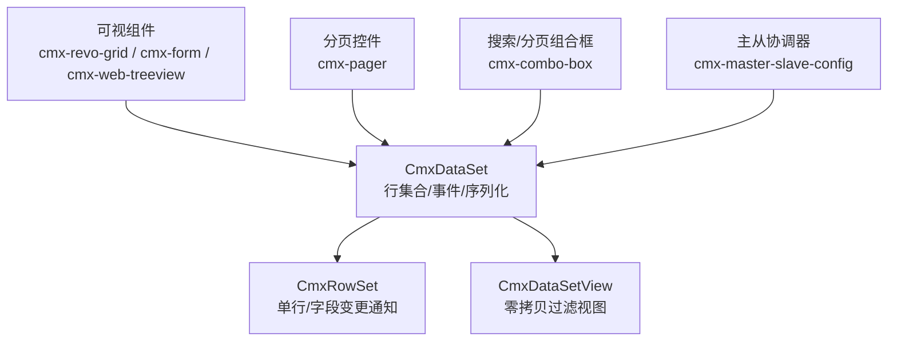
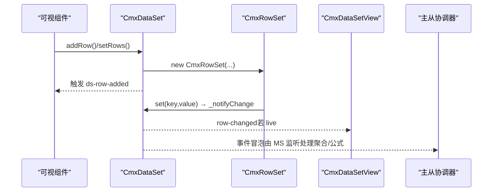
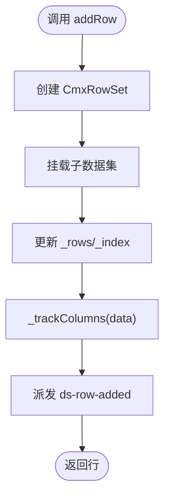
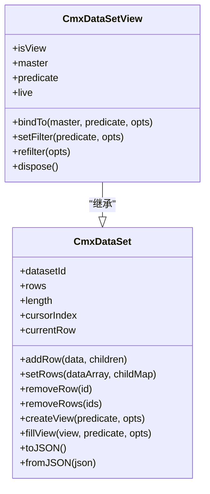
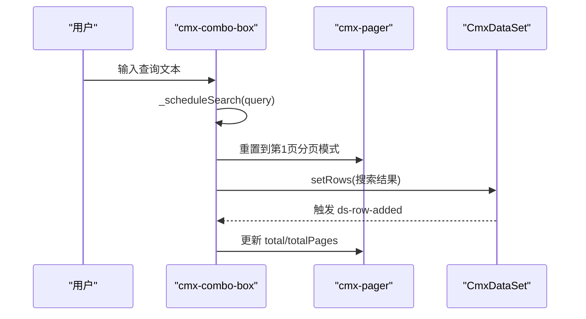
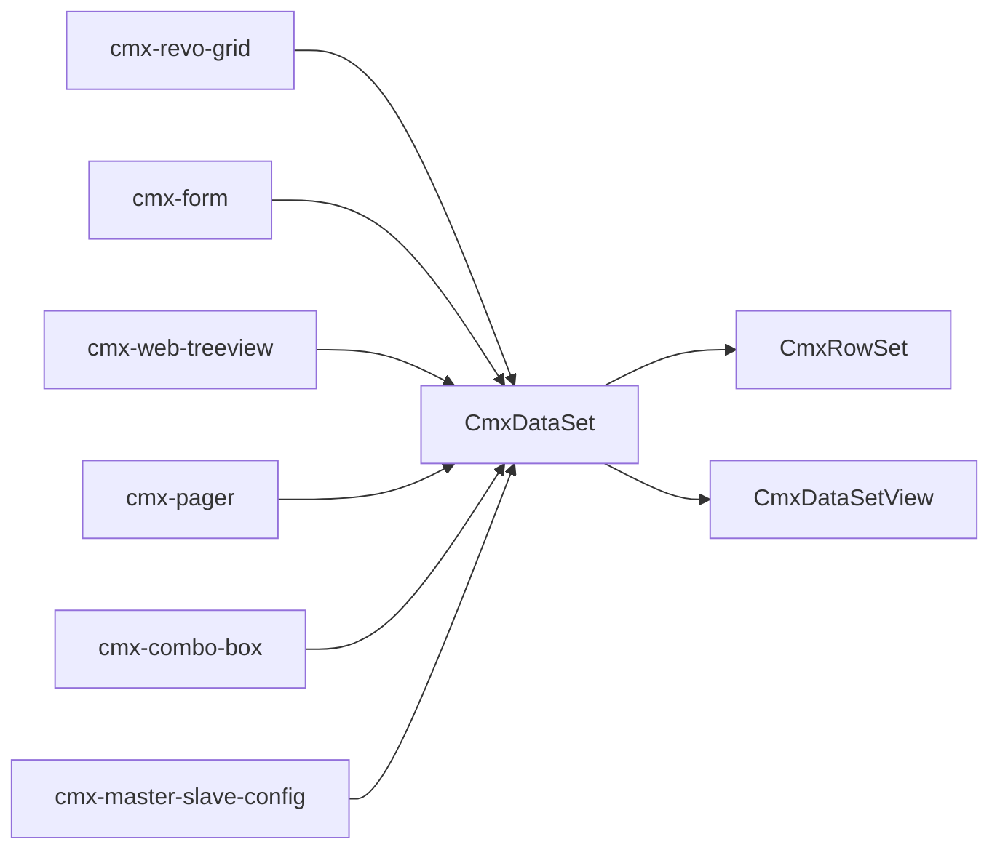

# 数据集模型（CmxDataSet）

<cite>
**本文引用的文件**
- [cmx-data-set.js](file://packages/cmx-data-comp/src/lib/cmx-data-set.js)
- [cmx-row-set.js](file://packages/cmx-data-comp/src/lib/cmx-row-set.js)
- [cmx-data-set-view.js](file://packages/cmx-data-comp/src/lib/cmx-data-set-view.js)
- [model-dataset.md](file://.agents/skills/html-page-generator/references/model-dataset.md)
- [cmx-combo-box.js](file://packages/cmx-data-comp/src/components/cmx-combo-box.js)
- [cmx-pager.js](file://packages/cmx-data-comp/src/components/cmx-pager.js)
- [cmx-master-slave-config.js](file://packages/cmx-data-comp/src/components/cmx-master-slave-config.js)
- [treeview.md](file://.agents/skills/cmx-components-guide/references/treeview.md)
</cite>

## 目录
1. [简介](#简介)
2. [项目结构](#项目结构)
3. [核心组件](#核心组件)
4. [架构总览](#架构总览)
5. [详细组件分析](#详细组件分析)
6. [依赖关系分析](#依赖关系分析)
7. [性能考量](#性能考量)
8. [故障排查指南](#故障排查指南)
9. [结论](#结论)
10. [附录](#附录)

## 简介
CmxDataSet 是 CMX 平台的前端数据模型，承担“多级树形数据行容器”的职责：它维护一组 CmxRowSet 行对象，支持父子层级（每行可挂子 CmxDataSet），提供增删改查、游标定位、事件通知、序列化/反序列化、过滤视图等能力。它与可视组件（如 cmx-revo-grid、cmx-form、cmx-web-treeview）通过声明式或命令式方式绑定，配合分页、排序与过滤能力，构成页面数据流的核心枢纽。

## 项目结构
围绕 CmxDataSet 的关键代码分布在以下位置：
- 数据模型与行容器：cmx-data-set.js、cmx-row-set.js
- 过滤视图：cmx-data-set-view.js
- 可视组件绑定与使用示例：model-dataset.md、treeview.md
- 分页与搜索集成：cmx-combo-box.js、cmx-pager.js
- 主从协调器（用于复杂主从场景）：cmx-master-slave-config.js

图表来源
- [cmx-data-set.js:37-416](file://packages/cmx-data-comp/src/lib/cmx-data-set.js#L37-L416)
- [cmx-row-set.js:10-53](file://packages/cmx-data-comp/src/lib/cmx-row-set.js#L10-L53)
- [cmx-data-set-view.js:92-248](file://packages/cmx-data-comp/src/lib/cmx-data-set-view.js#L92-L248)
- [cmx-pager.js:194-229](file://packages/cmx-data-comp/src/components/cmx-pager.js#L194-L229)
- [cmx-combo-box.js:1282-1346](file://packages/cmx-data-comp/src/components/cmx-combo-box.js#L1282-L1346)
- [cmx-master-slave-config.js:1-65](file://packages/cmx-data-comp/src/components/cmx-master-slave-config.js#L1-L65)

章节来源
- [cmx-data-set.js:37-416](file://packages/cmx-data-comp/src/lib/cmx-data-set.js#L37-L416)
- [model-dataset.md:14-241](file://.agents/skills/html-page-generator/references/model-dataset.md#L14-L241)

## 核心组件
- CmxDataSet：数据集主体，负责行集合、索引、游标、事件派发、序列化、过滤视图创建与填充。
- CmxRowSet：单行容器，字段值直接作为实例属性，修改走 set/setValues 统一入口并向上通知。
- CmxDataSetView：基于 CmxDataSet 的过滤视图，零拷贝引用主集行，支持 live 同步与声明式条件过滤。
- 可视组件绑定：cmx-revo-grid、cmx-form、cmx-web-treeview 通过 data-cmx-dataset-id 或命令式 API 绑定数据集。
- 分页与搜索：cmx-pager 提供分页信息；cmx-combo-box 在本地或远端模式下进行分页与搜索。

章节来源
- [cmx-data-set.js:37-416](file://packages/cmx-data-comp/src/lib/cmx-data-set.js#L37-L416)
- [cmx-row-set.js:10-53](file://packages/cmx-data-comp/src/lib/cmx-row-set.js#L10-L53)
- [cmx-data-set-view.js:92-248](file://packages/cmx-data-comp/src/lib/cmx-data-set-view.js#L92-L248)
- [model-dataset.md:152-185](file://.agents/skills/html-page-generator/references/model-dataset.md#L152-L185)
- [cmx-pager.js:194-229](file://packages/cmx-data-comp/src/components/cmx-pager.js#L194-L229)
- [cmx-combo-box.js:1282-1346](file://packages/cmx-data-comp/src/components/cmx-combo-box.js#L1282-L1346)

## 架构总览
CmxDataSet 作为数据中枢，向上为可视组件提供稳定接口，向下与主从协调器、分页控件、搜索组件协作。行变更通过事件机制传播，视图层可订阅并刷新。

图表来源
- [cmx-data-set.js:82-108](file://packages/cmx-data-comp/src/lib/cmx-data-set.js#L82-L108)
- [cmx-row-set.js:30-43](file://packages/cmx-data-comp/src/lib/cmx-row-set.js#L30-L43)
- [cmx-data-set-view.js:164-201](file://packages/cmx-data-comp/src/lib/cmx-data-set-view.js#L164-L201)

## 详细组件分析

### CmxDataSet：行集合、游标、事件与序列化
- 行写入：addRow 创建 CmxRowSet，建立父子关系，维护 _rows/_index，追踪列键，派发 ds-row-added。
- 批量写入：setRows 清空重建，保留子数据集映射，重置游标并派发 cursor-changed。
- 删除：removeRow/removeRows 更新索引与游标，派发 ds-row-removed 与必要的 cursor-changed。
- 读取：getRow(rows/row/length)，按 id O(1) 查找。
- 游标：moveTo/moveFirst/moveLast/moveNext/movePrev/moveToId，内部 _setCursor 派发 cursor-changed。
- 变更通知：_notifyChange 派发 row-changed，供上层（如主从协调器）监听执行公式与聚合。
- 过滤视图：createView/fillView 创建或复用 CmxDataSetView，支持函数或声明式条件，live 模式自动同步。
- 序列化：toJSON/exportKeyValue/exportColumnar/fromJSON，支持 total 字段用于分页。

图表来源
- [cmx-data-set.js:82-94](file://packages/cmx-data-comp/src/lib/cmx-data-set.js#L82-L94)

章节来源
- [cmx-data-set.js:37-416](file://packages/cmx-data-comp/src/lib/cmx-data-set.js#L37-L416)

### CmxRowSet：单行容器与字段变更通知
- 字段存储：直接以实例属性保存，无 Proxy，利于 V8 优化。
- 变更入口：set/setValues 统一写字段，并通过 _ds._notifyChange 向上通知。
- 导出：toPlainObject 过滤内部属性，便于序列化和传输。

章节来源
- [cmx-row-set.js:10-53](file://packages/cmx-data-comp/src/lib/cmx-row-set.js#L10-L53)

### CmxDataSetView：零拷贝过滤视图
- 零拷贝：视图仅持有主集 CmxRowSet 引用，内存占用低。
- 成员资格：predicate(row)=>boolean，支持函数或声明式条件（eq/ne/gt/ge/lt/le/in/nin/contains/startsWith/endsWith/between/empty/notEmpty/expr）。
- Live 同步：订阅主集的 ds-row-added/ds-row-removed/row-changed，动态加入/移出/转发变更。
- 写操作委托：addRow/removeRow 委托给主集，保证数据所有权一致。
- 生命周期：bindTo/refilter/setFilter/dispose 管理绑定与资源释放。

图表来源
- [cmx-data-set.js:37-416](file://packages/cmx-data-comp/src/lib/cmx-data-set.js#L37-L416)
- [cmx-data-set-view.js:92-248](file://packages/cmx-data-comp/src/lib/cmx-data-set-view.js#L92-L248)

章节来源
- [cmx-data-set-view.js:1-249](file://packages/cmx-data-comp/src/lib/cmx-data-set-view.js#L1-L249)

### 可视组件绑定机制
- 声明式绑定：通过 data-cmx-dataset-id 将 cmx-revo-grid/cmx-form 与数据集关联；主从模式下使用 schema 路径绑定。
- 命令式绑定：在 pageFn 中通过 grid.setDataSet(ds)、form.bindForm(msPath) 等方式手动绑定。
- 树视图：cmx-web-treeview 通过 setDataSet 绑定，根据 model 配置显示标题、图标、角标与选中态。

章节来源
- [model-dataset.md:152-185](file://.agents/skills/html-page-generator/references/model-dataset.md#L152-L185)
- [model-dataset.md:203-241](file://.agents/skills/html-page-generator/references/model-dataset.md#L203-L241)
- [treeview.md:1-25](file://.agents/skills/cmx-components-guide/references/treeview.md#L1-L25)

### 数据源配置与加载流程
- dataSource：指向 pageService 名称，运行时由 pageFn 主动喂数或可视组件按 dataSourceEvent 时机触发。
- 三种数据来源模板：pageService 动态拉取、静态 rows、空数据集（运行时 addRow/setRows）。
- 子数据集：父行 addRow 时同时为子 DataSet 创建占位，形成树形结构。

章节来源
- [model-dataset.md:14-88](file://.agents/skills/html-page-generator/references/model-dataset.md#L14-L88)
- [model-dataset.md:90-115](file://.agents/skills/html-page-generator/references/model-dataset.md#L90-L115)

### 分页策略与搜索
- 分页控件：cmx-pager 提供 page/pageSize/total/totalPages/offset 等信息，支持跳转与按钮状态控制。
- 搜索与分页：cmx-combo-box 支持本地过滤与远端搜索，搜索时重置到第 1 页，防抖触发 _runSearch。
- 数据集 total：CmxDataSet.total 用于后端 count_total=true 时的总行数展示与计算。

图表来源
- [cmx-combo-box.js:1282-1346](file://packages/cmx-data-comp/src/components/cmx-combo-box.js#L1282-L1346)
- [cmx-pager.js:194-229](file://packages/cmx-data-comp/src/components/cmx-pager.js#L194-L229)
- [cmx-data-set.js:53-58](file://packages/cmx-data-comp/src/lib/cmx-data-set.js#L53-L58)

章节来源
- [cmx-combo-box.js:1282-1346](file://packages/cmx-data-comp/src/components/cmx-combo-box.js#L1282-L1346)
- [cmx-pager.js:194-229](file://packages/cmx-data-comp/src/components/cmx-pager.js#L194-L229)
- [cmx-data-set.js:53-58](file://packages/cmx-data-comp/src/lib/cmx-data-set.js#L53-L58)

### 排序与过滤功能
- 本地过滤：cmx-combo-box 支持本地过滤，按标题列或全字段匹配，预写派生字段后 setRows。
- 声明式过滤：CmxDataSetView 支持多种操作符与表达式，适合复杂筛选场景。
- 排序：通常由可视组件或后端实现；前端可通过视图过滤与自定义逻辑辅助。

章节来源
- [cmx-combo-box.js:1282-1346](file://packages/cmx-data-comp/src/components/cmx-combo-box.js#L1282-L1346)
- [cmx-data-set-view.js:31-77](file://packages/cmx-data-comp/src/lib/cmx-data-set-view.js#L31-L77)

### 事件机制
- 行事件：ds-row-added、ds-row-removed。
- 游标事件：cursor-changed（当前行变化）。
- 字段事件：row-changed（某行某字段变化）。
- 视图事件：CmxDataSetView 转发上述事件，并额外派发 view-rebuilt。

章节来源
- [model-dataset.md:118-148](file://.agents/skills/html-page-generator/references/model-dataset.md#L118-L148)
- [cmx-data-set.js:92-133](file://packages/cmx-data-comp/src/lib/cmx-data-set.js#L92-L133)
- [cmx-data-set-view.js:155-158](file://packages/cmx-data-comp/src/lib/cmx-data-set-view.js#L155-L158)

### 数据流处理、批量操作与事务管理
- 数据流：可视组件 → CmxDataSet → CmxRowSet → 事件 → 视图/主从协调器 → 渲染更新。
- 批量操作：setRows/removeRows 批量更新，减少事件风暴；removeRows 统一派发 cursor-changed。
- 事务管理：前端通过 CmxMasterSlave 协调器组织主从数据与聚合；后端文档描述了 save_batch 的大事务与逐单事务策略，确保一致性。

章节来源
- [cmx-data-set.js:96-147](file://packages/cmx-data-comp/src/lib/cmx-data-set.js#L96-L147)
- [cmx-master-slave-config.js:1-65](file://packages/cmx-data-comp/src/components/cmx-master-slave-config.js#L1-L65)

## 依赖关系分析
- CmxDataSet 依赖 CmxRowSet 表示行，依赖 CmxDataSetView 提供过滤视图。
- 可视组件依赖 CmxDataSet 提供的 rows/事件/序列化能力。
- 分页与搜索组件通过 CmxDataSet 的 setRows/total 协同工作。
- 主从协调器通过事件监听与路径绑定，统一管理多层数据集。

图表来源
- [cmx-data-set.js:37-416](file://packages/cmx-data-comp/src/lib/cmx-data-set.js#L37-L416)
- [cmx-row-set.js:10-53](file://packages/cmx-data-comp/src/lib/cmx-row-set.js#L10-L53)
- [cmx-data-set-view.js:92-248](file://packages/cmx-data-comp/src/lib/cmx-data-set-view.js#L92-L248)
- [cmx-pager.js:194-229](file://packages/cmx-data-comp/src/components/cmx-pager.js#L194-L229)
- [cmx-combo-box.js:1282-1346](file://packages/cmx-data-comp/src/components/cmx-combo-box.js#L1282-L1346)
- [cmx-master-slave-config.js:1-65](file://packages/cmx-data-comp/src/components/cmx-master-slave-config.js#L1-L65)

章节来源
- [cmx-data-set.js:37-416](file://packages/cmx-data-comp/src/lib/cmx-data-set.js#L37-L416)
- [cmx-data-set-view.js:92-248](file://packages/cmx-data-comp/src/lib/cmx-data-set-view.js#L92-L248)

## 性能考量
- 零拷贝视图：CmxDataSetView 仅持有行引用，避免重复数据复制，降低内存与渲染开销。
- 快速路径：fromJSON 批量构建行时跳过逐行事件与列扫描，提升大数据量导入性能。
- 索引优化：_index 使用 Map，id 统一字符串化，O(1) 查找，避免跨类型主键问题。
- 事件合并：批量删除/设置时集中派发 cursor-changed，减少 UI 重绘次数。
- 建议：
  - 大列表优先使用分页与虚拟滚动（结合可视组件）。
  - 使用 createView/fillView 做复杂筛选，避免多次 setRows。
  - 合理设置 pageSize 与 debounceMs，平衡交互与网络压力。

章节来源
- [cmx-data-set.js:372-410](file://packages/cmx-data-comp/src/lib/cmx-data-set.js#L372-L410)
- [cmx-data-set-view.js:1-26](file://packages/cmx-data-comp/src/lib/cmx-data-set-view.js#L1-L26)
- [cmx-combo-box.js:1336-1346](file://packages/cmx-data-comp/src/components/cmx-combo-box.js#L1336-L1346)

## 故障排查指南
- 主键类型不一致导致删除失败：确保 id 统一字符串化，避免 Map 查找失败。
- 视图未更新：检查 CmxDataSetView 是否启用 live 模式，或手动调用 refilter。
- 分页显示异常：确认后端返回 total，且 cmx-pager 的 total 属性正确设置。
- 绑定失效：检查 data-cmx-dataset-id 是否与 dataset.datasetId 一致；主从模式下使用 schema 路径绑定。
- 事件未触发：确认 addRow/setRows/removeRow 被调用，且未禁用事件监听。

章节来源
- [cmx-data-set.js:82-133](file://packages/cmx-data-comp/src/lib/cmx-data-set.js#L82-L133)
- [cmx-data-set-view.js:164-201](file://packages/cmx-data-comp/src/lib/cmx-data-set-view.js#L164-L201)
- [cmx-pager.js:194-229](file://packages/cmx-data-comp/src/components/cmx-pager.js#L194-L229)
- [model-dataset.md:152-185](file://.agents/skills/html-page-generator/references/model-dataset.md#L152-L185)

## 结论
CmxDataSet 提供了强大而灵活的数据管理能力，结合 CmxRowSet 的行级变更通知、CmxDataSetView 的零拷贝过滤视图、以及可视组件的声明式/命令式绑定，形成了高效、可扩展的前端数据流体系。通过合理的分页、搜索与事件设计，能够支撑复杂业务场景下的表格、表单与树形展示需求。

## 附录
- 数据源配置示例：参考 model-dataset.md 中的三种模板与最小完整示例。
- 最佳实践：
  - 使用 createView/fillView 进行复杂筛选，避免频繁 setRows。
  - 大列表启用分页，合理设置 pageSize 与 debounceMs。
  - 主从场景优先使用 CmxMasterSlave 协调器，统一管理与聚合。
- 常见问题：
  - 主键类型不一致：统一字符串化 id。
  - 视图不同步：启用 live 或手动 refilter。
  - 分页不生效：确认后端 total 与 cmx-pager 配置。

章节来源
- [model-dataset.md:32-88](file://.agents/skills/html-page-generator/references/model-dataset.md#L32-L88)
- [model-dataset.md:203-241](file://.agents/skills/html-page-generator/references/model-dataset.md#L203-L241)